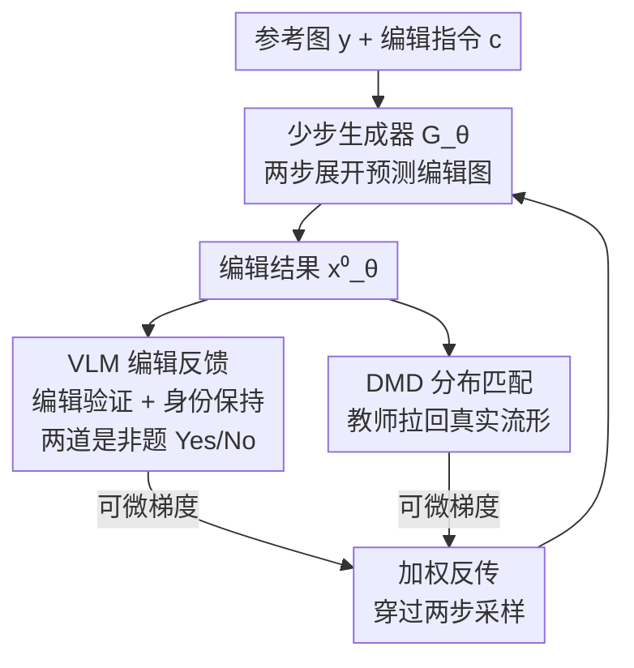

# Learning an Image Editing Model without Image Editing Pairs

**会议**: ICLR 2026  
**OpenReview**: [https://openreview.net/forum?id=OHqZ61ZqNO](https://openreview.net/forum?id=OHqZ61ZqNO)  
**代码**: 无  
**领域**: 扩散模型 / 图像编辑  
**关键词**: 图像编辑, 无配对训练, VLM 反馈, 分布匹配蒸馏, 少步扩散

## 一句话总结
本文提出 NP-Edit（No-Pair Edit），一种**完全不需要"编辑前-编辑后"配对数据**的图像编辑训练范式：在训练中展开少步扩散生成器、用视觉语言模型（VLM）的可微梯度反馈判断"是否执行了指令、是否保住了无关内容"，再叠加分布匹配损失（DMD）把输出拉回真实图像流形；在 4 步采样设定下与一众用大规模配对数据监督训练的编辑模型打平，并超过同样用 VLM 当奖励的 RL 方法 Flow-GRPO。

## 研究背景与动机

**领域现状**：指令式图像编辑（"把背景换成草地""删掉那只狗"）目前主流靠监督微调——准备大量"输入图 + 指令 + 目标编辑图"三元组，让模型学从输入到目标的映射。

**现有痛点**：这种**配对数据本身极难规模化获取**。真实世界几乎不存在像素对齐的"同一张图编辑前后"成对样本，于是大家退而求其次：① 用预训练模型零样本合成编辑对（InstructPix2Pix 路线），但合成数据会把基模型的瑕疵（artifacts）原封不动甚至放大地"遗传"给最终模型，而且基模型一升级合成数据就过时；② 从视频抽帧标注差异，但受限于自然视频里变换的多样性，且很难拿到像素对齐的前后帧；③ 人工制作，费力且不可扩展。

**核心矛盾**：编辑任务的监督信号天然以"目标图像"形式存在，而**目标图像恰恰是最难拿到的东西**——一旦用合成目标图，模型质量就被合成器的天花板和瑕疵锁死。

**本文目标**：彻底绕开"目标编辑图"这个监督形式，转而寻找一种不依赖像素级 ground-truth 的监督来源。

**切入角度**：VLM 具备通用的图像理解能力，能直接"看图回答"——既然如此，与其给模型一张目标图让它去拟合，不如让 VLM 当裁判，回答"这次编辑成功了吗、无关内容动了吗"，并把这个判断的**梯度**直接回传给生成器。这把"需要目标图"换成了"只需要一个能打分的 VLM"。

**核心 idea**：用 VLM 的**可微反馈**取代配对监督——把编辑成功与否变成 VLM 对一组是非问题的 Yes/No 概率，端到端反传梯度优化少步生成器，同时用 DMD 把输出约束在真实图像分布内。

## 方法详解

### 整体框架
NP-Edit 要做的事是：拿一个预训练的文生图扩散模型 $G_{init}$，**不用任何编辑目标图**，把它微调成一个 4 步的图像编辑模型 $G_\theta$。训练数据只有"参考图 $y$ + 编辑指令 $c$ + 两条描述文本（参考图描述 $c^y$、编辑后描述 $c^x$）"，**没有编辑后的真值图像 $x$**。

整体流程是这样转的：给定参考图和指令，生成器从噪声出发、用一个**两步展开**的过程预测出一张编辑结果 $x_\theta^0$；这张结果分别送进两个监督信号——一个是 **VLM 编辑损失**，让 VLM 看图回答"编辑做对了没、原图内容保住了没"，把是非题的对错概率变成可微梯度；另一个是 **DMD 分布匹配损失**，用预训练文生图教师模型把生成分布拉回真实图像流形、防止画崩。两路损失加权后一起反传，梯度要穿过两步采样过程。此外还有个辅助网络 $A_\phi$ 专门估计当前生成器的输出分布，供 DMD 使用，它与 $G_\theta$ 交替更新。

### 关键设计

**1. 两步展开的少步生成器：在没有真值图的情况下造出可被打分的中间状态**

标准扩散训练要把"真值图加噪"作为网络输入，可这里根本没有编辑真值图，无法构造这些带噪中间态；而直接让噪声一步映射到编辑图，保真度很差。NP-Edit 的解法是在训练时**展开后向扩散轨迹**，用两步采样：先让生成器从纯噪声 $\epsilon$ 预测一个临时干净图 $\hat{x}_\theta^0 = \epsilon - \hat{v}_\theta$（其中 $\hat{v}_\theta \equiv G_\theta(\epsilon, t{=}1, c, y)$）；再把它按时间步 $t$ 重新插值加噪成 $\hat{x}_\theta^t = (1-t)\hat{x}_\theta^0 + t\epsilon$ 喂回模型，得到精修结果 $x_\theta^0 = \hat{x}_\theta^t - t v_\theta$。这样模型就被训练在由 $t$ 决定的带噪中间态上，又比完整反向展开高效得多。论文聚焦 4 步生成，把第二步的 $t$ 限制在固定调度 $[t_1, t_2, t_3]$ 上。这一步之所以关键，是因为**少步生成器在中间步能给出更清晰的去噪估计 $x_\theta^0$**——而 VLM 在输入模糊/带噪时判断会很不可靠，清晰的中间结果才能让 VLM 反馈真正有效，同时还顺带降低了推理和训练成本。

**2. VLM 可微编辑反馈：把"编辑成功与否"变成对是非题 logit 的二元交叉熵**

要在没有目标图时知道"编得对不对"，NP-Edit 让 VLM 对每个编辑类别回答一组预设的是非题。VLM 被要求只答 Yes/No，损失定义为预测 logit 之差上的二元交叉熵：$\mathcal{L}_{\text{VLM}} = -\sum_j \log p(a_j)$，其中 $p(a_j) = \sigma(\ell^{(j)}_{a_j} - \ell^{(j)}_{\bar{a}_j})$，即只在 Yes 和 No 两个 token 上做归一化、取正确答案相对错误答案的 sigmoid 概率。每条指令用**两道互补的问题**：① **编辑验证问题**问"第二张图是否执行了这条编辑指令"（删除类则直接问"图里还有没有这个物体"）；② **身份保持问题**问"忽略本次编辑带来的变化，第二张图是否和第一张完全一致"，防止过度编辑、破坏无关内容。这种设计的妙处在于：损失只需对 VLM 做**单次前向**就能算出（不必自回归逐 token 生成），既快又可微；而且仅在 Yes/No 上归一化、用 BCE 而非整词表交叉熵，实测训练更稳更有效。这是首个把 VLM 的**梯度反馈**用于通用指令跟随、并蒸馏进轻量生成模型的工作（以往多是 RL 用标量奖励）。

**3. DMD 分布匹配：VLM 只管"编对没"，由教师模型管"像不像真图"**

光有 VLM 反馈会出问题——VLM 只评估指令是否被遵循，并不约束输出落在真实图像域内，单用它训练会产生不真实的图、训练最终发散。NP-Edit 引入分布匹配蒸馏（DMD），在微调模型 $G_\theta$ 与预训练文生图教师 $G_{init}$ 之间最小化 KL 散度，把生成分布对齐到教师建模的真实图像分布。其梯度可化简为 $\nabla_\theta D_{KL} = \mathbb{E}\big[-(v_{\text{real}}(x_\theta^t, t, c^x) - v_{\text{gen}}(x_\theta^t, t, c^x))\frac{dG}{d\theta}\big]$，其中 $v_{\text{real}}$ 来自冻结教师、$v_{\text{gen}}$ 来自一个随 $G_\theta$ 同步训练的辅助模型 $A_\phi$（用 flow 去噪目标在线学习生成器当前输出分布）。这条损失保证编辑结果既满足指令、又忠于教师所建模的真实图像的文本条件分布——它和 VLM 反馈是**互补的两只手**：一个保证"编得对"，一个保证"像真图"，缺一不可。

### 损失函数 / 训练策略
- **数据集**：用 Qwen2.5-32B 为每类编辑（Add / Replace / Remove / Adjust / Action / Stylization / Text / Color / Material / Background，以及定制化等自由形式任务）生成候选指令，并让 VLM 校验有效性、给出编辑后描述 $c^x$；局部编辑约 300 万张参考图，自由形式约 60 万张。
- **图像条件注入**：把参考图的 VAE 编码沿 token 序列维度拼到带噪目标编码上，让模型同时注意文本与视觉条件。
- **Warmup（身份损失）**：训练初期先用"重建拼接进来的参考图"作为目标（$\mathcal{L}_{id} = \lVert v - v_\theta\rVert$），让网络学会把参考内容传播到输出、先稳定在真实图像上，再切入主目标。
- **总损失**：生成器损失为 VLM 编辑损失与 DMD 损失的加权和 $\theta_G \leftarrow \theta_G - \eta_G\lambda_{vlm}\nabla\mathcal{L}_{\text{VLM}} - \eta_G\lambda_{dmd}\nabla D_{KL}$；辅助网络 $A_\phi$ 每更新 $N_{aux}$ 次、生成器更新 1 次。基模型为 2B 参数的内部 DiT 隐空间扩散模型，VLM 用 LLaVA-OneVision-7B。

## 实验关键数据

### 主实验

GEdit-Bench（英文子集）局部编辑，VIEScore（GPT-4o 评分，含语义一致性 SC、感知质量 PQ、二者几何平均 Overall），数值 ×10：

| 方法 | 参数量 | 步数 | SC↑ | PQ↑ | Overall↑ |
|------|--------|------|------|------|----------|
| Qwen-Image-Edit（多步上界） | 20B | 50 | 7.94 | 7.50 | 7.36 |
| FLUX.1-Kontext | 12B | 4 | 5.80 | 5.74 | 5.04 |
| Step-1X Edit v1.1 | 12B | 4 | 6.61 | 6.43 | 6.01 |
| Qwen-Image-Edit | 20B | 4 | 6.82 | 6.21 | 6.06 |
| Turbo-Edit（零样本少步） | 1B | 4 | 3.84 | 6.67 | 3.84 |
| **NP-Edit（本文）** | **2B** | **4** | 6.16 | **7.69** | **6.10** |

少步设定下 NP-Edit 拿到最高的 Overall 与 PQ；与各 baseline 的原生多步设定比，本文 4 步模型仍超过 OmniGen、并在参数量小 6 倍的情况下与 BAGEL、FLUX.1-Kontext 持平。自由形式定制化任务（DreamBooth）上，本文 8 步优于同为少步的 OminiControl、DSD、SynCD，与 FLUX.1-Kontext/Qwen-Image-Edit 在少步设定下可比。

### 消融实验

训练目标消融（GEdit-Bench，VIEScore ×10）：

| 配置 | SC↑ | PQ↑ | Overall↑ | 说明 |
|------|------|------|----------|------|
| Full model | 6.16 | 7.69 | 6.10 | 完整 NP-Edit |
| w/ only DMD | 4.93 | 7.51 | 4.93 | 去掉 VLM 损失，指令跟随能力大幅退化 |
| w/ only VLM | 2.03 | 3.48 | 1.93 | 去掉 DMD，输出不真实、训练发散 |
| w/o VLM 身份问题 | 5.70 | 7.67 | 5.76 | 去掉身份保持问题，一致性变差 |
| w/ 标准 CE 损失 | 5.95 | 7.64 | 5.89 | 用整词表 CE 替代 Yes/No 二元 CE，掉点 |

数据/VLM 规模 + 对比 RL（GEdit-Bench ×10）：

| 配置 | SC↑ | PQ↑ | Overall↑ |
|------|------|------|----------|
| 1% 数据 | 4.41 | 7.10 | 4.66 |
| 50% 数据 | 5.41 | 7.73 | 5.52 |
| 100% 数据 | 6.16 | 7.69 | 6.10 |
| LLaVA-0.5B | 4.57 | 7.50 | 4.59 |
| LLaVA-7B（本文） | 6.16 | 7.69 | 6.10 |
| SFT | 3.91 | 5.70 | 3.64 |
| SFT + RL（Flow-GRPO） | 4.55 | 5.47 | 4.19 |
| SFT + Ours | 6.08 | 7.83 | 6.06 |

### 关键发现
- **VLM 损失和 DMD 缺一不可**：只留 DMD（4.93）丢掉了指令跟随、删除类任务尤其崩；只留 VLM（1.93）画面不真实、训练发散。两者互补才撑起 6.10。
- **二元 CE + 身份问题都有正贡献**：换成整词表 CE 掉到 5.89，去掉身份保持问题掉到 5.76，说明"只在 Yes/No 上归一化"和"显式查一致性"这两个细节都实打实有效。
- **随数据和 VLM 规模单调上升**：1%→50%→100% 数据 Overall 从 4.66 涨到 6.10；VLM 从 0.5B 换到 7B、InternVL-2B 换到 14B 都涨——方法有清晰的可扩展性，强 VLM 越多越受益。
- **在同一 VLM 奖励下胜过 RL**：本文(6.10) 远超 SFT(3.64) 和 SFT+RL(4.19)，且无需任何配对监督；先用少量配对数据 SFT 再叠加本文（SFT+Ours, 6.06）能略微改善像素级一致性，但量化分数相近。

## 亮点与洞察
- **把"难拿的目标图"换成"好拿的裁判 VLM"**：编辑任务的瓶颈一直是配对数据，本文从监督**形式**上动刀——不是去拟合目标图，而是让 VLM 回答是非题并反传梯度，从根上绕开了配对数据的不可扩展性。
- **可微 VLM 反馈 vs RL 奖励**：以往 VLM 当裁判几乎都走 RL（标量奖励、需要好初始化、要先 SFT）。本文直接用 VLM 的 logit 差做 BCE 拿可微梯度，省掉 SFT 初始化、训练更直接，且实测打过 Flow-GRPO——这是"可微反馈"相对"RL 奖励"的一次有说服力的对照。
- **单前向算损失的工程巧思**：编辑损失只需对 VLM 做一次前向、取 Yes/No 两个 token 的 logit，避免了自回归生成，既快又稳；"只在 Yes/No 上归一化"这个小细节贡献了可观点数。
- **两步展开解决"没有真值就没有带噪输入"**：用少步生成器先出一个清晰中间图，再加噪喂回，既造出了可训练的中间态，又保证 VLM 拿到的是清晰图、判断可靠——把"少步生成"和"VLM 反馈"两个需求一并满足。

## 局限与展望
- **缺像素级监督带来细节漂移**：没有真值约束，编辑可能在细粒度细节上偏离输入、或保不住主体身份；附录显示加 LPIPS 感知相似损失能缓解，但常以牺牲编辑质量为代价。
- **强依赖 VLM 的能力与偏见**：方法效果直接被 VLM 的判断力和偏好绑定，VLM 看错就学错。
- **VRAM 开销**：训练时需把 VLM 常驻显存，带来显著显存压力，作者寄望于更强更高效的 VLM 出现。
- **自评仅用单一 VLM 家族当裁判**：训练裁判（LLaVA-OneVision）与部分评测可能存在偏好耦合，跨裁判鲁棒性还需更多验证（笔者观察）。

## 相关工作与启发
- **vs 合成配对数据（InstructPix2Pix 路线）**: 他们用预训练模型零样本合成"编辑前后对"再监督训练，本文完全不造目标图。区别在于本文不会继承/放大合成器瑕疵，也不会随基模型升级而过时——代价是失去像素级精确监督。
- **vs RL 后训练（Flow-GRPO / EARL）**: 他们用 VLM 当奖励、走 RL，通常需要先 SFT 一个不错的初始化。本文用 VLM 的**可微梯度**而非标量奖励，免去 SFT 阶段，且在同一 VLM 下分数更高、保真更好。
- **vs 少步蒸馏（DMD/一致性模型）**: 它们把多步教师蒸馏成少步学生以提速。本文借用 DMD 作为"保真锚"，但叠加 VLM 反馈赋予模型新的编辑能力，而非单纯复刻教师——DMD 在这里是手段而非目的。

## 评分
- 新颖性: ⭐⭐⭐⭐⭐ 首个用 VLM 可微梯度反馈、完全无配对训练通用图像编辑模型，监督范式有本质创新。
- 实验充分度: ⭐⭐⭐⭐ 两类任务 + 训练目标/数据规模/VLM 规模/对比 RL 的完整消融，扎实；缺多裁判鲁棒性与更大基模型验证。
- 写作质量: ⭐⭐⭐⭐ 动机清晰、方法与算法伪代码完整，公式齐备。
- 价值: ⭐⭐⭐⭐⭐ 直击编辑领域配对数据瓶颈，且随 VLM/数据规模可扩展，路线有很强延展性。

<!-- RELATED:START -->

## 相关论文

- [\[ICLR 2026\] EditReward: A Human-Aligned Reward Model for Instruction-Guided Image Editing](editreward_a_human-aligned_reward_model_for_instruction-guided_image_editing.md)
- [\[ICLR 2026\] Visual Autoregressive Modeling for Instruction-Guided Image Editing](visual_autoregressive_modeling_for_instruction-guided_image_editing.md)
- [\[CVPR 2026\] Leveraging Verifier-Based Reinforcement Learning in Image Editing](../../CVPR2026/image_generation/leveraging_verifier-based_reinforcement_learning_in_image_editing.md)
- [\[ICLR 2026\] ChronoEdit: Towards Temporal Reasoning for In-Context Image Editing and World Simulation](chronoedit_towards_temporal_reasoning_for_in-context_image_editing_and_world_sim.md)
- [\[ICLR 2026\] FlowAlign: Trajectory-Regularized, Inversion-Free Flow-based Image Editing](flowalign_trajectory-regularized_inversion-free_flow-based_image_editing.md)

<!-- RELATED:END -->
