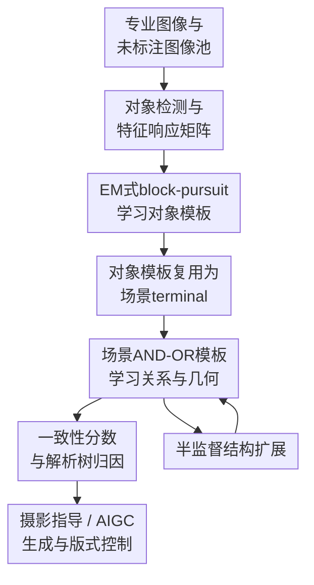

# Learning AND-OR Templates for Compositional Representation in Art and Design

**会议**: ICLR 2026  
**OpenReview**: [https://openreview.net/forum?id=cJ4h1FhChe](https://openreview.net/forum?id=cJ4h1FhChe)  
**代码**: 无  
**领域**: 图像生成 / 可解释视觉表示 / 艺术与设计  
**关键词**: AND-OR模板, 组合表示, 可解释审美评分, 半监督结构学习, AIGC结构控制  

## 一句话总结
本文把 AND-OR Template 从物体识别扩展到艺术与设计中的场景构图，用最大熵 log-linear 模型给出可分解的一致性分数，并通过 EM 式 block-pursuit 与半监督结构扩展学习可解释模板，在审美分类、人类偏好对齐、摄影指导和 AIGC 构图约束上展示了轻量、可解释且数据高效的结构先验。

## 研究背景与动机
**领域现状**：视觉美学评估、摄影构图建议和设计生成辅助现在大多依赖深度模型。VGG、ResNet、ViT 这类 backbone 能从大规模标注里学到有效判别特征，扩散或多模态生成模型也能根据文本提示生成漂亮图像，但它们通常把“画面为什么好看”“哪里应该调整”压进隐空间，输出的是分数或图像，而不是一条可检查的结构证据链。

**现有痛点**：艺术和设计里的很多规律并不是单个物体是否存在，而是物体、局部部件、相对位置、尺度、朝向和几何关系共同形成的构图结构。例如“河流环绕山体”不是检测到河和山就够，还要知道中间山、左右山、河流分段之间的位置关系是否成立。黑盒深度模型能拟合评分，却很难告诉用户“缺的是哪个部件”“哪个关系被破坏”“应该怎么移动或缩放”。

**核心矛盾**：审美判断需要同时满足两件事：一方面要有足够强的表示能力，能覆盖不同主题、不同构图变体；另一方面又要能被设计师或摄影师读懂，并转化为可执行的修改建议。纯手工规则可解释但覆盖窄，纯深度特征准确但不可解释，二者之间缺少一个能复用结构、能学习变体、还能逐项归因的中间表示。

**本文目标**：作者希望学习一种面向艺术与设计的组合结构模板：第一，能从少量专业摄影作品中抽取主题级构图规律；第二，能把物体级模板复用到场景级模板，避免从像素小部件直接枚举场景导致组合爆炸；第三，能用同一个一致性分数完成训练选择、测试评估、解释归因和生成约束；第四，能从未标注高质量图像中继续扩展结构分支。

**切入角度**：论文选择了经典 AND-OR Template。AND 节点负责表达必须共同满足的部件与几何约束，OR 节点负责表达合法的结构或几何替代方案，terminal 节点负责承载可观测的图像 primitive、颜色、纹理、平坦度等统计属性。这个表示天然适合“构图范式”：同一个主题可以有多种等价布局，但每种布局内部又有明确的组成关系。

**核心 idea**：用“对象模板 -> 场景模板”的两级 AND-OR 结构表示构图规律，再用最大熵 log-linear 模型把模板匹配写成可分解的信息增益分数，从而让审美评估、结构解释和 AIGC 构图指导共用同一套可学习的组合先验。

## 方法详解

### 整体框架
本文方法可以理解为一条从专业图像到结构模板，再到评分、解释和生成控制的 pipeline。输入是按主题收集的少量专业摄影/设计图像，以及一个未标注扩展池；输出是对象级和场景级 AND-OR 模板、图像与模板之间的一致性分数、解析树，以及面向摄影或 AIGC 的结构建议。

先在图像中检测/分割对象，构造候选 terminal 与特征响应矩阵；随后用 EM 式 block-pursuit 学出对象模板；再把对象模板当成场景 terminal，继续学习场景模板中的跨对象关系和全局几何约束。训练后，一张测试图像会被递归解析到模板上，激活的 terminal、满足或违反的关系都会贡献到一个 log-likelihood gain 分数里。半监督阶段则把现有模板拿去解释未标注图像，只有当匹配增益和结构一致性满足阈值时，才把新配置并入模板。

### 关键设计
**1. 两级 AND-OR 模板：把局部部件复用到场景构图**

这篇论文最重要的结构选择，是不直接在场景层枚举所有细碎部件，而是先学习对象级模板，再把对象模板当成场景级 terminal。对象模板内部可以包含部件分段、局部纹理、颜色直方图、位置、尺度和朝向；场景模板则把“山”“河”“建筑立面”“海湾”等对象作为更高层元素，学习它们之间的相对位置、尺度兼容和布局变体。

这种设计解决的是组合爆炸问题。若把每个山体分段、河流分段都提升为场景元素，场景 OR 分支会迅速膨胀，学习到的结构也很难解释。论文中的“river surrounding mountains”示例就是典型情况：中间山、左右山和河流各自可再分段，但场景层只需要知道这些对象模板如何共同组成一个构图范式。AND 节点保证一组部件和关系必须同时成立，OR 节点则保留合法变体，最终得到的是“可重组但不失控”的构图表示。

**2. 统一一致性分数：把好坏判断写成相对参考分布的信息增益**

作者没有把模板匹配只做成一个启发式分数，而是在最大熵 log-linear 框架下定义一致性分数。给定参考自然图像分布 $q(I)$，模型通过一组选择出的特征逐步重加权，得到目标主题分布 $p(I)$。模板与图像的一致性被定义为 log-likelihood ratio：

$$
Score(I)=\log \frac{p(I\mid s,g,\beta)}{q(I)}=\sum_{k=1}^{K} Score(PAT_k,I).
$$

其中 $s$ 是结构选择，$g$ 是几何配置，$PAT_k$ 是被激活的 photography art template。每个 terminal 的贡献进一步写成 $Score(PAT_k,I)=s_k(\sum_j \beta_{k,j}r_j(I)-\log Z_k)$。这样做的好处是，最终分数不是一个不可解释的黑盒输出，而是能拆成对象、关系、几何等证据项：哪个部件提高了分数、哪个几何关系拖低了分数，都可以沿解析树回看。

更关键的是，这个分数同时服务多个环节。训练时，它用于选择高收益 block 和剪枝；测试时，它用于分类、排序和人类偏好相关性分析；应用时，它能把负贡献映射成“移动对象”“调整尺度”“补充缺失元素”之类的 prescription。论文所谓 evidence-to-prescription，本质上就是让评分项与可执行编辑动作共享同一套结构语义。

**3. EM式block-pursuit：用稀疏和局部互斥约束控制模板生长**

学习阶段从响应矩阵 $R\in[0,1]^{N\times D}$ 出发，行是训练样本，列是候选特征，元素 $R_{ij}=r_j(I_i)$ 表示某个特征在某张图里的响应强度。E-step 在当前模板下做 terminal matching、关系实例化和几何搜索，在局部窗口里搜索平移、缩放、旋转，并保留满足 AND 约束的组合；M-step 则寻找高响应、高信息增益的 block，把它们加入模板或用来细化约束。

一个 block 的意义类似“在一批样本里稳定出现的一组局部特征”。论文用 penalized marginal gain 来决定是否加入新特征或新分支，同时加入两类约束：稀疏正则避免模板越来越臃肿，局部互斥约束要求同一图像、同一区域最多激活一个 block，避免多个相似 terminal 反复解释同一证据。停止条件也围绕边际信息增益、结构大小和验证分数改进设定，保证模板不是越大越好，而是在可解释复杂度内吸收最有用的结构。

这套学习策略适合小样本艺术设计场景。专业摄影主题样本通常不可能像 ImageNet 那样巨大，但结构规律又很稳定；block-pursuit 用“高频稳定共现 + 信息增益”挑出 reusable primitives，比端到端训练大网络更节省数据和参数。

**4. 半监督结构扩展：只从能被结构解释的新图像中长出新分支**

半监督部分的目标不是简单吞掉未标注数据，而是在现有模板无法充分解释某些高质量样本时，谨慎扩展 AND-OR 图。算法先用已有模板匹配 AVA/AADB 或其他未标注池中的图像；如果新样本与现有模板的匹配不足，但它又满足结构一致性要求，就把它作为新的训练配置，学习新 photography template 或把新配置并入已有模板。

这里的“双阈值”很重要：matching gain 负责判断新结构是否带来足够解释增益，structural consistency 负责判断它是否仍属于可接受的主题结构。只有二者都通过，模板才扩张；冲突配置会被解决或剪枝，若新增节点收益持续不足则早停。附录中的增长曲线显示，节点数随训练图像数量呈次线性增长，说明很多节点能跨子图复用，而不是未标注数据越多模板越无限膨胀。

### 一个完整示例
以论文反复使用的“河流环绕山体”构图为例，系统首先从专业照片里检测出山体、河流等对象，并在对象层把中间山、左右山、河流进一步分成稳定的局部 PAT。对象模板学好后，场景层不再关心每个底层纹理 primitive，而是把“中间山 A”“河流 B”“左山 C”“右山 D”作为场景 terminal。

当一张新图像输入时，解析器会尝试选择一个 OR 分支：例如河流位于画面下方并环绕中间山，左右山在两侧形成包围，山体尺度与河流宽度满足某个范围。如果这些对象都被检测到，且相对位置、比例、朝向落在模板允许区间，一致性分数会得到正贡献；如果左山缺失、河流位置偏离，或者中间山尺度过大破坏包围关系，对应 terminal 或几何约束会给出负贡献。

这种解析结果可以直接变成建议：对摄影图像，它会提示“左侧缺少平衡对象”或“河流应更贴近下方引导线”；对 AIGC，它可以把模板当作轻量结构条件，要求生成器在海报或风景画面中保持指定的对象关系和几何布局。相比只写一句 prompt，这种约束更像一个可检查的构图骨架。

### 损失函数 / 训练策略
训练目标是 penalized maximum likelihood。完整似然由结构/几何先验 $p(s,g\mid Temp)$ 和图像条件似然 $p(I\mid s,g,\beta)$ 组成，后者采用最大熵 log-linear 形式。实践中，M-step 最小化 $-L(R,\beta,s,g)+penalty(\beta)$，其中 penalty 主要体现稀疏性和局部互斥。

特征选择以 block 的累计分数为核心：

$$
Score(B_k)=\sum_{i\in rows(B_k),j\in cols(B_k)}(\beta_{k,j}R_{ij}-\log z_{k,j}).
$$

学习先从高频 terminal 和稳定局部关系初始化，然后在对象层学习 $\beta(T)$ 与结构，再构造对象级特征空间 $R'$，把对象模板作为场景 terminal 继续做同样的 EM 式追逐。推理时使用递归 SUM-MAX：terminal 响应先做局部 MAX，part 层做加权 SUM，object/scene 层再按 OR 选择与 AND 约束组合，最终返回最优结构 $s$、几何 $g$ 和可分解一致性分数。

## 实验关键数据

### 主实验
论文从可靠性、可解释性、性能/效率和应用可控性四个方向验证方法。最清晰的定量结果来自 AVA 单图输入设置：对 14 个主题，每个主题选取 140 张高分图和 140 张低分图学习正负模板，测试时比较图像与两类模板的一致性分数。表中训练复杂度按论文原表记录，主要用于说明相对量级。

| 方法 | Accuracy (%) | 参数量 | 训练复杂度 | SRCC |
|------|--------------|--------|------------|------|
| Ours | 85.65 | $2.3\times10^3$ | $6.7\times10^4$ | 0.8419 |
| VGG19 (2-class) | 78.08 | $1.39\times10^8$ | $1.96\times10^{10}$ | 0.7506 |
| ResNet50 (2-class) | 85.71 | $2.35\times10^7$ | $4.09\times10^9$ | 0.7842 |
| ViT-B/16 (2-class) | 85.38 | $8.58\times10^7$ | $1.75\times10^{10}$ | 0.7590 |
| VGG19 + templates | 81.43 | $1.39\times10^8$ | $1.96\times10^{10}$ | 0.7893 |
| ResNet50 + templates | 85.87 | $2.35\times10^7$ | $4.09\times10^9$ | 0.8156 |
| ViT-B/16 + templates | 86.20 | $8.58\times10^7$ | $1.75\times10^{10}$ | 0.7855 |

一个有意思的结论是，本文方法的 accuracy 与 ResNet50、ViT-B/16 接近，但参数量小了四到五个数量级，SRCC 反而最高。这说明模板分数未必在所有分类指标上压倒深度模型，但它和人类审美标注的排序关系更一致。与深度特征 late fusion 后，VGG、ResNet、ViT 都有提升，也说明结构模板和深度表征是互补的。

论文还在 Places365 的 10 类子集上做了场景分类迁移，结果如下：

| 方法 | Top-1 Error (%) | Top-5 Error (%) | 说明 |
|------|-----------------|-----------------|------|
| Ours | 23.44 | 8.03 | 模板一致性排序预测类别 |
| Places-365-CNN | 23.27 | 8.48 | 标准深度场景模型 |
| ResNet | 23.35 | 8.61 | 深度 baseline |
| SENet | 23.67 | 8.26 | 深度 baseline |

这里本文的 Top-1 与深度模型基本持平，Top-5 更低，说明组合模板不仅适用于审美主题，也能在一般场景类别中提供有竞争力的结构匹配信号。

### 消融实验
论文的消融和分析更偏“结构可靠性验证”，不是常规 w/o module 表格。核心对照包括专家模板一致性、结构/几何扰动、主观一致性、半监督增长与人类偏好对齐。

| 配置 / 分析 | 关键指标 | 说明 |
|-------------|----------|------|
| 专家范式 vs 学习模板 | 高一致性分数 | 六类代表性构图范式中，学习模板与专家总结的结构和几何约束高度吻合 |
| 反事实结构扰动 | 一致性分数明显下降 | 替换部件或打乱关系后，模板分数下降，说明模型确实依赖结构组织而不是只看主题外观 |
| 几何 jitter 扰动 | 一致性分数明显下降 | 缩放和位置扰动会破坏分数，说明几何约束在评分中有效 |
| 专家用户研究 | 74.8% fully/mostly consistent | 100 名领域从业者对 10 个随机主题模板评分，多数认为结构有效且主题对齐 |
| 人类偏好对齐 | MSE = 0.0286 | 50 张图、2500 对 pairwise 比较、15 名艺术/设计背景评分者；一致性分数与 Bradley-Terry 潜在人类分数接近 |
| 半监督鲁棒性 | KL 在 $n=100$ 时约降到 0.1 | 两组独立样本学习出的模板在第三组测试样本上的差异较小，说明扩展过程较稳定 |
| CITD scene classification | AUC = 0.82 | 高于 HoG+SVM 的 0.71 与 LSVM 的 0.77，低于 ResNet 的 0.88，但提供解析解释 |

### 关键发现
- 模板分数最大的优势不是单纯分类 accuracy，而是“接近深度模型性能 + 更高人类排序相关 + 可解释证据链”。在 AVA 上，Ours 的 SRCC 为 0.8419，明显高于 ResNet50 的 0.7842 和 ViT-B/16 的 0.7590。
- 模板特征与深度特征有互补性。加上 templates 后，VGG19 从 78.08 提到 81.43，ResNet50 从 85.71 提到 85.87，ViT-B/16 从 85.38 提到 86.20。
- 结构扰动和几何扰动都会让一致性分数下降，说明模型不是只学到“这张图像像某个主题”，而是确实在检查部件关系与构图几何。
- 半监督学习的节点增长呈次线性，意味着模板中存在可复用节点；这对艺术设计这种主题变体多、标注成本高的场景很重要。
- AIGC 和海报生成实验更像 proof of concept：模板能作为结构条件约束生成布局，但论文也承认工业设计流程和当前生成模型可控性仍远未被系统解决。

## 亮点与洞察
- **把传统 grammar vision 重新接到生成时代的问题上**：AND-OR Template 本来更常见于对象识别和检测，本文把它用于艺术构图、摄影指导和 AIGC 结构条件，让老式可解释结构模型在新应用里获得了清晰位置。
- **一致性分数同时承担训练、评估和解释**：很多论文会分别设计训练 loss、评分器和解释模块，本文把 log-likelihood gain 做成统一接口，分数项天然对应解析树证据，减少了“模型这么判，但解释另说”的割裂。
- **两级复用是实用设计**：对象模板复用为场景 terminal 这个选择很朴素，但非常关键。它让模型能表达场景级关系，又避免在场景层直接处理所有低层 fragment，比较适合小样本主题学习。
- **对 AIGC 的启发在于结构先验而不是替代生成模型**：本文不是训练一个新扩散模型，而是把模板作为轻量结构条件、重排序目标或版式优化目标。这种外接式结构控制更容易和已有生成器结合。
- **可迁移到其他需要“结构好坏可解释”的任务**：例如 GUI 布局质量评估、广告海报自动排版、机器人场景摆放检查、建筑立面美学分析，都可以把对象-关系-几何拆成显式模板，再把负贡献变成修改建议。

## 局限与展望
- 论文依赖专业摄影作品和人工主题初始模板，虽然样本量小，但数据策展成本和专家知识仍然存在；不同文化、不同设计流派下的“好构图”可能并不共享同一套模板。
- 当前表示覆盖的是部件、关系和几何，较少建模光照、材质、色彩心理、人物情绪、文本语义等更高层审美元素。对海报、肖像、品牌设计这类任务，这些因素可能和构图同样重要。
- 半监督扩展有阈值敏感性。matching gain 与 structural consistency 的阈值如果过松，模板会吸收噪声；过紧，则难以发现新变体。论文给了鲁棒性分析，但跨领域自动调参还不充分。
- 与深度模型的比较主要展示参数效率和相关性优势，但真实创作辅助系统还需要评估交互成本、建议可采纳率、设计师满意度和迭代效率。
- AIGC 应用仍是原型验证。模板能约束结构，但与 Midjourney 等生成器之间的接口不够可控，未来如果能和布局到图像模型、scene graph 控制或扩散模型能量引导结合，会更扎实。
- 模板化创作有风格收敛风险。若系统过度推荐高分模板，可能鼓励用户复制固定构图范式，削弱探索性和文化多样性；实际产品里需要把模板当作参考，而不是唯一标准。

## 相关工作与启发
- **vs AND-OR Template / HIT**: 传统 AOT/HIT 主要服务对象识别、检测或局部图像模板学习，本文把它提升到艺术与设计的场景构图层，并引入对象模板到场景模板的两级复用，优势是更贴近设计中的跨对象关系。
- **vs DPM / pictorial structures**: DPM 和 pictorial structures 也强调部件与几何形变，但通常面向单类目标检测；本文关注的是主题构图和审美结构，终端证据不仅有外观部件，还包括颜色、纹理、平坦度和场景关系。
- **vs VGG / ResNet / ViT 审美分类器**: 深度分类器准确率强、迁移方便，但解释粒度通常停留在 saliency 或 feature attribution；本文的解析树直接对应对象、关系和几何约束，更适合生成 actionable guidance。
- **vs scene graph / attribute grammar**: Scene graph 关注对象及语义关系，attribute grammar 关注结构解析；本文更强调可评分的审美构图约束，并把得分分解成 evidence-to-prescription 的修改建议。
- **vs diffusion 控制方法**: ControlNet、布局条件、scene graph-to-image 等方法直接控制生成过程，本文则提供外部结构模板和一致性目标，可以用于提示、重排序或优化，不需要重新训练大生成模型，但控制力度也受底层生成器限制。

## 评分
- 新颖性: ⭐⭐⭐⭐☆ 把 AND-OR 模板用于艺术设计组合表示并连接 AIGC 结构控制很有启发，但核心建模仍建立在较经典的 grammar vision 框架上。
- 实验充分度: ⭐⭐⭐⭐☆ 实验覆盖 AVA、Places365 子集、CITD、用户研究、扰动和生成案例，范围较广；但 AIGC 和真实设计工作流评估仍偏原型展示。
- 写作质量: ⭐⭐⭐☆☆ 论文整体脉络清楚，公式和算法给得较完整，但部分数据集统计和半监督细节写得略松散，表述中也有少量格式与数字不够严谨之处。
- 价值: ⭐⭐⭐⭐☆ 对可解释审美评估、构图指导和生成模型结构控制有实际启发，尤其适合需要把“为什么好/怎么改”讲清楚的创意工具。

<!-- RELATED:START -->

## 相关论文

- [\[CVPR 2026\] ShadowDraw: From Any Object to Shadow-Drawing Compositional Art](../../CVPR2026/image_generation/shadowdraw_from_any_object_to_shadow-drawing_compositional_art.md)
- [\[ICLR 2026\] RIDER: 3D RNA Inverse Design with Reinforcement Learning-Guided Diffusion](rider_3d_rna_inverse_design_with_reinforcement_learning-guided_diffusion.md)
- [\[ICLR 2026\] Generalization of Diffusion Models Arises with a Balanced Representation Space](generalization_of_diffusion_models_arises_with_a_balanced_representation_space.md)
- [\[ICLR 2026\] Learning to Generate Stylized Handwritten Text via a Unified Representation of Style, Content, and Noise](learning_to_generate_stylized_handwritten_text_via_a_unified_representation_of_s.md)
- [\[ICLR 2026\] Exploring the Design Space of Transition Matching](exploring_the_design_space_of_transition_matching.md)

<!-- RELATED:END -->
