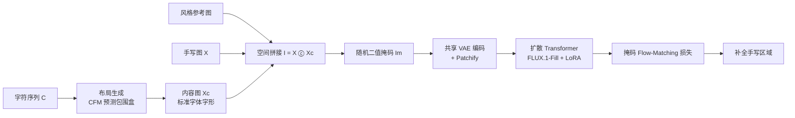

# Learning to Generate Stylized Handwritten Text via a Unified Representation of Style, Content, and Noise

**会议**: ICLR 2026  
**OpenReview**: [https://openreview.net/forum?id=FBPuLChGNX](https://openreview.net/forum?id=FBPuLChGNX)  
**代码**: 待确认  
**领域**: 图像生成 / 手写文本生成 (Handwritten Text Generation)  
**关键词**: 手写文本生成, 扩散 Transformer, 上下文生成, 统一潜空间, 多行掩码补全, 位置编码, 双语手写  

## 一句话总结
InkSpire 把风格、内容、噪声塞进**同一个潜空间**，用 FLUX 扩散 Transformer 的上下文补全能力直接在原始多行手写页面上做掩码 inpainting，从而扔掉了过往方法里那些独立的风格/内容编码器和手工损失，单模型就能高保真生成任意长度的中英双语手写并支持字符级编辑。

## 研究背景与动机
**领域现状**：离线手写文本生成 (HTG) 这几年从 GAN 转向扩散模型，质量明显提升。从早期靠固定 writer ID 做风格条件 (WordStylist、GC-DDPM)，到后来引入专门的风格编码器配手工损失——One-DM 用 Laplacian 对比损失抓细粒度笔画，DiffusionPen 用 triplet+分类损失增强风格区分度，TGC-Diff 用高频 mask 损失保结构。

**现有痛点**：这些方法的共同套路是把**风格、内容、噪声当成三个独立因子**，各自配一个编码器、各自挂一个手工设计的损失。结果是训练管线越来越复杂，而且三个因子在各自的特征空间里，彼此之间的交互很弱。更糟的是数据预处理——过去要从一个作者的多行图里裁出成对的目标行/风格行再缩放到固定高度，这会把高度倾斜行里的字符压扁、给不同斜度的行引入不一致畸变、还丢掉行间的风格线索。

**核心矛盾**：扩散 Transformer 本身已经有很强的**上下文生成 (in-context generation)** 能力（大型文生图模型已证明），但 HTG 领域却还在用"编码器+手工损失"这套割裂的范式，没把这种统一建模的能力用起来。

**本文目标**：设计一个**单一统一的扩散模型**，同时处理风格、内容、噪声，既省掉冗余编码器和复杂损失，又通过共享潜表示提升因子间交互，并支持任意长度多行合成、字符级编辑、中英双语。

**核心 idea**：作者观察到 TGC-Diff 已经把内容特征和噪声放进同一潜空间。顺着这个思路反问——既然内容和噪声能共享潜空间，**能不能让风格也进来，三者全在一个潜空间里？** 答案就是把整张图（手写图 X 拼上字形内容图 Xc）当成一个待 inpaint 的画面，用扩散 Transformer 的掩码补全直接建模，**风格=可见上下文、内容=字形条件、噪声=待生成区域，全部由同一个 VAE 编码进同一特征空间**。

## 方法详解

### 整体框架
InkSpire 把 HTG 拆成两步：先用**布局生成模型** $p(X_c \mid C, X_s)$ 预测每个字符的包围盒、渲染出标准字体的内容图 $X_c$；再用**图像生成模型** $p(X \mid X_s, X_c)$ 把内容图"上色"成目标作者风格的手写图。这套分解来自联合分布 $p(X, X_c \mid C, X_s) = p(X_c \mid C, X_s)\,p(X \mid X_s, X_c)$。关键创新都在第二步：不再裁成对样本、不再用独立编码器，而是把 $X$ 和 $X_c$ 空间拼成一张大图，随机掩码后让基于 FLUX.1-Fill 的扩散 Transformer 去补全被掩掉的手写区域。

### 关键设计

**1. 统一潜空间 + 多行掩码补全 (Multi-line Masked Infilling)：把"裁配对+编码器"换成"原图掩码"。** 过去的训练要从作者多行图里裁出目标行 $X_{tar}$ 和风格行 $X_s$ 再分别过编码器，三者特征空间不一致。InkSpire 反其道：直接从原始手写页随机裁 $P\times P$ 的 patch，对它施加随机二值掩码 $M$，自然把图分成被掩区域 $X_{mis}=M\otimes X$ 和可见上下文 $X_{ctx}=(1-M)\otimes X$。妙处在于 $X_{mis}$ 隐式扮演了"目标行" $X_{tar}$、$X_{ctx}$ 隐式扮演了"风格参考" $X_s$，训练目标直接变成 $p(X_{mis,t-1}\mid X_{mis,t}, X_{ctx}, X_c)$，彻底省掉裁配对的预处理。具体实现是把手写图与内容图空间拼接 $I = X \,ⓒ\, X_c$，掩码后得 $I_i = I\otimes(1-I_m)$，再用**同一个 VAE** 编码并 patchify 得到图像 token $F_i$、mask token $F_m$，最后把噪声 token $F_n$ 沿通道拼上：$F_{input}=F_n\odot F_i\odot F_m$。因为风格、内容、噪声共用一个 VAE 编码器，三者就被统一进同一特征空间，因子间交互自然发生，不再需要任何额外编码器或手工损失。

**2. 掩码条件 Flow-Matching 目标：只在被掩区域算 velocity 损失。** 训练沿用 rectified flow 范式，给定干净 latent $x_0$、高斯噪声 $z_1\sim\mathcal{N}(0,I)$ 和噪声尺度 $\sigma_t$，构造插值 $x_t=(1-\sigma_t)x_0+\sigma_t z_1$，模型学习从 $x_0$ 指向 $z_1$ 的速度向量。损失只对掩码区域生效：$L = \mathbb{E}_{t,x_0,z_1}\,\lVert m\odot(\hat{v}_\theta(x_t,t,c)-(z_1-x_0))\rVert_2^2$，其中条件 $c$ 由 $X_{ctx}$ 和 $X_c$ 组成。这里作者刻意保持目标"干净"——**不挂感知损失、不挂 CTC 损失**，呼应"省掉手工损失"的核心主张，整个优化过程只有一个 flow-matching 损失。

**3. 旋转对齐位置编码 R-APE：让风格 token 和内容 token 在位置空间里对得上。** 直接微调预训练扩散 Transformer 时，naïve 2D RoPE 按行铺 token，标准字体 token 和手写 token 交错排列，而手写行长度差异很大，模型分不清某个 token 该当风格条件还是内容条件。作者先提 **Aligned Position Encoding (APE)**：token 排布不变，但把分配给 $X_c$ 的位置编码**直接复用其在 $X$ 中对应位置的编码**，让内容 token 和它要指导的手写 token 共享坐标。对于宽大于高的长文本行，再进一步提 **Rotated APE (R-APE)**：把 $X$ 和 $X_c$ 顺时针旋转 90° 再拼接，使目标 token 和它的内容条件 token 在位置空间里保持空间邻近。消融显示 APE 把 IAM 的 FID 从 15.12 砍到 9.31，R-APE 再降到 7.92。

**4. 推理即"调掩码"：合成与编辑统一在一个 mask 框架下。** 因为风格/内容/噪声全在一个统一建模里，推理时只要改 mask $M$ 或改内容图 $X_c$ 就能切换任务。**多行合成**：把风格参考放第一行、掩掉其余部分，配多行内容图 $X_c$，就能一次生成任意行数（过去方法通常只能生成一两行）。**字符/词级编辑**：给定指定编辑区域的 mask 加上标准字体渲染的编辑内容图，模型只改被掩词、保留未掩区域。同一个模型还通过中英混合语料训练，单模型直接处理双语，省掉语言专用系统。

## 实验关键数据

### 主实验表格

英文 IAM 文本行生成：

| Method | FID↓ | KID↓ | HWD↓ | ΔCER↓ |
|---|---|---|---|---|
| HWT | 44.72 | 43.49 | 2.97 | 0.33 |
| VATr | 34.00 | 29.68 | 2.38 | 0.03 |
| One-DM | 43.89 | 44.48 | 2.83 | 0.13 |
| DiffPen | 12.89 | 9.73 | 2.13 | 0.03 |
| **InkSpire** | **7.92** | **4.83** | **0.62** | **0.01** |

中文 ICDAR2013 文本行生成：

| Method | FID↓ | KID↓ | HWD↓ | CR↑ | AR↑ |
|---|---|---|---|---|---|
| One-DM | 34.36 | 28.37 | 0.80 | 73.19 | 72.33 |
| TGC-Diff | 23.43 | 13.85 | 0.63 | 89.99 | 89.13 |
| **InkSpire** | **10.98** | **11.45** | **0.41** | **92.92** | **91.56** |

无论中英，InkSpire 在风格指标 (FID/KID/HWD) 和内容指标 (ΔCER/CR/AR) 上都大幅领先，HWD 尤其抢眼——英文从 DiffPen 的 2.13 降到 0.62。

### 消融实验表格

位置编码消融 (IAM)：

| 设置 | FID↓ | KID↓ | HWD↓ | ΔCER↓ |
|---|---|---|---|---|
| baseline | 15.12 | 19.27 | 0.97 | 0.11 |
| +APE | 9.31 | 7.21 | 0.58 | 0.05 |
| +R-APE | 7.92 | 4.83 | 0.62 | 0.01 |

掩码策略消融 (IAM)：

| 设置 | FID↓ | KID↓ | HWD↓ | ΔCER↓ |
|---|---|---|---|---|
| F-TopMask (固定顶部可见) | 8.73 | 6.13 | 0.78 | 0.07 |
| R-Mask (随机多区域) | 7.92 | 4.83 | 0.62 | 0.01 |

布局建模消融 (IAM, L1×10³)：自回归 (Δy 17.04) < 掩码建模 (14.51) < **掩码+CFM (14.39)**，CFM 在四个布局参数上全面最优。

### 关键发现
- **位置编码是多行生成的关键**：naïve RoPE 能做单行，但多行时常常直接复制输入图、对分辨率敏感；APE 让模型分清风格/内容 token，R-APE 在长行 one-shot 设定下进一步定位 token。
- **随机多区域掩码优于固定顶部掩码**：R-Mask 比 F-TopMask 更接近真实分布，在两个数据集上都有稳定提升。
- **CFM 布局建模优于自回归与掩码建模**：连续去噪 (10 步 ODE) 比 token-by-token 自回归更能捕捉复杂空间依赖。
- **效率**：基于 FLUX.1-Fill-dev，LoRA rank 32 仅引入约 115.9M 可训练参数，4×A100 训 20k 步，推理约 20 步 ODE。

## 亮点与洞察
- **"统一潜空间"是真正的范式简化**：把风格/内容/噪声三个被独立编码器+手工损失分割的因子，靠"同一 VAE + 空间拼接 + 掩码补全"合并进一个特征空间，训练目标退化成单一 flow-matching 损失。这不是堆 trick，而是把问题重述成 inpainting 后顺理成章的结果。
- **掩码即"配对"的洞察很巧**：$X_{mis}$ 当目标、$X_{ctx}$ 当风格参考，一刀切掉过去最脏的裁配对预处理，还顺带保住了行间风格线索和分辨率泛化。
- **复用预训练文生图的上下文能力**：去掉文本编码器走纯视觉条件，把大模型的 in-context 能力迁到 HTG，是"用对工具"的典范。
- **位置编码的工程洞察**：R-APE 通过旋转让长行的目标 token 与内容 token 空间邻近，是针对 RoPE 在变长行上失效的精准修补。

## 局限与展望
- **语言覆盖仍有限**：只验证了中英双语，作者自陈未来要扩展更多语言/数据集来增强泛化。
- **依赖布局生成的质量**：整套两步分解里，内容图 $X_c$ 由布局模型预测的包围盒渲染，布局误差会传导到最终手写图，论文未深入分析这种级联误差。
- **代价不低**：基于 FLUX.1-Fill 这类大模型，1024×1024 patch + 4×A100，对资源受限场景不友好。
- **编辑能力的边界未充分探索**：字符级编辑展示了替换词，但对更复杂的版式重排、跨行编辑的鲁棒性缺乏定量评估。

## 相关工作与启发
- **离线 HTG 谱系**：GAN 时代 (HiGAN、Alonso et al.)→CNN-Transformer 混合 (HWT、VATr)→扩散主导 (One-DM、DiffusionPen、TGC-Diff)。InkSpire 的"统一潜空间"直接顺着 TGC-Diff"内容+噪声共享潜空间"再进一步。
- **上下文生成**：从 InstructPix2Pix 到 Emu Edit、OmniGen、ICEdit 等指令驱动编辑器，再到 LoRA 分支的扩散 Transformer。本文是首个把"统一编辑+生成"的 in-context 能力引入手写域的工作。
- **启发**：当一个领域里多个"因子"被多个编码器+多个手工损失分割时，往往可以反问"它们能不能共享同一表示？"——把任务重述成一个更通用的生成范式（这里是 inpainting），常能换来管线的大幅简化和性能提升。变长序列上的位置编码失配，是迁移预训练 Transformer 时反复出现的坑，R-APE 的"对齐+旋转"思路有借鉴价值。

## 评分
- **新颖性**: ⭐⭐⭐⭐ — "统一潜空间 + 掩码补全替代裁配对"是干净有力的范式重述，R-APE 也有原创性；扣分在于核心组件（FLUX、flow-matching、RoPE 变体）多为已有技术的巧妙组合。
- **实验充分度**: ⭐⭐⭐⭐ — 中英双语、布局/位置编码/掩码策略三组消融齐全，定量定性都覆盖；但缺级联误差分析和更大规模的多语言验证。
- **写作质量**: ⭐⭐⭐⭐ — 动机链条清晰（从"因子割裂"一路推到"统一建模"），图示和公式到位，"InkSpire"命名也有记忆点。
- **价值**: ⭐⭐⭐⭐ — 显著简化 HTG 训练管线且 SOTA，单模型双语+任意长度+字符编辑实用性强，对手写合成/OCR 数据增强/字体设计有直接价值。

<!-- RELATED:START -->

## 相关论文

- [\[CVPR 2026\] SplitFlux: Learning to Decouple Content and Style from a Single Image](../../CVPR2026/image_generation/splitflux_learning_to_decouple_content_and_style_from_a_single_image.md)
- [\[ICCV 2025\] SCFlow: Implicitly Learning Style and Content Disentanglement with Flow Models](../../ICCV2025/image_generation/scflow_implicitly_learning_style_and_content_disentanglement_with_flow_models.md)
- [\[ICML 2026\] Content-Style Identification via Differential Independence](../../ICML2026/image_generation/content-style_identification_via_differential_independence.md)
- [\[CVPR 2026\] Learning to Generate via Understanding: Understanding-Driven Intrinsic Rewarding for Unified Multimodal Models](../../CVPR2026/image_generation/learning_to_generate_via_understanding_understanding-driven_intrinsic_rewarding_.md)
- [\[ICLR 2026\] DiffInk: Glyph- and Style-Aware Latent Diffusion Transformer for Text to Online Handwriting Generation](diffink_glyph-_and_style-aware_latent_diffusion_transformer_for_text_to_online_h.md)

<!-- RELATED:END -->
