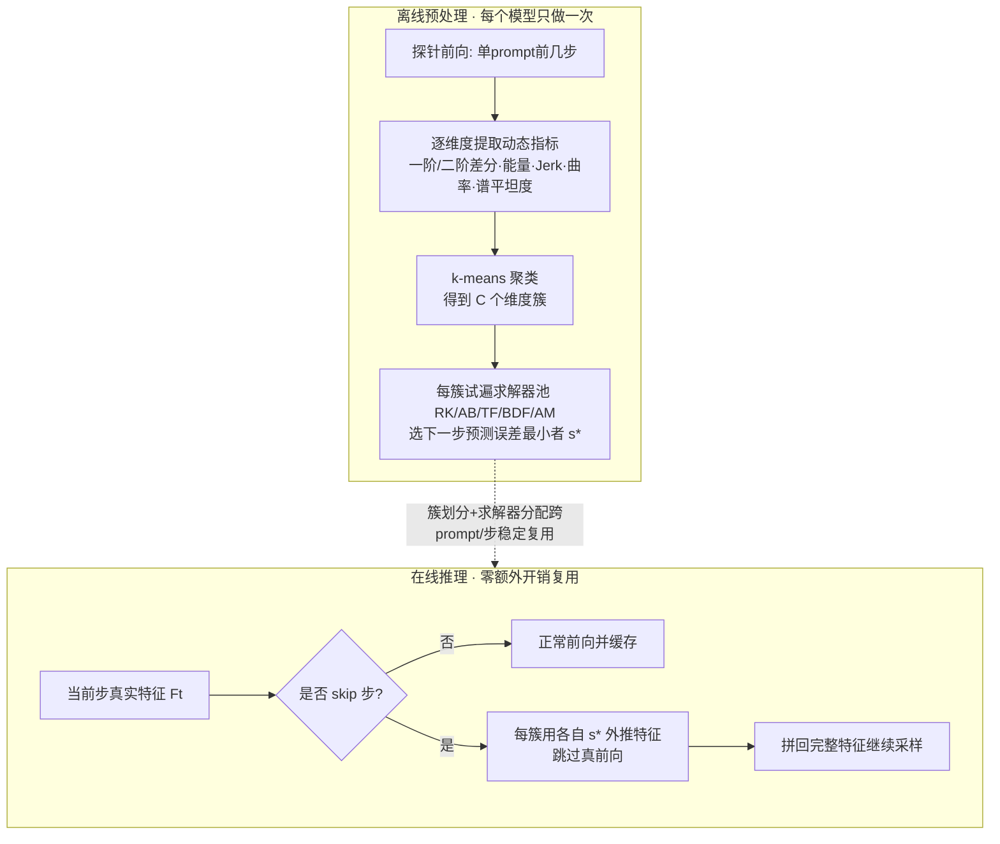

# Let Features Decide Their Own Solvers: Hybrid Feature Caching for Diffusion Transformers

**会议**: ICLR 2026  
**OpenReview**: [https://openreview.net/forum?id=URbsHlTK8c](https://openreview.net/forum?id=URbsHlTK8c)  
**代码**: 项目主页（论文 Project Page，待确认仓库）  
**领域**: 图像生成 / 扩散模型推理加速  
**关键词**: Diffusion Transformer, 特征缓存, ODE 求解器, 训练无关加速, 维度级缓存  

## 一句话总结
HyCa 把扩散 Transformer 的隐特征演化看成「不同维度服从不同 ODE」的混合系统，对每一簇维度离线挑一个最合适的数值求解器来预测/复用特征，从而在 FLUX、HunyuanVideo、Qwen-Image 上实现 5.5×~6.2× 的近无损训练无关加速。

## 研究背景与动机
**领域现状**：扩散 Transformer（DiT）在图像/视频生成上质量很高，但采样要反复跑多步 Transformer 前向，推理慢是主要瓶颈。特征缓存（feature caching）是一类训练无关的加速思路——利用相邻时间步隐特征的时间连贯性，复用或外推缓存特征来跳过部分前向计算。FORA、ToCa、TaylorSeer 等方法已经把缓存从 U-Net 推广到 DiT，并把它理解成「求解隐特征的时间演化」。

**现有痛点**：这些方法都隐含假设——所有特征维度服从同一个统一的演化系统，于是用一套统一的缓存/外推策略套到全部维度上。但作者对 DiT 各维度随时间步的变化做聚类分析后发现：有些维度剧烈震荡（oscillatory，对应刚性/多模态行为），有些维度平滑可预测（smooth），二者动态特性差异巨大。**一刀切的单一求解器无法同时照顾刚性维度与平滑维度**，在激进加速下就会失稳、掉质量。

**核心矛盾**：高维特征空间是异质的（heterogeneous），但缓存策略却是同质的——这就是性能损失的根源。

**本文目标**：在不重训的前提下，给不同动态行为的特征维度配不同的「积分器」，让每个维度被最适合它的求解器预测，逼近近无损加速。

**核心 idea**：
- **特征演化 = 混合 ODE（Mixture of ODEs）**：把 τ↦F(x(τ)) 的特征轨迹视作连续 ODE，不同维度族服从不同 ODE，应该用不同数值解法。
- **聚类一次、终身复用（One-Time Choosing, All-Time Solving）**：作者发现维度的聚类划分在不同 prompt、分辨率、时间步下高度稳定（ARI>0.8），所以只需在单 prompt 单步上离线挑一次求解器，推理时零额外开销地复用。

## 方法详解

### 整体框架
HyCa 把缓存问题写成 $\frac{d}{d\tau}F(x(\tau)) = g_\theta(F(x(\tau)), \tau)$ 的 ODE 数值积分，目标是用历史缓存特征预测下一步 $\hat F_{t+1}\approx \text{Solver}(F_t, F_{t-1},\dots)$ 而不用真前向。流程分两段：**离线预处理**——对每个特征维度算时间动态描述子→k-means 聚类→给每簇从求解器池里挑误差最小的求解器；**在线推理**——每簇固定用自己被分配的求解器外推特征，在 skip 步跳过真实计算。下图是两段式管线：

### 关键设计

**1. 把特征缓存重述为混合 ODE 求解：给异质维度配异质积分器。** 由于生成网络可微、$x(\tau)$ 沿连续反向轨迹演化，复合映射 $\tau\mapsto F(x(\tau))$ 也可微，其动态满足 $\frac{d}{d\tau}F(x(\tau)) = g_\theta(F(x(\tau)),\tau)$。虽然向量场 $g_\theta$ 拿不到，但可以在离散时间步网格上采样轨迹 $\{F(x(\tau_k))\}$ 做数值积分——这就把缓存自然变成「只用缓存值解 ODE」的问题。关键在于：DiT 特征空间是复杂系统，平滑段适合显式高阶法、震荡/刚性段适合隐式法，所以作者准备了一个多样化的求解器池 $S$，含 Runge–Kutta(RK)、Adams–Bashforth(AB)、Taylor Formula(TF)、Backward Differentiation Formula(BDF)、Adams–Moulton(AM)，覆盖不同稳定性/精度权衡，让 HyCa 能给每段局部动态分配量身的解法，而不是像 TaylorSeer 那样全维共用一个多项式外推。

**2. 维度级动态聚类：用可解释的时序指标把维度分簇。** HyCa 在单 prompt 的前几个时间步做一次探针前向，对每个维度 $d$ 抽一个描述子向量 $\phi_d\in\mathbb{R}^k$，里面是 Jerk ratio、曲率比、一/二阶差分、能量、谱平坦度等刻画时间动态的指标，再用 k-means 得到划分 $\{c(d)\}$。之所以选**维度级**而非 token 级，是因为作者实测维度的聚类结构在不同 prompt/分辨率/时间步下几乎不变（Silhouette≈0.72，ARI>0.8），而 token 级划分随输入剧烈变化、需要频繁重选。稳定性正是「聚类一次终身复用」的依据，也让求解器分配的数据与计算开销降到可忽略。

**3. 一次性按簇选解：把单 prompt 单步的最优当全局最优。** 给定求解器池 $S$，HyCa 为每簇 $c$ 选下一步预测误差最小的求解器，目标为
$$\min_{\{s_c\in S\}_{c=1}^{C}} \sum_{c=1}^{C}\left[\frac{1}{|c|}\sum_{d\in c}\big\|\hat F^{(s_c,d)}_{t+1}-F^{(d)}_{t+1}\big\|_2^2\right],$$
其中 $\hat F^{(s_c,d)}_{t+1}$ 是维度 $d$ 用求解器 $s_c$ 外推的特征。正常情况下要在大量图像上跑推理、比指标才能定下最优求解器；但因为簇分配的输入不变性，作者只在单 prompt 单步上评估就能可靠选出与大规模评测一致的结果。于是「离线 One-Time Choosing + 在线 All-Time Solving」成立，推理期不引入任何额外搜索成本。

**4. 天然兼容蒸馏模型：靠隐式求解器扛住离散震荡轨迹。** 蒸馏把采样步数从 50 压到 4/8，特征轨迹变得离散、震荡，依赖平滑时间演化假设的传统缓存法直接失效。HyCa 的求解器池里本就含适合离散/震荡动态的隐式方法（如 BDF/AM），且求解器是按簇、按模型分别分配的，所以在 FLUX.1-schnell 和 Qwen-Image-Lightning 上仍然有效，把蒸馏的极致加速再叠一层（最高 24.4×）而几乎不掉质量。

## 实验关键数据

四个代表性模型：文生图 FLUX.1-dev / Qwen-Image，文生视频 HunyuanVideo，图像编辑 Qwen-Image-Edit；外加蒸馏版 FLUX.1-schnell / Qwen-Image-Lightning。指标用 ImageReward、CLIP、PSNR/SSIM/LPIPS、VBench、GEdit-Bench。

### 主实验表格

Qwen-Image 文生图（DrawBench 200 prompts，括号为相对原模型 ImageReward 变化）：

| 方法 | FLOPs 加速 | ImageReward ↑ | PSNR ↑ | LPIPS ↓ |
|------|-----------|---------------|--------|---------|
| 原始 50 步 | 1.00× | 1.2547 (0.00%) | ∞ | 0.000 |
| TaylorSeer (N=3) | 2.78× | 1.0685 (-14.83%) | 28.29 | 0.628 |
| **HyCa (N=3)** | 2.78× | **1.2363 (-1.47%)** | **30.42** | **0.247** |
| FORA (N=6) | 5.56× | 0.4781 (-61.91%) | 28.38 | 0.597 |
| **HyCa (N=8)** | 6.25× | **1.0811 (-13.84%)** | 28.89 | 0.433 |

FLUX.1-dev（高加速区）：HyCa(N=6) 在 5.00× 下 ImageReward 1.0014（+1.16%），HyCa(N=7) 在 5.55× 下仍达 0.9895（-0.03%），几乎不掉，而 TeaCache 同档位掉到 0.8683、ToCa 掉到 0.7155。

HunyuanVideo 文生视频（VBench）：

| 方法 | FLOPs 加速 | VBench ↑ |
|------|-----------|----------|
| 原始 50 步 | 1.00× | 80.66 |
| TaylorSeer (N=5) | 5.00× | 79.93 (-0.9%) |
| **HyCa (N=6)** | **5.56×** | **80.25 (-0.5%)** |

Qwen-Image-Edit 编辑（GEdit-Bench Overall Score）：HyCa(N=8) 在 6.24× 下 CN/EN 总分 7.44/7.42，**甚至超过原模型的 7.41/7.54 量级**，而 TaylorSeer(N=8) 跌到 6.31/6.31。

### 消融实验表格（FLUX）

| 对比维度 | 关键结论 |
|----------|----------|
| HyCa vs 单一求解器 | HyCa 在同条件下 ImageReward 更高、预测误差更低，证明「混合多样求解器」优于任一单一积分策略 |
| 维度级 vs token 级/一刀切 | 维度级分配同时优于 token 级（ToCa/DuCa）和全维统一（FORA/TaylorSeer） |
| 蒸馏兼容性 | FLUX.1-schnell 4 步：HyCa 24.42× 下 ImageReward 0.9592（反超蒸馏基线 +5.0%），PSNR 34.37 |

### 关键发现
- 簇分配的稳定性是方法成立的根基：跨 prompt/分辨率/时间步 Silhouette≈0.72、ARI>0.8，所以离线选一次就够。
- 加速越激进，HyCa 与基线差距越大——别人在 5.5×+ 普遍崩盘，HyCa 仍近无损，体现其在高压缩下的鲁棒性。
- 在编辑任务的高加速档，HyCa 个别指标甚至略超原模型，暗示求解器外推有一定去噪/平滑的正则效果。

## 亮点与洞察
- **视角创新**：第一个明确把 DiT 特征演化建模成「混合 ODE」，并实证维度间动态异质、且聚类结构输入不变——这个观察本身就有价值，把一个被默认成同质的问题暴露成异质问题。
- **工程极简**：所有求解器选择都在离线一次性完成，推理期零搜索开销，落地几乎免费；又能和蒸馏叠加冲到 12×~24×。
- **求解器池思路可迁移**：把数值分析里成熟的显式/隐式 ODE 解法搬进特征缓存，给后续「按动态特性配解法」开了一条可扩展的路。

## 局限与展望
- **求解器池与指标是手工设计**：动态描述子（Jerk、曲率等）和候选解法都靠人工选定，是否最优、能否自动学习未充分探讨。
- **聚类数 C 与稳定性的边界**：论文主要在 2 簇设定下展示稳定性，更多模型/更高分辨率下聚类是否仍稳定、簇数怎么自适应选，仍有空间。
- **离线探针的代表性假设**：「单 prompt 单步选出的最优 = 全局最优」依赖输入不变性，对分布外 prompt 或极端编辑是否成立，缺乏压力测试。
- **加速主要以 FLOPs/Latency 计**：实际部署中维度级散落的 skip 模式对硬件并行/访存的友好度未深入分析。

## 相关工作与启发
- **缓存即求解时间演化**：延续 FORA、ToCa/DuCa、TaylorSeer、FoCa 的「cache-then-forecast」范式，但把统一外推升级为按维度簇的异质求解，是对 TaylorSeer 多项式外推的直接泛化。
- **数值 ODE 求解器**：DPM-Solver、Rectified Flow、Consistency Models 等关注「减少步数」，HyCa 关注「降低每步成本」，二者正交可叠加（实验也验证了与蒸馏的兼容）。
- **启发**：当一个系统被默认成同质、但实际异质时，「先聚类找子系统、再分而治之配专门策略」是一个通用且廉价的提升点；而「离线一次性优化 + 输入不变性」可以把看似昂贵的搜索压成零成本，值得在其他训练无关加速里借鉴。

## 评分
- **新颖性**: ⭐⭐⭐⭐ 把特征缓存重述为混合 ODE、并用维度级聚类 + 求解器分配，视角和方法都新；不过底层组件（缓存、数值求解器、k-means）均为已有工具的巧妙组合。
- **实验充分度**: ⭐⭐⭐⭐ 覆盖文生图/视频/编辑/蒸馏四类任务、四个主流大模型、多档加速比，对比基线齐全，并有聚类稳定性与消融支撑；缺自动选指标/选簇数的系统性分析。
- **写作质量**: ⭐⭐⭐⭐ 动机→观察（异质动态）→方法→稳定性论证逻辑清晰，图表丰富；部分求解器实现细节下放到附录。
- **价值**: ⭐⭐⭐⭐ 训练无关、推理零额外开销、可叠蒸馏到 24×，对 DiT 实际部署很实用，且「异质建模 + 一次性选解」的范式具备迁移潜力。

<!-- RELATED:START -->

## 相关论文

- [\[CVPR 2026\] Forecast the Principal, Stabilize the Residual: Subspace-Aware Feature Caching for Diffusion Transformers](../../CVPR2026/image_generation/forecast_the_principal_stabilize_the_residual_subspace-aware_feature_caching_for.md)
- [\[CVPR 2026\] ResCa: Residual Caching for Diffusion Transformers Acceleration](../../CVPR2026/image_generation/resca_residual_caching_for_diffusion_transformers_acceleration.md)
- [\[AAAI 2026\] ProCache: Constraint-Aware Feature Caching with Selective Computation for Diffusion Transformer Acceleration](../../AAAI2026/image_generation/procache_constraint-aware_feature_caching_with_selective_computation_for_diffusi.md)
- [\[ICLR 2026\] Scaling Laws for Diffusion Transformers](scaling_laws_for_diffusion_transformers.md)
- [\[ICLR 2026\] Rethinking Global Text Conditioning in Diffusion Transformers](rethinking_global_text_conditioning_in_diffusion_transformers.md)

<!-- RELATED:END -->
