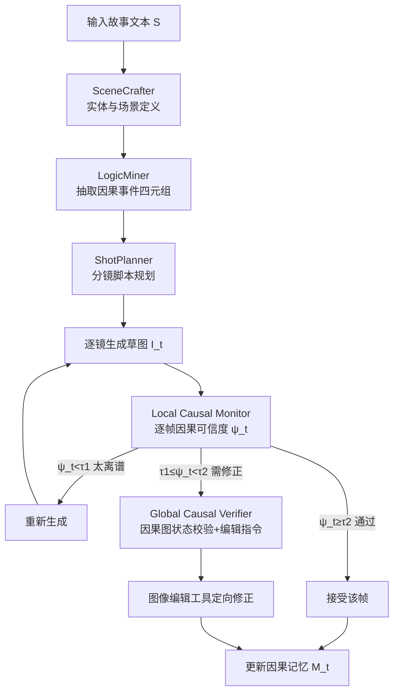

# LogiStory: A Logic-Aware Framework for Multi-Image Story Visualization

**会议**: ICLR 2026  
**OpenReview**: [https://openreview.net/forum?id=OG1JMhoBKU](https://openreview.net/forum?id=OG1JMhoBKU)  
**代码**: 待确认  
**领域**: 图像生成 / 故事可视化  
**关键词**: 故事可视化, 视觉逻辑, 多智能体, 因果推理, 多图序列生成  

## 一句话总结
提出"视觉逻辑"(visual logic)这一概念，用一个多智能体规划 + 因果验证的框架 LogiStory，把多图故事可视化从"画好看的孤立图片"变成"显式建模角色-动作-场景之间因果连贯性"的推理问题，并配套构建带因果标注的 LogicTale 基准。

## 研究背景与动机
**领域现状**：扩散模型和 MLLM（GPT-4o、Gemini、Nano Banana）已经能生成高保真单图，故事可视化（给一段叙事生成一串连贯图片）的研究也大多集中在视觉质量和角色一致性上——保证主角穿同一件衣服、长同一张脸跨帧不变。

**现有痛点**：尽管单图越来越精美，生成的图序列却常常"逻辑断裂"——物体状态毫无解释地突变、角色行为情绪前后矛盾、叙事支离破碎。结果是一串"图片快照"而不是一个能读懂的故事。文本侧已有成熟的逻辑规划（事件图、常识推理），但这些结构化能力没能迁移到视觉表达上。

**核心矛盾**：现有方法把叙事连贯性当成"图像生成的隐式副产品"——指望模型在追求像素质量的同时顺便把因果关系学对。但视觉序列里的因果链（乌鸦往瓶里扔石子→水位上升→够到水）从来不是像素相似度能保证的，**视觉逻辑是一个被严重忽视、却需要显式建模的维度**。

**本文目标**：把视觉逻辑——即角色、动作、场景随时间推移在感知和因果上的连贯性——从隐式副产品提升为显式的建模目标，并提供一个能真正测量它的基准。

**核心idea**：**显式建模视觉逻辑**。用一个多智能体系统把叙事拆解成结构化的角色定义/因果事件/分镜脚本，再用一个双层因果验证模块（全局因果图 + 局部逐帧监控）在生成过程中实时检查并修正逻辑断裂，把"叙事连贯"变成可计算、可强制执行的目标。

## 方法详解

### 整体框架
给定文本故事 $S$，目标是生成图序列 $I=\{I_1,\dots,I_T\}$，要求同时满足实例一致性、叙事因果性、故事可读性三个维度。LogiStory 由两大组件串联：先由**逻辑感知多智能体系统**把故事翻译成结构化中间表示（角色/物体/场景/分镜事件），再由**视觉逻辑增强模块**在逐图合成时引入多层因果验证、对不合逻辑的帧实时打回重画或定向编辑。

### 关键设计

**1. 逻辑感知多智能体系统：把叙事翻译成结构化视觉骨架** 这一阶段由三个分工协作的智能体接力完成，目的是在动笔画图之前先把"故事到底讲了什么"拆清楚。SceneCrafter 负责实体定义，$E=F_{\text{craft}}(S)$ 抽出角色集 $C$、物体集 $O$、场景集 $S$ 及其外观属性，形成一套跨所有分镜复用的"视觉接地词表"，保证主角的脸和道具在不同场景里稳定一致。LogicMiner 是关键所在——它把故事压缩成因果事件四元组 $k_j=(\text{actor},\text{action},\text{target},\text{result})$，$K=F_{\text{mine}}(S,E)$，不仅抓显式陈述的动作，还能推断**隐式的状态变化**：从"乌鸦把石子放进杯子"自动推出"水位上升"这个原文没写但视觉上必须画出来的后果。这些事件构成了整个故事的因果骨干。最后 ShotPlanner 把事件和实体编排成分镜规格序列 $P=F_{\text{shot}}(K,E)$，加入构图、运镜、节奏等视觉叙事惯例，决定每一格画什么、怎么取景。三个智能体把一句话的故事变成了一份可执行的"分镜剧本"。

**2. Local Causal Monitor：模拟读者逐帧线性理解** 人读连环画是一格一格往下读的，每读一格都会拿它和前面累积的理解做对照。这个模块就是用 MLLM 模拟这条阅读路径：维护一个文本形式的因果记忆缓冲 $M_{t-1}$，记录 $\{p_1,\dots,p_{t-1}\}$ 的状态快照和动作；面对当前帧 $I_t$，计算一个因果可信度分数 $\psi_t=C_p(I_t\mid M_{t-1})$，衡量这一帧描绘的状态转移是否与已积累的上下文连贯、或是否构成合理延伸。关键在于它**不强求确定性预测**——既容纳预期的情节推进，也接纳合理的意外转折，只要不和先前状态矛盾即可。这种增量式校验直接提升了故事可读性。

**3. Global Causal Verifier：用因果图守住故事级一致性** 如果说局部监控管的是"这一帧和上一帧顺不顺"，全局验证器管的就是"整条因果链对不对"。它基于事件 $K$ 和故事 $S$ 构建有向因果图 $G_{\text{causal}}$，节点是关键状态（角色状态、物体条件），边是事件语义推出的因果/时序依赖；并用一个状态记录器随故事推进动态追踪所有实例的当前状态。对每个动作 $a_t$，定义前置状态 $S^{\text{pre}}_t$ 与后置状态 $S^{\text{post}}_t$，转移记为 $S^{\text{pre}}_t \xrightarrow{a_t} S^{\text{post}}_t$，并校验它必须落在因果图的合法路径上：$\forall t,\ (S^{\text{pre}}_t, S^{\text{post}}_t)\in\text{Paths}(G_{\text{causal}})$。任何不一致都会被标记并交给图像编辑工具定向修正。这一步把"角色不能凭空复活、瓶子里的水不能突然消失"这类全局约束变成了可强制执行的图检查。

**4. 阈值化的图像精修闭环：把验证结果接回生成** 前面的分数和校验最终要落到"这一帧到底留还是改"。LogiStory 用两个经验阈值 $\tau_1=0.4$、$\tau_2=0.7$ 把局部可信度 $\psi_t\in[0,1]$ 分成三档：$\psi_t<\tau_1$ 说明这帧和叙事基本无关，直接重画；$\tau_1\le\psi_t<\tau_2$ 说明大方向对但有逻辑瑕疵，调用全局因果验证器拿到结构化的修订指令，再用 inpainting/MLLM 编辑工具做定向修补；$\psi_t\ge\tau_2$ 则直接接受。每处理完一帧就把它的 caption 并入记忆 $M_t=M_{t-1}\cup\{\text{Caption}(I_t)\}$ 供后续帧参考。这个"生成→打分→重画/编辑/通过→更新记忆"的闭环让逻辑约束贯穿整条生成流水线，而不是事后一次性评估。

## 实验关键数据

实现细节：智能体用 DeepSeek-V3 当底座 LLM，初始分镜用 Flux 合成，精修编辑集成 GPT-image-1、Gemini 2.0 Flash 等 MLLM 与 inpainting 模型。

### 主实验表格
在自建 LogicTale 基准上对比闭源/开源基线（视觉逻辑 + 感知质量 + 用户研究，加粗为第一）：

| 方法 | ICons.↑ | NCausal.↑ | SRead.↑ | AesthQ.↑ | SCons.↑ | CExpr.↑ | 用户App.↑ |
|------|---------|-----------|---------|----------|---------|---------|-----------|
| DeepSeek-R1 + SDXL | 2.17 | 2.02 | 0.568 | 0.290 | 0.775 | 2.13 | 3.0 |
| DeepSeek-R1 + Flux | 3.87 | 3.43 | 0.687 | 0.305 | 0.833 | 4.20 | 3.8 |
| DeepSeek-R1 + StoryDiff | 3.07 | 2.06 | 0.541 | 0.291 | 0.828 | 2.07 | 2.6 |
| MM-StoryAgent | 3.03 | 2.63 | 0.579 | 0.294 | 0.802 | 2.54 | 2.6 |
| Gemini 2.0 Flash | 3.62 | 3.88 | 0.651 | 0.255 | 0.820 | 3.48 | 2.8 |
| Nano Banana | 4.20 | 4.08 | 0.744 | **0.310** | **0.903** | 4.26 | 4.4 |
| GPT-4o + GPT-image-1 | **4.67** | 3.96 | 0.762 | 0.283 | 0.898 | 4.15 | **4.6** |
| **LogiStory (Ours)** | 4.23 | **4.45** | **0.827** | 0.309 | 0.857 | **4.32** | 4.2 |

LogiStory 在叙事因果性、故事可读性、美学质量、角色表现力四项夺冠；实例一致性和风格一致性略逊于擅长参考图编辑的 GPT-image-1，但仍具竞争力。

### 消融实验表格
规划方法消融（Table 2）与视觉逻辑增强模块消融（Table 3）：

| 规划方法 | ICons. | NCausal. | SRead. |
|----------|--------|----------|--------|
| 直接用 DeepSeek-V3 | 3.92 | 3.64 | 0.723 |
| 直接用 DeepSeek-R1 | 3.87 | 3.86 | 0.716 |
| 直接用 Qwen2.5-72B | 3.66 | 3.52 | 0.661 |
| **多智能体 (Ours)** | **4.23** | **4.45** | **0.827** |

| 增强模块 | ICons. | NCausal. | SRead. |
|----------|--------|----------|--------|
| w/ none | 4.16 | 3.93 | 0.653 |
| w/ global only | 4.12 | 4.27 | 0.728 |
| w/ local only | 4.24 | 4.10 | 0.773 |
| **w/ both (Ours)** | 4.23 | **4.45** | **0.827** |

### 关键发现
- **多智能体规划显著优于直接 prompt 大模型**：把叙事拆成结构化角色 + 关键事件，给图序列生成提供了强先验，三项视觉逻辑指标全面领先。
- **两个验证器分工互补**：Global Causal Verifier 主要拉高叙事因果性（4.27 vs 3.93），Local Causal Monitor 主要拉高故事可读性（0.773 vs 0.653），两者叠加效果最好。
- **人评与自动指标高度一致**：30 人用户研究在三项逻辑维度上的 Pearson 相关系数分别为 0.959/0.978/0.909，验证了自动评测协议的可靠性（感知质量相关性较低 0.695，因 SDXL 系方法风格同质化）。
- **瓶颈在生成侧而非规划侧**：复杂案例（多线叙事、闪回、细腻情绪）下因果图能正确分解逻辑依赖，但精细情感表达和事件级连贯偶尔退化，主要受图像生成模型本身能力限制。

## 亮点与洞察
- **概念贡献大于工程贡献**：把"视觉逻辑"明确定义为视觉序列生成中一个被忽视的维度，并落地为可测量的任务，这种"定义新问题 + 配套基准"的范式对整个故事可视化/视频生成方向有指导意义。
- **把隐式目标显式化**：用因果图 + 状态记录器把"角色不能凭空复活、物体状态要连续"这类常识约束编译成可强制执行的路径检查，而不是寄望模型自己学会。
- **双层验证模拟人类阅读**：局部监控模拟读者逐格线性理解、全局验证守住整条因果链，这种"局部+全局"的分工在直觉上和实验上都站得住。
- **LogicTale 基准填补空白**：60 个带因果链/动作-状态流/分镜分解标注、分难度等级的故事，配 BLIP-2 captioning + LLM 反推故事的可读性评测，是首个显式评估叙事级逻辑连贯的基准。

## 局限与展望
- **重度依赖闭源大模型**：底座是 DeepSeek-V3，精修靠 GPT-image-1/Gemini，pipeline 调用成本高、复现门槛高，逻辑能力多大程度来自框架、多大程度来自底座模型难以完全剥离。
- **生成侧是真正瓶颈**：复杂场景下细腻情感和事件级连贯仍会退化，框架能规划对但画不出，说明因果验证无法弥补底层生成模型的表达力缺陷。
- **阈值靠经验设定**：$\tau_1=0.4,\tau_2=0.7$ 基于初步实验拍定，不同故事难度/底座是否需要自适应未深入讨论。
- **基准规模有限**：60 个故事虽与同类工作相当或更大，但相对训练大模型仍偏小，且因果链权重标注依赖人工，扩展性待验证。

## 相关工作与启发
- **故事可视化谱系**：从 GAN 逐句生成 → 扩散模型靠身份条件保角色一致 → LLM 驱动的全自动 agent pipeline。本文承接 agent-based 路线（MM-StoryAgent、StoryDiffusion、ConsiStory），但把重点从"一致性"挪到"因果逻辑"。
- **文本因果推理的迁移**：文本故事生成早已用事件图、常识推理建模因果，本文相当于把这套结构化规划思想跨模态搬到视觉序列上，弥合"文本逻辑强、视觉逻辑弱"的鸿沟。
- **对视频生成的启发**：作者明确把这项工作定位为"在通用图序列与视频生成中建模并强制视觉逻辑的奠基一步"——视频本质是更密集的图序列，因果图 + 状态追踪 + 逐帧验证的思路有望迁移到长视频叙事一致性问题上。
- **评测启发**：相比 FID/CLIPScore/DINO 这些只看单图质量或外观一致的指标，本文用"caption→LLM 反推故事→语义相似度"来量化可读性，提供了一种评估"序列能否被读懂"的新思路。

## 评分
- **新颖性**: ⭐⭐⭐⭐ 提出并定义"视觉逻辑"这一新维度，把故事可视化重构为因果推理问题，因果图 + 双层验证的组合有概念新意；不过多智能体规划 + 验证器的工程套路本身在 agent 领域不算稀奇。
- **实验充分度**: ⭐⭐⭐⭐ 对比了 7 个强基线（含 GPT-4o、Nano Banana 等最新闭源），自动+人评双轨、两组消融清晰拆解了各模块贡献，并报告人机一致性；但 LogicTale 仅 60 故事、跨数据集泛化只在附录。
- **写作质量**: ⭐⭐⭐⭐ 问题定义清晰、动机有说服力、方法图和算法流程明确，公式与文字配合到位；个别符号（场景集 $S$ 与故事 $S$ 复用）略有歧义。
- **价值**: ⭐⭐⭐⭐ "定义新问题 + 给基准 + 给框架"三件套对故事可视化乃至视频生成的叙事一致性研究有明确推动作用，但强依赖闭源模型限制了即时落地与复现。

<!-- RELATED:START -->

## 相关论文

- [\[CVPR 2026\] ViStoryBench: Comprehensive Benchmark Suite for Story Visualization](../../CVPR2026/image_generation/vistorybench_comprehensive_benchmark_suite_for_story_visualization.md)
- [\[CVPR 2026\] DreamingComics: A Story Visualization Pipeline via Subject and Layout Customized Generation using Video Models](../../CVPR2026/image_generation/dreamingcomics_a_story_visualization_pipeline_via_subject_and_layout_customized_.md)
- [\[ICLR 2026\] W-Edit: A Wavelet-based Frequency-aware Framework for Text-driven Image Editing](w-edit_a_wavelet-based_frequency-aware_framework_for_text-driven_image_editing.md)
- [\[ICLR 2026\] MOSAIC: Multi-Subject Personalized Generation via Correspondence-Aware Alignment and Disentanglement](mosaic_multi-subject_personalized_generation_via_correspondence-aware_alignment_.md)
- [\[ICLR 2026\] JointDiff: Bridging Continuous and Discrete in Multi-Agent Trajectory Generation](jointdiff_bridging_continuous_and_discrete_in_multi-agent_trajectory_generation.md)

<!-- RELATED:END -->
