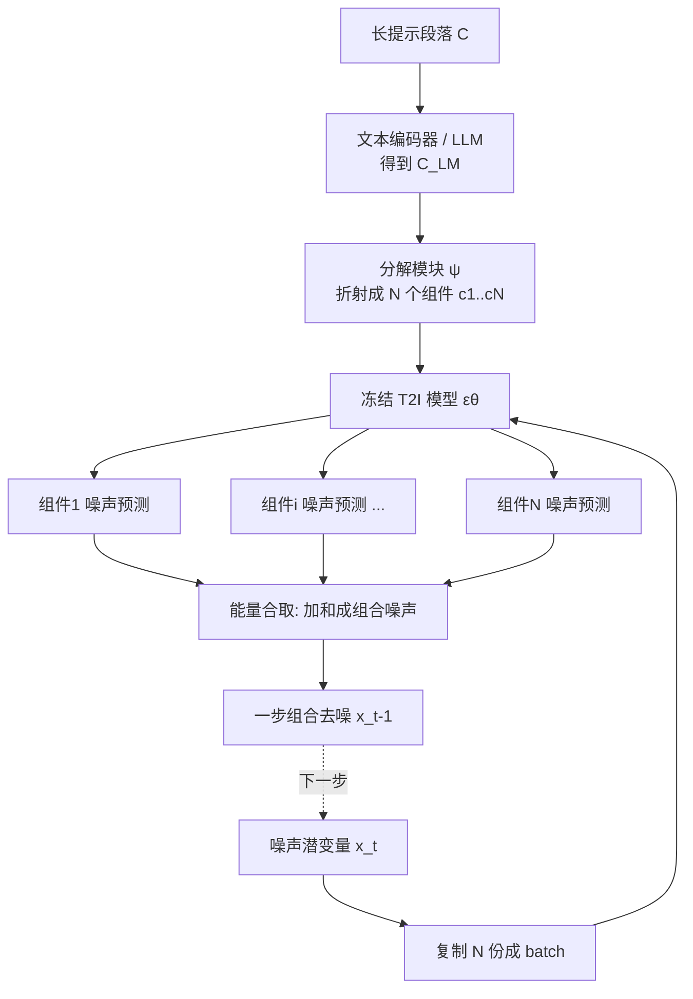

# Long-Text-to-Image Generation via Compositional Prompt Decomposition

**会议**: ICLR 2026  
**OpenReview**: [https://openreview.net/forum?id=jxyEci13Dd](https://openreview.net/forum?id=jxyEci13Dd)  
**代码**: [jy-joy.github.io/PRISM](https://jy-joy.github.io/PRISM)（项目主页）  
**领域**: 图像生成 / 长文本到图像  
**关键词**: 长文本到图像, 组合生成, 能量模型, 提示分解, 扩散模型, 训练无关泛化  

## 一句话总结
PRISM 把一段冗长的描述性提示在文本表示空间里"折射"成若干语义组件，让冻结的预训练 T2I 模型对每个组件独立去噪、再用能量模型的概念合取（concept conjunction）把噪声预测加和成一步组合去噪，从而在不微调主干、不损失细节的前提下，让 T2I 模型能渲染 500+ token 的长段落。

## 研究背景与动机
- **领域现状**: 现代文生图（T2I）扩散模型在简短提示上表现出色，但训练数据（如 LAION）几乎全是短小、标签式的 caption。模型学到的是"短语→视觉特征"的映射，而非对一段叙事文字中分散细节的理解。
- **现有痛点**: 面对一段描述性段落（DetailMaster 基准平均 284.9 token），即便是 FLUX、Qwen-Image 这种用强力 LLM 文本编码器的 SOTA 模型，也会漏掉一半以上提示中点名的物体。两类现有补救方案各有硬伤：(1) **微调派**（LongAlign、ParaDiffusion）在训练长度内有效，但外推到更长提示时性能急剧下滑（>500 token 掉 30%），还会"灾难性遗忘"预训练知识；(2) **投影派**（ELLA、LLM4GEN）把长提示压进 T2I 原本的紧凑文本嵌入空间，信息瓶颈牺牲了长提示最值钱的细节。
- **核心矛盾**: 长段落对预训练 T2I 模型是天然的分布外（OOD）输入——既不能靠微调硬学（外推差），也不能靠投影硬塞（保真差）。如何**复用模型已有的"短提示"专长**去渲染长而精细的段落，是悬而未决的问题。
- **本文目标**: 让冻结的预训练 T2I 模型处理长序列输入，做到既保住预训练先验、又保住细节保真度，并且对超出训练长度的提示有更强泛化。
- **核心 idea**: **将"长文本到图像"重构为组合任务（compositionality）**。不强迫模型一口气理解整段 OOD 文字，而是把它分解成一组"模型看得懂"的语义组件 $\{c_1,\dots,c_N\}$，让同一个 T2I 模型分别对每个组件去噪，再借扩散模型可视为可组合能量模型（EBM）这一性质，把各组件的噪声预测加和，从因子化分布 $p(x|C)\propto\prod_i p(x|c_i)$ 中采样出能被全部组件共同描述的图像。

## 方法详解

### 整体框架
PRISM（Prompt Refraction for Intricate Scene Modeling）在原有 T2I 去噪循环外只插入一个轻量"分解模块" $\psi$：它把长提示编码 $C_{\text{LM}}$ 折射成 $N$ 个组件表示；每一步去噪时，当前噪声潜变量被复制 $N$ 份成一个 batch，冻结的 T2I 模型对每个组件表示独立做噪声预测，最后用能量合取（加和）把 $N$ 个预测融成一个组合去噪输出。整个组合模型端到端、无监督训练，损失只来自冻结 T2I 模型给出的扩散重建误差——主干一个参数都不动，只学 $\psi$（或文本编码器上的 LoRA）。

### 关键设计

**1. 能量合取做组合去噪：把"加噪声预测"变成"乘概率分布"** — 这是整套方法的物理基石。扩散模型的噪声预测正比于时间相关的得分函数 $\epsilon_\theta\propto-\nabla_{x_t}\log p_t(x_t|c)$，而能量模型从乘积分布采样等价于把能量函数相加。两者一拍即合：要从 $c_1,c_2$ 两个条件分布的乘积中采样，只需把各自噪声预测相加 $\epsilon_{\text{composed}}=\epsilon_\theta(x_t,t,c_1)+\epsilon_\theta(x_t,t,c_2)\propto\nabla_{x_t}\log(p_t(x_t|c_1)\cdot p_t(x_t|c_2))$，得到的组合得分会把生成引向同时满足两个提示的图像。PRISM 把这一"概念合取"推广到 $N$ 个组件：$\epsilon_\theta(x_t,t,C)=\sum_{i=1}^N\epsilon_\theta(x_t,t,c_i)$。关键在于——合成出的图像不必出现在任一组件的训练分布里，因此能用熟悉的简单概念拼出全新的复杂场景，这正是组合泛化的来源。

**2. 在表示空间学分解，而非按语言切句** — 一个最直觉的做法是用 LLM 把段落拆成若干短句当组件，但 Eq.3 的合取对每个组件没有显式空间控制，按句切分会让每个组件丢失全局上下文（光照、风格、空间关系），导致场景前后不一致、局部概念糊在一起（论文消融里"句子切分"的 Character Location 仅 6.44%，Spatial Relation 仅 5.18%，几乎崩坏）。PRISM 因此选择**在文本表示空间里学一个可训练分解模块** $\psi$，让 $\psi(C_{\text{LM}})=\{c_1,\dots,c_N\}$ 直接输出最适合组合生成的组件表示，而不是可解释的自然语言短句。这样学出来的分解能把"对一致性至关重要、却会在语言切分中丢掉的"空间关系和全局属性合理分配到各组件。

**3. 用冻结 T2I 当老师，无监督端到端训练分解模块** — 分解没有任何 ground-truth 标签，PRISM 直接拿组合得分上的扩散重建损失当唯一监督信号：$L(\psi)=\mathbb{E}_{x,t}\big\lVert\sum_{i=1}^N\epsilon_\theta(x_t,t,c_i)-\epsilon\big\rVert^2$，其中 $\psi(C_{\text{LM}})=\{c_1,\dots,c_N\}$。因为 T2I 主干全程冻结，$\psi$ 被迫学会把信息"折射"成**预训练模型本就看得懂、且组合后能渲染出连贯整图**的组件——既保住了预训练先验，又通过把语义负载分摊到多个专职组件来保证细节保真。

**4. 双形态分解模块适配两类文本编码器** — PRISM 是通用框架，按编码器类型给出两种实现。对**双向注意力编码器**（如 SD-3.5 / FLUX 用的 T5），把 $\psi$ 实现成 Querying Transformer：用 $N$ 组可学习查询向量（每组 $L\times D$）作为 query，长提示编码 $C_{\text{LM}}$ 作为 key/value，让 query 在合取损失引导下各自抽取一个语义组件。对**因果 LLM 编码器**（如 Qwen-Image 的 Qwen2.5-VL），则不另设模块，而是把输入 token 复制 $N$ 份、各段前面拼一个可训练特殊 token $\langle|\text{comp}_i|\rangle$ 连成扩展序列，再给文本编码器加 LoRA，让它边推理边在一条序列里输出 $N$ 个组件表示——直接借用 LLM 的推理能力做分解。

## 实验关键数据

### 主实验表格（DetailMaster 基准，准确率 %，分组内加粗为最优）

| 模型 | Char. Presence | Char. Attr.(Person) | Char. Location | Scene(Style) | Spatial Rel. |
|------|------|------|------|------|------|
| StableDiffusion-1.5 | 19.12 | 80.73 | 8.66 | 7.18 | 24.53 |
| ELLA | 25.57 | 80.33 | 15.04 | 15.17 | 69.15 |
| LongAlign | 25.88 | 83.85 | 14.12 | 21.24 | 78.60 |
| **PRISM-SD1.5** | **28.21** | **84.54** | **16.57** | 20.88 | **82.45** |
| PRISM w/ tuning | 25.99 | 86.16 | 16.21 | 24.47 | 90.96 |
| FLUX-Dev. | 42.02 | 90.23 | 38.18 | 44.94 | 95.73 |
| Qwen-Image | 40.46 | 91.29 | 40.14 | 47.02 | 92.00 |
| **PRISM-Qwen** | **46.84** | **93.53** | **41.49** | **49.23** | 94.62 |

> 在 SD-1.5 组里 PRISM 训练无关地超过专门方法（Char. Presence +2.33，Char. Location +1.53）；叠加同款微调后全指标平均超 LongAlign 4.65%。给最强的 Qwen-Image 加 PRISM，Char. Presence 平均提升 **6.38%**——说明长文本难题根源在长 caption 训练数据稀缺，而非文本编码器不够强。

### 消融实验表格（Table 3）

| 变体 | Char. Presence | Char. Location | Scene Attr. | Spatial Rel. |
|------|------|------|------|------|
| Sentence Splitting（按句切分） | 14.01 | 6.44 | 58.69 | 5.18 |
| w/o Composition（单组件=投影） | 28.98 | 16.16 | 78.92 | 20.97 |
| w/ Composition（完整 PRISM） | 29.49 | 17.10 | 85.34 | 22.22 |

### 关键发现
- **组合是性能关键**：去掉组合（退化成单组件投影）各项明显下滑；按语言切句更是灾难性崩坏（空间关系仅 5.18），证明"学出来的表示空间分解"不可替代。
- **分解越细泛化越好**：$N$ 从 3→4→5 增大，相对各自等算力微调基线的增益持续扩大；可视化显示 $N=5$ 时各组件生成内容更分散、语义负载更轻，$N=3$ 时各组件几乎与合成图雷同（语义耦合）。
- **长度泛化突出**：LongAlign 在 <300 token 表现好但 >500 token 掉最多 30%，投影法受固定上下文窗口限制；PRISM 在所有长度段保持稳健，>500 token 平均超基线 **7.4%**。
- **画质同样领先**：PRISM-Qwen 在 DenScore(22.93)、PickScore(22.04)、VQAScore(86.21) 上拿到现代基线最优，并把 Qwen-Image 的 HPSv3 从 8.56 拉到 12.05。
- **可叠加微调**：因组件仍落在预训练模型期望的输入空间，PRISM 可与微调方法联用进一步提升（PRISM w/ tuning 在 Style 维度从 20.88 升到 24.47），说明它是正交的能力增强而非替代。

## 亮点与洞察
- **"先验 vs 保真"两难的第三条路**：微调保不住先验、投影保不住保真，PRISM 用组合生成同时拿下两者（论文 Fig.2 的三象限对比很直观），且**完全不动主干**。
- **诊断式结论很有价值**：给已经用 MLLM 当编码器的 Qwen-Image 加 PRISM 仍大幅提升，直接证伪了"换个更强文本编码器就能解决长提示"的常见假设，把矛头指向训练数据分布。
- **分解学在表示空间而非语言空间**是点睛之笔——它承认"人类可读的句子切分"和"模型可组合的最优因子"是两回事，并用冻结模型的扩散损失把后者无监督地学出来。
- **框架普适**：同一思想在 Querying Transformer 和 LoRA 两种载体上都成立，覆盖 SD-1.5/SD-3.5/FLUX/Qwen-Image 多代架构。

## 局限与展望
- **缺显式空间控制**：能量合取对生成过程没有显式的空间约束，因子化仍是纯数据驱动的，复杂空间关系靠学而非靠控，未来可探索更先进的组合方式。
- **分解粒度固定**：当前 $N$ 是固定超参，作者指出更理想的是按提示复杂度自适应分解——短提示用更少组件以提升组合生成效率。
- **组件数带来计算开销**：每步要把潜变量复制 $N$ 份过一遍 T2I 模型，$N$ 越大泛化越好但推理成本线性增长，存在精度-效率权衡。
- **依赖长 caption 训练数据**：仍需 LongAlign 那样约 200 万张重标注图像来训练分解模块，并未摆脱对长文本配对数据的需求。

## 相关工作与启发
- **组合生成建模**（Du & Kaelbling 2024；Liu et al. 2022a 的 concept conjunction；Composable Diffusion）是直接思想源——把模型当软约束、用优化找跨约束高似然样本。本文的新意是把"组合"从"多个人写好的提示相加"推进到"从单个长段落里自动学出最优因子"。
- **对比 MultiDiffusion / 投影法**：MultiDiffusion 等在空间上融合扩散路径，投影法（ELLA/LLM4GEN）压缩长提示；PRISM 走的是在条件输入空间因子化、保留全部信息的路线。
- **启发**：(1) 当输入对预训练模型 OOD 时，"分解到模型舒适区 + 输出端组合"可能比"硬微调/硬投影"更优雅，这套思路可迁移到长视频、长文档、多约束生成等任务；(2) 无监督地用冻结生成模型的重建损失来学一个"翻译/分解"模块，是一种很轻量的能力扩展范式。

## 评分
- **新颖性**: ⭐⭐⭐⭐⭐ 把组合 EBM 视角系统地落到"长文本到图像"，并提出"在表示空间无监督学分解"这一非平凡的关键创新，视角新且自洽。
- **实验充分度**: ⭐⭐⭐⭐ 覆盖 SD-1.5/SD-3.5/FLUX/Qwen-Image 多架构、DetailMaster 多维度 + 5 种偏好模型、长度分桶泛化 + 组件数/组合性消融，证据链完整；略欠推理开销与 $N$ 的效率定量分析。
- **写作质量**: ⭐⭐⭐⭐⭐ "棱镜折射长提示"的比喻贯穿全文，Fig.2 三象限、Fig.5 长度泛化、Fig.8 语义解耦把动机和机制讲得很清楚。
- **价值**: ⭐⭐⭐⭐ 训练无关地增强任意 T2I 模型的长提示遵循能力，且能即插即用叠加在最新 SOTA 上，实用性与启发性兼具。

<!-- RELATED:START -->

## 相关论文

- [\[ICLR 2026\] TIPO: Text to Image with Text Pre-sampling for Prompt Optimization](tipo_text_to_image_with_text_pre-sampling_for_prompt_optimization.md)
- [\[CVPR 2026\] Synthetic Curriculum Reinforces Compositional Text-to-Image Generation](../../CVPR2026/image_generation/synthetic_curriculum_reinforces_compositional_text-to-image_generation.md)
- [\[ICLR 2026\] Referring Layer Decomposition](referring_layer_decomposition.md)
- [\[AAAI 2026\] LongT2IBench: A Benchmark for Evaluating Long Text-to-Image Generation with Graph-structured Annotations](../../AAAI2026/image_generation/longt2ibench_a_benchmark_for_evaluating_long_text-to-image_generation_with_graph.md)
- [\[ICLR 2026\] Diverse Text-to-Image Generation via Contrastive Noise Optimization](diverse_text-to-image_generation_via_contrastive_noise_optimization.md)

<!-- RELATED:END -->
