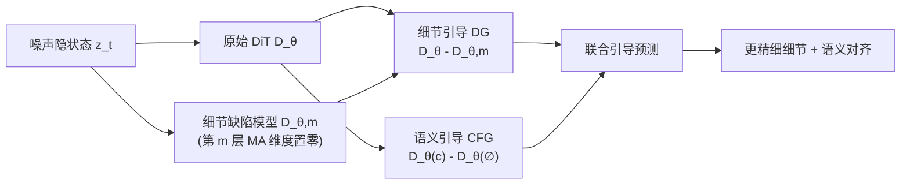

# Massive Activations are the Key to Local Detail Synthesis in Diffusion Transformers

**会议**: ICLR 2026  
**OpenReview**: [https://openreview.net/forum?id=tOOAWDRjrb](https://openreview.net/forum?id=tOOAWDRjrb)  
**代码**: [项目主页](https://ganchaofan0000.github.io/DG)  
**领域**: 图像生成 / Diffusion Transformer  
**关键词**: Massive Activations, Diffusion Transformer, Detail Guidance, 训练无关采样引导, CFG  

## 一句话总结
本文系统揭示 Diffusion Transformer（DiT）中"巨大激活值（Massive Activations, MA）"专门负责局部细节合成、几乎不影响整体语义，并据此提出训练无关的自引导策略 Detail Guidance（DG）——用"破坏 MA 后的退化模型"反向引导原模型生成更精细的细节。

## 研究背景与动机
- **领域现状**：Massive Activations（少数固定维度上出现异常大数值的隐状态）在 LLM 和 ViT 中早有记录：LLM 里它们出现在起始/分隔等低信息 token 上、支撑长上下文建模；ViT 里它们出现在背景冗余 token 上、编码全局语义。近期工作（DiTF、量化/蒸馏相关）也观察到 DiT 中存在类似离群激活，但只把它当作量化的"麻烦制造者"。
- **现有痛点**：MA 在 DiT 视觉生成过程中到底起什么作用，几乎没人系统研究过。同时，标准采样引导 CFG（Classifier-Free Guidance）虽能强化语义对齐，却常常导致**细粒度局部细节合成不足**（纹理、眼睛、发丝等模糊）。
- **核心矛盾**：DiT 中的 MA 与 LLM/ViT 截然不同——它**出现在所有空间 token 上**（而非个别低信息 token），暗示其功能不是编码全局语义，而是另有所图；但这一功能此前是空白。
- **本文目标**：搞清 MA 在 DiT 里的来源、分布规律与功能角色，并把这一机理转化为一个即插即用、无需训练的细节增强工具。
- **核心 idea**：**【机理发现】** MA 由 AdaLN 回归出的残差缩放因子 $\alpha^k$ 主导、其幅度由 timestep 嵌入调制，且专门驱动局部细节合成；**【方法落点】** 主动破坏 MA 得到"细节缺陷"模型，用自引导把原模型推向更高细节保真度。

## 方法详解

### 整体框架
本文先做机理探查（MA 的特征 + 干预实验），再把结论转成方法。机理侧得到两条结论：MA 由 timestep 调制、且是局部细节合成的关键。方法侧 Detail Guidance（DG）据此构造一个"破坏 MA 后的退化模型" $D_{\theta,m}$，沿 Karras 自引导范式用原模型与退化模型之差作为细节引导信号，可单独使用，也能与 CFG 正交叠加。

### 关键设计

**1. MA 溯源到 AdaLN 缩放因子与 timestep 调制：解释"巨大激活从哪来、谁控制"。** DiT 的隐状态通过残差连接逐块更新 $z_t^{k+1} = z_t^k + \alpha^k D_k(z_t^k, t, c)$，其中维度级缩放因子 $\alpha^k = \mathrm{MLP}^k(t, c)$ 由 AdaLN 根据 timestep $t$ 和文本 $c$ 回归得到。作者对比 $z_t^k$ 与 $\alpha^k$ 的逐维分布，发现 $\alpha^k$ 在某固定维度（如 SD3 的第 810 维）出现尖峰，正好对应 MA 的集中维度——说明缩放因子决定了 MA 的"维度位置"。进一步拆解 $t$ 与 $c$ 的贡献：跨 1000 条不同文本 prompt，MA 幅度几乎不变（约 150），说明**文本嵌入对 MA 影响可忽略**；而当 $t$ 从 $T$ 降到 $0$，MA 幅度稳步增大，说明**timestep 嵌入主导 MA 的幅度**。这一结论横跨 SD3/SD3.5/Flux，且 MA 在所有层、所有训练阶段（50k 迭代前就出现）、各种模型规模上都稳定存在。

**2. 激活干预实验定位 MA 功能 = 局部细节合成。** 借鉴激活干预方法，作者在单层手动把 MA 维度的数值破坏掉，再让被改的隐状态继续往后传播，对比原模型与"MA 破坏模型"的输出。结果两点清晰：其一，MA 破坏后图像的**全局语义几乎不变**——物体身份、配色、整体布局都保持一致，Blipscore/Clipscore 的胜率与原模型相当（0.462 vs 0.538、0.512 vs 0.488），说明 MA 对语义影响极小（与"文本对 MA 无影响"互相印证）；其二，**局部细节显著退化**——纹理、眼睛、发丝等精细部分明显变糊，在细节质量指标上胜率骤降（HPSv2.1 仅 0.028、Laion-Aesthetics 仅 0.078）。由此得出统一图景：DiT 给所有空间 token 分配 MA 来驱动各 token 的细粒度细节合成，并用 timestep 调制 MA，从而在采样从粗结构（大 $t$）到细修饰（小 $t$）的过程中自适应地编排细节生成。

**3. Detail Guidance（DG）：用"细节缺陷模型"做训练无关自引导。** 设 $D_\theta$ 为原始预训练 DiT，把第 $m$ 层隐状态 $z_t^k$ 中 MA 对应的维度置零（masking）得到 $\tilde z_t^k$，再往后传播，就得到一个细节能力被阉割的退化模型 $D_{\theta,m}$。沿自引导思想，用两者之差把原模型推离"细节缺陷"分布：
$$\hat D_\theta(z_t,t,c) = D_\theta(z_t,t,c) + w\big(D_\theta(z_t,t,c) - D_{\theta,m}(z_t,t,c)\big)$$
其中 $w$ 控制细节引导强度。整个过程不需要任何额外训练或微调，直接套用到现成 DiT 上即可。

**4. 与 CFG 正交叠加：语义与细节联合增强。** DG 强化局部细节、CFG 强化语义对齐，二者方向互补，可线性合并为联合引导：
$$\hat D_\theta(z_t,t,c) = D_\theta(z_t,t,c) + \lambda\big(D_\theta(z_t,t,c) - D_\theta(z_t,t)\big) + w\big(D_\theta(z_t,t,c) - D_{\theta,m}(z_t,t,c)\big)$$
$\lambda$、$w$ 分别为 CFG 与 DG 的引导尺度。相比 PAG（改自注意力图）等同类自引导，DG 直接针对"细节驱动器"MA 做退化，目标更明确；相比 auto-guidance 需要额外的欠训练"坏模型"，DG 无需任何额外模型。

## 实验关键数据

### 主实验表格（Pick-a-Pic，DG 增益）

| 模型 | 设置 | DG | Clipscore | Blipscore | HPSv2.1 | Aesthetic |
|------|------|----|-----------|-----------|---------|-----------|
| SD3 | Cond | ✗ / ✓ | 22.11 → 24.15 | 66.74 → 76.52 | 21.84 → 28.65 | 5.58 → 6.01 |
| SD3 | CFG | ✗ / ✓ | 26.64 → 26.25 | 87.01 → 86.32 | 28.23 → 29.87 | 5.80 → 6.03 |
| SD3.5 | Cond | ✗ / ✓ | 24.90 → 26.01 | 70.09 → 83.66 | 23.65 → 29.23 | 5.94 → 6.16 |
| SD3.5 | CFG | ✗ / ✓ | 27.67 → 27.68 | 92.62 → 91.61 | 29.90 → 30.70 | 6.01 → 6.18 |
| Flux | Cond | ✗ / ✓ | 22.09 → 25.69 | 57.60 → 80.55 | 19.33 → 27.88 | 5.50 → 6.13 |
| Flux | CFG | ✗ / ✓ | 27.04 → 27.14 | 87.76 → 86.23 | 29.16 → 29.25 | 5.96 → 6.12 |

无 CFG 的条件生成下 DG 增益最猛（如 Flux 的 HPSv2.1 从 19.33→27.88、Blipscore 从 57.60→80.55）；CFG 设置下 DG 也能稳定抬高细节质量指标。

### 消融实验表格（HPSv2.1，SD3，与各类引导对比）

| 方法 | 需训练无条件分支 | HPSv2.1 Avg. | Aesthetic |
|------|------|------|------|
| CFG | ✓ | 30.24 | 5.93 |
| CFG-Zero | ✓ | 30.57 | 6.07 |
| FA-CFG | ✓ | 30.26 | 5.96 |
| PAG | ✗ | 29.20 | 6.10 |
| **DG (Ours)** | ✗ | 30.14 | **6.14** |
| **CFG+DG (Ours)** | ✓ | **30.96** | 6.13 |

DG 无需训练无条件分支，单独使用 Aesthetic 已超过所有对比（6.14），细节质量优于同类自引导 PAG（30.14 vs 29.20）；叠加 CFG 后 HPSv2.1 取得最佳 30.96。

### 关键发现
- MA 由 AdaLN 缩放因子 $\alpha^k$ 决定维度、由 timestep 决定幅度，与文本几乎无关。
- 破坏 MA 几乎不动语义（Clip/Blip 胜率持平），却让细节质量胜率骤降到 0.028（HPSv2.1）。
- DG 在 SD3/SD3.5/Flux 三种主流 DiT 上一致涨点，无 CFG 时增益最大；并在 ImageNet 类条件生成上同样有效。
- 论文还消融了破坏深度 $m$ 与引导尺度 $\lambda, w$ 的影响，给出实践取值范围。

## 亮点与洞察
- **机理→方法闭环干净**：先用"文本无关 + 干预破坏"两条独立证据锁定"MA 管细节不管语义"，再直接把破坏操作变成生成引导，逻辑自洽且可解释。
- **训练无关、即插即用**：只动隐状态、零训练成本，可套在任意预训练 DiT 上，落地门槛极低。
- **与 CFG 正交**：把"语义对齐（CFG）"和"细节保真（DG）"解耦成两个可独立调强度的引导项，给了实践者一个新旋钮。
- **统一了 timestep 与细节的关系**：MA 随 $t$ 减小而增大，恰好对应扩散从粗到细的生成动力学，给"timestep 在 DiT 里到底调什么"提供了具体落点。

## 局限与展望
- DG 引入第二次前向（退化模型），采样需要额外计算 $D_{\theta,m}$，推理开销上升。
- 破坏深度 $m$ 与尺度 $w$ 需调参，最优值随模型/数据集变化，缺少自适应方案。
- MA 维度的识别依赖经验观察（如 SD3 第 810 维），跨架构的自动定位机制尚未给出。
- 主要验证在文生图 DiT，视频 DiT、更大规模模型上的普适性仍待检验。

## 相关工作与启发
- **Massive Activations 谱系**：LLM 中 MA 支撑长上下文（Sun et al. 2024、StreamingLLM），ViT 中 MA 编码全局语义（Darcet et al. 2024 registers），DiTF（Gan et al. 2025）发现 DiT 特征提取里 MA 影响判别质量——本文补上了"DiT 生成里 MA 管细节"这块拼图，并指出 DiT 的 MA 跨所有 token 这一关键差异。
- **采样引导**：从 CFG 出发，auto-guidance 用欠训练"坏模型"自引导、PAG 扰动注意力图、CFG-Zero/FA-CFG/Semantic-CFG 等做内容/频率自适应——DG 的独特之处是把"坏模型"精确定位到 MA 这一细节驱动器上。
- **启发**：内部激活的功能性分解（哪些维度管语义、哪些管细节）可以反过来变成可控生成的抓手，这一"机理即工具"的思路或可推广到风格、结构等其他属性的解耦控制。

## 评分
- **新颖性**: ⭐⭐⭐⭐ — 首次系统刻画 DiT 中 MA 的功能（局部细节）并溯源到 timestep/AdaLN，机理发现扎实；DG 作为机理衍生工具自然但巧妙。
- **实验充分度**: ⭐⭐⭐⭐ — 覆盖 SD3/SD3.5/Flux 三模型、两数据集、多指标，并与 6 种引导方法对比 + timestep/深度/尺度消融，较完整。
- **写作质量**: ⭐⭐⭐⭐ — "现象→特征→干预→方法"层层递进，图表（MA 分布、干预对比、引导可视化）支撑清晰。
- **价值**: ⭐⭐⭐⭐ — 训练无关、即插即用、与 CFG 正交，对现成 DiT 的细节增强有直接落地价值，机理洞察也有启发性。

<!-- RELATED:START -->

## 相关论文

- [\[NeurIPS 2025\] Unleashing Diffusion Transformers for Visual Correspondence by Modulating Massive Activations](../../NeurIPS2025/image_generation/unleashing_diffusion_transformers_for_visual_correspondence_by_modulating_massiv.md)
- [\[ICLR 2026\] Scaling Laws for Diffusion Transformers](scaling_laws_for_diffusion_transformers.md)
- [\[ICLR 2026\] Rethinking Global Text Conditioning in Diffusion Transformers](rethinking_global_text_conditioning_in_diffusion_transformers.md)
- [\[ICLR 2026\] A Hidden Semantic Bottleneck in Conditional Embeddings of Diffusion Transformers](a_hidden_semantic_bottleneck_in_conditional_embeddings_of_diffusion_transformers.md)
- [\[ICLR 2026\] MADFormer: Mixed Autoregressive and Diffusion Transformers for Continuous Image Generation](textitmadformer_mixed_autoregressive_and_diffusion_transformers_for_continuous_i.md)

<!-- RELATED:END -->
