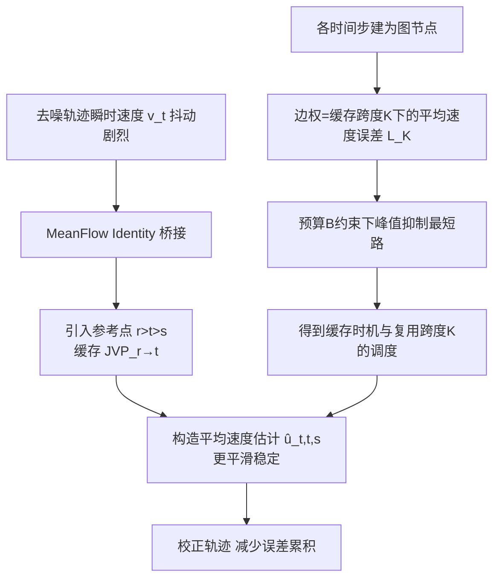

# MeanCache: From Instantaneous to Average Velocity for Accelerating Flow Matching Inference

**会议**: ICLR 2026  
**OpenReview**: [https://openreview.net/forum?id=GMCyL7Xs9R](https://openreview.net/forum?id=GMCyL7Xs9R)  
**代码**: [UnicomAI/MeanCache](https://github.com/UnicomAI/MeanCache)  
**领域**: 图像生成 / 扩散加速  
**关键词**: Flow Matching, 训练无关缓存, 平均速度, JVP, 轨迹稳定调度  

## 一句话总结
MeanCache 把扩散/Flow Matching 的特征缓存从"瞬时速度"视角搬到"区间平均速度"视角，用缓存的雅可比-向量积（JVP）从瞬时速度重建更平滑的平均速度，并用一个预算约束下的"峰值抑制最短路"调度决定何时缓存、复用多长，从而在 FLUX.1、Qwen-Image、HunyuanVideo 上分别达到 4.12×、4.56×、3.59× 加速且画质优于现有缓存方法。

## 研究背景与动机

**领域现状**：Flow Matching 通过学习瞬时速度场 $v_\theta(x_t,t)$ 来建模噪声到数据的连续传输路径，已成为图像/视频/多模态生成的主流范式，但 FLUX.1、Qwen-Image、HunyuanVideo 这类商业级模型显存大、单步计算重、推理延迟高。蒸馏、剪枝、量化等加速手段都要改架构、重训练；相比之下，**缓存（caching）是训练无关的轻量替代**——复用选定时间步的中间特征跳过冗余计算。

**现有痛点**：主流缓存方法（TeaCache、TaylorSeer、DiCache 等）本质都工作在**瞬时速度域**：直接复用上一步的特征/速度去重建中间状态。但瞬时速度沿去噪轨迹剧烈抖动（论文 Fig.2 左），在高加速比下复用它会**指数级累积误差**，使轨迹偏离真实路径，画质崩坏。同时"何时缓存"靠固定间隔或手调阈值，在高加速比下质量退化严重。

**核心矛盾**：要更高加速比就得更激进地跳步，但瞬时速度不稳定 → 跳得越多轨迹漂移越严重。**用什么信号来重建被跳过的区间，既稳定又训练无关？**

**本文目标**：在不重训练、限定计算预算的前提下，找到一个比瞬时速度更平滑、更适合复用的缓存信号，并系统化地决定缓存的时机与跨度。

**核心 idea**：受 MeanFlow 启发——区间平均速度 $u$ 比瞬时速度平滑得多。**【从瞬时到平均】** 用 MeanFlow Identity 把瞬时速度与平均速度通过一个 JVP 项桥接起来，于是可以用早期缓存值近似该 JVP，从瞬时速度反推出平滑的平均速度去校正轨迹；再用 **【图最短路调度】** 把"何时缓存、复用多长"建模成预算约束下的图最短路问题。

## 方法详解

### 整体框架
MeanCache 包含两个组件：（1）**瞬时→平均速度变换**——基于 MeanFlow Identity，用缓存的 JVP 从瞬时速度 $v(z_t,t)$ 构造区间平均速度估计 $\hat{u}(z_t,t,s)$，作为更稳定的轨迹重建信号；（2）**轨迹稳定调度**——把去噪时间步建成多重图，边权是不同缓存跨度 $K$ 下的平均速度误差，用预算约束下的"峰值抑制最短路"决定缓存放在哪、每段复用多长。整套流程训练无关、即插即用。

### 关键设计

**1. 瞬时→平均速度变换：用 JVP 把抖动信号磨平。** Flow Matching 训练网络预测瞬时速度，得到 ODE $d\hat{x}_t = v_\theta(x_t,t)\,dt$；MeanFlow 则定义区间 $[s,t]$ 上的平均速度 $u(z_s,t,s)=\frac{1}{s-t}\int_t^s v(z_\tau,\tau)\,d\tau$，并给出 MeanFlow Identity $v(z_s,s)=u(z_s,t,s)+(s-t)\frac{d}{ds}u(z_s,t,s)$ 把两者桥接，其中导数项可写成一个雅可比-向量积（JVP）。直观上：直接把瞬时速度 $v(z_t,t)$ 在区间 $[t,s]$ 上外推会漂移，而平均速度能准确抵达目标 $s$。论文把恒等式从端点 $s$ 推广到起点 $t$，得到 $v(z_t,t)=u(z_t,t,s)-(s-t)\frac{d}{dt}u(z_t,t,s)$，于是平均速度可由瞬时速度加一个 JVP 校正项重建：$\hat{u}(z_t,t,s):=v(z_t,t)+(s-t)\,\widehat{\mathrm{JVP}}$。关键在于推理时真实 JVP 不可得，必须用缓存近似——这正是缓存能切入的地方。

**2. JVP-based 缓存构造：让校正项完全可缓存。** 引入一个早于 $t$ 的参考点 $r$（$r>t>s$），它正是更早一步的缓存状态。把起点恒等式套在区间 $[t,r]$ 上整理得 $\widehat{\mathrm{JVP}}=\frac{u(z_r,r,t)-v(z_r,r)}{t-r}$，再用平均速度的位移形式 $u(z_r,r,t)=\frac{z_t-z_r}{t-r}$ 代入，得到**完全可缓存的估计器** $\widehat{\mathrm{JVP}}=\frac{z_t-z_r-(t-r)v(z_r,r)}{(t-r)^2}$。这样平均速度预测 $\hat{u}(z_t,t,s)=v(z_t,t)+(s-t)\frac{z_t-z_r-(t-r)v(z_r,r)}{(t-r)^2}$ 只用到当前与缓存的潜变量、速度，无需任何重训练。用 $K$ 表示 $r$ 到 $t$ 之间的离散步数：$K>1$ 时用上式做平均速度校正，$K=1$ 时退化为纯瞬时速度。$K$ 越大复用区间越长，但近似误差也越大——$K$ 的选择直接决定近似精度与稳定性的平衡，这就需要一个有原则的调度。

**3. 轨迹稳定调度：把"何时缓存、复用多长"解成图最短路。** 论文观察到：尽管不同 prompt/seed 的潜变量绝对值不同，但它们在固定时间步的**相对变化高度一致**（TeaCache 也有类似发现），因此缓存决策可由一张预计算的稳定性图引导，而非固定启发式。定义 $t\to s$ 的误差为真实与缓存平均速度之差 $L_K(t,s)=\|u(z_t,t,s)-\hat{u}(z_t,t,s)\|$，把时间步建成多重图 $G=(V,E)$：节点是去噪步，有向边 $t\to s$（$t>s$）代表一次缓存转移，边权 $E_K(t\to s)=L_K(t,s)$；因同一对节点可有多个缓存跨度 $K$，故是多重图。

**4. 峰值抑制最短路：避免误差集中在少数边。** 给定误差加权多重图，调度退化为受约束最短路搜索。但小预算下普通最短路可能把误差**集中到少数几条边**形成尖峰。为此引入峰值抑制目标，对高误差边做幂次惩罚：$\pi^\star=\arg\min_{\pi\in P(T,0)}\sum_{e\in\pi}C(e)^\gamma\ \ \text{s.t.}\ |\pi|\le B\le T$，其中 $C(e)$ 是边的误差代价，$\gamma\ge1$ 是峰值抑制参数（$\gamma=1$ 退化为标准最短路），预算 $B$（等价于函数评估次数 NFE）直接控制加速比。该问题可用动态规划高效求解。消融显示 $\gamma=5$ 时各项指标最佳，证明抑制误差尖峰确有必要。

## 实验关键数据

### 主实验表格（文生图，FLUX.1 [dev] / Qwen-Image）

| 模型 | 方法 | 加速 | ImageReward↑ | CLIP↑ | LPIPS↓ | SSIM↑ | PSNR↑ |
|------|------|------|------|------|------|------|------|
| FLUX.1 | Original 50步 | 1.00× | 1.033 | 31.229 | – | – | – |
| FLUX.1 | TaylorSeer (N=6,O=2) | 2.74× | 0.971 | 31.310 | 0.415 | 0.663 | 16.278 |
| FLUX.1 | **MeanCache (B=15)** | 2.91× | 1.010 | 31.244 | **0.142** | **0.870** | **24.834** |
| FLUX.1 | TaylorSeer (N=20,O=1)† | 3.73× | -0.727 | 24.412 | 0.798 | 0.443 | 11.219 |
| FLUX.1 | **MeanCache (B=10)** | **4.12×** | **0.993** | **31.323** | **0.272** | **0.761** | **19.425** |
| Qwen-Image | Original 50步 | 1.00× | 1.180 | 33.626 | – | – | – |
| Qwen-Image | DBCache (r=0.6) | 2.74× | 1.016 | 33.435 | 0.298 | 0.825 | 22.221 |
| Qwen-Image | **MeanCache (B=13)** | 3.60× | 1.147 | 33.799 | 0.113 | 0.907 | 24.802 |
| Qwen-Image | **MeanCache (B=10)** | **4.56×** | **1.142** | 33.621 | 0.236 | 0.815 | 18.983 |

†号方法在 ImageReward 上严重退化（画质崩坏）。MeanCache 在 4×+ 加速下 ImageReward 仍接近原始，而 TaylorSeer/DiCache 已为负值。

### 文生视频（HunyuanVideo）

| 方法 | 加速 | VBench↑ | LPIPS↓ | SSIM↑ | PSNR↑ |
|------|------|------|------|------|------|
| Original 50步 | 1.00× | 80.39% | – | – | – |
| TeaCache (l=0.33) | 3.11× | 80.02% | 0.363 | 0.651 | 17.957 |
| **MeanCache (B=12)** | 3.21× | 80.01% | **0.176** | **0.809** | **24.002** |
| **MeanCache (B=10)** | **3.59×** | **80.08%** | 0.269 | 0.732 | 20.464 |

### 消融实验表格（峰值抑制参数 γ，FLUX.1 B=15）

| γ | Reward↑ | CLIP↑ | LPIPS↓ | SSIM↑ | PSNR↑ |
|------|------|------|------|------|------|
| 1 | 1.0136 | 31.201 | 0.192 | 0.826 | 22.376 |
| 2 | 1.0072 | 31.195 | 0.148 | 0.860 | 24.147 |
| 4 | 1.0179 | 31.291 | 0.135 | 0.869 | 24.569 |
| 5 | 1.0177 | 31.271 | 0.140 | **0.871** | 24.568 |

### 关键发现
- **平均速度比瞬时速度稳得多**：高加速比下，瞬时速度域方法 LPIPS 暴涨、ImageReward 转负，而 MeanCache 在 4.12×/4.56× 仍保持近原始画质。
- **早期时间步更关键**：最短路可视化（Fig.6）显示去噪早期步对质量至关重要、不宜跳，后半段贡献小更适合跳过；且最优 JVP 跨度 $K$ 随预算和时间步联合变化，不是固定值。
- **峰值抑制有效**：$\gamma=1$（标准最短路）质量未达最优，说明误差被集中到少数边；$\gamma$ 增大后各指标改善。
- **罕见词鲁棒性**：在"Matutinal"等罕见词 prompt 下，TaylorSeer/TeaCache 高加速比时内容漂移严重，MeanCache 在 4.12× 仍保留原始内容细节。

## 亮点与洞察
- **视角转换带来质变**：把缓存问题从"复用瞬时速度"重构为"重建平均速度"，抓住了 Flow Matching"轨迹应近似线性"的本质——平均速度天然平滑，是更好的复用对象。这是一个简洁却有解释力的 reframing。
- **JVP 当作"瞬时↔平均"的计算桥**：MeanFlow Identity 里那一项导数恰好是 JVP，论文把它从理论恒等式变成可缓存的实用估计器，理论与工程衔接漂亮。
- **调度被形式化为带约束最短路**：把"何时缓存/复用多长"这种以往靠手调阈值的工程问题，建成多重图上的预算约束最短路并用 DP 求解，预算 $B$ 直接等价于 NFE 来精确控制加速比，干净可控。
- **峰值抑制是细节但关键**：直接最短路会把误差堆到少数边产生尖峰，幂次惩罚把误差摊平，这是高加速比下不崩的实际原因之一。

## 局限与展望
- **依赖预计算稳定性图**：多重图边权需用 50 条采样 prompt、5 个 seed 预先计算，虽训练无关但仍有一次性离线开销；图建在某模型/分辨率上，跨模型迁移性未充分讨论。
- **相对变化一致性假设**：调度成立的前提是"固定时间步相对变化跨样本一致"，对分布外/极端 prompt 是否仍成立缺乏边界分析。
- **JVP 近似误差随 K 增长**：大 $K$ 复用更激进但近似误差更大，论文靠调度缓解但未给出近似误差的理论上界。
- **未与蒸馏类少步模型正面对比**：方法定位训练无关缓存，但与 few-step 蒸馏模型在同等延迟下的质量对比可进一步补充。

## 相关工作与启发
- **MeanFlow（Geng et al., 2025）** 是直接思想来源：首次系统提出用平均速度建模、给出 MeanFlow Identity；MeanCache 把它从"训练时建模"借用为"推理时缓存重建"。
- **缓存路线**：DeepCache（手工规则）→ TeaCache（时间步嵌入与输出相关性 + 阈值）→ TaylorSeer（泰勒展开式多步特征复用）→ DiCache（浅层在线探针）→ DBCache、LeMiCa（DAG 全局缓存）。MeanCache 指出这些都停留在瞬时速度域，是其主要区别点。
- **图建模调度**：受 ShortDF 的图式建模与序列处理中轨迹漂移抑制启发，把缓存调度建成最短路。
- **启发**：当某个复用信号不稳定时，不一定要换更复杂的模型，而可以换一个数学上等价、但更平滑的表示（瞬时→平均），再把"用多少、放哪里"形式化成可优化的离散问题。这种"换表示 + 离散优化调度"的组合对其他训练无关加速场景有借鉴价值。

## 评分
- **新颖性**: ⭐⭐⭐⭐ 把缓存从瞬时速度域搬到平均速度域、用 JVP 当桥并形式化为最短路调度，视角清晰且少见，虽建立在 MeanFlow 之上但迁移思路有原创性。
- **实验充分度**: ⭐⭐⭐⭐ 覆盖 FLUX.1/Qwen-Image/HunyuanVideo 三个商业级模型与图像/视频两类任务，对比 6+ 主流缓存基线，含 γ、最短路、罕见词一致性等消融；少与蒸馏少步模型同延迟对比。
- **写作质量**: ⭐⭐⭐⭐ 从瞬时到平均的动机—推导—工程化链条连贯，公式与图配合清楚，可读性强。
- **价值**: ⭐⭐⭐⭐ 训练无关、即插即用、4×+ 加速且近无损，对商业级生成模型的实际部署有直接价值。

<!-- RELATED:START -->

## 相关论文

- [\[ICLR 2026\] Terminal Velocity Matching](terminal_velocity_matching.md)
- [\[ICLR 2026\] FastFlow: Accelerating The Generative Flow Matching Models with Bandit Inference](fastflow_accelerating_the_generative_flow_matching_models_with_bandit_inference.md)
- [\[ICML 2026\] Stable Velocity: A Variance Perspective on Flow Matching](../../ICML2026/image_generation/stable_velocity_a_variance_perspective_on_flow_matching.md)
- [\[ICLR 2026\] Delay Flow Matching](delay_flow_matching.md)
- [\[ICLR 2026\] Flow Matching with Semidiscrete Couplings](flow_matching_with_semidiscrete_couplings.md)

<!-- RELATED:END -->
