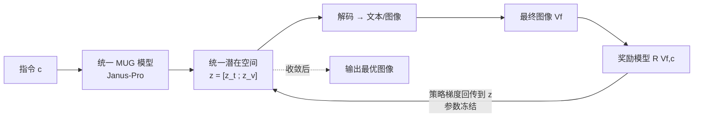

# MILR: Improving Multimodal Image Generation via Test-Time Latent Reasoning

**会议**: ICLR 2026  
**代码**: [https://github.com/spatigen/milr](https://github.com/spatigen/milr)  
**领域**: 图像生成 / 多模态推理  
**关键词**: 多模态图像生成, 测试时推理, 潜在空间推理, 策略梯度, 统一理解与生成  

## 一句话总结
MILR 把"推理增强图像生成"搬进文本与图像**共享的统一潜在向量空间**，在测试时用策略梯度（REINFORCE）+ 图像质量 critic 联合优化文/图 token 的中间表征，不动任何模型参数就在 GenEval/T2I-CompBench/WISE 上全部刷到 SOTA，尤其在知识密集的 WISE 上把基座提升 80%。

## 研究背景与动机
- **领域现状**：文生图从 GAN 走到自回归与扩散后，又被"推理增强"思路点燃——借鉴 o1/DeepSeek-R1 的反思能力，让生成模型先想后画。现有做法分两条线：**语言推理**（改写、扩写 prompt 让模型更好理解）和**图像推理**（用质量指标迭代修图）。
- **现有痛点**：早期方法只在语言**或**图像单一空间里推理，缺乏跨模态协同；后来借助统一理解与生成框架（MUG）实现"先语言推理再画图"，但这类方法**需要精心构造的推理数据并依赖微调**，开发复杂且昂贵。
- **核心矛盾**：跨模态协同推理的好处人人想要，但要么被锁死在单模态，要么被训练成本和数据质量卡住——能不能**既跨模态、又免训练**？
- **本文目标**：提出一种纯测试时、不改参数、且天然跨模态的推理方法。
- **核心 idea**：**【统一潜在空间推理】** 不在离散的原始图像/文本上推理，而在两者共享的连续潜在向量空间（Transformer 中间输出）里搜索；因为该空间是模态无关的，提供了视觉与文本推理的统一视角，缩小模态鸿沟。**【测试时策略梯度】** 用 REINFORCE 把质量奖励的梯度只回传到这些中间潜在表征上，参数全程冻结。

## 方法详解

### 整体框架
MILR 构建在基于 Transformer 的 MUG 模型（实例化为 Janus-Pro）之上。一次前向得到文本 token 与图像 token 的潜在表征 $z=[z^{(t)};z^{(v)}]$（取自最后一层、即送进各模态解码头之前的向量），它们落在同一个 $d$ 维空间。MILR 在测试时反复迭代这组潜在向量：解码出图像 → reward 模型按指令打分 → 把奖励梯度只回传给 $z$ → 更新 $z$ → 再解码，循环至多 $T$ 步。整个过程不触碰任何模型权重。

### 关键设计

**1. 多模态潜在推理：把搜索从离散 token 挪到共享向量空间。** MUG 把多模态生成定义为自回归过程 $p(t,v|c)=\prod_n p(v_n|v_{1:n},t,c)\prod_m p(t_m|t_{1:m},c)$，图像的生成依赖于由指令产生的语言推理 token。测试时推理的目标是找一对 $(t^*,v^*)$ 最大化期望奖励 $\mathbb{E}_{V_f\sim p(\cdot|t,v,c)}[R(V_f,c)]$，但在离散 token 上搜索空间无限、不可解。MILR 改为在连续潜在表征上搜索：$z^*=\arg\max_z \mathbb{E}_{V_f\sim p(\cdot|z,c)}[R(V_f,c)]$，其中 $z=[z^{(t)};z^{(v)}]$ 同时编码文与图，天然提供统一的跨模态视角，把"修指令"和"修图"统一成一件事。拿到最优 $z^*$ 后，继续走完剩余前向 $p(V_f|z^*,c)=p(V_f|t,v,c)\,p(t,v|z^*)$ 解出最终图像。

**2. 基于 REINFORCE 的测试时梯度优化：奖励只推潜变量、不动参数。** 上述目标无闭式解，MILR 用策略梯度 REINFORCE 迭代更新：$z_{k+1}\leftarrow z_k+\eta\cdot \mathcal{J}(z_k)$，其中 $\mathcal{J}(z_k)=\mathbb{E}_{V_f\sim p(\cdot|z_k,c)}[R(V_f,c)\,\nabla_z\log p(t,v|z_k)]$。作者用单次采样 $(t,v)$ 近似该期望梯度，且梯度**只**回传到模型输出 $z$、不改任何参数——这正是它"测试时"的来源。该文首次把原本用于纯文本推理的 REINFORCE 扩展到统一多模态潜在推理上做图像生成。

**3. 前缀部分优化：只优化前 $\lambda$ 比例的 token 以平衡效率与探索。** 若把全部 $M+N$ 个潜变量都优化，仅靠 reward 引导容易有偏、也浪费了 MUG 自身的生成能力。MILR 只优化文本的前 $\lambda_t M$ 个潜变量（解码成离散 token 后，剩余用标准自回归补全），图像同理只优化前 $\lambda_v N$ 个。这一选择有依据：已有观察表明图像前几个 token 主导全局结构、后面的 token 影响高频细节。实验定出 $\lambda_t=0.2$、$\lambda_v=0.02$（图像只需极少前缀），学习率 0.03，最多 16 步即收敛，单张 A100 80GB 即可跑。

## 实验关键数据

### 主实验
基座为 Janus-Pro-7B，每个 benchmark 用其自带评测工具作为 reward 模型。

| 方法 | GenEval Overall ↑ | T2I-CompBench Overall ↑ | WISE Avg ↑ |
|---|---|---|---|
| Janus-Pro-7B（基座） | 0.78 | 0.3921 | 0.35 |
| GoT-R1（训练式推理） | — | 0.5241 | — |
| T2I-R1（训练式推理） | 0.79 | 0.5281 | 0.54 |
| Flow-GRPO（训练式推理） | 0.95 | — | — |
| ReflectionFlow（测试时推理） | 0.91 | — | — |
| Janus-Pro-7B+PARM（测试时） | 0.91 | — | — |
| **Janus-Pro-7B+MILR** | **0.95** | **0.5325** | **0.63** |

- GenEval 比基座 +0.17，最大增益来自 Counting(+0.34)、Position(+0.21)、Attribute Binding(+0.27)；超过最强测试时方法 +4.5%。
- WISE（知识密集）从 0.35 → 0.63，**提升 80%**，比第二名 T2I-R1 高 16.7%。
- 1B 基座上同样有效：GenEval 0.73→0.89，WISE 0.26→0.40。

### 消融实验

| 设置 | GenEval Overall | T2I-CompBench | WISE Avg |
|---|---|---|---|
| 完整 MILR（文+图） | 0.95 | 0.5325 | 0.63 |
| w/o Image（仅文本优化） | 0.94 | 0.5210 | 0.61 |
| w/o Text（仅图像优化） | 0.93 | 0.5043 | 0.56 |
| w/o MILR（基座） | 0.78 | 0.3921 | 0.35 |

### 关键发现
- 文、图任一单独优化都能大幅超过基座（WISE 上 >0.21），二者联合最优 —— 印证统一潜在空间里的联合推理是性能关键。
- 仅文本优化略好于仅图像优化、且逼近完整模型，说明 MUG 的语言理解组件仍有较大提升空间。
- 优化步数从 1 扩到 16 持续涨分、之后饱和，体现了测试时计算的可扩展性。
- 图像侧只需优化极少前缀 token（$\lambda_v=0.02$）就够，文本侧 $\lambda_t=0.2$，前缀优化优于随机子集优化，与"前几个 token 决定全局结构"的观察一致。
- 定性上 MILR 展现出非平凡的几何/时间/文化推理：能从"洛杉矶 3PM 时的长城"推断出"黎明的长城"，能推出莲花在中国文化中象征纯洁。
- 在 GenEval 上 MILR（0.95）已追平最佳训练式模型 Flow-GRPO，但无需任何参数微调，体现测试时方法的竞争力。

## 亮点与洞察
- **范式新意**：把"推理"从原始 token 层面下沉到模态无关的潜在向量层面，让"改 prompt"和"修图"在同一空间里被同一套梯度统一驱动，是对跨模态推理的一个干净抽象。
- **免训练、即插即用**：纯测试时优化，不动参数，任何具备多模态理解能力的现成模型都能当 reward，部署门槛低。
- **知识密集场景的大幅增益**很有说服力——80% 的 WISE 提升说明潜在推理真的在帮模型"想清楚"知识性指令，而非只是美化画质。
- **把训练时 RL 转为测试时 RL** 的视角值得借鉴：同样是 REINFORCE，作用对象从模型参数换成中间潜变量，既保留了奖励驱动的探索能力，又彻底回避了训练成本与灾难性遗忘。

## 局限与展望
- **测试时计算开销**：每张图需多步前向+反传（最多 16 步），相比单次生成更慢，吞吐受限。
- **依赖 reward 模型质量**：用 benchmark 自带评测器作 reward 有"对着评测优化"的嫌疑，泛化到开放指令时 reward 的可靠性存疑。
- **基座绑定**：方法依托 MUG/Janus-Pro 这类原生支持先语言后图像的统一框架，对纯扩散等不具备该结构的模型迁移性未知。
- **前缀启发式**：$\lambda_v=0.02$ 这类超参靠网格搜索得到，是否对所有数据/任务稳健仍需更多验证。

## 相关工作与启发
- **推理增强图像生成**：训练式（GoT-R1、T2I-R1、Flow-GRPO、GRPO/DPO-tuned Janus-Pro）需数据与微调；测试时式（Reflect-DiT、ReflectionFlow 用语言反馈，Best-of-N、PARM 靠搜索）依赖外部 critic。MILR 与它们都不同——不在原始图文上显式推理，而是优化潜在表征。
- **潜在空间推理**：相对显式的链式思考（CoT），latent reasoning 在隐状态上做隐式推理；MILR 首次把它扩展到统一多模态图像生成。
- **强化学习用于生成**：GRPO/PPO/REINFORCE 多被用作训练时优化，MILR 反其道用 REINFORCE 做**测试时**优化，是一个值得借鉴的思路转换。

## 评分
- **新颖性**: ⭐⭐⭐⭐ 把跨模态推理统一进共享潜在空间、并用测试时策略梯度免训练驱动，是一个清晰且有辨识度的新框架。
- **实验充分度**: ⭐⭐⭐⭐ 覆盖 GenEval/T2I-CompBench/WISE 三大基准，含 1B/7B 两种规模、文/图消融、步数与超参分析，证据较完整；用各 benchmark 自带评测器作 reward 略有"对评测优化"之嫌。
- **写作质量**: ⭐⭐⭐⭐ 动机—公式—策略链条清晰，图 1/图 2 把潜在推理讲得直观。
- **价值**: ⭐⭐⭐⭐ 免训练即插即用，WISE +80% 的增益对知识密集生成很有吸引力，且为"测试时潜在推理"提供了可复用范式。

<!-- RELATED:START -->

## 相关论文

- [\[ICLR 2026\] VFScale: Intrinsic Reasoning through Verifier-Free Test-time Scalable Diffusion Model](vfscale_intrinsic_reasoning_through_verifier-free_test-time_scalable_diffusion_m.md)
- [\[ICLR 2026\] Compose Your Policies! Improving Diffusion-based or Flow-based Robot Policies via Test-time Distribution-level Composition](compose_your_policies_improving_diffusion-based_or_flow-based_robot_policies_via.md)
- [\[ICLR 2026\] Test-Time Iterative Error Correction for Efficient Diffusion Models](test-time_iterative_error_correction_for_efficient_diffusion_models.md)
- [\[CVPR 2026\] Progress by Pieces: Test-Time Scaling for Autoregressive Image Generation](../../CVPR2026/image_generation/progress_by_pieces_test-time_scaling_for_autoregressive_image_generation.md)
- [\[ICLR 2026\] Mitigating Semantic Collapse in Generative Personalization with Test-Time Embedding Adjustment](mitigating_semantic_collapse_in_generative_personalization_with_test-time_embedd.md)

<!-- RELATED:END -->
