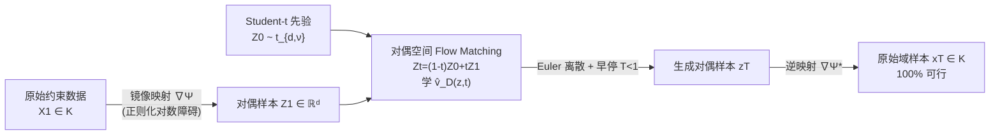

# Mirror Flow Matching with Heavy-Tailed Priors for Generative Modeling on Convex Domains

**会议**: ICLR 2026  
**OpenReview**: [https://openreview.net/forum?id=dZKl7uc0XQ](https://openreview.net/forum?id=dZKl7uc0XQ)  
**代码**: 补充材料提供  
**领域**: 受约束生成建模 / Flow Matching 理论  
**关键词**: Flow Matching, 镜像映射, 重尾分布, Student-t 先验, 凸约束生成, Wasserstein 收敛率  

## 一句话总结
针对凸域上的受约束生成建模，本文指出"对数障碍镜像映射会诱导重尾对偶分布 + 高斯先验匹配重尾目标失效"两大病灶，提出**正则化镜像映射 + Student-t 先验**的 Mirror Flow Matching，既保证对偶分布有限矩、又给出速度场时空 Lipschitz 性与 Wasserstein 收敛率的首个多项式尾界理论保证。

## 研究背景与动机
**领域现状**：Flow Matching 通过学习一个把简单先验（通常是高斯）连续输运到复杂目标的确定性速度场 $v(x,t)$，已成为统一 score-based diffusion 与最优传输的主流生成框架。但很多真实任务的目标分布支撑在**凸约束域**上——多面体、单纯形、半正定矩阵、$L_2$ 球等（分子生成、偏好对齐、机器人策略、水印图像生成），此时标准 Flow Matching 直接把无约束样本投影回域内会扭曲分布。

**现有痛点**：把约束生成转成无约束的主流思路是**镜像映射（mirror map）**：用严格凸势函数 $\Psi$ 的梯度 $\nabla\Psi: K\to\mathbb{R}^d$ 把原始域 $K$ 映到无约束对偶空间，在对偶空间做标准 Flow Matching，再用逆映射 $(\nabla\Psi)^{-1}$ 拉回，整条轨迹自动留在 $K$ 内。但经典对数障碍（log-barrier）镜像映射存在两个被忽视的隐患。

**核心矛盾**：第一，对数障碍把约束分布映到对偶空间后**会诱导重尾**——文中 Lemma 2.1 给出判据：若 $P(\|Y\|\ge R)\ge C/R^p$ 则 $p$ 阶矩不存在，重尾直接导致 Flow ODE 所需的矩条件被破坏、动力学病态。第二，目标比先验更重尾时，条件分布 $p(X_1\mid X_t=x)$ 会在 $x_1\approx x/t$ 处长出第二个模态，使真实速度场随 $\|x\|$ **超指数爆炸**、Lipschitz 常数发散，理论分析只能依赖"有界支撑"这种强假设。

**本文目标**：设计一套镜像映射 + 先验的**协同方案**，同时满足（1）把约束分布变成无约束分布；（2）保证关键矩（如二阶矩）存在；（3）势函数强凸，使对偶欧氏度量下的收敛保证可迁移回原始欧氏度量；并在多项式尾假设下给出可证明的收敛率。

**核心 idea**：**【正则化镜像映射控尾】** 在对数障碍上加二次项 $\frac12\|x\|^2$ 让 $\Psi$ 强凸并压制对偶重尾；**【Student-t 先验对齐重尾】** 用 $t$ 分布先验取代高斯，让数据分布主导条件分布的尾部、抑制 $x/t$ 处的伪模态，从而控住速度场。

## 方法详解

### 整体框架
方法分两个"配料"再组装：先用**正则化镜像映射** $\nabla\Psi$ 把原始约束数据 $X_1$ 映到对偶空间得到 $Z_1$，在对偶欧氏空间里用 **Student-t 先验** $Z_0\sim t_{d,\nu}$ 做直线插值 $Z_t=(1-t)Z_0+tZ_1$ 的标准 Flow Matching，学到对偶速度场 $\hat v_D$；采样时在对偶空间做 Euler 离散（带早停时刻 $T<1$），最后用逆映射 $\nabla\Psi^*$ 把样本拉回 $K$，构造性地保证 100% 可行。关键洞察是：对偶空间的直线插值等价于原始空间在平方 Hessian 度量 $(\nabla^2\Psi)^2$ 下的测地线插值，难处理的几何被镜像映射自动吸收。

### 关键设计

**1. 正则化对数障碍镜像映射：用二次项把"重尾 + 弱凸"一并治好。** 经典对数障碍只严格凸而非强凸，导致式 (1) 中度量比较常数 $L_\Psi$ 可能爆炸（哪怕二维三面多面体也会发散），而强凸性正是把对偶 Wasserstein 界 $W_{2,\Psi}$ 迁移成原始 $W_2$ 界的前提（$W_2(\nu,\mu)\le L_\Psi W_{2,\Psi}(\nu,\mu)$，要求 $\nabla\Psi^*$ 是 $L_\Psi$-Lipschitz 即 $\Psi$ 强凸）。本文提出 $\Psi(x)=-\frac{1}{1-\kappa}\sum_{i=1}^m(-\phi_i(x))^{1-\kappa}+\frac12\|x\|^2$：幂次 $1-\kappa$（$\kappa\in(0,1)$）把障碍项在边界附近的奇异性削弱以控尾，二次项 $\frac12\|x\|^2$ 强制强凸使 $W_2\le W_{2,\Psi}$。Proposition 2.2 证明：在自然的边界质量条件 $P(K\setminus K_\delta)\le C_K\delta^\beta$ 下，对偶尾满足 $P(\|\nabla\Psi(X)\|\ge R)\le C/R^{\beta/\kappa}$，只要取 $\kappa<\beta/p$ 即可保证 $E[\|\nabla\Psi(X)\|^p]$ 存在——参数 $\kappa$ 成为直接调控对偶尾轻重的旋钮。

**2. Student-t 先验对齐重尾、根除速度场爆炸。** 直线插值下真实速度场可写成 $v(x,t)=-\frac{1}{1-t}x+\frac{1}{1-t}E[X_1\mid X_t=x]$，一个把 $x$ 拉向原点的收缩项加一个指向目标的预测项。当目标比先验更重尾时（Example 2 取目标 $\propto(1+\frac12 x^2)^{-3/2}$、高斯先验），条件分布在 $x_1\approx x/t$ 处出现第二模态，使速度场在大 $\|x\|$ 下随 $\exp(x^2)$ 超指数发散。换成 $\nu=1$ 的 Student-t 先验后，条件密度的主模态在 $\|x\|$ 增大时仍稳定停在 $x_1\approx 0$，速度场被压住。本质原理：**让数据分布主导条件分布的尾部行为**，先验比目标更重（或同阶）时伪模态被抑制，从而同时获得有限矩与 Lipschitz 性。

**3. 对偶-原始等价性：把难几何转成欧氏训练。** Proposition 3.1 证明在对偶欧氏空间 $(\mathbb{R}^d,I_d)$ 学速度场，等价于在原始空间 $(K,(\nabla^2\Psi)^2)$ 学，对应关系 $v_D(z,t)=\nabla^2\Psi(x)\,v_P(x,t)$，且原始速度场即 $v_P(x,t)=E[\frac{d}{dt}X_t\mid X_t=x]$。于是只需训练几何简单的对偶速度场，再经 $v_P=\nabla^2\Psi^*(Z_t)\,v_D$ 恢复原始场；约束域 $K$ 的复杂几何完全由镜像映射处理，优化在无约束欧氏空间进行。

**4. 多项式尾下的时空 Lipschitz 与 Wasserstein 收敛率。** 这是理论核心。Proposition 4.1 在多项式尾假设（$\pi_1^D(x)\le C/\|x\|^\alpha$，$\alpha\ge 2d+\nu+2$）下，证明 $t$-Flow 速度场在 $t\in[0,T]$ 上既空间 $L_1$-Lipschitz（$L_1=\frac{d+\nu}{(1-T)^2}B_1$）又有受控的时间导数——而此前唯一控住时间 Lipschitz 性的工作（Zhou & Liu 2025）要求**有界支撑**。由此 Theorem 3 给出 Euler 离散误差界
$$W_2(\pi_1^D,\hat\pi_T^D)\le \frac{e^{6L_1}}{L_1}\sqrt{h^2 D_3+\varepsilon^2}+(1-T)\sqrt{2(E\|Z_1\|^2+E\|Z_0\|^2)},$$
第一项随步长 $h\to 0$、网络误差 $\varepsilon\to 0$ 消失，第二项是早停误差随 $T\to 1$ 消失。再经镜像映射的强凸性与等距性（Lemma 4.2），Theorem 4 把它迁移成原始空间保证 $W_2(\pi_1^P,\hat\pi_T^P)\le\frac{e^{6L_1}}{L_1}\sqrt{h^2 D_3+\varepsilon^2}+(1-T)M$，前提是 $\kappa\le\frac{\gamma}{2d+\nu+2}$ 且 $\kappa<\beta/2$——这正是把 $\kappa$、$\nu$、尾指数 $\alpha$ 三者绑在一起的条件，与"大 $\nu$ 需配小 $\kappa$"的经验观察吻合。

## 实验关键数据

### 主实验表格

10 维多面体（30 个约束）目标为高斯混合，10 次运行平均，MMD 按 $10^{-2}$ 缩放：

| Method | MMD ↓ | KL ↓ | Feasibility |
|---|---|---|---|
| **Mirror t-Flow** | **0.995 ± 0.021** | **1.424 ± 0.037** | 100% |
| Mirror G-Flow | 1.006 ± 0.016 | 1.447 ± 0.046 | 100% |
| RFM (Xie 2024) | 1.217 ± 0.007 | 2.034 ± 0.052 | 100% |
| MDM (Liu 2023a) | 1.258 ± 0.013 | 1.708 ± 0.054 | 100% |
| Gauge Vanilla (Li 2025) | 1.828 ± 0.011 | 5.023 ± 0.073 | 95.26% |
| Gauge Reflect (Li 2025) | 1.830 ± 0.011 | 5.057 ± 0.075 | 100% |

6 维 $L_2$ 球（$\|x\|_2<25$）：

| Method | MMD ↓ | KL ↓ | Feasibility |
|---|---|---|---|
| **Mirror t-Flow** | **5.329 ± 0.101** | **0.162 ± 0.011** | 100% |
| Mirror G-Flow | 6.244 ± 0.286 | 0.176 ± 0.015 | 100% |
| RFM (Xie 2024) | 5.935 ± 0.222 | 0.285 ± 0.012 | 100% |
| MDM (Liu 2023a) | 36.156 ± 0.102 | 8.017 ± 0.046 | 100% |

AFHQv2 $64\times64$ 水印图像生成（均从 EDM checkpoint 初始化）：

| Method | FID (50k) ↓ | CMMD | 训练时间 |
|---|---|---|---|
| **Mirror Flow ($\kappa=0.05$)** | **4.27** | **0.023** | **3 小时** |
| Mirror Diffusion Model (Liu 2023a) | 7.29 | 0.170 | 13 小时 |

### 消融实验表格

不同 $\kappa$、$\nu$ 对 10 维多面体 MMD 的影响（图 3，40000 次迭代训练）：

| 观察项 | 结论 |
|---|---|
| t-Flow vs G-Flow | t-Flow（Student-t 先验）整体优于 G-Flow（高斯先验） |
| $\kappa$ 大小 | $\kappa$ 越大对偶尾越重 → MMD 变差 |
| $\nu$ 与 $\kappa$ 配合 | 大 $\nu$ 需配小 $\kappa$，与 $\kappa\le\gamma/(2d+\nu+2)$ 理论条件一致 |

### 关键发现
- **可行性 100% 是构造性的**：逆镜像映射保证样本必落在 $K$ 内，而 Gauge Vanilla 仅 95.26%。
- **MDM 在通用多面体上崩溃**：$L_2$ 球上 MMD 高达 36.16，因对数障碍诱导的重尾使网络"学不到有用信息"，反向印证控尾的必要性。
- **水印图像上 FID 与训练效率双赢**：4.27 vs 7.29 且训练 3h vs 13h；从 Lee et al. 2024 的 Flow Matching checkpoint 初始化 1.5h 即可达 FID 3.14，与 MDM 全量训练（估计数百小时）的 3.05 相当。

## 亮点与洞察
- **把"镜像映射 + 先验"当作需协同设计的整体**，而非分别默认对数障碍 + 高斯，是全文最核心的观念转变：两个看似独立的选择都通过"尾部行为"耦合在一起。
- **首个在多项式尾假设下给出 Flow Matching 时空 Lipschitz 性 + Wasserstein 收敛率的工作**，把以往依赖有界支撑/类高斯的理论推广到真正的重尾目标。
- **$\kappa$ 旋钮把几何（约束边界质量 $\beta$）、先验（自由度 $\nu$）、尾指数 $\alpha$ 三者用一条不等式串起来**，理论条件直接指导调参，且被消融实验验证。
- 用 Student-t 先验治速度场爆炸的动机来自理论需求（控时间 Lipschitz），而非纯经验试错，逻辑闭环漂亮。

## 局限与展望
- **理论上对 Lipschitz 常数 $L_1$ 有指数依赖** $e^{6L_1}$，源于非凸性，作者承认可借概率耦合改成多项式依赖但会牺牲纯确定性。
- **仅覆盖凸域**：非凸几何（需 landing 技巧）尚未处理。
- **自由度 $\nu$ 固定**：未来可做自适应 $\nu$ 让流自动匹配数据的局部尾行为。
- 真实数据实验仅 AFHQv2 水印这一类约束任务，分子生成、机器人策略等论文动机里提到的场景尚未实证。
- 与 hybrid diffusion–flow、能量模型结合是开放方向。

## 相关工作与启发
- **受约束 Flow/Diffusion**：reflection-based（Lou & Ermon 2023、Fishman 2023a、RFM/Xie 2024）靠边界法向把轨迹挡在域内；mirror-map diffusion（MDM/Liu 2023a、Feng 2025）用镜像映射转无约束；gauge-map（Li 2025）用反射保可行；distance-penalty（Huan 2025）罚约束距离但代价高。本文是首个在保证约束满足的同时给出 Flow Matching 收敛率的框架。
- **Flow Matching 误差分析**：Benton 2024、Bansal 2024、Zhou & Liu 2025、Gao 2024 等，多依赖有界支撑或类高斯；Cordero-Encinar 2025 用 Log-Sobolev 得空间 Lipschitz 但未处理时间。本文用 $t$ 分布先验同时拿下时空正则性。
- **启发**：重尾目标下"先验应不轻于目标"是可迁移的设计原则；把约束几何吸收进镜像映射 + 在欧氏对偶空间训练的范式，可推广到其他几何感知生成任务。

## 评分
- 新颖性: ⭐⭐⭐⭐ — 正则化镜像映射 + Student-t 先验的协同设计 + 多项式尾下首个收敛率，理论贡献扎实且视角新。
- 实验充分度: ⭐⭐⭐ — 合成多面体/$L_2$ 球 + AFHQv2 水印验证有效，但真实任务种类偏少、规模有限（单 A100/CPU）。
- 写作质量: ⭐⭐⭐⭐ — 挑战-方案的双层结构（方法 + 理论各自的 challenge）清晰，例子（Example 2）把动机讲透。
- 价值: ⭐⭐⭐⭐ — 为受约束生成建模提供理论 + 实践兼备的方案，$\kappa/\nu$ 调参有理论指导，对分子/机器人/水印等约束场景有实用潜力。

<!-- RELATED:START -->

## 相关论文

- [\[ICLR 2026\] Gauge Flow Matching: Efficient Constrained Generative Modeling over General Convex Set and Beyond](gauge_flow_matching_efficient_constrained_generative_modeling_over_general_conve.md)
- [\[ICLR 2026\] LapFlow: Laplacian Multi-scale Flow Matching for Generative Modeling](lapflow_laplacian_multi-scale_flow_matching_for_generative_modeling.md)
- [\[ICLR 2026\] Flow Along the $K$-Amplitude for Generative Modeling](flow_along_the_k-amplitude_for_generative_modeling.md)
- [\[ICLR 2026\] Delay Flow Matching](delay_flow_matching.md)
- [\[ICLR 2026\] Flow Matching with Semidiscrete Couplings](flow_matching_with_semidiscrete_couplings.md)

<!-- RELATED:END -->
