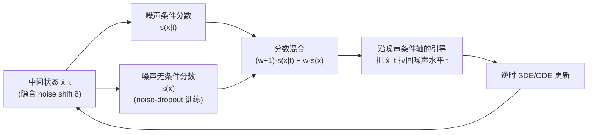

# Mitigating Noise Shift in Denoising Generative Models with Noise Awareness Guidance

**会议**: ICLR 2026  
**OpenReview**: [https://openreview.net/forum?id=UMBc0Ky20K](https://openreview.net/forum?id=UMBc0Ky20K)  
**代码**: [https://github.com/KlingAIResearch/noise-awareness-guidance](https://github.com/KlingAIResearch/noise-awareness-guidance)  
**领域**: 图像生成 / 扩散模型 / 采样修正  
**关键词**: 扩散模型, 流匹配, noise shift, classifier-free guidance, 采样轨迹修正, ImageNet 生成  

## 一句话总结
作者发现扩散/流模型在采样时中间状态实际编码的噪声水平会系统性地偏向"更大"（称为 **noise shift**），并提出 **Noise Awareness Guidance (NAG)**——一种类似 CFG、但沿"噪声条件"轴而非"类别条件"轴施加的免分类器引导，把跑偏的轨迹拉回预定噪声调度，从而显著提升生成质量。

## 研究背景与动机
- **领域现状**：扩散模型（DDPM）和流模型（flow matching / stochastic interpolant）都把生成视为求解离散化的逆时 SDE/ODE，每步用网络 $v_\theta(x_t,t)$ 预测速度场并按预定系数 $\alpha_t,\sigma_t$ 更新。社区的优化重心一直放在**减少采样步数**（蒸馏、ODE 求解器）和**扩大模型容量**（DiT、SiT 等架构）上。
- **现有痛点**：迭代采样会不可避免地累积误差——网络逼近不完美、数值离散误差、各种随机因素。这些误差的一个被长期忽视的后果是：**中间状态 $\hat x_t$ 实际"含有"的噪声量，与时间步 $t$ 名义上应有的噪声量对不上**。作者把这种错位称为 noise shift。
- **核心矛盾**：训练时网络只见过"干净的"中间状态 $x_t = \alpha_t x_0 + \sigma_t\epsilon$，但推理时它被喂的是带额外扰动的 $\hat x_t = x_t + e$。通过外部噪声估计器 $g_\phi(t\mid x)$ 在 ImageNet 上的核密度估计实测发现，推理时后验 $p_{\phi,t}(t\mid\hat x)$ **系统性地偏向更大的 $t'$**，且越接近采样末端偏移越严重。这带来两重恶果：① 模型被用在 $s_\theta(x_{t+\delta},t)$ 这种分布外输入上（OOD 泛化误差）；② 用错位的 $\alpha_t,\sigma_t$ 系数做更新，去噪步本身就不准。
- **本文目标**：在不重训整个模型、不引入外部分类器的前提下，显式地把采样轨迹"拽回"预定噪声调度，缓解 noise shift。
- **核心 idea**：**把"噪声水平 $t$"当成一个可以被引导强化的条件**。既然现代去噪网络本来就以 $t$ 为条件，那么就能像 CFG 强化类别条件一样，沿噪声条件轴构造一个免分类器引导信号，让每个中间状态都更贴合它"应该"处在的噪声水平。

## 方法详解

### 整体框架
论文先在理论与实证两层把 noise shift 量化清楚（误差 $e\sim\mathcal N(0,\sigma_e^2 I)$ 等价于把有效方差从 $\sigma_t^2$ 抬到 $\sigma_t^2+\sigma_e^2$，对应一个正向偏移 $\delta=t'-t>0$），再据此设计 NAG：把"噪声水平 $t$"视作一个引导条件，用分数混合（score mixture）强化它。NAG 有两个变体——依赖外部噪声估计器梯度的 **classifier-based NAG**，以及无需额外网络、靠"噪声条件 dropout"训练得到无条件分支的 **classifier-free NAG**（实际使用版本）。

### 关键设计

**1. Noise shift 的理论刻画：把累积误差翻译成"时间步偏移"。** 论文的出发点是给"噪声对不上"一个可计算的定义。把采样过程中所有来源的累积误差统一建模成加性高斯扰动 $\hat x_t = x_t + e,\ e\sim\mathcal N(0,\sigma_e^2 I)$，它使中间状态的有效方差从 $\sigma_t^2$ 升到 $\sigma_t^2+\sigma_e^2$，于是该状态"看起来"像是从一个更晚的噪声水平 $t'=t+\delta$ 采出来的，满足 $\sigma_{t+\delta}^2=\sigma_t^2+\sigma_e^2$。当 $\sigma_e$ 较小时，偏移有一阶近似 $\delta\approx(\sqrt{\sigma_t^2+\sigma_e^2}-\sigma_t)/\dot\sigma_t$；在线性插值 $\sigma_t=t$ 下就退化为 $\delta=\sqrt{t^2+\sigma_e^2}-t>0$。这条 Statement 1 把抽象的"误差"翻译成一个**始终为正、方向明确的时间步漂移**，解释了为什么实测后验总是偏向更大的 $t$，也为后面"往回拉"指明了方向。

**2. Noise Awareness Guidance：沿噪声条件轴的引导。** 既然 noise shift 是 $\hat x_t$ 与其名义噪声条件 $t$ 之间的错位，自然的修法就是强化对 $t$ 的条件依赖。类比条件生成，把噪声条件分数写成 $s(x\mid t)=\nabla_x\log p_t(x\mid t)=\nabla_x\log p_t(x)+\nabla_x\log p_t(t\mid x)$。如果能拿到后验 $p_t(t\mid x)$，就能用 $\nabla\log g_\phi(t\mid x)$ 当引导信号，把轨迹推向"更符合预定 $t$"的位置——这就是 **classifier-based NAG**。它在概念上与 CFG 正交：CFG 沿类别条件 $c$ 推，NAG 沿噪声条件 $t$ 推，两者控制的是采样过程的不同坐标轴（图 2）。

**3. Classifier-free NAG：用噪声条件 dropout 免去外部估计器。** Classifier-based 版本要单独训练一个噪声估计器，成本高、流程复杂、还可能出现对抗式梯度。借鉴 CFG 的思路，注意到 $p_t(t\mid x)\propto p_t(x\mid t)/p_t(x)$，于是可以用一个分数混合来隐式逼近噪声预测器的梯度：
$$s_{w_{\text{nag}}}(x\mid t)=(w_{\text{nag}}+1)\,s(x\mid t)-w_{\text{nag}}\,s(x),$$
其中 $w_{\text{nag}}$ 是引导强度。关键观察是：现代去噪模型**本来就把 $t$ 和 $x$ 一起喂进网络**，所以条件分数 $s(x\mid t)$ 已经免费有了，唯一需要额外得到的是无条件分数 $s(x)$。于是只需在训练时按固定概率**随机丢弃噪声条件 $t$**（noise-condition dropout，论文用 10%/20%），让同一套权重同时学到条件与无条件目标——完全不必新增一个噪声预测网络。

**4. 与 CFG 的关系：互补而非替代。** NAG 强化对 $t$ 的条件，会把轨迹引向"更低温度、模型更自信"的区域，使每个中间状态都对齐其应有的噪声水平。CFG 因为也偏向低温区域，确实能间接缓解一点 noise shift，但那是副作用；NAG 则**直接以减小 $\delta$ 为目标**构造更优轨迹。两者轴向正交，可叠加使用：实测 NAG 单独就能逼近 CFG 的质量，与 CFG 联用还能进一步提升。对充分预训练的大模型，甚至只需**微调无条件分支**（约原训练成本的 0.7%）即可启用 NAG。

## 实验关键数据

### 主实验表格（ImageNet 256×256，收敛模型，50k 样本）
对 off-the-shelf 的 DiT-XL/2、SiT-XL/2 仅额外微调 10 epoch 以支持 NAG 采样：

| 模型 | 无 CFG / FID | 无 CFG / Prec. | 无 CFG / Rec. | 有 CFG / FID | 有 CFG / Prec. | 有 CFG / Rec. |
|---|---|---|---|---|---|---|
| DiT-XL/2 (1400 ep) | 9.62 | 0.67 | 0.67 | 2.27 | 0.83 | 0.57 |
| **+ NAG** | **2.59** | 0.79 | 0.60 | **2.14** | 0.80 | 0.61 |
| SiT-XL/2 (1400 ep) | 8.61 | 0.68 | 0.67 | 2.06 | 0.82 | 0.59 |
| **+ NAG** | **2.26** | 0.75 | 0.66 | **1.72** | 0.77 | 0.66 |

无 CFG 时 NAG 把 FID 从 ~9 降到 ~2.3，几乎追平 CFG；与 CFG 联用后 SiT-XL/2 进一步降到 **1.72**。

### 消融实验表格（DiT-XL/2 监督微调，7 个细粒度数据集，FID，10k 样本）
直接叠加在三种 baseline 之上（不改其它设置，仅加 noise-dropout 训练）：

| 方法 | Food | SUN | Caltech | CUB | Stanford Car | DF-20M | ArtBench | 平均 |
|---|---|---|---|---|---|---|---|---|
| 微调 (w/o CFG) | 16.04 | 21.41 | 31.34 | 9.81 | 11.29 | 17.92 | 22.76 | 18.65 |
| **+ NAG** | 11.18 | 14.95 | 24.32 | 5.68 | 5.92 | 14.79 | 19.22 | **13.72** |
| 微调 (w/ CFG) | 10.93 | 14.13 | 23.84 | 5.37 | 6.32 | 15.29 | 19.94 | 13.69 |
| **+ NAG** | 5.78 | 8.81 | 21.87 | 3.52 | 3.91 | 12.55 | 15.69 | **10.31** |
| 微调 (w/ DoG) | 9.25 | 11.69 | 23.05 | 3.52 | 4.38 | 12.22 | 16.76 | 11.55 |
| **+ NAG** | 6.45 | 8.24 | 21.88 | 3.41 | 4.21 | 11.38 | 14.80 | **10.05** |

NAG 在 vanilla、CFG、专为微调设计的 DoG 三种 baseline 上都能再降 FID，平均分别从 18.65→13.72、13.69→10.31、11.55→10.05。

### 关键发现
- **noise shift 普遍且系统性**：用外部估计器 $g_\phi$ 实测，推理后验 $p_{\phi,t}(t\mid\hat x)$ 一致偏向更大的 $t$，且越接近采样末端偏移 $\delta$ 越严重（图 4）。
- **从零训练时 DiT 比 SiT 更吃 NAG 红利**：作者推测 DDPM 式调度更利于训练出准确的无条件分支，从而给 NAG 提供更好的引导方向。
- **极低成本即可启用**：对 1400-epoch 预训练模型，仅微调无条件分支 ~10 个额外 epoch（约 0.7% 训练量）就能用上 NAG，单独使用就接近 CFG 质量。
- **与 CFG 正交互补**：两者轴向不同，可叠加，叠加后持续带来额外增益。

## 亮点与洞察
- **问题命名本身就是贡献**：把"采样误差"重新表述为"中间状态噪声水平的系统性漂移"，给了社区一个可观测、可量化、可修正的新视角，并用核密度估计直接可视化出来。
- **几乎零额外架构成本**：复用现成模型已有的"$t$ 作为条件"这一事实，仅靠 noise-condition dropout 就得到无条件分支，把一个看似需要外部估计器的问题转化成 CFG 式的免分类器引导。
- **正交性强、易插拔**：NAG 不挑 baseline（vanilla / CFG / DoG 都能叠），不挑模型族（diffusion 的 DiT 与 flow 的 SiT 都验证），落地门槛低。

## 局限与展望
- **依赖噪声估计器做诊断**：noise shift 的实证测量受 $g_\phi$ 精度限制，作者也明确指出观测到的 $\delta$ 只是次优行为的"充分非必要"条件——$\delta$ 降为零并不保证图更好（若中间样本本身已严重 OOD，仍会失败）。
- **理论基于简化假设**：把累积误差统一近似成加性高斯、且 $\sigma_e$ 小的一阶展开，只是定性刻画，真实误差结构更复杂。
- **评测局限在类条件 ImageNet 与细粒度微调**：尚未在大规模文生图、视频生成等更复杂条件场景验证；引导强度 $w_{\text{nag}}$ 的自动选择、与采样步数/求解器的交互也留待探索。

## 相关工作与启发
- **Classifier guidance / CFG（Dhariwal & Nichol 2021；Ho & Salimans 2021）**：NAG 的直接思想来源——把"沿类别条件引导"换成"沿噪声条件引导"，并复用 CFG 的分数混合与 condition-dropout 训练范式。
- **stochastic interpolant / flow matching（Albergo 2023；Lipman 2023；Ma et al. SiT 2024）**：提供了统一刻画扩散与流模型的连续时间框架，论文的前向过程、PF-ODE、逆时 SDE 推导都建立其上。
- **Domain Guidance（Zhong et al. 2025）**：专为微调设计的引导方法，本文把 NAG 直接叠在 DoG 上仍有提升，说明 NAG 抓的是一个与领域适配正交的误差源。
- **启发**：当一个迭代系统存在"训练-推理分布错位"时，与其追求消除所有误差，不如**显式辨识错位的方向并构造一个反向引导项**——把误差当成可被条件强化纠正的信号，是一种比"更大模型/更多步数"更便宜的思路。

## 评分
- **新颖性**: ⭐⭐⭐⭐⭐ 重新命名并量化了一个被长期忽视的普遍问题（noise shift），并给出优雅的免分类器修正，视角新颖。
- **实验充分度**: ⭐⭐⭐⭐ 覆盖 DiT/SiT 两族、从零训练与微调两场景、7 个下游数据集，但局限在 ImageNet 类条件生成，缺大规模 T2I/视频验证。
- **写作质量**: ⭐⭐⭐⭐ 问题动机讲得清楚，理论（Statement 1）与实证（图 1/4）配合有力，方法与 CFG 的类比直观。
- **价值**: ⭐⭐⭐⭐⭐ 修正成本极低、可插拔、与 CFG 正交，FID 大幅提升，对主流扩散/流模型有直接落地价值。

<!-- RELATED:START -->

## 相关论文

- [\[ICLR 2026\] A Noise is Worth Diffusion Guidance](a_noise_is_worth_diffusion_guidance.md)
- [\[ICLR 2026\] ReDDiT: Rehashing Noise for Discrete Visual Generation](reddit_rehashing_noise_for_discrete_visual_generation.md)
- [\[ICLR 2026\] Diverse Text-to-Image Generation via Contrastive Noise Optimization](diverse_text-to-image_generation_via_contrastive_noise_optimization.md)
- [\[ICLR 2026\] There and Back Again: On the Relation between Noise and Image Inversions in Diffusion Models](there_and_back_again_on_the_relation_between_noise_and_image_inversions_in_diffu.md)
- [\[ICLR 2026\] DeRaDiff: Denoising Time Realignment of Diffusion Models](deradiff_denoising_time_realignment_of_diffusion_models.md)

<!-- RELATED:END -->
