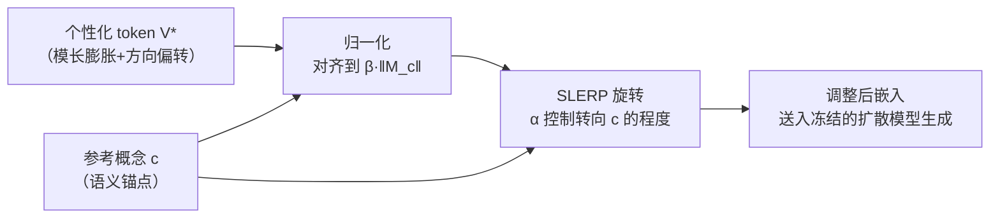

# Mitigating Semantic Collapse in Generative Personalization with Test-Time Embedding Adjustment

**会议**: ICLR 2026  
**OpenReview**: [https://openreview.net/forum?id=P7sPfvq7Ih](https://openreview.net/forum?id=P7sPfvq7Ih)  
**代码**: [https://github.com/tuananhbui89/Embedding-Adjustment](https://github.com/tuananhbui89/Embedding-Adjustment)  
**领域**: 图像生成 / 生成式个性化 (Generative Personalization)  
**关键词**: 文生图扩散模型, 个性化定制, 语义崩塌, 测试时调整, 文本嵌入, Textual Inversion, DreamBooth  

## 一句话总结
本文提出并刻画了生成式个性化中的"语义崩塌问题"(SCP)——学到的个性化 token V* 会在嵌入空间里既膨胀模长又偏转方向，最终在复杂提示词中压倒所有上下文；作者用一个免训练的测试时嵌入调整 (TEA) 把 V* 的模长和方向往原始语义概念 c 拉回，显著改善文图对齐。

## 研究背景与动机
**领域现状**：文生图扩散模型催生了"生成式个性化"——用户给几张参考图（某个人/宠物/物体），模型学一个特殊 token V*（如 'sks'、'<new>'），之后可以用任意提示词把这个概念放进新场景。Textual Inversion、DreamBooth 及其变体是主流路线。

**现有痛点**：个性化模型在复杂或多概念提示词下经常"失准"——`V* in grand canyon` 生成的图把猫画得活灵活现，背景的大峡谷却几乎不见。学界通常把这归因于 **language drift**（模型过拟合参考图、忘了怎么生成预训练概念）、文本嵌入表达力有限、或参考集纠缠等，但**底层机制一直没被认真研究**。

**核心矛盾**：作者通过实证分析发现了一个被忽视的现象——个性化 token 在训练中**逐渐丢失原本的文本语义、却不断吸收参考图的视觉信息**。当它和富含描述的上下文拼在一起时，生成图被这个概念过度主导，其它意图元素被忽略。本质上，提示词 `⌊p, V*⌋` 的语义复杂度坍缩成了简单的 `⌊V*⌋`。作者把这个现象命名为**语义崩塌问题 (Semantic Collapsing Problem, SCP)**，并区别于 language drift：SCP 不是模型忘了别的概念，而是嵌入本身崩塌、只编码视觉信息而不再保留文本语义。

**本文目标**：找出 SCP 的根因并给出一个能广泛套用、不需要重训的解法。

**核心 idea**：作者把根因定位为 **无约束优化**——个性化嵌入 V* 可以在模长和方向上任意漂移（`|M_{V*}| ≫ |M_c|` 且 `cos(M_{V*}, M_c) ≪ 1`）。**既然漂移有方向和大小，那就在推理时把它转回去、缩回去**：用一个免训练的测试时嵌入调整 (TEA)，把 V* 的模长和方向校准到接近其参考概念 c，让这个 token 表现得更像普通词、与其它 token 平衡地参与生成。

## 方法详解

### 整体框架
TEA 不碰任何模型权重、也不需要额外训练，只在推理阶段、图像生成之前对文本嵌入做一次"归一化 + 旋转"的轻量改写。给定个性化好的预训练模型（U-Net 和文本编码器都原封不动）和一个目标语义锚点 c，TEA 用缩放因子 β 控制模长、用旋转因子 α 通过球面线性插值 (SLERP) 把 V* 的方向往 c 拉近。针对 Textual Inversion（直接更新 token 嵌入）和 DreamBooth（微调整个文本编码器、不动单个 token）两类方法，分别在 token 级和 prompt 级实施同一套调整。

### 关键设计

**1. 语义崩塌的实证刻画：把"崩塌"做成可测量的距离曲线。** 在提出解法之前，作者先用三组实验把 SCP 钉成可观测的事实。先让 LLM 生成 200 个含关键词 c 的多样句子构造上下文集合 A，再造出 `P_{V*} = {⌊a_i, V*⌋}` 和 `P_c = {⌊a_i, c⌋}` 两组提示词，用 Euclidean / Hausdorff / Mahalanobis / KL 四种距离度量它们的差异。结果显示：**跨集距离 `d(P_{V*}, P_c)` 随训练单调增大**（V* 越来越偏离初始语义 c），而**集内距离 `d(P_{V*}, P_{V*})` 反而减小**（不同上下文 a_i 拼上 V* 后越来越像同一个东西），说明 V* 正在压倒上下文、成为提示词的主导语义成分；再引入简单提示集 `P_{V*}^{simple}`（如 'a photo of a V*'），发现 `d(P_{V*}, P_{V*}^{simple})` 也随时间减小——复杂提示词的表示越来越接近简单提示词，`τ(⌊p, V*⌋) → τ(V*)` 这条崩塌轨迹被直接画了出来。

**2. 两面性影响：SCP 不全是坏事，因而不能粗暴消除。** 在图像空间用 CLIP-I `S(x̂, x_gt)`、CLIP-T 对上下文 `S_T^p = S(x̂, p)`、对概念 `S_T^c = S(x̂, c)`、对全提示 `S_T^f` 多个分量观测，得到一个微妙结论：图-图对齐 `S_I` 随训练上升（V* 确实学会了视觉身份），上下文对齐 `S_T^p` 随训练下降（这是 SCP 的负面——上下文被丢），但对**某些需要强视觉存在感的概念**，`S_T^c` 反而上升（正面——V* 压住了过强的上下文、强化了主体）。这种"有负有正、依提示而定"的两面性，意味着不能简单地把 V* 抹平，而需要一个**可调强度**的解法——这正是 TEA 引入 α、β 两个旋钮的动机。

**3. 根因定位 = 模长膨胀 + 方向偏转。** 作者把 SCP 归结到无约束优化：没有任何正则，V* 的嵌入模长会显著增大（直方图上落到所有词表 token 的长尾，逼近 `<|startoftext|>` 这类特殊 token），同时与 c 的余弦相似度急剧下降。值得注意的是，即便 DreamBooth 实现里带了梯度裁剪，它也只约束单步更新、挡不住跨迭代的累积漂移；而 DreamBooth 微调整个文本编码器、不显式改 M_{V*}，崩塌仍以 prompt 级的形式 `τ(⌊p, V*⌋) ≈ τ(V*) ≠ τ(⌊p, c⌋)` 出现。把根因拆成"模长"和"方向"两个可分量，直接决定了 TEA 的两步结构。

**4. 测试时嵌入调整 (TEA)：先归一化模长，再 SLERP 旋转方向。** 这是方法核心。第一步归一化把 V* 和 c 都缩放到由参考概念模长决定的统一尺度：$\tilde{M}_{V^*} = \beta \|M_c\| \frac{M_{V^*}}{\|M_{V^*}\|}$，$\tilde{M}_c = \beta \|M_c\| \frac{M_c}{\|M_c\|}$，β 控制相对于 c 的目标模长。第二步用球面线性插值在高维空间稳定地把方向往 c 转：

$$\hat{M}_{V^*} = \frac{\sin((1-\alpha)\theta)}{\sin\theta}\,\tilde{M}_{V^*} + \frac{\sin(\alpha\theta)}{\sin\theta}\,\tilde{M}_c$$

其中 θ 是归一化后 $\tilde{M}_{V^*}$ 与 $\tilde{M}_c$ 的夹角，α∈[0,1] 越大越靠近 c。α、β 两个旋钮恰好对应"方向"和"模长"两条漂移轴，让用户在保留视觉身份与恢复上下文之间权衡。

**5. Prompt 级变体：覆盖不更新 token 的 DreamBooth 路线。** DreamBooth 类方法不动嵌入矩阵 M，TEA 转而在 prompt 级施加同一套调整：对提示词 `⌊p, V*⌋` 和目标 `⌊p, c⌋` 各取文本编码器输出 `τ(⌊p, V*⌋)`、`τ(⌊p, c⌋)`，对**每个 token i** 用相同的 SLERP 公式 $\hat{\tau}(⌊p, V^*⌋)[i] = \frac{\sin((1-\alpha)\theta_i)}{\sin\theta_i}\tilde{\tau}(⌊p, V^*⌋)[i] + \frac{\sin(\alpha\theta_i)}{\sin\theta_i}\tilde{\tau}(⌊p, c⌋)[i]$ 逐 token 调整。正因为只依赖文本编码器输出、不依赖具体的个性化实现，TEA 才能像插件一样套到 Textual Inversion、DreamBooth、Custom Diffusion、EasyControl、ReVersion、ClassDiffusion 等几乎所有框架上。

## 实验关键数据

实验覆盖 6 个有代表性的近期个性化方法、2 种架构（Stable Diffusion 与 Flux）、3 个数据集（CС101、CelebA-HQ、Relationship），共 22 个概念。评测用 CLIP-T（对上下文 `CLIP_T^p`、对全提示 `CLIP_T^f`）、CLIP-I、DINO-I 图像对齐，以及以 GPT-4o-mini 为裁判的 VLM-P / VLM-I（0–4 分归一化到百分比）。

### 主实验：TEA 作为插件叠加到多种方法上

| 方法 | CLIP_T^p ↑ | CLIP_T^f ↑ | CLIP-I ↑ | DINO-I ↑ | VLM-P ↑ | VLM-I ↑ |
|------|-----------|-----------|---------|---------|--------|--------|
| EasyControl (Pet Dog) | 18.54 | 26.02 | 61.33 | 43.71 | 64.25 | 74.00 |
| **+TEA** | 18.72 | 26.11 | **64.56** (+3.23) | **48.32** (+4.61) | **66.50** (+2.25) | **77.25** (+3.25) |
| OminiControl (Clock) | 18.11 | 23.90 | 81.37 | 32.41 | 67.50 | 62.25 |
| **+TEA** | **18.78** (+0.67) | 23.98 | **83.10** (+1.73) | **34.48** (+2.07) | **71.75** (+4.25) | **64.50** (+2.25) |
| OminiControl (Penguin) | 20.30 | 31.61 | 78.58 | 45.59 | 86.25 | 83.25 |
| **+TEA** | 20.33 | **32.02** (+0.41) | **80.64** (+2.06) | **49.37** (+3.78) | **90.50** (+4.25) | **86.75** (+3.50) |

TEA 在几乎所有指标、所有底座方法上都带来稳定正向增益，尤其 VLM-P（提示对齐）和 DINO-I/CLIP-I（身份保真）同步提升，说明它在恢复上下文的同时没有牺牲个性化身份。

### 关键发现
- **跨方法、跨架构普适**：从 Textual Inversion / DreamBooth 到 EasyControl / OminiControl / ReVersion，从 Stable Diffusion 到 Flux，TEA 都能即插即用地改善文图对齐。
- **意外的安全启示**：把 TEA 用到被 Anti-DreamBooth"投毒"保护的模型上，能**部分逆转对抗扰动、恢复对受保护概念的忠实生成**——揭示了当前反个性化防御存在"虚假安全感"。
- **两个旋钮可解释**：α 控方向、β 控模长，正好对应 SCP 的两条漂移轴（文中给出 α=0.2、β=1.5 的示例点），使调整既可控又有物理含义。

## 亮点与洞察
- **把一个模糊的"对齐失败"凝练成可测量、可定位的问题**：SCP 的命名、与 language drift 的区分、以及"模长膨胀 + 方向偏转"的根因刻画，是这篇工作最大的贡献——先把病说清楚，解法反而很简单。
- **训练-免费、推理时介入**：不动权重、不重训，只在文本嵌入层做一次 SLERP，几乎零成本就能挂到现成 pipeline 上，落地友好。
- **两面性观察很诚实**：作者没有把 SCP 一律当作坏事，而是承认它对某些概念有正面增强，从而设计出"可调强度"的解法而非一刀切。
- **反向揭示防御漏洞**：用同一把钥匙打开了 Anti-DreamBooth 的"假安全"，给反个性化/版权保护研究敲了警钟。

## 局限与展望
- **依赖一个好的语义锚点 c**：TEA 的方向/模长都向 c 对齐，c 选得不好（语义不匹配、过于宽泛）可能限制效果，论文未深入讨论 c 的自动选取。
- **α、β 需要按概念/提示调**：两个旋钮虽可解释，但最优值随概念和提示词变化，缺乏自适应选择机制。
- **正面影响被一并削弱的风险**：把 V* 拉回 c 在恢复上下文的同时，对那些"需要强视觉存在感才能识别"的概念，可能损失 SCP 带来的正面增强，如何自动判别尚未解决。
- **安全面的双刃剑**：能逆转 Anti-DreamBooth 既是洞察也是隐患——它可能被滥用于绕过隐私/版权保护，需要配套的伦理与防御讨论。

## 相关工作与启发
- **个性化主线**：Textual Inversion、DreamBooth、Custom Diffusion 等定义了"学一个 token / 微调权重"的范式，本文是对它们共性缺陷的诊断与通用修补。
- **对齐改进策略**：此前用 latent optimization、正则化、概念解耦来缓解失准，本文指出这些大多治标，真正根因在嵌入的无约束动力学。
- **SLERP 的妙用**：把图形学里的球面插值搬到文本嵌入空间做方向校准，是一个值得借鉴的"几何视角处理语义漂移"的范式。
- **反个性化安全**：与 Anti-DreamBooth 的交叉发现提示，个性化与反个性化是一对相互拆台的攻防，未来需在同一框架下评估鲁棒性。

## 评分
- **新颖性**: ⭐⭐⭐⭐⭐ —— 命名并系统刻画了 SCP 这一被忽视的问题，把"对齐失败"还原成可测量的模长/方向漂移，根因分析有原创性。
- **实验充分度**: ⭐⭐⭐⭐ —— 覆盖 6 方法 / 2 架构 / 3 数据集 / 22 概念，CLIP/DINO/VLM 多维评测，并附带反个性化的额外验证；α/β 自适应与 c 选取的实验略缺。
- **写作质量**: ⭐⭐⭐⭐ —— 问题定义清晰、实证递进有逻辑（先证存在、再看影响、再找根因、最后给解法），图表丰富。
- **价值**: ⭐⭐⭐⭐ —— 免训练、可插拔、跨框架通用，落地成本极低；同时对反个性化安全提出有价值的警示，学术与工程双重意义。

<!-- RELATED:START -->

## 相关论文

- [\[CVPR 2026\] Visual Personalization Turing Test](../../CVPR2026/image_generation/visual_personalization_turing_test.md)
- [\[ICLR 2026\] Test-Time Iterative Error Correction for Efficient Diffusion Models](test-time_iterative_error_correction_for_efficient_diffusion_models.md)
- [\[CVPR 2026\] Test-Time Alignment of Text-to-Image Diffusion Models via Null-Text Embedding Optimisation](../../CVPR2026/image_generation/test-time_alignment_of_text-to-image_diffusion_models_via_null-text_embedding_op.md)
- [\[ICLR 2026\] MILR: Improving Multimodal Image Generation via Test-Time Latent Reasoning](milr_improving_multimodal_image_generation_via_test-time_latent_reasoning.md)
- [\[ICLR 2026\] VFScale: Intrinsic Reasoning through Verifier-Free Test-time Scalable Diffusion Model](vfscale_intrinsic_reasoning_through_verifier-free_test-time_scalable_diffusion_m.md)

<!-- RELATED:END -->
