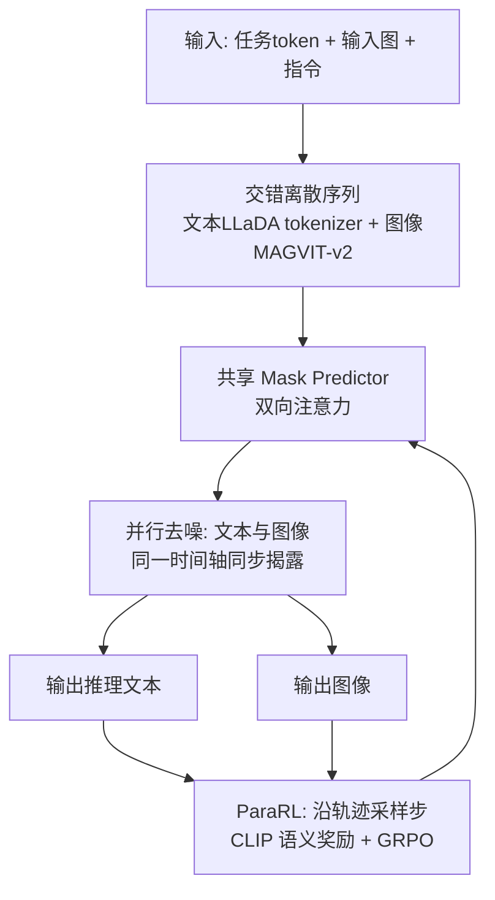

# MMaDA-Parallel: Multimodal Large Diffusion Language Models for Thinking-Aware Editing and Generation

**会议**: ICLR 2026  
**OpenReview**: [https://openreview.net/forum?id=mkQAd11ovn](https://openreview.net/forum?id=mkQAd11ovn)  
**代码**: [MMaDA-Parallel (HuggingFace + GitHub)](https://huggingface.co/MMaDA-Parallel-Model)  
**领域**: 图像生成 / 多模态扩散语言模型  
**关键词**: thinking-aware generation, 离散扩散, 并行去噪, 跨模态对齐, 强化学习, ParaRL  

## 一句话总结
针对"先推理后画图"的串行 thinking-aware 范式会因推理错误传播反而拉低图像质量的问题，本文提出纯离散扩散的并行多模态框架 MMaDA-Parallel——让文本与图像在整条去噪轨迹上双向交互、同步生成，再用沿轨迹打语义奖励的 Parallel RL（ParaRL）强化跨模态一致性，在自建 ParaBench 上把 Output Alignment 比 SOTA 开源模型 Bagel 提升 6.9%。

## 研究背景与动机
- **领域现状**：为提升复杂指令下的图像编辑/生成质量，近期工作（GoT、Bagel、OmniGen2 等）引入"thinking-aware"范式，即在画图前先用文本做一段 Chain-of-Thought 推理，再用推理结果指导后续图像合成，被证明能提高语义保真度。
- **现有痛点**：作者发现一个反直觉现象——**推理有时反而降低性能**。在 Kris-Bench 上约 23% 的复杂组合编辑里，加 thinking 后图像质量不升反降（如表 1 中 Causal 类 −2.9、Spatial 类 −4.8）。根因是低质量/含糊的推理文本会主动误导图像生成。
- **核心矛盾**：现有 benchmark 只拿"最终图像 vs 初始指令"打分，**无法评估中间推理文本本身的质量及其与图像的一致性**，使"推理是否拖后腿"这一假设无法验证；同时串行自回归管线天然存在误差累积与语义漂移——推理一旦出错，后续画图无从纠正。
- **本文目标**：既要造出能诊断"推理↔图像对齐"的评测，又要造出不靠串行依赖、能在生成过程中持续互纠的生成框架。
- **核心 idea**：**① 诊断**——提出 ParaBench，首次同时评测文本与图像两路输出及其对齐；**② 并行生成**——用纯离散扩散让文本和图像在每个去噪步双向 attend、同步去噪，从源头消除自回归误差传播；**③ 轨迹级强化**——观察到语义概念在文图中"同步浮现"，于是把奖励铺到整条去噪轨迹上（ParaRL）而非只奖励最终输出。

## 方法详解

### 整体框架
MMaDA-Parallel 把文本和图像统一表示为离散 token，交错排成单一序列并施加**全局双向注意力**，由一个共享的 mask predictor 对两种模态同步去噪；训练分两阶段：先在自建的"四元组"数据（输入图、指令、推理trace、输出图）上做 SFT 把 MMaDA 改造成并行版本，再用 ParaRL 沿去噪轨迹打语义对齐奖励做 GRPO 后训练。

### 关键设计

**1. ParaBench：把"推理"也纳入评测的诊断基准。** 现有 benchmark 的盲区是只看图不看推理，于是作者构造了 300 条高难度 prompt（200 编辑 + 100 生成），用 GPT-4.1 作 judge 沿六个细粒度维度打分——文本侧的 Text Quality / Text Alignment，图像侧的 Image Quality / Image Alignment / Image Consistency，以及最关键的、衡量推理与最终图像是否自洽的 **Output Alignment**。正是靠这把"双模态尺子"，作者才量化出"性能掉的类别恰好是 Output Alignment 最弱的类别"这一强相关，把"坏推理主动误导画图"从猜测坐实成证据。

**2. 交错离散序列 + 单一共享 mask predictor 的并行扩散。** 文本用 LLaDA tokenizer、图像用预训练 MAGVIT-v2 量化成离散视觉 token，再用显式哨兵与任务标签拼成一条序列 `<|task|><|soi|>[img]<|eoi|><|bos|>[text]<|eos|>`（`<|thinkgen|>`/`<|thinkedit|>` 区分生成与编辑）。这种单序列布局让输出能 attend 到输入、并消除自回归跨模态管线的次序不对称与 exposure bias。训练时只对输出段加噪：每个输出 token 以概率 $\beta_t$ 替换为 [MASK]、以 $1-\beta_t$ 保留，吸收态边缘分布为 $q(x_t\mid x_0)=\alpha_t x_0+(1-\alpha_t)m$（$\alpha_t=\prod_{k=1}^t(1-\beta_k)$）。优化按时间步重加权的交叉熵
$$\mathcal{L}_{parallel}(\theta)=-\mathbb{E}_{t,x_0,x_t}\Big[\sum_{i=1}^{L} w(t,i)\,\mathbf{1}[x_t^{(i)}=\text{[MASK]}]\,\log p_\theta(x_0^{(i)}\mid x_t)\Big].$$
关键的工程发现是**模态特异的权重**：文本用 $w_{text}(t)=1/t$、图像用常数 $w_{img}(t)=1$，能显著稳住图像质量与对齐的训练。采样时两路模态各用一个调度器 $u_{img}(t),u_{text}(t)$ 指定该步揭露比例——文本走线性揭露 + 半自回归置信解码、图像走 cosine 揭露 + 全局置信解码，但因注意力全程双向，文图每一步都能互相提供证据。

**3. ParaRL：把奖励铺到整条去噪轨迹上的并行强化学习。** 作者观察到语义概念在文图中**同步浮现**（图 4：让衬衫变彩虹色时，具体颜色词和对应视觉特征在同一时间步出现），说明跨模态对齐是沿轨迹逐步建立、而非只在终点出现——于是只奖励最终输出（标准 SFT/RL）太粗。ParaRL 把"某去噪步上文本片段与图像内容的语义对齐"当作密集奖励。为可行，采用**稀疏优化**：每次 rollout 预选 $|S|=s$ 个步只在这些步算奖励与标准化优势，套用 diffusion-GRPO 目标
$$J_{policy}(\theta)=\mathbb{E}\Big[\sum_{i=1}^{G}\sum_{t\in S}\frac{1}{|\tau_i(t)|}\sum_{o\in\tau_i(t)}C_\epsilon\big(\tfrac{\pi_\theta(o\mid\cdot)}{\pi_{old}(o\mid\cdot)},A_{i,t}\big)\Big]-\beta\,\mathrm{KL}(\pi_\theta\Vert\pi_{old}).$$
妙处在于**无需训练 PRM/价值函数**：并行设定下中间片段已语义充分，直接用 CLIP 文图相似度当奖励源。为稳住 RL，把原始 CLIP 分用训练分布的 $\mu,\sigma$ 标准化、裁剪到 $[-1,1]$ 再线性映射为 $R_{i,t}=\tfrac12(1+\text{clip}(\hat c_{i,t},-1,1))\in[0,1]$，优势按 rollout 内标准化得到。

## 实验关键数据

### 主实验（ParaBench，GPT-4.1 as judge）

| 模型 | Text Qual. | Text Align. | Image Cons. | Image Align. | Image Qual. | Output Align. | Overall |
|---|---|---|---|---|---|---|---|
| GPT-4o（闭源） | 92.5 | 93.4 | 86.2 | 85.7 | 88.1 | 69.5 | 85.9 |
| Gemini-2.5（闭源） | 94.1 | 95.2 | 88.5 | 76.2 | 90.2 | 63.4 | 84.6 |
| Bagel (w/ think) | 82 | 70.5 | 76.7 | 63.4 | 81.5 | 52.9 | 71.2 |
| Show-o*（tuned） | 75.2 | 70.7 | 69.1 | 57.5 | 78.5 | 48.9 | 66.6 |
| **MMaDA-Parallel w/o ParaRL** | 76.5 | 70.4 | 70.5 | 58.2 | 80.5 | 51.5 | 67.9 |
| **MMaDA-Parallel w/ ParaRL** | 80.4 | 71 | 73.4 | 63.2 | 81.2 | **59.8** | 71.5 |

> Output Alignment 59.8 在所有开源模型中最高，比 Bagel 的 52.9 高 **6.9 个点**；而 Bagel 的训练数据量比本文大近三个数量级，凸显并行框架的数据效率。

### 消融实验
**串行 vs 并行去噪（表 3）**

| Denoising | Text Align. | Image Align. | Output Align. |
|---|---|---|---|
| Sequential | 70.6 | 56.1 | 48.9 |
| **Parallel** | 70.4 | 58.2 | **51.5** |

**输出级 vs 轨迹级 RL（表 4）**

| 模型 | Text Align. | Image Align. | Output Align. |
|---|---|---|---|
| before RL | 70.4 | 58.2 | 51.5 |
| w/ Output-level RL | 70.7 | 62.3 | 53.6 |
| **w/ ParaRL (Ours)** | 71 | 63.2 | **59.8** |

**ParaRL 采样步数 s（表 5）**：$s{=}2$ → Output Align. 53.6；$s{=}3$（默认）→ **59.8**；$s{=}4$ → 58.7。更密的奖励信号更稳，$s{=}3$ 取性能/效率最佳折中。

### 关键发现
- **推理会拖后腿是真的**：表 1 显示 Causal/Spatial 类加 thinking 后分别 −2.9/−4.8，且与 Text Quality、Output Align. 同步走低，证实坏推理"主动误导"而非"无益"。
- **并行 > 串行**：Output Align. 从 48.9 → 51.5，验证同步互纠能减少误差传播。
- **轨迹级 > 输出级**：ParaRL 把 Output Align. 从 53.6 进一步推到 59.8，且训练曲线更稳。
- **数据效率高**：用 150K 样本就追平甚至超过用海量数据训练的 Bagel 的对齐指标。

## 亮点与洞察
- **诊断—框架—强化"三连闭环"**：先用 ParaBench 把"推理拖后腿"诊断清楚，再用并行扩散从结构上消除病因，最后用 ParaRL 在轨迹上对症下药，叙事完整、动机扎实。
- **"语义同步浮现"是个漂亮观察**：文图概念在同一去噪步出现，这一现象既是 ParaRL 的动机，又顺手解决了"中间步缺语义、需 PRM"的老大难——直接用 CLIP 当轨迹奖励，省掉训练价值模型的昂贵环节。
- **纯离散扩散统一文图**：把"先推理后画图"的硬依赖换成"边推理边画图"的双向交互，是对 thinking-aware 范式的一次结构性重构，而非加 trick。

## 局限与展望
- **评测依赖 LLM-as-judge**：六维指标全靠 GPT-4.1 打分，可能引入评判模型自身偏好；Output Alignment 这一核心指标的可复现性与跨判官稳定性值得进一步验证。
- **与闭源仍有差距**：Output Align. 59.8 仍低于 GPT-4o 的 69.5，整体 Overall 71.5 也落后闭源模型约 13+ 点。
- **奖励源是朴素 CLIP**：CLIP 对细粒度组合语义（计数、空间关系）刻画有限，可能限制对最难类别的提升上限。
- **稀疏步近似**：ParaRL 只在预选 $s$ 步打奖励，是对"全轨迹密集奖励计算不可行"的折中，密集 vs 稀疏的理论最优点尚未刻画。

## 相关工作与启发
- **thinking-aware 生成谱系**：从 Chameleon/Mogao 的交错生成，到 Image-CoT/GoT 的先推理后画图，到 Bagel 把 CoT 同时塞进生成与编辑，再到 OmniGen2/IRG 的"生成后反思"——它们几乎都是串行自回归管线，本文指出这正是误差累积的根。
- **离散扩散语言模型**：受 LLaDA、MMaDA 等"去掉逐 token 约束、用置信采样追求全局一致"的启发，本文把单模态离散扩散推广到文图并行同步去噪。
- **轨迹/过程级优化**：借鉴 process-level / trajectory-level 优化与 diffusion-GRPO，但创新地用"中间片段已语义充分"绕开 PRM，给扩散模型的过程级 RL 提供了一个轻量范本。
- **启发**：对任何"先 A 后 B"的串行多步生成（如先布局后渲染、先大纲后写作），若 A 的错误会污染 B，不妨考虑"A、B 同步生成 + 沿过程打对齐奖励"的并行思路。

## 评分
- **新颖性**: ⭐⭐⭐⭐ — 把 thinking-aware 从串行重构为并行离散扩散，并提出"用文图同步浮现绕开 PRM 的轨迹级 RL（ParaRL）"，思路新且自洽。
- **实验充分度**: ⭐⭐⭐⭐ — 自建 ParaBench 六维评测 + 串行/并行、输出级/轨迹级、采样步数三组消融，证据链完整；略弱在仅单一 judge、最难类别提升有限。
- **写作质量**: ⭐⭐⭐⭐ — "诊断→框架→强化"叙事清晰，图 1/4 把现象讲得直观，公式与 motivation 衔接顺畅。
- **价值**: ⭐⭐⭐⭐ — 用 150K 数据追平海量数据训练的 Bagel 对齐指标，并为 thinking-aware 生成提供可复用的并行范式与轨迹级 RL 配方，落地与启发价值高。

<!-- RELATED:START -->

## 相关论文

- [\[ACL 2026\] Multimodal Large Language Models for Multi-Subject In-Context Image Generation](../../ACL2026/image_generation/multimodal_large_language_models_for_multi-subject_in-context_image_generation.md)
- [\[ICLR 2026\] Consolidating Reinforcement Learning for Multimodal Discrete Diffusion Models](consolidating_reinforcement_learning_for_multimodal_discrete_diffusion_models.md)
- [\[ICLR 2026\] Locality-aware Parallel Decoding for Efficient Autoregressive Image Generation](locality-aware_parallel_decoding_for_efficient_autoregressive_image_generation.md)
- [\[ICLR 2026\] Autoregressive Image Generation with Randomized Parallel Decoding](autoregressive_image_generation_with_randomized_parallel_decoding.md)
- [\[ICLR 2026\] TwinFlow: Realizing One-step Generation on Large Models with Self-adversarial Flows](twinflow_realizing_one-step_generation_on_large_models_with_self-adversarial_flo.md)

<!-- RELATED:END -->
