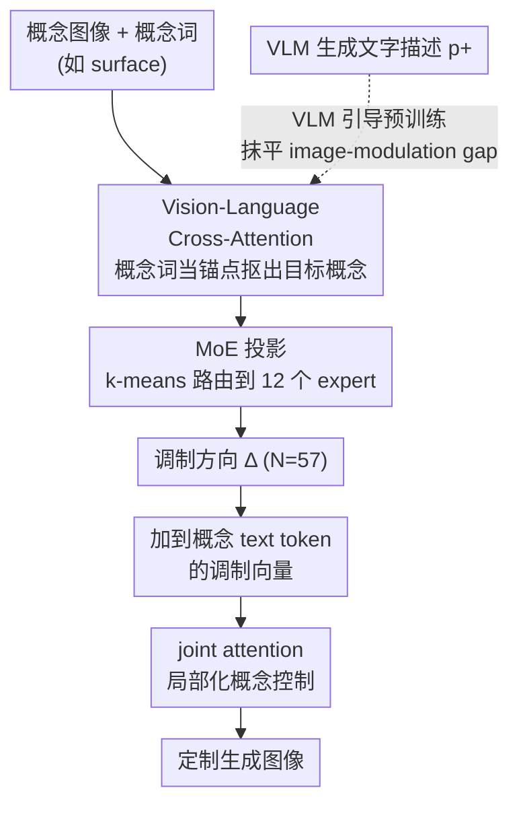

# Mod-Adapter: Tuning-Free and Versatile Multi-concept Personalization via Modulation Adapter

**会议**: ICLR 2026  
**arXiv**: [2505.18612](https://arxiv.org/abs/2505.18612)  
**代码**: [项目页](https://weizhi-zhong.github.io/Mod-Adapter)  
**领域**: 扩散模型 / 个性化生成  
**关键词**: 多概念个性化, Tuning-Free, DiT 调制空间, Mixture-of-Experts, VLM 预训练  

## 一句话总结

提出 Mod-Adapter，一种无需测试时微调的多概念个性化方法，通过在 DiT 的调制（modulation）空间中预测概念特定的调制方向，实现对物体和抽象概念（姿态、光照、材质等）的解耦化定制生成，在多概念个性化上大幅超越现有方法。

## 研究背景与动机

**领域现状**：个性化文本到图像生成旨在根据用户提供的参考图像合成目标概念。现有方法大多聚焦于物体概念（人物、动物、日用品），多概念个性化方法也主要处理多个物体的组合。

**现有痛点**：(a) 现有 tuning-free 方法（如 IP-Adapter、MS-Diffusion）无法解耦物体和抽象概念——当输入一张包含特定姿态的人物图像时，它们会直接复制整个人物而非仅提取姿态；(b) TokenVerse 虽然支持抽象概念但需要对每张新图片做测试时微调，耗时且容易过拟合。

**核心矛盾**：抽象概念（姿态、光照、材质）不是独立的视觉实体，它们与物体强耦合，难以从图像中单独提取。同时，将提取的视觉特征映射到 DiT 的调制空间存在巨大 gap。

**本文目标** (i) 无需测试时微调地泛化到新概念；(ii) 同时支持物体和抽象概念的定制；(iii) 实现多概念之间的解耦控制。

**切入角度**：利用 DiT 中 AdaLN 调制空间的局部性和语义可加性——不同 token 使用不同调制向量可以实现局部化的概念控制。

**核心 idea**：训练一个 Mod-Adapter 模块预测概念特定的调制方向，通过 VLM 引导预训练解决 image-modulation 空间的巨大 gap。

## 方法详解

### 整体框架

这篇论文要解决的是「无需测试时微调地同时定制物体和抽象概念」。关键观察是：DiT（论文用 FLUX）里的 AdaLN 调制空间具有局部性和语义可加性——给不同 token 配不同的调制向量，就能让控制效果局部地落到概念相关的图像区域。Mod-Adapter 顺着这条路，把「定制某个概念」转化为「预测一组概念特定的调制方向」。

具体来说，输入一张概念图像和对应的概念词（如 "surface"），Mod-Adapter 输出调制方向 $\{\Delta_i \mid i=1,\dots,N\}$，其中 $N=57$ 对应 FLUX 的 57 个 DiT block。这些方向被加到该概念文本 token 的调制向量上，经过 joint attention 层后，只对这个概念相关的图像区域产生影响。多概念推理时各概念的调制方向分别作用在各自的文本 token 上，互不干扰，从而实现解耦控制。

### 关键设计

**1. Vision-Language Cross-Attention：以概念词为锚点，从图像里只抠出目标概念**

直接拿整张概念图的全局特征会把不相关的内容也带进来——这正是现有 tuning-free 方法处理姿态/材质时「copy-paste 整个物体」的根源。这里改用概念词作锚点来定向提取：概念词先过 CLIP 文本编码器和一个 MLP 映射层得到 neutral feature，再投影成 $N$ 个 query（每个 query 加正弦位置编码，用来区分不同的 DiT block）；概念图像过 CLIP 图像编码器得到 key/value。每个 block 对应的视觉特征由交叉注意力 $\text{Attention}(Q_i, K, V)$ 提取。借助 CLIP 本身的图文对齐能力，概念词就像一把钥匙，引导注意力对准图像中真正属于该概念的部分，而不是粗暴地取全局表征。

**2. Mixture-of-Experts (MoE) 投影：用聚类路由把不同类型概念映射到调制空间**

提取出的视觉特征还要映射进 DiT 调制空间，而物体、材质、姿态这些概念的映射模式差别很大，单个 MLP 学不过来。于是引入 12 个 expert MLP，每个负责一类映射模式相近的概念。路由不走可学习的门控网络，而是用一个无参数方案：对训练集中所有概念词的 neutral feature 做 k-means 聚类，按聚类结果把概念分配给对应 expert。这样做是因为可学习的线性门控容易出现 expert 利用不均衡（少数 expert 被反复选中、其余闲置），而 k-means 路由按特征分布天然把概念均匀摊到各 expert 上，简单却有效。

**3. VLM 引导预训练：先用文字描述把 image–modulation 的大 gap 抹平**

从概念图像空间到 DiT 调制空间之间隔着一个巨大的 gap，直接端到端训练很难收敛（消融里去掉这步 CP·PF 从 0.62 暴跌到 0.17）。作者的办法是先做一轮轻量预训练给 Mod-Adapter 一个好的初始化：用 VLM 对概念图像生成详细文字描述 $p^+$（如 "transparent cyan-green glass surface"），把这段描述编码后当作调制空间的监督信号，让 Mod-Adapter 的输出向它对齐。预训练损失为

$$\mathcal{L}_{\text{pretrain}} = \frac{1}{N}\sum_{i=1}^N \big\|F_i^+ - \mathcal{M}(\text{CLIP}(p^+))\big\|_2^2$$

这一步的好处在于全程不经过 DiT 前向传播，开销很低；同时 VLM 的强图像理解能力提供了一座高质量的语义桥梁，把视觉信息先翻译成文字、再翻进调制空间，比硬扛 gap 要稳得多。

### 损失函数 / 训练策略

预训练阶段只用 $\mathcal{L}_{\text{pretrain}}$（MSE loss），不接入 DiT；正式训练阶段切换为 FLUX 的标准扩散去噪损失。训练数据混合了 MVImgNet（物体）、AFHQ（动物面部）和 FLUX 自蒸馏合成数据（抽象概念），共 106K 张图像。

## 实验关键数据

### 主实验

| 方法 | 多概念 CP | 多概念 PF | 多概念 CP·PF | 单概念 CP·PF |
|------|----------|----------|-------------|-------------|
| Emu2 | 0.53 | 0.48 | 0.25 | 0.42 |
| MIP-Adapter | 0.68 | 0.55 | 0.37 | 0.27 |
| MS-Diffusion | 0.62 | 0.51 | 0.32 | 0.23 |
| TokenVerse (tuning) | 0.56 | 0.56 | 0.31 | 0.38 |
| **Mod-Adapter** | **0.70** | **0.89** | **0.62** | **0.54** |

多概念综合得分 CP·PF = 0.62，比第二名 MIP-Adapter (0.37) 提升 **67.6%**。

### 消融实验

| 配置 | 多概念 CP·PF | 单概念 CP·PF |
|------|-------------|-------------|
| w/o k-means routing | 0.49 | 0.44 |
| w/o MoE | 0.35 | 0.42 |
| w/o VL-attn | 0.39 | 0.49 |
| w/o pre-training | 0.17 | 0.24 |
| **Full model** | **0.62** | **0.54** |

### 关键发现

- VLM 预训练是**最关键**组件——去掉后 CP·PF 从 0.62 暴跌至 0.17，说明 image 到 modulation 空间的 gap 非常大
- MoE 比单个 MLP 重要（0.62 vs 0.35），k-means 路由优于可学习路由（0.62 vs 0.49）
- 用户研究（32人，4000票）中 Mod-Adapter 在 CP 和 PF 上均以大幅优势领先（多概念 CP 4.29/5, PF 4.40/5）
- 现有 tuning-free 方法在抽象概念上普遍失效——会"copy-paste"原始物体而非提取抽象属性

## 亮点与洞察

- **首个 tuning-free 的抽象概念个性化方法**：利用 DiT 调制空间的局部性和语义可加性，实现了物体和抽象概念的统一解耦定制，这是之前 tuning-free 方法做不到的
- **VLM 引导预训练**：将 VLM 的图像理解能力作为桥梁来缩小 image-modulation gap，是一个优雅的 warm-up 策略。不需要通过 DiT 反传，预训练开销很低
- **k-means MoE 路由**：用无参数的聚类方法替代可学习门控，从根本上解决 expert 利用不均衡问题，思路简单但效果好

## 局限与展望

- 模型参数量 1.67B，虽然是唯一需要训练的部分，但比 TI 类方法重得多
- 抽象概念的训练数据通过 FLUX 自蒸馏合成，数据质量和多样性可能受限
- 未讨论推理速度——多概念推理需要为每个概念分别运行 Mod-Adapter
- 基于 FLUX 架构，迁移到非 DiT 架构（如 U-Net）需要重新设计

## 相关工作与启发

- **vs TokenVerse**: 同样利用 DiT 调制空间，但 TokenVerse 需要每张图片微调一个 MLP，Mod-Adapter 是 tuning-free 的泛化方案
- **vs IP-Adapter/MIP-Adapter**: 通过 cross-attention 注入图像特征但缺乏局部化控制能力，无法处理抽象概念
- **vs MS-Diffusion**: 使用 layout-guided 方案处理多主体，但同样仅限物体概念
- 调制空间的方向操控思路可能启发其他可控生成任务（如情感控制、风格迁移）

## 评分

- 新颖性: ⭐⭐⭐⭐ 首次在 tuning-free 框架下统一物体和抽象概念定制，利用调制空间是新颖视角
- 实验充分度: ⭐⭐⭐⭐ 定量+定性+用户研究+完整消融，但缺少推理效率分析
- 写作质量: ⭐⭐⭐⭐ 动机清晰，方法描述详尽，图示直观
- 价值: ⭐⭐⭐⭐⭐ 实用价值很高，tuning-free 多概念个性化有广泛应用场景

<!-- RELATED:START -->

## 相关论文

- [\[CVPR 2026\] UniVerse: A Unified Modulation Framework for Segmentation-Free, Disentangled Multi-Concept Personalization](../../CVPR2026/image_generation/universe_a_unified_modulation_framework_for_segmentation-free_disentangled_multi.md)
- [\[CVPR 2025\] UNIC-Adapter: Unified Image-Instruction Adapter with Multi-modal Transformer for Image Generation](../../CVPR2025/image_generation/unic-adapter_unified_image-instruction_adapter_with_multi-modal_transformer_for_.md)
- [\[ICLR 2026\] ACCORD: Alleviating Concept Coupling through Dependence Regularization for Text-to-Image Diffusion Personalization](accord_alleviating_concept_coupling_through_dependence_regularization_for_text-t.md)
- [\[ICCV 2025\] Trans-Adapter: A Plug-and-Play Framework for Transparent Image Inpainting](../../ICCV2025/image_generation/trans-adapter_a_plug-and-play_framework_for_transparent_image_inpainting.md)
- [\[ICLR 2026\] AEGIS: Adversarial Target-Guided Retention-Data-Free Robust Concept Erasure from Diffusion Models](aegis_adversarial_target-guided_retention-data-free_robust_concept_erasure_from_.md)

<!-- RELATED:END -->
