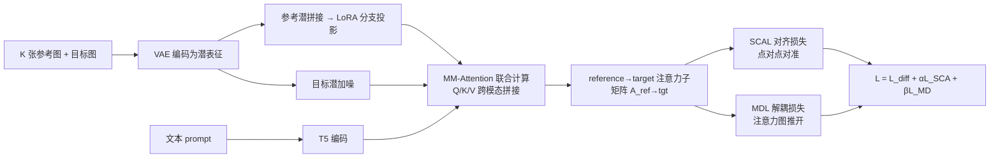

# MOSAIC: Multi-Subject Personalized Generation via Correspondence-Aware Alignment and Disentanglement

**会议**: ICLR 2026  
**OpenReview**: [https://openreview.net/forum?id=7AH0y1OtnC](https://openreview.net/forum?id=7AH0y1OtnC)  
**代码**: [https://github.com/bytedance-fanqie-ai/MOSAIC](https://github.com/bytedance-fanqie-ai/MOSAIC)  
**领域**: 图像生成 / 多主体个性化生成  
**关键词**: 多主体个性化生成、语义点对应、注意力对齐、注意力解耦、扩散 Transformer  

## 一句话总结
MOSAIC 把多主体个性化生成重新表述为「表征优化」问题：用一套带稠密语义点对应标注的数据集 SemAlign-MS，配合「对齐损失」逼参考→目标的注意力点对点对准、「解耦损失」把不同主体推进正交的注意力子空间，从而在 4 个以上参考主体时仍保持高保真，避开了既有方法 3 主体后就身份混淆、属性泄漏的崩溃。

## 研究背景与动机
- **领域现状**：多主体个性化生成要在「跟随文本」的同时，把多个参考图各自的身份/外观都保留下来。主流做法分两类——一类（MS-Diffusion、SSR-Encoder）往 cross-attention 注入空间布局，把主体绑到指定区域；一类（DreamO、XVerse）在 DiT 块里加路由约束或 token 级调制偏移来控制每个主体的表征。
- **现有痛点**：这些方法都是**全局特征匹配**，缺乏对「生成图哪块区域该看参考图哪一部分」的显式建模。主体一多，多个参考共享同一潜空间时表征互相干扰，于是身份混淆（identity blending）、属性泄漏（attribute leakage）频发，**超过 3-4 个主体后质量普遍崩塌**。
- **核心矛盾**：既要保住每个主体的个体保真度（individual fidelity），又要在不同主体表征之间强制可分性（inter-subject separability）——这两个目标在共享注意力空间里天然冲突，而既有方法没有任何机制去显式平衡。
- **本文目标**：设计能**同时**保身份、又强制主体间分离的优化目标，让方法扩展到 4+ 主体而不退化。
- **核心 idea**：**【表征中心 + 显式监督】** 不改架构去硬塞控制信号，而是先用稠密语义点对应数据**直接监督注意力分布**——一个损失逼参考 token 对准它该去的目标位置（对齐），另一个损失把不同参考的注意力图推开（解耦）。

## 方法详解

### 整体框架
MOSAIC 基于 FLUX-1.0-DEV，沿用 OmniControl 的「LoRA 分支处理参考、原权重处理去噪」范式：VAE 把目标图和 K 张参考图都编码成潜表征，目标潜加噪，参考潜经 LoRA 分支投影后**拼接成统一序列**，与目标、文本一起送进 MM-Attention 联合计算。训练阶段的关键不在结构，而在两个挂到 reference→target 注意力子矩阵 $A_{\text{ref}\to\text{tgt}}$ 上的损失：SCAL 管「对准」、MDL 管「分开」。要让这两个损失有监督信号，前提是有「参考图某点 ↔ 目标图某点」的稠密对应标注，这正是 SemAlign-MS 数据集要解决的。

### 关键设计

**1. SemAlign-MS：把「语义点对应」做成可监督的数据基础。** 多主体生成缺的不是图，而是「参考图哪个点对应目标图哪个点」的标注，这是显式监督注意力的前提。作者设计五阶段流水线自动造数据：GPT-4o 按模板生成涵盖人/动物/物体及其交互的多主体 prompt → SOTA T2I 模型合成图并按质量/主体清晰度/构图自动过滤 → Lang-SAM 开放词表检测分割出每个主体 → FLUX Kontext 做视角矫正以扩充姿态多样性 → 在目标图与每张参考图之间采样语义点对应。形式上数据集为 $D=\{(\{I_{\text{ref}}^{(i,k)}\}_{k=1}^K, I_{\text{tgt}}^{(i)})\}_{i=1}^N$，每对参考-目标定义对应集 $C^{(i,k)}=\{(u_{i,j}, v_{i,j})\}_{j=1}^{P(k)}$，其中 $u$ 是参考图坐标、$v$ 是目标潜空间对应位置。关键约束是**对应不相交**：$V^{(i,k_1)} \cap V^{(i,k_2)}=\emptyset,\ \forall k_1 \neq k_2$，即同一目标 token 至多被一张参考图占用，避免多个参考争抢同一区域造成监督歧义。最终收集 120 万对带验证对应的高质量图对。

**2. 语义对应注意力对齐损失（SCAL）：逼参考 token 精确落到它该去的目标位置。** 为保细粒度结构/纹理，作者直接监督 reference→target 注意力。对参考位置 $u$、目标潜位置 $v$，在选定的 $N_{\text{block}}$ 个 DiT 块上取平均注意力 $A_{\text{ref}\to\text{tgt}}[u,v]=\frac{1}{N_{\text{block}}}\sum_l \frac{\exp(Q_u K_v^\top/\sqrt{d})}{\sum_v \exp(Q_u K_v^\top/\sqrt{d})}$。由于参考潜是拼接的，还需把局部坐标映射到全局 token 索引：$G(u_{i,j}^{(k)})=\sum_{\text{idx}=1}^{k-1} N^{(\text{idx})} + u_{i,j}^{(k)}$（前面 $k-1$ 张参考的 token 数作为偏移）。对每个对应点做交叉熵式监督，让参考 token 把注意力质量压到它对应的目标位置：$L_{\text{SCA}}=-\frac{1}{K}\sum_{k=1}^K \frac{1}{P(k)}\sum_{j=1}^{P(k)} \log A_{\text{ref}\to\text{tgt}}[G(u_{i,j}^{(k)}), v_{i,j}^{(k)}]$。这把「全局相似/隐式对齐」升级成点对点的显式映射，局部结构和细节保真度因此显著提升。

**3. 多参考解耦损失（MDL）：把不同主体的注意力图推进正交子空间。** 对齐只保证「准」，但多主体共享潜空间时仍会互相干扰。MDL 显式拉开不同参考的注意力分布：先把第 $k$ 张参考在对应点处的注意力响应聚合并归一化成一个分布 $a^{(k)}=\|\frac{1}{P(k)}\sum_j a_j^{(k)}\| \in \mathbb{R}^{N_{\text{tgt}}}$，再用**对称 KL** 度量两个参考分布的距离 $\text{dist}(a^{(i)}, a^{(j)})=\frac12 D_{\text{KL}}(a^{(i)}\|a^{(j)})+\frac12 D_{\text{KL}}(a^{(j)}\|a^{(i)})$，最后**最大化**所有参考对的平均散度：$L_{\text{MD}}=-\frac{1}{K(K-1)}\sum_{i}\sum_{j\neq i}\text{dist}(a^{(i)}, a^{(j)})$。这阻止不同参考争抢同一注意力区域，直接缓解了主体一多就崩的跨参考特征干扰。总损失为 $L=L_{\text{diff}}+\alpha L_{\text{SCA}}+\beta L_{\text{MD}}$（流匹配损失 + 两个正则，实现中 $\alpha=0.4,\ \beta=0.6$）。

## 实验关键数据

### 主实验表格
DreamBench 上单/多主体定量对比（节选，↑ 越高越好）：

| 场景 | 方法 | CLIP-I | CLIP-T | DINO | UnifiedReward | HPSv3 |
|------|------|--------|--------|------|---------------|-------|
| 单主体 | DreamO | 83.35 | 30.61 | 76.03 | 4.33 | 12.78 |
| 单主体 | UNO | 83.50 | 30.41 | 75.97 | 4.00 | 11.24 |
| 单主体 | **MOSAIC** | **84.30** | **31.64** | **77.40** | **4.40** | **14.36** |
| 多主体 | DreamO | 73.32 | 32.10 | 52.17 | 4.33 | 13.25 |
| 多主体 | UNO | 73.29 | 32.23 | 54.22 | 4.23 | 11.55 |
| 多主体 | **MOSAIC** | **76.30** | **32.40** | **56.83** | **4.39** | **14.90** |

XVerseBench 总平均分：MOSAIC **76.04** vs XVerse 73.40 vs DreamO 69.25；多主体 ID-Sim 69.90（XVerse 66.59）、IP-Sim 74.27（XVerse 71.48），身份保留与感知相似度优势明显。与强身份保留基线对比（Face-Diffuser 协议，zero-shot），多主体 IP 达 0.712 vs Face-Diffuser 0.594、FastComposer 0.465。

### 消融实验表格
DreamBench 多主体场景下两损失的贡献：

| $L_{\text{SCA}}$ | $L_{\text{MD}}$ | CLIP-I | CLIP-T | DINO |
|:---:|:---:|--------|--------|------|
| ✗ | ✗ | 73.45 | 29.90 | 52.03 |
| ✓ | ✗ | 75.89 | 31.10 | 55.99 |
| ✗ | ✓ | 75.10 | 31.70 | 55.24 |
| ✓ | ✓ | **76.30** | **32.40** | **56.83** |

### 关键发现
- 两损失各自都带来明显增益，且互补：SCAL 主要拉高身份/结构相关的 DINO、CLIP-I，MDL 对文本一致性 CLIP-T 增益更突出，合用最优。
- **核心卖点是扩展性**：既有方法普遍在 3 个主体后退化，MOSAIC 在 4+ 参考主体下仍保持高保真——这是表征级显式对齐+解耦带来的能力，传统全局匹配做不到。
- 注意力图可视化显示，特定参考区域确实只激活生成图中对应区域，验证了解耦确实把主体分进了不同注意力子空间。

## 亮点与洞察
- **视角转换**：把多主体生成从「架构层加控制信号」重述为「表征层优化注意力分布」，问题定义本身就更对路——干扰发生在注意力里，那就直接监督注意力。
- **数据即方法**：SCAL/MDL 能成立完全依赖语义点对应标注，作者没有回避而是直接造了 120 万对带验证对应的数据集 SemAlign-MS，把「显式监督」从口号变成可训练目标。
- **对齐+解耦的对称设计**：一个损失做交叉熵「拉近」、一个做对称 KL「推开」，两者作用在同一注意力子矩阵上，形成简洁互补的正则。
- **即插即用**：只加 LoRA 分支与两个训练损失，不动 base 模型权重，推理开销可控。

## 局限与展望
- 数据流水线重度依赖 GPT-4o、Lang-SAM、FLUX Kontext 等现成大模型，语义点对应的「真值」实际上由这些模型链生成，标注质量上限受其约束。
- 对应不相交约束要求每个目标 token 至多对一张参考，主体大面积遮挡/交互重叠时这种硬性划分可能过强。
- 评测集中在 DreamBench/XVerseBench，主体数虽宣称 4+，但极端高主体数（如 5+ 细粒度物体）下的稳定性还需更系统验证。
- 两损失权重 $\alpha,\beta$ 为固定超参，是否需随主体数/任务自适应未探讨。

## 相关工作与启发
- **主体驱动生成**：OmniControl 用生成模型自身做参考编码器，UNO 提数据流水线，DreamO 用路由聚焦目标主体，XVerse 用文本流调制把参考变 token 偏移——MOSAIC 指出它们都停在全局特征匹配，缺细粒度点对应约束。
- **生成中的视觉对应**：DIFT、SD-DINO、GeoAware-SC 证明预训练扩散特征能建立可靠语义对应，但此前没人把它用进多主体生成；MOSAIC 是第一个把语义点对应显式注入生成过程的工作。
- **启发**：当某任务的失败模式（这里是主体干扰）能定位到某个具体中间量（注意力子矩阵）时，与其加结构，不如造对应监督信号去**直接约束这个中间量**——「先定位失败发生在哪、再针对性造数据监督」是可迁移的方法论。

## 评分
- **新颖性**: ⭐⭐⭐⭐ 把多主体生成重述为注意力表征优化，并首次将语义点对应引入该任务、配套自建对应数据集，视角与切入点都新。
- **实验充分度**: ⭐⭐⭐⭐ 两个 benchmark + 多组强基线 + 损失消融 + 注意力可视化，4+ 主体扩展性证据扎实；但极端主体数与数据标注质量的鲁棒性分析略缺。
- **写作质量**: ⭐⭐⭐⭐ 动机—矛盾—方法逻辑清晰，公式与流水线表述完整，图示到位。
- **价值**: ⭐⭐⭐⭐ 解决了多主体生成 3 主体崩塌的实际痛点，即插即用且开源，对个性化生成应用落地有直接价值。

<!-- RELATED:START -->

## 相关论文

- [\[CVPR 2026\] PSR: Scaling Multi-Subject Personalized Image Generation with Pairwise Subject-Consistency Rewards](../../CVPR2026/image_generation/psr_scaling_multi-subject_personalized_image_generation_with_pairwise_subject-co.md)
- [\[CVPR 2026\] MultiCrafter: High-Fidelity Multi-Subject Generation via Disentangled Attention and Identity-Aware Preference Alignment](../../CVPR2026/image_generation/multicrafter_high-fidelity_multi-subject_generation_via_disentangled_attention_a.md)
- [\[ICLR 2026\] SIGMA-GEN: Structure and Identity Guided Multi-Subject Assembly for Image Generation](sigma-gen_structure_and_identity_guided_multi-subject_assembly_for_image_generat.md)
- [\[CVPR 2026\] Correspondence-Attention Alignment for Multi-View Diffusion Models](../../CVPR2026/image_generation/correspondence-attention_alignment_for_multi-view_diffusion_models.md)
- [\[ICLR 2026\] LazyDrag: Enabling Stable Drag-Based Editing on Multi-Modal Diffusion Transformers via Explicit Correspondence](lazydrag_enabling_stable_drag-based_editing_on_multi-modal_diffusion_transformer.md)

<!-- RELATED:END -->
