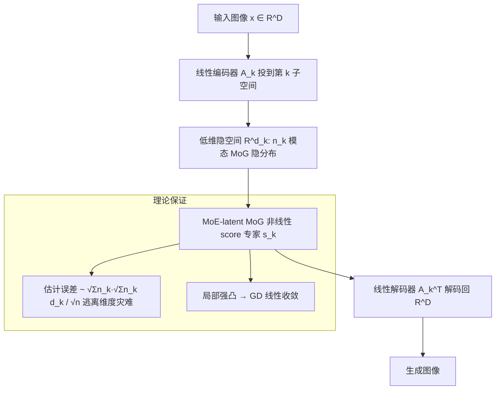

# Multi-Subspace Multi-Modal Modeling for Diffusion Models: Estimation, Convergence and Mixture of Experts

**会议**: ICLR 2026  
**OpenReview**: [https://openreview.net/forum?id=MPWIM6rxxU](https://openreview.net/forum?id=MPWIM6rxxU)  
**代码**: 待确认  
**领域**: 扩散模型理论 / 生成模型  
**关键词**: 扩散模型, 估计误差, 维度灾难, 混合专家(MoE), 低秩高斯混合, 收敛性分析  

## 一句话总结
本文提出"低秩高斯混合的子空间混合"(MoLR-MoG)建模，把真实图像数据刻画为多个低维线性子空间、每个子空间内再放一个高斯混合，由此诱导出天然带 MoE 结构的非线性 score 函数，既在理论上把估计误差降到 $\sqrt{\sum_k n_k}\sqrt{\sum_k n_k d_k}/\sqrt{n}$（摆脱维度灾难）并证明局部强凸的收敛保证，又在实验上用比 U-Net 少 10× 参数的网络生成清晰图像。

## 研究背景与动机
**领域现状**：扩散模型在 2D/3D/视频生成上效果惊人，且只用很小的训练集、优化过程稳定快速。但理论上，针对一般数据用深 ReLU 网络或 diffusion transformer 分析 score 估计，得到的极小极大率是 $n^{-s'/D}$（$D$ 是数据环境维度），随维度指数恶化——即"维度灾难"，完全无法解释扩散模型的样本高效性。

**现有痛点**：为缩小理论与实践的鸿沟，已有两条思路。一条用多模态建模（如高斯混合 MoG）刻画真实数据；另一条假设数据落在单个低维线性子空间 $x=Az$，把误差降到 $n^{-2/d}$ 并去掉对 $D$ 的依赖。但真实图像并非单一流形，而是**多个流形的并集**。Wang et al. (2024) 的 MoLRG 建模把数据建成多个线性子空间的并集、每个子空间放一个**零均值高斯**隐变量，达到 $1/\sqrt{n}$ 的估计误差。

**核心矛盾**：MoLRG 虽然抓住了"多流形"特性，但其零均值高斯隐变量过于简单，无法刻画每个低维流形内部的**多模态**结构（真实数据流形内往往有多个聚簇/众数），与真实分布相去甚远，且其诱导的 score 是线性的，丢掉了真实 score 的非线性。

**本文目标**：提出一种同时反映"多流形 + 多模态"特性的建模，并基于它证明扩散模型能逃离维度灾难、享受快速收敛。

**核心 idea**：**MoLR-MoG 建模** —— 把数据建成 $K$ 个线性子空间的并集，**每个子空间内不再是单一高斯而是一个 $n_k$ 模态的低秩高斯混合**。这一改造让诱导出的 score 函数天然具有混合专家(MoE)结构、捕获多模态信息并带非线性，从而把多模态建模与多流形建模在一个框架里统一起来。

## 方法详解

### 整体框架
真实图像数据被建模为 $K$ 个低维线性子空间的并集，第 $k$ 个子空间由正交列矩阵 $A_k^*\in\mathbb{R}^{D\times d_k}$ 张成；在该子空间内放置一个 $n_k$ 模态的低秩高斯混合作为隐分布，得到完整目标分布 $p_0=\sum_{k=1}^K\frac1K\sum_{l=1}^{n_k}\pi_{k,l}\,\mathcal N(x; A_k^*\mu^*_{k,l}, A_k^*\Sigma^*_{k,l}A_k^{*\top})$。由这一分布解析推导出的 score 自然呈 MoE 结构：每个"专家"是一个低维子空间内的非线性 MoG score，线性编码器 $A_k$ 把图像投到第 $k$ 个流形、在低维隐空间做去噪、再由 $A_k^\top$ 解码回全维。理论部分聚焦于"先估计误差、再优化收敛"两步，先证逃离维度灾难，再证局部强凸保收敛。

### 关键设计
**1. MoLR-MoG 建模：用子空间内的高斯混合替换零均值高斯，让 score 变非线性。** 这是全文的根基。MoLRG 把每个子空间的隐变量设为零均值高斯，等价于一个线性 score、无法表达流形内部的多个众数；本文把第 $k$ 个子空间内的隐分布换成 $n_k$ 模态、协方差为低秩形式 $\Sigma^*_{k,l}=U^*_{k,l}U^{*\top}_{k,l}$ 的高斯混合。由万有逼近视角，只要分量足够多、参数 $\{\pi_{k,l},\mu^*_{k,l},\Sigma^*_{k,l}\}$ 选得合适，MoG 可以任意逼近任何光滑密度，因此严格比 MoLRG 的单高斯隐变量更一般、更贴近真实数据。值得强调的是，作者特别指出 MoLR-MoG **不能**被简单看成有 $\sum_k n_k$ 个子空间的 MoLRG，因为后者会要求 $\sum_k n_k$ 个独立 VAE，在真实场景里不合理。

**2. MoE-latent 非线性 MoG score：解析推出的天然专家结构。** 在 MoLR-MoG 下，score 函数有闭式解 $\nabla\log p_t(x)=-\frac1{\gamma_t^2}\frac{\sum_k\frac1K\sum_l\pi_{k,l}\mathcal N(\cdot)\,\delta_{k,l,t,A}(x)}{\sum_k\frac1K\sum_l\pi_{k,l}\mathcal N(\cdot)}$，其中 $\gamma_t=s_t\sigma_t$。这个表达式天然是一个"软门控 + 多专家"的 MoE：每个子空间对应一个专家、专家内部又是非线性 MoG score。由于线性编码/解码引入的误差量级仅为 $Dd_k^3/\sqrt n$、并非主导项，作者假设编码器解码器被完美学习，把分析火力集中在更难的"隐空间 MoG 扩散"部分，第 $k$ 个流形内的 score 简化为 $\nabla\log p_{t,k}(x_{LD})$，只需学 $\mu_{k,l}$ 与 $U_{k,l}$ 两组参数。这一设计在工程上等价于"用预训练 VAE 编码、只在隐空间训扩散"。

**3. 逃离维度灾难的估计误差界。** 作者先用 MoLR-MoG 与 MoE-MoG score 的结构推出网络与损失的 Lipschitz 常数 $L\le\sqrt{\sum_k n_k(L_{\mu_l}^2+L_{U_k}^2)}=O((\sum_k n_k)^{1/2}C_w)$，再通过控制损失类的 Rademacher 复杂度 + Bernstein 集中不等式，得到泛化界：以高概率 $|L(\theta)-\hat L_n(\theta)|\le O\!\big(C_1\frac{(R+s_tB_\mu)^4 s_t^2\sqrt{\sum_k n_k}}{\gamma_t^6}\sqrt{\frac{\sum_k n_k d_k}{n}}+C_2\sqrt{\frac{\log(1/\delta)}{n}}\big)$。关键在于该界把对环境维度 $D$ 的指数依赖，替换成对子空间数 $K$、隐维 $d_k$、模态数 $n_k$ 的多项式依赖——这些正是真实数据的内在结构量，从而摆脱维度灾难，定量解释了"为何小样本就够训"。

**4. 局部强凸与线性收敛保证。** 面对高度非凸的 score-matching 目标，作者利用 MoG score 的闭式表达式显式算出目标函数的 Jacobian 与 Hessian（分别给 2 模态与一般 MoG 隐变量）。证明在"聚簇充分分离"条件下，真值参数 $\theta^*$ 附近的 Hessian 简化为块对角形式、从而局部强凸；配合一个良好的初始化区域，梯度下降(GD)就能获得线性收敛速率。这把"扩散模型优化为何又快又稳"从经验观察提升为可证结论——以 2 模态同协方差、$\mu^*_{k,1}=-\mu^*_{k,2}=\mu^*_k$ 的对称情形作为可解析的切入点展开。

## 实验关键数据
实验目的明确为"验证 MoLR-MoG 建模的合理性"，而非刷 SOTA。在 MNIST/CIFAR-10/ImageNet-256 上对比三种隐空间参数化：latent U-Net、latent MoG NN（按式(3)，$n_k\in\{4,8,40\}$）、latent Gaussian NN（MoLRG 闭式线性 score）。遵循 Brown et al. (2023)，MNIST 上为每个数字训 10 个 VAE 作为 $K$ 个低维流形。

### 主实验（ImageNet parachute 类，CLIP score，文本 "a photo of parachute"）

| 参数化方式 | CLIP score | 相对参数量 |
|---|---|---|
| MoLR + U-Net | 0.304 | 基准（大） |
| **MoLR-MoG NN（本文）** | **0.293** | **约 10× 更小** |
| MoLRG Gaussian NN | 0.254 | 小 |

### 关键对比与消融

| 对比维度 | 结论 |
|---|---|
| 生成质量（MNIST/CIFAR-10/ImageNet 定性） | MoLRG 高斯只能生成模糊、难辨数字的图；MoLR-MoG 生成清晰图，可与 MoLR-U-Net 媲美 |
| 训练损失曲线（CIFAR-10） | MoE-MoG NN 的 loss 显著低于 MoE-Gaussian、逼近 MoE-U-Net，支持其高效逼近真值 score |
| 专家专属 VAE vs 统一 VAE（图 5） | 用单一统一 VAE 时隐空间过于复杂，小 MoG 专家学不出有意义图像、需大 U-Net；为每个专家微调专属 VAE（如对 parachute 类微调），隐流形变简单，小 MoG 专家即可生成清晰图 |

### 关键发现
- MoLR-MoG 用 **10× 更少参数**即逼近 U-Net 的文本-图像对齐（CLIP 0.293 vs 0.304），说明"多模态隐先验"确实抓住了真实数据结构。
- "专家专属 VAE"是 MoLR-MoG 落地的关键：它呼应理论中"$K$ 个编码器各投到自己流形"的设定，并指出大规模无标签数据可用聚类划簇 + 每簇 LoRA 微调一个共享 VAE backbone 的工程路径。

## 亮点与洞察
- **建模层面的统一**：第一次把"多流形（多子空间）"与"多模态（子空间内 MoG）"两条理论路线在一个分布里统一，且诱导出的 score 自然是 MoE 结构——把"扩散模型该不该用 MoE"从经验问题提升到流形视角的理论动机。
- **理论-实践闭环**：不仅给出逃离维度灾难的估计界和局部强凸的收敛证明，还用真实图像实验佐证建模合理性，理论假设（专家专属 VAE、隐空间小 MoG）与实验设置一一对应，少见地把"为何扩散模型小样本就够、优化又快又稳"两个经验现象同时解释。
- **非线性 score 的可解析性**：MoG score 虽非线性，但有闭式解，作者借此显式算 Hessian、绕开了一般非凸优化无从下手的困境。

## 局限与展望
- 理论分析依赖若干强假设：编码/解码器被"完美学习"、聚簇"充分分离"、优化部分把 $d_{k,l}=1$ 以简化 Hessian、并需要良好初始化区域——这些条件在真实大规模数据上能多大程度成立仍待检验。
- 实验定位是"验证建模合理性"而非 SOTA，规模有限（MNIST/CIFAR-10/ImageNet 单类 CLIP 评估），缺少大规模 FID 等系统指标。
- 需要为每个流形/簇准备 VAE（或 LoRA 专家），$K$ 较大时的扩展性、聚类质量对最终生成的影响等工程问题，作者本人也将其列为 future work。
- 收敛保证是**局部**的（真值附近强凸 + 好初始化），全局优化景观仍未刻画。

## 相关工作与启发
本文站在两条理论脉络的交叉点：一是 score 估计误差分析（Oko et al. 2023 的 $n^{-s'/D}$ 极小极大率、Li/Han 等的 2 层宽网络 $n^{-2/5}$ 但需 $\exp(n)$ 规模、Shah/Cui/Chen 等的 MoG 多模态分析）；二是低维结构假设（Chen et al. 2023b 单线性子空间 $n^{-2/d}$、Wang et al. 2024 的 MoLRG 多子空间 $1/\sqrt n$）。本文的核心贡献正是指出 MoLRG 的零均值高斯丢失了多模态性，用 MoG 隐变量补上并保持 $1/\sqrt n$ 级别的去维度灾难界。对后续工作的启发在于：把 MoE 结构与多流形多模态建模绑定，提示"专家专属 VAE + 隐空间小专家 + 聚类划簇 + LoRA 共享 backbone"可能是一条参数高效的生成路线，也为"扩散模型为何样本高效"提供了可验证的理论解释框架。

## 评分
- **新颖性**: ⭐⭐⭐⭐⭐ 首次提出 MoLR-MoG 建模，统一多流形与多模态、诱导天然 MoE score，弥补 MoLRG 缺多模态的关键缺口，理论动机清晰。
- **实验充分度**: ⭐⭐⭐ 实验定位为验证建模合理性，三数据集 + 损失曲线 + 专家 VAE 消融到位，但规模偏小、缺 FID 等系统量化指标，CLIP 仅单类评估。
- **写作质量**: ⭐⭐⭐⭐ 问题动机—建模—估计—收敛—实验逻辑链完整，理论与实验设置对应清楚；公式密集，对非理论读者门槛较高。
- **价值**: ⭐⭐⭐⭐ 同时解释扩散模型"小样本足够 + 优化又快又稳"两大经验现象，并为 MoE-扩散提供流形视角的理论支撑，对生成模型理论与高效架构设计都有启发。

<!-- RELATED:START -->

## 相关论文

- [\[CVPR 2026\] Mixture of Style Experts for Diverse Image Stylization](../../CVPR2026/image_generation/mixture_of_style_experts_for_diverse_image_stylization.md)
- [\[ICML 2026\] Diffusion Models Are Statistically Optimal for Learning Low-Dimensional Multi-Modal Distributions](../../ICML2026/image_generation/diffusion_models_are_statistically_optimal_for_learning_low-dimensional_multi-mo.md)
- [\[CVPR 2025\] MMAR: Towards Lossless Multi-Modal Auto-Regressive Probabilistic Modeling](../../CVPR2025/image_generation/mmar_towards_lossless_multi-modal_auto-regressive_probabilistic_modeling.md)
- [\[ICLR 2026\] LazyDrag: Enabling Stable Drag-Based Editing on Multi-Modal Diffusion Transformers via Explicit Correspondence](lazydrag_enabling_stable_drag-based_editing_on_multi-modal_diffusion_transformer.md)
- [\[ICLR 2026\] LapFlow: Laplacian Multi-scale Flow Matching for Generative Modeling](lapflow_laplacian_multi-scale_flow_matching_for_generative_modeling.md)

<!-- RELATED:END -->
