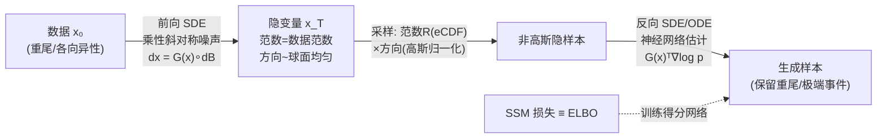

# Multiplicative Diffusion Models: Beyond Gaussian Latents

**会议**: ICLR 2026  
**OpenReview**: [https://openreview.net/forum?id=F6w8LcJJFA](https://openreview.net/forum?id=F6w8LcJJFA)  
**代码**: 待确认  
**领域**: 生成模型 / 扩散模型  
**关键词**: 乘性噪声, 扩散模型, 非高斯隐空间, 重尾分布, 极端事件, 滑动得分匹配, 物理启发  

## 一句话总结
本文提出乘性得分扩散模型（MSGM），用**斜对称乘性噪声**取代经典扩散的加性高斯噪声，让前向过程在保持数据范数分布不变的前提下收敛到一个非高斯、且天然贴近数据的隐分布，从而在重尾、各向异性数据上更准确地生成罕见极端事件。

## 研究背景与动机
- **领域现状**：扩散模型 / 得分生成模型（SGM）已是图像生成 SOTA，其前向过程是加性高斯噪声驱动的 Ornstein-Uhlenbeck（OU）过程，隐空间永远收敛到标准高斯 $\mathcal{N}(0, I_d)$，与数据分布无关。
- **现有痛点**：标准高斯先验与真实数据分布常常相去甚远。对于**重尾（heavy-tailed）/ 各向异性**数据，高斯隐变量的范数服从 $\chi^2$ 分布，无论数据如何都不会有重尾——而 Lafon et al. (2023) 指出：隐变量没有重尾，生成样本几乎不可能复现重尾。更严重的是，对重尾数据，数据到 SGM 隐分布的 KL 散度是**无穷大**。
- **核心矛盾**：扩散模型用一个固定、与数据无关的高斯隐空间，去拟合千变万化、常含极端事件的真实分布；隐分布与数据分布越远，前向/后向积分越费力，罕见大值事件（rare critical events）越难生成，且低数据量下尤为糟糕。
- **本文目标**：构造一个隐分布**自适应数据、保留数据关键信息（范数分布）**的扩散模型，让隐空间与数据分布尽可能接近，从而高效且准确地生成极端事件。
- **核心 idea**：**[物理守恒结构]** 借鉴流体力学中的传输噪声（transport noise），用斜对称乘性噪声驱动前向 SDE——这种噪声只在原点周围做随机旋转，**严格保持每个数据点的范数不变**（能量守恒），于是隐分布的范数分布 = 数据范数分布，自动继承数据的重尾特性。

## 方法详解

### 整体框架
MSGM 把经典扩散的「加性噪声 + 高斯隐空间」整体替换为「斜对称乘性噪声 + 数据感知的非高斯隐空间」。前向 SDE 让数据点在以其范数为半径的球面上随机旋转，方向最终收敛到球面均匀分布，而范数恒定不变；隐变量于是分解为「数据范数（一维可估）× 球面均匀方向」的乘积结构。反向过程用滑动得分匹配（SSM）训练一个神经网络估计得分，并被证明等价于最大化 ELBO。

### 关键设计
**1. 斜对称乘性前向 SDE：用旋转代替平移，让范数成为守恒量。** 前向过程写成乘性 Stratonovich SDE $\mathrm{d}\overrightarrow{x}_s = G(\overrightarrow{x}_s) \circ \mathrm{d}\overrightarrow{B}_s$，其中线性算子 $G$ 由三阶张量 $[G^k_{i,j}]$ 表示，并强加两条假设：**斜对称性（A1）** 要求每个 $G^k$ 满足 $G^k_{i,j} = -G^k_{j,i}$，**秩条件（A2）** 要求 $\mathrm{rank}(G(x)) = d-1$。斜对称直接导致噪声增量 $\mathrm{d}Z_s$ 与 $\overrightarrow{x}_s$ 正交，于是 $\mathrm{d}\|\overrightarrow{x}_s\|^2 = 2\overrightarrow{x}_s \cdot \mathrm{d}\overrightarrow{x}_s = 0$，即范数严格守恒 $\|\overrightarrow{x}_s\| = \|\overrightarrow{x}_0\|$——这正是流体力学中不可压缩流导致的能量守恒在生成模型里的翻版。秩条件 A2 保证噪声充分铺满与 $x$ 正交的整个切空间 $\langle x\rangle^\perp$，使方向充分混合、隐分布可解析。

**2. 数据感知的非高斯隐分布：范数原样保留，方向收敛到球面均匀。** 把隐变量做球面分解 $\overrightarrow{x}_s = \|\overrightarrow{x}_s\| \cdot \overrightarrow{x}^n_s$。由于范数恒定，整个噪声过程只在半径 $\|\overrightarrow{x}_0\|$ 的球面上演化；论文证明方向 $\overrightarrow{x}^n_s$ 服从一个球面上的 Fokker-Planck 方程，并**指数级**收敛到 $\mathcal{S}^{d-1}$ 上的均匀分布。因此稳态隐密度是乘积结构 $p_\infty(x) = p_{|\cdot|}(\|x\|) \cdot \|x\|^{1-d} / |\mathcal{S}^{d-1}|$，范数与方向渐近独立。这个隐分布当且仅当数据平方范数恰服从 $\chi^2_d$ 时才退化为高斯——一般情况下它是非高斯的，且**数据有重尾 ⟺ 隐分布有重尾**。论文进一步证明 MSGM 隐分布到数据的 KL 散度始终不大于 SGM，对重尾数据 SGM 为无穷大而 MSGM 有限，意味着只需很少时间步即可完成前/后向积分。

**3. 一维范数采样 + 球面方向采样：把高维难题降为一维问题。** 隐分布的乘积结构让采样异常简洁：方向部分先采高斯 $\overrightarrow{x}^N \sim \mathcal{N}(0, I_d)$ 再归一化即得球面均匀方向；范数部分则把高维分布坍缩成**一维的对数范数分布** $F_{\log|\cdot|}$，用经验 CDF（eCDF）拟合，再通过 $r = F^{-1}_{\log|\cdot|}(F_{2}^{(d)}(r^2))$ 式的逆变换采样。这样高维采样彻底避开维度灾难，只需解一维分布问题，且范数与方向独立保证了正确性。

**4. 滑动得分匹配 ≡ ELBO：为乘性噪声提供训练理论基础。** 乘性情形下条件得分 $\nabla \log p_s(\overrightarrow{x}_s \mid \overrightarrow{x}_0)$ 没有解析式，故论文直接用神经网络 $a_\theta(\overrightarrow{x}_t, T{-}t)$ 建模 $G(\overrightarrow{x}_t)^\top \nabla \log p_{T-t}$，并用**滑动得分匹配（SSM）** 训练，损失为 $\mathcal{L}_{\mathrm{SSM}}(\theta) = \mathbb{E}\big[\tfrac{1}{2}\|a_\theta\|^2 + (v \cdot \nabla)(G^\top a_\theta) \cdot v\big]$，$v$ 取 Rademacher 分布。Theorem 3.4.1 证明：即使在乘性噪声下，最小化该 SSM 损失也**精确等价于最大化 ELBO**（隐式得分匹配 ISM），把本文框架与变分原理对接，并推广了 Huang et al. (2021) 的结果。反向过程同时给出 SDE 与概率流 ODE 两种形式。

## 实验关键数据
> 论文以**最大平均差异（MMD）** 为核心指标，对比 MSGM 与经典 SGM 基线（同样用 SSM 训练以公平比较）。

### 主实验

| 任务 | 维度 / 设置 | 现象 |
|------|------------|------|
| 相关 Cauchy 分布 | $d=4$，对相关化的 Cauchy 向量 $x_0 = A x_{Ca}$（幂律尾 $\propto|x|^{-2}$） | SGM 几乎无法复现肥尾与极端方向性；MSGM 准确捕捉。随 ADAM 迭代增加，MSGM 越来越准，SGM 反而发散 |
| 实测涡量场 | $d=16$，1024 个 PIV 实测涡量样本（Re=3900 圆柱尾流） | SGM 把样本过度集中在分布中心、低估罕见大涡量事件；MSGM 隐分布更贴近数据（疑似 Laplace 尾），尾部刻画明显更好 |
| 高维图像 | $d=1024$，稀疏张量 $G$ | 给出首批 MSGM 高维生成图像，验证可扩展性（属初步探索，未纳入主理论框架） |

### 关键发现
- **极端事件 / 尾部行为**：在两个重尾任务上，MSGM 对极端事件与尾部分布的刻画都显著优于 SGM，尤其在**低数据量**情形（Figure 4b：MMD 随训练样本数变化，MSGM 全程领先）。
- **收敛稳定性**（Figure 4a）：Cauchy 任务上随有效 ADAM 迭代增加，MSGM 的 MMD 持续下降，而 SGM 训练发散——印证「隐分布越贴近数据，优化越容易」的理论预期。
- **理论一致性**：实验观测到 MSGM 隐分布到数据的 KL 更小、隐分布继承数据重尾，与 Section E.5/E.6 的理论结论吻合。

## 亮点与洞察
- **把物理守恒律变成生成模型的归纳偏置**：斜对称（不可压缩）⟹ 范数守恒（能量守恒）⟹ 隐分布保留数据范数，这条从流体力学借来的链条非常优雅，是对「扩散一定要把数据洗成各向同性高斯」这一默认设定的根本性挑战。
- **隐空间数据感知**：标准扩散的隐分布与数据无关，MSGM 让隐分布自动继承数据的范数分布（含重尾），从而缩短数据与隐空间的「距离」，理论上 KL 永远 ≤ SGM，对重尾数据更是从无穷大变有限。
- **维度灾难的巧妙规避**：乘积结构把高维采样拆成「一维范数（eCDF）× 球面均匀方向（高斯归一化）」，难点全部压缩到一维。
- **完整理论闭环**：从 Fokker-Planck 方程、指数收敛、稳态分布解析式，到反向 SDE/ODE、SSM≡ELBO，给出了一套自洽的数学框架，而非纯经验 trick。

## 局限与展望
- **无解析得分，训练受限**：乘性情形下前向 SDE 无大秩张量的解析解、有限时间得分也无解析式，导致不能用更稳定的去噪得分匹配（DSM），只能用 ISM/SSM——后者稳定性较差、需数值积分前向过程，训练更慢或迭代更少。
- **稠密张量内存爆炸**：实验用的稠密三阶张量 $G$ 有 $d^3$ 个系数，对 $d=O(10^5)$ 的真实图像/湍流问题内存与计算不可承受；高维只能靠稀疏张量（Section K），但稀疏张量不完全满足主理论框架（A1/A2），高维结果偏初步。
- **展望**：作者寄望于对称黎曼流形上的生成模型、随机微分几何、随机矩阵理论 / 自由概率（forward SDE 半群可表为酉布朗矩阵，高维趋于自由乘性布朗矩阵）为 d-球面上的扩散提供更高效的采样与得分评估；并正在开发物理启发的稀疏张量 $G$（对应含传输噪声的 SPDE 空间离散），期望物理归纳偏置进一步改善低数据量下的推断与学习。

## 相关工作与启发
- **得分扩散模型基础**：Song et al. (2021) 的 SDE 统一框架、Huang et al. (2021) 的 $a_\theta = \sqrt{2}s_\theta$ 与 SSM≡ELBO、Song et al. (2020) 的滑动得分匹配——MSGM 把这些从加性高斯推广到乘性斜对称噪声（形式上把 $G$ 替换为 $\sqrt{2}$ 即退化为 SGM）。
- **物理 / 流体力学传输噪声**：Kraichnan (1968)、Resseguier et al. (2021) 等的传输噪声与随机流体力学，是斜对称乘性噪声的灵感来源；本文把「随机流体平流」重新诠释为一种生成机制。
- **重尾生成的难点**：Lafon et al. (2023) 关于隐变量重尾对生成重尾的必要性——这正是 MSGM 数据感知隐空间要解决的核心问题。
- **黎曼流形扩散**：球面上的方向动力学与 Riemannian 梯度，把 MSGM 与流形扩散模型（manifold diffusion）联系起来，提示在对称空间上做生成的新路径。
- **启发**：对任何需要生成「罕见但关键」事件的领域（气候极端事件、湍流、金融尾部风险、Bayesian 反问题），「让隐分布守恒数据关键统计量」比「强行洗成高斯」可能是更省力、更准的范式。

## 评分
- **新颖性**: ⭐⭐⭐⭐⭐ 从根上重构扩散模型的噪声机制（加性→乘性斜对称），用物理守恒律导出数据感知的非高斯隐空间，是真正开辟新方向的工作。
- **实验充分度**: ⭐⭐⭐ 理论扎实但实验偏 toy（$d=4/16$ 的 Cauchy 与涡量，$d=1024$ 仅初步），缺图像基准（FID/真实数据集）上与主流扩散的正面对比，仅用 MMD 一个指标。
- **写作质量**: ⭐⭐⭐⭐ 数学叙述严谨、贡献清晰、图 1 对比 SGM/MSGM 直观；但理论密度高、大量结论压进附录，对非理论背景读者门槛较高。
- **价值**: ⭐⭐⭐⭐ 为重尾 / 极端事件生成、物理启发生成模型提供了有原则的新框架，长期潜力大；短期受限于稠密张量的可扩展性与得分估计稳定性。

<!-- RELATED:START -->

## 相关论文

- [\[ICLR 2026\] Improving Discrete Diffusion Unmasking Policies Beyond Explicit Reference Policies (UPO)](improving_discrete_diffusion_unmasking_policies_beyond_explicit_reference_polici.md)
- [\[ICLR 2026\] Hyperspherical Latents Improve Continuous-Token Autoregressive Generation](hyperspherical_latents_improve_continuous-token_autoregressive_generation.md)
- [\[ICML 2025\] Gaussian Mixture Flow Matching Models](../../ICML2025/image_generation/gaussian_mixture_flow_matching_models.md)
- [\[CVPR 2026\] What Is It Like to Be a Noise? An Entropy-based Gaussian Noise Regularization for Diffusion Models](../../CVPR2026/image_generation/what_is_it_like_to_be_a_noise_an_entropy-based_gaussian_noise_regularization_for.md)
- [\[ICML 2026\] Beyond Generative Priors: Minority Sampling with JEPA-Guided Diffusion](../../ICML2026/image_generation/beyond_generative_priors_minority_sampling_with_jepa-guided_diffusion.md)

<!-- RELATED:END -->
