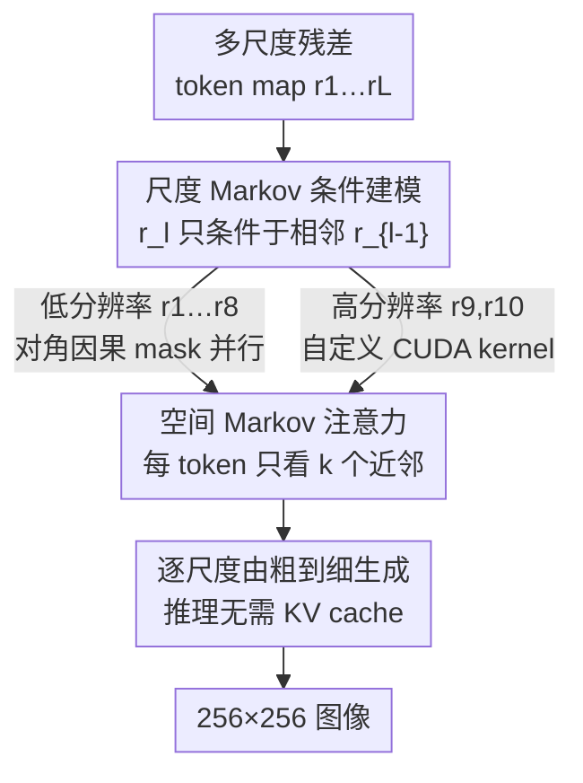

# MVAR: Visual Autoregressive Modeling with Scale and Spatial Markovian Conditioning

**会议**: ICLR 2026  
**arXiv**: [2505.12742](https://arxiv.org/abs/2505.12742)  
**代码**: [Project Page](https://nuanbaobao.github.io/MVAR)  
**领域**: LLM效率  
**关键词**: 视觉自回归, Next-Scale Prediction, Markov假设, 注意力优化, 图像生成, 内存效率

## 一句话总结

提出 MVAR（Markovian Visual AutoRegressive），通过引入尺度 Markov 假设（仅依赖相邻尺度而非所有前序尺度）和空间 Markov 注意力（限制邻域大小 k），将 VAR 模型的注意力计算复杂度从 $\mathcal{O}(N^2)$ 降至 $\mathcal{O}(Nk)$，在 ImageNet 256×256 上实现同等或更优性能的同时，推理显存降低 3.0-4.2×，且仅需 8 张 RTX 4090 即可训练。

## 研究背景与动机

### Next-Scale Prediction 范式

VAR（Visual AutoRegressive modeling）将传统的 next-token 预测重新定义为 next-scale 预测：图像被编码为多尺度残差 token map $\mathcal{R} = (r_1, r_2, \dots, r_L)$，按从粗到细的顺序自回归生成。这比 raster-scan 顺序更好地保留了图像的二维结构，显著提升了生成效率和质量。

### 现有 VAR 的冗余问题

作者通过注意力权重分析发现两个关键冗余：

**尺度冗余**：每个尺度的注意力权重高度集中在**相邻前一尺度**，远端尺度几乎不被关注。但 VAR 却让每个尺度依赖所有前序尺度

**空间冗余**：相邻尺度间的注意力呈**对角线主导模式**（类似卷积的局部连接），每个 token 主要关注其对应空间位置的近邻，而非所有 token

这两种冗余导致了不必要的 GPU 显存消耗和计算浪费。

## 方法详解

### 整体框架

MVAR 想解决的是 VAR 那条「next-scale 预测」链路上的两处浪费：每个尺度都条件于**所有**前序尺度，导致 KV cache 随尺度累积膨胀；相邻尺度之间又做**全局**注意力，导致计算量随 token 数平方增长。MVAR 的做法是在同一条 next-scale 链路上叠加两个 Markov 假设——尺度方向上，当前 token map $r_l$ 只看相邻的前一尺度 $r_{l-1}$（尺度 Markov）；空间方向上，每个 token 只看自己邻域内大小为 $k$ 的近邻（空间 Markov）。两个假设叠加后，原本贯穿所有尺度、所有 token 的稠密全注意力被裁成一条「相邻尺度 + 局部窗口」的稀疏路径，既消掉了推理时的 KV cache，也把注意力复杂度从 $\mathcal{O}(N^2)$ 压到 $\mathcal{O}(Nk)$，最终能用 8 张 RTX 4090 完成训练。

### 关键设计

**1. 尺度 Markov 条件建模：把全尺度依赖砍成相邻一跳**

VAR 的联合分布要求每个尺度都条件于所有前序尺度 $p(r_1, \dots, r_L) = \prod_{l=1}^{L} p(r_l \mid r_1, \dots, r_{l-1})$，这正是 KV cache 随尺度累积膨胀的根源。但注意力分析显示远端尺度几乎不被关注（尺度冗余），于是 MVAR 直接把条件前缀替换成只剩相邻尺度：

$$p(r_1, r_2, \dots, r_L) = p(r_1) \prod_{l=2}^{L} p(r_l \mid \eta_k(r_{l-1}))$$

其中 $\eta_k(\cdot)$ 把注意力进一步限制在大小为 $k$ 的空间邻域内（与下面的空间 Markov 衔接），$p(r_1)$ 由类别嵌入的 start token 生成。各尺度依赖被解耦后，训练不必再按链式逐尺度串行：256×256 生成下，低分辨率的 $r_1$ 到 $r_8$ 因感受野小于邻域 $k$，用一张对角模式因果 mask 就能并行算完；只有最高两个分辨率 $r_9$、$r_{10}$ 需单独走自定义 CUDA kernel。推理时因为只依赖前一尺度，每个尺度生成完即可丢弃，**全程无需 KV cache**——这是显存大幅下降、推理工程简化的直接来源。

**2. 空间 Markov 注意力：用局部窗口替代全局打分**

砍掉远端尺度后，相邻尺度之间的稠密注意力仍是浪费：注意力图呈对角线主导模式，每个 token 主要关注其对应空间位置的近邻，类似卷积的局部连接，把全 token 的 $\mathbf{Q}\mathbf{K}^\top$ 算遍并无必要。MVAR 让每个 token $i$ 只对自己的 $k$ 个最近邻计算分数 $\mathbf{S}_i^l = [\mathbf{Q}_i^l (\mathbf{K}_{\eta_k^i(1)}^l)^T, \dots, \mathbf{Q}_i^l (\mathbf{K}_{\eta_k^i(k)}^l)^T]$，再经 $\text{SA}_i^l = \text{SoftMax}(\mathbf{S}_i^l / \sqrt{d}) \, \mathbf{V}_i^l$ 得到输出，把单尺度复杂度从 $\mathcal{O}(N_l^2)$ 降到 $\mathcal{O}(N_l k)$。实现上借用 Neighborhood Attention 的 CUDA kernel，邻域取 $k = 7 \times 7$：更小（$3\times3$）会因丢信息抬高 FID，更大（$9\times9$）边际收益递减，这个尺寸在质量与效率间最平衡，且收益主要落在占总计算量约 60% 的高分辨率尺度上。

### 损失函数 / 训练策略

训练目标与 VAR 完全对齐——仍是逐尺度独立的 cross-entropy，每个尺度算自己的 $\text{loss}_l$，不引入额外正则或蒸馏项。这一选择有两重意义：一是 MVAR 的全部增益都来自条件结构与注意力稀疏化，而非损失工程；二是损失保持不变才能让预训练 VAR 权重平滑微调迁移过来。配合尺度解耦带来的逐尺度并行训练，整体显存与算力开销大幅下降。

## 实验关键数据

### 主实验：ImageNet 256×256 类别条件生成

| 模型类型 | 模型 | FID↓ | IS↑ | Precision↑ | Recall↑ | 参数量 |
|---------|------|------|-----|-----------|---------|--------|
| GAN | StyleGAN-XL | 2.30 | 265.1 | 0.78 | 0.53 | 166M |
| Diffusion | DiT-XL/2 | 2.27 | 278.2 | 0.83 | 0.57 | 675M |
| Token-wise AR | VQGAN-re | 5.20 | 280.3 | — | — | 1.4B |
| Scale-wise | VAR-d16 | 3.55 | 280.4 | 0.84 | 0.51 | 310M |
| **Scale-wise** | **MVAR-d16** | **3.09** | **285.5** | **0.85** | 0.51 | 310M |

从零训练的 MVAR-d16 比 VAR-d16 降低 FID 0.46、提升 IS 5.1。

### 预训练微调对比

| 模型 | 推理时间↓ | KV Cache↓ | 推理显存↓ | 训练速度提升 | FID↓ | IS↑ |
|------|---------|----------|---------|------------|------|-----|
| VAR-d16 | 0.34s | 5704M | 10882M | — | 3.55 | 280.4 |
| MVAR-d16† | 0.27s | **0** | **3846M (2.8×)** | 1.6× | 3.40 | 297.2 |
| VAR-d20 | 0.52s | 8500M | 16244M | — | 2.95 | 302.6 |
| MVAR-d20† | 0.45s | **0** | **5432M (3.0×)** | 1.7× | 2.87 | 295.3 |
| VAR-d24 | 0.81s | 12240M | 23056M | — | 2.33 | 312.9 |
| MVAR-d24† | 0.71s | **0** | **7216M (3.2×)** | — | 2.23 | 300.1 |

微调版 MVAR 在所有尺度上实现 2.8-3.2× 显存降低，同时 FID 持续改善。

### 消融实验

**尺度条件前缀数量的影响**：

| 前缀尺度数 | KV Cache | 显存 | GFLOPs | FID↓ | IS↑ |
|-----------|----------|------|--------|------|-----|
| 全部（VAR） | 5704M | 10882M | 43.61 | 4.84 | 227.1 |
| 3 | 3565M | 9518M | 41.54 | 4.86 | 220.3 |
| 2 | 2147M | 9262M | 40.15 | 5.01 | 208.8 |
| **1（MVAR）** | **0** | **4199M (2.6×)** | 37.84 | **4.35** | **240.6** |

仅用相邻 1 个尺度反而效果最好，IS 提升 13.5，消除 KV cache 且显存降低 2.6×。

**邻域大小 k 的影响**：
- $k = 3\times3$：FID 偏高，邻域过小带来信息损失
- $k = 7\times7$：最佳平衡点
- $k = 9\times9$：边际收益递减

### 关键发现

1. 尺度冗余确实存在且可安全去除——仅依赖相邻尺度反而提升生成质量
2. 空间 Markov 注意力在高分辨率尺度（$r_9$, $r_{10}$）收益最大，这些层占总计算量的 60%
3. 完全消除 KV cache 使推理更加流畅，无需复杂的缓存管理

## 亮点与洞察

1. **从经验观察到理论设计**：不是凭空假设 Markov 性质，而是通过详细的注意力权重分析发现冗余，再基于此设计架构
2. **训练民主化**：仅需 8 张 RTX 4090 即可训练（VAR 需要更昂贵的硬件），大幅降低了视觉生成研究的门槛
3. **消除 KV cache 的意义**：不仅节省显存，更简化了推理系统的工程复杂度
4. **少即是多**：减少尺度依赖后，模型聚焦于更关键的局部细化信息，反而提升了生成质量
5. **与 NLP 中 Sparse Attention 的呼应**：空间 Markov 注意力在视觉领域验证了局部注意力的有效性

## 局限性

1. **仅在 ImageNet 256×256 上充分验证**：更高分辨率和更复杂数据集的验证有限
2. **自定义 CUDA kernel 的工程负担**：高分辨率尺度（$r_9$, $r_{10}$）需要手写 kernel
3. **固定的邻域大小 k**：各尺度使用相同 k，但不同尺度的最优 k 可能不同
4. **文本条件生成未涉及**：仅展示了类别条件生成，text-to-image 场景下是否仍然有效有待验证

## 相关工作与启发

- **VAR**（Tian et al., 2024）：MVAR 的直接基线，验证了 next-scale 范式但存在冗余
- **MaskGIT**（Chang et al., 2022）：并行生成多个 token 的替代方案
- **Neighborhood Attention**（Hassani & Shi, 2022）：MVAR 直接借用的局部注意力 CUDA 实现
- **启发**：Markov 假设的思路可推广到其他自回归视觉模型（如视频生成中的帧间依赖简化）

## 评分

- **新颖性**: ⭐⭐⭐⭐ — 将 Markov 假设优雅地引入 next-scale 范式
- **技术深度**: ⭐⭐⭐⭐ — 理论分析与工程实现并重，复杂度分析清晰
- **实验充分度**: ⭐⭐⭐⭐ — 从零训练 + 微调 + 多维度消融，但数据集较单一
- **实用价值**: ⭐⭐⭐⭐⭐ — 大幅降低训练和推理成本，8×4090 可训练
- **总体推荐**: ⭐⭐⭐⭐ — 实用导向的优秀工作，同时保持理论美感

<!-- RELATED:START -->

## 相关论文

- [\[CVPR 2026\] Markovian Scale Prediction: A New Era of Visual Autoregressive Generation](../../CVPR2026/image_generation/markovian_scale_prediction_a_new_era_of_visual_autoregressive_generation.md)
- [\[ICLR 2026\] SSG: Scaled Spatial Guidance for Multi-Scale Visual Autoregressive Generation](ssg_scaled_spatial_guidance_for_multi-scale_visual_autoregressive_generation.md)
- [\[ICLR 2026\] Visual Autoregressive Modeling for Instruction-Guided Image Editing](visual_autoregressive_modeling_for_instruction-guided_image_editing.md)
- [\[ICML 2026\] Visual Implicit Autoregressive Modeling](../../ICML2026/image_generation/visual_implicit_autoregressive_modeling.md)
- [\[ICLR 2026\] ViPO: Visual Preference Optimization at Scale](vipo_visual_preference_optimization_at_scale.md)

<!-- RELATED:END -->
