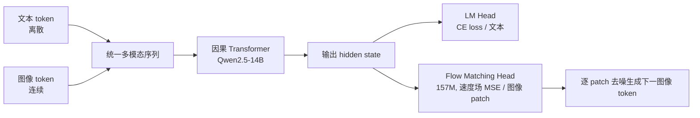

# NextStep-1: Toward Autoregressive Image Generation with Continuous Tokens at Scale

**会议**: ICLR 2026  
**OpenReview**: [https://openreview.net/forum?id=Ndnwg9oOQO](https://openreview.net/forum?id=Ndnwg9oOQO)  
**代码**: [https://github.com/stepfun-ai/NextStep-1](https://github.com/stepfun-ai/NextStep-1)  
**领域**: 图像生成 / 自回归生成 / 多模态  
**关键词**: 自回归图像生成, 连续 token, Flow Matching, 图像 tokenizer, 文生图  

## 一句话总结
用一个 14B 因果 Transformer 直接对**连续图像 token**做 next-token prediction，配一个仅 157M 的轻量 flow matching 头当采样器，在不依赖重型扩散主干、也不做向量量化的前提下，把纯自回归文生图的质量做到了与顶级扩散模型同档。

## 研究背景与动机
- **领域现状**：高保真图像生成长期由扩散模型主导（SD3、FLUX 等），但主流架构是"解耦"的——靠独立预训练的 T5/CLIP 文本编码器把语义喂进 MMDiT，再用 cross-attention 融合，这是一个非端到端、上下文窗口固定的设计。受 LLM "next-token prediction" 启发，统一多模态生成成为有吸引力的替代路线。
- **现有痛点**：自回归路线分两派且各有硬伤。**离散 AR**（LlamaGen、Emu3、Janus）靠向量量化（VQ）把图像离散化，量化引入信息瓶颈（重建伪影）和 exposure bias，为减损失只能用低压缩率，导致 token 序列过长、训练成本飙升；**混合架构**（Transfusion、BAGEL）把噪声输入和扩散损失塞进 LLM 的双向注意力里，需要同时处理噪声 latent 和干净条件信号，数据翻倍、序列变长，丢掉了稀疏自回归本该有的效率优势。
- **核心矛盾**：直接对**连续** latent 做自回归（MAR、Fluid）能绕开量化，但与 SOTA 扩散模型之间始终存在明显的质量与一致性差距——没人证明纯 AR 连续 token 能同时拿到扩散级画质和 LLM 级简洁可扩展性。
- **本文目标**：造一个最小化架构的连续 token 自回归文生图模型，质量对标顶级扩散模型，且保留标准 LLM 的简洁与可扩展性。
- **核心 idea**：**闭合差距的钥匙在图像表示本身**。论文设计了一个专门追求"良好分散 + 归一化"的连续 latent 空间的图像 tokenizer，让高维连续 latent 的自回归训练稳定下来；一旦表示对了，一个朴素因果 Transformer + 轻量 flow matching 头就足以逼平扩散模型。

## 方法详解

### 整体框架
NextStep-1 把图像 tokenizer 编出的**连续图像 token** 和离散文本 token 拼成一条统一序列 $x=\{x_0,...,x_n\}$，用因果 Transformer 做标准自回归 $p(x)=\prod_i p(x_i\mid x_{<i})$。文本 token 走 LM 头算交叉熵采样，图像 token 走 patch-wise flow matching 头算速度场回归来采样，端到端联合优化 $L_{total}=\lambda_{text}L_{text}+\lambda_{visual}L_{visual}$（权重 CE:MSE = 0.01:1）。

### 关键设计

**1. 连续 token 自回归 + patch-wise flow matching 头：把扩散降级成轻量采样器。** 区别于"AR 出语义 embedding、再让重型扩散一次性去噪整张图"的主流做法，NextStep-1 是**逐 patch** 自回归：Transformer 对每个 patch 输出 hidden state 作为条件，flow matching 头只负责把一个噪声样本沿速度场推到该 patch 的干净 latent，损失是预测速度与目标速度的 MSE。这个头只有 157M（12 层、1536 隐维 MLP），却撑起了与扩散同级的画质。论文据此主张本框架属于**纯 next-token prediction**，而非"被 Transformer 编排的扩散模型"。

**2. 图像 tokenizer 的"分散+归一化"latent 空间：高维连续 latent 能稳定训练的根。** tokenizer 从 FLUX VAE 微调而来（只用重建和感知损失），把图像编成 16 通道、8× 下采样的 latent；再做 token-wise normalization 把每个通道标准化到零均值单位方差。为让 latent 分布更均匀、tokenizer 更鲁棒，借鉴 σ-VAE 对归一化 latent 注入随机扰动 $\tilde z = \text{Norm}(z) + \alpha\cdot\varepsilon$，其中 $\alpha\sim U[0,\gamma]$、$\varepsilon\sim N(0,I)$，$\gamma$ 控制最大噪声强度。最后用 2×2 的 space-to-depth（pixel-shuffle）把 latent 压成更紧凑序列——256×256 图像变成 16×16 的 64 通道 token，展平为 256 个 token 喂给 Transformer。

**3. Token-wise 归一化治 CFG 失稳：找对了"灰块伪影"的真因。** VAE-based 自回归模型在大 CFG 下常出灰块伪影，前人归咎于 1D 位置编码的不连续，本文分析出真因是**高引导尺度放大了 token 级分布漂移**。CFG 把预测插值为 $\tilde v(x|y)=(1-w)v_\theta(x|\varnothing)+w\,v_\theta(x|y)$；扩散里 latent 被归一化所以稳定，但 token 级 AR 中对整张 latent 的全局归一化并不能保证逐 token 统计一致，条件与无条件预测的微小差异被大 $w$ 放大，后段 token 的均值方差显著漂移→出伪影。tokenizer 的 token-wise 归一化强制逐 token 统计稳定，使大 CFG 也不崩。

**4. 正则化 latent 空间的反直觉法则：generation loss 越大反而画质越好。** 训练 tokenizer 时增大噪声强度 $\gamma$ 会推高下游生成损失，却**反而提升**最终生成图像质量——说明一味追求低重建/生成损失会得到"过拟合"的脆弱 latent 空间，适度正则化（注噪声）换来的可生成性才是关键。配合三阶段课程预训练（256² → 动态分辨率 512² → 高质量退火）和 SFT + DPO（含 Self-CoT 数据）后训练对齐人类偏好。

## 实验关键数据

### 主实验表格（文生图，prompt 对齐）

| 方法 | 类型 | GenEval↑ | GenAI-Bench(Adv)↑ | DPG-Bench↑ |
|---|---|---|---|---|
| FLUX.1-dev | 扩散 | 0.66 | 0.65 | 83.79 |
| SD3.5 Large | 扩散 | 0.71 | 0.66 | 83.38 |
| BAGEL | 混合 | 0.82/0.88† | 0.69/0.75† | 85.07 |
| Qwen-Image | 扩散 | 0.87 | - | 88.32 |
| Emu3 | 离散 AR | 0.54/0.65* | 0.60 | 80.60 |
| Janus-Pro-7B | 离散 AR | 0.80 | 0.66 | 84.19 |
| Infinity | 离散 AR | 0.79 | - | 86.60 |
| **NextStep-1** | **连续 AR** | **0.63/0.73†** | **0.67/0.74†** | **85.28** |

（†=Self-CoT，*=prompt 改写）NextStep-1 在 AR 阵营里达到 SOTA 级，且与多个强扩散模型同档；图像编辑上 NextStep-1-Edit 在 GEdit-Bench-EN 拿 6.58、ImgEdit-Bench 3.71，与先进扩散编辑模型有竞争力。

### 消融实验表格（flow matching 头规模）

| 配置 | 层/隐维/参数 | GenEval | GenAI-Bench | DPG-Bench |
|---|---|---|---|---|
| Baseline | - | 0.59 | 0.77 | 85.15 |
| w/ FM Head Small | 6 / 1024 / 40M | 0.55 | 0.76 | 83.46 |
| w/ FM Head Base | 12 / 1536 / 157M | 0.55 | 0.75 | 84.68 |
| w/ FM Head Large | 24 / 2048 / 528M | 0.56 | 0.77 | 85.50 |

### 关键发现
- **是 Transformer 主干而非 FM 头在做生成**：把 FM 头从 40M 加到 528M（13×），三档结果几乎一样，说明核心生成建模 $p(x_i\mid x_{<i})$ 由 Transformer 完成，FM 头只是个把上下文预测翻成连续 token 的轻量采样器（角色等同 LLM 的 LM 头）。
- **token-wise 归一化是大 CFG 稳定的开关**：无归一化时 CFG=3.0 后段 token 均值方差显著漂移→伪影；有归一化时各 CFG 设置下输出 latent 统计都稳定。
- **tokenizer 是图像生成的关键**：latent 空间的正则化程度（注噪 $\gamma$）与最终画质正相关，哪怕它推高了生成损失。

## 亮点与洞察
- **架构极简却打平扩散**：一个标准 decoder-only LLM（Qwen2.5-14B 初始化）+ 157M MLP 头 + 1D RoPE，没有 cross-attention、没有独立文本编码器、没有 VQ，证明"把表示做对"比"堆复杂架构"更重要。
- **"FM 头不敏感"是干净的解耦证据**：用控制实验把"谁在生成"这个常被混为一谈的问题钉死在 Transformer 上，为连续 AR 的可扩展性提供了清晰叙事——做大主干即可，头可以一直轻量。
- **把 CFG 失稳从玄学拉回统计**：用逐 token 均值/方差漂移曲线直接定位伪影成因，给出 token-wise 归一化这个一行级修法，可迁移到其他连续 token AR 模型。

## 局限与展望
- **GenEval 基础分相对偏低**：未用 Self-CoT 时 GenEval 仅 0.63，低于 Qwen-Image(0.87)、BAGEL(0.82) 等，强依赖 Self-CoT/改写才能拉到 0.73，说明朴素 prompt 对齐仍有差距。
- **训练成本高**：14B 主干 + 万亿级 token（Stage1 约 1.23T）三阶段预训练 + DPO，复现门槛高，论文未充分讨论小模型版的可行性。
- **tokenizer 仍是天花板**：画质上限被 FLUX VAE 派生 tokenizer 的重建能力约束，注噪正则的最优 $\gamma$ 靠经验调，缺乏理论刻画"可生成性 vs 重建保真"的最优折中。

## 相关工作与启发
- **离散 AR（LlamaGen/Emu3/Janus）**：本文绕开其 VQ 量化瓶颈与长序列问题，走连续 token。
- **连续 AR（MAR/Fluid）**：沿用 patch-wise diffusion/flow 头的思路，但通过 tokenizer 设计把质量补到扩散级。
- **混合架构（Transfusion/BAGEL）**：本文用纯 NTP 替代其双向注意力 + 噪声/干净双份输入，换回 AR 的效率。
- 启发：对"LLM 范式做图像生成"的研究者，本文给出一个明确信号——投入应放在 tokenizer 的 latent 空间正则化与逐 token 统计稳定上，而非加大去噪头或改 RoPE。

## 评分
- **新颖性**: ⭐⭐⭐⭐ 不是全新组件，但"tokenizer 是闭合 AR-扩散差距的钥匙"这一论断 + token-wise 归一化治 CFG + FM 头解耦实验，组合出清晰且有说服力的新认识。
- **实验充分度**: ⭐⭐⭐⭐ 多 benchmark（GenEval/GenAI/DPG/编辑）对比 + FM 头/归一化/注噪三组针对性消融，论证扎实；GenEval 基础分稍弱是诚实呈现。
- **写作质量**: ⭐⭐⭐⭐ Discussion 部分把"谁在生成""tokenizer 为何关键"讲得很透，图表支撑到位。
- **价值**: ⭐⭐⭐⭐⭐ 开源 14B 模型 + 代码，给纯自回归连续 token 文生图树立了新的 SOTA 与可复现 baseline，对统一多模态生成方向有实际推动。

<!-- RELATED:START -->

## 相关论文

- [\[ICLR 2026\] Hyperspherical Latents Improve Continuous-Token Autoregressive Generation](hyperspherical_latents_improve_continuous-token_autoregressive_generation.md)
- [\[ICLR 2026\] MADFormer: Mixed Autoregressive and Diffusion Transformers for Continuous Image Generation](textitmadformer_mixed_autoregressive_and_diffusion_transformers_for_continuous_i.md)
- [\[ICLR 2026\] Group Critical-token Policy Optimization for Autoregressive Image Generation](group_critical-token_policy_optimization_for_autoregressive_image_generation.md)
- [\[ICLR 2026\] Autoregressive Image Generation with Randomized Parallel Decoding](autoregressive_image_generation_with_randomized_parallel_decoding.md)
- [\[ICLR 2026\] SSG: Scaled Spatial Guidance for Multi-Scale Visual Autoregressive Generation](ssg_scaled_spatial_guidance_for_multi-scale_visual_autoregressive_generation.md)

<!-- RELATED:END -->
