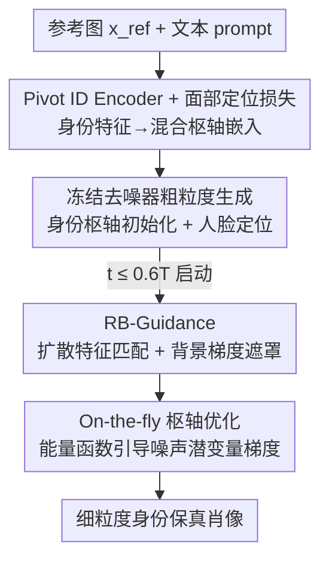

# OmniPortrait: Fine-Grained Personalized Portrait Synthesis via Pivotal Optimization

**会议**: ICLR 2026  
**OpenReview**: [https://openreview.net/forum?id=DVmR3Ij0ap](https://openreview.net/forum?id=DVmR3Ij0ap)  
**代码**: 待确认  
**领域**: 扩散模型 / 图像生成  
**关键词**: 人像定制, 身份保真, 枢轴优化, 测试时引导, 扩散特征匹配

## 一句话总结
OmniPortrait 把"身份定制"拆成粗到细两步：先用一个冻结去噪器、只训编码器的 Pivot ID Encoder 给出粗粒度身份"枢轴"，再在推理时用无需训练的 RB-Guidance 对扩散中间特征做参考图匹配并梯度优化，从而在不损害文本可编辑性的前提下精细还原参考人脸的细节，身份相似度 SIM 与文本对齐 CLIP-T 同时刷到新 SOTA。

## 研究背景与动机
**领域现状**：从文本到图像的扩散模型出发，个性化人像生成主要走两条路——一是 DreamBooth / Textual Inversion 这类测试时微调，二是给扩散模型条件空间额外接一个身份编码器（IP-Adapter、InstantID、PhotoMaker 等），把参考人脸特征注入去噪网络。后者因为单张参考图即可、无需逐人训练，已成为主流。

**现有痛点**：这些"单流（single-stream）"条件注入方法擅长抓到身份的粗略概念（性别、脸型、大致五官），却保不住细粒度面部细节——比如美人痣、特定纹理。细节一丢，生成图就像被过度磨皮甚至像假照片，实用性大打折扣。另一条路（如 FastComposer 用全量微调强行"贴脸"）虽然脸像了，却破坏了预训练扩散模型的丰富先验，导致场景构图异常、文本编辑能力骤降。

**核心矛盾**：身份保真与文本可编辑性之间存在 trade-off。微调去噪器能提保真但毁先验、伤编辑；只接编码器能保编辑但抓不住细节。论文用 FastComposer 的延迟条件参数 $\alpha$ 做实验直观展示了这条 trade-off 曲线：调大 $\alpha$ 脸越像、文本越失控。

**本文目标**：在**不动去噪器参数**的前提下，既要粗粒度身份一致，又要细粒度面部细节，还要保住文本对齐。

**切入角度**：作者借鉴 GAN 反演里的 PTI（Pivotal Tuning Inversion）思想——先找一个"枢轴（pivot）"作为稳定初始化，再围绕它做局部优化。映射到扩散身份定制上，就是先得到一个粗略但可靠的身份初始化，再在其周围做精细的测试时优化。

**核心 idea**：用"枢轴优化（pivotal optimization）"实现**双流、粗到细**的身份引导：第一流是冻结去噪器、只训 Pivot ID Encoder 给出身份枢轴；第二流是推理时的 RB-Guidance，在扩散中间特征空间对参考人脸做稠密匹配并反向传播梯度，精修细节。

## 方法详解

### 整体框架
OmniPortrait 建立在隐空间扩散模型（SD / SDXL）之上，并把条件注入扩展成基于能量的扩散引导。给定一张参考人脸 $x_{ref}$ 和目标文本 $P_t$，目标是生成符合文本场景、同时保留参考人脸细节的肖像。整条管线分两步走：**训练阶段**只训练一个 Pivot ID Encoder 和一个线性投影层（去噪器全程冻结），用面部定位损失把身份嵌入约束到脸部区域，得到既能粗粒度引导、又能在推理时准确定位人脸的"身份枢轴"；**推理阶段**先用这个冻结编码器把参考身份注入去噪器得到粗粒度肖像，再从扩散过程的中后段（$t \le 0.6T$）启动 RB-Guidance，对扩散中间特征做参考图匹配，把匹配相似度写成能量函数并对噪声潜变量求梯度，逐步把细粒度面部细节"拉"向参考脸。

### 关键设计

**1. Pivot ID Encoder + 面部定位损失：冻结去噪器、建立可靠的身份枢轴**

这一步针对"微调去噪器伤先验、伤编辑"的痛点。作者不碰基模型，只用一个视觉编码器（OpenCLIP-ViT-L/14）从参考图提取特征 $e_{ref}$，再把它和文本嵌入 $e_{txt}$ 拼接后过一层线性投影做特征对齐，得到混合枢轴嵌入 $e_{mix}$——本质是把参考身份"绑"到一个最能代表该概念的文本 token（如 woman / man）上。去噪器全程冻结，从而完整保住预训练模型的文本对齐能力。

光用扩散损失训练会有个问题：$e_{mix}$ 的交叉注意力会扩散到整个人体，而非聚焦脸部，导致后续没法准确定位人脸区域。为此作者加了**面部定位损失**：取 $e_{mix}$ 在时刻 $t$ 的交叉注意力图 $A_t(m) \in [0,1]^{16\times16}$，监督它逼近缩放后的人脸分割掩码 $M$。整体目标为

$$\mathcal{L} = \mathcal{L}_{diff} + \eta \mathcal{L}_{loc},\quad \mathcal{L}_{loc} = \frac{1}{hw}\sum_{i,j}\big(A_t(i,j)-M(i,j)\big)^2,$$

其中 $\eta = 2\times10^{-3}$。这一约束既提升了身份相似度，又让推理时能从交叉注意力图直接抠出生成图的人脸掩码——为后续 RB-Guidance 的区域化优化提供了入口。值得注意的是，单凭这个编码器只能给出**粗粒度**一致性，它的价值在于提供一个稳定初始化，即"身份枢轴"。

**2. RB-Guidance：测试时扩散特征匹配 + 背景梯度遮罩，免训练补回细节**

这一步补回单流方法丢掉的细粒度细节，且**完全不训练**。它做三件事。

其一是**区域掩码提取**：直接对交叉注意力图 $A^c_t(m)$ 取阈值会得到粗糙掩码，作者引入富含结构信息的自注意力图 $A_s(m)$，做一个迭代精炼 $\hat{A}^c_t(m) = A_s(m)\cdot \text{norm}(\cdots\text{norm}(A^c_t(m))^\alpha\cdots)^\alpha$，迭代 $\gamma=3$ 次、$\alpha=2$，再以阈值 $\beta=0.5$ 得到生成图人脸掩码 $M_{gen}$。其二是**扩散特征对应**：利用扩散中间特征具有强局部对应性这一性质（DIFT），对参考图加 $t_0=671$ 步噪声得到特征 $D^{ref}_{t_0}$，与生成图特征 $D^{gen}_t$ 在掩码内做最近邻匹配 $p_{gen} = \arg\min_{p\in M_{ref}} d(D^{ref}_{t_0}[p_{ref}], D^{gen}_t[p])$，再用余弦相似度累加成匹配分 $S_{dift} = \sum_{p_{ref}} \tfrac{\cos(D^{gen}_t[p_{gen}], D^{ref}_{t_0}[p_{ref}])+1}{2}$。其三是**背景梯度遮罩（BGM）**：若直接对 $S_{dift}$ 求梯度，前景背景会一起被改，导致图像模糊；作者用 $M_{gen}$ 把背景梯度滤掉 $\hat{S}_{dift} = (\cdots)\odot M_{gen}$，只让脸部区域被优化。这三件事合起来，让"参考脸—生成脸"在特征空间逐点对齐，把美人痣这类细节真正搬过去。

**3. On-the-fly 枢轴优化：用能量函数控制优化时机与强度**

直接从头开始做特征匹配会翻车——去噪早期生成图只有粗略概念，参考图和生成图建立不了精确匹配，RB-Guidance 的梯度会发散。作者因此把匹配分包成一个能量函数

$$\mathcal{E} = \frac{p}{1 + \hat{S}_{dift}(z_t, x_{ref}, M_{gen}, M_{ref})},$$

并只在 $t \le \hat{t} = uT$（取 $u=0.6$）时把能量梯度 $\nabla_{z_t}\mathcal{E}$ 叠加到 classifier-free guidance 的预测噪声上：

$$\hat{\epsilon}_y(z_t) = \begin{cases} \epsilon_\theta(z_t,t,\varnothing)+w(\epsilon_\theta(z_t,t,y)-\epsilon_\theta(z_t,t,\varnothing)), & t > \hat{t}\\ \cdots + \nabla_{z_t}\mathcal{E}, & t \le \hat{t}\end{cases}$$

其中 $p$ 控制优化强度（推理设 8.5）。这个"枢轴优化"之所以叫枢轴，是因为它围绕第一步编码器给的身份枢轴做局部细化：早期不动，等结构稳定后再上引导，$u=0.6$ 是引导有效性与稳定性的最佳折中（早了发散、晚了无效）。也正因为去噪器没被改、引导是即插即用的，OmniPortrait 能很自然地兼容其它插件并扩展到多身份定制场景。

### 损失函数 / 训练策略
训练只优化 Pivot ID Encoder 和线性投影层，用 AdamW、学习率 $2\times10^{-5}$；SD 版（Realistic Vision）训 80k 步，SDXL 版（RealVisXL）过滤到 1024 分辨率训 60k 步，均用 4×A100-80GB。为支持 classifier-free guidance，文本与 ID 条件各以 10% 概率随机丢弃。推理时 $w=7.5$、$T=1000$ 取 50 步采样，RB-Guidance 强度 $p=8.5$。主实验用 SDXL。

## 实验关键数据

### 主实验
评测从 CelebA-HQ / FFHQ 采 50 张参考图、每个身份配 30 条 prompt，覆盖文本可编辑性（BLIP、CLIP-T）、身份保真（CLIP-I、SIM，SIM 用 FaceNet 嵌入算余弦）、图像质量（IQA、FID）三类指标。

| 方法 | 即插即用 | CLIP-T↑ | CLIP-I↑ | SIM↑ | IQA↑ | FID↓ |
|------|:--:|:--:|:--:|:--:|:--:|:--:|
| DreamBooth | ✗ | 23.32 | 66.45 | 60.07 | 85.88 | 219.40 |
| Textual Inversion | ✗ | 23.89 | 58.32 | 58.32 | 71.73 | 235.57 |
| FastComposer | ✗ | 22.98 | 69.83 | 64.97 | 82.04 | 223.94 |
| PhotoMaker | ✗ | 23.97 | 67.64 | 62.68 | 70.51 | 236.93 |
| InstantID | ✓ | 22.26 | 73.03 | 68.35 | 84.17 | 221.62 |
| IP-Adapter | ✓ | 23.93 | 68.23 | 64.19 | 88.15 | 211.15 |
| **OmniPortrait** | ✓ | **24.25** | **73.08** | **69.13** | 86.80 | 213.48 |

关键看点：身份保真（CLIP-I 73.08 / SIM 69.13）和文本对齐（CLIP-T 24.25）**同时**做到最优。对比 InstantID/FastComposer 这类"贴脸但失控"的方法（它们结果像参考图的复制粘贴、文本对齐差），OmniPortrait 不必牺牲一头去换另一头——这正是枢轴优化解 trade-off 的直接证据。在"身份保真 vs 提示一致性"散点图上，基线被钉在权衡曲线上，OmniPortrait 落在右上角。

### 消融实验
在 4 个组件上逐一消融（SD 版本）：

| 配置 | CLIP-T↑ | CLIP-I↑ | SIM↑ | FID↓ | 说明 |
|------|:--:|:--:|:--:|:--:|------|
| w/o $\mathcal{L}_{loc}$ | 22.11 | 46.54 | 35.01 | 476.22 | ID 注入区域错位，脸外区域被破坏 |
| w/o PIE | 23.19 | 21.83 | 14.15 | 383.17 | 无枢轴初始化，梯度乱传，身份几乎没增强 |
| w/o BGM | 19.34 | 37.30 | 33.42 | 483.93 | 梯度泄漏到背景，图像模糊、各项崩塌 |
| w/o RB-Guidance | 24.88 | 66.10 | 63.87 | 210.45 | 仅靠粗枢轴，身份相似度与细节明显不足 |
| **Full** | 24.25 | **73.08** | **69.13** | 213.48 | 完整模型 |

### 关键发现
- **PIE（身份枢轴）是地基**：去掉后 SIM 从 69.13 暴跌到 14.15、FID 飙到 383，因为没有可靠初始化，RB-Guidance 的梯度会传到非枢轴区域，根本无法定位与匹配。
- **BGM 决定成像质量**：去掉背景梯度遮罩后所有指标全面崩塌（FID 483、CLIP-T 仅 19.34），印证"梯度泄漏到背景导致模糊"的分析。
- **RB-Guidance 专管细节**：去掉它文本对齐反而略升（CLIP-T 24.88）但身份保真明显下降（SIM 63.87、CLIP-I 66.10），说明它是把细粒度细节补回来的关键，且代价仅是极小的文本对齐让步。
- **起始时机 $u$ 敏感**：$u$ 太大（早启动）梯度发散，太小（晚启动）引导失效，$u=0.6$ 最优。
- **数据集贡献**：作者构建并发布 OmniPortrait-1M（取自 Pexels / COYO-700M / LAION-2B，按分辨率与美学分过滤，用 YOLOv7-Face 检测人脸、YOLOX 出人体框、BLIP-2 生成 caption、LLM 抽人称名词），含百万级带细致标注的数据对，填补了现有多模态人脸数据缺乏个体位置与面部区域精标的空白。

## 亮点与洞察
- **把 PTI 的"枢轴"思想迁到扩散身份定制**：先稳一个粗初始化、再围绕它做局部测试时优化，巧妙绕开"微调去噪器伤先验"和"单流编码器抓不住细节"两难——这个解耦视角可迁移到其它需要"既保身份又保可控"的定制生成任务。
- **RB-Guidance 全程免训练**：靠扩散中间特征的局部对应性（DIFT）做稠密匹配 + 能量梯度引导，即插即用、可叠加在多种基模型与插件上，工程落地友好。
- **面部定位损失一举两得**：既提升身份相似度，又顺手产出推理期可用的人脸掩码，喂给后续区域化优化——一个损失打通"训练约束"和"推理定位"两个环节，是很值得借鉴的设计。
- **背景梯度遮罩防泄漏**：用掩码把梯度限制在脸部，避免测试时优化把背景一起改糊——这是测试时引导类方法普遍会踩的坑，本文给了简洁解法。

## 局限与展望
- 方法以"单人脸"为前提构建数据（检测到无脸或多脸的图被丢弃），多身份虽能自然扩展，但更复杂的多人交互、遮挡场景下的稳健性论文未充分量化。
- RB-Guidance 是逐步的测试时优化，叠加在采样中后段（$t\le0.6T$）会增加推理开销，论文未报告与基线的推理时延对比，实时性存疑。
- 关键超参（$t_0=671$、$u=0.6$、$p=8.5$、$\gamma=3$ 等）较多且靠经验设定，跨基模型 / 跨域的可迁移性需要进一步验证。
- 身份保真在 SDXL 上 SIM 69.13 仍非"逐像素复刻"，对极端细节（罕见纹身、特定瑕疵）的还原边界论文未深究。

## 相关工作与启发
- **vs InstantID**：InstantID 用专门的人脸编码器 + 身份网络做单流注入，身份保真高（SIM 68.35）但文本对齐偏弱（CLIP-T 22.26）；本文用"冻结去噪器 + 枢轴 + 测试时特征匹配"的双流粗到细方案，在不牺牲文本对齐的前提下把身份再推高，且即插即用。
- **vs FastComposer**：FastComposer 靠全量微调强行保脸，破坏先验、编辑性差（其 $\alpha$ 参数即 trade-off 旋钮）；本文不动去噪器，从根上避免先验损坏。
- **vs IP-Adapter / PhotoMaker**：同为编码器路线、即插即用，但它们在保真与编辑间难两全；本文用 RB-Guidance 在推理时补回细粒度细节，打破单流方法的细节天花板。
- **vs MasaCtrl / ConsiStory（训练自由一致性生成）**：它们靠自注意力 KV 替换或 DIFT 特征注入维持一致性，仍难保细粒度人脸细节；本文把匹配显式写成能量函数并对潜变量求梯度，针对人脸细节做定向优化。

## 评分
- 新颖性: ⭐⭐⭐⭐⭐ 把 PTI 枢轴思想引入扩散身份定制，"冻结去噪器 + 测试时特征匹配"的双流粗到细范式有清晰原创性。
- 实验充分度: ⭐⭐⭐⭐ 主对比、散点、用户研究、四组件消融齐全；但缺推理时延与多人复杂场景的定量评估。
- 写作质量: ⭐⭐⭐⭐ 动机—方法—消融逻辑顺畅，公式与图示到位；部分超参取值缺乏更系统的敏感性分析。
- 价值: ⭐⭐⭐⭐⭐ 即插即用、免训练补细节，并开源百万级标注数据集 OmniPortrait-1M，对身份定制生成的落地与后续研究都有实用价值。

<!-- RELATED:START -->

## 相关论文

- [\[CVPR 2026\] ExpPortrait: Expressive Portrait Generation via Personalized Representation](../../CVPR2026/image_generation/expportrait_expressive_portrait_generation_via_personalized_representation.md)
- [\[CVPR 2026\] CogniEdit: Dense Gradient Flow Optimization for Fine-Grained Image Editing](../../CVPR2026/image_generation/cogniedit_dense_gradient_flow_optimization_for_fine-grained_image_editing.md)
- [\[ICLR 2026\] LaTo: Landmark-tokenized Diffusion Transformer for Fine-grained Human Face Editing](lato_landmark-tokenized_diffusion_transformer_for_fine-grained_human_face_editin.md)
- [\[CVPR 2026\] Towards Fine-Grained Attribution: Instance-Aware Preference Optimization for Aligning Diffusion Models](../../CVPR2026/image_generation/towards_fine-grained_attribution_instance-aware_preference_optimization_for_alig.md)
- [\[ICLR 2026\] CoCoDiff: Correspondence-Consistent Diffusion Model for Fine-grained Style Transfer](cocodiff_correspondence-consistent_diffusion_model_for_fine-grained_style_transf.md)

<!-- RELATED:END -->
