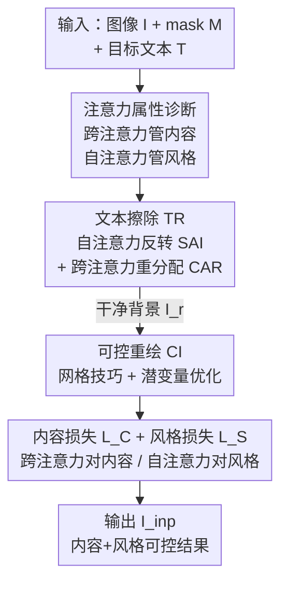

# OmniText: A Training-Free Generalist for Controllable Text-Image Manipulation

**会议**: ICLR 2026  
**OpenReview**: [https://openreview.net/forum?id=zF7GyVXVw6](https://openreview.net/forum?id=zF7GyVXVw6)  
**论文**: [Project Page](https://kaist-viclab.github.io/omnitext-site/)  
**代码**: 待确认（项目页见上）  
**领域**: 扩散模型 / 图像编辑 / 可控文本渲染  
**关键词**: 文本图像操作、训练免费、注意力操控、文本擦除、风格可控重绘

## 一句话总结
OmniText 不训练任何参数，仅通过操控现成文本扩散模型 TextDiff-2 的自注意力与跨注意力，就把"文本擦除 + 内容可控 + 风格可控"统一进一个通才框架，覆盖擦除/编辑/插入/重缩放/重定位/风格迁移六类文本图像操作（TIM），在多项指标上超过同类文本合成方法、逼近各任务的专用模型。

## 研究背景与动机
**领域现状**：基于扩散的文本合成（AnyText、TextDiff-2、DreamText 等）通过 inpainting 把文字"填"进图像的指定 mask 里，已经能生成与背景协调的文字。

**现有痛点**：这些方法把"文本图像操作"窄化成了"插入/编辑"两件事，存在三个硬伤——(i) 无法擦除文字：给一个空文本输入，模型不但不擦，反而会幻觉出新字符；(ii) 风格不可控：渲染出的文字字体/颜色/倾斜完全靠模型从周围文字"蹭"，没有显式控制旋钮；(iii) 字符重复：编辑区域偶尔会冒出多余的重复字母。这导致重缩放、重定位、用单独风格参考做风格迁移这些任务根本无从谈起。

**核心矛盾**：现有做法把每个 TIM 子任务都当成"再 fine-tune 一个专用网络"来解，既没有通才框架，也缺乏对文字内容与风格的细粒度解耦控制。而通才能力（比如海报设计）恰恰需要在同一套系统里既能擦、又能改内容、还能换风格。

**本文目标**：在不训练、不微调的前提下，把擦除、内容控制、风格控制三件事拆开、各给一个可插拔的控制模块，从而用一个 backbone 支撑全部 TIM 任务。

**切入角度**：作者去剖析 TextDiff-2 在采样过程中的注意力图，发现注意力本身就携带了控制旋钮——跨注意力（cross-attention）的字符 token 会精确指向对应空间区域（控内容），自注意力（self-attention）会让某字符区域去"看"附近相似文字（控风格/导致复制），而对周围文字的强自注意力正是擦除失败、幻觉文字的根源。

**核心 idea**：既然注意力天然编码了内容与风格，那就用"反转自注意力 + 重分配跨注意力"来强行抑制文字生成实现擦除，再用"以注意力为奖励的潜变量优化"分别拉内容和风格，全程零训练。

## 方法详解

### 整体框架
OmniText 以 TextDiff-2 为冻结 backbone，输入一张图像 $I$、目标 mask $M$、目标文本 $T$，输出操作后的图像。整条管线分两段串行：先做**文本擦除（TR）**得到干净背景 $I_r$，再在 $I_r$ 上做**可控重绘（CI）**把目标文字以指定风格重新画回去。两段都不改网络权重，只在采样时操控注意力、或在早期采样步对潜变量做即时优化。所有 TIM 任务都是这两个模块的组合：擦除只用 TR；风格插入只用 CI；编辑/重定位/重缩放/风格编辑则 TR+CI 全用——靠开关组件就能切任务，这正是"通才"的来源。

整个方法的根基是 §3.1 的**注意力属性诊断**：跨注意力管内容、自注意力管风格、对周围文字的强自注意力导致擦除幻觉。后续每个模块都是这三条观察的直接产物。

### 关键设计

**1. 跨/自注意力的关键属性诊断：把"控制旋钮"从注意力里挖出来**

这一步针对的痛点是：现有方法把擦除、内容、风格都交给黑箱网络，没有抓手。作者在固定采样步（$t=751$、Decoder Block 2、Layer 0）逐层观察注意力概率图 $A_{l,t}=\mathrm{softmax}(QK^\top/\sqrt{d})$，得到三条可操作的结论。其一，在某些跨注意力层 $C_l$，每个字符 token $C^l_{j=e_{c_k}}$ 只对它对应的字符区域 $m_{c_k}$ 高响应——说明**内容可通过跨注意力控制**。其二，在自注意力层 $S_l$，某字符区域内的位置 $S^l_{i\in m_{c_k}}$ 会去关注邻近的文字或相似字符——这既是风格迁移的来源，也是字符复制的来源，说明**风格可通过自注意力控制**。其三，即使给空 prompt（$T=$""），自注意力 $S^l_{i\in m}$ 仍会关注周围文字，从而幻觉出文字；而提高描述结束符 token 的跨注意力 $C^l_{j=E_d}$ 能抑制幻觉、提高起始符 token $C^l_{j=S_d}$ 则促进背景重建。后面三个设计正是把这三条观察分别"做成"了三个控制模块。

**2. 文本擦除：自注意力反转（SAI）+ 跨注意力重分配（CAR）**

针对"给空文本也会幻觉文字、擦不干净"的痛点。SAI 直接把 mask 内位置的自注意力值做最小↔最大的线性翻转：

$$S^l_{i,j} = \max_j(S^l_{i,j}) + \min_j(S^l_{i,j}) - S^l_{i,j}$$

这样原本对周围文字的高响应被压低、对背景的响应被抬高，迫使模型"看背景而非看文字"，从而抑制文字生成。但有时网络对周围文字的检测信号本身就弱，SAI 单独不够。于是用 CAR 做互补——把跨注意力概率图按位置/ token 强行设成分段函数：

$$C^l_{i,j} = \begin{cases} 1, & (i\in m \text{ 且 } j=E_d)\ \text{或}\ (i\notin m \text{ 且 } j=S_d)\\ 0, & \text{其他}\end{cases}$$

直观讲：非编辑区（$i\notin m$）锁到起始符 $S_d$ 去重建背景，编辑区（$i\in m$）锁到结束符 $E_d$ 去抑制文字——正好对应诊断里"$S_d$ 促重建、$E_d$ 抑文字"那条观察。SAI 负责"别看文字"，CAR 负责"主动重建并压制"，两者叠加才能在只擦最大文字这类更现实的设定下干净擦除。

**3. 可控重绘：网格技巧 + 潜变量即时优化**

擦完得到干净背景 $I_r$ 后，要把目标文字以参考风格重画回去。难点是现成的自注意力风格迁移方法对文字不适用。作者借鉴视频编辑里的 grid trick，把"待重绘潜变量 + 参考图潜变量"拼成一个网格结构 $G=[z_{I_r\cdot(1-M_{shr})}\ z_{I_{ref}}]$、配套网格 mask $[m_{shr}\ 0]$，让自注意力能跨格子去"抄"参考文字的风格。同时为避免目标文字（如 "FLASH"）比原文字（如 "POCKET"）短时直接复制造成字符重复，用字符宽度先验（"W" 比 "I" 宽）把 mask 收缩成 $M_{shr}/m_{shr}$。重绘过程写成 $I_{inp}=\mathrm{CI}_{\epsilon_\theta}(z_t,[z_{I_r\cdot(1-M_{shr})}\ z_{I_{ref}}],[m_{shr}\ 0],e_T)$，并在早期采样步用 Adam 对潜变量做即时优化 $z'_t\leftarrow\mathrm{Adam}(\nabla_{z_t}L(z_t))$。这一步是"把内容/风格旋钮真正拧动"的执行器，旋钮的具体形式由下一个设计的两个损失给出。

**4. 内容损失 $L_C$ 与风格损失 $L_S$：用注意力当奖励，分别拉内容与风格**

总损失 $L=\lambda_C L_C+\lambda_S L_S$。**内容损失**把"字符放对位置"建模成二分类：字符 $c_k$ 的跨注意力概率 $C^l_{j=c_k}$ 应在对应区域 $i\in m_{c_k}$ 高、其他区域低（per-character mask 由目标 mask 按字符等分得到）。由于正样本远少于负样本、类别不平衡，作者用 Focal Loss 而非普通 BCE：

$$L_C = \sum_{k=1}^{N}\mathrm{FL}(C^l_{i,j=c_k}, m_{c_k}),\quad \mathrm{FL}(p,l)=(1-(p\cdot l))^\gamma\cdot\big[-(l\log p+(1-l)\log(1-p))\big]$$

**风格损失**则把"风格一致"建模成分布匹配：用 KL 散度让目标 mask 内的自注意力图 $S^l_{i\in m}$ 对齐由参考 mask 归一化得到的 GT：

$$L_S = D_{KL}(GT, S^l_{i\in m}),\quad GT = m_{ref}\big/\textstyle\sum_{j=1}^{N}(m_{ref})_j$$

（$m_{ref}$ 双线性插值到自注意力图分辨率以对齐尺度。）$L_C$ 单独用会因只盯准确率而扭曲风格、$L_S$ 单独用会提风格但掉准确率，二者加权组合才能在内容准确与风格一致之间平衡——这也是消融里看到的趋势。

### 损失函数 / 训练策略
全程**零训练**：不更新 backbone 任何参数，只在推理时（1）采样阶段做 SAI/CAR 注意力操控，（2）早期采样步用 Adam 对潜变量 $z_t$ 做即时优化。文本编辑设定下取 $\lambda_C=5$、$\lambda_S=10$，并以输入图本身作为 CI 的风格参考。

## 实验关键数据

### 主实验
评测覆盖标准基准（文本擦除用 SCUT-EnsText、文本编辑用 ScenePair）与作者自建的 OmniText-Bench（150 套 mockup，覆盖五类任务并提供风格参考与 GT）。

文本擦除（SCUT-EnsText，"all text"设定）：

| 方法 | MS-SSIM↑ | PSNR↑ | MSE↓ | FID↓ |
|------|----------|-------|------|------|
| TextDiff-2（backbone） | 92.73 | 25.42 | 9.51 | 52.46 |
| AnyText | 92.11 | 23.38 | 9.70 | 69.55 |
| DreamText | 85.80 | 19.56 | 20.65 | 73.84 |
| **OmniText（本文）** | **95.71** | **29.52** | **3.44** | **39.06** |
| 专用 LaMa | 93.93 | 29.37 | 2.91 | 43.67 |
| 专用 ViTEraser | 96.55 | 34.12 | 1.14 | 28.35 |

OmniText 在所有通才方法里最强，并在 MS-SSIM/PSNR/FID 上反超通用 inpainting 专用模型 LaMa；与文本擦除专用 SOTA ViTEraser 仍有差距（专用模型作为上界）。

文本编辑（ScenePair）：

| 方法 | ACC(%)↑ | NED↑ | MSE↓ | MS-SSIM↑ | PSNR↑ | FID↓ |
|------|---------|------|------|----------|-------|------|
| TextDiff-2 | 76.41 | 0.944 | 6.49 | 35.56 | 13.62 | 29.86 |
| UDiffText | 78.36 | 0.954 | 7.55 | 29.51 | 12.58 | 32.87 |
| **OmniText（本文）** | **78.44** | 0.951 | **4.79** | **40.11** | **14.85** | 31.69 |
| 专用 TextCtrl | 78.98 | 0.917 | 4.58 | 37.93 | 14.92 | 31.95 |

OmniText 在通才里渲染准确率最高、风格保真度除 FID 外全面最佳，并在 NED/MS-SSIM/FID 上超过专用 TextCtrl（FID 作者指出因其基于自然图特征训练，对文字不太可靠）。

### 消融实验

文本擦除组件（SCUT-EnsText）：

| 配置 | MS-SSIM↑(all/largest) | PSNR↑(all/largest) | FID↓(all/largest) |
|------|------|------|------|
| TextDiff-2 | 92.73 / 96.27 | 25.42 / 28.52 | 52.46 / 21.64 |
| + SAI | 95.56 / 97.58 | 30.02 / 33.12 | 37.31 / 16.70 |
| + SAI + CAR | 95.71 / 98.21 | 29.52 / 33.90 | 39.06 / 15.33 |

可控重绘组件（ScenePair）：

| 配置 | ACC↑ | NED↑ | MSE↓ | MS-SSIM↑ | PSNR↑ | FID↓ |
|------|------|------|------|----------|-------|------|
| TextDiff-2 | 76.41 | 0.944 | 6.49 | 35.56 | 13.62 | 29.86 |
| + $L_C$ | 88.52 | 0.970 | 8.75 | 29.90 | 12.01 | 38.85 |
| + G + $L_S$ | 78.28 | 0.949 | 4.78 | 40.19 | 14.86 | 31.64 |
| + $L_C$ + G + $L_S$ | 78.44 | 0.951 | 4.79 | 40.11 | 14.85 | 31.69 |

### 关键发现
- **SAI 是擦除主力，CAR 负责现实场景**：在"all text"设定下 SAI 单独就把 PSNR 从 25.42 拉到 30.02；CAR 在"all text"下甚至会因引入轻微色偏略降 PSNR/FID，但在更现实的"largest text"（只擦最大文字）设定下 SAI 不够、必须靠 CAR 才能选择性擦除，largest 设定的 FID 从 16.70 进一步降到 15.33。
- **内容损失与风格损失天然冲突，需联合**：单加 $L_C$ 把 ACC 从 76.41 飙到 88.52，但 MS-SSIM 反而从 35.56 掉到 29.90（风格被扭曲）；单加 $G+L_S$ 把风格 MS-SSIM 提到 40.19 但 ACC 只 78.28。两者组合才在准确率与风格间取得平衡。作者强调因目标是风格一致的渲染，$L_C$ 不宜过重。
- **风格控制能迁移到别的 backbone**：把 grid trick + 自注意力调制接到 UDiffText 上（UDiffText + Mod），在平面、简单朝向场景下也能改善字体/颜色迁移，验证了方法的通用性。

## 亮点与洞察
- **零训练却做成通才**：不碰任何权重，仅靠"注意力诊断 → 反转/重分配/损失优化"就把六类 TIM 任务统一进一个框架，这是把"注意力即控制旋钮"这一观察用到极致的范例。
- **自注意力反转这一招很巧**：擦除文字的常规思路是再训一个 erasing 网络，作者却发现"幻觉文字"的根因是自注意力盯着周围文字，于是直接把注意力值最小↔最大翻转，逼模型看背景——一个无参数操作解决了 inpainting 模型擦不掉字的老问题。
- **把内容/风格分别绑定到跨/自注意力**，并各配一个为其特性量身定制的损失（内容用 Focal Loss 治类别不平衡、风格用 KL 做分布匹配），是可迁移到其他"内容-风格解耦"编辑任务的设计模式。
- **配套发布 OmniText-Bench**：补上了此前没有任何基准能同时评测五类 TIM 任务的空白。

## 局限与展望
- **受 backbone 上限制约**：OmniText 的 NED 高但 ACC 偶尔略低，说明仍会出现字符重复，作者归因于 TextDiff-2 处理大字号与字符间距的能力有限——通才框架的天花板被冻结 backbone 锁死。
- **CAR 的副作用**：在"all text"擦除时 CAR 会引入轻微色偏，需要按场景权衡是否启用。
- **推理期优化带来开销**：早期采样步要对潜变量做 Adam 优化（运行时分析在附录），相比纯前向方法更慢；超参 $\lambda_C/\lambda_S$ 也需按任务调。
- **风格迁移在大字体差异下仍吃力**：当参考字体与输入差异很大时，迁移到其他 backbone（如 UDiffText + Mod）仍有结构/颜色失真。

## 相关工作与启发
- **vs TextDiff-2（backbone）**：TextDiff-2 只支持插入/编辑、无法擦除、风格不可控且会字符重复；本文不改其权重，靠注意力操控把这三个短板全补上，并扩出重缩放/重定位/风格迁移等新任务。
- **vs 专用擦除模型（ViTEraser / LaMa）**：专用模型在擦除单任务上更强（ViTEraser 为上界），但只能干一件事；OmniText 以通才身份逼近甚至在部分指标超过 LaMa，且同一套系统还能编辑/插入。
- **vs 专用编辑模型 TextCtrl**：TextCtrl 用融合重建/编辑分支的 key-value 做自注意力操控，灵活性受限、长文本易越界；OmniText 用 grid trick + 风格损失，能自适应调整字符大小贴合 mask，并在 NED/MS-SSIM/FID 上反超。
- **vs 训练免费的注意力编辑（Prompt-to-Prompt / MasaCtrl 等）**：这些方法面向通用图像编辑的内容/结构/风格控制，本文首次把这套注意力操控范式针对"文字擦除 + 文字内容/风格"做了专门设计（SAI、CAR、两个文字专属损失）。

## 评分
- 新颖性: ⭐⭐⭐⭐⭐ 训练免费、把注意力诊断转成擦除/内容/风格三个可插拔模块，首个 TIM 通才。
- 实验充分度: ⭐⭐⭐⭐ 标准基准 + 自建 OmniText-Bench + 双模块消融 + 跨 backbone 迁移验证，较完整；部分附录数据未展开。
- 写作质量: ⭐⭐⭐⭐ 从注意力观察到模块设计的逻辑链清晰，公式与图示对应紧密。
- 价值: ⭐⭐⭐⭐⭐ 零训练即插即用、覆盖六类任务并配套基准，对海报/排版等应用与后续文字编辑研究都很实用。

<!-- RELATED:START -->

## 相关论文

- [\[ICLR 2026\] Improving Diffusion Models for Class-imbalanced Training Data via Capacity Manipulation](improving_diffusion_models_for_class-imbalanced_training_data_via_capacity_manip.md)
- [\[ICLR 2026\] Training-Free Reward-Guided Image Editing via Trajectory Optimal Control](training-free_reward-guided_image_editing_via_trajectory_optimal_control.md)
- [\[AAAI 2026\] Infinite-Story: A Training-Free Consistent Text-to-Image Generation](../../AAAI2026/image_generation/infinite-story_a_training-free_consistent_text-to-image_gene.md)
- [\[ICLR 2026\] WithAnyone: Toward Controllable and ID Consistent Image Generation](withanyone_toward_controllable_and_id_consistent_image_generation.md)
- [\[NeurIPS 2025\] SceneDesigner: Controllable Multi-Object Image Generation with 9-DoF Pose Manipulation](../../NeurIPS2025/image_generation/scenedesigner_controllable_multi-object_image_generation_with_9-dof_pose_manipul.md)

<!-- RELATED:END -->
