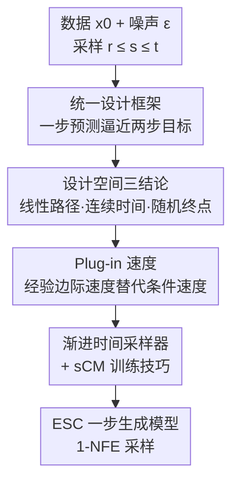

# On the Design of One-Step Diffusion via Shortcutting Flow Paths

**会议**: ICLR 2026  
**OpenReview**: [https://openreview.net/forum?id=k6q8rRYVQR](https://openreview.net/forum?id=k6q8rRYVQR)  
**代码**: https://github.com/EDAPINENUT/ExplicitShortCut  
**领域**: 扩散模型 / 一步生成  
**关键词**: shortcut model, 一步扩散, flow map, 连续时间, ImageNet 生成

## 一句话总结
本文把各种"从零训练的一步扩散（shortcut model）"统一进一个"用一步预测逼近两步 flow map 目标"的设计框架，借此把纠缠在一起的组件（流路径、时间采样器、网络参数化、损失度量）解耦做对照实验，并据此提出 plug-in 速度、渐进时间采样器等改进，在 ImageNet-256×256 上以单步生成（1-NFE）取得 FID50k 2.85（2× 训练步达 2.53）的新 SOTA，且不需要预训练、蒸馏或课程学习。

## 研究背景与动机

**领域现状**：扩散 / 流模型已成为生成建模主流，但采样要做几十甚至上百次神经网络前向（NFE），推理慢。为做到一步生成，consistency model 一类工作先训一个可靠的扩散模型、再从中蒸馏速度或得分，效果好但需要昂贵的两阶段训练。最近出现一批"从零训练"的一步模型——Consistency Training（CT）、Inductive Moment Matching（IMM）、Shortcut Diffusion（SCD），以及连续时间版的 sCT、MeanFlow，它们直接学习概率流轨迹上两点之间的"捷径映射"，本文统称为 shortcut model。

**现有痛点**：这些方法目标一致，但论文写得高度"理论 + 推导 + 训练 trick"耦合：时间采样课程、损失归一化、EMA 目标等技术细节和理论推导绑死在一起，让每个精心设计的模块都显得不可或缺，似乎动一个组件就会破坏整个系统。结果就是设计空间被遮蔽——研究者既看不清各组件之间如何交互，也不知道哪里还有改进余地。

**核心矛盾**：根本问题在于"理论合法性证明"和"具体组件级选择"被混为一谈。真正决定一个 shortcut model 行不行的，其实是几个可以正交替换的组件；但现有写法让它们彼此纠缠，无法被单独评估。

**本文目标**：（1）提炼出一个能覆盖离散/连续时间各代表方法的公共设计框架，并给出其合法性的理论依据；（2）把模型拆成正交组件，系统比较不同组合，厘清设计空间；（3）据此提出可叠加的训练改进。

**切入角度**：作者注意到，无论 CT、SCD、IMM 还是 sCT、MeanFlow，本质上都在做同一件事——"用一步参数化预测去逼近一个由两步 flow map 拼出来的目标"。只要把这个共同骨架抽出来，剩下的差异（线性 vs 余弦路径、离散 vs 连续时间、速度 vs 平均速度参数化、$\ell_2$ vs LPIPS vs MMD 损失）就都是可插拔的组件。

**核心 idea**：把"两步目标 ↔ 一步预测"作为统一范式，解耦其中正交组件，再逐组件做对照实验找出最优组合（线性路径 + 连续时间 + 随机终点），并补上 plug-in 速度等改进来稳定监督信号。

## 方法详解

### 整体框架

本文的"方法"分两层。底层是一个**统一设计框架**：所有从零训练的 shortcut model，都是先采样三个时间点 $r \le s \le t$，构造一个两步 flow map 目标 $\hat{X}_{s,r}\circ\hat{X}_{t,s}(x_t)$，再让单步参数化预测 $X^\theta_{t,r}(x_t)$ 去逼近它（目标侧带 stop-gradient）。统一目标写作

$$\arg\min_\theta \mathbb{E}_{r,s,t,\,x_t}\Big[w(r,s,t)\cdot d\big(X^\theta_{t,r}(x_t),\ \mathrm{sg}(\hat{X}_{s,r}\circ\hat{X}_{t,s}(x_t))\big)\Big]$$

其中 flow map 通过 $X_{t,r}(x_t)=x_t+(r-t)\,u_{t,r}(x_t)$（平均速度形式）或 DDIM 一阶近似 $X_{t,r}(x_t)\approx\bar\alpha_{t,r}x_t+\bar\beta_{t,r}v_t$ 求解。框架把每个方法拆成四个正交组件：**流路径**（线性 / 余弦）、**时间采样器**（离散 / 连续、终点固定 / 随机）、**网络参数化**（输出瞬时速度 $v^\theta$ 还是平均速度 $u^\theta$）、**损失度量**（$\ell_2$ / LPIPS / 分组核 MMD）。论文用一张大表把 CT、SCD、IMM、sCT、MeanFlow 全部重写进这个框架，证明它们只是组件的不同取值；并给出 Wasserstein-2 误差界（定理 2.2）说明这个"两步目标逼近"范式整体合法。

上层是**设计空间研究 + 改进**：在统一代码库里固定训练步数和 batch size 做组件对照，得出三条结论（线性路径优于余弦、连续时间优于离散、随机终点 $r$ 总体更好但早期固定 $r=0$ 收敛快）；据此选定"连续时间 + 线性路径 + MeanFlow 基座"，再叠加三项训练改进，得到最终模型 **ESC（Explicit & easier ShortCut）**。整条训练 pipeline 如下：

### 关键设计

**1. 统一设计框架：把两步目标↔一步预测抽成可插拔组件**

这一设计直接针对"理论与实现耦合、设计空间被遮蔽"的痛点。作者主张所有 shortcut model 都遵守 flow map 的一致性 $X_{s,r}(X_{t,s}(x_t))=X_{t,r}(x_t)$：既然理想中希望网络把同一条 PF-ODE 轨迹上的 $x_t$ 直接映到 $x_r$，但 $x_r$ 不可得（边际速度 $v_t(x)$ 及其积分不可解析），就只能分两步先估出中间点 $\hat{x}_s$、再估 $\hat{x}_r$ 作为目标，让单步预测去逼近。把这套范式形式化后（上式），CT/SCD/IMM 与 sCT/MeanFlow 的差异就被压缩成几个组件的取值——例如 CT 用余弦路径、$v^\theta$ 参数化、LPIPS 损失、$r$ 固定为 0；MeanFlow 用线性路径、$u^\theta$ 参数化、$\ell_2$ 损失、$r$ 随机。作者还证明离散时间在 $s\to t$ 极限下收敛到连续时间形式（如 sCT、MeanFlow 取 $s=t-dt$），并给出 Remark：线性路径下的 sCT 与 MeanFlow 形式等价。这套解耦的价值在于：任何"合理"的组件组合都能得到一个能跑的模型，于是改进就从"重写整套方法"降级成"换一个组件"，大幅降低创新门槛。

**2. 设计空间三结论：线性路径、连续时间、随机终点**

有了正交组件，作者在统一代码库里逐项做对照（CIFAR-10 无条件 + ImageNet-256 有/无 CFG），得出三条可操作结论。其一，**线性路径优于余弦路径**：线性路径的条件路径诱导的边际速度场具有更低的凸输运代价、更小的轨迹曲率，于是两步目标更不容易偏离理想轨迹；作者还在附录证明线性路径在 shortcut 设定下、给定数据样本时是最优的。其二，**连续时间优于离散时间**：在 Proposition 3.1 的推理误差分析里，离散时间的 Wasserstein-2 界比连续时间多出一项 $\ell^2\delta_2^2\delta_1^2\sigma_{dtsc}^2$（$\delta_1=t-s,\ \delta_2=s-r$），更容易带来更高推理误差和训练不稳定，实验上 sCT、MeanFlow 的 FID 也确实低于 CT、SCD。其三，**随机终点 $r$ 总体更好**：把 $r$ 固定为 0（sCT-linear）相当于只学去噪任务，早期（约 20–40k 步前）收敛更快，但缺少 $r>0$ 的中间轨迹监督会让模型卡在次优；随机采 $r$ 才能学到整体的捷径模式。这三条直接决定了 ESC 的基座选择。

**3. Plug-in 速度：用 mini-batch 经验边际速度替代条件速度，降低监督方差**

误差分析（式 10）指出，连续时间模型的推理误差里有一项正比于条件速度的方差 $\sigma_{v_{t|0}}^2:=\mathrm{Var}(v_t(x_t|x_0))$——这也解释了"为什么从预训练速度场蒸馏比从零训练好"：蒸馏用低方差的 $v^\phi_t$ 替换了高方差的条件速度。但从零训练没有教师。作者的办法是用**经验分布下的理想边际速度** $v^*_t(x_t\mid\{y^{(i)}\}_N)$（对整个训练集做高斯核加权，式 12）替代条件速度，理论上把方差降到 $O(1/N)$、仅以 $O(1/N)$ 的偏差为代价。整集求和不可行（ImageNet $N\approx128$ 万），于是退化为只在 mini-batch 内计算的 **plug-in 速度** $v^*_t(x_t\mid\{y^{(i)}\}_B)$——本质是 mini-batch 内条件速度按 softmax 权重的混合（Algorithm 1，一个 $O(B^2)$ 的批内加权），把方差降到 $O(1/B)$。它还配两个 CFG 下的修正：用 **plug-in 概率** $p_{\text{plug-in}}$ 在 plug-in 速度和条件速度之间折中（避免平均化抹掉类别信号），以及 **类一致 mini-batching**（保证每个 batch 同类，多 GPU 间各进程类别独立）。代价极小：1M 步 profiling 显示条件速度 554 ms/iter、plug-in 558 ms/iter，仅约 0.7% 开销。

**4. 渐进时间采样器 + 既有训练技巧**

针对结论三里"固定 $r=0$ 早期快、随机 $r$ 后期好"的矛盾，作者设计了一个随训练演化的**渐进时间采样器**：前 $K_{\text{fix0}}$（实际约 20k）步内，以概率 $p_{\text{fix0}}$ 选 $r=0$、以 $1-p_{\text{fix0}}$ 走 MeanFlow 的随机采样；$p_{\text{fix0}}$ 按余弦调度从 1.0 衰减到 0，于是训练从"类去噪的简单任务"平滑过渡到"完整捷径学习"，兼得早期快收敛与后期不卡次优。此外，既然 sCT 也是 CTSC 的一种，它原文里的训练技巧——变分自适应损失加权、tangent warmup——同样适用于这里，作者直接拿来叠加，进一步提升性能。

### 损失函数 / 训练策略
统一损失即上文的两步目标逼近式，连续时间下用平方 $\ell_2$ 距离配自适应权重 $w$；对 MeanFlow 这类连续时间模型，损失对 $dt$ 归一化并含 $r=t$ 的瞬时条件速度监督（概率 $p_{teq}$）。ESC 以 MeanFlow + SiT-B/2 为基线，叠加 B2（plug-in 速度 $p_{\text{plug-in}}=0.5$ + 类一致 batching）+ C（渐进时间采样器）+ D（sCM 训练技巧）。规模化时用 SiT-XL/2（≈676M），从零训练 240 epochs（≈1.2M 步），ESC+ 训 480 epochs。

## 实验关键数据

### 主实验
ImageNet-256×256，单步生成（1-NFE），SiT-XL/2 骨架：

| 方法 | NFE | 参数量 | FID50k |
|------|-----|--------|--------|
| iCT | 1 | 675M | 34.24 |
| SCD | 1 | 675M | 10.60 |
| IMM | 1×2 | 675M | 7.77 |
| MeanFlow | 1 | 676M | 3.43 |
| MeanFlow | 2 | 676M | 2.93 |
| **ESC**（类一致） | 1 | 676M | **2.85** |
| **ESC+**（480 epochs） | 1 | 676M | **2.53** |

ESC 单步 2.85 相对 MeanFlow 单步 3.43 提升 16.9%，且优于 MeanFlow 两步的 2.93；ESC+ 进一步到 2.53（提升 26.2%）。CIFAR-10 无条件：ESC 单步 FID 2.83，优于 MeanFlow 2.92、sCT 2.97、IMM 3.20。

### 消融实验
SiT-B/2，单步生成，MeanFlow（CFG）为基线（FID50k 6.09）：

| 配置 | FID50k | 说明 |
|------|--------|------|
| MeanFlow under CFG（Baseline） | 6.09 | 起点 |
| +A1 Plug-in 速度（$p=1.0$） | 6.01 | 全程用 plug-in |
| +A2 Plug-in 速度（$p=0.5$） | 5.98 | 折中概率更好 |
| +B2 Plug-in + 类一致 batching | 5.96 | 加类一致 |
| +C 渐进时间采样器 | 5.99 | 单加采样器 |
| +D sCM 训练技巧 | 5.95 | 单加技巧 |
| **ESC（B2+C+D）** | **5.77** | 全部叠加 |

### 关键发现
- 改进在大模型上收益更大：同样三项技术，SiT-B/2 上把 6.09 降到 5.77，SiT-XL/2 上把 3.43 降到 2.85，增益显著放大。
- plug-in 概率 $p=0.5$ 优于 $p=1.0$：全程用 plug-in 速度会在 CFG 下稀释类别信号，折中才好。
- 类一致 mini-batching 的最终 FID 与不用时相当，但训练中 FID50k 收敛明显更快（图 3），对"有限步数微调"场景有利。
- plug-in 速度几乎零开销：1M 步 profiling 仅 ≈0.7% 时间增加（554 → 558 ms/iter）。

## 亮点与洞察
- 最"啊哈"的一点：把一堆看似各自独立、互不兼容的一步扩散方法，证明成同一个"两步目标↔一步预测"骨架下的组件取值差异——这把"发明新方法"变成了"换组件做消融"，研究范式上降本明显。
- 用误差界把工程现象讲透：式 10/11 直接把"为什么蒸馏比从零训练好""为什么连续时间比离散好"归因到条件速度方差和多出来的 $\ell^2\delta^2$ 项，理论和实验对得上。
- plug-in 速度是个可迁移的 trick：在没有教师模型时，用 mini-batch 内的经验边际速度近似低方差监督，几乎零成本，可推广到其他从零训练的 consistency / flow map 模型。
- 渐进采样器把"早期固定 $r=0$ 快、后期随机 $r$ 好"两段优势用余弦调度缝起来，是一个简单但有针对性的课程设计。

## 局限与展望
- 设计空间研究主要在 CIFAR-10 和 ImageNet-256 的图像合成上展开，结论（线性路径、连续时间最优）是否在视频、3D、文本到图像等更复杂分布上成立，未验证。
- plug-in 速度的方差降低依赖 mini-batch 大小 $B$，小 batch（实验 $B=16$）下仍有较大估计偏差与方差，理想边际速度需整集求和不可行，只是退而求其次。
- 类一致 mini-batching 虽加速收敛，但最终 FID 与不用时相当，其"更广泛应用"被列为未来工作，当前收益场景较窄。
- 框架对"两步目标"做了充分论证，但作者也指出可以构造多步（>2）目标，本文未深入探索多步是否还有空间。

## 相关工作与启发
- **vs Consistency Model / sCM（蒸馏式一步生成）**: 它们先训教师扩散模型再蒸馏速度/得分，需两阶段、成本高；本文全程从零训练，用 plug-in 速度近似教师才有的低方差监督，免去预训练。
- **vs MeanFlow**: MeanFlow 是本文框架里"线性路径 + 连续时间 + 平均速度参数化"的一个实例，也是 ESC 的基线；ESC 在它之上加 plug-in 速度、渐进采样器和 sCM 技巧，把单步 FID 从 3.43 压到 2.85。
- **vs SCD / IMM / CT（离散时间 shortcut）**: 它们用离散时间点构造目标，本文从误差界证明离散时间多出一项 $\ell^2\delta_2^2\delta_1^2\sigma^2$，更易不稳定，实验上 FID 也明显更高，故 ESC 选连续时间。

## 评分
- 新颖性: ⭐⭐⭐⭐⭐ 把一类纠缠的方法统一进可解耦框架，是有概念价值的"整理性"创新而非堆 trick。
- 实验充分度: ⭐⭐⭐⭐ 统一代码库做组件对照 + 规模化到 SiT-XL/2 拿 SOTA，消融清晰；但主要局限于 ImageNet/CIFAR 图像域。
- 写作质量: ⭐⭐⭐⭐ 框架—分析—改进三层逻辑清楚，理论与现象互相印证；公式密度高，需要一定背景。
- 价值: ⭐⭐⭐⭐⭐ 降低了 shortcut model 的组件级创新门槛，且给出免预训练/蒸馏的 SOTA 一步生成方案。

<!-- RELATED:START -->

## 相关论文

- [\[ICLR 2026\] FARI: Robust One-Step Inversion for Watermarking in Diffusion Models](fari_robust_one-step_inversion_for_watermarking_in_diffusion_models.md)
- [\[ICLR 2026\] One Step Further with Monte-Carlo Sampler to Guide Diffusion Better](one_step_further_with_monte-carlo_sampler_to_guide_diffusion_better.md)
- [\[CVPR 2026\] Stable Mean Flow: Lyapunov-Inspired One-Step Flow Matching](../../CVPR2026/image_generation/stable_mean_flow_lyapunov-inspired_one-step_flow_matching.md)
- [\[ICLR 2026\] TwinFlow: Realizing One-step Generation on Large Models with Self-adversarial Flows](twinflow_realizing_one-step_generation_on_large_models_with_self-adversarial_flo.md)
- [\[CVPR 2026\] InverFill: One-Step Inversion for Enhanced Few-Step Diffusion Inpainting](../../CVPR2026/image_generation/inverfill_one-step_inversion_for_enhanced_few-step_diffusion_inpainting.md)

<!-- RELATED:END -->
