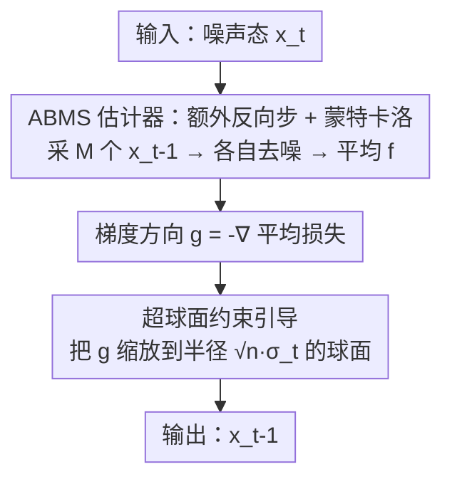

# One Step Further with Monte-Carlo Sampler to Guide Diffusion Better

**会议**: ICLR 2026  
**OpenReview**: [https://openreview.net/forum?id=cpdHmRtx7d](https://openreview.net/forum?id=cpdHmRtx7d)  
**代码**: https://github.com/AI4Science-WestlakeU/ABMS  
**领域**: 扩散模型 / 条件生成 / 训练无关引导  
**关键词**: 扩散后验采样, 训练无关引导, 蒙特卡洛采样, 估计偏差, 逆问题

## 一句话总结
针对训练无关引导（DPS 系）中"用单点 $\hat{x}_0(x_t)$ 近似条件期望 $\mathbb{E}_{x_0|x_t}[f(x_0)]$"导致的系统性梯度偏差，本文提出 ABMS：多走一步反向去噪、在中间态上做蒙特卡洛采样再平均，得到更准的引导梯度；它是即插即用的，配合超球面约束的步长控制与"双焦点"评测，在手写轨迹、图像逆问题、分子逆设计、文本风格等任务上一致提升生成质量。

## 研究背景与动机
**领域现状**：条件扩散生成里，训练无关引导（training-free guidance）是最通用的一条路线——不用像 classifier guidance / classifier-free 那样为每个任务重训扩散模型或额外训练带噪条件判别器，而是直接拿一个现成的可微损失 $L(x_0;y)$ 在去噪每一步回传梯度做引导。其中 DPS（Diffusion Posterior Sampling）是代表作：用 Tweedie 公式把条件分数近似成 $\nabla_{x_t}\log p(y|x_t)\approx\nabla_{x_t}\log p(y|\hat{x}_0(x_t))$。后续工作（MPGD、DSG 等）大多在"防止中间态 $x_t$ 偏离流形 $\mathcal{M}_t$"上做文章，从而允许更大的引导步长。

**现有痛点**：作者观察到，几乎所有方法都直接采用朴素 DPS 给出的梯度方向，而这个梯度是**系统性有偏**的。一个直观现象：当你只想朝某一个条件引导时，本应解耦的另一个条件却被明显扰动——比如手写字生成里只用"字符类别"梯度引导，"书写风格"却被带歪了。这说明梯度估计里藏着 cross-talk（跨条件串扰）。

**核心矛盾**：根因在于 DPS 用**单点估计** $\hat{x}_0(x_t)$ 去逼近条件期望 $\mathbb{E}_{x_0|x_t}[f(x_0)]$。当 $f$ 非线性、$x_t$ 噪声大时，由 Jensen 不等式 $f(\mathbb{E}[x_0])\ne\mathbb{E}[f(x_0)]$，单点估计无法刻画后验 $p(x_0|x_t)$ 的多峰形状，从而引入巨大偏差。其后果是一个 trade-off：调大引导权重虽能更贴合指定条件，却以牺牲全局质量（FID 升高、分子稳定性下降）为代价。

**本文目标**：(i) 减小条件期望的估计偏差，拿到更准的引导梯度；(ii) 给出一套能同时看"条件符合度"和"全局质量"的评测，把被掩盖的跨条件串扰暴露出来。

**核心 idea**：与其从 $x_t$ 直接一步猜到 $x_0$，不如**多走一步反向去噪到 $x_{t-1}$**——因为 $p(x_{t-1}|x_t)$ 在实践中是显式可参数化的高斯，可以从中采样 $M$ 个 $x_{t-1}^{(m)}$，各自去噪后再平均，用蒙特卡洛把后验的多峰性"摊开"，从而逼近真实的条件期望。

## 方法详解

### 整体框架
ABMS（Additional Backward step with Monte-Carlo Sampling）是对**单步引导更新**的替换：每个去噪时间步里，输入当前噪声态 $x_t$，不再用单点 $\hat{x}_0(x_t)$ 算梯度，而是先采样 $M$ 个中间态、各自去噪、对损失取平均得到更稳的梯度方向 $g$，再把 $g$ 投影/缩放到一个半径为 $\sqrt{n}\sigma_t$ 的超球面上（防止样本飘离数据流形），最后完成这一步更新 $x_t\to x_{t-1}$。整套流程即插即用，套在 DDPM / DDIM 乃至 flow matching 的 SDE 采样上都成立。

> 框架里点名的两个贡献组件——ABMS 估计器（B）与超球面约束引导（D）——分别对应下面的关键设计 1 和关键设计 3；误差理论（设计 2）与双焦点评测（设计 4）是支撑该流程的分析与评估手段，不在单步算法图里。

### 关键设计

**1. ABMS 估计器：多走一步反向去噪 + 蒙特卡洛平均，压低条件期望的估计偏差**

这是全文的核心。目标量是 $\mathbb{E}_{x_0|x_t}[f(x_0)]$，但后验 $p(x_0|x_t)$ 复杂、不可解析采样。作者利用反向扩散是马尔可夫链这一结构，借全期望公式把它改写成两层：

$$\mathbb{E}_{x_0|x_t}[f(x_0)] = \mathbb{E}_{x_{t-1}|x_t}\big[\,\mathbb{E}[f(x_0)\,|\,x_{t-1}]\,\big].$$

关键在于内层条件落在**更干净的 $x_{t-1}$** 上，而 $p(x_{t-1}|x_t)\sim\mathcal{N}(\mu_\theta(x_t,t),\sigma_t^2 I)$ 在实践中是显式高斯、可直接采样。于是 ABMS 的估计量定义为：采样 $M$ 个 $x_{t-1}^{(m)}\sim p(x_{t-1}|x_t)$，各自用预训练去噪网络得到 $\hat{x}_0(x_{t-1}^{(m)})$，再对损失取平均

$$\hat{f}_{\text{ABMS}}(M,x_t)=\frac{1}{M}\sum_{m=1}^{M} f\big(\hat{x}_0(x_{t-1}^{(m)})\big).$$

直觉上，注入一个随机的中间步后，网络得以沿多条合理的去噪轨迹探索，自然捕捉 $p(x_0|x_t)$ 的多峰形状，而不是被困在单点估计上。这与 LGD-MC 的关键区别在于：LGD-MC 直接假设 $p(x_0|x_t)$ 是高斯并从中采样，强假设让它在真实多峰场景下加多少步都白搭；ABMS 则不假设 $x_0$ 的后验形状，只用扩散自身那个**已知可解的一步转移核**去采中间态，因此能真正逼近多峰。$M=1$ 时退化为接近原始 DSG，$M$ 增大性能更好，实验发现 $M\!=\!3$ 时收益已很明显、再加边际递减。

**2. 估计误差理论：证明 ABMS 的期望误差上界严格不大于 DPS**

作者给出 Proposition 1，把估计误差拆成"重构误差项 + Jensen 间隙项"两部分分别比较。在两条温和假设下——A1：$f$ 是 $K$-Lipschitz 且梯度 $L$-Lipschitz；A2（单调性）：越干净的中间态去噪越准，即 $\mathbb{E}_{x_{t-1}|x_t}\|\hat{x}_0(x_{t-1})-\mathbb{E}_{x_0|x_{t-1}}[x_0]\|\le\|\hat{x}_0(x_t)-\mathbb{E}_{x_0|x_t}[x_0]\|$——

- **重构项**：由 A2 直接得到 ABMS 的重构误差不大于 DPS；
- **Jensen 项**：利用 $L$-Lipschitz 梯度可把 Jensen 间隙界为 $\text{UB}_t=\tfrac{1}{2}L\,\mathbb{E}_{x_t}\text{Tr}(\text{Cov}_{x_0|x_t}[x_0])$，再用全协方差律 $\text{Cov}_{x_0|x_t}=\mathbb{E}_{x_{t-1}|x_t}[\text{Cov}_{x_0|x_{t-1}}]+\text{Cov}_{x_{t-1}|x_t}[\mathbb{E}_{x_0|x_{t-1}}[x_0]]$，得到 $\text{UB}_t-\text{UB}_{t-1}=\tfrac{1}{2}L\,\mathbb{E}_{x_t}\text{Tr}(\text{Cov}_{x_{t-1}|x_t}[\mathbb{E}_{x_0|x_{t-1}}[x_0]])\ge0$。

两项都"ABMS 不更差"，合起来证明 $\mathbb{E}\|\text{Error}_{\text{ABMS}}\|\le\mathbb{E}\|\text{Error}_{\text{DPS}}\|$。这给"多走一步反向去噪能降偏差"提供了理论背书，而非只靠经验。

**3. 超球面约束的引导步长：把梯度模长固定在高维高斯的等概率球面上**

有了更准的方向 $g$，还要管"走多远"。作者沿用 DSG 的几何观察：$n$ 维各向同性高斯 $\mathcal{N}(\mu,\sigma^2 I)$ 在 $n$ 很大时概率质量集中在以 $\mu$ 为心、半径 $\sqrt{n}\sigma$ 的超球面上。为防止引导后的样本飘离数据流形，ABMS 把引导向量重缩放到该球面上：

$$g' = \omega_t\cdot\sqrt{n}\,\sigma_t\cdot\frac{g}{\|g\|},$$

其中 $\omega_t\in(0,1)$ 是引导率，并用 cosine schedule $\omega_t=\tfrac{w_{\max}}{2}\big(1+\cos(\pi(1-t/T))\big)$ 让它随去噪平滑增大。更新写成 $x_{t-1}^{\text{new}}=x_{t-1}^{\text{mean}}+g'+\sigma_t\varepsilon_t$。这一项保证 ABMS 在"梯度更准"之外不破坏流形保持，与 ABMS 估计器互补。

**4. 双焦点评测 + 跨条件串扰诊断：只报对齐指标会误导**

作者主张评测一个引导方法必须同时看两面：(i) 生成样本与目标条件的对齐度；(ii) 全局属性的保持度（图像 FID、分子稳定性等）。因为实践中随引导权重增大，条件符合度上升常以全局质量下降为代价，只报对齐指标会选到违反下游需求的工作点。基于此，他们设计了"只用一个条件的梯度引导、观察另一个本应解耦条件是否被扰动"的探针实验，把现有方法里隐蔽的跨条件串扰显式量化出来（如 content score vs style score、Distance vs FID、MAE vs molecular stability 三组配对指标）。

### 损失函数 / 训练策略
方法本身训练无关，只需现成可微损失 $L(x_0;y)\propto-\log p(y|x_0)$。不同任务用不同 $L$：图像逆问题用 $L=\|A\hat{x}_0(x_t)-y\|_2^2$（$A$ 为退化算子）；文本风格用 CLIP 特征 Gram 矩阵的 Frobenius 距离 $\|E(\hat{x}_0)-E(x_{\text{in}})\|_F^2$；分子逆设计复用 EEGSDE 的预测器但冻结 $t=0$。唯一新增超参是蒙特卡洛样本数 $M$ 与引导率上界 $w_{\max}$。

## 实验关键数据

### 主实验
覆盖手写轨迹、图像逆问题、分子逆设计、文本风格四类任务，主要对比当前 SOTA 的 DSG。

ImageNet 256×256 线性逆问题（$M=3$）：

| 任务 | 指标 | DPS | LGD | DSG | Ours |
|------|------|-----|-----|-----|------|
| Inpainting | PSNR↑ / FID↓ | 27.56 / 30.57 | 27.78 / 28.65 | 28.67 / 23.63 | **29.23 / 19.25** |
| Super-Res | PSNR↑ / FID↓ | 22.07 / 41.36 | 22.23 / 39.85 | 23.74 / 34.28 | **23.80 / 33.06** |
| Gaussian Deblur | PSNR↑ / FID↓ | 18.78 / 52.13 | 19.52 / 50.42 | 22.64 / 45.27 | **22.65 / 41.65** |

可见在 inpainting 上 FID 从 DSG 的 23.63 大幅降到 19.25，三任务的 LPIPS/SSIM 也一致更优。

分子逆设计（QM9，MS 相当前提下比 MAE，$M=3$）：六个量子属性上 ABMS 的 MAE 全面优于 DSG/EEGSDE，例如 $\mu$ 从 DSG 0.7811 降到 0.7274、$\Delta\epsilon$ 从 0.4558 降到 0.4182、$\epsilon_{\text{LUMO}}$ 从 0.3969 降到 0.3778，且分子稳定性 MS 多数持平或更高。

### 消融实验

| 配置 | 关键现象 | 说明 |
|------|---------|------|
| 蒙特卡洛样本数 $M$ | $M\!=\!1$ 曲线≈原始 DSG；$M\!=\!3$ 明显变好，再增大边际递减 | 验证"多走一步采样"是性能来源 |
| 跨条件串扰（手写字，scale=0.1） | DSG style 0.534、Ours style 0.878（content 同为 0.99） | 只引导类别时 DSG 把风格带歪，ABMS 几乎保住风格 |
| Distance vs FID 曲线 | ABMS 在更低 Distance 下维持更高图像质量，且对引导 scale 更鲁棒 | 双焦点评测下的整体优势 |

手写字定量（Table 1，content/style）：无引导时 content 0.827 / style 0.899；DSG(0.1) 把 content 拉到 0.998 但 style 崩到 0.534；Ours(0.1) content 0.999、style 仍有 0.878——把"对齐"与"解耦保持"同时拿下。

### 关键发现
- **多峰建模是关键**：性能提升的根源是 ABMS 不再单点近似，而是用扩散自带的可解一步转移核采样、捕捉后验多峰；$M=3$ 是性价比拐点。
- **串扰是普遍病**：在"理想下两条件解耦"的手写字任务里，朴素 DPS 梯度仍会显著扰动无关条件，说明偏差是 DPS 公式本身的系统性问题，而非个别实现。
- **高阶/不同范式可迁移**：方法在 DDPM、DDIM 乃至 Stable Diffusion 3.5（flow matching）的 SDE 采样上都有效，文本风格任务里生成更清晰且更贴合风格。

## 亮点与洞察
- **把"采样预算"花在刀刃上**：不是盲目加去噪步数，而是只多走一步、在显式高斯转移核上做蒙特卡洛——既绕开 $p(x_0|x_t)$ 不可采的难题，又有理论保证误差不增，思路非常干净。
- **理论与现象闭环**：从"串扰"这一可观测现象出发，定位到 Jensen 间隙 + 单点估计的根因，再用全期望/全协方差律给出可证的改进，是"现象→根因→方法→证明"的范式样本。
- **双焦点评测可复用**："只报对齐指标会误导"这一点对所有引导/可控生成研究都成立，配对指标 + 单条件探针实验可直接迁移到其他可控生成任务的评估里。
- **即插即用**：作为对单步更新的替换，几乎可以挂到任何 DPS 系方法上，工程落地成本低。

## 局限与展望
- **计算开销**：每步要多采 $M$ 个中间态并各跑一次去噪网络，推理成本约为基线的 $M$ 倍；作者也坦言受算力限制，没系统研究"继续增大反向步数/采样预算"在更多场景下的额外收益。
- **few-step 生成未覆盖**：如何把该策略适配到极少步（few-step）生成范式仍是开放问题——而 few-step 正是当前扩散提速的主流方向。
- **A2 假设依赖**：理论保证建立在"越干净去噪越准"的单调性假设上，虽经验上成立，但极端噪声调度或弱去噪器下是否始终成立未深究。
- **分子实验的公平性折中**：训练无关本只需 clean 数据上的预测器，但为对齐对比复用了 EEGSDE 的带噪预测器并冻结 $t=0$，可能部分限制了可达性能。

## 相关工作与启发
- **vs DPS**：DPS 用单点 $\hat{x}_0(x_t)$ 近似条件期望，本文指出这在 $f$ 非线性时有系统性 Jensen 偏差；ABMS 多走一步 + 蒙特卡洛平均直接降这个偏差，是对 DPS 梯度本身的修正，而非只防流形偏离。
- **vs LGD-MC**：两者都用蒙特卡洛，但 LGD-MC 强假设 $p(x_0|x_t)$ 为高斯、从中采样，多峰场景下失效；ABMS 改在已知可解的 $p(x_{t-1}|x_t)$ 上采样，不假设 $x_0$ 后验形状，能真正建模多峰。
- **vs DSG / MPGD**：DSG/MPGD 聚焦"防止中间态偏离流形"以允许更大步长，但没动 DPS 梯度的不精确问题；ABMS 借用 DSG 的超球面步长控制做"走多远"，同时用 ABMS 估计器解决"往哪走"，二者正交互补。
- **vs 推理时扩展（inference-time scaling）**：噪声搜索/重注噪声等方法靠额外算力提质；ABMS 同样多花算力，但专门用于在任意可微条件下拿到更准的引导梯度。

## 评分
- 新颖性: ⭐⭐⭐⭐ 用全期望公式把"难采的 $x_0$ 后验"转成"可采的 $x_{t-1}$ 转移核"，角度巧且有理论支撑
- 实验充分度: ⭐⭐⭐⭐ 覆盖四类任务/多数据类型，含双焦点曲线与串扰探针，但缺逐项推理耗时主表
- 写作质量: ⭐⭐⭐⭐ 现象-根因-方法-证明链条清晰，公式与算法可对照复现
- 价值: ⭐⭐⭐⭐ 即插即用、可挂到任意 DPS 系方法，双焦点评测对可控生成评估有普适意义

<!-- RELATED:START -->

## 相关论文

- [\[ICLR 2026\] Efficient Approximate Posterior Sampling with Annealed Langevin Monte Carlo](efficient_approximate_posterior_sampling_with_annealed_langevin_monte_carlo.md)
- [\[ICLR 2026\] Quasi-Monte Carlo Methods Enable Extremely Low-Dimensional Deep Generative Models](quasi-monte_carlo_methods_enable_extremely_low-dimensional_deep_generative_model.md)
- [\[ICLR 2026\] On the Design of One-Step Diffusion via Shortcutting Flow Paths](on_the_design_of_one-step_diffusion_via_shortcutting_flow_paths.md)
- [\[ICLR 2026\] FARI: Robust One-Step Inversion for Watermarking in Diffusion Models](fari_robust_one-step_inversion_for_watermarking_in_diffusion_models.md)
- [\[ICLR 2026\] Towards Better Optimization for Listwise Preference in Diffusion Models](towards_better_optimization_for_listwise_preference_in_diffusion_models.md)

<!-- RELATED:END -->
