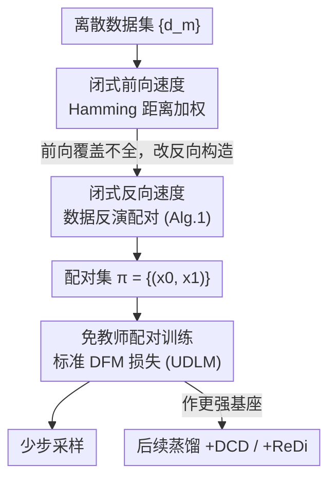

# PairFlow: Closed-Form Source-Target Coupling for Few-Step Generation in Discrete Flow Models

**会议**: ICLR 2026  
**OpenReview**: [https://openreview.net/forum?id=awEvtKliMC](https://openreview.net/forum?id=awEvtKliMC)  
**代码**: 项目页 https://pair-flow.github.io  
**领域**: 扩散模型 / 离散扩散 / 少步生成  
**关键词**: 离散流模型, 少步采样, 闭式速度场, 源-目标配对, 免教师

## 一句话总结
PairFlow 用闭式的离散流速度场（由 Hamming 距离决定），从数据出发反向反演出与之配对的源样本，仅花不到训练成本 1.7% 的预处理就能让离散流模型实现少步生成，效果追平甚至超过需要预训练教师 + 微调的蒸馏方法。

## 研究背景与动机
**领域现状**：离散流模型（Discrete Flow Models, DFM）把连续域的 Flow Matching 思想搬到了离散数据（分子 SMILES、离散化像素等），通过迭代采样在分类分布上建模，效果很强。其中以 uniform-state 模型（如 UDLM）为代表的一类带有"自我纠错"特性，能在并行解码出错时恢复。

**现有痛点**：和连续流一样，DFM 的致命伤是采样慢——要迭代很多步。现有加速思路几乎都是**蒸馏式微调**：先训一个基础模型当教师，再用它生成源-目标配对去微调一个学生（如 ReDi、DCD）。但微调本身要额外花掉基础模型训练成本的 10–20%，等于"推理提速"是用"训练变贵"换来的。此前没有工作正面解决这部分训练时间开销。

**核心矛盾**：少步生成时，DFM 必须同时更新高度相关的多个 token，而 DFM 是按 token 独立分解地建模联合转移，这种"真实联合分布 vs 乘积近似"的失配会被放大。ReDi 把这个失配形式化为**条件总相关 (Total Correlation, TC)**，并指出最小化 TC 等价于把离散路径"拉直"——但拉直靠的是迭代地用教师重新生成配对，绕不开教师和微调。

**本文目标**：能不能不依赖任何预训练教师、也不微调，就直接从数据里造出"拉直"路径所需的优质源-目标配对，把加速成本压到几十 GPU 分钟级别？

**切入角度**：作者注意到，连续域已有工作（Karras、Bertrand 等）证明：当源、目标分布都有可解析的密度时，输运它们的速度场可以**写成闭式**。这一思路从未在离散域被探索过。如果离散流也有闭式速度，那么"造配对"就不再需要跑教师模型采样。

**核心 idea**：为 uniform-state 的 DFM 推出闭式的前向 / 反向速度场（由 Hamming 距离决定），从每个真实数据点出发用反向速度"反演"出对应的源样本，得到的配对直接拿来训练模型——用一个只占训练成本 ~1.7% 的轻量预处理替代昂贵的蒸馏微调。

## 方法详解

### 整体框架
PairFlow 的本质是把"造配对"这件事从"跑教师采样"换成"闭式公式直接算"，整条管线是一个一次性的**预处理 + 常规训练**：拿到离散数据集后，对每个数据点用闭式反向速度迭代反演，得到一个与它配对的源（噪声）样本；把这些 $(x_0, x_1)$ 配对喂给标准 DFM 损失训练（基座选 UDLM），训出来的模型就具备少步采样能力，还能作为后续蒸馏的更强初始化。

为什么要先推前向速度再绕到反向？因为最直接的想法是"从源采样、沿前向速度演化到数据点"来造配对，但作者发现前向构造**覆盖不全**——多个源会映射到同一个目标，要覆盖全部数据点需要海量源样本。于是改成从数据点出发反向反演，按构造就保证每个数据点都被配到一对。

回顾一下 DFM 的记号：序列 $x=(x^1,\dots,x^N)$ 每个 token 取值于大小为 $K$ 的词表 $V$。条件路径用混合路径 $p_t(z^i|x_0,x_1)=(1-\kappa_t)\delta_{x_0}(z^i)+\kappa_t\delta_{x_1}(z^i)$，调度 $\kappa_t$ 单调从 0 增到 1。模型学的是去噪器 $p^\theta_{1|t}$，对应边际速度场

$$v^\theta_t(x^i,z)=\frac{\dot\kappa_t}{1-\kappa_t}\big[p^\theta_{1|t}(x^i|z)-\delta_z(x^i)\big].$$

PairFlow 的关键在于：当目标分布用经验分布 $\tilde q(x)=\frac1M\sum_m \delta_{d_m}(x)$ 表示、源分布取均匀先验 $p_0=U^N$ 时，上面这个速度场可以不靠网络、直接写成闭式。

### 关键设计

**1. 闭式前向速度：用 Hamming 距离把噪声拉向最相似的数据**

要让"造配对"摆脱教师，第一步是证明前向速度有闭式解。作者在均匀先验 + 经验目标分布下，推出闭式去噪器与前向速度

$$p_{1|t}(x^i|z)=\frac{\sum_{m=1}^{M}\delta_{d_m^i}(x^i)\,\gamma^{-h(d_m,z)}}{\sum_{m=1}^{M}\gamma^{-h(d_m,z)}},\qquad \hat v_t(x^i,z)=\frac{\dot\kappa_t}{1-\kappa_t}\big[p_{1|t}(x^i|z)-\delta_z(x^i)\big],$$

其中 $\gamma=\frac{1+(K-1)\kappa_t}{1-\kappa_t}$，$h(s,z)=N-\sum_{i=1}^{N}\delta_{s^i}(z^i)$ 是两序列的 **Hamming 距离**（不同 token 的个数）。这个去噪器是一堆 Dirac delta 的加权混合：离 $z$ 越近（Hamming 越小）的数据序列权重越大，直观上前向速度就是"把每个 token 拉向与当前序列最相似的那些数据样本"。它说明了配对完全可以从数据直接算出来，不需要任何预训练模型。但若真用它"从源演化到数据"造配对，会因覆盖不全而需要不切实际的海量源样本（附录 C.1 验证），这正是下一个设计要解决的。

**2. 闭式反向速度与数据反演：保证全覆盖的高效配对**

为了绕开前向覆盖不全，作者反过来——从数据点出发、沿**反向**速度把样本一步步推回源分布，这样每个数据点天然都能被配到一对。沿同样的构造推出闭式噪声预测器与反向速度

$$p_{0|t}(x^i|z)=\delta_z(x^i)-\frac{\kappa_t(K\delta_{x^i}(z^i)-1)}{1+(K-1)\kappa_t}\cdot\frac{\sum_{m}\delta_{d_m^i}(z^i)\,\gamma^{-h(d_m,z)}}{\sum_{m}\gamma^{-h(d_m,z)}},$$

$$\check v_t(x^i,z)=\frac{\dot\kappa_t\,(K\delta_{x^i}(z^i)-1)}{1+(K-1)\kappa_t}\cdot\frac{\sum_{m}\delta_{d_m^i}(z^i)\,\gamma^{-h(d_m,z)}}{\sum_{m}\gamma^{-h(d_m,z)}}.$$

式中的求和项相当于在所有数据上、按与 $z$ 的 Hamming 邻近度加权地估计第 $i$ 个 token 取某值的条件似然——局部共识越强的 token 权重越高，于是 $\check v_t$ 会把样本"推离数据、推向均匀源"。算法（Alg. 1）非常直接：对每个数据点 $x_{1,m}=d_m$ 初始化，迭代 $T$ 步反向更新得到源样本 $x_{0,m}$，收集成配对集 $\pi=\{(x_{0,m},x_{1,m})\}$。整个过程完全可并行，因此预处理成本极低（QM9 上仅 0.8 分钟）。和 UDLM 标准腐蚀过程相比，PairFlow 反演出的源样本在 Hamming 距离上更靠近原数据（图 1 中 6.47 vs 9.0），意味着训练时模型只需更少的 token 翻转就能恢复数据，近似实现了 ReFlow/ReDi 追求的"直路径"。

**3. 免教师配对训练，并作为蒸馏的更强基座**

有了 $\pi$，训练就是把这些配对代入标准 DFM 损失去训 UDLM——没有教师、没有额外 loss 项、没有微调阶段，加速能力直接来自"配得好的源-目标对"。更有意思的是，这套配对不仅自身能少步生成，还能当作后续蒸馏的更强初始化：把 PairFlow 训出的模型再喂给 DCD 或 ReDi，得到的 PairFlow+DCD / PairFlow+ReDi 会进一步刷新性能边界，而这只额外增加几个百分点的预处理开销。这点把 PairFlow 从"蒸馏的替代品"变成了"蒸馏的增益器"，说明配对质量本身就是加速的关键变量。

### 损失函数 / 训练策略
训练目标就是原始 DFM 的去噪交叉熵 $L_{\text{DFM}}$，唯一改动是把训练用的源-目标配对从"随机均匀采样 / 教师采样"换成 Alg. 1 反演出的 $\pi$。配对生成是一次性预处理，反向迭代步数 $T$ 为主要超参；基座固定为 uniform-state 的 UDLM。前向速度作为"统计直度"的理论支撑：作者用条件总相关衡量分解误差，$TC_\pi(x_s|x_t)=\mathbb{E}_{x_t}\!\big[D_{\mathrm{KL}}\big(p_{s|t}(x_s|x_t)\,\|\,\prod_i p_{s|t}(x_s^i|x_t)\big)\big]$，PairFlow 的配对让该量更小，等价于把离散路径拉得更直。

## 实验关键数据

### 主实验
分子（QM9 / ZINC-250k，报 valid/unique/novel SMILES 数，1024 采样）与图像（MNIST-Binary、CIFAR-10，报 FID/IS）。下表摘取最能说明问题的少步结果。

| 数据集 | 设置 | 指标 | UDLM(基座) | PairFlow | 蒸馏对照 |
|--------|------|------|-----------|----------|----------|
| QM9 | 1 步 | valid 数 | 17.5 | **223.4**（12.8×） | — |
| QM9 | 2 步 | valid 数 | — | **416.0** | UDLM+ReDi 232.4 / UDLM+DCD 530.8 |
| ZINC-250k | 2 步 | valid 数 | — | **146.3** | UDLM+ReDi 75.9 |
| MNIST-Binary | 1 步 | FID↓ | ~130 | **40.59**（↓68.9%） | UDLM+DCD 53.84 |
| MNIST-Binary | 2 步 | FID↓ | 42.54 | **15.61**（↓63.3%） | UDLM+ReDi 10.36 |
| MNIST-Binary | 4 步 | FID↓ | 11.25 | **8.51**（↓24.4%） | — |

PairFlow 在所有少步设置下稳定优于基座 UDLM，2/4 步的有效率约等于 UDLM 多跑一倍步数（4/8 步）的水平；对比需要教师 + 微调的蒸馏方法也基本追平甚至反超（QM9 2 步全面胜 ReDi、逼近 DCD）。

### 训练成本对比（相对基座训练时间 $T_{\text{Base}}$）

| 数据集 | $T_{\text{Base}}$(min) | DCD | ReDi | **PairFlow** |
|--------|------|-----|------|----------|
| MNIST-Binary | 80 (100%) | 40 (50%) | 49 (61%) | **1.4 (1.7%)** |
| CIFAR-10 | 6720 (100%) | 360 (5.3%) | 468 (6.9%) | **20 (0.3%)** |
| QM9 | 450 (100%) | 115 (24.8%) | 100 (22.2%) | **0.8 (0.2%)** |
| ZINC-250k | 1110 (100%) | 211 (19%) | 194 (17.4%) | **13 (1.2%)** |

PairFlow 的预处理在 MNIST 上比 DCD/ReDi 分别快 **28.6× / 35×**，整体最多比蒸馏省 143× 计算。

### 关键发现
- **配对质量是核心变量**：把 PairFlow 当基座再蒸馏，PairFlow+DCD 在 QM9 1/2 步把 valid 从 323/530.8 提到 453.8/685.8；PairFlow+ReDi 在 ZINC 把 1 步 valid 从 0.7 提到 46.3、2 步从 75.9 提到 221.5。说明"配得好的对"比"更多微调"更值钱。
- **反演带来更直的路径**：PairFlow 反演的源样本平均 Hamming 距离 6.47，远小于 UDLM 腐蚀过程的 9.0，直接对应少步恢复更省 token 翻转。
- **失败场景**：CIFAR-10 上 DCD/ReDi 反而让 FID 变高、IS 变低，作者归因于教师模型本身偏弱，加速会放大教师缺陷；而 PairFlow 不依赖教师，仍稳定改进基座。

## 亮点与洞察
- **闭式速度替代教师采样**：把"造配对"从一次完整的教师生成过程压缩成一条由 Hamming 距离决定的解析公式，这是把训练成本砍两个数量级的根因——巧在它揭示了 uniform-state DFM 的速度场本就有解析结构。
- **前向不行就反向**：识别出前向构造"覆盖不全"这一真实障碍，并用反向反演（从数据出发）从构造上保证全覆盖，是一个干净的工程兼理论解法。
- **从替代品变增益器**：同一套配对既能独立少步生成，又能当蒸馏的更强初始化，可迁移到任何"先造配对再蒸馏"的加速管线——把注意力从"怎么微调"引向"怎么配对"。

## 局限与展望
- **绑定均匀先验 / uniform-state 模型**：闭式推导建立在均匀源 + UDLM 这类自纠错模型上，对 masked 型（如 MDLM）或非均匀先验是否成立未给出，通用性待验证。
- **Hamming 加权的计算随数据规模增长**：闭式去噪器要对全数据集按 Hamming 邻近加权求和，虽可并行，但在超大词表/超长序列/超大数据集下，每步反演的代价与数值稳定性（$\gamma^{-h}$ 随 $\kappa_t\to1$ 可能极端）值得关注。
- **教师弱时蒸馏失效的迁移性**：CIFAR-10 上加速普遍失败暴露出离散流在高维 RGB 上的基座质量瓶颈，PairFlow 改进有限，高分辨率图像仍是开放问题。

## 相关工作与启发
- **vs ReDi (Yoo et al., 2025)**：同样追求"拉直路径 / 减小总相关"的源-目标配对，但 ReDi 要跑预训练教师采样 + 迭代微调；PairFlow 用闭式反向速度直接从数据反演配对，免教师、免微调，成本低 1–2 个数量级，且能当 ReDi 的更强基座。
- **vs DCD (Sahoo et al., 2025)**：DCD 是离散版一致性蒸馏，需教师 + 微调；PairFlow 以远低成本追平 DCD，且 PairFlow+DCD 能进一步反超纯 DCD。
- **vs 连续域闭式 flow（Karras / Bertrand）**：把"双方密度可解析时速度场有闭式"的思想首次引入离散域，并发现离散闭式速度由 Hamming 距离决定，是从连续到离散的非平凡迁移。

## 评分
- 新颖性: ⭐⭐⭐⭐⭐ 首次为离散流推出闭式前向/反向速度，并用它免教师造配对，切入点干净。
- 实验充分度: ⭐⭐⭐⭐ 覆盖分子 + 二值/ RGB 图像与多种步数，但 CIFAR-10 等高维场景改进有限。
- 写作质量: ⭐⭐⭐⭐ 推导与动机清晰，前向→反向的逻辑链讲得透。
- 价值: ⭐⭐⭐⭐⭐ 把少步加速成本压到 ~1.7%，并指出"配对质量"才是关键变量，实用且有启发。

<!-- RELATED:START -->

## 相关论文

- [\[CVPR 2026\] Closed-Form Concept Erasure via Double Projections](../../CVPR2026/image_generation/closed-form_concept_erasure_via_double_projections.md)
- [\[ICLR 2026\] Generalised Flow Maps for Few-Step Generative Modelling on Riemannian Manifolds](generalised_flow_maps_for_few-step_generative_modelling_on_riemannian_manifolds.md)
- [\[ICLR 2026\] DistillKac: Few-Step Image Generation via Damped Wave Equations](distillkac_few-step_image_generation_via_damped_wave_equations.md)
- [\[ICLR 2026\] BézierFlow: Learning Bézier Stochastic Interpolant Schedulers for Few-Step Generation](bézierflow_learning_bézier_stochastic_interpolant_schedulers_for_few-step_genera.md)
- [\[ICLR 2026\] Discrete Guidance Matching: Exact Guidance for Discrete Flow Matching](discrete_guidance_matching_exact_guidance_for_discrete_flow_matching.md)

<!-- RELATED:END -->
