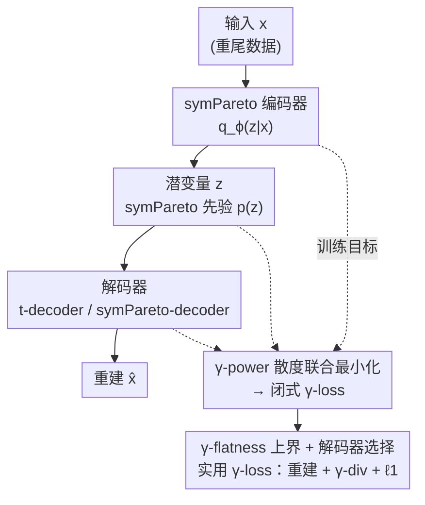

# Pareto Variational Autoencoder

**会议**: ICLR 2026  
**OpenReview**: [https://openreview.net/forum?id=s5a8zBPFfe](https://openreview.net/forum?id=s5a8zBPFfe)  
**领域**: 生成模型 / 变分自编码器  
**关键词**: 重尾分布、对称 Pareto、γ-power 散度、信息几何、VAE

## 一句话总结
针对高斯 VAE 低估尾部概率、过度正则化潜空间的问题，本文提出一种基于 $\ell_1$ 范数的多元重尾分布——对称 Pareto（symPareto），并用信息几何里的 γ-power 散度替换 KL 散度，构造出有闭式损失的 ParetoVAE，在图度数重建、词频分析、图像去噪等重尾任务上显著优于高斯/Laplace/t 分布的 VAE。

## 研究背景与动机
**领域现状**：VAE（Kingma & Welling, 2013）十余年来一直是可扩展概率推断与表示学习的基石。出于数学上的可解性，主流 VAE 几乎都用指数族分布——尤其是多元高斯——来建模先验、编码器和解码器，损失函数因此退化成"MSE 重建项 + KL 正则项"的形式。

**现有痛点**：现实数据常常呈现重尾和极端事件，例如无标度网络的度数分布、长尾类别频率。高斯的指数衰减尾巴根本罩不住这些数据，导致高斯 VAE 系统性地低估尾部概率、过度压缩潜码、丢失稀有但信息量大的事件。近期工作转向多元 Student's t 分布来缓解，但 t 只是众多重尾族里的一种选择，而经典极值理论恰恰指向 Pareto 分布才最适合刻画尾部行为。

**核心矛盾**：想直接把 Pareto 这类幂律分布塞进 VAE 会撞上一堵计算墙——两个 symPareto 分布之间的 KL 散度没有闭式解，高维下数值积分代价爆炸，蒙特卡洛又引入额外方差。换句话说，重尾建模能力和 ELBO 的可计算性之间存在尖锐冲突。

**本文目标**：(1) 造一个有显式密度、支持全实数域、能算散度的多元 Pareto 分布；(2) 给它配一个绕开 KL 不可解性的、有闭式损失的 VAE 框架。

**切入角度**：作者从"VAE 本质是两个统计流形之间的联合最小化问题"这一信息几何视角出发。在这个视角下，最大化 ELBO 等价于最小化数据流形与模型流形之间的某种散度——而散度的选择是可以替换的。对幂律族而言，γ-power 散度天然诱导出"γ-flat"几何结构，能让幂律分布之间的散度写成闭式。

**核心 idea**：用 $\ell_1$ 范数版的"对称 Pareto"分布替换高斯做先验/编码器，用 γ-power 散度替换 KL 做联合最小化目标，从而把重尾建模做成一个可闭式优化的 VAE。

## 方法详解

### 整体框架
ParetoVAE 仍然是"编码器 → 潜空间 → 解码器"的标准自编码结构，但三个组件全部被重尾化：先验和编码器都用对称 Pareto 分布，解码器则灵活可选 Student's t 或 symPareto。训练目标不再是最大化 ELBO，而是直接最小化数据联合流形 $q_\phi(x,z)$ 与模型联合流形 $p_\theta(x,z)$ 之间的 γ-power 散度 $D_\gamma(q_\phi\|p_\theta)$。由于 γ-power 散度在幂律族上有闭式表达，这个联合最小化最终化简成一个可微的 γ-loss——形如"重建误差 + γ-散度正则 + $\ell_1$ 惩罚"，可以用标准反向传播优化。

### 关键设计

**1. 对称 Pareto 分布：$\ell_1$ 范数版的多元重尾基石**

高斯尾巴太轻、Student's t 又只是"另一种"重尾，作者想要一个既有显式密度、又能覆盖全实数域、还能算散度的多元 Pareto。已有的多元 Pareto 大多没有适合算散度的显式密度、且只支持正半轴。本文从 Mardia 第一类多元 Pareto 出发，定义对称 Pareto（symPareto）分布：

$$P_n(x\mid\mu,\sigma,\nu)=\frac{C_{n,\nu,\nu}}{\bar\sigma}\left(1+\frac{1}{\nu}\left\|\frac{x-\mu}{\sigma}\right\|_1\right)^{-(\nu+n)},\quad C_{n,\nu_1,\nu_2}=\frac{\Gamma(\nu_1+n)}{(2\nu_2)^n\Gamma(\nu_1)}$$

它可以看作多元 Laplace 乘积的重尾化，或者说是把多元 t 分布里的 $\ell_2$ 范数换成 $\ell_1$ 范数后的"对偶版本"。这个 $\ell_1$ 结构带来两个关键好处：一是采样在二维平面上呈现"十字形"——样本倾向于沿坐标轴对齐，天然诱导潜空间稀疏性；二是尾巴比高斯和 t 都重得多，CCDF 在小 $\nu$ 时呈多项式衰减，能罩住半径 5、10 之外的极端样本。当 $\nu\to\infty$ 时它收敛到 Laplace 分布。

**2. γ-power 散度联合最小化：绕开不可解的 KL**

直接对 symPareto VAE 写 ELBO 会卡在 KL 无闭式上。作者借助"VAE = 两个统计流形之间联合最小化"的视角：把模型流形 $\mathcal{M}_{model}=\{p_\theta(x|z)p_Z(z)\}$ 和数据流形 $\mathcal{M}_{data}=\{p_{data}(x)q_\phi(z|x)\}$ 摆出来，最大化 ELBO 等价于 $\arg\min D_{KL}(q\|p)$。既然散度可换，就换成对幂律族友好的 γ-power 散度：

$$D_\gamma(q\|p)=\gamma^{-1}C_\gamma(q,p)-\gamma^{-1}H_\gamma(q),\quad H_\gamma(p)=-\|p\|_{1+\gamma}$$

其中 $H_\gamma$、$C_\gamma$ 分别是 γ-power 熵和 γ-power 交叉熵。它之所以对幂律族有效，是因为它诱导出 γ-power 测地线和 γ-flat 子流形 $S_\gamma=\{p_\theta\propto(1+\gamma\theta^\top s(x))^{1/\gamma}\}$——正如 e-测地线刻画指数族那样。当 symPareto 取 $\mu=0$、$s(x)=|x|$ 时，它恰好落在 $\gamma=-\frac{1}{\nu+n}$ 的 γ-flat 流形上。这意味着 symPareto 之间的散度能写成闭式，从而避开数值积分。

**3. ParetoVAE 结构与可重参数化：先验/编码器用 symPareto，解码器灵活可选**

具体构造从一个重尾联合解码模型出发，推出先验 $p(z)=P_m(z|0,1_m,\nu)$ 与解码器 $p_\theta(x|z)=t_n(x|\mu_\theta(z),\cdot,\nu+m)$（注意解码器自由度随潜维 $m$ 增加）；编码器同样取 symPareto $q_\phi(z|x)=P_m(z|\mu_\phi(x),\sigma_\phi(x),\nu+n/2)$，并把自由度加上 $n$ 来反映数据维度的贡献。为了能做梯度优化，作者给出 symPareto 的可重参数化：正如 t 分布可表示为高斯与卡方的混合，symPareto 可表示为 Laplace-Gamma 混合——

$$T=(\nu/W)Z\sim P_n(0,1_n,\nu),\quad Z\sim L_n(0,I_n),\ W\sim\text{Gamma}(\nu,1)$$

即先采一个各分量 i.i.d. 的 Laplace 向量再用一个 Gamma 变量缩放，就能采出 symPareto，重参数化技巧因此完全可用。

**4. γ-flatness 上界与解码器选择：把目标变成可训练的实用 γ-loss**

把 $\gamma=-\frac{2}{2\nu+2m+n}$ 代入并化简，$D_\gamma(q_\phi\|p_\theta)$ 得到闭式，γ-loss 可写成"MSE 重建项 + 编码器与替代先验 $p_{alt}$ 之间的 γ-散度正则"。但还有个麻烦：当 $\mu\neq0$ 时 symPareto 不再有合法的充分统计量，γ-flatness 在非中心情形下不保持。作者用 Theorem 2.1 给出一个上界：把两个分布平移到原点得到 $p_0,q_0$（它们落在 γ-flat 流形上、散度有闭式），再加一个反映平移代价的 $\ell_1$ 项：

$$D_\gamma(p\|q)\le D_\gamma(p_0\|q_0)+\beta\left\|\frac{\mu_1-\mu_2}{\sigma_2}\right\|_1$$

代回后得到实用目标 $L_\gamma$，由三部分组成：$\ell_2^2$ 重建损失、γ-flat 下的 γ-散度正则、对 $\mu_\phi(x)$ 的 $\ell_1$ 惩罚（这个 $\ell_1$ 项正是稀疏性与鲁棒性的来源）。此外解码器可选：t-decoder 保留 MSE，适合稀疏重尾数据重建；把重建项里的 $\|x-\mu_\theta(z)\|_2^2$ 换成 $\|x-\mu_\theta(z)\|_1$ 就得到 symPareto-decoder，损失里的 MSE 变成 MAE，对极端值更鲁棒，适合去噪。理论上还能证明当 $\nu\to\infty$ 时 γ-loss 收敛到 LaplaceVAE 目标（正则权重 $\frac12$），所以 ParetoVAE 可看作 LVAE 的重尾扩展，且权重 $\alpha,\beta$ 可像 β-VAE 那样微调。

### 损失函数 / 训练策略
- **t-decoder（MSE 版）**：$L_\gamma=\mathbb{E}_x\big[\frac{1}{2\sigma^2}\mathbb{E}_{z\sim q_\phi}\|x-\mu_\theta(z)\|_2^2+\alpha D_\gamma(q_{\phi,0}\|p_{alt})+\alpha\beta\|\mu_\phi(x)\|_1\big]$，其中 $\gamma=-\frac{2}{2\nu+2m+n}$。
- **symPareto-decoder（MAE 版）**：重建项替换为 $\frac{1}{\sigma}\mathbb{E}_{z\sim q_\phi}\|x-\mu_\theta(z)\|_1$，$\gamma=-\frac{1}{\nu+m+n}$，MAE 带来对离群值的鲁棒性。
- 实验中 $\nu$ 对 t3VAE 和 ParetoVAE 都固定不调（见原文附录 D），保证对比公平。

## 实验关键数据

### 主实验
统一对比四种 VAE：高斯 VAE、LaplaceVAE（LVAE）、t3VAE、ParetoVAE（部分任务含确定性 AE）。

**图度数重建（Epinions 有向社交网络，t-decoder）**——用 sliced 1-Wasserstein 距离（SWD）衡量整体与尾部（按 $\ell_2$ 范数前 10%）拟合，并用 MMD 两样本检验报告 p 值（✓ 表示不拒绝 $H_0:p_{data}=p_{recon}$）：

| 模型 | SWD 整体 (↓) | SWD 尾部 (↓) | 尾部 p 值 |
|------|------|------|------|
| **ParetoVAE** | **0.044 ± 0.005** | **0.170 ± 0.029** | 0.221 ✓ |
| LVAE | 0.055 ± 0.009 | 0.301 ± 0.084 | 0.119 ✓ |
| t3VAE | 0.055 ± 0.005 | 0.389 ± 0.040 | 0.181 ✓ |
| VAE | 0.061 ± 0.018 | 0.402 ± 0.025 | 0.042 ✗ |
| AE | 0.074 ± 0.030 | 0.621 ± 0.304 | 0.028 ✗ |

ParetoVAE 在整体和尾部 SWD 上都最低；带 $\ell_1$ 正则的模型（ParetoVAE、LVAE）收敛比带 $\ell_2^2$ 的（VAE、t3VAE）更快，说明对极端值更鲁棒。

**词频分析（WikiText-2，19,962 维词袋，t-decoder）**——头部为最高频 2,241 词、尾部为最低频 2,241 词，报告 overlap 与 Jaccard：

| 模型 | 头部 Overlap (↑) | 头部 Jaccard (↑) | 尾部 Overlap (↑) | 尾部 Jaccard (↑) |
|------|------|------|------|------|
| **ParetoVAE** | **0.981** | **0.964** | **0.717** | **0.560** |
| LVAE | 0.772 | 0.629 | 0.230 | 0.130 |
| t3VAE | 0.739 | 0.586 | 0.226 | 0.127 |
| VAE | 0.775 | 0.633 | 0.224 | 0.126 |
| AE | 0.642 | 0.473 | 0.197 | 0.109 |

ParetoVAE 在头尾两端都遥遥领先：基线们普遍只能拟合头部（尾部 Jaccard 仅 0.12 左右、p 值拒绝 $H_0$），而 ParetoVAE 尾部 Jaccard 高达 0.560 且 p 值不拒绝，真正抓住了幂律结构。

**图像去噪（symPareto-decoder，噪声概率 0.5）**——对 MNIST/SVHN/CIFAR10/Omniglot/CelebA 加椒盐噪声后去噪，报 PSNR/SSIM 等：

| 数据集 | 模型 | PSNR (↑) | SSIM (↑) |
|------|------|------|------|
| MNIST | **ParetoVAE** | **24.19** | **0.950** |
| MNIST | t3VAE | 22.99 | 0.935 |
| MNIST | VAE | 18.52 | 0.840 |
| CelebA | **ParetoVAE** | **25.13** | **0.818** |
| CelebA | t3VAE | 22.41 | 0.741 |
| CelebA | VAE | 18.55 | 0.598 |
| Omniglot | **ParetoVAE** | **20.78** | **0.903** |
| Omniglot | 其余全部 | ≈11.9 | 0.712 |

### 消融实验
论文没有单设"去掉模块"式消融，而是用**解码器/分布选择**作为天然的对照（Table 1 把 4 种潜/解码分布组合都列了出来）：

| 配置 | 现象 | 说明 |
|------|------|------|
| t-decoder（MSE） | 稀疏重尾数据、词频重建最优 | $\ell_2^2$ 重建 + symPareto 正则 |
| symPareto-decoder（MAE） | 高维去噪鲁棒性最优 | MAE 抗离群值 |
| 换 $\ell_2^2$ → $\ell_1$（VAE/t3VAE → LVAE/ParetoVAE） | SWD 收敛更快 | $\ell_1$ 带来稀疏与鲁棒 |
| $\nu\to\infty$ | γ-loss → LaplaceVAE 目标 | 理论极限验证 |

### 关键发现
- **$\ell_1$ 是稀疏与鲁棒的来源**：带 $\ell_1$ 正则的模型在尾部拟合、去噪 PSNR 上一致占优，验证了 symPareto 的 $\ell_1$ 结构而非单纯"重尾"在起作用。
- **解码器要按任务选**：t-decoder 擅长稀疏重尾重建，symPareto-decoder（MAE）擅长抗噪去噪——同一框架靠换解码器覆盖两类任务。
- **Omniglot 是分水岭**：除 ParetoVAE 外所有模型即使调参后仍无法从噪声里重建（PSNR 卡在 ~11.9），作者归因于 Omniglot 类别极度稀疏，轻尾/$\ell_2^2$ 正则抓不住其结构。

## 亮点与洞察
- **把"换分布"和"换散度"统一在信息几何下**：别的工作要么改先验/解码器分布、要么改散度，本文同时换成 symPareto + γ-power 散度，并用 γ-flat 几何把两者自洽地接起来，闭式损失正是这套几何带来的红利。
- **$\ell_1$ vs $\ell_2$ 的对偶审美**：把 t 分布的 $\ell_2$ 换成 $\ell_1$ 得到 symPareto，这个看似简单的替换同时换来了潜空间稀疏性、训练鲁棒性和更重的尾巴，是个一举多得的设计。
- **Laplace-Gamma 重参数化**：让一个"奇怪"的重尾分布也能无痛接入标准 VAE 训练管线，这个技巧可迁移到任何"尺度混合"型重尾分布。
- **一个框架两副面孔**：t-decoder 走 MSE 管密度估计、symPareto-decoder 走 MAE 管去噪，把生成质量与鲁棒性解耦成解码器的选择，工程上很灵活。

## 局限与展望
- **超参 $\nu$ 固定不调**：为公平对比，实验里 $\nu$ 被固定，但这也意味着没有充分探索 $\nu$ 调优能带来多大增益（作者把讨论留到附录 D）。
- **γ-flatness 只在中心情形严格成立**：非中心 symPareto 用的是上界（Theorem 2.1）而非精确散度，平移代价项是否在所有情形下都足够紧，文中未深入。
- **生成质量评估偏重建/去噪**：实验集中在重建、词频、去噪等"逆问题"，对无条件生成（FID 之类的生成保真度）涉及较少，纯生成场景下 symPareto 的优势还需更多证据。
- **改进思路**：把 $\nu$ 做成可学习参数、或对不同潜维用不同自由度，可能进一步贴合数据的尾部强度。

## 相关工作与启发
- **vs t3VAE（Kim et al., 2024）**：t3VAE 同样走 γ-power 散度联合最小化，但全程用多元 t 分布（$\ell_2$）。本文把它推广到 symPareto（$\ell_1$），多了稀疏性和 MAE 去噪鲁棒性；Table 1 显示本文把"t-based 重尾 VAE 家族"扩成了"symPareto-based 家族"。
- **vs LaplaceVAE（Geadah et al., 2024）**：LVAE 用 Laplace 先验/编码器 + 高斯解码器。本文证明 $\nu\to\infty$ 时 γ-loss 收敛到 LVAE 目标，所以 ParetoVAE 是 LVAE 的"重尾扩展"，在有限 $\nu$ 下尾部拟合更强。
- **vs 改散度的 VAE（Rényi α / 偏斜 JS / β-散度）**：这些工作换散度但仍假设指数族分布；本文同时换分布到幂律族，并用 γ-power 散度专门匹配幂律的 γ-flat 几何，二者是配套的。
- **vs 重尾 GAN/流/扩散（Pareto/t 先验、α-散度、normalizing flow）**：它们也想抓重尾，但 ParetoVAE 给出的是有闭式损失、可重参数化的 VAE 路线，训练更稳定、可解释性更强。

## 评分
- 新颖性: ⭐⭐⭐⭐⭐ 提出全新的 $\ell_1$ 多元重尾分布并配上自洽的 γ-flat 信息几何框架，理论与方法都很扎实。
- 实验充分度: ⭐⭐⭐⭐ 覆盖图、文本、图像三类重尾任务且对比公平，但偏重重建/去噪，纯生成保真度评估略少。
- 写作质量: ⭐⭐⭐⭐ 理论推导清晰、Table 1 的分布组合表很有概览性，但信息几何部分门槛较高。
- 价值: ⭐⭐⭐⭐ 为重尾数据的概率建模提供了可落地、可闭式优化的新工具，去噪/稀疏场景实用性强。

<!-- RELATED:START -->

## 相关论文

- [\[ICLR 2026\] Latent Diffusion Model without Variational Autoencoder](latent_diffusion_model_without_variational_autoencoder.md)
- [\[CVPR 2026\] SRA 2: Variational Autoencoder Self-Representation Alignment for Efficient Diffusion Training](../../CVPR2026/image_generation/sra_2_variational_autoencoder_self-representation_alignment_for_efficient_diffus.md)
- [\[ICLR 2026\] Discrete Variational Autoencoding via Policy Search](discrete_variational_autoencoding_via_policy_search.md)
- [\[ICLR 2026\] Purrception: Variational Flow Matching for Vector-Quantized Image Generation](purrception_variational_flow_matching_for_vector-quantized_image_generation.md)
- [\[ICLR 2026\] Variational Autoencoding Discrete Diffusion with Enhanced Dimensional Correlations Modeling](variational_autoencoding_discrete_diffusion_with_enhanced_dimensional_correlatio.md)

<!-- RELATED:END -->
