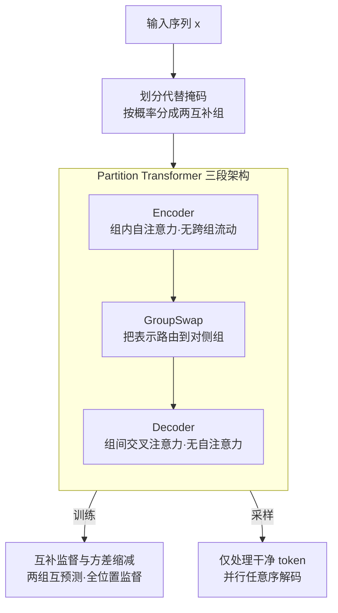

# Partition Generative Modeling: Masked Modeling Without Masks

**会议**: ICLR 2026  
**OpenReview**: [https://openreview.net/forum?id=vEh1ceS154](https://openreview.net/forum?id=vEh1ceS154)  
**代码**: 待确认  
**领域**: 生成模型 / 离散扩散 / 掩码生成模型  
**关键词**: 划分生成模型, 掩码扩散, 并行解码, 推理加速, Partition Transformer  

## 一句话总结
本文提出"划分生成模型"（PGM），用"把序列切成两个互不可见的组、互相预测"取代掩码生成模型（MGM）的 `[MASK]` 机制，从而在采样时只处理"干净 token"（像自回归模型一样省算力），同时保留并行、任意序生成（像 MGM 一样灵活）；在 OpenWebText 上比 MDLM 快 5–5.5×、生成困惑度更低，在 ImageNet 上以 7.5× 吞吐量逼近 MaskGIT 的 FID。

## 研究背景与动机

**领域现状**：掩码生成模型（MGM，文本侧如 MDLM、图像侧如 MaskGIT）相比自回归模型（ARM）有两个吸引人的优点——可以并行解码多个 token、可以任意顺序生成，而不是像 ARM 那样逐 token 从左到右。这让它们在图像、视频、音频、语言上都取得了不错的效果。

**现有痛点**：MGM 推理慢。根本原因在于：**每一步采样都要把完整长度的序列喂进模型，其中包含大量 `[MASK]` token**，而这些 `[MASK]` 本身不携带任何信息。相比之下 ARM 只处理已生成的 token。于是 MGM 在大规模、实时、以及"测试时算力扩展"（test-time compute scaling）场景下都吃亏。

**核心矛盾**：MGM 的训练-采样必须保持一致。它用双向架构在完整序列上训练，每个隐表示都依赖全部 $L$ 个位置（包括被掩码的位置）；如果在推理时为了省算力 naively 地"分块、喂更短序列"，就和训练分布不一致，样本质量会显著下降。也就是说，**"省掉 `[MASK]` 的算力"和"保持训练-采样一致 + 保留并行任意序生成"之间存在张力**。

**已有方案的不足**：每步多解码几个 token 能提吞吐，但样本质量掉；蒸馏（如 SDTT）能减少采样步数，但单步开销不变、还可能伤害多样性；Block Diffusion 通过分块生成实现部分 KV 缓存，但牺牲了任意序生成能力。没有一个方法能**在不丢 MGM 灵活性的前提下让单步采样本身变便宜**。

**核心 idea**：用"划分"代替"掩码"。把 token 分成两个不相交的组，靠一种组间互不可见的注意力机制保证信息不在两组间流动，让模型"用一组预测另一组"，从而彻底删掉 `[MASK]` token。因为两组互不交互，采样时就只需要处理"干净 token"（像 ARM），同时仍能并行、任意序生成（像 MGM）。

## 方法详解

### 整体框架
PGM 是 MGM 范式的直接扩展：训练目标、引导机制（CFG）、采样器、蒸馏方法都能直接沿用，唯一需要改的是神经网络架构。整体上，一条输入序列 $x$ 先被**按时刻 $t$ 随机划分成两个互补的组**（组 0、组 1），然后送入专门设计的 **Partition Transformer**——它由"组内自注意力的 Encoder → 交换信息的 GroupSwap 层 → 组间交叉注意力（且无自注意力）的 Decoder"三段构成，保证组 0 的预测只依赖组 1、反之亦然。训练时两组互为目标、**所有位置都产生监督信号**；采样时则只把"已确定的干净 token"喂进去，每步并行解码若干个掩码位置，再把它们并入干净集合，迭代直到生成完整序列。

### 关键设计

**1. 划分代替掩码：用"两个互不可见的组"消灭 `[MASK]` token**

MGM 的低效根源是采样时仍要处理无信息的 `[MASK]`。PGM 的做法是：给定 $x$ 和 $t\sim U[0,1]$，每个 token 以概率 $p_t = 1-\alpha_t$ 被分到组 1、否则分到组 0，用 $g\in\{0,1\}^L$ 记录组归属。然后通过架构保证"信息不能跨组流动"——组 0 位置的预测只依赖组 1 的 token，反之亦然。这和 MGM"从干净 token 预测被掩码 token"在语义上完全一致：可以把组 0 看作"干净 token"、组 1 看作"被掩码 token"，期望比例 $\alpha_t$ 的 token 落在组 0，正好对应 MDLM 前向过程中期望保持干净的比例。区别在于 PGM **同时从两组学习**，而且组里全是真实 token，于是采样时只需要喂进当前已知的那一组，`[MASK]` 被彻底删除。

**2. Partition Transformer：让"只处理一组"在架构上成为可能**

要做到"组 0 的预测只看组 1"，普通双向 Transformer 行不通（它每个位置都看全序列）。本文设计了三段式架构：

- **Encoder**：由"组内（partition-wise）自注意力"块堆叠，和标准双向块几乎一样，唯一区别是**不同组的 token 互不注意**。因此组 0 的隐表示只依赖组 0、组 1 只依赖组 1，信息仍局限在组内。
- **GroupSwap 层**：Encoder 之后信息还困在各自组里，但预测需要相反的依赖关系。GroupSwap 用交叉注意力把每个位置的表示路由到**对侧组**。为防止信息泄露，交叉注意力的 query 不能依赖对侧组的 token——本文给了两种 query 初始化：**数据无关 query**（用一个可学习向量 $u$ 复制到全序列、加位置编码、再 LN+线性投影：$V_{i;\cdot}=W(\mathrm{LN}(u+\mathrm{pos}_{i;\cdot}))+b$）和**数据相关 query**（对各组做组内聚合得 $Y_0,Y_1$，再加到对侧：$V'_{i;\cdot}=V_{i;\cdot}+Y_{1}\,(g_i{=}0)\ \text{或}\ Y_0$）。实验发现两者效果相当，最终用更简单的数据无关版本。
- **Decoder**：用交叉注意力层，key/value 来自 Encoder 输出，query 来自 GroupSwap（首块）或上一 Decoder 块。**Decoder 没有自注意力层**——这正是高效采样的关键：可以只在"将要解码的位置"上计算预测，而不必处理整组。

这套设计的本质是：把"哪些位置该看哪些位置"从"靠 `[MASK]` 占位 + 全序列双向"改成"靠物理上的组划分 + 显式的跨组路由"，从而在采样时合法地只喂一组 token。

**3. 互补监督与方差缩减：一条序列产出两份梯度信号**

由于两组互为预测目标，PGM 的训练目标对**每个位置**都计算损失，而非像 MGM 那样只在被掩码位置算损失：

$$\mathcal{L}_{\mathrm{PGM}} := \mathbb{E}_{x\sim D,\, t\sim U[0,1]}\big[w_{\mathrm{PGM}}(g,t)\,\mathrm{CE}(x_\theta(x;g;t),\,x)\big]$$

其中权重把组 0 当"干净"、组 1 当"被掩码"，于是组 1 用 MDLM 权重 $w(t)=\frac{\alpha'_t}{1-\alpha_t}$、组 0 由对称性用 $w(1-t)$。换句话说，**一次前向就在两个互补的掩码率上同时评估了 MDLM 目标**。好处是：每个训练样本贡献两份互补的梯度，等价于"在两份互补掩码副本上训练"，从而**降低梯度方差**。低方差对扩散模型的验证似然有正面作用——在 LM1B 上，同层数的 PGM 比 MDLM 验证困惑度低 1.95。论文还单独做了对照：用双倍 batch、把每条序列拆成两份互补掩码副本去训练一个标准双向 Transformer，以此隔离"互补掩码"这一项的贡献（见消融）。

**4. 仅处理干净 token 的并行采样：兼容现有 MGM 采样器与蒸馏**

采样时，记第 $\tau$ 步的干净 token 下标集合为 $C_\tau$，$n_\tau=|C_\tau|$。每步从 $p_\theta(\cdot\mid x_{C_\tau})$ 选 $k_\tau$ 个掩码位置采样、把解码结果并入 $C_{\tau+1}$，**全程只把 $C_\tau$ 里的干净 token 喂进网络**（这正是省算力的来源），同时仍是并行、任意序解码。文本上用"每步固定解码 $k$ 个 token"的调度，比 MDLM 那种按 $\frac{\alpha_s-\alpha_t}{1-\alpha_t}$ 概率逐位置解码（还需 padding 才能批量生成）质量和吞吐都更好；图像上同时支持 confidence 与 Halton 采样器，经验上 Halton 更优。由于 PGM 是 MGM 范式的扩展，CFG 引导、SDTT 蒸馏都能直接套用——蒸馏时把一组当 `[MASK]` 处理即可（这反而让设置偏向 MDLM），证明 PGM 是 MGM 的 drop-in 替代。

### 损失函数 / 训练策略
训练目标即上面的 $\mathcal{L}_{\mathrm{PGM}}$，本质是"在两个互补掩码率上同时优化的 MDLM 变分上界"。文本侧遵循 MDLM 设置：去掉时间条件的 DiT + RoPE，global batch 512、训练 1M 步、Adam（lr $3\times10^{-4}$）、EMA 0.9999；PGM 用 Partition Transformer，12/16 层、维度 768/1024、可变 encoder/decoder 层比。图像侧在 VQGAN 量化的 ImageNet256 上训练 500k 步、AdamW、CFG（class-label dropout 0.1），每组各用一个 register 以便采样时只用一个。

## 实验关键数据

### 主实验

文本（LM1B ctx 128 / OpenWebText ctx 1024，验证困惑度 + 吞吐，batch size 32）：

| 模型 | 参数量 | 验证 PPL ↓ | 延迟(s) ↓ | 吞吐(tok/s) ↑ |
|------|--------|-----------|-----------|---------------|
| MDLM (LM1B) | 170M | 27.67 | 3.78 | 1081.6 |
| **PGM 6/6 (LM1B)** | 171M | **26.80** | **2.12** | **1930.9** |
| MDLM (OWT) | 170M | 23.07 | 31.41 | 1043.2 |
| PGM 8/8 (OWT) | 203M | 22.61 | 5.86 | 5585.6 |
| **PGM 6/6 dim1024 (OWT)** | 268M | **21.43** | **5.93** | 5518.1 |

PGM 在 LM1B 上同层数即比 MDLM 低 1.95 PPL；OWT 上同层同维略逊，但加 2 层或把维度提到 1024 后反超 MDLM，**且采样吞吐至少 5× 于 MDLM**。图像（ImageNet256，Halton 采样器 + 最优 CFG）：PGM 12/12 以 7.5× 吞吐换来仅微弱 FID 退化（5.54 vs MaskGIT 5.35）；把采样步数加到 64，FID 进一步降到 **4.56**，仍比 MaskGIT 快 3.9×。

### 消融实验

| 配置 | 关键指标 | 说明 |
|------|---------|------|
| MDLM (LM1B) | PPL 27.67 | 基线 |
| MDLM† 互补掩码 (LM1B) | PPL 25.72 | 双倍 batch + 互补掩码副本，隔离"互补监督"增益 |
| PGM 6/6 (LM1B) | PPL 26.80 | 完整模型 |
| MDLM† 互补掩码 (OWT) | PPL 22.98 | OWT 上互补掩码增益较小 |
| 数据无关 query vs 数据相关 | PPL 相当 | 最终选更简单的数据无关 query |
| encoder/decoder 平衡 vs 不平衡 | 平衡更优 | 等层数的 encoder/decoder 优于不平衡 |

### 关键发现
- **互补掩码确实有用，但不是全部**：单独的"互补掩码"对照（MDLM†）在 LM1B 上把 PPL 从 27.67 降到 25.72，证明"两份互补监督"本身就降方差、提似然；但 OWT 上增益变小，且 PGM 与 MDLM† 之间仍有差距，说明当前架构还有提升空间（这也是 OWT 上需要加参数才反超的原因）。
- **省算力来自架构而非蒸馏**：未蒸馏时 PGM 就已 5–5.5× 快于 MDLM；再叠加 SDTT 五轮蒸馏后，标准祖先采样下 PGM 的生成困惑度与熵更高，nucleus 采样（p=0.9）下与 MDLM 相当，速度优势从 5× 略降到约 4.6×（nucleus 开销所致）。
- **下游任务不掉点**：在 lm-eval-harness 八个任务上，PGM 在六个任务上略优于 MDLM，蒸馏前后整体相当——说明加速没有牺牲下游能力。

## 亮点与洞察
- **把"掩码"重新诠释为"划分"**：最"啊哈"的一点是——`[MASK]` 在 MGM 里其实是"占位让模型知道哪要预测"，而 PGM 发现只要架构能保证"组间不可见"，根本不需要占位符，干净 token 自己就能当条件。这等于发现了 MGM 里一笔被浪费的算力。
- **一次前向两份监督**：把"互补掩码"做进架构后，免费获得方差缩减——这是个可迁移到其他离散扩散/掩码建模的训练 trick。
- **drop-in 兼容生态**：保留了对 CFG、Halton/confidence 采样器、SDTT 蒸馏的兼容，意味着已有 MGM 工程几乎零成本迁移，这对落地很重要。
- **Decoder 去掉自注意力**：一个很干净的工程取舍——正因为 Decoder 无自注意力，采样时才能只在待解码位置算预测，是吞吐提升的直接来源。

## 局限与展望
- **架构仍未触及上界**：互补掩码对照表明 PGM 与"理想互补监督"之间有 gap，尤其在 OWT 上需要靠增参数才反超 MDLM，说明 Partition Transformer 还有改进余地。
- **OWT 上互补监督增益偏小且原因未明**：作者只在附录给了"为什么 LM1B 受益更大、OWT 较小"的初步探索，机制尚不清楚。
- **蒸馏未为 PGM 量身定制**：SDTT 蒸馏时把一组当 `[MASK]`，设置反而偏向 MDLM，PGM 专属蒸馏策略留作未来工作。
- **参数量略增**：为在 OWT 反超需要更多参数（如 268M vs 170M），虽然采样仍快 5×，但参数开销是事实成本。

## 相关工作与启发
- **vs MDLM / 掩码扩散语言模型**：MDLM 用 `[MASK]` 腐蚀 + 全序列双向去噪，采样每步处理满长度；PGM 用划分代替掩码、采样只处理干净 token，同层数下还因互补监督降方差、PPL 更低、吞吐 5×+。
- **vs MaskGIT**：MaskGIT 在 VQGAN 隐空间用置信度调度逐步揭开 token，采样仍处理全序列；PGM 以 7.5× 吞吐逼近其 FID，并兼容其 Halton 采样器。
- **vs Block Diffusion**：BD 靠分块生成实现部分 KV 缓存来加速，但牺牲了任意序生成；PGM 既省单步算力又保留并行任意序生成，是更彻底的"两全"方案。
- **vs 蒸馏类加速（SDTT 等）**：蒸馏减少步数但单步开销不变；PGM 让单步本身更便宜，二者正交、可叠加。

## 评分
- 新颖性: ⭐⭐⭐⭐⭐ "划分代替掩码"是对 MGM 范式的简洁而本质的重构，删掉 `[MASK]` 的视角很巧。
- 实验充分度: ⭐⭐⭐⭐ 文本+图像双模态、蒸馏前后、下游任务、互补掩码隔离对照都齐，但 OWT 增益机制未讲清。
- 写作质量: ⭐⭐⭐⭐ 动机-架构-实验链条清晰，三段式架构图解到位。
- 价值: ⭐⭐⭐⭐⭐ drop-in 替代 MGM 且 5–7.5× 加速，对离散扩散落地与 test-time 扩展很有现实意义。

<!-- RELATED:START -->

## 相关论文

- [\[ICLR 2026\] LapFlow: Laplacian Multi-scale Flow Matching for Generative Modeling](lapflow_laplacian_multi-scale_flow_matching_for_generative_modeling.md)
- [\[ICLR 2026\] Flow Along the $K$-Amplitude for Generative Modeling](flow_along_the_k-amplitude_for_generative_modeling.md)
- [\[ICLR 2026\] GenCP: Towards Generative Modeling Paradigm of Coupled Physics](gencp_towards_generative_modeling_paradigm_of_coupled_physics.md)
- [\[ICLR 2026\] Continuously Augmented Discrete Diffusion model for Categorical Generative Modeling](continuously_augmented_discrete_diffusion_model_for_categorical_generative_model.md)
- [\[ICLR 2026\] Mirror Flow Matching with Heavy-Tailed Priors for Generative Modeling on Convex Domains](mirror_flow_matching_with_heavy-tailed_priors_for_generative_modeling_on_convex_.md)

<!-- RELATED:END -->
