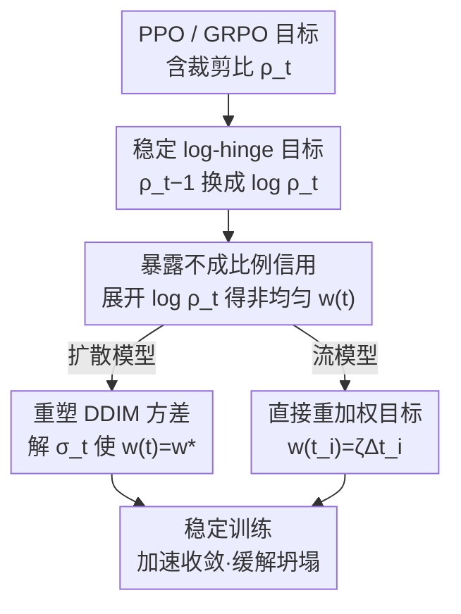

# PCPO: Proportionate Credit Policy Optimization for Preference Alignment of Image Generation Models

**会议**: ICLR 2026  
**OpenReview**: [https://openreview.net/forum?id=alY08iknli](https://openreview.net/forum?id=alY08iknli)  
**代码**: https://github.com/jaylee2000/pcpo/  
**领域**: 扩散模型 / 对齐RLHF  
**关键词**: 文生图对齐, 策略梯度, GRPO, 信用分配, 模型坍塌

## 一句话总结
本文发现把策略梯度（PPO/GRPO）用到扩散/流模型对齐时，采样器的数学结构会给不同去噪时间步分配**严重不成比例的信用权重** $w(t)$，是训练不稳定与模型坍塌的根因；PCPO 通过「数值更稳的 log-hinge 目标重构 + 让各时间步权重趋于均匀的有原则重加权」来修正这一点，从而显著加速收敛、缓解坍塌、在 DanceGRPO 等 SOTA 基线上全面胜出。

## 研究背景与动机
**领域现状**：强化学习（尤其是从 LLM 迁移来的 GRPO）已成为对齐文生图（T2I）扩散/流模型的主流在线策略梯度框架——采一组样本，按奖励做组内归一化得到优势 $\hat{A}=(r-\mu_G)/\sigma_G$，再用裁剪过的重要性采样比 $\rho_t$ 做策略更新。

**现有痛点**：GRPO 类方法在 T2I 上常遇到**训练不稳定**和**模型坍塌**——要么样本多样性被耗尽（mode collapse，熵被奖励榨干），要么为了刷高奖励而牺牲整体保真度（reward hacking，产生伪影和不真实输出）。这限制了收敛速度，也压低了最终图像质量。

**核心矛盾**：作者把不稳定追到两个根因。其一，标准目标里 $\rho_t-1$ 这类项数值精度差，会扭曲梯度幅度。其二、也更关键：把策略梯度套到生成采样器上时，采样器自身的数学结构导致**不成比例的信用分配**——每个时间步的梯度贡献被一个**与噪声 schedule 绑定、跨时间步相差数个量级**的"原生权重" $w(t)$ 缩放。这个权重不是刻意设计的信用策略，纯粹是采样器数学的副产物，却让不同步的梯度被不一致地放大，幅度最大的梯度又被裁剪得格外频繁，制造出高方差的学习信号。

**本文目标**：同时修掉数值不稳和不成比例信用这两个问题，让训练稳下来。

**切入角度**：类比经典 REINFORCE——参数更新应正比于"资格向量"乘以各动作的贡献，而该贡献通常被假设为**均匀**。扩散采样器的梯度形式与之同构，唯一的反常就是多了个非均匀的 $w(t)$。那么只要把 $w(t)$ 拉成常数，就能恢复"成比例的信用分配"。

**核心 idea**：用 $\log\rho_t$ 替换数值不稳的 $\rho_t-1$ 得到稳定的 log-hinge 目标，再通过重塑方差 schedule（扩散）或直接重加权目标（流模型）把各时间步权重 $w(t)$ 拉成均匀，从而让信用分配成比例。

## 方法详解

### 整体框架
PCPO 不改奖励模型、不改 GRPO 的组内归一化，只动**策略比 $\rho_t$ 及其背后的信用分配机制**（因此推导用更简洁的 PPO 记号即可，结论对 GRPO 同样成立）。整条 pipeline 是：先把 PPO 目标等价改写成 hinge 损失，把里面数值不稳的 $\rho_t-1$ 换成 $\log\rho_t$ 得到稳定的 **log-hinge 目标**；接着把 $\log\rho_t$ 按 Proposition 1 展开，**暴露出**每个时间步被一个非均匀原生权重 $w(t)$ 缩放——这就是不成比例信用的来源；最后按"权重应当均匀"的原则做修正，但对两类模型走不同路线：**扩散模型**重新设计 DDIM 方差 schedule $\tilde\sigma_t$ 让 $w(t)$ 变常数，**流模型**因方差 schedule 改动代价太大，转而**直接重加权训练目标**。修正后训练裁剪比更低更稳，收敛更快、坍塌更少。

### 关键设计

**1. 稳定的 log-hinge 目标重构：把数值不稳的 $\rho_t-1$ 换成 $\log\rho_t$**

PPO 目标的梯度等价于一个 hinge 损失 $L_{\text{hinge}}=\mathbb{E}[\sum_t \max\{0,\ \xi|A|-A(\rho_t-1)\}]$。其中 $\rho_t-1$ 在数值上不稳——$\rho_t$ 接近 1 时两个大数相减会放大浮点误差，扭曲梯度幅度。PCPO 把它替换成更稳健的 $\log\rho_t$，得到

$$L_{\text{PCPO-base}}(\theta):=\mathbb{E}\Big[\sum_{t=1}^{T}\max\big(0,\ \xi|A|-A\log\rho_t\big)\Big].$$

这一替换有两重依据：一是在 hinge 损失视角下该项相当于一个可替换的"分类器"，换函数不破坏核心机制；二是在小步更新下 $\log\rho_t\approx\rho_t-1$ 是合理的一阶 Taylor 近似（实验中由小裁剪范围保证，作者实测近似误差始终不超过 1.2%）。它单独就把"数值精度扭曲梯度"这条根因消掉了。

**2. 揭示不成比例的信用分配：把 $\log\rho_t$ 展开看到非均匀权重 $w(t)$**

真正棘手的不稳藏在 $\log\rho_t$ 内部。Proposition 1 对 DDIM 采样把它展开为

$$\log\rho_t=-\Big[w(t)(\hat\varepsilon_\theta^{(t)}-\hat\varepsilon_{\text{old}}^{(t)})\cdot\epsilon_{\text{old}}^{(t)}+\tfrac12 w(t)(\hat\varepsilon_\theta^{(t)}-\hat\varepsilon_{\text{old}}^{(t)})^2\Big],\quad w(t)=\frac{C(t)}{\sigma_t},$$

其中 $\hat\varepsilon$ 是去噪器的噪声预测、$\epsilon_{\text{old}}$ 是旧策略采样时的高斯噪声，$C(t)=\frac{\sqrt{1-\bar\alpha_t}}{\sqrt{\alpha_t}}-\sqrt{1-\bar\alpha_{t-1}-\sigma_t^2}>0$。代回目标后，PPO 损失变成一个 $\varepsilon$-匹配损失，每个时间步的梯度贡献都被 $w(t)$ 缩放。关键在于：$w(t)$ **跨时间步相差数个量级**（Figure 2a），它是采样器噪声 schedule 的产物、与该步的实际重要性无关。这就解释了为何梯度被不一致放大、最大者又被频繁裁剪——这是定位根因的核心命题，也是后两个设计的修正靶点。

**3. 扩散模型：重塑 DDIM 方差 schedule 让权重均匀**

既然不稳来自非均匀的 $w(t)=C(t)/\sigma_t$，而标准 DDIM 里 $\alpha_t$（决定 $C(t)$）是固定的，方程里唯一可自由调的就是方差 $\sigma_t$。PCPO 反过来：给定目标常数权重 $w^\star$，对每个时间步直接解出能产出该权重的 $\sigma_t$，得到一条新的方差信号 $\tilde\sigma_t$，使所有步的 $w(t)\equiv w^\star$。为公平对比、隔离"均匀加权"本身的效果，$w^\star$ 被重标定到原非均匀权重的均值（实验中约 $w^\star=4.5$）。这条新 $\tilde\sigma_t$ 与原 schedule 很接近，是一个**几乎不退化采样质量的微调**，却把信用分配拉回成比例。

**4. 流模型：直接重加权训练目标，绕开方差 schedule 大改**

流匹配模型通过反向 SDE 引入随机性，其单步 $\log\rho_t$ 形式与扩散类似，但权重 $w(t_i)=\frac{\sqrt{\Delta t_i}}{\sigma_{t_i}}\big(1+\frac{(1-t_i)\sigma_{t_i}^2}{2t_i}\big)$。问题更复杂：高分辨率合成用的 timestep shifting 会造成**非均匀的积分区间** $\Delta t_i$，使原生权重高度不成比例（$w(t_i)\propto\sqrt{\Delta t_i}$）。此时若照扩散的办法去改方差 schedule 或 shifting 策略，会大幅偏离原本调好的采样流程，代价过高。于是 PCPO 换一条路：不改采样器，**直接在训练目标上重加权**。Proposition 2 给出让信用正比于积分区间 $\Delta t_i$ 的权重

$$w(t_i)=\zeta\Delta t_i,\quad \zeta=\sum_{i=1}^{N}\frac{\sqrt{\Delta t_i}}{\sigma_{t_i}}\Big(1+\frac{(1-t_i)\sigma_{t_i}^2}{2t_i}\Big).$$

这套权重对 DanceGRPO SDE（$N=16,\eta=0.3$，$\zeta=13.343$）和 Flow-GRPO SDE（$N=10,\eta=0.7$，$\zeta=4.315$）都给出成比例的时间步权重（Figure 2c,d），实现与扩散端同样的"均匀信用"目标，只是手段从"改采样器"换成"改目标"。

### 损失函数 / 训练策略
最终训练目标是把均匀化后的权重代入 log-hinge 形式：扩散端用重塑后的 $\tilde\sigma_t$ 让 $w(t)$ 恒为 $w^\star$；流模型端用 $w(t_i)=\zeta\Delta t_i$ 重加权 $\varepsilon$-匹配项。沿用前人做法省略 KL 惩罚项以简化（流模型的 SD3.5-M 泛化实验例外，带辅助 KL 项）。裁剪范围取得较小以保证 $\log\rho_t\approx\rho_t-1$ 的近似成立。

## 实验关键数据

主分析覆盖两套框架：DDPO（SD1.5，奖励用 Aesthetics 与 BERTScore）和 SOTA 的 DanceGRPO（SD1.4 与 FLUX.1-dev，奖励用 HPSv2.1），并在 Flow-GRPO（SD3.5-M）上验证泛化。

### 主实验

训练效率（达到相同目标奖励所需 epoch，越少越快）：

| 框架 / 奖励 | 目标奖励 | 基线 epoch | PCPO epoch | 加速 |
|-------------|----------|-----------|-----------|------|
| DDPO / Aesthetics | 6.90 | 147 | 118 | 24.6% |
| DDPO / BERTScore | 0.52 | 191 | 146 | 30.8% |
| DanceGRPO(SD1.4) / HPS | 0.370 | 236 | 188 | 25.5% |
| DanceGRPO(FLUX) / HPS | 0.360 | 209 | 148 | 41.2% |

样本质量（匹配奖励水平下，FID/FDDINO 越低越好；DanceGRPO 评测中 PCPO 被刻意置于劣势）：

| 设置 | 方法 | FID↓ | FDDINO↓ | LPIPS |
|------|------|------|---------|-------|
| DanceGRPO SD1.4 | 基线 | 90.34 | 1078.42 | 0.4948 |
| DanceGRPO SD1.4 | PCPO | 84.74 | 1035.45 | 0.4894 |
| DanceGRPO FLUX | 基线 | 46.23 | 539.83 | 0.5736 |
| DanceGRPO FLUX | PCPO | 40.38 | 438.88 | 0.5708 |
| DDPO bs256 | 基线 | 31.72 | 473.17 | 0.6208 |
| DDPO bs256 | PCPO | 27.86 | 461.69 | 0.6262 |

### 消融实验

| 配置 | 关键指标 | 说明 |
|------|---------|------|
| 完整 PCPO | 裁剪比更低更稳 + FID↓ | log-hinge + 均匀权重 |
| 仅 log-hinge（base） | 数值更稳但仍有高方差 | 没修不成比例信用 |
| 基线（PPO/GRPO 原目标） | 裁剪比高、收敛慢、易坍塌 | 非均匀 $w(t)$ 未修正 |

用线性混合模型（LMM）做统计检验，DDPO(Aesthetics) 上 Algorithm 对 FID 的系数 $\beta=-7.750$（$p=0.047$，显著）、对 IS* 系数 $-0.241$（$p=0.021$，显著）；FDDINO 改善方向一致但不显著（$p=0.247$），作者归因于该指标在此简单 prompt/基模设定下不敏感。

### 关键发现
- **裁剪比是稳定性的直接证据**：PCPO 在所有设置下都维持更低、更平稳的裁剪比（Figure 3），这正是它收敛更快的关键——把"梯度被不一致放大→频繁裁剪"的恶性循环切断了。
- **加速幅度与权重非均匀程度相关**：在 FLUX 这种高分辨率、timestep shifting 导致权重最不成比例的设定上，PCPO 加速最明显（41.2%），印证"修不成比例信用"确实是收益来源。
- **质量提升来自缓解坍塌**：匹配奖励水平下 FID/FDDINO 普遍下降，说明改进不是靠刷奖励，而是真的减少了 reward hacking 与多样性丧失。

## 亮点与洞察
- **把"训练不稳"归因到采样器数学结构，而非优化器**：作者没有泛泛归咎于"RL 难训"，而是精确指出 $\log\rho_t$ 展开后 $w(t)$ 跨步相差数量级才是元凶——把现象级问题落到一个可写出闭式的权重上，这是全文最"啊哈"的地方。
- **REINFORCE 类比给出"权重应均匀"的第一性依据**：把扩散采样器的梯度对应到资格向量 × 贡献，论证非均匀 $w(t)$ 是 artifact 而非合理信用，使"拉成常数"不是 trick 而有理论支撑；作者称这比 TempFlow-GRPO 的经验启发更根本，能解释后者失效的情形。
- **对两类模型分而治之的工程判断**：扩散端改方差 schedule 代价小就改采样器；流模型端改采样器代价大就改目标——同一"成比例信用"原则、两种落地，可迁移到任何"采样器结构污染了信用分配"的生成式 RL 场景。

## 局限与展望
- 推导以 DDIM / 一阶 Euler-Maruyama 离散为基础，对其他采样器/高阶离散的成比例权重需另行推导。
- $w^\star$ 被重标定到原权重均值是为公平对比，最优常数权重是否就是均值、是否还有更好取值，文中未深究。
- FDDINO 在部分设定下不显著，作者归因于指标/基模敏感性，但也说明"缓解坍塌"的量化在弱基模上不够稳健。
- 流模型端用近似处理 $t=1$ 处的除零（$\sigma_t=\eta\sqrt{t/(1-t)}$），端点权重是近似值。

## 相关工作与启发
- **vs DanceGRPO / Flow-GRPO**：它们是被改进的 SOTA 基线，沿用各自原生（非均匀）时间步权重；PCPO 在不改其采样器的前提下，仅重加权目标就同时提速并提质。
- **vs TempFlow-GRPO / MixGRPO**：二者也想改善信用分配（轨迹分支 / 滑动 SDE 窗口聚焦高影响时间步），但偏经验启发；本文的 Proposition 2 比例性原则被作者主张为更根本的解释，能覆盖经验启发失效的情形。
- **vs DPO**：DPO 是无奖励的成对偏好监督、更稳但性能上界被策略梯度方法压制；PCPO 走稳定化策略梯度这条更高上界的路线。

## 评分
- 新颖性: ⭐⭐⭐⭐⭐ 把不稳定精确归因到采样器导出的非均匀权重，并给出闭式的成比例修正，视角新且根本。
- 实验充分度: ⭐⭐⭐⭐ 覆盖 DDPO/DanceGRPO/Flow-GRPO 多框架多基模，含 LMM 统计检验，但部分指标不显著。
- 写作质量: ⭐⭐⭐⭐ 推导清晰、命题分明、图示直观地展示权重重标定。
- 价值: ⭐⭐⭐⭐⭐ 即插式稳定化模块，对 T2I 对齐的训练效率与抗坍塌有直接实用价值。

<!-- RELATED:START -->

## 相关论文

- [\[ICLR 2026\] PCPO: Proportionate Credit Policy Optimization for Aligning Image Generation Models](pcpo_proportionate_credit_policy_optimization_for_aligning_image_generation_mode.md)
- [\[ICLR 2026\] Reinforcing Diffusion Models by Direct Group Preference Optimization](reinforcing_diffusion_models_by_direct_group_preference_optimization.md)
- [\[ICLR 2026\] Group Critical-token Policy Optimization for Autoregressive Image Generation](group_critical-token_policy_optimization_for_autoregressive_image_generation.md)
- [\[ICLR 2026\] TempFlow-GRPO: When Timing Matters for GRPO in Flow Models](tempflow-grpo_when_timing_matters_for_grpo_in_flow_models.md)
- [\[ICLR 2026\] TreeGRPO: Tree-Advantage GRPO for Online RL Post-Training of Diffusion Models](treegrpo_tree-advantage_grpo_for_online_rl_post-training_of_diffusion_models.md)

<!-- RELATED:END -->
