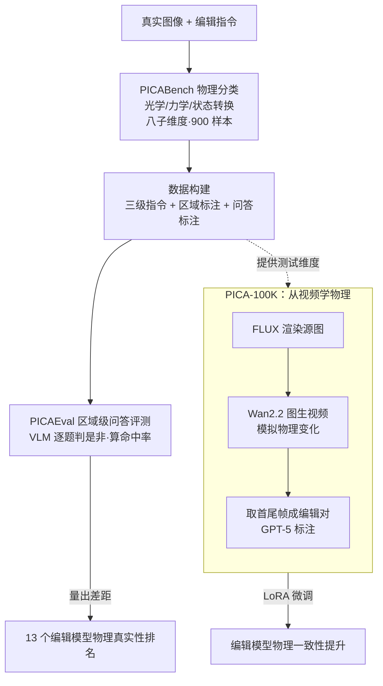

# PICABench: How Far are We from Physically Realistic Image Editing?

**会议**: ICLR 2026  
**OpenReview**: [https://openreview.net/forum?id=AWxI5xnuZB](https://openreview.net/forum?id=AWxI5xnuZB)  
**项目页**: [https://pica-research.github.io](https://pica-research.github.io)  
**代码**: 待确认  
**领域**: 图像生成 / 图像编辑 / 评测基准  
**关键词**: 物理真实性、指令编辑、VLM-as-a-judge、视频数据、区域级评测

## 一句话总结
本文指出当前指令式图像编辑模型只追"语义对不对"而忽视"物理像不像"（删了物体却没删影子和倒影），于是构建了覆盖光学/力学/状态转换三大维度共八个子维度的 PICABench 基准、配套区域级问答评测协议 PICAEval，并用"文生图渲染场景 + 图生视频模拟物理变化"自动造出 PICA-100K 训练集，把现有编辑模型微调到物理一致性显著提升。

## 研究背景与动机

**领域现状**：指令式图像编辑（instruction-based image editing）这两年进步很快，FLUX.1 Kontext、Qwen-Image-Edit、Step1X-Edit 等开源模型，以及 GPT-Image-1、Nano Banana、Seedream 4.0 等闭源系统，都能跟着自然语言把"加一个物体""换成夏天"这类复杂指令执行得语义连贯、画面好看。

**现有痛点**：但"编辑得真实"不只看语义对不对，还要看附带的物理效应渲染得对不对。删掉一盏灯，它投下的影子、在桌面上的反光、对周围物体的照明都该一起消失；把船往右移，水面倒影也要跟着移。现实里这些物理副作用恰恰是真实感的关键，而现有模型经常顾此失彼——指令完成了，影子还在、倒影错位、形变不合理。

**核心矛盾**：问题的根源是现有基准只奖励语义保真和视觉一致，几乎不惩罚物理违例。少数尝试探查"科学合理性"的基准（如某些化学/物理知识题）又跑偏到专业科学领域，和普通用户的日常编辑场景脱节。于是社区根本没有一把尺子能回答"我们离物理真实的编辑还有多远"。

**本文目标**：(1) 造一个贴近真实编辑操作、又能细粒度诊断物理违例的基准；(2) 设计一个可靠、可解释、对细微物理错误敏感的自动评测协议；(3) 给出一个能真正改善物理一致性的训练方案。

**切入角度**：作者把"物理真实"拆成三个直观且常被忽视的维度——光学、力学、状态转换，每个维度都给出具体可核查的判据；同时观察到视频天然蕴含物理动态规律，可以从视频里"偷"出符合物理的编辑对来当训练信号。

**核心 idea**：用"区域级、绑定具体物理现象的二值问答"代替笼统的"这张编辑对不对"来评测物理真实性，并用"文生图当场景渲染器 + 图生视频当状态转换模拟器"自动合成带物理监督信号的编辑数据。

## 方法详解

### 整体框架
本文不是提一个新编辑模型，而是搭一套"评测 + 数据"的完整设施。它分三块：第一块 **PICABench** 定义"物理真实"该怎么分类、收哪些测试样本（900 条，覆盖三大维度八子维度）；第二块 **PICAEval** 解决"怎么自动且可靠地判一张编辑图物理对不对"，做法是把每条样本拆成若干绑定关键区域的是非问答，交给 VLM 逐题作答再算命中率；第三块 **PICA-100K** 解决"怎么让模型变好"，用纯合成视频管线造 10 万条物理编辑对来微调现有模型。三块串起来就是"先有尺子量出差距，再有数据补上差距"。

### 关键设计

**1. PICABench 物理分类与基准：把"物理真实"拆成可核查的八子维度**

针对"现有基准只测语义、无法定位物理违例"这个痛点，作者把物理一致性拆成三个直观维度并细化到八个带具体判据的子维度。**光学（Optics）**管光的行为，含光传播（Light Propagation，主要是阴影方向与遮挡）、反射（Reflection，依赖视角与形状）、折射（Refraction，透明介质后的背景畸变）、光源效应（Light Source Effects，新增光源的颜色/柔和度/衰减）。**力学（Mechanics）**管物体的物理响应，含形变（Deformation，刚体保形、弹性体平滑变形且纹理一致）和因果（Causality，力的重分布、对增删刺激的反应等）。**状态转换（State Transition）**管环境与材质变化，分全局（GST，如时间/季节/天气改变，要求全场景光照植被等协调更新）和局部（LST，如打湿、烘干、融化、燃烧、冷冻等限定在特定物体上的变化）。整个基准 900 条样本覆盖增/删/改属性等常见编辑操作，每条都被映射到至少一个子维度，从而能对"模型在哪类物理上栽跟头"做定向诊断，而不是只给一个笼统分数。

**2. 三级指令的数据构建：从"只下命令"到"明说预期"探测模型的物理先验**

光有分类还不够，关键是怎么把每张图配上能精准触发某类物理效应、又贴近真实使用的指令。数据构建分两步：先用 GPT-5 把对应八子维度的种子词表扩成涵盖材质、光照情境、长尾现象的丰富关键词，去授权和公开图库里检索出有显著物理线索（强方向光、透明/反光介质、可形变物体、可相变物质）的多样图像，再由人工去重、去伪、打子维度标签。第二步给每张图配一条人写的、扎根场景物理可供性的编辑指令，并用 GPT-5 扩成三个复杂度等级：**superficial**（只下命令、不解释，探测模型内在物理先验，也最贴近真实场景，是默认评测设置）、**intermediate**（附一句基于物理规则的简短理由，当激活物理知识的推理提示）、**explicit**（进一步描述期望的编辑结果，把歧义压到最低，纯考视觉执行力）。三级指令的意义在于：它不只问"模型能否执行表面命令"，还能拆出"模型到底有没有把物理知识内化"——若给了理由仍不会做，说明缺的是内化的物理原理而非信息。

**3. PICAEval 区域级问答评测：用绑定关键区域的是非问答替代笼统打分**

评测物理真实性比评语义难，因为它依赖编辑内容与原场景隐含物理约束的对齐、且没有参考图当 ground truth，直接问 VLM"这编辑对吗"往往得到含糊或幻觉的回答。PICAEval 的做法是把每条样本分解成多个**区域绑定的二值问题**：人工先在输入图上标出编辑后应出现物理证据的关键区域（反射面、形变区、投影区等），再由 GPT-5 据指令和区域生成每条 4–5 个是非问答对（人工复核清晰度与覆盖度）；测试时把编辑图、指令、区域、问题一起喂给 VLM（如 GPT-5），让它只就区域内可见内容作答。最终分数就是 VLM 答案与参考标签**精确匹配的问题占比**。这套协议有三点好处：空间锚定降低幻觉、分解提升可解释性与鲁棒性、问答形式更贴合人类"靠局部具体核查来判物理合理"的方式。一致性（Consistency）指标则单独算——把预测的编辑区掩掉，在非编辑区算 PSNR（dB），衡量模型有没有改坏不该动的地方。人类 Elo 研究验证 PICAEval-GPT5 与人偏好的 Pearson 相关达 0.95，明显高于不带区域标注的基线 0.88。

**4. PICA-100K 从视频学物理：文生图渲染 + 图生视频模拟，自造物理编辑对**

要让模型变好就得有物理监督信号，但真实世界的物理编辑数据采集极贵。作者用纯合成管线绕过这个问题：先构建主体词典和场景词典（如"一个茶壶""一张黑色厨房桌"），用手工 T2I 模板配对、GPT-5 精炼后交给 FLUX.1-Krea-dev 生成既真实又多样的静态源图；再设计图生视频（I2V）指令模板描述合理的运动变化（旋转、移动、倾倒、风中摇摆等），用 GPT-5 扩写后交给 Wan2.2-14B-I2V 合成短视频来模拟物理过程；最后取每段视频的**首帧和末帧**构成（源图，编辑图）对，配上指令、由 GPT-5 自动把末帧标为期望输出。最终得到 105,085 条跨八类物理的编辑样本。它和同样用视频先验的工作（如主打非刚性大运动的 ByteMorph、训练-free 的零样本方法）不同之处在于：明确瞄准"物理真实"这一隐式现实规律，且管线可控、非编辑区更稳定。用 LoRA（rank 256）微调 FLUX.1-Kontext-dev 和 Qwen-Image-Edit 即可显著提升物理一致性而不牺牲语义。

## 实验关键数据

### 主实验
在 PICABench-Superficial 上用 GPT-5 当评测器，评了 13 个开闭源模型。指标为 Accuracy（%，物理判对率）和 Consistency（dB，非编辑区 PSNR）。

| 模型 | Overall Acc ↑ | Overall Con ↑ | 说明 |
|------|------|------|------|
| GPT-Image-1.5 | 67.05 | 21.73 | 闭源最强 |
| Nano Banana Pro | 66.16 | 22.97 | 闭源次强 |
| Seedream 4.0 | 61.91 | 23.26 | 闭源 |
| GPT-Image-1 | 61.08 | 15.48 | 闭源 |
| Nano Banana | 59.87 | 23.47 | 闭源 |
| Qwen-Image-Edit | 58.29 | 19.43 | 开源最强 |
| Flux.1 Kontext | 48.93 | 24.57 | 开源基线 |
| Bagel-Think | 46.48 | 26.88 | 统一架构 |
| OmniGen2 | 46.79 | 24.12 | 统一架构 |
| Uniworld-V1 | 37.68 | 18.48 | 统一架构最弱 |

核心结论：闭源模型几个能过 60，但远未饱和；所有开源模型 superficial 设置下均不到 60，物理真实性仍是公开难题。

### 消融实验

| 配置 | Overall Acc | Overall Con | 说明 |
|------|---------|---------|------|
| Flux.1 Kontext（基线） | 48.93 | 24.57 | 未微调 |
| + PICA-100K（本文合成数据） | 50.64 | 25.23 | Acc +1.71，Con +0.66 |
| + MIRA400K（真实视频数据） | 46.96 | 32.08 | Acc 反降 1.97 |
| Qwen-Image-Edit（基线） | 58.29 | 19.43 | 未微调 |
| + PICA-100K | 62.13 | 21.91 | Acc +3.84，把开源模型推过 60 |

### 关键发现
- **理解强 ≠ 物理真实**：统一多模态架构（Bagel/OmniGen2/Uniworld）整体不如专用编辑模型，说明"更强的世界理解"并不自动转化为物理真实，如何把理解和生成有效耦合仍是开放问题。
- **指令越细，执行越好但一致性下降**：从 superficial→intermediate→explicit，准确率单调上升（如 Bagel 45.07→54.06→65.61），但 Consistency 下降，反映"提升物理真实"与"保住非编辑区"存在 trade-off；且 intermediate 增益小于 explicit，作者推测是模型缺乏内化的物理原理、用不上额外的推理线索。
- **合成视频数据胜过真实视频数据**：在同样设置下，用真实视频造的 MIRA400K 微调反而把准确率拉低（48.93→46.96），凸显本文"定向合成、非编辑区可控"管线的有效性；不过 PICA-100K 在全局状态转换准确率和因果一致性上略降，作者归因于仅用首尾帧难以表达有意义的中间状态变化。

## 亮点与洞察
- **把"物理真实"从模糊概念落地成八个可核查判据**：这是全文最大贡献——以前大家都知道"编辑要物理合理"，但没人能把它拆成光传播/反射/折射/形变/因果/状态转换这种可逐条打分的维度，有了它才谈得上诊断和优化。
- **区域级二值问答是个很可迁移的评测范式**：把"图对不对"这种主观大问题，分解成"这个区域里有没有 X"的一堆是非小问题并锚定 ROI，既降幻觉又可解释，0.95 的人类相关性证明其可靠；这套思路可直接迁到任何"没有参考图、要判局部正确性"的生成评测（如视频编辑、3D 编辑）。
- **"文生图当渲染器 + 图生视频当物理模拟器"的造数据思路很巧**：它把视频生成模型逼近世界模拟器的能力转化成了带物理监督的编辑对，绕开了真实物理数据采集的天价成本，而且实验直接证明合成定向数据比真实视频数据更管用，反直觉但有说服力。

## 局限与展望
- 作者承认：PICA-100K 用的生成管线相对简单、规模仍有限；模型只用 SFT 训练，增益温和、没榨干数据潜力；当前框架只支持单图输入，无法处理多图/多条件上下文。
- 自己发现的局限：物理判定最终依赖 GPT-5 这类 VLM 当裁判，评测分数会受裁判模型能力与偏置影响，且 PICAEval 的参考答案由 GPT-5 生成+人工复核，标注成本和潜在偏差并存；仅取视频首尾帧也丢掉了中间状态信息，导致全局状态转换/因果反而略降。
- 改进思路：作者计划增强数据管线、探索 RL 后训练、扩展到更丰富的条件格式；引入中间帧/多帧监督、把一致性 trade-off 显式建模进训练目标也是自然的下一步。

## 相关工作与启发
- **vs 传统语义/像素级评测（CLIP/DINO/PSNR）**：它们测相似度但抓不住细粒度语义对齐，更完全无视物理违例；本文用区域级物理问答补上这块盲区。
- **vs 现有 VLM-as-a-Judge 基准**：它们用笼统提示给多维打分，对"不真实光照/形变/物体交互"不敏感、易被好看但不合理的输出骗过；PICAEval 用空间锚定+分解问答显著提升了对细微物理错误的敏感度。
- **vs ByteMorph / UniReal 等视频先验编辑工作**：ByteMorph 主打非刚性大运动，可能损害非编辑区稳定性；本文 PICA-100K 瞄准隐式物理规律、管线可控且保非编辑区稳定，且证明定向合成数据优于真实视频构建的 MIRA400K。

## 评分
- 新颖性: ⭐⭐⭐⭐⭐ 首次把"物理真实"系统拆解成八子维度并配套区域级问答评测，填补编辑评测空白
- 实验充分度: ⭐⭐⭐⭐ 评了 13 个主流模型 + 三级指令 + 合成/真实数据对照，但模型侧仅 SFT、规模有限
- 写作质量: ⭐⭐⭐⭐ 动机清晰、图表完整、taxonomy 讲得透
- 价值: ⭐⭐⭐⭐⭐ 基准 + 评测协议 + 数据集三件套，能直接推动整个编辑社区从语义走向物理

<!-- RELATED:START -->

## 相关论文

- [\[ICLR 2026\] Does FLUX Already Know How to Perform Physically Plausible Image Composition?](does_flux_already_know_how_to_perform_physically_plausible_image_composition.md)
- [\[CVPR 2025\] IDEA-Bench: How Far are Generative Models from Professional Designing?](../../CVPR2025/image_generation/idea-bench_how_far_are_generative_models_from_professional_designing.md)
- [\[ICLR 2026\] Forward-Learned Discrete Diffusion: Learning how to noise to denoise faster](forward-learned_discrete_diffusion_learning_how_to_noise_to_denoise_faster.md)
- [\[ICLR 2026\] Charts Are Not Images: On the Challenges of Scientific Chart Editing](charts_are_not_images_on_the_challenges_of_scientific_chart_editing.md)
- [\[ICLR 2026\] LaTo: Landmark-tokenized Diffusion Transformer for Fine-grained Human Face Editing](lato_landmark-tokenized_diffusion_transformer_for_fine-grained_human_face_editin.md)

<!-- RELATED:END -->
