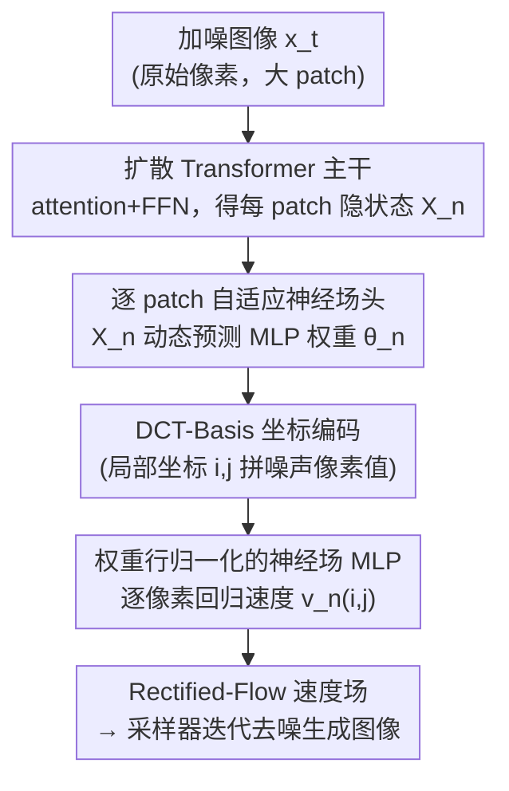

# PixNerd: Pixel Neural Field Diffusion

**会议**: ICLR 2026  
**OpenReview**: [https://openreview.net/forum?id=BDnOrExHmt](https://openreview.net/forum?id=BDnOrExHmt)  
**代码**: https://github.com/MCG-NJU/PixNerd （有）  
**领域**: 扩散模型 / 图像生成  
**关键词**: 像素空间扩散、神经场、Diffusion Transformer、大 patch、端到端

## 一句话总结
PixNerd 把扩散 Transformer 最后那层线性投影换成一个由 Transformer 特征动态生成权重的"逐 patch 隐式神经场头"，用它去解码大 patch 内部的精细像素，从而在不依赖 VAE、不搞级联多尺度的前提下，单阶段端到端地在原始像素空间做扩散，在 ImageNet 256×256 上拿到 1.93 FID，延迟比此前像素扩散模型低近 8 倍。

## 研究背景与动机
**领域现状**：当下高质量扩散 Transformer（DiT、SiT、REPA、DDT 等）几乎都建立在一个预训练 VAE 压出来的紧致隐空间上。VAE 把原始像素的空间分辨率大幅压缩，给出一个近乎无损的小尺寸 latent，扩散模型只需用很小的 patch（比如 2×2）就能在这个空间里学反向去噪，学习难度和算力都被显著降低。

**现有痛点**：VAE 这条路有两个绕不开的代价。其一，训练一个好 VAE 通常要对抗训练加感知监督，优化本身就复杂；VAE 训得不够好就会在解码时引入伪影。其二，"先训 VAE 再训扩散"是个两阶段流水线，误差会逐级累积，解码瑕疵无法消除。为了摆脱 VAE，一部分工作回到原始像素空间直接做扩散，但又掉进新坑：像素空间维度极大，若沿用 latent 那样的小 patch，token 数会爆炸、算力不可承受；若改用大 patch 保持 token 数可比，则大 patch 内部细节多、像素空间本身又"广袤"，扩散学习变得异常困难。现有像素扩散模型（PixelFlow、Teng 等）只好上**级联/多尺度**方案，把扩散过程拆到不同分辨率上分段做，结果训练和采样都被搞复杂。

**核心矛盾**：像素空间扩散面临一个"token 数 ↔ 学习难度"的死结——要么小 patch 导致 token 爆炸，要么大 patch 导致细节难学，而级联是为了缓解这个矛盾付出的复杂度代价。问题的根本在于：大 patch 之下，DiT 末端那个**单一线性投影**根本不足以把一个大 patch 里的高频细节回归出来。

**本文目标**：在保持与 latent 扩散相当的 token 数和算力的前提下，探索"大 patch + 像素空间"的性能上限，并且要单阶段、端到端、不要级联、不要 VAE。

**切入角度**：作者从隐式神经场（NeRF、SIREN 这类把坐标编码映射到信号的 MLP）在场景/表面重建里擅长建模高频细节这一观察出发——既然神经场能把一个连续场的精细信号回归出来，那么"解码一个大 patch 内部的逐像素速度场"本质上也是一个坐标到信号的回归问题，正好可以交给神经场来做。

**核心 idea**：用一个"逐 patch 的隐式神经场头"替换 DiT 末端的线性投影，神经场的 MLP 权重由 Transformer 该 patch 的最后隐状态动态预测，逐像素地把（局部坐标 + 噪声像素值）解码成扩散速度——以此在大 patch 配置下补上线性投影缺失的高频细节建模能力。

## 方法详解

### 整体框架
PixNerd 整体上"忠实地"沿用经典扩散 Transformer：输入一张加噪图像（直接在像素空间，不经 VAE），用较大的 patch（如 16×16）切成不重叠的 patch 序列，过若干层 self-attention + FFN（带 SwiGLU / RoPE2d / RMSNorm，条件通过 AdaLN 注入），得到每个 patch 的最后隐状态 $X_n$。唯一也是关键的改动发生在**末端解码**：原本 DiT 用一层线性投影把 $X_n$ 映射成该 patch 的速度场，PixNerd 把这层换成一个**逐 patch 自适应神经场头**——先用 $X_n$ 预测出一个小 MLP 的权重，再让这个小 MLP 对 patch 内每个像素坐标做"坐标编码 + 噪声像素值 → 速度"的逐点解码。整个模型因此是单尺度、单阶段、端到端的，没有任何级联或 VAE。

### 关键设计

**1. 逐 patch 自适应神经场头：让大 patch 的高频细节有处可学**

这是全文的核心，直接针对"大 patch 下单一线性投影不足以回归精细细节"这个痛点。给定主干输出的某 patch 最后隐状态 $X_n$，PixNerd 先用一层带 SiLU 的线性层从 $X_n$ **预测出一个两层 MLP 的全部权重** $\theta_n=\{W_1^n\in\mathbb{R}^{D_2\times D_1},\,W_2^n\in\mathbb{R}^{D_1\times D_2}\}$，即 $W_1^n,W_2^n=\mathrm{Linear}(\mathrm{SiLU}(X_n))$。注意这里神经场的权重不是固定训练参数，而是**每个 patch、每张图、每个 timestep 都由 Transformer 现场生成**，相当于给每个 patch 量身定制一个小解码器。然后对 patch 内坐标 $(i,j)$（$i,j\in(0,K)$）逐像素解码：把坐标编码 $\mathrm{PE}(i,j)$ 和该位置的噪声像素值 $x_n(i,j)$ 拼起来喂进这个动态 MLP，得到中间特征 $V_n(i,j)=\mathrm{MLP}_{\theta_n}(\mathrm{Concat}[\mathrm{PE}(i,j),\,x_n(i,j)])$，最后再过一层线性投影 $v_n(i,j)=\mathrm{Linear}(V_n(i,j))$ 得到该像素的扩散速度。之所以有效：神经场天然擅长把连续坐标映射到高频信号，把"大 patch 内部细节"当成一个隐式场来回归，正好补上线性投影做不到的高频建模——论文的 Proof-of-Concept（Figure 3）显示，patch size 越大，PixNerd 相对纯线性投影的 PixDiT 优势越明显。为了让这个头不增加太多算力，它被配置成计算量约等于"两层 Transformer block"，使 PixNerd-L/16（22 层 + 神经场头）的推理延迟与 PixDiT-L/16（24 层）持平。

**2. 神经场权重行归一化：稳住"动态生成权重"的训练**

动态预测出来的 MLP 权重幅值不可控，直接用会让训练不稳。PixNerd 对预测出的权重做**逐行（row-wise）归一化**：$\theta_n=\{\,W_1^n/\lVert W_1^n\rVert,\ W_2^n/\lVert W_2^n\rVert\,\}$，并且在消融里发现，除了归一化两层权重 FC1/FC2，**再额外归一化输出特征**这一档（FC1/FC2/Out）收敛最快、最终 FID 最低。直观上，归一化把动态权重约束到一个稳定的尺度上，避免不同 patch 生成的小 MLP 幅值漂移导致优化震荡——这是把"权重由网络现场生成"这个非常规设计真正训得动的关键工程点。

**3. DCT-Basis 坐标编码：比正弦/余弦更适合 patch 内坐标回归**

神经场需要把像素坐标编码成高频友好的输入。传统 NeRF 用正弦/余弦位置编码 $\mathrm{PE}(i,j)=[\sin(2^0\pi i),\cos(2^0\pi i),\dots,\sin(2^L\pi j),\cos(2^L\pi j)]$，PixNerd 提出改用 **DCT-Basis 编码** $\mathrm{DCT\text{-}PE}(i,j)=\{\cos(k_1 i)\cos(k_2 j)\}_{k_1,k_2\in(0,K]}$，即用二维余弦基对 patch 内坐标做编码。消融（Figure 6d）显示 DCT-Basis 在收敛速度和最终效果上都明显优于正弦/余弦编码。其合理性在于：DCT 基是图像压缩里描述 patch 内空间频率成分的经典基底，用它编码"patch 内局部坐标"天然契合"在一个有限大小 patch 里重建二维信号"这个子任务，比无界的正弦/余弦编码更贴合。

**4. 推理侧调度（区间引导 + Adams-2 多步求解器）：在像素空间把采样调稳**

像素空间扩散采样比 latent 更难稳，PixNerd 在推理调度上做了两处对齐选择。其一是**区间引导（Interval Guidance）**：CFG 只在噪声区间的一段（如 $[0.1,1]$）施加而非全程，扫描发现 PixNerd-XL/16 在 CFG≈3.4–3.6、区间 $[0.1,1]$ 时 FID 最佳。其二是**采样求解器**：相比 Euler，Adams 风格的二阶线性多步求解器（Adam2）在有限步数下持续更优；但四阶（Adam4）因像素空间学习难度大反而不稳定，故默认选 Adam2。这两个设计本身不是 PixNerd 独有的发明，但它们是把像素空间大 patch 模型在少步采样下逼出好 FID 的必要配套。

### 损失函数 / 训练策略
训练遵循 **Rectified-Flow（线性流匹配）**：用线性插值把数据 $x_{\text{real}}$ 和高斯噪声 $\epsilon$ 连起来，$x_t=\alpha_t x_{\text{real}}+\sigma_t\epsilon$，网络直接预测速度场 $v_t=x_{\text{real}}-\epsilon$，损失为速度的 L2（flow-matching velocity loss）。训练用 lognorm 时间步采样、EMA=0.9999，类条件生成不用梯度裁剪和 lr warmup，默认 8×A100；文生图阶段在约 45M 开源图（SAM / JourneyDB / ImageNet-1K 等）上训练，文本编码器用 Qwen3-1.7B 并联合微调若干层，再加一个 SFT 阶段提质。

## 实验关键数据

### 主实验
ImageNet 256×256 类条件生成（带 CFG），PixNerd 在像素生成模型里大幅领先，并逼近 latent 扩散：

| 模型 | 类型 | NFE | FID↓ | sFID↓ | 备注 |
|------|------|-----|------|-------|------|
| DiT-XL | Latent | 250×2 | 2.27 | 4.60 | 需 VAE |
| SiT-XL | Latent | 250×2 | 2.06 | 4.50 | 需 VAE |
| FractalMAR-H | Pixel | / | 6.15 | / | 像素生成 |
| PixelFlow-XL/4 | Pixel | / | 1.98 | 5.83 | 级联多尺度 |
| **PixNerd-L/16** (Euler-50) | Pixel | 50 | 2.64 | 5.25 | 160 epoch |
| **PixNerd-XL/16** (Adam2-50) | Pixel | 50 | 2.16 | 4.93 | 800k step |
| **PixNerd-XL/16** (Euler-100) | Pixel | 100 | **1.93** | **4.50** | 1600k step |
| **PixNerd-XL/8** (Euler-100) | Pixel | 100 | **1.87** | — | 800k step |

PixNerd-XL/16 的 1.93 FID 与 DiT/SiT 这类带 VAE 的 latent 模型可比，sFID 4.50 反映空间结构尤其好，且**延迟比此前像素扩散模型低近 8 倍**（无级联、无 VAE）。文生图上，PixNerd-XXL/16 在仅 45M 图的有限数据下取得 GenEval 总分 **0.73**、DPG 平均 **80.9**，与体量大得多的模型有竞争力。

### 消融实验（PixNerd-L/16，ImageNet256，FID50K@step）

| 配置 | 关键发现 | 默认选择 |
|------|---------|---------|
| 归一化策略 | FC1 < FC1/FC2 < **FC1/FC2/Out** | 额外归一化输出特征 |
| 神经场通道数 | 36 明显掉点；72 仅微增但算力大涨 | **64** |
| 神经场 MLP 深度 | 1<2<4 单调变好，但 4 层算力不划算 | **2 层** |
| 坐标编码 | **DCT-Basis** 收敛和终值均优于 sin/cos | DCT-Basis |
| 求解器 | Adam2 > Euler（少步）；Adam4 不稳 | Adam2 |

### 关键发现
- 神经场头是核心增益来源：在相同步数下，PixNerd-L/16 比线性投影的 PixDiT-L/16 有更低的速度损失、更高的 REPA 表征对齐相似度，FID50K（无 CFG）也持续更低；patch 越大，优势越大。
- 归一化"FC1/FC2/Out"这一档对收敛速度和最终质量都最关键，是动态权重设计能训稳的前提。
- 像素空间对采样阶数敏感：二阶 Adam2 在少步时最稳最好，盲目上四阶反而崩。

## 亮点与洞察
- **把"末端解码"重新当成一个回归问题来设计**：DiT 末端线性投影长期被视为理所当然，PixNerd 指出在大 patch / 像素空间下它才是瓶颈，并用"神经场头"这一更强的解码器替换它——这个"换头不换主干"的改动既轻量又抓住要害，可迁移到任何需要从 token 解码高分辨率局部信号的场景。
- **动态权重 + 坐标编码的组合**：神经场权重不是固定参数而是由 Transformer 现场生成，相当于"超网络"思路落到逐 patch 粒度，让每个 patch 拥有自己的解码器；配合 DCT-Basis 坐标编码，把图像压缩领域的先验自然引入扩散解码。
- **用更简单的结构换掉两个复杂组件**：一举免掉 VAE（消除两阶段累积误差/伪影）和级联（消除多尺度训练采样的复杂度），却仍能逼近 latent SOTA，单这一点对"像素空间能不能简单地做好"就是有力回答。

## 局限与展望
- 作者承认：像素空间扩散模型目前**仍未展现出比先进 latent 扩散 Transformer 更好的性能 scaling**，把进一步提升留作未来工作。
- 文生图只在 256/512 正方形裁剪下训练，未做多分辨率/原生宽高比训练；数据规模也只有 45M，相比 SD3 等体量小很多，比较时需注意这一 caveat。
- 自己发现的局限：神经场头被配成"约两层 Transformer block"的算力，通道/深度都在效率-质量权衡下取了较小值（64 通道、2 层），高频上限可能仍被这个预算限制；动态权重的稳定性高度依赖逐行归一化，迁移到更大 patch 或更高分辨率时这套归一化是否够用尚待验证。

## 相关工作与启发
- **vs Latent 扩散（DiT/SiT/REPA/DDT）**: 它们靠 VAE 压缩获得小 patch 的便利，PixNerd 直接在像素空间用大 patch，区别在于"用神经场头补偿大 patch 的细节解码"，优势是无 VAE、无两阶段累积误差，劣势是 scaling 仍不及 latent。
- **vs 级联像素扩散（PixelFlow / Teng 等）**: 它们把扩散拆到多个分辨率尺度上分段做以省算力，PixNerd 用单尺度单阶段 + 神经场头取代级联，训练采样更简单、延迟低近 8 倍。
- **vs 神经场增强的生成模型（Gong 等的 per-image 神经权重、坐标编码增强）**: 那些方法要么仍是两阶段（先为每张图训独立权重再训生成器），要么只把坐标编码当辅助，PixNerd 把神经场直接做成扩散 Transformer 的端到端解码头，一步到位。

## 评分
- 新颖性: ⭐⭐⭐⭐⭐ 用神经场头替换 DiT 线性投影解决大 patch 像素扩散，视角新且干净
- 实验充分度: ⭐⭐⭐⭐ 类条件 + 文生图双任务、消融覆盖归一化/通道/深度/编码/求解器，较系统；scaling 比较略保守
- 写作质量: ⭐⭐⭐⭐ 动机推导清晰，公式与 PoC 图支撑到位
- 价值: ⭐⭐⭐⭐⭐ 给"像素空间能否简单做好扩散"一个有力答案，且工程上延迟显著更低

<!-- RELATED:START -->

## 相关论文

- [\[ICLR 2026\] Arbitrary-Shaped Image Generation via Spherical Neural Field Diffusion](arbitrary-shaped_image_generation_via_spherical_neural_field_diffusion.md)
- [\[ICLR 2026\] Any-step Generation via N-th Order Recursive Consistent Velocity Field Estimation](any-step_generation_via_n-th_order_recursive_consistent_velocity_field_estimatio.md)
- [\[ICLR 2026\] Interaction Field Matching: Overcoming Limitations of Electrostatic Models](interaction_field_matching_overcoming_limitations_of_electrostatic_models.md)
- [\[ICLR 2026\] NeuralOS: Towards Simulating Operating Systems via Neural Generative Models](neuralos_towards_simulating_operating_systems_via_neural_generative_models.md)
- [\[ICLR 2026\] Amortising Inference and Meta-Learning Priors in Neural Networks (BNNP)](amortising_inference_and_meta-learning_priors_in_neural_networks.md)

<!-- RELATED:END -->
