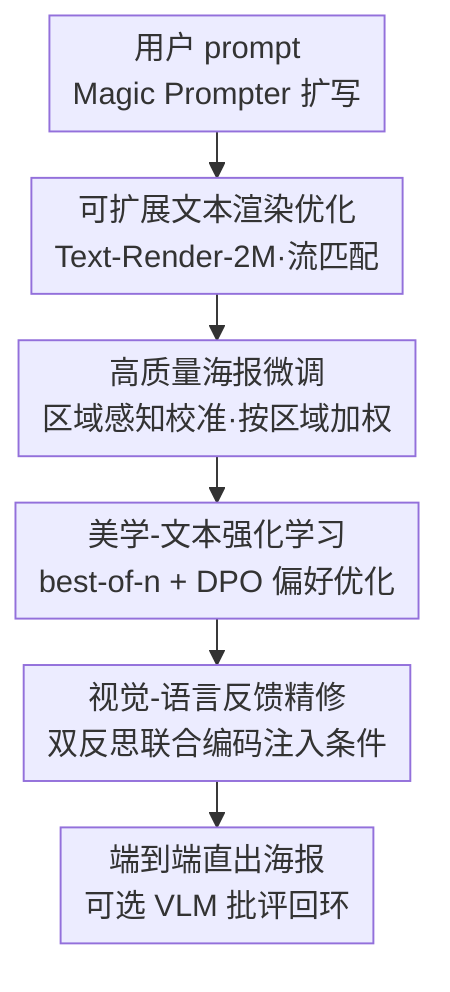

# PosterCraft: Rethinking High-Quality Aesthetic Poster Generation in a Unified Framework

**会议**: ICLR 2026  
**OpenReview**: [https://openreview.net/forum?id=GhqnOEXQh3](https://openreview.net/forum?id=GhqnOEXQh3)  
**代码**: 待确认  
**领域**: 扩散模型 / 图像生成  
**关键词**: 美学海报生成, 文本渲染, 偏好优化, 视觉-语言反馈, 统一框架

## 一句话总结
PosterCraft 抛弃"VLM 规划布局 + 单独生成背景再叠加"的模块化老路，用一个标准扩散骨干（Flux-dev）跑一条四阶段级联训练流水线（文本渲染优化 → 高质量海报微调 → 美学-文本强化学习 → 视觉-语言反馈精修），并为每个阶段配套自动构建的专用数据集，最终端到端直出文字准确、布局协调、整体美观的海报，在文本指标上逼近闭源商业系统。

## 研究背景与动机

**领域现状**：美学海报生成比一般的"设计图"生成更难——它同时要求精准的文字渲染、抽象而有冲击力的艺术内容、出彩的版式以及整体风格的统一。目前主流做法是模块化范式：先用一个微调过的视觉-语言模型（VLM）当"布局规划器"，建议文字内容和位置，再把这些建议叠加到单独生成的背景上，或者作为硬约束让生成模型去满足。

**现有痛点**：这种解耦设计有两个硬伤。其一是**美学不一致**——文字和背景分两步产生，破坏了海报最看重的视觉与风格连贯性；其二是**视觉质量上限被压低**——整条流程重度依赖 VLM 的准确性和鲁棒性，VLM 一旦规划得不好，下游再怎么生成也救不回来。而另一类端到端的"以设计为中心"的生成方法，又只能处理贺卡、商品海报这类结构简单的任务，撑不起高质量美学海报的视觉和结构复杂度。

**核心矛盾**：模块化把"文字、艺术内容、版式"拆成几个互相不知情的子问题分别求解，天然牺牲了整体性；而强大的基础模型（如 Flux）虽然能生成复杂自然图像，却没有针对海报的专用大规模数据来释放潜力——**缺数据**和**缺统一训练范式**这两件事互相卡住了这个方向。

**本文目标**：在不做复杂架构改造的前提下，让一个标准扩散骨干直接端到端产出完整海报，同时把文字准确、艺术内容、版式协调三者一次性整合。

**切入角度**：作者认为"组件级、增量式的小修小补不足以带来大的美学跃升"，应该换成**工作流优化**——通过一条精心设计的级联训练流程逐阶段注入能力，而不是靠新模块或布局嵌入约束去限制模型的表达自由。

**核心 idea**：用"四阶段级联工作流 + 每阶段专用自动构建数据集"替代"模块化布局规划"，把海报生成统一进单次推理，让基础模型自己学会协调文字与画面。

## 方法详解

### 整体框架

PosterCraft 从 Flux-dev 扩散骨干出发，串起四个训练阶段，每个阶段都解决海报生成里的一个具体瓶颈，并配一个专门自动构建的数据集来支撑训练。第一阶段在 200 万样本上死磕文字渲染准确率；第二阶段在 10 万张高质量海报上做监督微调，并用"区域感知校准"协调文字与背景；第三阶段把海报生成当成强化学习问题，用 best-of-n 偏好优化注入整体美学偏好；第四阶段引入视觉-语言反馈回环，让模型按结构化的多模态批评意见迭代精修。推理时，用户一句 prompt 先经 MLLM（Magic Prompter）扩写出丰富的美学线索，然后模型一次性直出海报，可选地再走一遍 VLM 批评回环进一步提升。整条链路的关键在于：能力是"逐阶段叠加"上去的，骨干架构基本不动。

### 关键设计

**1. 可扩展文本渲染优化：先用海量带文字的高质量数据把"会写字"这件事打牢**

文字渲染是海报生成的老大难，卡在两点：高质量、文字渲染完美的大规模数据稀缺；现有文字数据多是纯色或低质背景，模型一旦在上面训练就丢掉了表现常见背景的能力。作者用自动化流水线构建 **Text-Render-2M**——200 万样本，文字在内容、大小、数量、位置、旋转上都高度多样，且都干净地渲染在高质量背景上，每个文字实例还配有与原图说明无缝合并的精确 caption。在这上面用流匹配损失全参微调骨干：

$$\mathcal{L}^{\text{text}}_{\text{flow}}(\phi)=\mathbb{E}_{t\sim U(0,1),x_0,\varepsilon}\big\|v_\phi(x_t,t)-\dot{x}_t\big\|_2^2$$

其中 $x_t=\alpha_t x_0+\sigma_t\varepsilon$ 是前向加噪轨迹，$\dot{x}_t$ 是其时间导数，$v_\phi$ 预测速度场。靠"100% 文字准确 + 背景丰富多样"这两条数据特性，模型同时学会了把字写对、写齐，又不丢背景表现力，从根上修掉了 Flux 基线常见的漏字、重字、错字。

**2. 区域感知校准：让文字区和非文字区在微调时承担不同的权重，避免"写对字"和"画好图"互相打架**

第一阶段已经把文字渲染能力练上来了，这一阶段要把重心转到整体海报风格上，难点是文字和背景的和谐共处。数据上，作者构建 **HQ-Poster-100K**：先 MD5 去重，再用 MLLM 打分器（InternVL2.5-8B-MPO，对二选一题取选项 logits 过 Softmax，阈值 0.98）剔掉带大块版权/署名信息的海报，接着感知哈希去视觉近重复，最后 Gemini2.5-Flash 生成 caption 并用 HPS 打分（<0.25 的过滤掉）。每张海报还用 Gemini2.5-Flash 提取文字区域坐标并按相对大小分成大文字（major）和小文字（minor）掩码。核心机制是一张逐像素权重图：

$$w(p)=\begin{cases}0.6 & p\in \text{大文字掩码}\\ 0.2 & p\in \text{小文字掩码}\\ 1.0 & \text{其他区域}\end{cases}$$

加权后的流匹配损失为 $\mathcal{L}^{\text{poster}}_{\text{flow}}=\mathbb{E}\,\|(v_\phi(x_t,t)-\dot{x}_t)\odot w\|_2^2$。直觉是：承载核心信息的大文字给中等权重，保证清晰又能融入背景；小文字占地小且最容易渲染崩坏，下调权重避免它干扰整体；定义视觉风格的非文字区给满权重，保证从高质量画面到统一美学版式的平滑过渡。这样模型在保住文字准确的同时强化了画面的艺术整体性。

**3. 美学-文本偏好优化：用 best-of-n + DPO 把"像素级写对字"升级到"整张海报好不好看"的全局偏好**

前两阶段保证了像素级文字保真和校准过的风格，但漏掉了让海报真正出彩的高阶权衡：版式平衡、配色和谐、字体协调这类需要全局评估的"细腻偏好"，以及文字渲染清晰后仍需进一步纠错、把文字和整体美学无缝融合。作者把海报生成框成强化学习问题，构建 **Poster-Preference-100K**：用约 20K prompt、每个 prompt 生成 5 张得到 100K 海报，用 HPSv2 给每组 5 张打分取最高/最低作为偏好/拒绝样本；由于 HPSv2 只评内容和美学，再用 Gemini2.5-Flash 核验偏好样本的文字准确和风格一致，最终留下 6K 满足"HPSv2 分差 >0.025 且偏好样本文字完全准确"两条标准的偏好对。对每个 prompt 采 $n$ 个变体，用美学-文本组合奖励 $R(x)$ 做 best-of-n 选取：$x^+=\arg\max_i R(x^{(i)})$，$x^-=\arg\min_i R(x^{(i)})$，再优化 DPO 目标：

$$\mathcal{L}_{\text{RL}}(\theta)=-\mathbb{E}_c\Big[\log\sigma\big(\beta(\log\tfrac{p_\theta(x^+|c)}{p_{\text{ref}}(x^+|c)}-\log\tfrac{p_\theta(x^-|c)}{p_{\text{ref}}(x^-|c)})\big)\Big]$$

由于边缘分布 $p_\theta(x_0|c)$ 不可解，作者沿用前人做法用整条扩散链的 ELBO 来估计这些对数比奖励。这一步把统一的偏好信号直接注入扩散训练，让模型不只是"去噪准确"，更倾向于生成满足整体美学标准的输出。训练时只调 LoRA（rank 64）。

**4. 视觉-语言反馈精修：把"内部对比 + 结构化编辑建议"训练成推理时可调用的多模态反思回环**

为了修补初始海报在内容和美学上的残余缺陷，作者构建 **Poster-Reflect-120K**：用偏好学习后的模型每个 prompt 生成 6 张（共 120K），Gemini2.5-Flash 从每组里选出同时满足"prompt 对齐准确、美学更优、文字渲染正确"的最优海报作为反馈目标，每组产出 5 个反思对。反馈分两类——"海报内容建议"和"美学风格优化建议"，且刻意要求模型做**内部对比但不显式引用第二张参考海报**，并把反馈写成具体的编辑指令。为了让训练和推理输入一致，构建 VQA 样本时把原始 caption 嵌进 prompt、配上待优化海报，用 Gemini 生成的反馈当监督去微调一个 Reflect VLM（Internvl3-8B）；生成反馈时只用目标海报当参考、省略原 caption 以保留创造力。推理/精修时，Gemini 产出内容反思 $f_c$ 和风格反思 $f_s$，作者不是把它们拼到原 prompt 后面（会超编码器长度并掉性能），而是用文本编码器联合编码 $e_{c,s}=E_t(f_c,f_s)$，再与原 prompt 嵌入 $e_p$ 拼接（带位置编码保序），并借鉴 OmniControl 把 VAE 编码的图像级反馈 $v_{\text{img}}$ 直接注入条件分支，得到多模态条件 $c=[e_p;\,e_{c,s};\,v_{\text{img}}]$，最后在条件流匹配损失 $\mathcal{L}^{VL}_{\text{flow}}(\theta)=\mathbb{E}\|v_\theta(x_t,t|c)-\dot{x}_t\|_2^2$ 下用 LoRA（rank 128）微调。这样模型就能按结构化的文字反思 + 语义增强的视觉反馈迭代精修自己的输出。

### 损失函数 / 训练策略
四阶段都基于流匹配损失，但各有侧重：阶段一是普通流匹配全参微调（Text-Render-2M 上 300K 步，Adafactor，lr=2e-6）；阶段二加逐像素权重图变成加权流匹配（HQ-Poster-100K 上 6000 步，Adafactor，lr=1e-5，权重 0.6/0.2/1.0）；阶段三是 best-of-n DPO（每 prompt 采 n=5，AdamW，lr=1e-4，1500 步，仅 LoRA rank 64）；阶段四是条件流匹配（双语反思经 T5 编码，LoRA rank 128，6000 步，AdamW，lr=1e-4），反馈生成用 Internvl3-8B 微调 2 epoch、推理 temperature=0。整体从 Flux-dev 初始化，混合精度训练。

## 实验关键数据

### 主实验
评测用 Gemini2.0-Flash-Gen 随机生成 100 个海报 prompt（长/中/短均衡），每个模型采 3 张共 300 张，再用 SOTA VLM 的 OCR 引擎计算文字召回、文字 F-score、文字准确率。

| 方法 | Text Recall ↑ | Text F-score ↑ | Text Accuracy ↑ |
|------|------|------|------|
| OpenCOLE (开源) | 0.082 | 0.076 | 0.061 |
| Playground-v2.5 (开源) | 0.157 | 0.146 | 0.132 |
| PosterMaker (开源) | 0.522 | 0.488 | 0.467 |
| BizGen (开源) | 0.689 | 0.661 | 0.641 |
| SD3.5 (开源) | 0.565 | 0.542 | 0.497 |
| Flux1.dev (开源, 基线) | 0.723 | 0.707 | 0.667 |
| Ideogram-v2 (闭源) | 0.711 | 0.685 | 0.680 |
| BAGEL (开源) | 0.543 | 0.536 | 0.463 |
| Gemini2.0-Flash-Gen (闭源) | **0.798** | **0.786** | **0.746** |
| **PosterCraft (本文)** | 0.787 | 0.774 | 0.735 |

PosterCraft 在召回、F-score、准确率三项上全面超过所有开源基线（含输入更结构化的 BizGen、PosterMaker），也超过闭源 Ideogram-v2，仅微弱低于成熟商业系统 Gemini2.0-Flash-Gen，说明其文字渲染已逼近近生产级水准。另有 20 位资深海报设计师的用户研究，从多个维度评估也得到一致结论：显著优于 Flux1.dev 基线和全部开源/部分闭源系统。

### 消融实验
作者逐个剥离四个阶段，固定其余条件，用 OCR 准确率和人类偏好双指标评估（图 7）。

| 配置 | OCR 准确率 | 人类偏好 | 说明 |
|------|---------|---------|------|
| 完整模型 | 最高 | 最高 | 四阶段全开 |
| w/o 文本渲染优化 | 明显下降 | 明显下降 | 失去清晰度与文字保真 |
| w/o 区域感知校准 | 下降 | 下降 | 各区域同权，复杂海报风格连贯性变弱、文字有偏 |
| w/o 美学-文本 RL | 下降 | 下降 | 美学与文字准确的协调变差 |
| w/o 反思精修 | 下降 | 下降 | 缺少迭代视觉-语言引导，整体质量回落 |

### 关键发现
- 四个阶段去掉任何一个，OCR 准确率和人类偏好都持续下降，验证了"逐阶段叠加能力"的设计动机站得住。
- 文本渲染优化对"写对字"和整体感知都最关键——它既保证清晰度，又靠多样真实背景守住了视觉质量；缺了它模型往往维持不住可读性。
- 区域感知校准的价值在于让模型适配空间上下文、平衡文字与背景；缺它时所有区域同等对待，视觉复杂的海报风格连贯性变弱并出现文字偏置。

## 亮点与洞察
- **"换数据 + 换训练流程"而非"换架构"**：四个能力全靠四个自动构建的专用数据集 + 四段流匹配/偏好训练注入，骨干基本不改。这条路线对工程复现非常友好，也说明强基础模型的潜力主要被"缺对路的数据和训练范式"压住了。
- **逐像素权重图是个很轻但很对症的 trick**：用大/小文字/非文字三档权重（0.6/0.2/1.0）就把"写对字"和"画好图"的拉扯解开了——小文字最易崩就压低、背景定风格就给满权，思路简单且可迁移到任何带区域语义的生成微调。
- **反思反馈"内部对比、不引用第二张参考"的设计**：训练和推理输入严格对齐（都不给参考目标海报、都用原 prompt 当基线），避免了"训练时偷看答案、推理时抓瞎"的分布偏移，是把 VLM critique 落到可用的关键工程细节。
- **不把反思字符串拼到 prompt 后**而是联合编码再与 prompt 嵌入拼接、并把 VAE 图像反馈注入条件分支，绕开了编码器长度限制，这种"多模态条件拼接"写法可复用到其他需要长反馈的可控生成任务。

## 局限与展望
- 整条流水线重度依赖外部强模型当"裁判/标注器"（Gemini2.5-Flash 选最优、打 caption、生成反馈，HPSv2/HPS 打分），数据质量和偏好信号的天花板被这些外部模型绑定，也带来潜在的偏好偏置。
- 文字指标上仍略低于 Gemini2.0-Flash-Gen，最强闭源系统的差距尚未抹平；论文主要在自建的 100/300 张 prompt 集和用户研究上评估，更大规模、跨领域 benchmark 的结论留在补充材料，正文证据相对集中。
- 四阶段级联训练成本不低（阶段一就 300K 全参步），且每阶段都要单独构建百万/十万级数据集，复现门槛和算力开销较高。
- HQ-Poster-100K 含第三方版权素材，作者按合理使用、仅限非商业研究处理，实际商用落地仍有版权约束。

## 相关工作与启发
- **vs 模块化 VLM 规划（PosterLLaMA / PosterLLava / POSTA）**: 它们用微调 VLM 当布局规划器或"美学设计师"，在已有高质量图上做模块化叠加；PosterCraft 完全端到端、单次推理直出，避开了解耦带来的美学不一致和 VLM 精度瓶颈。
- **vs 两阶段文字渲染（TextDiffuser / DesignDiffusion）**: 它们靠 OCR 掩码或字符级嵌入 + 定位损失强化文字，但施加刚性预布局约束、且聚焦商品广告/贺卡等简单域；PosterCraft 不加预布局约束，把文字、艺术内容、版式统一进一次推理，覆盖更复杂的美学海报。
- **vs 统一 Transformer 生成（TransFusion / JanusFlow）**: 它们在一个架构里同时生成图像和文本 token；PosterCraft 不改架构，只靠工作流优化释放标准扩散骨干，范式上仍兼容现有技术、更易扩展。

## 评分
- 新颖性: ⭐⭐⭐⭐ "用统一工作流 + 四套自动数据集替代模块化布局规划"的范式重构很扎实，单点技术（流匹配、DPO、区域加权）多为组合复用。
- 实验充分度: ⭐⭐⭐⭐ 主表对比 7+ 模型、用户研究 + 四阶段消融齐全，但正文评测集规模偏小、跨 benchmark 结论压在补充材料。
- 写作质量: ⭐⭐⭐⭐ 四阶段动机—数据—机制讲得清晰，图 2/图 3 把数据与流水线对应得很好。
- 价值: ⭐⭐⭐⭐ 端到端逼近商业系统 + 四个自动构建数据集对美学海报生成方向有明确实用与数据价值。

<!-- RELATED:START -->

## 相关论文

- [\[ICLR 2026\] Scaling Group Inference for Diverse and High-Quality Generation](scaling_group_inference_for_diverse_and_high-quality_generation.md)
- [\[ICLR 2026\] PQGAN: Product-Quantised Image Representation for High-Quality Image Synthesis](pqgan_product-quantised_image_representation_for_high-quality_image_synthesis.md)
- [\[ECCV 2024\] A High-Quality Robust Diffusion Framework for Corrupted Dataset](../../ECCV2024/image_generation/a_highquality_robust_diffusion_framework_for_corrupted_datas.md)
- [\[ECCV 2024\] UDiffText: A Unified Framework for High-quality Text Synthesis in Arbitrary Images via Character-aware Diffusion Models](../../ECCV2024/image_generation/udifftext_a_unified_framework_for_high-quality_text_synthesis_in_arbitrary_image.md)
- [\[ICLR 2026\] Guidance Matters: Rethinking the Evaluation Pitfall for Text-to-Image Generation](guidance_matters_rethinking_the_evaluation_pitfall_for_text-to-image_generation.md)

<!-- RELATED:END -->
