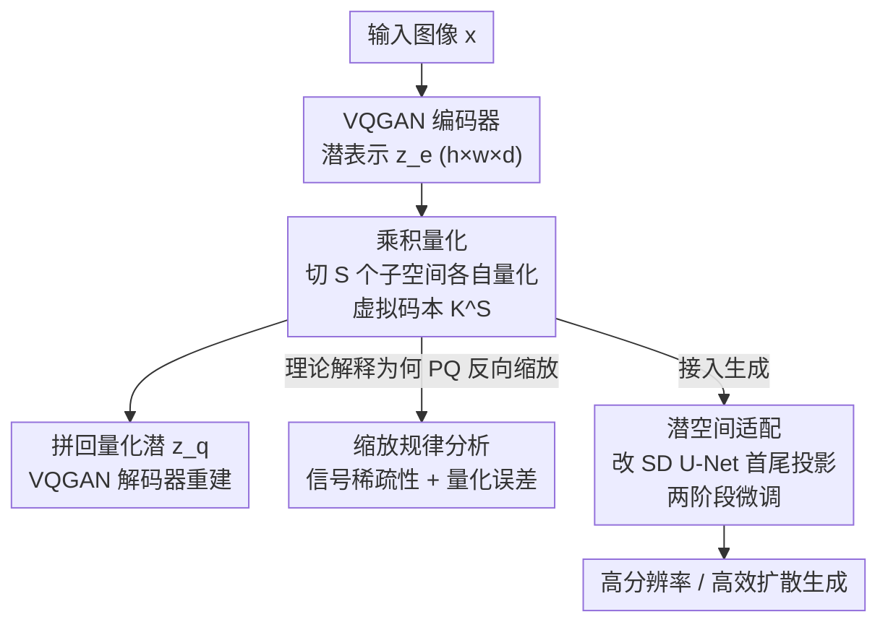

# PQGAN: Product-Quantised Image Representation for High-Quality Image Synthesis

**会议**: ICLR 2026  
**OpenReview**: [https://openreview.net/forum?id=D8oqcochgq](https://openreview.net/forum?id=D8oqcochgq)  
**代码**: 待确认  
**领域**: 图像生成 / 离散表示 / 扩散模型  
**关键词**: 乘积量化, 图像 tokenizer, VQGAN, 潜空间表示, Stable Diffusion

## 一句话总结
PQGAN 把经典的乘积量化（Product Quantisation, PQ）塞进 VQGAN 的量化模块，把每个潜向量切成 $S$ 个子空间各自量化，从而用很小的子码本组合出指数级大的"虚拟码本"，在 ImageNet 重建上把 PSNR 从 27 dB 拉到 37.4 dB、FID 低至 0.036，甚至超过连续 VAE，并且能直接塞进预训练扩散模型实现翻倍分辨率或数倍提速。

## 研究背景与动机
**领域现状**：现代图像生成几乎都在自编码器的低分辨率潜空间里操作以省算力。其中离散化路线由 VQ-VAE/VQGAN 开创——学一个码本，把每个潜"像素"替换成最近的码本条目，把潜空间变成离散索引空间，存储代价只跟空间分辨率和码本大小有关、与向量维度无关，这让自回归生成和图像压缩都受益。

**现有痛点**：标准 VQ 在高维潜空间里会"学不动"。因为一个码本条目的所有 $d$ 维是被**联合**量化的（一次最近邻查找定全部维度），训练信号变得稀疏且纠缠，码本容易塌缩、收敛慢；而且条目之间常有冗余（只有部分维度不同）。结果是码本越想做大、维度越想做高，越难训练，重建保真度上不去。

**核心矛盾**：VQ 把表达能力（高维、大码本）和可训练性（密集监督信号、低量化误差）绑死在同一个高维码本上。经典量化理论指出，$d$ 维空间里用 $K$ 个中心点，量化误差按 $O(K^{-2/d})$ 缩放——想在高维下维持误差就得让码本指数级膨胀，不现实。

**本文目标**：在不改 VQGAN 架构和训练流程的前提下，只换掉量化模块，找到一种既能享受高维潜空间表达力、又不被稀疏训练信号和量化误差拖垮的离散化方案；并验证它能不能无缝接进现成的大扩散模型。

**切入角度**：作者重新拾起 2010 年的乘积量化——把高维向量拆成若干低维子空间分别量化。在压缩/自回归场景里 PQ 因为要么存 $S$ 个索引、要么拼成爆炸大的联合码本而没被充分挖掘；但作者观察到**扩散/流模型的解码器直接在潜空间上工作，不需要自回归式的显式索引分解**，这恰好解除了 PQ 的枷锁，可以放开手脚探索它的全部潜力。

**核心 idea**：用"把潜向量切成 $S$ 个独立子空间、各自配小码本"的乘积量化代替 VQ 的单一高维码本，用组合数 $K^S$ 的虚拟码本换取密集训练信号和恒定量化误差。

## 方法详解

### 整体框架
PQGAN 的骨架完全沿用 VQGAN（Esser 2021）的编码器、解码器、感知重建损失和对抗损失，**唯一的改动是把中间的向量量化模块换成乘积量化**——这样做是为了把"PQ 带来的提升"和其他因素彻底隔离开，做受控对比。输入一张 RGB 图像 $x\in\mathbb{R}^{H\times W\times 3}$，编码器把它压成 $z_e\in\mathbb{R}^{h\times w\times d}$（$h=H/F$，$F$ 是下采样因子，每个空间位置是一个 $d$ 维潜"像素" $p_\ell$）。VQ 会用一个大小为 $K$ 的码本把整个 $p_\ell$ 一次性量化；PQ 则先把 $p_\ell$ 沿通道切成 $S$ 段，每段维度 $d/S$，每段用自己的小码本 $C^{(s)}$ 独立找最近邻，再把 $S$ 段拼回去送进解码器重建。

在此之上，论文还把这套量化潜空间接进 Stable Diffusion 2.1：只改 U-Net 首尾两层卷积的通道宽度去匹配高维潜表示，先冻结主干只训首尾投影、再解冻全量微调，让大扩散模型能直接在 PQ 潜空间上采样。

### 关键设计

**1. 乘积量化替换 VQ：用子空间分解换出指数级虚拟码本**

这一招直接针对"高维单码本学不动"的痛点。PQ 把每个潜像素 $p_\ell\in\mathbb{R}^d$ 切成 $S$ 个互不相交的子空间 $p_\ell=[p_\ell^{(1)},\dots,p_\ell^{(S)}]$（每段 $p_\ell^{(s)}\in\mathbb{R}^{d/S}$），并为每段单独学一个码本 $C^{(s)}=\{e_1^{(s)},\dots,e_K^{(s)}\}$，各自独立做最近邻量化。关键在于：因为不同子空间的条目可以**自由重组**，PQ 等价于定义了一个组合大小为 $K^S$ 的"虚拟码本"，却完全不需要显式存储或学习这些组合。这样每个子码本都很小（实验里 $K$ 只要 128~512），但合起来的表达力极强。VQ（$S=1$）和标量量化（$S=d$，每维一个码本）都成了 PQ 的特例。训练目标几乎照搬 VQGAN：

$$L_{PQ}=\lVert z_e-\mathrm{sg}(z_q)\rVert_2^2+\beta\lVert \mathrm{sg}(z_e)-z_q\rVert_2^2+L_{rec}+\lambda_{adv}L_{GAN}$$

其中 $\mathrm{sg}(\cdot)$ 是停止梯度算子，$z_q$ 是量化后的潜表示，$L_{rec}$ 是感知重建损失，$L_{GAN}$ 是对抗损失——这些组件全部原封不动继承自 VQGAN，唯一变的是量化怎么做。

**2. 缩放规律分析：解释为什么 VQ 与 PQ 在升维时表现完全相反**

光给方法不够，作者用两条理论说清 PQ 为何更优、并预测出可指导调参的趋势。其一是**训练信号稀疏性 / 样本效率**：VQ 在完整纠缠的 $d$ 维空间里学码本，要达到覆盖分辨率 $\epsilon$ 所需样本数按 $O((1/\epsilon)^d)$ 爆炸增长，高维下每个中心点拿到的监督极少；而 PQ 把空间拆成 $S=d/2$ 个二维子空间，每个只需 $O((1/\epsilon)^2)$ 样本就能达到同样覆盖分辨率，**与总维度无关**，于是升维时有效样本密度保持恒定。其二是**量化误差缩放**：经典理论（Zador 1982）给出均方量化误差按 $O(K^{-2/d})$ 缩放，VQ 要在升维时维持误差就得让码本指数级膨胀；PQ 永远在固定的低维子空间（$d/S=2$）里量化，误差恒为 $O(K^{-2/2})=O(K^{-1})$，与总潜维度脱钩。两条合起来得出一个反直觉但实测成立的结论：**升维会让 VQ 退化、却让 PQ 受益**——这是全文最核心的"啊哈"发现，也解释了为什么 PQ 敢于在高维潜空间上做文章。

**3. 潜空间适配：用最小改动把 PQ 潜空间接进预训练扩散模型**

要让 PQ 真正有用，得能接进现成大模型。作者纠正了扩散生成里的一个常见误解："潜表示必须保持低维才高效"——他们指出在扩散 U-Net 里，注意力层让计算量随**空间分辨率**二次增长，真正的瓶颈是空间分辨率而非通道维度，所以完全可以用"空间分辨率低但通道维度高"的潜表示。落地时，他们发现 SD 的 U-Net 在输入端有个固定的 4→512 通道投影、输出端 512→4，这俩投影是限制可用潜维度的"人工瓶颈"；于是只把首尾两层卷积加宽到匹配 PQ 的高维潜表示、复用预训练权重，其余架构原封不动。训练分两阶段：先冻结全模型、只训新加的首尾投影 20k 步，再解冻整模型按标准扩散目标继续微调约 1M 步：

$$L=\mathbb{E}_{z_0,t,c_t,\epsilon\sim\mathcal{N}(0,1)}\big[\lVert\epsilon-\epsilon_\theta(z_t,t,c_t)\rVert_2^2\big]$$

这套适配的回报是：要么在同等算力下把输出分辨率翻倍（PQSD-HR：1536×1536 的成本约等于原 SD 的 768×768），要么在同分辨率下提速最多 4 倍（PQSD-Quick 用更小空间分辨率），而且高分辨率下不会像原 SD-VAE 那样产生伪影/幻觉。

### 损失函数 / 训练策略
量化阶段沿用 VQGAN 的复合损失（codebook + commitment + 感知重建 + 对抗），$\beta$ 为 commitment 权重，所有组件原样继承。ImageNet 256×256 上训练 1M 步、batch size 20。扩散适配阶段用标准 $\epsilon$-预测目标，先训 20k 步首尾投影再全量微调 1M 步；高分辨率变体在 768×768 上额外微调 200k 步、batch size 15，并逐步提升分辨率。

## 实验关键数据

### 主实验
ImageNet 256×256 验证集重建对比（节选，↑越大越好 / ↓越小越好）：

| 方法 | 量化 | $F$ | $d$ | $K$ | PSNR↑ | rFID↓ | CMMD↓ | LPIPS↓ |
|------|------|-----|-----|-----|-------|-------|-------|--------|
| VQGAN (Esser 2021) | VQ | 16 | 256 | 16384 | 19.7 | 4.98 | 0.422 | 0.1633 |
| VQGAN-LC | VQ | 8 | 4 | 100000 | 27.0 | 1.29 | 0.080 | 0.0712 |
| Mo-VQGAN | MCQ | 16 | 256 | 1024 | 22.4 | 1.12 | - | 0.1132 |
| SDv2.1 VAE | KL（连续） | 8 | 4 | - | 25.3 | 0.75 | 0.133 | 0.0610 |
| SDXL VAE | KL（连续） | 8 | 4 | - | 25.3 | 0.74 | 0.148 | 0.0573 |
| **PQGAN (ours)** | **PQ** | 16 | 128 | 128 | 28.3 | 0.41 | 0.094 | 0.0304 |
| **PQGAN (ours)** | **PQ** | 8 | 128 | 512 | **37.4** | **0.036** | **0.011** | **0.0024** |

PQGAN 在 $F=8$ 时 PSNR 达 37.4 dB，全面碾压所有离散和连续基线，rFID/CMMD/LPIPS 几乎到"与原图不可区分"的程度；即便把空间分辨率砍半到 $F=16$，仍然超过用 16 倍潜像素的 $F=4$ 对手。值得注意的是它只用 128~512 的小码本，而 VQGAN-LC 要 10 万级码本才勉强追上。

迁移性（FFHQ / LSUN，$F=8$）上 PQGAN 同样最强，FFHQ 上 PSNR 冲到 42.1 dB，在域偏移下仍稳定甚至略升，说明学到的表示泛化好。

扩散集成（A100，50 步采样，单样本）：

| 生成器 | 图像尺寸 | 潜分辨率 | $F$ | $d$ | Samples/s↑ | 显存(GB)↓ |
|--------|----------|----------|-----|-----|------------|-----------|
| SDv2.1 | 768² | 96² | 8 | 4 | 0.116 | 14.9 |
| PQSD-HR (ours) | **1536²** | 96² | 16 | 128 | 0.112 | 14.9 |
| PQSD-Quick (ours) | 768² | 48² | 16 | 128 | **0.465** | **7.7** |

同等算力下 PQSD-HR 把分辨率翻倍，PQSD-Quick 则提速约 4 倍且显存减半。

### 消融实验
核心消融是"乘积空间组成"扫描：系统性地变 $d\in\{4,\dots,256\}$、$S\in\{1,d/2,d/4,d/8,d\}$、$K\in\{128,\dots,16384\}$。

| 配置变量 | 关键发现 | 说明 |
|----------|----------|------|
| 升高 $d$（VQ, $S=1$） | FID 变差 | VQ 无法随维度扩展，验证理论预测 |
| 升高 $d$（PQ, $S>1$） | FID 变好 | PQ 反向缩放，越高维越好 |
| 升高子空间数 $S$ | 一致提升，约 $S=d/2$ 饱和 | 临近标量量化 $S=d$ 前最优 |
| 升高码本 $K$ | FID 仅弱相关 | FID 主要由 $S$ 决定而非 $K$ |

### 关键发现
- **$S$（子空间数）是最关键的旋钮**，提升 $S$ 持续改善性能并在 $S=d/2$ 附近饱和；而 FID 对码本大小 $K$ 只有弱依赖——这意味着小码本 + 高分解就能打败所有大码本 VQ 配置。
- **VQ 与 PQ 升维时方向相反**：同一张 FID 图上，VQ 随 $d$ 增大而退化、PQ 随 $d$ 增大而改善，干净地印证了"训练信号稀疏性 + 量化误差缩放"两条理论。
- **码本利用率**：用归一化熵 $H_n=H(p)/\log K$ 和归一化困惑度 $P_n=\exp(H(p))/K$ 衡量，PQ 即便在 $K=16384$ 的超大码本下仍维持 $H_n>0.8$，用得又满又均匀，而 VQ 熵最低、用不起来。
- **代价**：子空间越多，码本匹配时间随 $S$ 线性增长；最佳 PQ 自编码器的量化开销约为去掉码本匹配时的 50% 墙钟时间，是高维 PQ 实用性的主要约束。

## 亮点与洞察
- **"老方法 + 新场景"的巧劲**：PQ 是 2010 年的经典技术，作者的洞察是扩散解码器不需要显式索引分解，从而解除了 PQ 在压缩/自回归里被率失真和索引存储捆住的枷锁，让它第一次跑满表达力——这种"换场景解锁旧方法"的思路很值得借鉴。
- **理论与现象闭环**：不是单纯刷指标，而是用样本复杂度 $O((1/\epsilon)^d)$ 和量化误差 $O(K^{-2/d})$ 两条理论**预测**出"VQ 退化、PQ 受益"的反向缩放，再用实验验证，论证链条干净。
- **"空间分辨率才是瓶颈、通道维度不是"** 这个对扩散模型的再认识可直接迁移：凡是注意力主导、算力随空间二次增长的生成器，都可以考虑"低空间分辨率 + 高通道维度"的潜表示来换效率。
- **近乎零成本接入**：只改 U-Net 首尾两层投影就能让预训练 SD 用上高维潜空间，作为 drop-in 替换的工程友好度很高。

## 局限与展望
- **作者承认的局限**：子空间数 $S$ 越大，码本匹配时间随 $S$ 线性增长，高维设置下的量化开销（最佳配置约 +50% 墙钟）会成为实用瓶颈。
- 论文也指出 PQ 在压缩/自回归场景仍受"要么存 $S$ 个索引、要么拼指数级联合码本"的限制，本文优势严格依赖扩散/流模型解码器不需要自回归索引这一前提；离开这个前提，PQ 的可用性要打折扣。
- **自己发现的局限**：主要评测集中在 ImageNet 及 FFHQ/LSUN 迁移，且 rFID/CMMD 是全局统计量、跨域绝对值不可直接比较（作者已声明只用于相对排名）；更大规模文本到图像生成质量（而非仅重建保真度）的端到端评估相对单薄。
- **改进思路**：针对码本匹配的线性开销，可探索近似最近邻或子空间共享码本来降本；也可研究 $S$、$d$、$K$ 的自适应分配而非全局固定。

## 相关工作与启发
- **vs VQGAN / VQ-VAE**：它们用单一高维码本联合量化所有维度，导致训练信号稀疏、码本塌缩、升维退化；PQ 把维度切成独立子空间，监督信号变密、误差与总维度脱钩，所以能反向享受高维红利。
- **vs 残差量化 RQ-VAE / 层次量化**：这些是 VQ 的增量补丁（多级残差/层次细化），仍保留高维码本和稀疏信号的根本缺陷；PQ 从结构上拆解高维瓶颈，提升更本质。
- **vs 多通道量化 Mo-VQGAN（MCQ）**：MCQ 沿通道切分但用一个**共享联合**码本，限制了表达力和可分割数；PQ 给每个子空间独立码本并自由重组，得到 $K^S$ 的虚拟容量。
- **vs 连续 KL-VAE（SD/SDXL VAE）**：连续潜空间一直被认为是重建上限，PQGAN 是少见地用离散量化在 PSNR/rFID/LPIPS 上**全面超过**连续 VAE 的工作，且空间分辨率更低。

## 评分
- 新颖性: ⭐⭐⭐⭐⭐ 把经典 PQ 重新解锁到扩散潜空间，并揭示 VQ/PQ 反向缩放这一反直觉规律
- 实验充分度: ⭐⭐⭐⭐⭐ 全超参谱系扫描 + SOTA 对比 + 迁移性 + 扩散集成，证据链完整
- 写作质量: ⭐⭐⭐⭐ 理论与实验闭环、动机清晰，但部分关键图表细节需查附录
- 价值: ⭐⭐⭐⭐⭐ 重建保真度大幅提升且可 drop-in 进 SD，对高分辨率高效生成有直接实用价值

<!-- RELATED:START -->

## 相关论文

- [\[ICLR 2026\] Latent Wavelet Diffusion for Ultra-High-Resolution Image Synthesis](latent_wavelet_diffusion_for_ultra_high-resolution_image_synthesis.md)
- [\[ICLR 2026\] Localized Concept Erasure in Text-to-Image Diffusion Models via High-Level Representation Misdirection](localized_concept_erasure_in_text-to-image_diffusion_models_via_high-level_repre.md)
- [\[ICLR 2026\] Scaling Group Inference for Diverse and High-Quality Generation](scaling_group_inference_for_diverse_and_high-quality_generation.md)
- [\[ICLR 2026\] Product of Experts for Visual Generation](product_of_experts_for_visual_generation.md)
- [\[ICLR 2026\] PosterCraft: Rethinking High-Quality Aesthetic Poster Generation in a Unified Framework](postercraft_rethinking_high-quality_aesthetic_poster_generation_in_a_unified_fra.md)

<!-- RELATED:END -->
