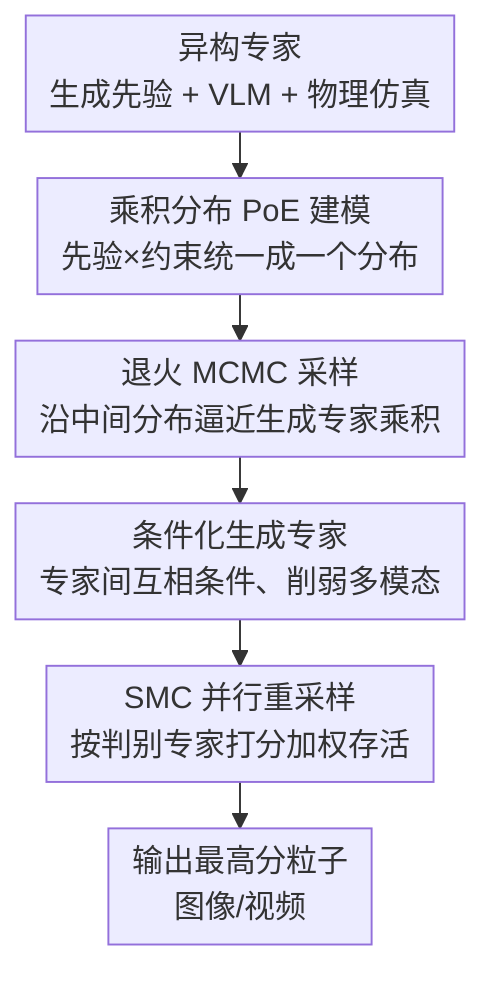

# Product of Experts for Visual Generation

**会议**: ICLR 2026  
**OpenReview**: [https://openreview.net/forum?id=dTYbqgvZmc](https://openreview.net/forum?id=dTYbqgvZmc)  
**代码**: [项目页](https://product-of-experts.github.io/)  
**领域**: 扩散模型 / 可控视觉生成 / 推理时模型组合  
**关键词**: 专家乘积、退火 MCMC、序贯蒙特卡洛、异构模型组合、可控生成

## 一句话总结
本文把可控图像/视频生成统一成「多个异构专家模型的乘积分布采样」问题——生成模型当先验、判别模型（VLM）当软约束、物理仿真器当硬约束，再用「退火 MCMC + SMC 重采样」在推理时无需重训地从这个乘积分布里采样，从而比单一大模型获得更强的可控性与保真度。

## 研究背景与动机

**领域现状**：现代图像/视频生成模型（扩散、自回归视频模型）在外观真实度上已经很强，但要它们同时「严格遵循复杂文本指令」「符合物理规律」「精确摆放某个物体的位姿/轨迹」却很难。与此同时，社区里其实已经有一堆各有所长的模型：VLM 懂语义对齐、物理仿真器懂运动规律、深度图/inpainting 模型懂局部约束。

**现有痛点**：想把这些异构知识塞进一个模型，要么得训练一个无所不能的大模型（把文本、视觉语料、仿真轨迹全吃进去），代价高到不现实；要么走「reward steering」路线，但主流做法（梯度引导、CFG、或基于 SMC 的 reward steering）通常要求 reward 可微、稠密梯度可得，且把生成专家两两相乘时要算 **path-wise importance weight**，随着采样路径变长会出现 **权重退化**（weight degeneracy），少数粒子占满全部权重。

**核心矛盾**：每个专家只「擅长一部分约束」，但单独看谁都不够；要让一个样本**同时**满足所有约束，本质上是要从「多个分布的乘积」里采样，而乘积分布的高概率区往往是各专家的窄交集，直接拒绝采样在高维下接受率趋近于零。

**本文目标**：拆成两个子问题——(1) 怎么从一堆异构生成专家（扩散/流模型 + 自回归模型）的乘积里高效采样；(2) 怎么把只能给标量打分、不一定可微的判别专家（VLM、物理约束）也并进来一起采。

**切入角度**：把「组合多模型」重新表述成概率框架里的经典 **Product of Experts（PoE）**——生成模型写成数据先验 $p^{(i)}(x)$，判别模型写成约束函数 $r^{(j)}(x)$ 经 Boltzmann 变换成的非归一化分布 $q^{(j)}(x)=\exp(r^{(j)}(x))$。乘积分布天然只对「所有约束同时满足」的样本赋高概率。

**核心 idea**：用 **退火重要性采样（AIS）+ 序贯蒙特卡洛（SMC）** 替代不可行的拒绝采样——退火让采样从易采的光滑分布逐步逼近目标乘积分布，per-timestep 的 MCMC 核保持中间分布不变（不累积权重，从而避开权重退化），SMC 重采样负责把判别专家的打分注入到粒子群里。

## 方法详解

### 整体框架

目标是采样自所有专家的乘积分布

$$x \sim p(x) \propto \prod_{i=1}^{N} p^{(i)}(x) \prod_{j=1}^{M} q^{(j)}(x),$$

其中 $p^{(i)}$ 是生成专家（流/扩散或自回归模型），$q^{(j)}=\exp(r^{(j)})$ 是由判别专家（VLM 打分、物理约束）转成的软分布。直接采这个分布不可行，本文的整体思路是「**退火 + 粒子群**」：维护 $L$ 个粒子，从一个易采的初始分布 $p_T$ 出发，沿着一串中间分布 $\{p_t\}_{t=T}^{1}$ 逐步退火到目标分布 $p_1$；每过一个退火层，先对每个粒子跑 MCMC 让它落进**生成专家乘积**的高概率区，再按**判别专家乘积**的打分对粒子做加权重采样。最后从存活粒子里挑判别打分最高的那个输出。

整条流水线对判别器只要求 **黑盒访问**（只需知道它给样本打多少分，不需要梯度），因此 VLM、物理 loss 这类不可微/只给标量的约束都能直接接入。

### 关键设计

**1. 乘积分布的 PoE 统一建模：把异构模型塞进同一个概率框架**

痛点是异构模型「语言不通」——生成模型给的是分布、VLM 给的是标量打分、物理仿真器给的是渲染图，没法直接放一起优化。本文用 PoE 把它们统一：生成专家直接是先验 $p^{(i)}(x)$；判别专家的标量 reward $r^{(j)}(x)$ 经 Boltzmann 分布 $q^{(j)}(x):=\exp(r^{(j)}(x))$ 变成非归一化概率；物理仿真器则写成一个以仿真渲染 $c_{\text{sim}}$ 为中心的高斯 $p_{\text{sim}}(x)\propto\exp(-w\|x-c_{\text{sim}}\|_2^2)$。三类知识全部进入式 (1) 的连乘。这样做的关键好处是：乘积分布对「同时满足所有专家」的样本才给高概率，于是「遵循文本 + 符合物理 + 精确位姿」这些约束被**自动以交集方式**组合，而不需要手工设计融合规则或重训一个统一模型。

**2. 退火 MCMC + per-timestep 不变核：避开权重退化地采生成专家乘积**

直接对乘积分布跑 MCMC 会因为「局部精炼」而 mixing 极慢，指数时间才能找到高似然样本。本文引入 AIS：构造中间分布序列 $p_t(x)\propto\prod_i p_t^{(i)}(x)$，其中 $p_T$ 光滑易采、$p_1$ 是目标乘积分布，每个 $p_t^{(i)}$ 在「初始分布（高斯/均匀）」和「最终专家分布」之间插值。对流模型，$p_t^{(i)}$ 取其速度场 $v_t^{(i)}$ 生成的概率路径离散化，转移核 $K_{t\leftarrow t+1}$ 是一步 Euler ODE 积分、$K_t$ 是组合分数 $\sum_i\nabla_x\log p_t^{(i)}$ 下的 Langevin 动力学；对自回归模型，$p_t^{(i)}(x)=p^{(i)}(x_{1:T+1-t})$ 用前缀边缘，$K_{t\leftarrow t+1}$ 追加下一段由模型预测采出的数据片、$K_t$ 用 Gibbs 采样。关键区别在于：与既往「path-wise importance weight」做法不同，本文用**每个时间步保持 $p_t$ 不变的 MCMC 核**，不去累积重要性权重，因此路径再长也不会出现权重退化。

**3. 条件化生成专家：让专家互相「看一眼」以削弱多模态**

即便有退火，乘积分布里单个专家 $p^{(i)}(x)$ 自身的多模态仍会拖慢 MCMC 收敛。本文把专家改成**条件依赖**于其它专家负责的区域：$p(x)\propto\prod_i p^{(i)}(x_i\mid x_{\text{pa}(i)})$，其中 $x_i$ 是该专家负责的场景部分、$x_{\text{pa}(i)}$ 是它被条件化的父区域。对流模型，具体实现为在原速度场上加一项「向父区域预测流对齐」的修正：

$$v_t^{(i)}(x_i\mid x_{i'}) \approx v_t^{(i)}(x_i) - w\sum_{i'\in\text{pa}(i)}\nabla_{x_i}\big\|v_t^{(i)}(x_i)-\text{stopgrad}\big(v_t^{(i')}(x_{i'})\big)\big\|_2^2.$$

让每个专家在采样时「参考」其它专家当前的预测，能显著降低 $p^{(i)}$ 的多模态、使乘积分布上的 MCMC 更高效。消融里去掉这一项（"No Cond"）会让物体插入的前景保真度与视觉协调性明显下降。

**4. SMC 并行重采样：把黑盒判别专家注入粒子群**

要把判别专家也并进式 (5) 的完整乘积，最朴素的做法是重要性采样——从生成专家乘积采 $L$ 个样本，再按判别似然 $\prod_j q_t^{(j)}(x)$ 加权抽一个。但 MCMC 样本彼此相关、覆盖不全，单纯重要性采样会偏。本文改用 **并行 SMC**：全程维护 $L$ 个粒子，每个退火层先对每个粒子跑 MCMC（采生成乘积），再按判别专家乘积似然 $\sum_j r_t^{(j)}(x^{(l)})$ 加权重采样，让高分粒子「繁殖」、低分粒子被淘汰。由于流模型的噪声样本对 VLM 是 OOD，中间步的判别打分定义在**预测终点** $\hat x$ 上：$r_t^{(j)}(x)=r^{(j)}(\hat x)$。增大粒子数 $L$ 直接换来更高质量（Table 3 中 $L$ 从 1 涨到 32，各指标单调上升）。

### 损失函数 / 训练策略

整个方法是 **训练-free** 的：不训练任何新参数，只在推理时调度一组预训练专家（FLUX.1 Depth/Fill、Wan2.1、FramePack、各种 VLM、物理仿真器）。"训练"层面的关键超参是退火长度 $T$、粒子数 $L$、每层 MCMC 步数 $K$，以及条件化修正项与物理高斯里的权重 $w$。

## 实验关键数据

### 主实验

**图像物体插入**（把图形引擎里摆好位姿的 3D 资产 + 文本材质描述插入图像）。生成专家用 FLUX.1 Depth（保证位姿）+ FLUX.1 Fill（保证真实感）。

| 设置 | 方法 | 背景 MSE↓ | 前景 LPIPS↓ | GPT-4o 可控性↑ | ImageReward↑ |
|------|------|-----------|-------------|----------------|--------------|
| 图形引擎渲染输入 | RF-Solver | 1.619 | 0.178 | 0.518 | 0.948 |
| 图形引擎渲染输入 | Ours No Cond | 1.511 | 0.065 | 0.727 | 1.142 |
| 图形引擎渲染输入 | **Ours** | **1.429** | **0.065** | **0.827** | **1.175** |
| 角色插入(Magic Insert) | SDEdit | 0.968 | 0.026 | 0.744 | 1.640 |
| 角色插入(Magic Insert) | **Ours** | **0.365** | 0.064 | **0.818** | **1.711** |

本文在可控性（GPT-4o、前景 LPIPS）上全面领先：baseline 因文本提示不精确而不遵循位姿、或因全局加噪破坏背景，本文则同时保住背景与前景几何。

**物理仿真指导的视频生成**（用物理仿真器给定物体运动，生成对齐运动的视频）。

| 设置 | 方法 | 前景 IoU↑ | GPT-4o 可控性↑ | GPT-4o 语义对齐↑ | ViCLIP↑ |
|------|------|-----------|----------------|------------------|---------|
| 物体级仿真 | Depth2V | 0.787 | 0.650 | 0.775 | 0.261 |
| 物体级仿真 | Image2V | 0.321 | 0.708 | 0.788 | 0.255 |
| 物体级仿真 | **Ours** | 0.739 | **0.708** | **0.842** | **0.270** |
| 全场景仿真(PhysGen3D) | Depth2V | – | 0.550 | 0.788 | 0.242 |
| 全场景仿真(PhysGen3D) | **Ours** | – | **0.587** | **0.825** | – |

单一 Depth2V/Traj2V 会用「相机上移」去补偿物体下落（运动方向被带歪），Image2V 干脆不跟运动；本文靠多专家组合既守住前景运动又合成自然的非前景内容。

### 消融实验

| 配置 | 关键指标 | 说明 |
|------|---------|------|
| Ours (Full) | GPT-4o 可控 0.827 / 前景 LPIPS 0.065 | 完整模型 |
| w/o 条件化采样 (No Cond) | GPT-4o 可控 0.727 / LPIPS 0.065 | 去掉式(6)的专家间条件修正，可控性与协调性下降 |
| 粒子数 L=1 | VQAScore 0.567 | 退化为 Du et al. (2023)，相当于无 SMC |
| 粒子数 L=8 | VQAScore 0.879 | 中等预算 |
| 粒子数 L=32 | VQAScore 0.904 / mIoU 0.728 | 大预算，单调最优 |

### 关键发现
- **条件化采样贡献明显**：去掉专家间的条件修正（No Cond），前景保真度尚可但视觉协调性与 GPT-4o 可控性掉一截，说明「让专家互相参考」对乘积分布采样效率是关键。
- **算力可换质量**：粒子数 $L$ 是一根清晰的「计算-质量」旋钮，从 1→32 时 mIoU、VQAScore 单调上升；$L=1$ 时退化为已有工作 Du et al. (2023)。
- **训练-free 也能打过专用方法**：在带版面控制的文生图上，本文（大 $L$）超过专门设计 cross-attention 干预的 SOTA 方法 3DIS-FLUX，且不需要任何应用专属设计。

## 亮点与洞察
- **把「组合模型」彻底概率化**：生成当先验、判别经 Boltzmann 当软约束、物理仿真当高斯硬约束，三类异构知识用一个乘积分布统一表达，组合规则不再是工程拼接而是「采交集」，干净且可扩展。
- **per-timestep 不变核 vs path-wise 权重**：用每步保持 $p_t$ 不变的 MCMC 核取代累积重要性权重，正面解决了既往 SMC reward steering 的权重退化问题——这是个可迁移到其它「长路径组合采样」场景的思路。
- **黑盒判别器接口**：只要能对样本打分就能当专家，VLM、物理 loss、甚至不可微规则都能即插即用，给「用现成模型拼可控生成」提供了通用配方。

## 局限与展望
- **推理开销随专家数 / 粒子数线性增长**：要采质量好就得加大 $L$、加深退火，多专家时每步要跑各自的 MCMC，计算成本不低，实时应用受限。
- **判别专家打分定义在预测终点 $\hat x$ 上**：流模型噪声样本对 VLM OOD，靠 $\hat x$ 近似中间打分，这个近似在退火早期可能不准，作者把推导推迟到附录，鲁棒性边界未充分讨论。
- **评测规模偏小**：图像插入 30/80 场景、视频 12 场景、文生图 50 场景，数据集规模有限，结论的统计可靠性还需更大规模验证。
- **改进思路**：可探索自适应分配粒子/退火预算（难约束的区域多投算力）、把条件化修正项 $w$ 做成可学习或自适应，以及缓存专家间的中间预测以摊薄多专家开销。

## 相关工作与启发
- **vs 组合式生成（Du et al. 2020/2023、Huang et al. 2022）**：既往工作多组合**同质**生成专家，或单生成器 + 多判别器（Li et al. 2022）；本文是通用框架，能把异构的生成+判别+物理仿真一起组合，$L=1$ 时正好退化为 Du et al. (2023)。
- **vs SMC reward steering（Skreta et al. 2025、He et al. 2025）**：它们对生成专家乘积算 path-wise importance weight，路径变长会权重退化；本文用 per-timestep 不变 MCMC 核、不累积权重，规避了这一问题。
- **vs 物理仿真驱动视频（光流/点追踪条件、单一视频模型）**：既往把仿真输出转成单一条件信号（光流、point tracking）或只依赖一个视频模型；本文允许同时整合仿真器给出的多种信号（深度、轨迹、RGB 渲染），控制规格更完整。

## 评分
- 新颖性: ⭐⭐⭐⭐⭐ 把异构模型组合统一成 PoE 乘积分布采样，并用 per-timestep 不变核解决权重退化，框架优雅且通用。
- 实验充分度: ⭐⭐⭐⭐ 覆盖图像插入/物理视频/版面文生图三类任务且消融清晰，但每类数据集规模偏小。
- 写作质量: ⭐⭐⭐⭐ 概率框架与算法推导严谨，公式与图示配合到位，部分关键近似推迟到附录。
- 价值: ⭐⭐⭐⭐⭐ 训练-free 即插即用、用现成模型就能拼出强可控生成，落地配方价值高。

<!-- RELATED:START -->

## 相关论文

- [\[CVPR 2026\] SimplePoster: A Simple Baseline for Product Poster Generation](../../CVPR2026/image_generation/simpleposter_a_simple_baseline_for_product_poster_generation.md)
- [\[ICLR 2026\] PQGAN: Product-Quantised Image Representation for High-Quality Image Synthesis](pqgan_product-quantised_image_representation_for_high-quality_image_synthesis.md)
- [\[ICLR 2026\] Next Visual Granularity Generation](next_visual_granularity_generation.md)
- [\[ICLR 2026\] Pyramidal Patchification Flow for Visual Generation](pyramid_patchification_flow_for_visual_generation.md)
- [\[ICLR 2026\] ReDDiT: Rehashing Noise for Discrete Visual Generation](reddit_rehashing_noise_for_discrete_visual_generation.md)

<!-- RELATED:END -->
