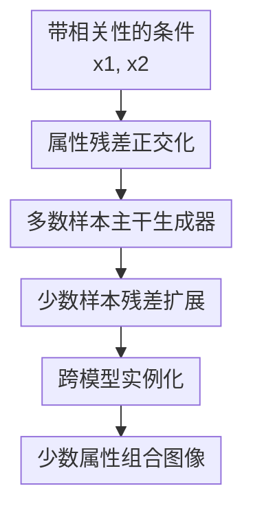

# ProReGen: Progressive Residual Generation under Attribute Correlations

**会议**: ICLR2026  
**OpenReview**: [https://openreview.net/forum?id=2LzYaW032Q](https://openreview.net/forum?id=2LzYaW032Q)  
**代码**: https://github.com/ruby-stha/ProReGen_ICLR2026  
**领域**: 图像生成  
**关键词**: 属性相关性, 条件生成, 残差生成, 反事实图像, 扩散模型  

## 一句话总结
ProReGen 把相关属性条件 $x_1,x_2$ 改写为正交的 $x_1,\gamma$，先用大量多数样本学习主干生成器，再用少量少数样本学习残差生成层，从而提升条件 VAE、GAN 和扩散模型在少数属性组合上的生成正确性。

## 研究背景与动机
**领域现状**：条件生成模型常被用来合成特定属性组合的图像，例如“某个数字配某种颜色”“某类物体配某种腐蚀类型”“男性金发人脸”等。理想情况下，模型应该能按照给定条件组合生成图像，而不是只复现训练集中最常见的属性共现模式。

**现有痛点**：真实训练集里的属性经常强相关。一个数字可能主要以某种颜色出现，一个物体类别可能主要配某种背景或噪声，一个人脸属性也可能和性别、发色等变量自然纠缠。普通条件生成模型在这类数据上训练时，会把相关性当成生成规律学进去；当用户要求少数属性组合时，模型往往生成“看起来像多数模式”的图像，或者牺牲图像质量来勉强满足条件。

**核心矛盾**：少数属性组合恰好是模型最需要学会的区域，但这些组合在训练集中样本最少。重采样能提高少数样本权重，却容易过拟合有限样本；用分类器给生成图像加伪监督也不稳，因为分类器本身同样是在带属性相关的数据上训练的；显式把生成机制拆成形状、纹理、背景等独立模块又需要很强先验，不一定适用于任意属性对。

**本文目标**：作者想解决的是“在属性相关的条件生成数据上，如何更可靠地生成少数属性组合”。具体来说，方法既要减少模型对训练相关性的依赖，又不能完全把学习压力压到稀缺少数样本上，还要能落到不同类型的深度生成模型中，而不是只服务某一种架构。

**切入角度**：论文借用了 Robinson partialling-out transformation 的思想。与其强行从相关输入 $x_1,x_2$ 中恢复两个独立生成机制，不如先把 $x_2$ 分成能由 $x_1$ 预测的部分 $m(x_1)$ 和预测不了的残差 $\gamma=x_2-m(x_1)$。这样，生成条件从相关的 $x_1,x_2$ 变成更接近正交的 $x_1,\gamma$。

**核心 idea**：用“属性残差正交化 + 两阶段残差生成”替代直接条件生成，让多数样本负责学习相关属性下的主干生成规律，让少数样本只负责学习从多数模式到少数模式所需的残差变化。

## 方法详解

### 整体框架
ProReGen 的输入是一组存在相关性的图像属性 $x_1,x_2$，输出是符合目标属性组合的图像 $y$。它先估计 $x_2$ 中能由 $x_1$ 解释的部分 $m(x_1)$，得到残差属性 $\gamma=x_2-m(x_1)$；然后先在多数样本上学习 $\tilde g(z,x_1,\gamma=0)$，再冻结主干并在少数样本上学习残差扩展层，把多数生成特征改造成目标少数组合。

从函数视角看，普通条件生成模型要直接学习 $y=g(z,x_1,x_2)$。ProReGen 把它改成 $y=\tilde g(z,x_1,\gamma)$，其中 $\gamma$ 表示 $x_2$ 中无法被 $x_1$ 预测的那部分。多数样本通常满足 $x_2\approx m(x_1)$，也就是 $\gamma\approx 0$，所以可以用它们学习稳定的主干生成器 $g_{mjr}$；少数样本对应 $\gamma\neq 0$，只用于学习额外的 $g_{res}$，负责补上从多数模式到少数模式的差异。

论文把这个框架实例化到三类模型：条件 VAE、条件 GAN 和条件扩散模型。VAE/GAN 的版本是在生成器和编码器或判别器末端扩展轻量残差层；扩散模型不能简单“追加去噪步”，所以采用类似 ControlNet 的特征注入，让冻结的一阶段 U-Net 在下采样和中间块给二阶段少数生成网络提供特征。

### 关键设计
**1. 属性残差正交化：把相关条件改写成可分开的相关效应和残差效应**

这篇论文最核心的第一步不是改网络，而是改条件变量。若 $x_1$ 和 $x_2$ 在训练集中高度相关，直接让模型看见二者时，它很难区分“$x_1$ 本身造成的图像变化”和“因为 $x_2$ 总是跟着 $x_1$ 出现而带来的变化”。ProReGen 估计 $m(x_1)\approx E[x_2|x_1]$，再定义 $\gamma=x_2-m(x_1)$，把原来的条件生成从 $g(z,x_1,x_2)$ 改写为 $\tilde g(z,x_1,\gamma)$。

这个改写的含义是：$x_1$ 吸收那些能从训练相关性中预测出来的 $x_2$ 成分，也就是论文称为 correlated effect 的部分；$\gamma$ 只保留 $x_2$ 中无法由 $x_1$ 解释的 residual effect。于是模型不再需要从稀少样本中同时学两个纠缠机制，而是学习一个更清楚的问题：多数模式由 $x_1$ 解释，偏离多数模式的部分由 $\gamma$ 解释。

**2. 多数样本主干生成器：把主要生成负担转移到样本充足的区域**

在属性相关数据里，多数样本数量大、分布稳定，但它们只覆盖 $\gamma=0$ 或接近 $0$ 的情况。ProReGen 利用这一点，第一阶段只在多数样本上训练 $g_{mjr}(z,x_1)$，让它近似 $\tilde g(z,x_1,\gamma=0)$。这一步等价于先学会“训练数据最常见相关模式下，图像应该长什么样”。

这个设计避免了一个常见陷阱：如果从一开始就把多数和少数混在一起训练，模型参数会被多数模式主导，而少数样本不足以纠正错误关联；如果只强调少数样本，又容易过拟合。先用多数样本学习主干，相当于把形状、背景、纹理、噪声结构等大部分生成能力稳定下来，后续少数样本只需要告诉模型“在这个主干上，残差属性应该改变什么”。

**3. 少数样本残差扩展：冻结主干，只学习从多数模式到少数模式的差异**

第二阶段是 ProReGen 区别于普通重采样的关键。模型冻结第一阶段的主干权重，取主干生成器最终激活前的特征图 $h_{mjr}(x_1)$，再加入 $x_1$ 和残差属性 $\gamma$，由额外的残差层 $g_{res}$ 生成少数样本。论文把整体近似写成：

$$
y=\tilde g(z,x_1,\gamma)\approx g_{res}(h_{mjr}(x_1),x_1,\gamma),\quad \gamma=x_2-m(x_1).
$$

这个二阶段设计把少数样本的任务缩小了：它们不用从零学习完整图像分布，只需学习多数生成特征应该如何被修改。例如在 Colored-MNIST 中，主干已经学会数字结构，残差层主要学习颜色偏离多数颜色时怎样改变；在 Corrupted-CIFAR10 中，主干学物体类别和常见腐蚀的组合，残差层学习异常腐蚀类型带来的变化。

**4. 跨模型实例化：同一思想分别落到 VAE、GAN 和扩散模型**

ProReGen 不是只为某个生成器写的技巧。对于 VAE，第一阶段训练条件编码器和解码器，第二阶段在解码器末端加扩展层，同时镜像扩展编码器，让少数样本通过残差属性进入重建目标。对于 GAN，第一阶段训练条件生成器和判别器，第二阶段同时扩展生成器和判别器，用对抗损失学习少数分布。二者的共同点是：扩展层相对主干很轻，只在空间维度不变的卷积层里注入 $\gamma$。

扩散模型版本更特殊。DDPM 的生成过程是逐步去噪，不能像 VAE/GAN 那样简单在末端加几层。论文因此训练一个二阶段少数去噪网络 $\epsilon_{\theta_{mnr}}(y_{mnr,t},t,\gamma)$，并把冻结的一阶段多数 U-Net 的下采样和中间块特征注入进去。这样二阶段网络在每个扩散步都能借用多数模型已经学到的结构信息，同时用 $\gamma$ 控制少数组合。

### 一个完整示例
以 Colored-MNIST 为例，设 $x_1$ 是数字类别，$x_2$ 是颜色，训练集中“数字 3 大多是绿色、数字 7 大多是红色”。普通条件 GAN 如果被要求生成“数字 3 + 红色”，容易仍然生成绿色 3，或者生成颜色对了但数字形状变差。

ProReGen 会先用多数样本估计 $m(x_1)$，也就是每个数字通常对应什么颜色。对于“数字 3 + 红色”，残差 $\gamma$ 表示“红色相对数字 3 的默认颜色有多大偏离”。第一阶段的 $g_{mjr}$ 学会生成标准的数字 3 及其常见颜色；第二阶段的 $g_{res}$ 在少量“数字和颜色不按常见组合出现”的样本上学习如何把这个特征图改成目标颜色，同时尽量保留数字结构。

在 MNIST-Correlation 里也类似。若 $x_1$ 是奇偶性，$x_2$ 是是否有 zigzag 以及 zigzag 端点位置，多数样本可能是“偶数干净、奇数带 zigzag”。ProReGen 先学习这套多数规律，再用 $\gamma$ 表示“与常见 zigzag 状态和位置的偏离”，从而生成“偶数带 zigzag”或“奇数干净”这样的少数组合。

### 损失函数 / 训练策略
属性残差的基础定义是 $\gamma=x_2-\hat m(x_1)$。第一阶段学习 $\hat m(x_1)$ 和多数生成器 $g_{mjr}$；第二阶段冻结第一阶段参数，只优化残差扩展层。对于 VAE，第一阶段使用标准 ELBO，第二阶段仍使用重建项加 KL 项，只是重建目标来自少数样本，生成结果为 $\hat y_{mnr}=G_{\theta res}(G_{\theta mjr\setminus \sigma}(z,x_1),x_1,\gamma)$。

对于 GAN，第一阶段用标准条件对抗损失。第二阶段在少数样本上训练扩展后的生成器和判别器，生成器输入为冻结主干的最终激活前特征、$x_1$ 和 $\gamma$，判别器也用镜像扩展层处理少数真实图像或少数生成图像。这样判别器仍能借助第一阶段已经学到的多数判别能力。

对于扩散模型，第一阶段遵循 DDPM 的前向加噪和噪声预测目标：

$$
y_t=\sqrt{\bar\alpha_t}y_0+\sqrt{1-\bar\alpha_t}\epsilon,\quad \epsilon\sim N(0,I),
$$

$$
L_{MSE}(\theta)=E_{y_0,t,c,\epsilon}\left[\|\epsilon-\epsilon_\theta(y_t,t,c)\|^2\right].
$$

其中第一阶段条件 $c=x_1$，第二阶段条件 $c=\gamma$。二阶段扩散网络沿用相同噪声日程、扩散步数和 U-Net 结构，使来自一阶段网络的特征与二阶段当前扩散步对齐。论文还报告训练开销：在 Colored-MNIST 98% 相关强度下，二阶段每 epoch 时间约为 VAE 0.186 秒、GAN 0.268 秒、DM 2.913 秒，只有对应一阶段的一小部分。

## 实验关键数据

### 主实验
论文在三个人工构造属性相关的数据集和一个自然相关数据集上评估。Colored-MNIST 用数字和颜色构造 95%、98%、99%、99.5% 相关强度；MNIST-Correlation 用奇偶性和 zigzag 构造相关；Corrupted-CIFAR10 用物体类别和腐蚀类型构造相关；CelebA 用性别和发色的自然相关做定性评估。指标包括属性正确性、FID、Coverage 和 Density。

| 数据集 | 模型/场景 | 主要观察 | 相比基线的结论 |
|--------|-----------|----------|----------------|
| Colored-MNIST | c-VAE / c-GAN / c-DM | ProReGen 通常提高少数生成正确性，尤其在 c-GAN 和 c-DM 中更明显 | 比 naive 更能生成目标少数组合；相比伪监督方法，较少牺牲多数生成正确性 |
| MNIST-Correlation | c-VAE / c-GAN | ProReGen-VAE 提升少数正确性但多数正确性略降；ProReGen-GAN 大幅提升少数正确性并改善 FID | 伪监督 causal-cHVAE/causal-GAN 表现不稳定；重采样能提高正确性但常恶化 FID |
| Corrupted-CIFAR10 | c-GAN / c-DM | 随相关强度增加，naive 模型少数正确性下降；ProReGen 改善少数正确性且较少损害多数生成 | 重采样有时有效，但会降低多样性或多数正确性 |
| CelebA | c-DM，自然性别-发色相关 | naive c-DM 在少数人脸属性组合上明显出错或质量差；ProReGen-DM 能稳定生成正确且自然的少数组合 | 在缺少可靠 oracle classifier 的自然图像上，定性结果支持方法有效 |

### 消融实验
论文重点验证了两阶段训练、$m(x_1)$ 估计误差、属性因果方向和残差子网络大小。最直接的消融是把同样架构改成单阶段同时训练 $g_{mjr}$ 和 $g_{res}$，结果在 Colored-MNIST 95% 相关强度下明显崩坏。

| 配置 | 指标 | 结果 | 说明 |
|------|------|------|------|
| 两阶段训练，Majority | Correctness / FID / Coverage / Density | 0.9592 / 16.9488 / 0.9003 / 0.7628 | 多数生成质量稳定 |
| 两阶段训练，Minority | Correctness / FID / Coverage / Density | 0.9256 / 17.2562 / 0.7519 / 0.6089 | 少数生成正确性和多样性都较好 |
| 单阶段训练，Majority | Correctness / FID / Coverage / Density | 0.9289 / 29.0843 / 0.7636 / 0.5585 | 多数正确性影响不大，但质量和覆盖下降 |
| 单阶段训练，Minority | Correctness / FID / Coverage / Density | 0.3557 / 65.0227 / 0.0432 / 0.0320 | 少数生成几乎失效，说明 progressive 训练不是可有可无 |
| $m(x_1)$ 估计 80% 扰动 | Minority overall correctness | 0.8589 | 正确性下降但仍优于 naive，主要错误来自颜色残差估计不准 |
| Colored-MNIST 因果方向反转 | Minority correctness | 0.0811 vs. 0.9396 | color→digit 的残差生成比 digit→color 难得多，方向选择会影响性能 |
| 单卷积块残差子网 | Minority correctness / FID | 0.6476 / 20.6536 | 残差层太弱会学不充分，两卷积块版本达到 0.9256 / 17.2562 |

### 关键发现
- ProReGen 的提升主要体现在少数属性组合的正确性上，而且不是简单通过牺牲多数生成来换取少数正确性。
- 两阶段训练是核心贡献之一；同样架构若单阶段训练，少数生成的 correctness 从 0.9256 掉到 0.3557，Coverage 也从 0.7519 掉到 0.0432。
- 重采样在若干设置中能接近 ProReGen 的正确性，但更容易出现少数样本记忆化，Coverage 或 FID 会恶化。
- 伪监督方法的问题在高相关强度下暴露明显：分类器也受属性相关性影响，给出的监督信号可能把生成模型带向错误折中。
- ProReGen 对 $m(x_1)$ 的估计误差不是完全免疫，但下降较平滑；这说明残差正交化有实际价值，但估计器质量仍会影响最终生成。
- 属性方向不是纯形式选择。若把 Colored-MNIST 从 digit→color 反过来设成 color→digit，残差任务变成“改数字结构”，比“改颜色”难很多，性能显著变差。

## 亮点与洞察
- **把去偏问题转成残差生成问题**：论文没有继续堆采样权重或分类器伪标签，而是先改变条件变量表示。这让“少数组合难生成”的问题从完整分布学习缩小为残差学习，思路更接近问题根因。
- **Robinson transformation 的迁移很巧妙**：原本用于半参数回归和因果估计的 partialling-out，在这里被用作生成模型设计原则。它不是直接套线性公式，而是借用“可预测部分 + 残差部分”的分解来重构条件生成。
- **progressive 训练降低少数样本压力**：少数样本最稀缺，却最容易被要求承担完整生成任务。ProReGen 把大部分图像结构学习交给多数样本，少数样本只负责偏离部分，这个分工很符合数据条件。
- **方法跨架构可复用**：VAE、GAN、DM 三类模型都能落地，说明它不是某个网络细节的偶然收益。尤其扩散版本用冻结多数 U-Net 做特征注入，为后续扩展到更大条件生成模型提供了清晰接口。
- **因果方向实验很有启发**：论文没有把 $x_1\to x_2$ 当成无关紧要的记号，而是展示方向会改变残差任务难度。这提醒实际应用中应优先选择“残差更容易生成”的方向，除非真实因果方向已知且必须遵守。

## 局限与展望
- ProReGen 目前假设可以把样本分成明确的多数/少数子群，适合离散属性组合；对于连续属性、长尾文本提示或开放词表属性，还需要重新设计 $m(x_1)$ 和训练样本权重。
- VAE/GAN 版本主要在图像或特征图层面做残差操作，扩散版本也基于像素空间 DDPM。作者指出未来可以把残差效应迁移到 latent diffusion 或更语义化的潜空间中。
- 方法依赖 $m(x_1)$ 的估计质量。消融显示即使有较大扰动仍能工作，但属性残差估错会直接影响生成属性，尤其当残差对应颜色、结构等显著视觉因素时。
- 少数生成的评估仍不完美。人工数据集可以训练 oracle classifier，但自然图像数据如 CelebA 很难获得无偏 oracle，因此论文只能给定性结果；未来需要带不确定性的正确性评估。
- 论文讨论了 text-to-image 的潜在应用，但没有在大规模文本到图像模型上实验。现实提示空间更稀疏、更重尾，属性相关性也更复杂，ProReGen 能否扩展到这种规模仍需验证。

## 相关工作与启发
- **vs 重采样 / 重加权**: 重采样通过提高少数样本出现频率来抵消相关性，做法直接但依赖少数样本数量和多样性。ProReGen 不只是改采样分布，而是先学习多数主干再学残差，因此更能避免少数样本记忆化。
- **vs causal-cHVAE / causal-GAN**: 伪监督方法用分类器判断生成图像是否符合目标属性，但分类器也可能学到同样的虚假相关。ProReGen 不依赖另一个有偏分类器来监督反事实生成，而是把属性残差显式作为条件。
- **vs Counterfactual Generative Networks**: 这类方法通过结构先验拆分形状、纹理、背景等独立机制，在先验正确时很强。ProReGen 的优势是不要求预先知道不同属性如何对应不同图像机制，但它也因此不能保证学到真正的因果机制。
- **vs disentanglement under correlation shifts**: 表征解耦工作关注潜变量是否分开，ProReGen 更关注条件生成能否正确产生少数属性组合。它的残差变量可以看作一种面向生成任务的实用正交化，而不是追求完全解耦表示。
- **对未来工作的启发**: 在文本到图像、医学图像合成或数据增强里，属性共现偏差往往比单纯类别不平衡更难处理。可以考虑把 ProReGen 的残差条件接到 LoRA、ControlNet 或 latent diffusion 的控制分支上，用少量少数样本学习偏离主流提示分布的生成修正。

## 评分
- 新颖性: ⭐⭐⭐⭐☆ 把 Robinson partialling-out 转成条件生成模型的残差训练框架，视角新颖且不依赖单一架构。
- 实验充分度: ⭐⭐⭐⭐☆ 覆盖 VAE/GAN/DM、多个合成数据集和 CelebA 定性实验，消融也抓住了关键变量；不足是自然图像缺少定量 oracle。
- 写作质量: ⭐⭐⭐⭐☆ 论文主线清楚，图 1 的概念解释很有帮助；部分公式和模型实例化细节需要读附录才能完全对齐。
- 价值: ⭐⭐⭐⭐☆ 对属性相关下的少数组合生成很有实用价值，尤其适合偏差数据增强和反事实图像合成；大规模文本到图像扩展仍待证明。

<!-- RELATED:START -->

## 相关论文

- [\[ICLR 2026\] Variational Autoencoding Discrete Diffusion with Enhanced Dimensional Correlations Modeling](variational_autoencoding_discrete_diffusion_with_enhanced_dimensional_correlatio.md)
- [\[CVPR 2026\] Omni-Attribute: Open-vocabulary Attribute Encoder for Visual Concept Personalization](../../CVPR2026/image_generation/omni-attribute_open-vocabulary_attribute_encoder_for_visual_concept_personalizat.md)
- [\[CVPR 2026\] SIGMA: Selective-Interleaved Generation with Multi-Attribute Tokens](../../CVPR2026/image_generation/sigma_selective-interleaved_generation_with_multi-attribute_tokens.md)
- [\[ICLR 2026\] SPRINT: Sparse-Dense Residual Fusion for Efficient Diffusion Transformers](sprint_sparse-dense_residual_fusion_for_efficient_diffusion_transformers.md)
- [\[ICLR 2026\] AttriCtrl: A Generalizable Framework for Controlling Semantic Attribute Intensity in Diffusion Models](attrictrl_a_generalizable_framework_for_controlling_semantic_attribute_intensity.md)

<!-- RELATED:END -->
