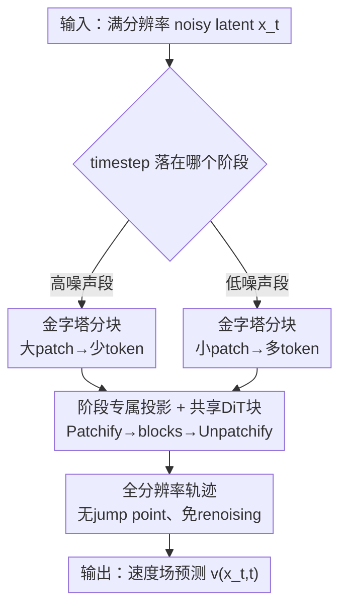

# Pyramidal Patchification Flow for Visual Generation

**会议**: ICLR 2026  
**OpenReview**: [https://openreview.net/forum?id=hRfJjmsibX](https://openreview.net/forum?id=hRfJjmsibX)  
**代码**: https://github.com/fudan-generative-vision/PPFlow  
**领域**: 扩散模型 / 图像生成  
**关键词**: Diffusion Transformer, Flow Matching, 分块加速, 金字塔, 采样效率

## 一句话总结
让 Diffusion Transformer 在高噪声时间步用更大的分块（更少 token）、低噪声时间步用更小的分块（更多 token），共享同一套 DiT 主干、只为不同分块尺寸学各自的线性投影，从而在画质几乎不掉的前提下把去噪推理加速约 1.6×~2.0×。

## 研究背景与动机

**领域现状**：以 Diffusion Transformer（DiT）/ flow matching 为代表的视觉生成模型已是 SOTA。DiT 的标准流程是 Patchify → DiT blocks → Unpatchify：先把空间隐变量切成 $p\times p$ 的 patch，线性投影成 $L=(I/p)^2$ 个 token，过若干 Transformer 块估计速度场，再反投影回隐空间。原始 DiT 对**所有时间步都用同一个 $2\times2$ 的 patch size**，也就是说不管噪声多大，token 预算恒定。

**现有痛点**：去噪轨迹需要很多次昂贵的网络前向，而每次前向的开销主要由 token 数 $L$ 决定——自注意力对 $L$ 是平方复杂度。在 DiT-XL/2 里约 **99.8% 的 FLOPs 落在 DiT blocks**。可一个被作者强调的观察是：高噪声阶段的隐变量本身又糙又模糊，根本不需要那么细的空间 token 去刻画，恒定 token 预算在高噪声段是纯浪费。

**核心矛盾**：想在高噪声段减少 token 数来省算力，最直接的办法是金字塔/级联式地降低**表示分辨率**（如 Pyramidal Flow、PixelFlow）。但这样做会在阶段切换处产生分辨率"跳变点"（jump point）：轨迹不连续、不满足连续性方程，必须用精心设计的 re-noising 技巧去缝合，训练推理都更复杂，还容易出块状伪影。于是"省 token"和"保持轨迹连续 / 实现简单"形成了 trade-off。

**本文目标**：在不改变隐表示分辨率、不引入 jump point、不需要 re-noising 的前提下，仍然实现"高噪声少 token、低噪声多 token"的自适应算力分配。

**切入角度**：作者意识到——token 数其实由 **patch size** 而不是表示分辨率单独决定。既然只想减 token，那就只改 patchify 的 patch size、把隐表示分辨率始终保持满分辨率即可。

**核心 idea**：用"按时间步变化的金字塔式分块"代替"按时间步变化的金字塔式分辨率"，从而既省 token 又免去 re-noising。

## 方法详解

### 整体框架

PPFlow（Pyramidal Patchification Flow）把整条去噪时间轴切成若干阶段（论文用三阶段示例 $\{[0,t_{s1}),[t_{s1},t_{s2}),[t_{s2},1]\}$），每个阶段配一个金字塔式的 patch size：高噪声阶段用大 patch（如 $4\times4$）、中间用 $4\times2$、低噪声阶段用标准 $2\times2$。前向时，同一个隐变量 $x_t$ 始终保持满分辨率，只是根据当前 timestep 落在哪个阶段，选用对应的 patch size 和对应的 Patchify/Unpatchify 线性投影；中间的 DiT blocks 主干则**所有阶段共享同一套参数**。因为 patch size 不改变 token 维度 $d$ 也不改变 DiT 块的结构，整套设计只是给每个 patch size 各加一对线性投影，改动极小。

### 关键设计

**1. 金字塔分块：用 patch size 而非分辨率来调节 token 预算**

这是全文的根。痛点在于恒定 token 预算让高噪声段算力浪费。PPFlow 把时间轴分阶段，每阶段绑一个 patch size $p_{si}\times p_{si}$，高噪声阶段 patch 大、token 少。由于 token 数 $L=(I/p)^2$、单个 DiT 块复杂度为 $O(L^2 d + L d)$（自注意力平方、MLP 线性），把 patch 从 $2\times2$ 放大到 $4\times4$ 会让该阶段 token 数降到 $1/4$，算力随之骤降。两阶段、三阶段 PPFlow 在 $256\times256$ 上分别把 FLOPs 降低 **37.8%** 和 **50.6%**。与降分辨率方案的根本区别是：这里的隐表示**始终满分辨率**，只是"看得粗 / 看得细"在变，轨迹本身没断。

**2. 共享 DiT 主干 + 阶段专属线性投影：几乎零额外开销地承载多种 patch size**

如果每个 patch size 都配一整套 DiT，参数和训练成本会爆炸。PPFlow 的做法是：所有阶段共用同一套 DiT blocks 参数，只让 Patchify 和 Unpatchify 的线性投影矩阵按阶段分开——第 $i$ 阶段有自己的 $W_{si}\in\mathbb{R}^{d\times d_{si}}$（其中 $d_{si}=C p_{si}^2$）和对应的反投影矩阵。这样设计的精妙处在于一条复杂度恒等式：

$$L_s \times d_s \times d = (I/p_s)^2 \times (p_s^2 C) \times d = I^2 C d.$$

也就是说**线性投影的开销与 patch size 无关**，恒为 $I^2Cd$；真正随 token 数变化的只有占了 99.8% FLOPs 的 DiT 主干。于是"只改投影、共享主干"几乎不增加额外参数与算力，却把省 token 的收益全额拿到。这也解释了为什么从预训练 DiT 适配时，只需 $+8.9\%$（两阶段）/ $+7.1\%$（三阶段）训练 FLOPs。

**3. 全分辨率轨迹：消除 jump point，免去 re-noising 技巧**

这一点是 PPFlow 相对 Pyramidal Flow / PixelFlow 的核心差异化。后者在阶段间切换表示分辨率，轨迹出现"跳变点"、不满足连续性方程，必须靠精心设计的 re-noising 把相邻阶段缝起来，否则会出模糊和块状伪影。PPFlow 因为隐表示分辨率全程不变，**仍满足连续性方程**，阶段切换时只是换 patch size 和换那对线性投影，没有任何 jump point；其推理流程和普通 DiT 完全一致——从噪声出发逐步积分速度场，唯一区别是"按当前 timestep 选对应阶段的 Patchify/Unpatchify"。这让方法既省算力又不引入额外采样 trick。

**4. 从预训练 DiT 低成本适配：平均/复制初始化 + 阶段级 CFG 与 level embedding**

为了不从头训练，PPFlow 给出了从普通 DiT 直接迁移的初始化方案：DiT 块权重整套拷贝；Patchify 的大 patch 投影用**平均**初始化，例如 $4\times4$ 阶段令 $W_2=\tfrac14[W,W,W,W]$（系数 $\tfrac14=\tfrac{2\times2}{4\times4}$，直观上是把四个 $2\times2$ patch 平均后映成一个 token）；Unpatchify 则用**复制**初始化 $W_2^u=[(W^u)^\top,(W^u)^\top,(W^u)^\top,(W^u)^\top]^\top$，让四个子 patch 的初始输出相同。训练时每个 patch size 的投影**只用其所属时间段的 noisy latent** 来训，使得该 patch size 能专门适配对应的噪声强度——这与 FlexiDiT / Lumina-Video"每个 patch size 都覆盖全部时间步"不同，避免了训练/测试不一致。此外推理用**阶段级 CFG 调度**（如 PPF-XL-2 用 $[1.0,3.0]$、PPF-XL-3 用 $[1.0,3.5,3.75]$），并加入可学习的 patch-level/stage embedding，进一步稳住画质。

### 损失函数 / 训练策略
训练目标沿用标准 flow matching：通过线性插值 $x_t = t x_1 + (1-t)x_0$ 构造从噪声到数据的轨迹，速度场 $u_t = x_1 - x_0$，网络以 $\mathbb{E}\big[\lVert v(x_t,t) - (x_1-x_0)\rVert_2^2\big]$ 为目标拟合。阶段划分（时间分段 + 各段 patch size）在训练全程固定。支持两种训练方式：从头训（按普通 DiT 初始化、各 patch size 投影只用其对应时间段的样本训练）与从预训练 DiT 适配（上文的平均/复制初始化，推荐方式，成本极低）。实现上用 Patch n' Pack 把变长 token 序列打包进 batch，进一步降低单次迭代的训练 FLOPs。

## 实验关键数据

### 主实验

ImageNet 类条件生成，从头训练（PPF-B 系列，对照 SiT-B/2）：

| 方法 | 训练步数 | 测试FLOPs(%) | FID-50k↓ | IS↑ | 加速 |
|------|---------|-------------|----------|-----|------|
| SiT-B/2 | 7M | 100 | 4.46 | 180.95 | 1× |
| PPF-B-2 | 11M | 62.0 | **3.83** | 223.00 | ~1.6× |
| PPF-B-3 | 11M | 49.1 | 4.43 | **230.72** | ~2.0× |

从预训练 DiT 适配（仅 $\le10\%$ 预训练 FLOPs）：

| 方法 | 分辨率 | 额外训练FLOPs(%) | 测试FLOPs(%) | FID-50k↓ | IS↑ |
|------|-------|-----------------|-------------|----------|-----|
| SiT-XL/2 | 256 | - | 100 | 2.15 | 258.09 |
| PPF-XL-2 | 256 | 8.9 | 62.6 | **1.99** | 271.62 |
| PPF-XL-3 | 256 | 7.1 | 49.4 | 2.23 | **286.67** |
| DiT-XL/2 | 512 | - | 100 | 3.04 | 240.82 |
| PPF-XL-2 | 512 | 7.6 | 58.7 | 3.01 | 249.98 |

两阶段约 1.60×、三阶段约 2.02× 推理加速，FID 基本持平甚至更优、IS 普遍更高。文生图上把两阶段 PPFlow 接到 FLUX.1-dev，512→2048 分辨率取得 1.61×~1.86× 加速，GenEval / DPG Bench / T2I-CompBench 与微调基线 FLUX.1-ft 几乎一致。

### 消融实验

| 配置 | FID-50k↓ | IS↑ | 说明 |
|------|----------|-----|------|
| PPF-B-2 | 4.44 | 201.12 | 基础版（1M 步，预训练适配） |
| + level Emb. | 4.30 | 212.70 | 加阶段 embedding |
| + stage CFG | **4.22** | **252.10** | 再加阶段级 CFG |

与同样"高噪声少 token"路线的对比（从头训 1M 步）：

| 方法 | FID-50k↓ | IS↑ | 说明 |
|------|----------|-----|------|
| Pyramid Rep. | 164.48 | 8.29 | 纯金字塔分辨率，崩坏 |
| Pyramid Rep. + Renoising | 27.69 | 73.20 | 加 re-noising 缝合，仍差 |
| Lumina-Video method | 18.77 | 79.12 | 变 patch 但训练全时段 |
| **PPF-B-2** | **15.68** | **88.78** | 本文 |

与 FlexiDiT 在 DiT-XL/2 上对比：约 63% FLOPs 时 PPFlow FID 2.15 优于 FlexiDiT 2.25；约 50% FLOPs 时 PPFlow 2.31 远好于 FlexiDiT 2.64。

### 关键发现
- 贡献最大的是"金字塔分块 + 共享主干"本身：在约一半 FLOPs 下画质几乎不掉，证明高噪声段的细 token 确实冗余。
- 阶段级 CFG 对 IS 提升尤其明显（201→252），说明不同噪声阶段适合不同的 guidance 强度。
- 纯降分辨率方案（Pyramid Rep.）若不做 re-noising 会直接崩（FID 164），即使加 re-noising 也远不如 PPFlow，凸显"保持满分辨率轨迹"的价值。
- 阶段数越多测试 FLOPs 越低，但需要更多训练步才能追回两阶段画质——存在阶段数与训练预算的 trade-off。

## 亮点与洞察
- **解耦 token 数与表示分辨率**：把"省 token"这件事从"降分辨率"剥离出来，只动 patch size，是这篇论文最干净的洞察——一下子绕开了 jump point 和 re-noising 这一整套麻烦。
- **复杂度恒等式 $I^2Cd$ 很优雅**：证明了线性投影开销与 patch size 无关，从而"只换投影、共享主干"是近乎免费的午餐，可直接嫁接到任何现成 DiT/FLUX 上。
- **平均/复制初始化**让从预训练模型适配的成本压到个位数百分比 FLOPs，工程上极友好，几乎是"插上就能加速"。
- 这套"按噪声强度自适应分配算力"的思路可迁移到视频生成、3D 生成等任何 patchify-based 的扩散/flow 框架。

## 局限与展望
- 阶段数、时间分段点、各段 patch size 都是人工设定的固定 schedule，论文未给自动搜索方案，换数据/分辨率可能要重调。
- 加速比受限于最大可用 patch size 和高噪声段占比；当低噪声段（满 token）较长时收益会被摊薄。
- 评测集中在 ImageNet 类条件与 FLUX 文生图，对更复杂的视频/长序列生成的可扩展性仅在文中作为展望提及。
- 阶段切换处虽无分辨率 jump，但不同 patch size 投影间是否存在细微表征不连续、对极端 prompt 是否稳健，文中未深挖。

## 相关工作与启发
- **vs Pyramidal Flow / PixelFlow**：它们在阶段间改隐表示分辨率，产生 jump point、不满足连续性方程，需 re-noising 缝合；PPFlow 保持满分辨率、只改 patch size，免 re-noising，画质与稳定性都更好（FID 15.68 vs 27.69）。
- **vs FlexiDiT / Lumina-Video**：同样让高噪声用大 patch，但它们每个 patch size 训练时覆盖全部时间步，导致训练/测试不一致；PPFlow 让每个 patch size 只训其对应噪声段，专精对应噪声强度，实测更优（约 63% FLOPs 下 FID 2.15 vs 2.25）。
- **vs 蒸馏 / 一致性模型 / 量化等加速路线**：那些减少前向次数或降低单次开销的方法与 PPFlow 正交——PPFlow 是"减少单次前向的 token 数"，原则上可与蒸馏、量化叠加进一步提速。

## 评分
- 新颖性: ⭐⭐⭐⭐ 把"省 token"从"降分辨率"解耦、用 patch size 实现金字塔，简单却切中要害。
- 实验充分度: ⭐⭐⭐⭐ 覆盖从头训/预训练适配、多模型多分辨率、类条件 + 文生图，并与多条加速路线正面对比。
- 写作质量: ⭐⭐⭐⭐ 方法清晰、复杂度推导到位，与相近工作的区别讲得很透。
- 价值: ⭐⭐⭐⭐ 改动极小、可即插即用地给现成 DiT/FLUX 提速 1.6×~2×，实用性强。

<!-- RELATED:START -->

## 相关论文

- [\[CVPR 2026\] DPAR: Dynamic Patchification for Efficient Autoregressive Visual Generation](../../CVPR2026/image_generation/dpar_dynamic_patchification_for_efficient_autoregressive_visual_generation.md)
- [\[ICLR 2026\] LapFlow: Laplacian Multi-scale Flow Matching for Generative Modeling](lapflow_laplacian_multi-scale_flow_matching_for_generative_modeling.md)
- [\[ICLR 2026\] Product of Experts for Visual Generation](product_of_experts_for_visual_generation.md)
- [\[ICLR 2026\] Next Visual Granularity Generation](next_visual_granularity_generation.md)
- [\[ICLR 2026\] Delay Flow Matching](delay_flow_matching.md)

<!-- RELATED:END -->
