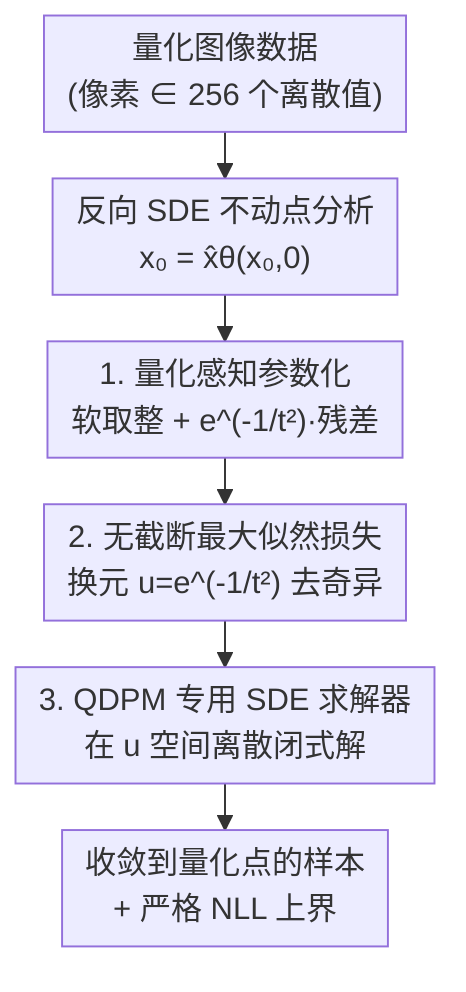

# Quantization-Aware Diffusion Models for Maximum Likelihood Training

**会议**: ICLR 2026  
**OpenReview**: [https://openreview.net/forum?id=5ekhMkawuT](https://openreview.net/forum?id=5ekhMkawuT)  
**代码**: 待确认  
**领域**: 扩散模型 / 图像生成 / 密度估计  
**关键词**: 扩散模型, 数据量化, 最大似然, 密度估计, 反向 SDE

## 一句话总结
针对"真实数字图像其实是离散量化值、而扩散模型却把它当连续信号"这一根本矛盾，本文给信号预测器设计了一种"软取整 + 超指数衰减残差"的参数化，使反向 SDE 在 $t\to0$ 时必然收敛到量化点，从而把扩散模型的密度估计推到极致——CIFAR-10 的 NLL 从此前 SOTA 的 2.42 bpd 暴降到 0.27 bpd。

## 研究背景与动机
**领域现状**：连续时间扩散模型（score-based / SDE 框架）在图像生成和密度估计上都是 SOTA。它把数据逐步加噪推向高斯，再学习反向 SDE 从噪声还原数据；当权重函数取 $w(t)=t$ 时，score matching 损失恰好等价于最大化数据似然的一个下界，因此扩散模型可以直接拿来做严格的对数似然评估。

**现有痛点**：但所有这些模型骨子里都假设数据是连续的，而真实数字图像是**量化**的——8-bit 像素只能取 0~255 这 256 个整数值。现有工作要么干脆无视量化、把数据当连续信号训练（推理后再做一次后处理取整），要么往量化数据上加一点均匀噪声做"去量化"（dequantization）让数据落到连续空间。前者无法保证反向 SDE 的样本真的落在量化点上，后者会让模型学着生成带噪声的脏数据，反而损害性能。两条路都是 ad-hoc 的拼凑。

**核心矛盾**：扩散模型的反向 SDE 终点是一个连续分布，它**天然不会**收敛到那有限个量化点上；而做最大似然评估时又必须把数据当成离散值来算概率。这种"连续生成 ↔ 离散数据"的错位，不仅让似然评估只能靠变分上界绕道，还导致一个隐蔽的数值病：ELBO 目标里含 $t^{-3}$ 系数，当起始时间 $t_{\min}\to0$ 时会发散，所以以往的最大似然训练都得人为把时间截断在 $[t_{\min}, t_{\max}]$ 区间内，留下一截没建模的"最后一公里"。

**本文目标**：把量化直接写进 score 函数的设计里，使反向 SDE **保证**收敛到量化点，从而(1)甩掉训练/推理两端所有 ad-hoc 的去量化/后处理，(2)让 $t_{\min}\to0$ 的无截断最大似然训练变得可行。

**核心 idea**：用一个特殊参数化的信号预测器 $\hat{x}_\theta$ 替代普通的噪声/信号预测器——只要让它在 $t=0$ 时的**不动点恰好是量化点**，反向 SDE 的终点就必然落在量化点上。

## 方法详解

### 整体框架
本文提出 **QDPM（Quantizing Diffusion Probabilistic Model）**。出发点是一个朴素却关键的观察：反向 SDE 的解在 $t\to0$ 处必然是信号预测器的不动点（$x_0=\hat{x}_\theta(x_0,0)$）。既然终点一定是不动点，那只要把信号预测器的不动点**限定**为量化点，反向 SDE 的终点就一定落在量化点上。于是整条管线变成：先从理论上推出"收敛到量化点"的充分条件（不动点等于取整函数），再构造一个满足该条件的参数化（软取整 + 衰减残差），用这个参数化推出一个无需时间截断的最大似然损失，最后基于反向 SDE 的闭式解给出高效的专用求解器。

### 关键设计

**1. 量化感知参数化：让信号预测器的不动点恰是量化点**

这是全文的地基，针对"反向 SDE 终点不落在量化点上"这个痛点。作者先证明两条命题：命题 1 说反向 SDE 在 $t\to0$ 的极限 $x_0$ 几乎必然满足 $x_0=\hat{x}_\theta(x_0,0)$，即终点一定是信号预测器在 $t=0$ 的不动点（论文还在预训练 EDM 上实测了 fixed-point error 随 $t\to0$ 收敛到 0，验证该命题成立）；命题 2 据此给出充分条件——只要 $\hat{x}_\theta(x,0)=\mathrm{round}(x):=\arg\min_{y\in\Omega}\lVert x-y\rVert$（把任意点映射到最近量化点），终点就必然落在量化点集 $\Omega=\{x^{(k)}\}_{k=1}^{K\,d}$ 里。

满足该条件的具体构造是：

$$\hat{x}_\theta(x_t,t)=\mathrm{softround}(x_t,t)+e^{-1/t^2}\,\hat{\delta}_\theta(x_t,t)$$

其中 $\mathrm{softround}$ 是取整的光滑版本，用 softmax 加权各量化点 $x^{(k)}$ 得到：$(\mathrm{softround}(x_t,t))_i=\sum_k \mathrm{softmax}\!\left(-\frac{(x^{(k)}-(x_t)_i)^2}{2t^2}\right)x^{(k)}$。当 $t\to0$ 时 softmax 退化成硬性取整、$\mathrm{softround}\to\mathrm{round}$，而第二项的系数 $e^{-1/t^2}$ 以**超指数**速率衰减到 0，所以充分条件在 $t=0$ 处自动满足。神经网络 $\hat{\delta}_\theta$ 只负责预测"信号与软取整之差"这个残差，骨架用 U-Net。这样设计的妙处在于：取整这件确定性的事交给解析的 softround，网络只学剩下的连续修正，且修正项在终点被强制压没，量化保证是**结构性**的而非靠损失软约束。

**2. 无截断的最大似然损失：用换元消掉 $t^{-3}$ 奇异**

这一设计针对"ELBO 在 $t_{\min}\to0$ 时发散、最大似然训练必须截断时间"的痛点。把上面的参数化代入扩散模型的 NLL 上界，取 $t_{\min}\to0,\ t_{\max}\to\infty$ 后常数项 $c_1,c_2\to0$，得到干净的负 ELBO：

$$-\log p_0(x_0;\theta)\le \mathbb{E}_{\epsilon}\left[\int_0^\infty \frac{1}{t^3}\lVert x_0-\hat{x}_\theta(x_t=x_0+t\epsilon)\rVert^2\,dt\right]=L(x_0,\theta)$$

直接积分仍含发散的 $t^{-3}$。关键一步是换元 $u=e^{-1/t^2}\in[0,1]$（于是 $t=1/\sqrt{-\log u}$，$du=\frac{2e^{-1/t^2}}{t^3}dt$），损失被改写成在有界区间 $[0,1]$ 上对 $u$ 的均匀期望：

$$L(x_0,\theta)=\mathbb{E}_{u\sim U(0,1)}\left[\hat{\delta}_\theta^\top\!\left(\frac{u}{2}\hat{\delta}_\theta-\delta_t\right)\right]+c,\qquad \delta_t=x_0-\mathrm{softround}(x_t,t)$$

正是因为参数化里 $\hat{\delta}_\theta$ 的系数 $e^{-1/t^2}$ 以超指数速率衰减，它恰好抵消了 $t^{-3}$ 的爆炸，奇异被"换元 + 衰减"双重消解。等价地 $L=\mathbb{E}\big[\frac{1}{2u}\lVert u\hat{\delta}_\theta-\delta_t\rVert^2\big]$，即网络在学着用尺度 $u$ 去预测残差 $\delta_t$。这样训练再也不需要选 $t_{\min}$、不需要 soft truncation 之类的技巧，直接对真正的全程似然做优化。两个工程细节：网络输入用 $x_t/\sqrt{1+t^2}$（VE-SDE 下 $x_t$ 在大 $t$ 时幅度很大，需归一化）和 $u=e^{-1/t^2}$（有界，比无界的 $t$ 更适合喂网络）。

**3. QDPM 专用 SDE 求解器：在 $u$ 空间离散闭式解**

最后针对采样效率。因为反向 SDE 有闭式解 $x_t=\frac{t^2}{s^2}x_s-t^2\int_s^t \frac{2}{r^3}\hat{x}_\theta(x_r,r)\,dr+\dots$，作者不必用朴素的 Euler–Maruyama，而是对漂移项做一阶近似得到解析的高斯转移：$x_t\sim\mathcal{N}\!\big(\frac{t^2}{s^2}x_s+(1-\frac{t^2}{s^2})\hat{x}_\theta(x_s,s),\ t^2(1-\frac{t^2}{s^2})I\big)$。由于时间 $t\in[0,\infty)$ 无界、难以直接离散，求解器同样在 $u=e^{-1/t^2}\in[0,1]$ 这个有界空间里均匀取离散点再换回 $t$ 更新（即 QDPM-Solver-1）；并用 Runge–Kutta 思想给出二阶版 QDPM-Solver-2。它与 DPM-Solver++ 思路相近（都基于信号预测器的闭式解），区别是 DPM-Solver++ 基于 VP-SDE、在 $\lambda=-\log t$ 空间离散，而 QDPM 基于 VE-SDE、$t$ 取值在 $[0,\infty)$ 导致 $\lambda$ 也无界不可行，因此必须改在 $u$ 空间离散——这是 QDPM 特定 SDE 设定下的必然选择。

### 损失函数 / 训练策略
训练目标即上面的 $L(x_0,\theta)=\mathbb{E}_{u\sim U(0,1)}\big[\frac{1}{2u}\lVert u\hat{\delta}_\theta-\delta_t\rVert^2\big]$，对 $u$ 在 $[0,1]$ 均匀采样、对噪声 $\epsilon\sim\mathcal{N}(0,I)$ 求期望，**无时间截断**。架构沿用 Kingma et al. (2021) 的 U-Net（图像密度估计常用骨架），不使用任何数据增强（作者观察到 QDPM 不靠增强也能拿到好的密度估计）。评估用反向 SDE 的 NLL 上界（Eq. 19）换算成 bits-per-dimension（BPD）。

## 实验关键数据

### 主实验（密度估计，NLL / BPD，越低越好）

| 数据集 | 指标 | QDPM | 之前 SOTA | 理论下界 |
|--------|------|------|-----------|----------|
| CIFAR-10 | NLL (bpd) | **0.27** | 2.42 (i-DODE, w/ aug) | 0.0043 |
| ImageNet-32 | NLL (bpd) | **0.32** | 3.43 (i-DODE) | 0.0051 |

QDPM 把测试 NLL 一举压到 1.0 以下，作者称这是已知首个在该任务上 NLL 跌破 1.0、逼近理论下界的结果，相对此前 SOTA 改善超过 2.0 bpd——是断层式领先而非小步提升。

### 对比 / 分析

| 配置 | 关键现象 | 说明 |
|------|---------|------|
| QDPM NLL vs FID | NLL 0.27 (SOTA) / FID 5.60 (CIFAR-10) | NLL 极强但 FID 不及专门优化感知质量的方法（如 GDD 的 1.54） |
| VDM vs VDM + uniform dequant | 2.65 → 2.85 | 加均匀噪声去量化反而掉点，印证去量化损害性能 |
| QDPM-Solver-2 NFE=4~256 | NFE 16~64 即可出高质量样本 | 闭式解求解器在少步数下依然有效 |

### 关键发现
- **量化感知参数化是性能暴涨的根源**：把量化收敛做成结构保证后，密度估计直接跨过一个数量级，说明此前模型在"最后一公里"（$t\to0$）的连续假设是似然评估的主要损失来源。
- **NLL 与 FID 不相关**：QDPM 似然 SOTA 但 FID 偏高，作者指出最大似然训练的扩散模型 FID 普遍偏差，是已知现象而非 QDPM 独有缺陷——它本就只为密度估计优化。
- **去量化确实有害**：VDM 加均匀去量化后 NLL 从 2.65 退到 2.85，直接佐证了本文摒弃去量化的动机。

## 亮点与洞察
- **把"收敛保证"从损失约束变成结构保证**：不靠 loss 软性鼓励模型靠近量化点，而是通过 softround + $e^{-1/t^2}$ 残差让不动点**解析地**等于取整，量化是被参数化"焊死"的——这种"用结构兜底、网络只学残差"的思路可迁移到任何需要硬约束终点的生成任务。
- **换元 $u=e^{-1/t^2}$ 一石二鸟**：既消掉了 ELBO 的 $t^{-3}$ 奇异、让无截断最大似然可行，又给无界时间轴提供了有界的离散坐标供求解器使用，训练与采样共用同一个变量空间，非常优雅。
- **不动点视角**：用"反向 SDE 终点必是信号预测器不动点"这一简单事实，把"控制 SDE 终点分布"这个难题转化为"设计一个不动点为量化点的函数"，是把动态系统问题降维成静态约束的漂亮一招。

## 局限与展望
- 作者承认只做了 SDE 形式，**ODE / flow matching 版本留待未来**；更高阶收敛保证的求解器也是后续方向。
- FID 偏高：方法专为密度估计设计，感知质量（FID 5.60 / 8.89）明显落后于面向采样质量优化的方法，**不适合直接当生成质量 SOTA 用**。
- 量化点集 $\Omega$ 需预先已知且规则（如像素 256 个等距整数值）；对更复杂、非均匀或高维耦合的量化结构是否同样优雅，论文未深入讨论。
- 0.27 bpd 这一惊人数值依赖严格的量化感知评估口径，与采用去量化/变分上界的旧方法在**评估协议**上并不完全同台——横向比较时需留意度量定义差异。

## 相关工作与启发
- **vs 去量化（dequantization, ScoreFlow / Song et al. 2021）**：他们往数据加均匀/截断高斯噪声让数据连续、再用变分上界估似然；本文把量化直接写进反向 SDE，训练推理两端都不需要加噪或后处理，且 VDM 实验显示去量化反而掉点。
- **vs VDM / DDPM 的离散输出**：VDM 把 $p_\theta(x_0|x_{t_{\min}})$ 定义成量化点上的 categorical 分布、DDPM 用离散高斯，但它们仍需选 $t_{\min}$ 且只在末端"贴"一个离散头；QDPM 让整条反向 SDE 全程都收敛到量化点，无需截断。
- **vs soft truncation（Kim et al. 2022）**：soft truncation 通过随机化 $t_{\min}$ 缓解数值不稳定，但仍要选最小截断时间；QDPM 的参数化让 $\hat{x}_\theta$ 以超指数速率逼近真实信号，ELBO 不再发散，彻底免去 $t_{\min}$。
- **vs DPM-Solver++（Lu et al. 2022）**：两者都基于信号预测器的反向 SDE 闭式解构造求解器，但 DPM-Solver++ 基于 VP-SDE、在 $\lambda=-\log t$ 空间离散；QDPM 基于 VE-SDE、必须在有界的 $u=e^{-1/t^2}$ 空间离散。

## 评分
- 新颖性: ⭐⭐⭐⭐⭐ 用不动点视角把量化做成扩散模型的结构保证，角度新颖且自洽
- 实验充分度: ⭐⭐⭐⭐ 密度估计断层领先，但 FID 偏弱、数据集覆盖以低分辨率为主
- 写作质量: ⭐⭐⭐⭐⭐ 理论推导（两命题 + 换元）层层递进，动机—方法—求解器一气呵成
- 价值: ⭐⭐⭐⭐⭐ 把 NLL 首次压到 1.0 以下逼近理论下界，对扩散模型密度估计是里程碑式结果

<!-- RELATED:START -->

## 相关论文

- [\[CVPR 2026\] SegQuant: A Semantics-Aware and Generalizable Quantization Framework for Diffusion Models](../../CVPR2026/image_generation/segquant_a_semantics-aware_and_generalizable_quantization_framework_for_diffusio.md)
- [\[ICLR 2026\] Improving Diffusion Models for Class-imbalanced Training Data via Capacity Manipulation](improving_diffusion_models_for_class-imbalanced_training_data_via_capacity_manip.md)
- [\[ICLR 2026\] Joint Distillation for Fast Likelihood Evaluation and Sampling in Flow-based Models](joint_distillation_for_fast_likelihood_evaluation_and_sampling_in_flow-based_mod.md)
- [\[ICCV 2025\] DMQ: Dissecting Outliers of Diffusion Models for Post-Training Quantization](../../ICCV2025/image_generation/dmq_dissecting_outliers_of_diffusion_models_for_post-training_quantization.md)
- [\[ICLR 2026\] Half-order Fine-Tuning for Diffusion Model: A Recursive Likelihood Ratio Optimizer](half-order_fine-tuning_for_diffusion_model_a_recursive_likelihood_ratio_optimize.md)

<!-- RELATED:END -->
