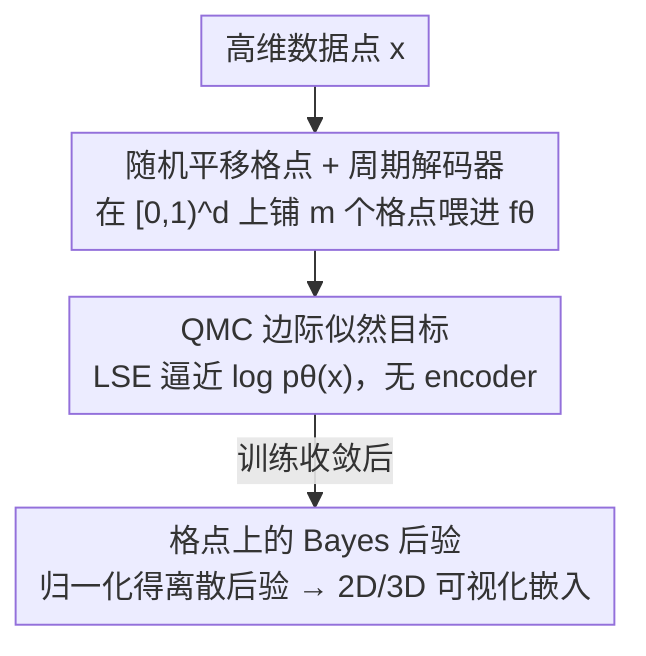

# Quasi-Monte Carlo Methods Enable Extremely Low-Dimensional Deep Generative Models

**会议**: ICLR 2026  
**OpenReview**: [https://openreview.net/forum?id=fdLU72nQdr](https://openreview.net/forum?id=fdLU72nQdr)  
**代码**: 待确认  
**领域**: 深度生成模型 / 隐变量模型 / 可解释表示学习  
**关键词**: 准蒙特卡洛, 隐变量模型, 低维嵌入, VAE, 边际似然

## 一句话总结
本文提出 QLVM（quasi-Monte Carlo latent variable model）：扔掉 VAE 的 encoder 和变分下界，直接用随机化准蒙特卡洛（QMC）格点积分逼近边际似然来训练 decoder，从而在 1/2/3 维这种极低维隐空间里训出比同维度 VAE/IWAE 更好、且天然可直接可视化的深度生成模型。

## 研究背景与动机
**领域现状**：深度生成模型（尤其 VAE）被科学家广泛用来给高维数据找"可解释表示"——分析运动学、动物发声、单细胞基因表达、神经群体动力学等。降维被视为通往可解释性的关键一步，VAE 靠一个 bottleneck 隐层来实现。

**现有痛点**：但 VAE 的隐层维度通常被设得不小（典型 32–128 维），因为大家普遍认为维度低于 ~10 时重建质量会崩。结果就是：训完 VAE 后还得再叠一层 UMAP / t-SNE 才能把隐空间画出来看，而这些后处理（聚类、可视化）在几十上百维里既难调又难验证。换句话说，"可解释"被推迟到了一个本身不可解释的高维隐空间上。

**核心矛盾**：为什么不能直接学一个 2D/3D 的隐空间？因为在极低维下，VAE 的 encoder 很难学到一个好的后验近似 $q_\phi(z\mid x)$——真实后验可能很窄、甚至违反对角高斯假设，导致 ELBO 这个下界很松，给 decoder 的训练信号也差。于是低维 VAE 的重建质量塌掉，逼着大家把维度调高。

**切入角度**：作者回到最朴素的想法——直接对隐变量做数值积分来算边际似然 $p_\theta(x_i)=\int p_\theta(x_i\mid z)p(z)\,dz$。这个朴素蒙特卡洛估计长期被认为"不切实际"而被弃用，但作者指出：它的误差只正比于 $p_\theta(x\mid z)$ 在先验下的方差，对于足够简单的数据集，它完全可能够用；更关键的是，在 1–3 维这种极低维空间里，用准蒙特卡洛格点把空间铺满，代价远没有想象中那么大。

**核心 idea**：用"在低维隐空间上铺一层随机平移的 QMC 格点、直接积分逼近边际似然"代替"encoder + 变分下界"，彻底绕开难训的变分近似，换来极低维、可直接可视化的生成模型。

## 方法详解

### 整体框架
QLVM 是一个**只有 decoder、没有 encoder** 的隐变量模型。给定高维数据点 $x_i\in\mathbb{R}^D$ 和一个 $d$ 维（$d=1,2,3$）隐变量 $z_i\sim p(z)$，目标是直接最大化边际似然

$$p_\theta(x_1,\dots,x_n)=\prod_{i=1}^n\int p_\theta(x_i\mid z_i)\,p(z_i)\,dz_i$$

训练时，每个 batch 在隐空间上撒一层**随机平移的格点** $\tilde z_1,\dots,\tilde z_m$，全部喂进共享 decoder $f_\theta$ 得到重建，再用 log-sum-exp 把这一组 $\log p_\theta(x_i\mid\tilde z_j)$ 归约成对 $\log p_\theta(x_i)$ 的估计当作损失；这层格点可以被 minibatch 里所有样本复用，所以分摊代价很低。评估/降维时，因为先验均匀，由贝叶斯规则 $p(z_i\mid x_i)\propto p_\theta(x_i\mid z_i)$，把同一组 $\log p_\theta(x_i\mid\tilde z_j)$ 归一化即可得到隐空间上的离散后验，取其均值或众数作为 $x_i$ 的低维嵌入。

### 关键设计

**1. QMC 边际似然目标：扔掉 encoder 和 ELBO，直接逼近 $\log p_\theta(x)$**

针对的痛点是低维下 encoder 学不出好后验、ELBO 太松。QLVM 干脆不要 encoder，直接对边际似然取对数当训练目标：

$$\mathcal{L}^{(i)}_{\mathrm{MC}}(\theta)=\log p_\theta(x_i)=\log\!\Big(\tfrac{1}{m}\sum_{j=1}^m p_\theta(x_i\mid\tilde z_j)\Big)$$

由 Jensen 不等式，$\mathbb{E}[\log\tfrac1m\sum_j p_\theta(x_i\mid\tilde z_j)]\le\log p_\theta(x_i)$，所以它在期望意义上是边际对数似然的一个下界；但随着样本数 $m\to\infty$，$\tfrac1m\sum_j p_\theta(x_i\mid\tilde z_j)$ 的方差趋于 0，这个下界会越来越紧、直接收敛到真值。这点和 IWAE 一样有"加样本就收紧"的渐近优势，区别在于 QLVM 用**固定的先验**采样、而非学一个 proposal。实现上用 log-sum-exp 做这步归约以保证数值稳定（$\log p_\theta(x_i)\approx\mathrm{LSE}_j\log p_\theta(x_i\mid\tilde z_j)-\log m$）。这样 decoder 收到的训练信号就是一个直接、无变分 gap 的似然估计，绕开了"监控 proposal 方差""调 encoder"这些麻烦。

**2. 随机平移格点 + 周期解码器：让暴力积分在低维真的能用**

朴素蒙特卡洛之所以被嫌弃，是因为独立采样在空间里分布不均、方差大。本文改用**准蒙特卡洛**：把 $\tilde z_1,\dots,\tilde z_m$ 作为一个**随机平移的格点**联合采样——既保证每个点的边际分布仍是先验 $p(z)$（这样 Jensen 那步的等号成立），又让点在空间里尽量均匀铺开以压低积分误差。具体地取 $p(z)=\mathrm{Uniform}[0,1)^d$，$d=2$ 用 Fibonacci 格点（在周期边界下最优地铺满单位方）、$d=3$ 用 Korobov 格点。为了把隐空间做成周期的（避免点"卡"在角落、并配合格点规则对周期函数的最优性），作者把 decoder 的**首层固定为** $z\mapsto(\sin z,\cos z)$。均匀先验让嵌入点均匀散开，周期边界让空间无角落。这层格点的最大红利是**可复用**：同一个随机平移格点能用于 minibatch 里所有样本，所以给定 batch size $b$ 和总样本预算 $s$，IWAE 每个点只能分到 $m=s/b$ 个样本，而 QLVM 每个点都能用上全部 $m$ 个格点估计损失。

**3. 格点上的 Bayes 后验：把嵌入变成可直接可视化的对象**

QLVM 没有 encoder，那怎么把一个新的 $x_i$ 投影到低维？作者用贝叶斯规则：由于先验均匀，$p(z_i\mid x_i)\propto p_\theta(x_i\mid z_i)$，于是把训练时算过的那一组 $p_\theta(x_i\mid\tilde z_j)$ 在 $m$ 个格点上归一化，就得到对后验的离散近似——$m$ 个带权 Dirac 质点的混合，权重 $\propto p_\theta(x_i\mid\tilde z_j)$。取这个近似后验的均值或众数即为 $x_i$ 的 2D/3D 嵌入。因为隐空间本身只有两三维，这个后验可以直接画成热力图，进而支持核密度估计、mean-shift 非参数聚类、测地线、以及查询 decoder 雅可比 $\partial f_\theta/\partial z$ 的 Frobenius 范数来定位"聚类边界"（范数大的地方对应解码映射剧变、即簇与簇之间的"沟"）——这些分析在高维隐空间里都难做，而在 QLVM 里几乎是免费的。

### 损失函数 / 训练策略
训练目标就是对每个数据点最大化 $\mathcal{L}^{(i)}_{\mathrm{MC}}$（等价于在格点上用 LSE 算边际对数似然），无 KL 项、无 encoder 参数。性能-算力的唯一旋钮是格点数 $m$：$m$ 越大下界越紧、性能越好但越贵；评估某些紧估计时作者用到 $m=6724$ 个格点。所有对比模型共用同一 decoder 架构以保证公平。若想换非均匀先验 $p(u)$，可用反演法 $u=\Phi^{-1}(z)$（$z$ 仍均匀）作为 decoder 输入，附录里在 MNIST 上演示了各向同性高斯先验，效果与均匀先验相当。

## 实验关键数据

### 主实验
在 MNIST、灰度 CelebA、鸟鸣音节库（zebra finch）、蒙古沙鼠发声库四个数据集上，对比同为 2 维隐空间的 QLVM / VAE / IWAE（同一 decoder 架构）。

| 对比维度 | 2D QLVM | 2D VAE / IWAE | 结论 |
|----------|---------|---------------|------|
| 留出测试集边际对数似然 | 更高（QMC 估计） | 更低（ELBO/IWAE 下界） | QLVM 下界在所有 2D 模型上更高，误差棒为 10 seed 的 1 个标准差 |
| 重建质量 | 更清晰 | 偏糊 | 定性、定量均占优 |
| 先验采样质量/多样性 | 更高更多样 | 较差 | Fig.2C |
| 性能-算力 Pareto 前沿 | 红线（前沿） | 落在前沿右上方 | 各种架构/超参的 VAE/IWAE 都被 QLVM 支配 |

作者还把**训练好的 2D VAE/IWAE 的 decoder** 拿来用 QMC（$m=6724$）算紧估计：结果发现 VAE/IWAE 训练时瞄准的下界确实很松（紧估计显著高于其 ELBO，所有 $p<0.05$，单边二项检验 + Bonferroni 校正）；而且即便在评估时把界收紧，也仍补不平和 QLVM decoder 的差距——说明真正的增益来自**训练时**就用紧的 QMC 界，而不仅是评估时。

### 消融 / 分析实验

| 配置 / 分析 | 现象 | 说明 |
|-------------|------|------|
| 增大格点数 $m$ | 性能单调变好、代价上升 | $m$ 是性能-算力唯一旋钮，低维下代价可控 |
| 更高维 VAE vs 2D QLVM | 复杂数据（CelebA）高维 VAE 更优；简单数据（MNIST/zebra finch）优势微弱 | QLVM 难抠复杂数据的精细细节，但简单数据上"够好" |
| 雅可比范数定位簇边界 | 范数尖峰恰好落在簇间"沟" | MNIST 与沙鼠发声上均成立，UMAP 等无生成过程的方法做不到 |
| 3dShapes（6 个连续因子）2D 嵌入 vs UMAP | QLVM 把因子表示为连续谱、几乎无聚类假象；UMAP 凭空造出小簇 | QLVM 平滑编码了贡献像素方差最大的 3 个因子（三种 hue），另 3 个（形状/尺度/朝向）编码得越来越不平滑 |

### 关键发现
- **病根确认**：低维下 VAE/IWAE 的变分后验常常（虽非总是）和真实后验对不上（Fig.3B 热力图），证实"encoder 在极低维学不出好近似"正是低维 VAE 塌掉的原因，也正是 QLVM 去掉 encoder 的动机。
- **训练时用紧界才是关键**：把松界 decoder 在评估时收紧也补不平差距，增益来自训练全程都吃紧的 QMC 估计。
- **可解释性是真红利**：2D 嵌入可直接可视化、可做核密度/非参数聚类/雅可比分析；相比 UMAP 这类无生成过程、且会"幻觉"出假簇的方法，QLVM 既有生成过程又不造假簇。

## 亮点与洞察
- **"被嫌弃的暴力法其实在低维很香"**：长期被一笔带过的朴素 MC 积分，配上 QMC 格点 + 周期 decoder，在 1–3 维居然全面压过 VAE/IWAE——一个反直觉、却异常简洁的结论。
- **格点复用是效率关键**：随机平移格点能被整个 minibatch 共享，这是 QLVM 相对 IWAE（proposal 因样本而异、无法复用）在相同样本预算下吃到更多有效样本的根本原因，很值得借鉴。
- **雅可比范数当"簇边界探测器"**：因为有显式生成过程，decoder 雅可比的 Frobenius 范数（与 Fisher 信息相关）能直接标出隐空间里"沟"的位置，把聚类从玄学变成可视化，这是判别式降维（UMAP/t-SNE）天生给不了的。
- **均匀先验的"万能性"**：用反演法 $u=\Phi^{-1}(z)$ 即可把均匀先验 QLVM 改造成任意先验，工程上几乎零成本。

## 局限性 / 可改进方向
- **样本质量天花板**：QMC 积分随维度爆炸，QLVM 不适合追求高分辨率、高保真合成的场景（这类要靠高维、层级化隐变量），定位是"可解释性优先"的探索性分析工具。
- **维度诅咒**：格点数需随隐维指数增长才能保持采样密度，所以本质上只能停在极低维；想用更高维就回到了它要避开的算力问题。
- **超低维的可解释性需谨慎**：2D 里无法线性解耦 >2 个真实因子（3dShapes 的 6 因子被非线性揉在一起，其中 3 个编码得不平滑），这是低维可视化的通病而非 QLVM 独有。
- **不可辨识性**：隐变量模型的最优嵌入一般不唯一，QLVM 最朴素的形式没处理这点，非唯一性对后续聚类等分析的影响有待研究。
- **可能的扩展**：用格点初始化自适应重要性采样以在更细尺度利用隐空间、引入条件变量（如发声时长/基频、动作速度）来调制隐空间，兼顾可解释性与表达力。

## 相关工作与启发
- **vs VAE**：VAE 学 encoder + 优化 ELBO 下界；QLVM 不要 encoder、直接 QMC 积分逼近边际似然。低维下 VAE 的 encoder 学不出好后验导致界松、训练信号差，QLVM 正好规避——代价是高维不可扩展。
- **vs IWAE**：IWAE 是 VAE 的推广，用学到的 proposal $q_\phi$ 做重要性采样收紧界 $\mathcal{L}^{(i)}_{\mathrm{IWAE}}=\log\big(\tfrac1m\sum_j p_\theta(x_i\mid\tilde z_j)p(\tilde z_j)/q_\phi(\tilde z_j\mid x_i)\big)$。QLVM 可看作"proposal 固定为先验"的 IWAE 特例；好处是不必学难学的 proposal（坏 proposal 会让界方差爆炸，且 Rainforth 等指出增大 $m$ 反而会恶化 encoder 优化）、省 encoder 显存/反传/调参、且格点可跨 minibatch 复用。
- **vs UMAP / t-SNE / ISOMAP**：这些判别式降维直接学 2D/3D 嵌入但**没有显式生成过程**，无法做密度估计、雅可比平滑性分析，且 UMAP 已知会"幻觉"出假簇；QLVM 既有生成过程又不造假簇。
- **vs QMC 用于生成模型的少数前作**：Buchholz 等把 QMC 用来降 ELBO（即式 4）的方差，Andral 把随机化 QMC 用于 normalizing flow；本文则把 QMC 用在式 5、服务于"非线性降维到极低维"这一目标，定位不同。

## 评分
- 新颖性: ⭐⭐⭐⭐⭐ 把"被弃用的暴力 MC 积分"翻案成极低维生成模型的实用方案，反直觉且自洽
- 实验充分度: ⭐⭐⭐⭐ 图像+音频四数据集、Pareto 前沿、松界诊断、聚类与 3dShapes 对比都到位，但缺规整的数值表格
- 写作质量: ⭐⭐⭐⭐⭐ 动机—方法—诊断—应用一条线讲得很清楚，公式与图配合好
- 价值: ⭐⭐⭐⭐ 对重可解释性的科学/工程场景（神经科学、生物声学）很实用，但高维不可扩展限制了适用面

<!-- RELATED:START -->

## 相关论文

- [\[ICLR 2026\] One Step Further with Monte-Carlo Sampler to Guide Diffusion Better](one_step_further_with_monte-carlo_sampler_to_guide_diffusion_better.md)
- [\[ICLR 2026\] Efficient Approximate Posterior Sampling with Annealed Langevin Monte Carlo](efficient_approximate_posterior_sampling_with_annealed_langevin_monte_carlo.md)
- [\[ICML 2026\] Simple Approximation and Derivative Free Inference-Time Scaling for Diffusion Models via Sequential Monte Carlo on Path Measures](../../ICML2026/image_generation/simple_approximation_and_derivative_free_inference-time_scaling_for_diffusion_mo.md)
- [\[ICML 2026\] Diffusion Models Are Statistically Optimal for Learning Low-Dimensional Multi-Modal Distributions](../../ICML2026/image_generation/diffusion_models_are_statistically_optimal_for_learning_low-dimensional_multi-mo.md)
- [\[NeurIPS 2025\] Understanding Representation Dynamics of Diffusion Models via Low-Dimensional Models](../../NeurIPS2025/image_generation/understanding_representation_dynamics_of_diffusion_models_via_low-dimensional_mo.md)

<!-- RELATED:END -->
