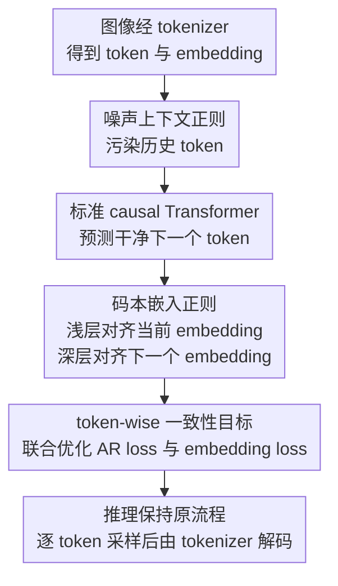

# reAR: Rethinking Visual Autoregressive Models via Token-wise Consistency Regularization

**会议**: ICLR2026  
**OpenReview**: [https://openreview.net/forum?id=9CpHEbtvA9](https://openreview.net/forum?id=9CpHEbtvA9)  
**代码**: 待发布（论文提到匿名代码，录用后公开）  
**领域**: 图像生成  
**关键词**: 视觉自回归生成, 离散 tokenizer, 暴露偏差, 码本嵌入正则, ImageNet 生成  

## 一句话总结
reAR 指出视觉自回归生成的核心瓶颈不是单个 token 预测精度本身，而是生成器产出的离散 token 序列与 tokenizer 解码器不一致，并用噪声上下文正则和码本嵌入正则在训练期约束每个 token 的隐藏表示，在不改 tokenizer、生成顺序和推理流程的情况下显著提升 ImageNet 图像生成质量。

## 研究背景与动机
**领域现状**：视觉自回归生成通常先用 VQGAN、MAGVIT、TiTok、AliTok 这类视觉 tokenizer 把图像压缩成离散 token 序列，再用 decoder-only Transformer 按 raster-scan 或其他顺序预测下一个 token。这个范式和语言模型很像，因此有希望把视觉生成也纳入统一的自回归建模框架。

**现有痛点**：在图像生成上，标准视觉 AR 仍然落后于扩散模型、masked generation、MAR 和 VAR 等范式。已有工作大多把原因归结到 tokenizer 不够好、token 序列顺序不合适，或者视觉 token 不是天然的一维语言 token，因此会去设计更强 tokenizer、随机生成顺序或 next-scale 预测。

**核心矛盾**：本文认为问题不只是“tokenizer 或生成器某一边不够强”，而是两者之间的接口失配。AR 模型训练时只看离散 token index 是否预测正确，但 tokenizer decoder 真正解码的是 codebook embedding 序列；推理时 AR 又会基于自己之前生成的 token 继续采样，一旦早期错误把上下文带到 tokenizer 训练分布之外，后续 token 即使局部看起来合理，整段 embedding 序列也可能难以被 decoder 还原成自然图像。

**本文目标**：作者希望在保持标准视觉 AR 训练和推理接口的前提下，让生成器更“tokenizer-friendly”：一方面要能在不完美上下文下继续预测正确 token，减轻暴露偏差；另一方面要让生成器的隐藏特征感知 tokenizer 的 embedding 空间，使错误 token 的表示也尽量靠近可被 decoder 接受的视觉语义。

**切入角度**：论文先用两个受控实验说明 correct token ratio（CTR）不足以解释最终图像质量。相同 CTR 下，错误 token 出现的位置和上下文污染程度会改变 LPIPS；同样是错误 token，如果替换成 embedding 更接近正确 token 的另一个错误 token，解码图像反而更好。这说明视觉 AR 的训练目标需要显式考虑 tokenizer 解码空间。

**核心 idea**：reAR 不重做 tokenizer，也不改变 raster 顺序，而是在训练 AR 生成器时加入 token-wise consistency regularization，让模型在噪声上下文中预测正确 token，同时让浅层隐藏特征恢复当前 token embedding、深层隐藏特征预测下一个 token embedding。

## 方法详解

### 整体框架
reAR 是一个 plug-and-play 的训练正则框架，目标是让标准 decoder-only 视觉 AR 模型在 token index 预测之外，额外学习“当前 token 如何被 tokenizer 表示、下一个 token 应该落到什么 embedding 附近”。训练时，图像先被冻结的视觉 tokenizer 编码成离散 token 和 codebook embedding；AR 模型拿到被随机噪声污染过的上下文，仍然预测干净的下一个 token，同时在指定层上对齐 tokenizer embedding；推理时完全回到原来的逐 token 采样流程，不增加额外模块。

这个框架的关键在于“训练期加入约束，推理期不改接口”。噪声上下文正则处理的是 AR 生成时历史 token 不干净的问题；码本嵌入正则处理的是模型只知道 token index、却不知道 tokenizer decoder 如何解释 embedding 的问题；联合目标则把两者合到同一个 token-wise consistency loss 里。

### 关键设计
**1. 生成器-tokenizer 一致性：把视觉 AR 的瓶颈定义为“能不能被 decoder 解码好”**

论文最重要的观察是，视觉 AR 和语言 AR 的输出语义不同：语言 token 本身就是最终输出的一部分，而视觉 token 只是中间符号，最终图像要经过 tokenizer decoder 才出现。因此，一个 token 序列即使在 index 层面看起来和训练集接近，也不保证它对应的 embedding 序列能被 decoder 稳定还原。

作者用 CTR 与 LPIPS 的不一致来支撑这个判断。CTR 定义为 $CTR(\hat{x}_{1:n}, x_{1:n}) = \frac{1}{n}\sum_i \mathbf{1}\{\hat{x}_i=x_i\}$，它只统计 token 是否完全命中；但实验显示，相同 CTR 下，如果错误 token 更早进入上下文，后续生成会偏离更严重，解码图像 LPIPS 更高。另一个实验把错误 token 替换为 embedding 上更接近正确 token 的错误 token，CTR 不变，但 LPIPS 降低、PSNR 提升，说明 tokenizer embedding 空间包含了 index loss 没有直接利用的视觉相似性。

**2. 噪声上下文正则：用可并行的随机污染模拟推理时的不完美历史**

标准 teacher forcing 训练时，模型每一步都看干净的 ground-truth 历史 token；推理时，历史 token 来自模型自己采样，早期错误会继续污染后续上下文。reAR 没有采用会破坏 Transformer 并行训练的 scheduled sampling，而是直接对输入 token 序列做均匀噪声扰动：每个位置以概率 $\epsilon$ 被随机 codebook index 替换，模型仍然要预测原始干净 token。

形式上，带噪输入为 $\tilde{x}_i=(1-b_i)x_i+b_i u_i$，其中 $b_i\sim Bernoulli(\epsilon)$，$u_i\sim Uniform(\{1,\ldots,K\})$。训练目标变成在 $\tilde{x}_{<i}$ 条件下最大化 $p_\theta(x_i\mid \tilde{x}_{<i})$。为了避免固定强噪声导致训练崩掉，论文让 $\epsilon\sim U(0,f(t))$，并随训练进度退火；最终采用截断线性 schedule $f(t)=\max(0,1-\frac{4}{3}t)$，让模型早期见到更多扰动、后期逐渐回到更稳定的分布。

**3. 码本嵌入正则：让隐藏层同时理解当前 token 和准备下一个 token 的视觉 embedding**

AR 模型原本只通过 softmax 分类学习 token index，无法直接知道 codebook 里两个 token 在视觉 embedding 空间是否相近。reAR 增加一个轻量 MLP 投影头 $h_\phi$，把 Transformer 中间层隐藏特征映射到 tokenizer codebook embedding 维度，然后用 cosine distance 做对齐。

这里有两个位置的对齐：浅层特征 $w_\theta^l(\tilde{x})$ 预测当前 token 的 embedding $z_{x_i}$，深层特征 $w_\theta^{l'}(\tilde{x})$ 预测下一个 token 的 embedding $z_{x_{i+1}}$。直觉上，浅层更接近输入 token 表示，适合恢复“我当前读到的视觉 token 是什么”；深层已经汇聚上下文，适合表达“下一步要生成的视觉 patch 应该是什么”。论文默认把 encoding regularization 放在第 0 层，把 decoding regularization 放在约四分之三深度的位置，如 reAR-S 的第 15 层。

**4. 轻量联合目标：只改训练 loss，不改 tokenizer、顺序和推理管线**

reAR 的总目标是 $L_{reAR}(\theta,\phi;t)=L'_{AR}(\theta;t)+\lambda L_{re}(\theta,\phi;t)$，其中 $L'_{AR}$ 是噪声上下文下的 next-token prediction，$L_{re}$ 是当前 embedding 与下一个 embedding 的 cosine 对齐损失。论文默认 $\lambda=1$，并发现正则权重在 $0.5$ 到 $1.5$ 范围内影响很小。

这个设计的工程价值很直接：它不要求重新训练 tokenizer，不要求引入 DINO-v2 这类外部 teacher，不要求把 raster 顺序改成随机顺序，也不增加采样阶段的计算。额外参数主要来自 2-layer MLP 投影头，reAR-S/B 约 2.1M、reAR-L 约 4.2M；训练时间从 AR-B 的 8.11 分钟/epoch 变为 reAR-B 的 8.14 分钟/epoch，几乎没有额外开销。

### 损失函数 / 训练策略
视觉 tokenizer 包含 encoder $E$、quantizer $Q$ 和 decoder $D$，把图像 $I$ 编码为连续特征 $\hat{z}=E(I)$，再量化成 codebook embedding $z_q=Q(\hat{z})$，最后由 $D(z_q)$ 重建图像。标准 AR 在 rasterized token 序列 $x_{1:N}$ 上优化 $\sum_i \log p_\theta(x_i\mid x_{<i})$，而 reAR 把输入替换为带噪历史 $\tilde{x}_{<i}$。

噪声上下文下的 AR loss 为：

$$
L'_{AR}(\theta)=-\mathbb{E}_{x,\tilde{x},\epsilon}\sum_{i=1}^{N}\log p_\theta(x_i\mid \tilde{x}_{i-1},\ldots,\tilde{x}_1)
$$

embedding 正则项为：

$$
L_{re}=\mathbb{E}_{x,\tilde{x},\epsilon}\sum_{i=1}^{N-1}\left[d(h_\phi^i(w_\theta^l(\tilde{x})),z_{x_i})+d(h_\phi^i(w_\theta^{l'}(\tilde{x})),z_{x_{i+1}})\right]
$$

其中 $d(\cdot,\cdot)$ 是 cosine distance。实现上，主实验使用 MaskGIT VQGAN tokenizer，AR backbone 是 DiT 风格的 causal Transformer；reAR-S/B/L 分别采用 20/24/24 层，hidden size 为 768/768/1024。训练在 ImageNet-1K 256×256 上进行 400 epochs，batch size 2048，AdamW，学习率前 100 epochs warmup 到 $4\times10^{-4}$，再衰减到 $1\times10^{-5}$，并用 class label dropout 0.1 支持 classifier-free guidance。

## 实验关键数据

### 主实验
论文主实验在 ImageNet-1K 256×256 class-conditional generation 上比较 FID 和 IS。最核心的对比是：在标准 raster-order causal AR 设置下，reAR 不靠高级 tokenizer 或随机顺序，就能把 vanilla AR 的 FID 从 3.02 降到 1.86，并且用更少参数接近甚至超过一些更复杂范式。

| 方法 | 生成范式 / tokenizer | 参数量 | 训练轮数 | FID↓ | IS↑ |
|------|----------------------|--------|----------|------|-----|
| DiT-XL | diffusion / Patch-VAE | 675M | 1400 | 2.27 | 278.2 |
| REPA | diffusion + representation alignment | 675M | 800 | 1.42 | 305.7 |
| MAR-L | continuous masked autoregressive | 479M | 800 | 1.98 | 290.3 |
| VAR-d30 | next-scale prediction | 2.0B | 350 | 1.92 | 323.1 |
| LlamaGen-XXL | raster causal AR / Patch-VQ | 1.4B | 300 | 2.34 | 253.9 |
| AR-L† | raster causal AR / Patch-VQ | 461M | 400 | 3.02 | 256.2 |
| reAR-S | raster causal AR / Patch-VQ | 201M | 400 | 2.00 | 295.7 |
| reAR-B | raster causal AR / Patch-VQ | 261M | 400 | 1.91 | 300.9 |
| reAR-L | raster causal AR / Patch-VQ | 461M | 400 | 1.86 | 316.9 |

reAR 的泛化实验也很关键。它不仅改善标准 patch tokenizer，也能和 TiTok、AliTok 这类非标准 tokenizer 配合；在 AliTok 上，177M 参数的 reAR-B-AliTok 达到 FID 1.42，和 675M 参数的 diffusion REPA 持平。

| 方法 | tokenizer / 设置 | 参数量 | 训练轮数 | FID↓ |
|------|------------------|--------|----------|------|
| AR-TiTok-b64 | TiTok | 261M | 400 | 4.45 |
| RAR-TiTok-b64 | TiTok + randomized AR | 261M | 400 | 4.07 |
| reAR-TiTok-b64 | TiTok + reAR | 261M | 400 | 4.01 |
| AR-AliTok-B | AliTok | 177M | 800 | 1.50 |
| RAR-B-AliTok | AliTok + randomized AR | 177M | 800 | 1.52 |
| reAR-B-AliTok | AliTok + reAR | 177M | 800 | 1.42 |

### 消融实验
消融集中验证两个问题：噪声上下文如何设置才稳定，以及 embedding 正则放在哪一层最有效。噪声实验显示，固定大噪声会破坏训练，随机噪声和退火 schedule 才能稳定提升。

| 配置 | FID↓ | 说明 |
|------|------|------|
| $\epsilon=0.0$ | 2.12 | 只有 embedding 正则，没有噪声上下文 |
| $\epsilon=0.25$ | 2.08 | 固定中等噪声有小幅收益 |
| $\epsilon=0.5$ | 3.15 | 固定强噪声导致训练质量明显变差 |
| $\epsilon\sim U(0,0.5)$ | 2.05 | 每个序列随机噪声比固定噪声更稳 |
| $\epsilon\sim U(0,f(t)), f(t)=1-t$ | 2.02 | 加入退火后继续提升 |
| $\epsilon\sim U(0,f(t)), f(t)=\max(0,1-\frac{4}{3}t)$ | 2.00 | 截断线性退火最佳 |
| w/o embedding regularization | 2.18 | 只有噪声上下文，弱于联合正则 |

embedding 正则的层选择也不是随便放。浅层 encoding 正则放在第 0 层最好，深层 decoding 正则放在第 15 层附近最好；直接 tied codebook embedding 收益很小，说明“硬共享 embedding”不如“软正则隐藏特征”。

| 正则配置 | FID↓ | IS↑ | 说明 |
|----------|------|-----|------|
| Vanilla AR | 21.32 | 57.3 | 80 epochs、小模型分析设置 |
| + tied codebook embedding | 21.08 | 57.2 | 直接共享 embedding 几乎无效 |
| + DE@10 | 21.29 | 57.5 | decoding 正则过早，收益小 |
| + DE@15 | 20.03 | 61.0 | 深层但非最终层效果更好 |
| + DE@20 | 20.28 | 61.2 | 太靠后略退化 |
| + EN@5 + DE@15 | 21.36 | 57.4 | encoding 正则放深层会伤害生成 |
| + EN@0 + DE@15 | 19.72 | 61.3 | 最终选择 |
| $\lambda=0.5$ | 19.79 | 60.9 | 权重变化影响较小 |
| $\lambda=1.5$ | 19.74 | 61.5 | 权重变化影响较小 |

### 关键发现
- reAR 的主要收益来自噪声上下文正则和码本嵌入正则的联合效果；单独使用任一项都能改善，但 FID 分别只有 2.18 或 2.12，联合后达到 2.00。
- token index 指标和最终图像质量并不总一致；相同 CTR 下，历史错误的位置、embedding 接近程度都会影响 decoder 输出，这支持了本文的 generator-tokenizer inconsistency 诊断。
- reAR 保留了 AR 的采样速度优势。使用 KV-cache 后，reAR-B-AliTok 在 FID 和 throughput 上同时优于多种 parallel-decoding 方法。
- 模型规模增大时，reAR-S/B/L 的 FID 随训练步数稳定下降，说明这种正则没有破坏视觉 AR 的 scaling 行为。

## 亮点与洞察
- 最有价值的点是把视觉 AR 的失败原因从“tokenizer 是否高级”转向“生成器输出是否适合 tokenizer 解码”。这个视角能解释为什么相同 token accuracy 仍可能产生不同图像质量，也把训练目标和最终像素质量更紧地连起来。
- 方法非常克制：它只在训练期增加噪声输入和 embedding 对齐，不改推理流程。对于已经有大规模 AR 训练管线的团队，这比重做 tokenizer、换生成顺序或引入外部视觉 teacher 更容易落地。
- 论文没有把 codebook embedding 生硬绑到输入层或输出头，而是通过中间层软正则注入 tokenizer inductive bias。这说明视觉生成里的 representation alignment 不一定要依赖外部模型，也可以发生在生成器和自身 tokenizer 之间。
- 消融里的层选择分析很有启发：浅层负责理解当前 token，深层负责准备下一个 token，最终层更接近分类决策边界，不一定适合对齐原始 codebook embedding。这个思路可以迁移到视频 AR、音频 token AR，甚至多模态统一 token 生成。

## 局限与展望
- 论文主要在 ImageNet 256×256 class-conditional generation 上验证，虽然这是视觉生成常用基准，但还不足以说明 reAR 在文本到图像、可控生成、高分辨率开放域生成中的真实收益。
- decoding regularization layer 的选择仍然依赖经验和 CKA 分析。不同 backbone、tokenizer、序列长度下，最佳层可能变化，未来可以研究自适应层选择或多层加权对齐。
- reAR 假设 tokenizer codebook embedding 本身是值得对齐的视觉空间；如果 tokenizer 训练质量差、embedding 几何结构不稳定，正则可能把生成器拉向一个不理想的空间。
- 噪声上下文采用均匀随机 token 替换，和真实推理错误分布不完全一致。更进一步的方向是用模型自身的高概率错误、embedding-nearest 错误或 curriculum rollout 来构造更真实的训练扰动。
- 论文没有深入讨论生成能力增强带来的滥用风险，只在 ethics 中简要承认高保真生成可能降低合成媒体误用门槛。若用于开放域图像生成，仍需要配套水印、检测和使用约束。

## 相关工作与启发
- **vs LlamaGen / 标准 raster AR**: LlamaGen 证明 decoder-only AR 可以用于图像生成，但仍主要优化 next-token prediction。reAR 保留同样的 raster causal AR 推理方式，在训练目标上补上 tokenizer consistency，因此用更少参数获得更低 FID。
- **vs RAR / RandAR**: RAR 和 RandAR 通过随机顺序或位置机制缓解 tokenizer 与 AR 的上下文不一致，重点在 token order。reAR 不改生成顺序，而是从噪声上下文和 embedding 对齐两侧约束生成器，因此能适配 TiTok 和 AliTok 等不同 tokenizer。
- **vs TiTok / AliTok / FlexTok**: 这些工作主要让 tokenizer 更接近一维或单向序列建模需求。reAR 的启发是，即使 tokenizer 已经更适配 AR，训练生成器时仍可以继续显式对齐 tokenizer embedding，从而进一步提升质量。
- **vs REPA**: REPA 在扩散 Transformer 中对齐外部 DINO-v2 等视觉表示，以加速和改善 diffusion training。reAR 对齐的是视觉 AR 自己的 tokenizer codebook embedding，不依赖外部 teacher，也更贴合离散 token 解码链路。
- **vs MAR / VAR**: MAR 和 VAR 都改变了生成范式，分别使用连续 token masked generation 或 next-scale prediction。reAR 更像是对标准 decoder-only AR 的低侵入增强，因此对想统一视觉和语言生成接口的路线更有吸引力。

## 评分
- 新颖性: ⭐⭐⭐⭐⭐ 从 generator-tokenizer inconsistency 解释视觉 AR 瓶颈，并把暴露偏差和 embedding unawareness 合成一个训练正则，视角清晰且有辨识度。
- 实验充分度: ⭐⭐⭐⭐ 主实验、tokenizer 泛化、噪声/层选择/权重消融和 CKA 分析都比较完整，但开放域 text-to-image 和更高分辨率场景仍缺失。
- 写作质量: ⭐⭐⭐⭐ 论文逻辑顺畅，受控实验很好地服务于方法动机；少数公式和 schedule 表述略有排版问题，但不影响主线理解。
- 价值: ⭐⭐⭐⭐⭐ 方法轻量、兼容现有 AR 管线、推理零额外成本，对视觉 AR 追赶扩散模型以及统一多模态自回归生成都有较高参考价值。

<!-- RELATED:START -->

## 相关论文

- [\[ICLR 2026\] Hyperspherical Latents Improve Continuous-Token Autoregressive Generation](hyperspherical_latents_improve_continuous-token_autoregressive_generation.md)
- [\[ICLR 2026\] Group Critical-token Policy Optimization for Autoregressive Image Generation](group_critical-token_policy_optimization_for_autoregressive_image_generation.md)
- [\[ICLR 2026\] Scale-wise Distillation of Diffusion Models](scale-wise_distillation_of_diffusion_models.md)
- [\[ICLR 2026\] BAR: Refactor the Basis of Autoregressive Visual Generation](bar_refactor_the_basis_of_autoregressive_visual_generation.md)
- [\[ICLR 2026\] Continual Unlearning for Text-to-Image Diffusion Models: A Regularization Perspective](continual_unlearning_for_text-to-image_diffusion_models_a_regularization_perspec.md)

<!-- RELATED:END -->
