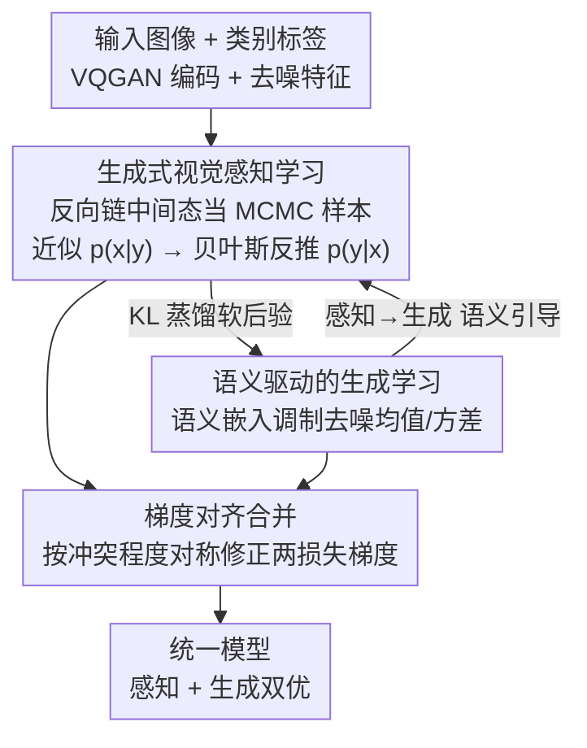

# Reconciling Visual Perception and Generation in Diffusion Models

**会议**: ICLR 2026  
**OpenReview**: [https://openreview.net/forum?id=yKC3CaFg8K](https://openreview.net/forum?id=yKC3CaFg8K)  
**代码**: 已开源（论文中标注为 GenRep，链接以原文为准）  
**领域**: 扩散模型 / 视觉感知与生成统一  
**关键词**: 扩散模型, 统一感知生成, 蒙特卡洛近似, 梯度对齐, 表示学习

## 一句话总结
GenRep 在同一个扩散模型里同时做判别式感知和生成式建模：用蒙特卡洛把扩散模型的分布知识蒸馏给感知任务，再把感知学到的高层语义反过来引导生成的去噪过程，并用梯度对齐协调两个目标，最终在感知和生成两类基准上都达到领先。

## 研究背景与动机
**领域现状**：计算机视觉长期被劈成两半——视觉理解走判别式表示学习（把像素变成能区分类别的特征），图像生成走生成式建模（学数据的底层分布以合成新样本）。两条路线用的技术范式不同，大多数工作只擅长其中一边。

**现有痛点**：作者把割裂带来的代价拆成三点：① 判别式学习只盯着类间决策边界，对没见过的模式泛化差、也容易忽略细粒度细节，因为它不像生成模型那样去刻画底层数据分布；② GAN、扩散这类生成模型依赖低层重建损失，对语义的理解偏低层，在场景理解任务上打不过判别式方法；③ 两套技术协议各自为战，一个范式里的创新很难惠及另一个。

**核心矛盾**：判别式表示「画决策边界但不懂分布」，生成式建模「懂分布但语义偏低层」，二者各有残缺，却被当成两个独立问题分别优化，谁也补不了谁的短板。

**本文目标**：在**同一个模型**里同时保留生成与理解能力，并且让两者互相增益，而不是像以往那样为了感知牺牲生成、或为了生成牺牲语义。

**切入角度**：作者抓住两个已被验证的观察——i) 扩散模型能帮下游视觉感知任务；ii) 高质量的判别式表示能加速扩散模型的生成学习。这说明两种范式学到的表示存在潜在共性，是搭统一框架的基础。

**核心 idea**：把扩散模型的分布知识蒸馏给感知（生成→感知），同时用感知学到的语义引导生成的去噪（感知→生成），再用梯度对齐让两个损失不打架，形成一个正反馈回路。

## 方法详解

### 整体框架
GenRep 建在一个预训练扩散模型（CNN 架构的 LDM 或 ViT 架构的 DiT）之上，把感知分支和生成分支挂在同一组去噪网络的注意力块上联合训练。预备阶段沿用已有做法：输入图像先用 VQGAN 编码到隐空间，以类别标签为条件做一次「无噪声」前向，得到对该类有判别性的特征，再聚合去噪网络多个解码块的中间输出喂给任务专用解码器。

在此基础上，GenRep 引入三个互相咬合的部件：**生成式视觉感知学习**把扩散反向链上的中间状态当成蒙特卡洛样本，近似类条件分布 $p(x|y)$，再经贝叶斯反推后验 $p(y|x)$ 去监督判别学习；**语义驱动的生成学习**反过来用感知分支学到的语义嵌入 $x_{sem}$ 动态调制去噪过程的均值与方差，让生成更贴合目标语义；**梯度对齐**在每一步把两个损失的梯度按冲突程度对称修正后再合并更新，使两个目标在同一组权重里共存。三者之间形成「感知更准 → 语义更强 → 生成更好 → 分布知识更可靠 → 感知更准」的正反馈。

### 关键设计

**1. 生成式视觉感知学习：把扩散反向链当蒙特卡洛样本来蒸馏分布知识**

针对「判别式只画决策边界、不懂分布」的痛点，作者想把扩散模型隐含的类条件分布 $p(x|y)$ 拿来当感知的额外监督。但 $p(x|y)$ 无法精确计算，于是用 MCMC 的思路近似：反向扩散过程 $x_T \to x_{T-1} \to \cdots \to x_0$ 天然是一条非平稳马尔可夫链，每步转移核 $p_\theta(x_{t-1}|x_t)=\mathcal{N}(x_{t-1};\mu_\theta(x_t,t),\sigma_\theta(x_t,t))$ 就像 MCMC 里从一串转移中采样。直接用整条链有两个毛病：链初期接近纯噪声、样本质量差；相邻样本时间相关、违背蒙特卡洛的独立假设。作者借 MCMC 的两个标准技巧解决——**burn-in** 丢掉前 $m$ 步无信息样本，**thinning** 每隔 $k$ 步取一个降低相关性（实测 $k=2$、$m=50$ 最佳）。于是用一次反向过程的轨迹就能估计 $p(x|y)\approx \frac{1}{T}\sum_{t=1}^{T}\mathcal{N}(x;\mu_{t,y},\sigma_{t,y})$，避免了标准蒙特卡洛要为每个条件 $y$ 跑大量完整去噪的开销。

拿到 $p(x|y)$ 后，取均匀先验 $p(y)=1/|Y|$ 代入贝叶斯公式得后验 $p(y|x)=\frac{p(y)p(x|y)}{\sum_{y'}p(y')p(x|y')}$，再用它去约束判别头的 softmax 输出 $q(y|x)$：

$$\mathcal{L}_{\text{gen\_distil}}=D_{KL}(p\|q)=\sum_{y\in Y}p(y|x)\log\frac{p(y|x)}{q(y|x)}$$

感知总损失为 $\mathcal{L}_{\text{percept}}=\mathcal{L}_{\text{disc}}+\mathcal{L}_{\text{gen\_distil}}$。它和会鼓励过度自信的标准判别损失不同，生成似然给出的是一个「软后验」，对相似类别的歧义如实保留，从而带来更低的校准误差。和此前同样用扩散估分布的工作（Li et al. 2023a）相比，那篇是用前向加噪的噪声预测误差近似 $\log p(x|y)$，本文是直接对反向生成过程预测的高斯概率密度求平均，且所需扩散步数显著更少（约 200 vs 1000）。

**2. 语义驱动的生成学习：用感知学到的语义嵌入调制去噪的均值和方差**

针对「生成模型语义偏低层」的痛点，作者让生成反过来吃感知分支的红利。假设已有一个为感知优化好的去噪网络，其中间输出 $x_{sem}$ 富含高层语义。在反向去噪时，把噪声分布的均值和方差按 $x_{sem}$ 动态调制。均值上加一个语义修正项 $\mu_\theta(x_t,t,x_{sem})=\mu_\theta^{base}(x_t,t)+f_{sem}^\mu(x_t,x_{sem})$，其中 $f_{sem}^\mu=W_t^\mu\cdot\mathrm{concat}(x_t,x_{sem})$——均值决定主去噪方向，这一项把去噪轨迹朝目标语义掰。方差上乘一个语义缩放 $\sigma_\theta(x_t,t,x_{sem})=\sigma_\theta^{base}(x_t,t)\cdot(1+f_{sem}^\sigma(x_{sem}))$，$f_{sem}^\sigma=\mathrm{MLP}(x_{sem})$ 映成标量：正值放大方差、鼓励样本离目标远时更广探索，负值缩小方差、促使靠近目标时精细打磨。

生成目标为 $\mathcal{L}_{\text{genera}}=\mathcal{L}_{LDM}+\mathcal{L}_{\text{rep\_align}}$，后者最小化 $x$ 与 $x_{sem}$ 的余弦相似度对齐表示。一个实用细节是：推理时不再需要显式的 $x_{sem}$，可直接用当前噪声样本 $x_t$ 替换，因为增强后的去噪网络已经把语义线索存进了权重。

**3. 梯度对齐做权重合并：按冲突程度对称修正两个损失的梯度方向**

感知损失 $\mathcal{L}_{\text{percept}}$ 和生成损失 $\mathcal{L}_{\text{genera}}$ 塞进同一组权重时方向会打架。作者把每个梯度分解成相对另一梯度的平行分量与正交分量：平行分量代表两任务同向/反向的运动，正交分量是不影响对方目标的方向。重构梯度时**完全保留正交分量、只衰减平行分量**：$\nabla^{aligned}=\nabla^{\perp}+\alpha\nabla^{\parallel}$。衰减系数 $\alpha$ 按两梯度的余弦相似度自适应：$\alpha=((\cos\_sim+1)/2)^k$（$k=2$），当两梯度完全同向（$\cos\_sim=1$）则 $\alpha=1$ 不衰减，越趋向反向（$\cos\_sim\to-1$）衰减越狠。最终更新用对称对齐后梯度的加权和 $\nabla^{aligned}_{symmetric}=w_p\nabla^{aligned}_{percept}+w_g\nabla^{aligned}_{genera}$（$w_p=0.7,w_g=0.3$）。这样非冲突信息保住，冲突按严重度平滑压制，两个目标得以在一个模型里平衡优化。

### 损失函数 / 训练策略
训练分两步走。先只用感知损失 $\mathcal{L}_{\text{percept}}$ 训练，得到把语义编进中间输出 $x_{sem}$ 的去噪网络 $\epsilon_\theta^{sem}$。随后引入生成损失 $\mathcal{L}_{\text{genera}}$，从 $\epsilon_\theta^{sem}$ 复制出统一网络 $\epsilon_\theta^{unified}$，每步：用同一张输入图同时算两个损失的梯度；按梯度对齐更新 $\epsilon_\theta^{unified}$ 的注意力块；$\epsilon_\theta^{sem}$ 的参数以动量方式更新 $\theta_{sem}\leftarrow m\theta_{sem}+(1-m)\theta_{unified}$（$m=0.999$），从而为生成学习维持稳定的语义特征 $x_{sem}$。骨干用 LDM-8 / DiT-XL，推理 200 / 250 步 DDPM，分别用 ImageNet 与 LAION 预训练权重初始化以对齐不同基线。

## 实验关键数据

### 主实验
横跨九个数据集、感知与生成两大类任务，均达到或逼近 SOTA。

| 任务 / 数据集 | 指标 | GenRep | 此前最佳 | 说明 |
|--------|------|------|----------|------|
| 细粒度分类 CUB-200 | Top-1↑ | 92.9 | 91.8 (Li 2023a) | LAION-5B 预训练 |
| OOD 泛化 ObjectNet | Top-1↑ | 57.8 | 52.5 (Li 2023a) | 超扩散基线 5.3% |
| 深度估计 NYUv2 | AbsRel↓ | 0.057 | 0.059 (ECoDepth) | 逼近 62M 样本的 DepthAnything (0.056) |
| 闭集分割 ADE20K | mIoU↑ | 54.6 | 53.7 (VPD) | LDM 骨干 |
| 开放词表分割 ADE20K | mIoU↑ | 34.7 | 28.7 (ODISE) | +6.0% |
| 开放词表检测 MS COCO | AP$^n_{50}$↑ | 43.4 | 37.4 (SAS-Det) | DiT 骨干 |
| 类条件生成 ImageNet | FID↓ | 2.09 | 2.27 (DiT-XL) | +GenRep 提升基线 |
| 生成 CelebA-HQ | FID↓ | 3.84 | 5.11 (LDM-4) | +GenRep |

值得注意：以往扩散感知方法常牺牲生成能力，GenRep 反而把 LDM/DiT 基线的生成 FID 也一并拉好（ImageNet 2.27→2.09、CelebA-HQ 5.11→3.84、LSUN-Churches 4.02→3.12），印证「双向互益」而非「拆东补西」。

### 消融实验

| 配置 | Top-1↑ | mIoU↑ | FID↓ | 说明 |
|------|--------|-------|------|------|
| 基线（全不加） | 45.4 | 27.8 | 13.27 | 纯扩散骨干 |
| + 生成式感知学习 | 47.8 | 30.9 | 12.96 | 感知涨 |
| + 语义驱动生成 | 44.1 | 25.6 | 7.45 | 生成大幅改善 |
| + 二者组合 | 49.4 | 31.5 | 7.23 | 正反馈出现，两边同涨 |
| + 梯度对齐（完整） | 51.1 | 32.5 | 6.92 | 三项齐全最优 |

### 关键发现
- **正反馈确实存在**：单独加生成式感知或语义驱动生成各自只补一边，两者一起用时感知和生成同时再涨（49.4/31.5/7.23），说明二者互为养料；再加梯度对齐进一步统一优化方向，三指标都到最优。
- **超参有清晰 trade-off**：thinning 间隔 $k=2$ 最佳（$k$ 太大样本太少、分布估计方差高）；burn-in 丢弃数 $m=50$ 平衡了「去掉噪声初期」与「保留足够样本」。
- **校准与鲁棒性**：加 $\mathcal{L}_{\text{gen\_distil}}$ 后期望校准误差 ECE 全面下降（ObjectNet 0.237→0.208、CUB-200 0.095→0.076），软后验缓解了过度自信；在 ObjectNet 上对输入逐步加噪（$t=0\to50$），GenRep 从 51.1 仅降到 37.2，而 Swin-Transformer 从 40.3 崩到 4.6，分布建模带来明显更强的鲁棒性。
- **对称对齐优于单向**：只对齐生成梯度（Eq.13）得 48.7/30.3/6.79，对称对齐两个梯度（Eq.16）得 50.1/32.5/6.92，整体更均衡。

## 亮点与洞察
- **把 MCMC 的 burn-in / thinning 搬进扩散反向链**：不再为每个类别跑大量完整去噪，而是复用一条反向轨迹的中间态当样本估 $p(x|y)$，既省算力又给判别头一个「软后验」监督——这是把生成模型的分布知识低成本注入感知的巧思。
- **语义反哺生成走「调制噪声参数」而非「拼接条件」**：直接改去噪的均值方向和方差幅度，方差正负还对应「远则广探索、近则细打磨」，语义引导的物理含义很直观。
- **梯度对齐保正交、压平行**：把多任务冲突按余弦相似度连续衰减，而不是硬性投影丢梯度，这套思路可迁移到任何「判别+生成」或更广的多任务联合训练。
- **最让人「啊哈」的是双向互益的实证**：消融里两个方向单独用都只补一边，合起来才出现两边同涨，真正坐实了「统一模型 > 两个独立模型之和」。

## 局限与展望
- 框架依赖类别标签作为条件来估 $p(x|y)$ 并取均匀先验，迁移到无标签或开放类别、长尾分布场景时近似质量如何，文中未充分展开。
- 两阶段训练 + 动量教师 + 梯度对齐让训练流程偏重，超参（$k,m,k_{damp},w_p/w_g$）较多且互相牵连，复现与调参成本不低。
- 生成评测集中在 ImageNet / CelebA-HQ / LSUN 这类相对结构化的类条件设定，文本到图像等更开放的生成场景下「语义驱动调制」是否依然奏效，仍待验证。
- 推理时用 $x_t$ 直接替换 $x_{sem}$ 是个工程近似，对语义引导精度的影响缺少定量分析。

## 相关工作与启发
- **vs 扩散感知方法（VPD / ODISE / Li 2023a）**: 它们把扩散当感知骨干或用前向噪声误差估分布，往往牺牲生成能力；GenRep 直接对反向过程的高斯密度求平均、步数更少，且明确保留并提升生成能力。
- **vs 判别↔生成单向增益工作**: 以往多是「判别促生成」或「生成促判别」的一头优化，GenRep 用梯度对齐搭出双向反馈回路，让两边互相增益。
- **vs 基于 LLM 的统一理解-生成（Tokenizer-Detokenizer 类）**: 那类用自回归 token 串联多模态，GenRep 走纯扩散路线，把感知的高层语义直接注入去噪采样，避免低层重建对语义建模的局限。

## 评分
- 新颖性: ⭐⭐⭐⭐⭐ 把 MCMC 估分布 + 语义调制噪声 + 梯度对齐组装成真正双向互益的统一框架，角度新。
- 实验充分度: ⭐⭐⭐⭐⭐ 九数据集覆盖分类/深度/分割/检测/生成五类任务，消融、校准、鲁棒性、超参分析齐全。
- 写作质量: ⭐⭐⭐⭐ 方法推导清晰、动机层层递进，但符号和两阶段训练细节偏密，初读需对照公式。
- 价值: ⭐⭐⭐⭐⭐ 给「感知与生成统一」提供了一个可落地、双优的扩散范式，梯度对齐等组件可复用。

<!-- RELATED:START -->

## 相关论文

- [\[CVPR 2026\] UniPercept: A Unified Diffusion Model for Generalizable Visual Perception](../../CVPR2026/image_generation/unipercept_a_unified_diffusion_model_for_generalizable_visual_perception.md)
- [\[ICLR 2026\] Next Visual Granularity Generation](next_visual_granularity_generation.md)
- [\[ICLR 2026\] Product of Experts for Visual Generation](product_of_experts_for_visual_generation.md)
- [\[ICML 2026\] Stage-wise Distortion-Perception Traversal in Zero-shot Inverse Problems with Diffusion Models](../../ICML2026/image_generation/stage-wise_distortion-perception_traversal_in_zero-shot_inverse_problems_with_di.md)
- [\[ICLR 2026\] VMDiff: Visual Mixing Diffusion for Limitless Cross-Object Synthesis](vmdiff_visual_mixing_diffusion_for_limitless_cross-object_synthesis.md)

<!-- RELATED:END -->
