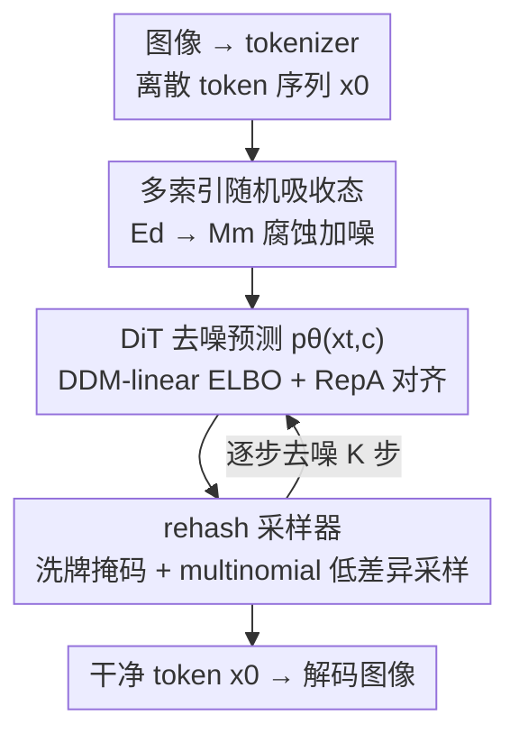

# ReDDiT: Rehashing Noise for Discrete Visual Generation

**会议**: ICLR 2026  
**OpenReview**: [https://openreview.net/forum?id=7R8ohzWB4i](https://openreview.net/forum?id=7R8ohzWB4i)  
**代码**: https://github.com/martian422/ReDDiT  
**领域**: 扩散模型 / 图像生成 / 离散扩散  
**关键词**: 离散扩散, 吸收态噪声, rehash 采样, 多索引腐蚀, ImageNet 生成

## 一句话总结
ReDDiT 把离散扩散里单一的 `[mask]` 吸收态扩展成一组随机的多索引吸收态（rehashing noise），并配套一个用 `torch.multinomial` 做低差异采样的 rehash 采样器，取代 MVTM 那套靠 Gumbel-max 调出来的 remask 启发式，把 ImageNet-256 上的 gFID 从基线 6.18 压到 1.61，第一次让离散扩散在生成质量上追平连续扩散。

## 研究背景与动机

**领域现状**：连续域里的扩散 Transformer（DiT）从高斯噪声逐步精修图像 latent，已经做到了又好又能 scale。最近社区对**离散扩散**很感兴趣，因为它有两个实用好处：codebook 可索引、天然兼容语言模型；以及每步能并行预测多个 token、推理高效。主流离散方案是 masked visual token model（MVTM，如 MaskGIT），用 BERT 式的 `[mask]` token 腐蚀图像 token 序列，再用 cross-entropy 在被 mask 的位置上做最大似然预测。

**现有痛点**：离散方法的生成质量一直落后于连续方法。作者把原因归到两处。其一是**噪声（吸收态）设计**：MVTM 把所有被 mask 的 token 都坍缩到同一个吸收态 `[mask]`，相比高斯噪声既缺词表丰富度、又缺 latent 多样性，给模型的信号太粗糙，限制了它表达多样分布的能力；而且离散去 mask 是二值的——token 要么被 mask、要么被确定性解码，不像连续扩散每步都注入随机性。其二是**采样启发式**：MVTM 的 confidence-based remask 采样器靠 Gumbel-max 制造一种手工随机性来近似采样多样性，这破坏了生成的概率保真度，还得小心平衡每步解码的 token 数（防误差累积），导致冗余的采样轮次。Gumbel-max 因此沦为一个需要逐时刻精调的 trick，在大词表（如 16384）下数值不准、表现不稳。

**核心矛盾**：真正拉开离散与连续差距的，不是量化本身，而是**单一吸收态的表达力不足**叠加**Gumbel-max remask 采样器的低保真**。

**本文目标**：① 重新设计吸收态，让 latent 在扩散中能走的路径更丰富；② 设计一个有原理依据、低差异、不依赖超参随机性的采样器。

**切入角度**：连续扩散每步都注入随机噪声，而离散扩散的"噪声"只有一个死板的 `[mask]`。如果把吸收态从单点扩成一组索引、并在腐蚀时随机化，模型就能在训练中优化自己的 embedding 空间、学到数据驱动的噪声结构。

**核心 idea**：用"多索引随机吸收态 + 反演该随机路径的 multinomial 采样器"替代"单 mask + Gumbel-max remask"，在不调随机性的前提下同时拿到高多样性与低差异。

## 方法详解

### 整体框架
ReDDiT 基于 DiT 架构，工作在离散 token 上（默认 IBQ-f16 tokenizer，256×256 图像 → 256 个 token，codebook 16384）。它把离散扩散的前向腐蚀重写为：token 从有效嵌入子空间 $E_d$ 逐步转移到一个容量为 $m$ 的**吸收态子空间** $M_m$（不再是单点 $\{m\}$）。训练时喂入腐蚀数据，分布为 $x_t \sim \mathrm{Cat}(x_t; \alpha_t x_0 + (1-\alpha_t)\,U(M_m^L))$，其中 $U(M_m^L)$ 是吸收态上的均匀分布，$\alpha_t$ 是单调递减的存活函数（$\alpha_0=1,\alpha_1=0$）。训练目标用从 DDM 推出的线性 ELBO（Eq.4）外加 RepA 表征对齐正则。采样时用 rehash 采样器：每步先把当前还处于吸收态的 token 重新洗一遍（rehash），再用 softmax 概率经 `torch.multinomial` 做低差异采样，逐步把全 mask 的序列 $x_1$ 解码回干净序列 $x_0$。

### 关键设计

**1. Rehashing noise：把单一吸收态扩成一组随机多索引吸收态**

针对"单 `[mask]` 信号太粗、表达力受限"这个痛点，作者把吸收态从一个点扩成一个容量为 $m$ 的集合 $M_m=\{m_j\}_{j=1}^m$，和有效 token 基 $E=\{e_i\}_{i=1}^d$ 一起拼成更大的类别空间 $V_{(d,m)}\in\mathbb{R}^{d+m}$。前向转移核相应改写：一个有效 token 以 $1-\alpha_{t|s}$ 的概率被吸收、保持 $\alpha_{t|s}$ 不变；而**已经在吸收态里的 token，会以 $1/m$ 的概率在 $m$ 个吸收索引之间随机跳转**——这就是"rehashing"，让 latent 在扩散过程中能遍历到更多潜在路径。为什么这样有效：像素域早期工作（Austin、Campbell）证明给邻近像素值更高转移概率（类高斯离散噪声）比单吸收态好，但用 visual tokenizer 后 latent 的结构是**学出来的**、没有现成的序结构可用；多索引随机吸收态让模型在训练中自己优化 embedding 空间、学到数据驱动的噪声分布（论文用 t-SNE 可视化了 $m=1/16/128/1024$ 下学到的 latent 簇）。容量 $m$ 需按 tokenizer 经验确定：LlamaGen-f16 在 $m=128$ 最优、IBQ 在 $m=1024$ 最优，作者归因于低维 codebook 产生更紧凑的 latent、噪声容忍度更小。

**2. Rehash 采样器：用 multinomial 低差异采样反演随机吸收路径**

针对"Gumbel-max remask 采样器低保真、需逐时刻调随机强度"的痛点，作者从离散扩散理论推出反向过程 $q_{s|t}$（Eq.9）：对未被 mask 的 token 保持不变；对仍在吸收态的 token，要么以 $\tfrac{1-\alpha_s}{m(1-\alpha_t)}$ 留在吸收态、要么以 $\tfrac{\alpha_s-\alpha_t}{1-\alpha_t}\,\delta_i p_\theta(x_t)$ 被解码成有效 token。落到算法上有三个关键动作：① **rehash 操作**——每步开头把当前吸收态 token 重新均匀采样 $x_t \leftarrow \mathrm{where}(x_t\in M_m, U(M_m^L), x_t)$，制造路径多样性；② 用 **softmax 概率**（而非 logits+Gumbel）算 $q_{s|t}$，并刻意把吸收态的概率 $\delta_{m[0]}\cdot\tfrac{1-\alpha_s}{1-\alpha_t}$ 合并进来保住整体噪声采样概率（小值若被截断会损伤采样精度）；③ 用 `torch.multinomial` 做**低差异**类别采样，取代 Gumbel-max。与 MaskGIT 的"predict-all 再 remask"不同，rehash 采样器把吸收态纳入类别采样、且**解耦训练与推理**——可以在任意离散化时间轴上采样（cosine schedule 最优），不再像 MVTM 那样把训练和推理耦死。Gumbel-max 在理论上和本方法等价，但在有限采样次数、尤其大词表下数值不准、反映不出真实分布，这正是 MVTM 的瓶颈。

**3. DDM-linear 目标 + RepA 表征对齐：换掉 MVTM 的 cross-entropy 并加速收敛**

针对"MVTM 借自掩码语言模型的目标只在 mask 位置做最大似然、理论性偏弱"，ReDDiT 改用从 DDM 推导的线性 ELBO 目标 $L_{\text{DDM-linear}}=-\mathbb{E}_{t,x_0,x_t}[\tfrac1t\sum_i \delta(x_t^i,m)\log p_\theta(x_0^i|x_t)]$（Eq.4），消融显示仅切换目标就能把 gFID 从 6.83 降到 6.23。在此之上叠加 RepA 表征对齐：取 DiT 第 8 层中间特征 $h^{[n]}(x_t)$ 经小 MLP $h_\phi$ 投影，与原图经 dinov2-b 编码的特征做逐元素余弦相似度对齐，$L_{\text{total}}=L_{\text{DDM-linear}}+\lambda L_{\text{RepA}}$（$\lambda=0.5$）。作者首次验证这个原本为连续扩散提出的技巧对离散 latent 也管用；但诚实地指出 RepA 主要是**加速收敛**，训练充分后并不带来相对性能增益，他们只用它提效并借 $L_{\text{RepA}}$ 探查训练内部动态。此外因为和离散流匹配（DFM）共享渐进解码，可把若干 DFM 步插进采样做 refinement，在 ImageNet 上再换 $\sim$0.1 gFID。

### 损失函数 / 训练策略
总损失为 $L_{\text{total}}=L_{\text{DDM-linear}}+\lambda L_{\text{RepA}}$（$\lambda=0.5$）。训练用 AdamW + cosine decay，配 2D-RoPE 与 min-SNR 提效；类条件训练用 class embedding，drop-rate 0.1 以支持 CFG；预处理沿用 LlamaGen 的 ten-crop 增广。采样默认 cosine 离散时间轴。

## 实验关键数据

### 主实验
ImageNet-1K 256×256，gFID↓ / IS↑ 在 50k 样本上计算。

| 类型 | 模型 | gFID↓ | IS↑ | #Params | #Steps |
|------|------|------|-----|---------|--------|
| 连续扩散 | DiT-XL/2 | 2.27 | 278.2 | 675M | 250 |
| 连续扩散 | MDTv2 | 1.58 | 314.7 | 676M | 256 |
| MVTM | MaskGIT（基线） | 6.18 | 182.1 | 227M | 8 |
| MVTM | TiTok-S-128 ft. | 1.97 | 281.8 | 287M | 64 |
| DDM | ITM | 5.30 | 183.0 | 546M | 100 |
| 本文 | ReDDiT-L | 2.13 | 294.7 | 346M | 20 |
| 本文 | ReDDiT-XL | 1.74 | 313.6 | 675M | 32 |
| 本文 | ReDDiT-XLf8 | **1.61** | 318.5 | 675M | 64 |

ReDDiT 在离散模型里取得最佳，相对 MaskGIT 基线 gFID 6.18→2.13、IS 182.1→294.7，且追平连续扩散，同时保持离散方法的高效（推理步数远少于 AR 与传统扩散）。同 tokenizer 对比（Tab.2）下，ReDDiT-L 用 IBQ 的 gFID 2.13 也优于 LlamaGen-LAR(3.80)、RandAR(2.55)、IBQ-BAR(2.88)。

### 消融实验

| 配置（训练 → 采样） | gFID | Prec. | Rec. |
|------|------|------|------|
| MVTM + RepA → MVTM 采样器 | 6.83 | 0.75 | 0.39 |
| 切换到 DDM 目标(Eq.11) → MVTM 采样器 | 6.23 | 0.77 | 0.41 |
| 同上 → Rehash 采样器 | 5.75 | 0.78 | 0.45 |
| + 2D-RoPE + min-SNR → Rehash | 5.51 | 0.79 | 0.45 |
| + DFM refine | 5.40 | 0.81 | 0.52 |

| Rehash 操作消融（m, 100k iters） | gFID |
|------|------|
| m=1（基线） | 4.13 |
| m=128（固定吸收态） | 4.25 |
| m=128（无 rehash） | 4.07 |
| m=128（完整 rehash） | **3.92** |

### 关键发现
- 仅把目标从 MVTM cross-entropy 换成 DDM-linear ELBO，gFID 6.83→6.23；再换 rehash 采样器 6.23→5.75，两者合计约 ∼1.0 的提升，且与 2D-RoPE/min-SNR 等主流技巧互补。
- Rehash 操作是关键：单纯把容量从 $m=1$ 加到 $m=128$ 但固定吸收态反而变差（4.13→4.25），只有打开随机初始化（4.07）尤其**完整 rehash 主动重采样**（3.92）才能解锁模型容量——证明"主动重采样防止采样过度确定性"是必要的。
- 时间轴 schedule 影响显著：20 步下 cosine(4.91) 与 arccos(5.04) 这类先慢后快的非线性 schedule 明显优于 linear(7.18) 与 square(7.39)；由于训练推理解耦，可自由选采样时间轴。
- 最优噪声容量 $m$ 依赖 tokenizer：LlamaGen-f16 在 $m=128$、IBQ 在 $m=1024$ 达峰。

## 亮点与洞察
- 把"离散扩散落后"的锅明确从"量化本身"摘出来，归到**吸收态设计 + 采样启发式**两处，并各给一个对症的改法——诊断清晰、改动可分解、消融逐项验证。
- "rehashing"这一招很巧：让吸收态在 $m$ 个索引间以 $1/m$ 随机跳转，等于把连续扩散"每步注入随机性"的精神搬到离散域，却不需要任何手工调的随机强度。
- 用 `torch.multinomial` 的低差异采样替掉 Gumbel-max，戳中了大词表下 Gumbel-max 数值不准这一被忽视的实际痛点，且理论上两者等价、可直接对照。
- 训练/推理解耦让采样时间轴可任意离散化，并能即插即用地融合 DFM refinement 步，思路可迁移到文本等其他离散生成。

## 局限与展望
- RepA 只在加速收敛上有用，训练充分后无相对增益，本质是个提效与探针工具，而非性能来源——读者别误以为对齐本身带来质量提升。
- 噪声容量 $m$ 是个需对每个 tokenizer 经验搜索的超参，论文给了 LlamaGen-f16/IBQ 两个点，但缺一个能直接预测最优 $m$ 的原则。
- 实验集中在 ImageNet-1K 类条件生成，未覆盖文本到图像等更复杂条件；作者把"统一视觉与语言生成"列为未来方向。
- 部分关键证明（Eq.9）与 KV-Cache 加速放在附录、未进主对比，复现需依赖源码。

## 相关工作与启发
- **vs MVTM / MaskGIT**：MVTM 用单 `[mask]` + cross-entropy + Gumbel-max remask 采样，训练推理耦死；ReDDiT 用多索引随机吸收态 + DDM-linear ELBO + multinomial rehash 采样，解耦训练推理，质量与稳定性都更好。
- **vs DDM（Sahoo 等 MDLM）**：共享"时间不变、可任意时间轴采样"的思想，但 MDLM 仍用 Gumbel-max；ReDDiT 改用低差异 multinomial 并显式合并吸收态概率以保真。
- **vs DFM（离散流匹配）**：目标形式相近（时间加权 cross-entropy），DFM 提供 token-wise refinement 但需更多步；ReDDiT 可把若干 DFM 步插进自己的采样做 refinement，再换 ∼0.1 gFID。

## 评分
- 新颖性: ⭐⭐⭐⭐⭐ 多索引随机吸收态 + rehash 采样器是对离散扩散噪声/采样的一次有原理依据的重构。
- 实验充分度: ⭐⭐⭐⭐ ImageNet 主对比 + 目标/采样器/rehash/时间轴/容量逐项消融扎实，但局限在单数据集类条件生成。
- 写作质量: ⭐⭐⭐⭐ 诊断—假设—方法—消融链条清晰，公式与算法对照到位，部分证明留在附录。
- 价值: ⭐⭐⭐⭐⭐ 第一次让离散扩散在 gFID 上追平连续扩散并保持高效，为统一视觉/语言生成提供了可行路径。

<!-- RELATED:START -->

## 相关论文

- [\[ICLR 2026\] Forward-Learned Discrete Diffusion: Learning how to noise to denoise faster](forward-learned_discrete_diffusion_learning_how_to_noise_to_denoise_faster.md)
- [\[ICLR 2026\] WeTok: Powerful Discrete Tokenization for High-Fidelity Visual Reconstruction](wetok_powerful_discrete_tokenization_for_high-fidelity_visual_reconstruction.md)
- [\[ICLR 2026\] Mitigating Noise Shift in Denoising Generative Models with Noise Awareness Guidance](mitigating_noise_shift_in_denoising_generative_models_with_noise_awareness_guida.md)
- [\[ICLR 2026\] Diverse Text-to-Image Generation via Contrastive Noise Optimization](diverse_text-to-image_generation_via_contrastive_noise_optimization.md)
- [\[ICLR 2026\] Product of Experts for Visual Generation](product_of_experts_for_visual_generation.md)

<!-- RELATED:END -->
