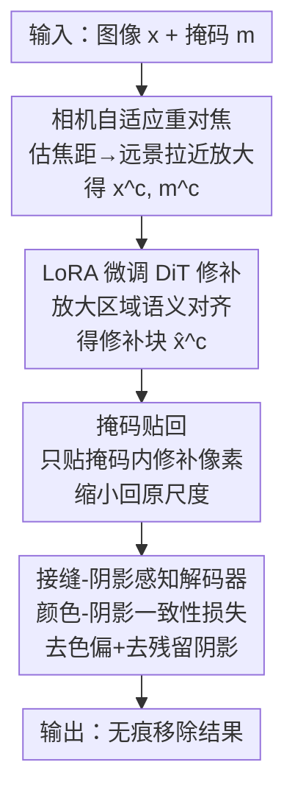

# ReFocusEraser: Refocusing for Small Object Removal with Robust Context-Shadow Repair

**会议**: ICLR 2026  
**OpenReview**: [https://openreview.net/forum?id=OkNxZGenYr](https://openreview.net/forum?id=OkNxZGenYr)  
**代码**: https://github.com/ProAirVerse/ReFocusEraser.git  
**领域**: 扩散模型 / 图像编辑  
**关键词**: 物体移除, 图像修复, 小目标, 相机重对焦, 阴影修复  

## 一句话总结
针对扩散模型移除小物体时细节丢失的问题，ReFocusEraser 用「相机自适应放大 + LoRA 微调修补」先把小目标放大后修好，再用「掩码贴回 + 接缝-阴影感知解码器」无痕贴回原图并自动去掉残留阴影，在 RORD 上把 PSNR 从 25.0 提到 31.3。

## 研究背景与动机
**领域现状**：物体移除（object removal）要把用户框出的区域用语义连贯的背景填掉。当前最强的是基于扩散模型的方法（RePaint、CLIPAway、PowerPaint、OmniEraser 等），它们靠各种显式引导（采样已知像素、AlphaCLIP 分离前后景、任务提示词、前后景独立引导）来让生成内容贴合背景而不是凭空造新物体。

**现有痛点**：这些方法在移除**小物体**时普遍失败——结构和纹理细节恢复不出来。根因在于扩散模型 VAE 编码器的**固定下采样压缩率**：大物体占的像素多，压缩后还能保留大部分结构；小物体本来就只有几个像素，编码时高频细节几乎被全部丢弃（论文图 1(b) 直观展示了这一点），解码器单靠上采样补不回来。

**核心矛盾**：VAE 的压缩率是固定的，小区域天然吃亏。直接微调整个 VAE 虽然能缓解，但代价高、要海量数据、训练不稳定还容易后验坍塌（posterior collapse），把生成多样性也搞没了——这是一个「想保细节就得动 VAE，动 VAE 又会引入新问题」的两难。

**切入角度**：作者从真实摄影里的**相机变焦**得到启发——远景通过调整焦距可以变成近景，把远处的小主体「拉近放大」。既然 VAE 对大区域友好，那何不在送进 VAE 之前先把小目标放大？放大后修补，修完再缩小贴回。这样绕开了 VAE 固定压缩率的瓶颈，又不用动 VAE 本身。

**核心 idea**：用「放大→修补→缩小贴回」的两阶段流程替代「直接在原分辨率修补」，并专门设计一个解码器解决贴回时 VAE 上下采样不对称造成的色偏、接缝和残留阴影。

## 方法详解

### 整体框架
ReFocusEraser 是一个建立在通用 FLUX.1-dev（DiT 架构的扩散模型）之上的**两阶段**小物体移除框架。输入是一张图 $x$ 和用户掩码 $m$，输出是把掩码区域无痕填好、连阴影都去掉的结果图。

**Stage I（相机自适应重对焦修补）**：先用相机标定算法估计输入图的焦距，判断是远景还是近景；对小目标占比大的远景做相机条件下的「拉近放大」，得到放大后的图 $x^c$ 和掩码 $m^c$；再对放大区域用 LoRA 微调 FLUX.1-dev 的 DiT 做修补，得到放大尺度下的修补结果 $\hat{x}^c$。

**Stage II（接缝-阴影感知修复）**：把放大修补好的区域用**掩码贴回（mask-based stitching）**策略缩小贴回原图，再喂给一个专门微调过的**接缝-阴影感知解码器**，用「颜色-阴影一致性损失」把贴回时的色偏、接缝以及小物体没被掩码盖住的残留阴影一并修掉，最后做相机对齐变换还原到原图坐标。

### 关键设计

**1. 相机自适应重对焦机制：把吃亏的小目标先放大再修**

这一步直接针对「VAE 固定压缩率让小物体细节被压没」的痛点。不同图里目标大小差异很大，固定裁剪或固定倍率的缩放保不住所有小目标，所以作者让放大倍率**随相机参数自适应**。具体做法是先用相机标定算法估计输入图 $x$ 的焦距，把场景分为远景/近景：根据经验把 **500 像素**设为焦距阈值，低于它的视为远景。远景往往视场大、掩码物体相对很小，直接过 VAE 信息损失最严重；于是对远景施加相机条件下的「拉近放大」，把远处场景拉近、相对放大小掩码物体，得到对修补更友好的 $x^c$ 和 $m^c$。本质上它是在「VAE 压缩率不变」的约束下，通过提高目标在画面里的相对分辨率来换取细节保留，而不是去改 VAE。

**2. LoRA 重对焦修补器：只加低秩适配，不动通用大模型**

放大之后要在放大尺度上把掩码区域修好。作者没有用专门为修补训练的 Flux-Fill 或 Flux-Kontext，而是把 LoRA 注入**通用** FLUX.1-dev 的 DiT 全部线性层（自注意力 + 前馈），用放大后的 $x^c$ 替换原图来训练。对权重 $W \in \mathbb{R}^{d_{out}\times d_{in}}$，适配后输出为 $W_{LoRA}X = WX + \frac{\alpha}{r}BAX$，其中 $A,B$ 是可训练低秩矩阵、$r \ll \min(d_{in},d_{out})$。同时把 DiT 输入层扩展为接收掩码前景 $x\odot m$、可见背景 $x\odot(1-m)$、二值掩码 $m$ 和噪声潜变量，拼接后过线性层提供前景-背景引导，用流匹配损失 $L^c_{flow}=\mathbb{E}\,b(t)^2\lVert\epsilon_t-\epsilon_\theta(x^c_t\mid y^c;t)\rVert_2^2$ 优化（$y^c=[m^c, x^c_0\odot m^c, x^c_0\odot(1-m^c)]$）。选通用模型 + LoRA 而非专用修补模型，是为了**保留预训练参数、保住跨任务迁移能力**，只在放大区域上增强语义对齐。

**3. 掩码贴回策略：只贴掩码内像素，保住周围上下文**

放大修好的块 $\hat{x}^c$ 要缩小贴回原图，怎么贴是有讲究的。最直接的「框贴回（box-based）」是把整块缩放后直接覆盖：$x_{box}=x+S(\hat{x}^c)$，虽然保住了块的完整结构，但经常带来边界错位和明显接缝。作者改用**掩码贴回**，只贴回掩码内的修补区域：$x_{mask}=x+S((1-m^c)\odot x^c + m^c\odot \hat{x}^c)$，让周围上下文保持原样不变。代价是掩码边界附近会有轻微色差，且贴回本身**去不掉**未被掩码盖住的物体阴影——但它换来了更好的空间对齐和语义连贯，所以被选为默认策略，剩下的色差和阴影交给 Stage II 收尾。

**4. 接缝-阴影感知修复：只微调解码器，用区域感知损失同时治色偏和阴影**

掩码贴回留下的色偏、接缝和残留阴影由这一步专门修。作者**只微调 VAE 解码器**、冻结 FLUX.1-dev 编码器——因为微调整个 VAE 会严重灾难性遗忘掉预训练的重建先验，需要更大数据和算力，不现实；只动解码器既能最大化复用预训练重建能力，又让 Stage II 专注修色偏和阴影而不破坏 Stage I 学到的全局场景表示。Stage II 解码器 $D_{seam}$ 从 Stage I 解码器初始化。难点在于：编码器冻住后，单纯 L1/L2 重建损失会让小/远物体输出模糊（高频边缘、纹理、阴影都被压在潜空间里恢复不出来）。为此作者提出**颜色-阴影一致性损失**，对前景和背景分区监督：

$$L_{color\ shadow}=\mathbb{E}\big[\lVert x^c_{fg}-\hat{x}^c_{fg}\rVert_1\big]+\mathbb{E}\big[\text{LPIPS}(x^c_{bg},\hat{x}^c_{bg})\big]$$

即对掩码前景用 L1 保像素级颜色一致，对未掩码背景用 LPIPS 保高频细节（含阴影）。这种区域感知的感知监督让解码器既能修好前景结构、又能维持真实连贯的背景，最后再做相机对齐变换映射回原图。

## 实验关键数据

### 主实验
在 RORD（12,757 训练对 / 1,542 验证对）和真实场景 benchmark RemovalBench 上评测，指标分两类：整体图像质量（FID、CMMD）和区域级保真度（PSNR、SSIM、LPIPS）。所有指标都在贴回后的**整图**上算。

| 数据集 | 指标 | ReFocusEraser | 之前最好 | 提升 |
|--------|------|------|----------|------|
| RORD-val | PSNR↑ | 31.256 | 25.025 (Flux-Fill) | +6.231 |
| RORD-val | SSIM↑ | 0.924 | 0.794 (Flux-Fill) | +0.130 |
| RORD-val | LPIPS↓ | 0.041 | 0.092 (Flux-Fill) | −0.051 |
| RORD-val | FID↓ | 21.378 | 25.393 (AttentiveEraser) | −4.015 |
| RemovalBench | PSNR↑ | 30.495 | 25.265 (AttentiveEraser) | +5.230 |
| RemovalBench | FID↓ | 38.115 | 65.326 (AttentiveEraser) | −27.211 |

定性上：通用修补方法（RePaint、PixelHacker、Flux-Fill/Kontext）经常移除不干净或背景不连贯；OmniEraser 能移除前景但破坏背景；AttentiveEraser 背景保住了却留着物体阴影；只有 ReFocusEraser 既移除干净又保持结构与语义一致、还去掉阴影。

### 消融实验
表 2 逐步加组件（(a) 基线在原图上训练，(b)–(d) 在 3× 放大图上训练）：

| 配置 | PSNR↑ | SSIM↑ | LPIPS↓ | FID↓ | 说明 |
|------|------|------|--------|------|------|
| (a) 基线（原图 LoRA） | 23.683 | 0.626 | 0.323 | 40.287 | 有接缝/阴影/色偏 |
| (b) +CAR +框贴回 | 31.082 | 0.923 | 0.046 | 24.288 | 加放大，PSNR +7.4 |
| (c) +掩码贴回 | 31.732 | 0.932 | 0.039 | 25.036 | 区域保真再升 |
| (d) +接缝阴影解码器 | 31.256 | 0.924 | 0.041 | 21.378 | FID 最低，阴影/色偏修掉 |

### 关键发现
- **相机自适应放大贡献最大**：从 (a) 到 (b) 单加 CAR，PSNR 直接涨 7.399、SSIM 涨 0.297，FID 降 15.999，证明「放大再修」确实绕开了 VAE 压缩瓶颈，是整套方法最核心的增益来源。
- **掩码贴回换来区域保真但留阴影**：从 (b) 框贴回到 (c) 掩码贴回，PSNR/SSIM/LPIPS 都更好（+0.65/+0.009/−0.007），但因残留阴影 FID、CMMD 反而略降——这正是 Stage II 要补的洞。
- **Stage II 用 FID 换 PSNR**：(d) 相比 (c) 的 PSNR/SSIM 略降一点点，但 FID 从 25.036 降到 21.378、把接缝和阴影彻底修掉，整体观感（分布对齐）最好，说明该阶段牺牲极小像素保真换来了显著的整体一致性。

## 亮点与洞察
- **把「相机变焦」搬进修补流程**：与其去改 VAE 的固定压缩率，不如在输入端用焦距估计把小目标放大，让小区域享受到和大区域一样的有效分辨率——这个「换视角而非换模型」的思路很巧，几乎零额外模型代价。
- **冻结编码器、只微调解码器**：避开了全 VAE 微调的灾难性遗忘和后验坍塌，是个很实用的工程取舍，可迁移到任何「想用 VAE 重建能力又怕破坏先验」的编辑任务。
- **区域感知的颜色-阴影损失**：前景 L1 保色、背景 LPIPS 保高频，把「去色偏」和「去阴影」两件事用一个分区损失同时解决，比单纯 L1/L2 不糊。
- 选**通用** FLUX.1-dev + LoRA 而非专用 Flux-Fill，保住了跨任务迁移能力，这点对想复用同一 backbone 做多种编辑的场景有借鉴价值。

## 局限与展望
- 方法对**焦距估计**和 500 像素阈值有依赖，相机标定不准或阈值不匹配的场景（如人工合成图、无明确相机模型的图）可能退化，论文用经验阈值，泛化性存疑。
- 两阶段、两次训练（Stage I LoRA 约 2 天 4×H200，Stage II 解码器约 1.5 天 8×H200）流程偏重，推理也要走「放大→修补→缩小→解码器修」多步，比单次前向的方法慢。
- 阴影去除依赖 LPIPS 监督背景，对**大面积或复杂投影阴影**是否同样有效未充分验证；Stage II 的 (d) 相比 (c) 在 PSNR/SSIM 上有轻微回退，说明色偏-阴影修复与像素保真之间仍有 trade-off。
- 主要面向「小物体」，对超大掩码或多物体密集场景的表现没有重点展开。

## 相关工作与启发
- **vs Flux-Fill**：Flux-Fill 是专用修补模型，靠文本+二值掩码在原分辨率修，小物体上是之前最强（PSNR 25.0）；本文不动分辨率瓶颈而是先放大，再用通用 Flux+LoRA，区别在于「换视角解决压缩损失」，PSNR 直接拉到 31.3。
- **vs OmniEraser**：OmniEraser 用前景+背景双引导增强上下文理解（本文也借鉴了它的条件输入设计），但它在原尺度修，背景常被破坏、阴影留着；本文用掩码贴回保背景、用解码器去阴影。
- **vs AttentiveEraser**：AttentiveEraser 在整体质量（FID/CMMD）上是之前最好且能保背景，但留物体阴影；本文在保背景的同时把阴影也自动修掉，FID/CMMD 进一步降低。

## 评分
- 新颖性: ⭐⭐⭐⭐ 「相机变焦放大绕开 VAE 压缩瓶颈」的切入点新颖且直击根因
- 实验充分度: ⭐⭐⭐⭐ 两 benchmark、5 指标、与 8 个方法对比 + 逐组件消融，较完整
- 写作质量: ⭐⭐⭐⭐ 动机推导清晰，pipeline 和损失交代到位
- 价值: ⭐⭐⭐⭐ 小物体移除是实际刚需，方法工程上可复用性强

<!-- RELATED:START -->

## 相关论文

- [\[CVPR 2025\] MetaShadow: Object-Centered Shadow Detection, Removal, and Synthesis](../../CVPR2025/image_generation/metashadow_object-centered_shadow_detection_removal_and_synthesis.md)
- [\[ICLR 2026\] Geometric Image Editing via Effects-Sensitive In-Context Inpainting with Diffusion Transformers](geometric_image_editing_via_effects-sensitive_in-context_inpainting_with_diffusi.md)
- [\[ICML 2026\] AdaEraser: Training-Free Object Removal via Adaptive Attention Suppression](../../ICML2026/image_generation/adaeraser_training-free_object_removal_via_adaptive_attention_suppression.md)
- [\[CVPR 2026\] Precise Object and Effect Removal with Adaptive Target-Aware Attention](../../CVPR2026/image_generation/precise_object_and_effect_removal_with_adaptive_target-aware_attention.md)
- [\[CVPR 2026\] ShadowDraw: From Any Object to Shadow-Drawing Compositional Art](../../CVPR2026/image_generation/shadowdraw_from_any_object_to_shadow-drawing_compositional_art.md)

<!-- RELATED:END -->
