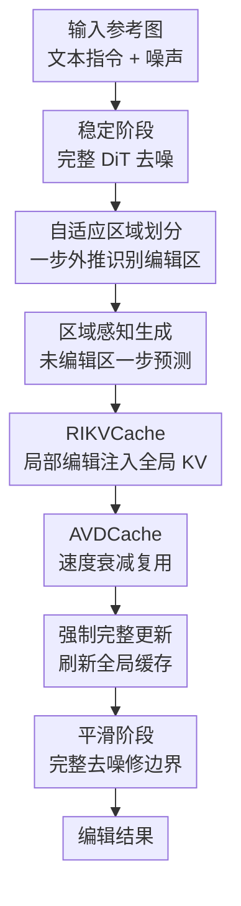

# RegionE: Adaptive Region-Aware Generation for Efficient Image Editing

**会议**: ICLR 2026  
**OpenReview**: [https://openreview.net/forum?id=I6j5fLdH80](https://openreview.net/forum?id=I6j5fLdH80)  
**代码**: https://github.com/Peyton-Chen/RegionE  
**领域**: 图像生成 / 图像编辑 / 扩散模型加速  
**关键词**: 指令图像编辑, 区域感知生成, 扩散模型加速, KV Cache, 轨迹冗余  

## 一句话总结
RegionE 观察到指令图像编辑中未编辑区域的生成轨迹近似直线、编辑区域轨迹更弯但相邻步速度相似，于是用自适应区域划分、区域级 KV 注入和速度衰减缓存，在不训练新模型的情况下把 Step1X-Edit、FLUX.1 Kontext、Qwen-Image-Edit 加速约 2.06-2.57 倍，并基本保持原模型输出质量。

## 研究背景与动机
**领域现状**：指令图像编辑（instruction-based image editing, IIE）正在从早期需要 mask、反演或任务专用模块的方案，转向由文本指令直接驱动的通用 DiT/flow-matching 编辑模型。Step1X-Edit、FLUX.1 Kontext、Qwen-Image-Edit 这类模型通常把文本 token、噪声 token 和参考图像 token 一起送入 Instruction-DiT，再通过多步去噪得到编辑后的图像。

**现有痛点**：这些模型虽然编辑能力强，但推理延迟高。更关键的是，它们在每一步都对整张图使用同样的计算预算，即便用户指令往往只要求改一个局部区域，例如给猫加帽子、替换文字或移除某个物体。未被编辑的大面积背景、主体轮廓和纹理其实几乎不变，却仍然经历完整 DiT 计算，这造成显著的空间冗余。

**核心矛盾**：IIE 和纯文生图的冗余结构不同。文生图需要从噪声中合成整张图，而编辑任务天然包含“该变的区域”和“不该变的区域”。如果仍把两类区域混在一起统一去噪，就会浪费未编辑区域的计算；但如果粗暴只算局部，又会丢掉参考图像和全局上下文，使编辑区域在边界、语义和细节上偏离原图。

**本文目标**：作者要解决的问题不是重新训练一个更小的编辑模型，而是在已有 IIE 模型上做 training-free 推理加速。具体来说，它要自动找出哪些 token 属于编辑区域、哪些属于未编辑区域；对未编辑区域用更便宜的一步估计替代多步去噪；对编辑区域保留必要迭代，但减少无关 token 和冗余 timestep 的计算；最后还要避免区域拼接造成边界瑕疵。

**切入角度**：论文的关键观察来自生成轨迹。未编辑区域在去噪过程中轨迹近似直线，早期速度已经能较可靠地外推到后续甚至最终结果；编辑区域的轨迹更弯，一步外推最终图会不准，但相邻 timestep 的速度方向高度一致，只是幅值随时间衰减。这个观察让“区域区别对待”和“跨步缓存速度”都有了具体依据。

**核心 idea**：RegionE 用早期一阶外推识别未编辑区域，并把未编辑区域的一步预测、编辑区域的局部迭代、全局 KV 上下文注入和自适应速度衰减缓存组合成一个区域感知推理框架。

## 方法详解

### 整体框架
RegionE 面向基于 flow matching / rectified flow 的 Instruction-DiT 编辑模型。原始模型每一步接收文本 token $X_P$、当前噪声 token $X_{t_i}$ 和参考图像 token $X_I$，预测速度 $v(X_{t_i}, t_i)$，再用 Euler 更新 $X_{t_{i-1}} = X_{t_i} - (t_i - t_{i-1}) \cdot v(X_{t_i}, t_i)$。

RegionE 不改变模型权重，也不改变用户输入，而是在采样过程里插入三段式推理策略：前几步保持完整去噪以稳定速度估计；中间阶段根据区域性质分开生成，并用缓存减少空间和时间冗余；最后再做少量完整去噪，抹平编辑区和未编辑区之间的边界差异。

这张图里真正的贡献节点是“自适应区域划分”“RIKVCache”“AVDCache”，它们分别对应后面三个关键设计。稳定阶段、强制完整更新和平滑阶段是为了让这三个设计可靠运行的采样调度：前者避免低信噪比阶段误判，强制更新避免 KV 过期，平滑阶段处理区域重组后的细小边界不连续。

### 关键设计
**1. 自适应区域划分：用一步外推把“该算”和“不该算”的 token 分开**

RegionE 的第一步不是直接裁剪图像，而是先判断哪里真的需要编辑。论文利用 rectified flow 的 Euler 形式：如果某个区域的轨迹近似线性，那么在 timestep $t_i$ 用当前速度做一步外推，就能估计后续 timestep $t_f$ 的状态：$\hat{X}_{t_f}^U = X_{t_i}^U - v^U(X_{t_i}^U, t_i) \cdot \Delta t_{i,f}$。当 $t_f = 0$ 时，这就是直接估计最终未编辑区域。作者发现未编辑区域的这个估计和真实结果很接近，而编辑区域因为轨迹弯曲，早期一步估计会偏差明显。

具体做法是在稳定阶段之后，用当前速度先估计整张最终图 $\hat{X}_0$，再沿 token 维度比较 $\hat{X}_0$ 与参考图像 $X_I$ 的余弦相似度。相似度高于阈值 $\eta$ 的 token 被视为未编辑区域，因为这些位置在“预测的最终结果”和“原参考图”之间变化很小；剩余 token 则视为编辑区域。为了避免 mask 噪声，RegionE 还使用形态学开闭操作让区域更连续。这个设计的好处是不用外部分割器、不需要用户 mask，也不依赖额外训练，而是从当前编辑模型自身的生成动态里推断编辑范围。

**2. RIKVCache：局部算编辑区域，但让注意力仍然看见全局上下文**

只识别编辑区还不够。如果把 DiT 输入从 $[X_P, X_{t_i}, X_I]$ 直接缩成 $[X_P, X_{t_i}^E]$，计算量会下降，但编辑区域会失去未编辑区域和参考图像 token 的 key/value 信息。由于 DiT 注意力层本来依赖全局 token 交互，这种粗暴局部化会让局部速度估计带偏，尤其容易在边界、物体关系和语义一致性上出问题。

RegionE 的 Region-Instruction KV Cache（RIKVCache）保留局部 query，但把上一轮完整 DiT 计算得到的未编辑区域和参考图像 KV 注入注意力。也就是说，实时输入仍只包含文本和编辑区域 token，但注意力变成 $\text{softmax}([Q_P,Q_E][K_P,K_E,K_U^C,K_I^C]^T/\sqrt{d})[V_P,V_E,V_U^C,V_I^C]$。这里的 $K_U^C,V_U^C,K_I^C,V_I^C$ 来自缓存的完整图像计算。这样一来，编辑区域不再为未编辑 token 重新计算 query 和前向传播，却仍可通过缓存 KV 感知背景、参考图和全局布局。论文用跨 timestep key 相似度说明了这个缓存是可行的：相邻去噪步的 KV 高度相似，尤其是静态的 instruction token 更适合复用。

**3. AVDCache：把相邻步速度当作“方向相同、幅值衰减”的量来复用**

编辑区域必须迭代去噪，但并不意味着每一步都要完整跑 DiT。论文观察到中间去噪阶段的编辑区域速度方向在相邻 timestep 间几乎一致，余弦相似度接近 1；变化主要体现在速度范数逐步衰减，而且衰减幅度与 timestep 有关。RegionE 因此不只是简单复用上一轮残差，而是显式建模速度衰减。

AVDCache 的核心是一个衰减因子：$\|v_{t_i}\|/\|v_{t_{i+1}}\| = (1 - \Delta t_{t_{i+1},t_i}) \cdot \gamma_{t_i}$。其中 $(1 - \Delta t)$ 由离散 Euler solver 决定，$\gamma_{t_i}$ 是 timestep-aware 修正项，由随机采样数据拟合得到。缓存是否继续使用由累计误差 $\text{Criterion} = 1 - \prod_{i=s}^{e}(1 - \Delta t_{t_{i+1},t_i})\gamma_{t_i}$ 控制；当累计误差超过阈值 $\delta$ 时，RegionE 重新跑一次 DiT 并刷新速度缓存，否则用缓存速度乘以对应衰减因子近似当前速度。这个设计比普通 residual cache 更贴合 flow-matching 编辑模型的速度动态，所以能在质量几乎不掉的情况下显著减少中间步计算。

### 一个完整示例
以“给猫加一顶帽子”为例，原始 IIE 模型会在 28 个采样步里反复处理整张图的所有 token，包括猫身体、背景、桌面等不需要变化的区域。RegionE 前 6 步仍按原模型完整去噪，因为此时噪声占比高，速度估计还不稳定。

进入区域感知生成阶段后，RegionE 用当前速度外推最终图，并把外推结果和参考图逐 token 比较。猫头附近因为将出现帽子，与参考图相似度低，被划为编辑区域；背景、猫身和桌面与参考图相似度高，被划为未编辑区域。接下来，未编辑区域不再经历每一步完整 DiT，而是用一步估计直接跳到后续 timestep；编辑区域则被 gather 成局部 token，送入 DiT 继续迭代。

在局部迭代时，编辑区域的 query 仍可访问上一次完整计算缓存下来的背景和参考图像 KV，所以帽子的生成不会脱离猫头位置、光照和整体语义。若连续几步速度方向稳定，AVDCache 会用衰减后的缓存速度替代完整 DiT 调用；当累计误差过大，或到达预设强制更新步，RegionE 会重新聚合整张图跑一次完整 DiT，并刷新 RIKVCache。最后两步完整去噪负责清理帽子边缘和未编辑区域交界处可能出现的轻微缝隙。

### 损失函数 / 训练策略
RegionE 是 training-free 推理框架，没有新增训练损失，也不微调 Step1X-Edit、FLUX.1 Kontext 或 Qwen-Image-Edit。它依赖的基础模型仍然是原本的 flow matching / rectified flow 训练目标，即让模型预测从噪声分布到目标图像分布的速度场。

推理超参主要包括三个阶段的步数和两个阈值。实验中所有模型都使用 28 个采样步，稳定阶段为 6 步，平滑阶段为 2 步，并在区域感知生成阶段的第 16 步强制完整更新。ARP 阈值 $\eta$ 分别设为 0.88、0.93、0.80，对应 Step1X-Edit、FLUX.1 Kontext、Qwen-Image-Edit；AVDCache 阈值 $\delta$ 分别为 0.02、0.04、0.03。较大的 $\eta$ 会把更多区域判为编辑区，质量更稳但速度变慢；较大的 $\delta$ 会跳过更多 timestep，速度更快但质量更容易下降。

## 实验关键数据

### 主实验
论文在三个开源 IIE 模型上评估 RegionE：Step1X-Edit-v1p1、FLUX.1 Kontext 和 Qwen-Image-Edit。数据集方面，Step1X-Edit 与 Qwen-Image-Edit 使用 GEdit-Bench English 的 606 组图像-指令样本，覆盖 11 类编辑任务；FLUX.1 Kontext 使用 KontextBench 的 1026 组样本，覆盖 5 类任务。所有实验在单张 NVIDIA H800 GPU 上测量延迟。

| 基础模型 | 方法 | PSNR↑ | SSIM↑ | LPIPS↓ | 延迟(s)↓ | 加速比↑ |
|----------|------|-------|-------|--------|----------|---------|
| Step1X-Edit | Vanilla | - | - | - | 27.945 | 1.000x |
| Step1X-Edit | TeaCache | 28.262 | 0.924 | 0.072 | 11.212 | 2.493x |
| Step1X-Edit | RegionE | 30.520 | 0.939 | 0.054 | 10.865 | 2.572x |
| FLUX.1 Kontext | Vanilla | - | - | - | 14.682 | 1.000x |
| FLUX.1 Kontext | TeaCache | 28.307 | 0.869 | 0.097 | 6.203 | 2.367x |
| FLUX.1 Kontext | RegionE | 32.133 | 0.917 | 0.057 | 6.096 | 2.409x |
| Qwen-Image-Edit | Vanilla | - | - | - | 32.125 | 1.000x |
| Qwen-Image-Edit | TeaCache | 28.314 | 0.900 | 0.075 | 16.445 | 1.954x |
| Qwen-Image-Edit | RegionE | 31.115 | 0.937 | 0.046 | 15.604 | 2.059x |

这个主表说明 RegionE 的定位很清楚：它不是单纯追求最高跳步率，而是在质量-速度曲线上更靠近理想点。相比 TeaCache、FORA、Stepskip、RAS、ToCa 等基线，RegionE 通常同时拿到更高 PSNR/SSIM、更低 LPIPS 和更强加速。尤其在 FLUX.1 Kontext 上，RegionE 的 PSNR 达到 32.133，而 TeaCache 为 28.307，说明区域感知并没有破坏原模型输出，反而比纯时间缓存更稳。

| 基础模型 | 方法 | G-SC↑ | G-PQ↑ | G-O↑ | 结论 |
|----------|------|-------|-------|------|------|
| Step1X-Edit | Vanilla | 7.479 | 7.466 | 6.906 | 原模型参考 |
| Step1X-Edit | RegionE | 7.552 | 7.405 | 6.948 | 语义与整体质量基本持平或略高 |
| FLUX.1 Kontext | Vanilla | 7.197 | 6.963 | 6.497 | 原模型参考 |
| FLUX.1 Kontext | RegionE | 7.278 | 6.953 | 6.538 | 感知质量几乎不变 |
| Qwen-Image-Edit | Vanilla | 8.242 | 7.948 | 7.700 | 原模型参考 |
| Qwen-Image-Edit | RegionE | 8.242 | 7.968 | 7.731 | 与原模型语义一致性完全持平 |

GPT-4o 评价进一步说明 RegionE 的加速不是用明显画质退化换来的。G-SC 表示语义一致性，G-PQ 表示感知质量，G-O 表示整体质量。三类模型上 RegionE 的分数都与 vanilla 接近，有些指标甚至略高。用户研究也显示参与者很难判断一张图是否经过 RegionE 加速，这和量化指标相互印证。

### 消融实验
论文主要在 Step1X-Edit-v1p1 上做消融，分别移除缓存组件和阶段调度组件。这个消融很有价值，因为 RegionE 的几个模块表面上都在“省计算”，但它们承担的质量保护作用并不一样。

| 配置 | PSNR↑ | SSIM↑ | LPIPS↓ | G-O↑ | 延迟(s)↓ | 加速比↑ | 说明 |
|------|-------|-------|--------|------|----------|---------|------|
| RegionE | 30.520 | 0.939 | 0.054 | 6.948 | 10.865 | 2.572x | 完整方法 |
| w/o RIKVCache | 22.868 | 0.822 | 0.207 | 5.191 | 10.223 | 2.734x | 速度略快但质量严重下降 |
| w/o AVDCache | 31.139 | 0.946 | 0.046 | 7.023 | 16.122 | 1.733x | 质量略好但加速明显变弱 |
| w/o STS | 21.441 | 0.814 | 0.161 | 6.325 | 7.149 | 3.909x | 早期不稳定阶段加速会破坏结果 |
| w/o SMS | 28.857 | 0.904 | 0.085 | 6.773 | 9.766 | 2.862x | 边界平滑不足带来小幅退化 |
| w/o Forced Step | 28.452 | 0.915 | 0.080 | 6.925 | 10.204 | 2.739x | KV 长时间不刷新会积累偏差 |

最关键的结论是：RIKVCache 是质量底座，AVDCache 是速度来源。去掉 RIKVCache 后，局部编辑虽然更快，但 PSNR 从 30.520 掉到 22.868，说明“只算编辑区”不能没有全局上下文。去掉 AVDCache 后质量甚至略高，但加速比从 2.572x 降到 1.733x，说明时间冗余利用是 RegionE 达到两倍以上加速的主要原因之一。

| 额外分析 | 观察 | 启发 |
|----------|------|------|
| $\delta$ 敏感性 | $\delta$ 越大，缓存 timestep 越多，质量越容易下降 | 速度阈值不能盲目放大 |
| $\eta$ 敏感性 | $\eta$ 越大，更多区域被判为编辑区，速度下降但质量提高 | 编辑区划分是质量-速度旋钮 |
| 高分辨率编辑 | 1874x1248、1328x1760 示例中约 2.66-2.69x 加速 | 分辨率越高，空间冗余通常越大 |
| 多区域编辑 | 分散编辑区域也能保持稳定 | RIKVCache 让局部 query 共享全局 KV |
| 全局编辑 | 空间冗余少时仍能依靠 AVDCache 加速 | RegionE 不只适用于小 mask 编辑 |

### 关键发现
- 未编辑区域的一步预测是 RegionE 的核心入口。它把 IIE 中“绝大多数像素不该变”这个常识变成可计算的区域划分，而不是依赖人工 mask 或额外分割网络。
- RIKVCache 的消融掉点最大，说明编辑区域的局部生成不能脱离全图语义。区域感知加速要做的是减少重复计算，不是把编辑区域从上下文中孤立出来。
- AVDCache 对速度贡献很大，但必须避开稳定阶段。补充材料显示如果在 STS 也使用 AVDCache，速度能到 3.256x，但 PSNR 从 30.520 降到 28.610，说明早期速度方向还不可靠。
- 平滑阶段和强制更新看起来是小模块，却分别处理边界不连续和 KV 相似度衰减问题。没有它们时加速更高，但质量会出现可见或可测的下降。
- 失败案例多是轻微偏色或局部形状偏差，例如银色甜甜圈边角颜色有偏、陶瓷杯形状略变；这些通常不破坏指令遵循，但说明高加速设置下仍有局部生成误差。

## 亮点与洞察
- 这篇论文最有意思的地方是没有把 IIE 当作普通扩散采样来加速，而是抓住了“编辑任务天然有不变区域”这一点。未编辑区域轨迹近似直线这个观察，把局部编辑的空间冗余解释得很具体。
- ARP 的设计很干净：直接用模型当前速度外推最终图，再和参考图做相似度比较。它不像传统 mask-based editing 需要额外提示，也不像分割模型那样引入外部语义类别，而是让编辑模型自己暴露哪些区域会变。
- RIKVCache 是本文避免质量崩掉的关键。它提醒我们，局部化计算不等于局部化上下文；在 DiT 这类全局 attention 模型里，真正可省的是部分 token 的实时计算，而不是全局信息本身。
- AVDCache 对 residual cache 给出了更贴近 flow matching 的解释。论文指出普通 residual cache 在形式上可看成 velocity cache 的衰减版本，再补上 timestep-aware 的 $\gamma_t$，这让缓存策略不只是经验 trick，而有了动力学层面的解释。
- 这个思路可以迁移到视频编辑或高分辨率图像编辑。只要任务中存在大面积未变化区域，并且模型内部 token 有可复用的静态上下文，就可以考虑“局部实时 query + 全局缓存 KV + 自适应速度复用”的组合。

## 局限与展望
- RegionE 依赖“未编辑区域变化小、轨迹更直”的假设。对于全局风格转换、大面积光照变化、整体材质迁移这类任务，空间冗余会减少，RegionE 主要只能依靠时间缓存加速，收益会低于局部编辑场景。
- ARP 的阈值 $\eta$ 和 AVDCache 的阈值 $\delta$ 需要按基础模型设定。论文给出了三个模型的经验值，但如果换到新的 IIE 模型、不同采样器或不同分辨率，仍可能需要重新调参或拟合 $\gamma_t$。
- RIKVCache 带来 6%-10% 的显存开销。虽然相对可控，但对于已经接近显存上限的大模型或更高分辨率编辑，这部分缓存成本可能成为部署限制。
- 论文主要评价的是与 vanilla 输出的偏差和 VLM/用户偏好，尚未充分讨论极端编辑指令下的失败模式，例如非常细粒度文字修改、多主体空间关系变化、需要全局重构的复杂布局编辑。
- 后续可以把区域划分做得更连续和层次化，而不是二分为编辑/未编辑。例如对强编辑、弱编辑、只需保结构的区域使用不同步长和不同缓存策略，可能进一步提高质量-速度折中。

## 相关工作与启发
- **vs Stepskip / timestep 减少**: Stepskip 直接减少采样步，速度提升直接但容易在复杂编辑中损失细节。RegionE 不只是跳步，而是区分区域和 timestep，把未编辑区、编辑区和缓存步分别处理，因此质量保持更好。
- **vs TeaCache / $\Delta$-DiT / FORA**: 这些方法主要利用时间冗余，复用残差或中间特征。RegionE 也利用时间冗余，但额外利用 IIE 独有的空间冗余，并用 AVDCache 显式建模速度衰减，因此在三个编辑模型上更稳定。
- **vs RAS / ToCa**: RAS 和 ToCa 从 token 重要性或空间冗余角度减少计算，但它们主要面向通用生成模型。RegionE 的区域划分由编辑前后是否变化来定义，更贴合 instruction-based editing 的“局部改动、全局保持”目标。
- **vs EEdit**: EEdit 关注两阶段 inversion-based editing 中 inversion 和 denoising 的冗余。RegionE 面向新一代 denoising-only / MLLM-assisted IIE 模型，不需要反演阶段，也不依赖输入 mask。
- **对后续研究的启发**: 高效生成不一定只靠压模型、量化或少步蒸馏。任务结构本身也能提供加速信号；对编辑、修复、视频局部修改这类任务，先问“哪些 token 真正在变化”可能比统一优化全模型更有效。

## 评分
- 新颖性: ⭐⭐⭐⭐⭐ 把 IIE 中编辑/未编辑区域的生成轨迹差异转化为 training-free 加速机制，问题切入非常精准。
- 实验充分度: ⭐⭐⭐⭐⭐ 覆盖三个强 IIE 模型、多种时间/空间加速基线、VLM 评价、用户研究、消融和补充场景分析，证据链比较完整。
- 写作质量: ⭐⭐⭐⭐ 方法图和消融逻辑清晰，但部分符号和算法伪代码细节较密，读者需要结合图 3 与公式反复对照。
- 价值: ⭐⭐⭐⭐⭐ 对实际图像编辑部署很有价值，尤其适合高分辨率和局部编辑场景，也为区域感知扩散推理提供了可迁移范式。

<!-- RELATED:START -->

## 相关论文

- [\[ICLR 2026\] Follow-Your-Shape: Shape-Aware Image Editing via Trajectory-Guided Region Control](follow-your-shape_shape-aware_image_editing_via_trajectory-guided_region_control.md)
- [\[CVPR 2026\] HierEdit: Region-Aware Hierarchical Diffusion for Efficient High-Resolution Editing](../../CVPR2026/image_generation/hieredit_region-aware_hierarchical_diffusion_for_efficient_high-resolution_editi.md)
- [\[ICLR 2026\] DragFlow: Unleashing DiT Priors with Region Based Supervision for Drag Editing](dragflow_unleashing_dit_priors_with_region_based_supervision_for_drag_editing.md)
- [\[ICLR 2026\] Locality-aware Parallel Decoding for Efficient Autoregressive Image Generation](locality-aware_parallel_decoding_for_efficient_autoregressive_image_generation.md)
- [\[ICLR 2026\] Efficient Sliced Wasserstein Distance Computation via Adaptive Bayesian Optimization](efficient_sliced_wasserstein_distance_computation_via_adaptive_bayesian_optimiza.md)

<!-- RELATED:END -->
