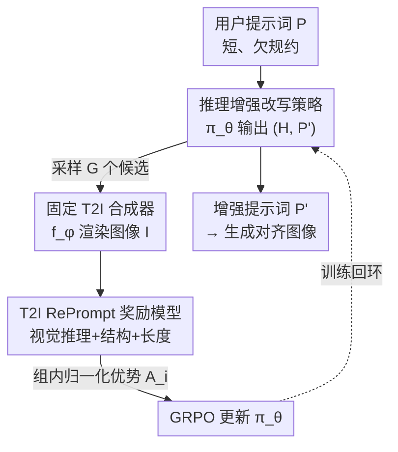

# RePrompt: Reasoning-Augmented Reprompting for Text-to-Image Generation via Reinforcement Learning

**会议**: ICLR 2026  
**OpenReview**: [https://openreview.net/forum?id=HJ3vgg7TYQ](https://openreview.net/forum?id=HJ3vgg7TYQ)  
**代码**: https://github.com/microsoft/DKI_LLM/tree/main/RePrompt  
**领域**: 扩散模型 / 文本生成图像  
**关键词**: 提示词改写, 链式推理, 强化学习, GRPO, 组合生成

## 一句话总结
RePrompt 用强化学习训练一个小语言模型（Qwen2.5-3B），让它在改写用户提示词时先做显式链式推理、再产出结构化的增强提示词，并用一套"图像级"集成奖励直接优化下游生成结果，在 GenEval 和 T2I-Compbench 上把空间位置、计数等组合能力刷到新 SOTA，同时推理延迟远低于迭代式优化方法。

## 研究背景与动机

**领域现状**：文生图（T2I）扩散模型（FLUX、SD3、PixArt-Σ 等）已经能生成高分辨率、照片级图像，但用户给的提示词通常很短、信息欠规约（under-specified），模型很难还原用户真实意图。为弥合这道鸿沟，主流做法是"提示词增强"：要么多轮迭代——先生成图、再用人类偏好模型或自动打分反馈去改提示词；要么单轮用大语言模型（LLM）一次性把提示词扩写得更丰富。

**现有痛点**：迭代式方法（如 Idea2Img）每轮都要重新生成图像，延迟和算力开销极高（单图可达 140s），且很少显式引入场景语义或组合推理；单轮 LLM 扩写（如 Promptist、DALL·E 3 的 caption upsampling）虽然语言流畅，但 LLM 缺乏对物理现实的 grounding，也拿不到下游视觉任务的反馈，经常生成语义不一致或物理上不合理的内容——比如"沙发在花瓶下方"被改写成漂亮但违反常识的布局，物体计数错、空间关系乱、属性绑定丢。

**核心矛盾**：提示词改写的质量应该由"它最终生成的图好不好"来评判，但 LLM 改写时既看不到图、也没有面向图像结果的训练信号；纯靠语言流畅度或人工规则去优化文本，本质上是在优化一个与真实目标错位的代理指标。

**本文目标**：让改写模型在落笔之前就"在脑子里预演"这句提示词会生成什么画面，从而提前规避物体冲突、缺失实体、空间不连贯等错误；并且这套训练要能跨不同 T2I 骨干迁移、不依赖人工标注的推理轨迹。

**核心 idea**：把提示词改写建模成一个"先推理、后改写"的单步决策，用 GRPO 强化学习直接以下游图像质量为奖励来训练改写策略——奖励信号绕过不可微的图像生成器，只看"提示词→图像"这对输入输出，因此天然跨骨干通用。

## 方法详解

### 整体框架
RePrompt 的关键设计是把"提示词生成"和"图像生成"解耦：只训练一个语言模型去产出结构化、语义丰富的提示词，而把 T2I 骨干完全冻结。整个系统由三个模块构成——改写策略 $\pi_\theta$、固定的 T2I 合成器 $f_\phi$、以及一个专门设计的 T2I RePrompt 奖励模型 $R_{\text{total}}(I, P, P')$。

给定用户原始提示词 $P$，策略采样出一对"推理轨迹 + 增强提示词" $y=(H, P')\sim\pi_\theta(P)$；合成器据此渲染图像 $I=f_\phi(P')$；奖励模型从真实感、语义对齐、提示词结构三方面给图像打分，分数再通过 GRPO 回流去更新 $\pi_\theta$。由于 $f_\phi$ 不可微，作者把改写过程形式化为一个**单步马尔可夫决策过程（MDP）**：状态是原始提示词 $P$，动作是采样 $y=(H,P')$，转移是确定性映射 $P'\mapsto I=f_\phi(P')$，奖励就是 $r=R_{\text{total}}$，目标为最大化 $\mathbb{E}_{P\sim D}\big[\mathbb{E}_{y\sim\pi_\theta(y|P)}[r]\big]$。冻结 $f_\phi$ 意味着 RePrompt 学到的是"针对某个特定骨干"的推理与改写策略，无需重训图像生成器。

### 关键设计

**1. 推理增强的单步 MDP 改写：让模型先"预演画面"再下笔**

针对 LLM 改写缺乏视觉 grounding、容易写出物理不合理提示词的痛点，RePrompt 强制改写策略输出两段内容：一段显式的链式推理 $H$ 和一段最终的增强提示词 $P'$，格式固定为 `<reason>...</reason><prompt>...</prompt>`。推理段让模型像人画画前先在脑中构图一样，逐步分解空间关系、解决物体冲突——例如把"沙发在花瓶下方"推理成"花瓶应放在沙发上方的悬浮置物架上"，再据此写出合理提示词。由于真正的优化目标（图像好不好）依赖不可微的 $f_\phi$，作者把它建成单步 MDP：一次采样直接对应一张图、一个标量奖励，避免了多轮迭代生成的高延迟。这与迭代式方法的根本区别在于：推理发生在**提示词构造阶段**而非图像生成之后，因此一次前向就能消解大部分组合错误。整个训练不需要任何人工标注的推理轨迹，监督完全来自下游图像反馈。

**2. T2I RePrompt 奖励模型：三路集成、只看提示词-图像对**

要让 RL 训得稳，奖励必须既稠密又多维。作者设计了一个图像级的集成奖励 $R_{\text{total}}=R_{\text{vis}}+R_{\text{struc}}+R_{\text{len}}$（各分量先归一化到单位方差再相加）。其中**视觉推理奖励** $R_{\text{vis}}=\alpha R^{\text{IMG}}_{\text{pref}}+\gamma R^{\text{VLM}}_{\text{sem}}$ 同时捕捉人类偏好与语义正确性：$R^{\text{IMG}}_{\text{pref}}$ 来自 ImageReward 衡量图像是否符合人类偏好，$R^{\text{VLM}}_{\text{sem}}$ 来自一个 VLM-Reward（用 GPT-4V）评估语义一致性与视觉质量（论文示例中"人看觉得手提箱太小、机器人看觉得两个物体都在"，两路分别给 0.3 与 0.7，互补地刻画"从人和从模型两个视角"的对错）。**结构奖励** $R_{\text{struc}}$ 是二值的：格式正确 $+1$、否则 $-1$，保证推理-提示词的标准布局可被下游解析。**长度奖励** $R_{\text{len}}$ 约束 $P'$ 的 token 数落在 $[L_{\min}, L_{\max}]=[15,77]$，合规 $+1$、越界 $-1$，以适配 SDXL、FLUX.1 等模型的 token 长度上限。这套奖励的妙处在于它**只依赖"提示词→图像"这对输入输出、不碰图像模型内部**，所以换骨干、换未见过的提示词分布都能直接用，这正是它能跨模型泛化的根源。

**3. GRPO 优化：用组内相对比较替代价值网络**

策略 $\pi_\theta$ 用 Group Relative Policy Optimization（GRPO）训练。每个更新步对同一提示词 $P$ 采样 $G$ 个候选 $\{y_i\}$，各自渲染图像、拿到标量奖励 $r_i$，然后做组内归一化得到优势 $A_i=(r_i-\mu_r)/\sigma_r$，其中 $\mu_r,\sigma_r$ 是这组奖励的均值与标准差。目标函数为带裁剪的 PPO 式目标再加 KL 正则：

$$J_{\text{GRPO}}(\theta)=\mathbb{E}_{P,\{y_i\}}\Big[\tfrac{1}{G}\sum_{i=1}^G \min\big(\rho_i A_i,\ \text{clip}(\rho_i,1-\varepsilon,1+\varepsilon)A_i\big)-\beta_{\text{KL}}\,\text{KL}\big(\pi_\theta\|\pi_{\text{ref}}\big)\Big]$$

其中 $\rho_i=\pi_\theta(y_i|P)/\pi_{\theta_{\text{old}}}(y_i|P)$。GRPO 用组内相对比较代替单独的价值网络，对"奖励来自黑盒图像渲染"这种高方差场景特别合适。作者还在附录给出方差缩减分析，论证结构化推理能降低奖励不确定性、减少准确估计所需的样本量，从而让 GRPO 训得更快更稳。

### 损失函数 / 训练策略
基座为 Qwen2.5-3B，训练用 FLUX.1-dev（512×512）作 T2I 模型，基于 TRL 框架训练 3 个 epoch、每个实例采 4 个候选输出，ImageReward 与 VLM-Reward 权重均为 0.5。训练数据借鉴 GenEval 的提示构造策略，用 GPT-4 生成 288 个日常物体、套六种以物体为中心的模板，得到 9,000 条提示词（与 GenEval 测试集去重）：8,000 条做监督微调（SFT）注入先验，1,000 条做 RL。全程 8×A100(80GB)、约 6 小时。

## 实验关键数据

### 主实验

GenEval 上，RePrompt（train w/ FLUX）在三种骨干上都把整体分刷到最高，空间位置（Position）提升尤其夸张：

| 骨干 | 配置 | Position | Counting | Overall |
|------|------|----------|----------|---------|
| FLUX | + Qwen2.5 3B | 0.35 | 0.63 | 0.68 |
| FLUX | **+ Ours** | **0.62** (+77.1%) | **0.77** (+22.2%) | **0.76** (+11.8%) |
| SD3 | + Qwen2.5 3B | 0.33 | 0.53 | 0.68 |
| SD3 | **+ Ours** | **0.59** (+78.8%) | 0.60 | **0.75** (+10.3%) |
| PixArt-Σ | + Qwen2.5 3B | 0.18 | 0.48 | 0.58 |
| PixArt-Σ | **+ Ours** | **0.40** (+122.2%) | 0.56 | **0.62** (+6.9%) |

在 T2I-Compbench 上同样全面提升，尤其是长期难题的空间（Spatial）和计数（Numeracy）：FLUX 的 Spatial 从 0.2494→0.3301，SD3 从 0.2815→0.3315。

延迟-精度对比（GenEval 子集，单 A100）凸显其实用性：

| 方法 | Accuracy ↑ | Latency (s/img) ↓ |
|------|-----------|-------------------|
| FLUX | 0.65 | 20 |
| Idea2Img (w/ FLUX) | 0.69 | 140 |
| PARM++ (w/ Show-o) | 0.72 | 110 |
| **RePrompt (w/ FLUX)** | **0.76** | 30 |

RePrompt 用约 1/4~1/5 的延迟拿到了最高精度。

### 消融实验

| 配置 | Position | Counting | Overall | 说明 |
|------|----------|----------|---------|------|
| FLUX + Qwen2.5 3B | 0.35 | 0.63 | 0.68 | 基线 |
| w/ SFT | 0.43 | 0.64 | 0.69 | 仅 SFT，注入物体-属性先验 |
| w/ RL | 0.41 | 0.71 | 0.72 | 仅 RL，直接优化视觉正确性 |
| w/ SFT + RL | **0.62** | **0.77** | **0.76** | 完整模型 |

推理（reasoning）消融：在 RL 中去掉推理，整体分仅 0.68（与纯 +Qwen2.5 3B 持平）；加入推理后升到 0.72，且 Colors（0.83→0.87）、Attribute binding（0.46→0.53）这类需复杂语义理解的类别收益最大。

### 关键发现
- **SFT 给先验、RL 给鲁棒性**：SFT 单独只 +0.01（主要改善位置），RL 单独 +0.04，两者结合才到 0.76——说明 SFT 注入物体-属性知识、但搞不定复杂推理，RL 才是组合鲁棒性的关键。
- **推理是真正的胜负手**：纯 RL（无推理）与纯 LLM 扩写整体分相同（0.68），只有把显式推理放进 RL 回环才有实质跃升，证明"逐步推理帮模型拆解并解释提示词"不是花架子。
- **跨骨干即插即用**：同一个用 FLUX 训出来的 RePrompt 直接用到 SD3、PixArt-Σ 都涨点，验证奖励"只看提示词-图像对"带来的模型无关性。

## 亮点与洞察
- **把"改写"从优化代理指标拉回优化真实目标**：以往改提示词是在优化文本流畅度，RePrompt 直接用下游图像奖励反向训练改写器，绕过不可微渲染器只看输入输出对——这个解耦思路可迁移到任何"前端文本/配置 + 黑盒后端"的系统（如检索查询改写、代码注释→编译产物）。
- **三路集成奖励同时管住"好不好看 / 对不对 / 能不能用"**：视觉推理奖励管语义与偏好、结构奖励管可解析格式、长度奖励管 token 上限，稠密且互补，避免了稀疏奖励下 RL 早期不稳。
- **"先推理后改写"本质是把测试时计算前置**：迭代式方法把算力花在反复生成图上，RePrompt 把这部分推理压进一次文本生成里，于是延迟从 140s 降到 30s 还更准。

## 局限与展望
- 奖励里的 VLM-Reward 依赖 GPT-4V 这类强外部 VLM，训练成本与可复现性受制于第三方闭源模型；奖励质量上限也被 ImageReward / VLM 的偏差锁死。
- 训练提示词由模板 + 288 个日常物体合成，偏物体中心、组合化的场景；对开放域、长描述、艺术风格类提示词的泛化未充分验证。
- RePrompt 是"针对特定骨干"训练的（用 FLUX 训），虽展示了跨骨干迁移涨点，但每个骨干各自训练才是最优配置——大规模部署多骨干时仍有训练开销。
- 长度奖励、结构奖励是硬性二值约束，$[15,77]$ token 区间和格式是经验设定，换 T2I 模型可能需要重调。

## 相关工作与启发
- **vs 迭代式改写（Idea2Img、PARM++）**: 它们生成图后多轮反馈改提示词，精度尚可但延迟极高（110~140s）；RePrompt 把推理前置到单次改写，延迟降一个数量级且精度更高。
- **vs 单轮 LLM 扩写（Promptist、DALL·E 3 caption upsampling）**: 它们语言流畅但无视觉 grounding、无下游反馈，易生成物理不合理内容；RePrompt 用图像级奖励 + 显式推理补上 grounding。
- **vs T2I-R1（Jiang et al. 2025）**: 同样用 RL，但 T2I-R1 针对 Janus-Pro 这种统一视觉-语言模型本身；RePrompt 训练的是一个外挂、模型无关的辅助 LLM，可套在任意现成 T2I 模型上，更灵活。

## 评分
- 新颖性: ⭐⭐⭐⭐ 把"显式推理 + RL + 图像级集成奖励"用于提示词改写，单步 MDP 解耦的视角清晰且实用。
- 实验充分度: ⭐⭐⭐⭐ 两 benchmark、三骨干、SFT/RL/推理多重消融、延迟对比都齐，但训练分布偏物体中心。
- 写作质量: ⭐⭐⭐⭐ 动机-方法-奖励设计叙述清楚，公式与图示到位。
- 价值: ⭐⭐⭐⭐ 即插即用、低延迟、跨骨干，对实际 T2I 系统的提示词增强很有落地价值。

<!-- RELATED:START -->

## 相关论文

- [\[ICLR 2026\] GoT-R1: Unleashing Reasoning Capability of Autoregressive Visual Generation with Reinforcement Learning](got-r1_unleashing_reasoning_capability_of_autoregressive_visual_generation_with_.md)
- [\[ICLR 2026\] ImageDoctor: Diagnosing Text-to-Image Generation via Grounded Image Reasoning](imagedoctor_diagnosing_text-to-image_generation_via_grounded_image_reasoning.md)
- [\[CVPR 2026\] Leveraging Verifier-Based Reinforcement Learning in Image Editing](../../CVPR2026/image_generation/leveraging_verifier-based_reinforcement_learning_in_image_editing.md)
- [\[ICLR 2026\] Consolidating Reinforcement Learning for Multimodal Discrete Diffusion Models](consolidating_reinforcement_learning_for_multimodal_discrete_diffusion_models.md)
- [\[CVPR 2026\] HiCoGen: Hierarchical Compositional Text-to-Image Generation in Diffusion Models via Reinforcement Learning](../../CVPR2026/image_generation/hicogen_hierarchical_compositional_text-to-image_generation_in_diffusion_models_.md)

<!-- RELATED:END -->
