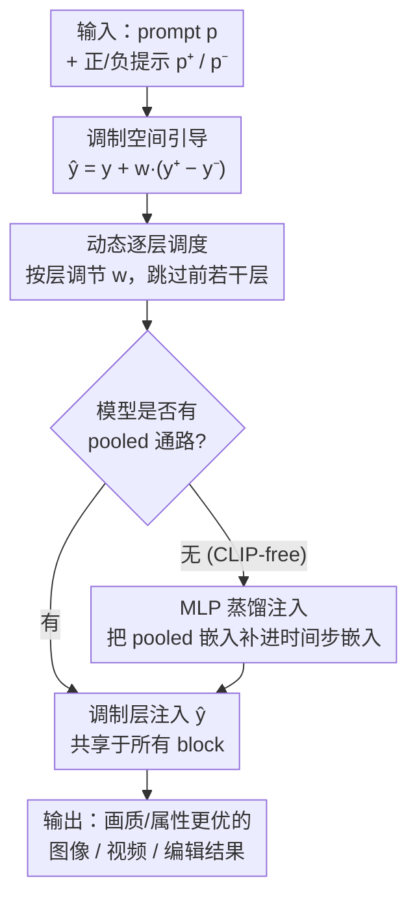

# Rethinking Global Text Conditioning in Diffusion Transformers

**会议**: ICLR 2026  
**OpenReview**: [https://openreview.net/forum?id=65Ai8mLfjI](https://openreview.net/forum?id=65Ai8mLfjI)  
**代码**: https://github.com/quickjkee/modulation-guidance  
**领域**: 扩散模型 / 图像生成  
**关键词**: 扩散 Transformer, 全局文本条件, pooled embedding, 调制引导, 训练无关

## 一句话总结
本文系统分析了扩散 Transformer 里「pooled 文本嵌入经调制层注入」这条全局条件通路，发现它在常规用法下几乎不起作用，但把它从「条件」改用作「引导方向」后，能以训练无关、几乎零开销的方式显著提升文生图/视频和图像编辑的画质与可控性。

## 研究背景与动机
**领域现状**：现代扩散 Transformer（DiT）通常用两条通路注入文本：一是把 T5 的逐 token 文本嵌入和图像 token 拼接后过 attention（cross-attention）；二是把 CLIP 的 pooled（池化）文本嵌入和时间步 $t$ 一起送进一个 MLP，得到一个在所有 block 间共享的全局条件向量 $y$，再用它去调制（modulation）每个 block 的特征——即 $\mathrm{Mod}(s,y)=\alpha_s(y)\cdot s+\beta_s(y)$，做缩放和平移。

**现有痛点**：最近一批模型（Wan、COSMOS 等）干脆丢掉了这条「全局/pooled 条件」通路，只靠 attention 也能达到相当的文本对齐效果。这就引出一个没被认真回答过的问题：调制式的全局文本条件到底还有没有必要？作者先做了一组直接的剥离实验：在 FLUX schnell 和 HiDream-Fast 上把 pooled CLIP 嵌入置零。结果显示——FLUX schnell 上 pooled 嵌入对**长 prompt** 几乎没影响（去掉后图像与原图几乎无差别，DreamSim 随 token 数增加趋近于 0），只对短 prompt 还有点用；HiDream-Fast 上则**完全无效**；甚至把 CLIP 重新塞回本来没有它的 COSMOS，也观察不到任何收益。

**核心矛盾**：现象层面看，pooled 嵌入在「作为条件输入」时确实信息量很低，attention 已经足够忠实地传播 prompt 信息——这支持「丢掉它」的潮流。但作者认为这个结论下得太早：问题不在于 pooled 嵌入本身没用，而在于**用错了角度**。

**切入角度**：作者从调制机制的可解释性（GAN/StyleGAN 里调制空间能驱动语义变化）和 CLIP 的图文共享几何出发，提出一个假设：模型内部其实**已经埋着**可解释的语义方向，只要在调制空间里做平移就能访问到它们。于是 pooled 嵌入不该被当成「条件」，而该被当成一个「校正器」，把扩散轨迹推向画质更好、属性更理想的模态。

**核心 idea**：用「调制空间里的引导（modulation guidance）」代替「调制式条件」——通过正/负提示在 pooled 嵌入上做外推，训练无关地激活并放大全局条件的作用，从而提升生成质量。

## 方法详解

### 整体框架
方法的目标是：在不重新训练主干、几乎不增加推理开销的前提下，把原本「半失活」的 pooled 文本嵌入变成一个可控的质量/属性调节旋钮。整条流水线接收原始 prompt $p$ 以及一对描述「想要 vs 不想要」属性的正/负提示 $p^+,p^-$，先在调制空间里把全局向量 $y$ 沿语义方向外推得到 $\hat y$，再用一个逐层的动态调度决定每层施加多大引导，最后送入调制层生成。对于本来就没有 pooled 通路的 CLIP-free 模型，则先用一个小 MLP + 蒸馏把 pooled 嵌入「补」进去，再走同样的引导流程。

### 关键设计

**1. 调制空间引导：把 pooled 嵌入从「条件」改造成「引导方向」**

这一步直接回应「pooled 嵌入半失活」的痛点。作者不再把 $y(p,t)$ 当成被动条件，而是借鉴 CFG（classifier-free guidance）的外推思路，在调制空间里构造一个引导向量：给定原 prompt 以及一对正/负提示 $p^+,p^-$，把全局条件向量改写为

$$\hat y(p,p^+,p^-,t)=y(p,t)+w\cdot\big(y(p^+,t)-y(p^-,t)\big).$$

其中 $y(p^+,t)-y(p^-,t)$ 是 pooled 嵌入空间里「想要属性减去不想要属性」的语义方向，$w$ 是引导强度。由于 $\hat y$ 只改动调制系数、且在所有 DM block 间共享，它相对一次普通生成的额外开销可以忽略不计。关键优势有三：一是**训练无关**，只需为每个目标属性（美学、复杂度、手部、计数、颜色、位置等）挑一组合适的正/负提示即可，无需任何微调或 LoRA；二是它和 CFG **正交**，既能叠在用 CFG 的模型上，也能用在不依赖 CFG 的少步蒸馏模型上；三是注意力可视化显示，施加引导后模型会把注意力更明显地集中到目标 token（如 hands 及相关词）上，说明它确实在「激活」而非「覆盖」原有语义。

**2. 动态逐层调制引导：避免强引导压过文本对齐**

恒定的引导强度 $w$ 有个副作用：$w$ 太大会过度放大全局方向，反而让模型忽略 prompt 的语义信息，损害文本对齐。和动态 CFG「沿时间步调 $w$」不同，作者发现更有效的是**沿网络层**调 $w$。他们采用最简单的变体——一个由层索引 $i$ 控制的阶跃函数，**跳过模型最前面的若干层**不施加引导，只在后续层生效。在 MJHQ 的 1K prompt 上对比，动态版本相比恒定引导在「美学质量（PickScore）↔ 文本相关性（CLIP score）」的权衡曲线上明显更优：能在不牺牲、甚至略升文本相关性的情况下提升美学质量。更重要的是，这套动态策略跨任务泛化良好，换新任务时基本无需重新调参。

**3. 向 CLIP-free 模型注入 pooled 嵌入：让没有全局通路的模型也能被引导**

对 COSMOS、Wan 这类一开始就没有 pooled 通路的模型，前两个设计无从施加，因为它们的 $y$ 只由时间步 $t$ 产生。作者用一个轻量改造把 pooled 嵌入「补」回去：训练一个小 MLP 接在 pooled 文本嵌入上，把它的输出加到时间步嵌入里，**其余网络全部冻结**；并刻意让「pooled 嵌入置 0 时模型行为与原始完全一致」，保证不破坏既有能力。训练上有两个要点：其一，前向时**只让文本经 pooled 嵌入这条路走**（T5 用无条件 prompt），逼迫模型从 pooled 嵌入里感知文本；其二，采用**蒸馏式目标**——采一张干净图、加噪后分别用原模型（无 pooled）和改造模型（有 pooled）各预测一次，最小化两者的 MSE。这种蒸馏对少步扩散模型尤其合适，省掉了对抗或分布匹配等复杂损失，而且用模型自己的合成数据训练，确保提升来自机制本身而非数据分布差异。完成注入后，这类模型就能和原生带 pooled 通路的模型一样享受调制引导。

### 损失函数 / 训练策略
绝大部分能力是训练无关的（设计 1、2 在推理时即插即用）。仅设计 3 的 CLIP-free 注入需要训练：冻结主干、只训小 MLP，目标为原模型与改造模型预测之间的 MSE 蒸馏损失，训练数据为模型自产的合成样本（如 COSMOS 微调 4K 步、50 万自产样本）。

## 实验关键数据

### 主实验
在带调制通路的 SOTA 文生图模型（FLUX schnell、FLUX dev、SD3.5 Large、HiDream）和 CLIP-free 的 COSMOS 上验证，评测含人类双盲对比（SbS 胜率，相对原模型）和自动指标（COCO 5K 上的 PickScore/CLIP/ImageReward/HPSv3、GenEval、VBench）。

| 任务 / 指标 | 设置 | 原模型 | 本文调制引导 | 提升 |
|------|------|------|----------|------|
| 美学（FLUX schnell, SbS 胜率） | Aesthetics | — | 72% | 显著优于原模型 |
| 复杂度（FLUX schnell, SbS） | Complexity | — | 69% | 显著提升 |
| 物体计数（FLUX schnell, GenEval） | Counting | 56 | 65 | +9 |
| 颜色（GenEval） | Color | 79 | 86 | +7 |
| 位置（GenEval） | Position | 25 | 30 | +5 |
| 物体计数（SbS 胜率） | — | — | 61% | +22% |
| 手部矫正（SbS 胜率） | — | — | 59% | +18% |

对比基线方面：相比 Normalized Attention Guidance 美学引导胜率高 34%，相比 Concept Sliders 手部矫正高 16%，且无额外计算开销；还可与 LLM 增强 prompt 叠加进一步提升。视频侧（VBench）在 Hunyuan-13B、CausVid-1.3B 上「动态程度（dynamic degree）」和「美学质量」均优于原模型与注意力引导基线。

### 消融实验

| 配置 | 关键现象 | 说明 |
|------|---------|------|
| 去掉 pooled / 长 prompt（FLUX schnell） | CLIP Score −0.3、IR +0.1 | 长 prompt 下 pooled 嵌入近乎失活 |
| 去掉 pooled（HiDream-Fast） | 各指标 ≈ 0 变化 | pooled 嵌入完全无效 |
| COSMOS 仅 +CLIP（无引导） | 复杂度反而下降 | 单纯加回 pooled 没用 |
| COSMOS +CLIP+ 调制引导 | 美学/复杂度提升 | 收益来自「引导」而非「条件」 |
| 恒定 vs 动态引导 | 动态版权衡曲线更优 | 跳过前若干层避免压过文本对齐 |

### 关键发现
- pooled 文本嵌入「作为条件」贡献极小（长 prompt、HiDream-Fast、COSMOS 上几乎为零），但「作为引导方向」能带来显著且统计显著的画质/可控性提升——同一个组件，换角度用价值完全不同。
- COSMOS 的对照最有说服力：单加 CLIP 通路没用甚至掉点，只有叠上调制引导才提升，直接证明收益来自引导机制本身。
- 美学引导会「溢出」到复杂度（同时提升两者），而复杂度引导主要只提升复杂度，说明不同语义方向在调制空间里的耦合程度不同。

## 亮点与洞察
- **重新诠释而非新增模块**：把一个被业界判「无用、正在被丢弃」的组件，通过「条件 → 引导」的视角转换重新激活，几乎零成本拿到收益——这种「换用法」的思路很值得迁移。
- **训练无关 + 与 CFG 正交**：只挑正/负提示即可，对少步蒸馏模型也适用，工程上非常友好，落地门槛极低。
- **逐层而非逐时间步的动态调度**：与主流动态 CFG 的「沿时间」直觉相反，作者发现「沿层」调、且跳过浅层更有效，提示调制引导的作用主要发生在深层语义阶段。
- **CLIP-free 模型也能补回引导能力**：用「pooled=0 即退化为原模型」的冻结式蒸馏注入，是个安全且可复用的改造范式。

## 局限与展望
- 作者承认：方法**不改善文本-图像对齐**（不提升语义忠实度），它本质是增强美学、复杂度等视觉属性，而非纠正「画错了内容」。
- 引入了少量需要调的超参（引导强度 $w$、跳过的层数、正/负提示选择），虽然调起来不难，但相比无需配置的基线多了一步。
- 自己观察：正/负提示需人工挑选，跨模型/任务的最优提示是否能自动化（如让 LLM 生成）值得探索；不同语义方向在调制空间的耦合（美学溢出到复杂度）也提示「方向间干扰」尚未被系统刻画。

## 相关工作与启发
- **vs CFG 及其变体**: CFG 在「条件 vs 无条件」分支间外推；本文在「正提示 vs 负提示」的 pooled 调制向量间外推，二者正交可叠加，且本文还能用于不依赖 CFG 的少步模型。
- **vs 注意力引导（Normalized Attention Guidance 等）**: 它们在注意力空间用正/负 prompt 做外推；本文改在调制（feature）空间、经一个小 MLP/共享向量施加，开销更小，美学引导对比胜率高 34%。
- **vs 测试时优化（Concept Sliders 等）**: 后者靠手工 loss 或 LoRA 微调提取概念方向；本文训练无关、无需 loss 设计，在手部矫正上仍高 16%。

## 评分
- 新颖性: ⭐⭐⭐⭐⭐ 「把要被丢弃的全局条件改作引导方向」是个反直觉且自洽的重新诠释
- 实验充分度: ⭐⭐⭐⭐ 覆盖多模型、文生图/视频/编辑多任务，含人类评测与多自动指标，但部分对比放在附录
- 写作质量: ⭐⭐⭐⭐ 分析—方法—验证逻辑清晰，先证「无用」再翻案，叙事有说服力
- 价值: ⭐⭐⭐⭐⭐ 训练无关、近零开销、可即插即用于 SOTA 模型，实用性强

<!-- RELATED:START -->

## 相关论文

- [\[ICLR 2026\] Scaling Laws for Diffusion Transformers](scaling_laws_for_diffusion_transformers.md)
- [\[ICLR 2026\] What Matters for Representation Alignment: Global Information or Spatial Structure?](what_matters_for_representation_alignment_global_information_or_spatial_structur.md)
- [\[ICLR 2026\] Guidance Matters: Rethinking the Evaluation Pitfall for Text-to-Image Generation](guidance_matters_rethinking_the_evaluation_pitfall_for_text-to-image_generation.md)
- [\[ICLR 2026\] A Hidden Semantic Bottleneck in Conditional Embeddings of Diffusion Transformers](a_hidden_semantic_bottleneck_in_conditional_embeddings_of_diffusion_transformers.md)
- [\[ICLR 2026\] Massive Activations are the Key to Local Detail Synthesis in Diffusion Transformers](massive_activations_are_the_key_to_local_detail_synthesis_in_diffusion_transform.md)

<!-- RELATED:END -->
