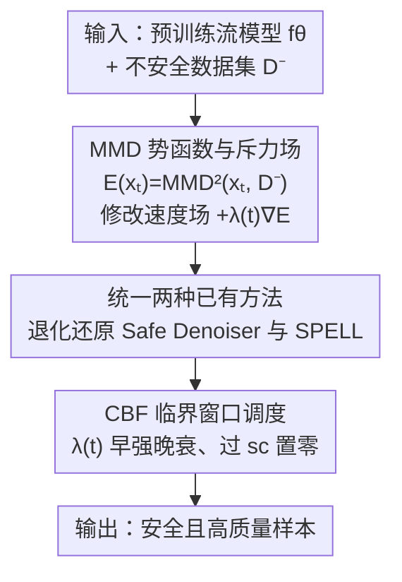

# Safety-Guided Flow (SGF): A Unified Framework for Negative Guidance in Safe Generation

**会议**: ICLR 2026  
**OpenReview**: [https://openreview.net/forum?id=EA80Zib9UI](https://openreview.net/forum?id=EA80Zib9UI)  
**代码**: 无  
**领域**: 扩散模型 / 安全生成  
**关键词**: 负向引导, MMD 势函数, 控制屏障函数, 临界时间窗口, 流匹配

## 一句话总结
本文用一个基于最大均值差异（MMD）势函数的能量框架统一了两种"负向引导"安全生成方法（Shielded Diffusion 与 Safe Denoiser），并借助控制屏障函数（CBF）理论从数学上证明了：负向引导只需在去噪早期的"临界时间窗口"内施加、之后衰减到零，就能在保证安全的同时维持图像质量。

## 研究背景与动机
**领域现状**：让扩散/流匹配模型"安全生成"（不生成裸露、不复现训练数据、保持多样性）目前有两条几乎不交流的技术路线。一条来自机器人规划，用控制屏障函数（CBF）在每一步去噪时把轨迹投影到安全集之外，几何约束清晰但每一步都强制施加。另一条是图像生成里的免训练"负向引导"，代表是 Shielded Diffusion（SPELL）用稀疏径向斥力把预测的干净样本推离"受保护集"，以及 Safe Denoiser 把去噪器拆成安全/不安全两部分、减掉不安全分量。

**现有痛点**：这两条路线各有问题。CBF 类方法在低维机器人状态上有效，但它不是从生成的概率视角推导出来的，无法刻画"安全是分布的语义属性"这件事；而且它在所有时间步都强制施加引导，从不分析引导到底什么时候才真正必要。负向引导类方法虽然免训练、好用，但它们对"半径多大、斥力多强、引导应该作用在哪个时间段"全靠启发式经验调度——SPELL 的半径 $r$ 要手调，Safe Denoiser 干脆硬编码只在 DDPM 索引 780:1000（即 $t\in[0.78,1]$）施加引导，却没有一个正式的 reach–avoid 分析说明为什么是这个区间。

**核心矛盾**：负向引导越强、越全程，安全性看似越高，但图像质量（FID、precision）会被严重破坏——"全程开启的强势函数"会把附近正常的模式也一起扭曲掉。安全与质量之间存在 trade-off，而现有方法既不知道"何时该强"，也没有理论保证"何时可以关"。

**本文目标**：分解为两个子问题——（1）能不能用一个统一的概率框架把 SPELL 和 Safe Denoiser 都收编为同一种负向引导的特例？（2）能不能从理论上证明"负向引导应该早强晚弱"，给出临界窗口的数学依据？

**切入角度**：作者注意到，负向引导本质上是"把当前样本推离一个不安全分布"，这正好是一个**分布间距离的梯度**问题。于是用积分概率度量里的 MMD 作为势函数——当前样本（看作 Dirac delta）与不安全数据集之间的 MMD 越小（越靠近），势越低，沿势的梯度上升方向就天然产生一个斥力场。

**核心 idea**：用 MMD 势函数的梯度作为统一的负向引导力场，把它加到流匹配的速度场上；再用 CBF 理论证明这个引导只需在早期临界窗口内强力施加、之后衰减，即可保证安全又不牺牲质量。

## 方法详解

### 整体框架
SGF 要解决的问题是：在不重新训练生成模型的前提下，修改流匹配的速度场，让生成轨迹主动远离一组"负样本"（不安全数据 $D^-$），同时只在该出手时出手。整条 pipeline 是这样转的：给定预训练流模型的速度场 $f_\theta(x_t,t)$ 和不安全数据集 $D^-$，在每个采样步上额外加一个由 MMD 势函数 $E(x_t)$ 梯度给出的斥力 $\lambda(t)\nabla_x E(x_t)$；这个统一力场在数学上可以退化还原成 Safe Denoiser（核加权斥力）和 Shielded Diffusion（径向斥力）；而引导强度的时间调度 $\lambda(t)$ 不再靠拍脑袋，而是由 CBF 理论给出的"临界窗口 $[0,s_c]$ 内强、之后置零"来决定。

### 关键设计

**1. MMD 势函数与斥力场：把"远离不安全集"写成一个可微的能量梯度**

现有负向引导各自定义了一套启发式的"推力"公式，缺乏统一的理论根。本文的做法是退回到分布距离的源头：用 RBF 核 $k_\sigma(x,y)=\exp(-\|x-y\|^2/(2\sigma^2))$ 定义当前样本 $\{x_t\}$ 与不安全集 $D^-$ 之间的（有偏）平方 MMD 估计作为势函数

$$E(x_t)\equiv \widehat{\mathrm{MMD}}^2_{k_\sigma}(\{x_t\}, D^-)=k(x_t,x_t)+\tfrac{1}{N^2}\sum_{i,j}k(y_i,y_j)-\tfrac{2}{N}\sum_i k(x_t,y_i).$$

然后把流匹配的速度场改成 $\dot{x}_t=f_\theta(x_t,t)+\lambda(t)\nabla_x E(x_t)$，其中 $\lambda(t)\ge 0$ 是引导调度。由于 $x_t$ 越远离 $D^-$，$E$ 越大，沿 $+\nabla E$ 方向就是一个斥力。把梯度展开得到

$$\nabla_{x_t}\widehat{\mathrm{MMD}}^2_{k_\sigma}(x_t,D^-)=\frac{2}{\sigma^2}Z(x_t)\Big[x_t-\sum_{i=1}^N w_i(x_t)\,y_i\Big],$$

其中 $Z(x_t)=\tfrac{1}{N}\sum_i k(x_t,y_i)$，权重 $w_i(x_t)=k(x_t,y_i)/(N Z(x_t))$。这个形式很有解释力：权重 $w_i$ 正比于核相似度 $k(x_t,y_i)$，越像哪个负样本 $y_i$，就被它推得越狠，于是 $x_t$ 被赶离它最近的不安全邻居。这和 Stein 变分梯度下降里用核距离防止粒子塌缩到同一模式是同源的思想，只不过这里是用来"避开"不安全模式。

**2. 统一两种已有方法：Safe Denoiser 与 Shielded Diffusion 都是 MMD 梯度的特例**

本文的统一性主张需要被证明，否则只是又一个新方法。作者给了两个命题。其一（命题 1，还原 Safe Denoiser）：把 MMD 梯度场 $u_t(x)=\lambda(t)\nabla_x\mathrm{MMD}^2_k(x,D^-)$ 在预测的干净样本 $z_t\equiv\mathbb{E}[x_0|x_t]$ 处求值、并取固定带宽 $\sigma_{\text{KDE}}$，得到的正好就是 Safe Denoiser 实现的那个核加权斥力场（相差一个正标量）——因为数据集自项是常数、剩下的项就是式 (7) 那个核加权的 $x-y_i$ 凸组合。其二（命题 2，半径–带宽匹配）：SPELL 用的是径向阈值斥力 $F_{\text{rad}}$，本文单个 $y$ 的高斯贡献是 $F_G(d;\sigma)=\lambda\frac{2\|d\|}{\sigma^2}\exp(-\frac{\|d\|^2}{2\sigma^2})\frac{d}{\|d\|}$；对任意 $d_0\in(0,r)$，总存在带宽 $\sigma$ 使两者在 $\|d\|=d_0$ 处大小相等，且当 $\alpha=\lambda=1$ 时解析解为 $\sigma=\frac{d_0}{\sqrt{2W_0((r-d_0)d_0/4)}}$（$W_0$ 是 Lambert W 主分支）。这两个命题让 SPELL 的"径向斥力"和 Safe Denoiser 的"核加权斥力"都成为 MMD 势梯度在不同求值点/带宽下的实例，从而把两条原本割裂的路线收进同一个能量框架。

**3. CBF 临界窗口调度：用控制屏障理论证明"越早施加越安全、过期就关掉"**

这是本文最核心的理论贡献——回答"引导该在什么时候强"。作者切换到前向时间 $s\in[0,1]$，把动力学写成 $\frac{dx}{ds}=\tilde f(s,x)+\beta(s)\nabla_x E(x)$，并假设存在 $C^1$ 的控制屏障函数 $h$ 定义安全集 $S=\{h\ge0\}$、不安全集 $U=\{h<0\}$。在"边界层"$|h(x)|\le\delta$ 内做两条假设：（a）对齐性 $\nabla h\cdot\nabla E\ge\mu>0$（斥力确实朝把样本拉出不安全区的方向）；（b）基础漂移有界 $|\nabla h\cdot\tilde f|\le L(s)|h(x)|$（这一条在生成模型里合理，因为只有去噪到接近终点、噪声很少时轨迹才会触到不安全区，而此时 $\tilde f$ 已经很弱）。在此之上的定理 2 给出充分条件：若 $e^{\int_0^{s_c}L}h(x_0)+\mu\bar I_L(s_c)\ge\delta$，则 $h(x_{s_c})\ge\delta$（在 $s_c$ 时刻达到 $\delta$ 安全裕度），其中 $\bar I_L(s_c)=\int_0^{s_c}\bar w_L(u)\beta(u)\,du$、权重 $\bar w_L(u)=\exp(\int_u^{s_c}L(\tau)d\tau)$ 随 $u$ 增大而递减。

这个递减权重正是"早强晚弱"的来源：在固定引导预算 $\int_0^{s_c}\beta$ 的前提下，把强度从较晚的时刻 $u_2$ 挪到较早的 $u_1<u_2$，会严格增大式 (10) 的下界——一句话，**对安全引导而言越早越好**。更进一步，若在 $[s_c,1]$ 上无引导流 $\tilde f$ 已经对安全集前向不变（生成接近终点时去噪只做细粒度精修、已在安全区就会留在安全区），那么在 $[s_c,1]$ 上令 $\beta\equiv0$ 既不损失安全、又改善保真度。这就从理论上替代了 Safe Denoiser 那个硬编码的 $[0.78,1]$ 经验区间。

### 损失函数 / 训练策略
SGF 是**完全免训练**的即插即用引导，不引入任何新的训练目标。它只在采样阶段把斥力项加到预训练模型的速度场/数据预测上；可调的只有核带宽 $\sigma$、引导强度 $\lambda$ 和时间窗口（early-stop 区间），不修改原模型权重。负样本 $D^-$ 直接取自不安全图像集合（如从 I2P 中筛选裸露概率 >0.6 的 515 张图）。

## 实验关键数据

### 主实验
在裸露提示词安全生成上（对抗提示来自 Ring-A-Bell / UnlearnDiff / MMA-Diffusion，用 NudeNet 评 ASR 攻击成功率和 TR 毒性率，COCO-30K 上评 FID/CLIP 保真度），把本文引导替换掉 Safe Denoiser 后，安全性一致提升而质量几乎不变：

| 方法 | Ring-A-Bell ASR↓ | UnlearnDiff ASR↓ | MMA ASR↓ | COCO FID↓ | CLIP↑ |
|--------|------|------|------|------|------|
| SD-v1.4（原始） | 0.797 | 0.809 | 0.962 | 25.04 | 31.38 |
| SAFREE | 0.278 | 0.353 | 0.601 | 25.29 | 30.98 |
| SAFREE + SafeDenoiser | 0.127 | 0.207 | 0.469 | 22.55 | 30.66 |
| **SAFREE + Ours** | **0.051** | **0.164** | **0.423** | 23.73 | 30.36 |

在 SAFREE 基座上，三组对抗集的 ASR 相对 Safe Denoiser 分别再降 59.8% / 20.8% / 9.8%，而 COCO-30K 上 FID 仅变化 ~1.2、CLIP 仅变 ~0.3，说明安全性大涨而良性提示的画质基本不损。

### 消融实验
多样性任务（ImageNet "class-to-image"，$\lambda=1.0$）上对比全程引导 vs 早停 $[1.0,0.78]$：

| 配置 | FID↓ | CLIP↑ | Precision↑ | 说明 |
|------|------|------|------|------|
| SPELL 全程 | 51.76 | 28.14 | 0.530 | 全程强引导，画质崩坏 |
| SPELL 早停 | 48.50 | 28.17 | 0.521 | 早停略好但仍差 |
| Ours 全程 | 36.81 | 30.47 | 0.811 | 比 SPELL 好很多 |
| **Ours 早停** | **31.81** | **30.78** | **0.836** | 早停后 FID 再降 5 点 |

记忆化缓解（ImageNette 微调过的 Mem'SDv2.1，@Sim 95% 越低越不复现训练图）：

| 配置 | @Sim 95%↓ | FID↓ | CLIP↑ |
|------|------|------|------|
| Mem'SDv2.1 | 0.437 | 41.19 | 31.78 |
| + Ours 全程 | 0.317 | 43.07 | 31.35 |
| + Ours 早停 | 0.328 | **32.44** | 30.93 |

### 关键发现
- **早停是质量的关键开关**：无论裸露抑制、多样性还是记忆化，全程引导都会把 FID 抬高（如多样性任务 SPELL 全程 FID 51.76），而早停到 $t=0.78$ 既几乎不损安全/抗记忆能力，又把 FID 拉回到接近原模型——直接验证了"临界窗口"理论。
- **时间窗口消融印证"越早越好"**：在等 $\lambda$、等 $\int\lambda$、平移窗口三种设置下扫描时间窗，越靠早期（如 $[1.0,0.8]$）的引导对降低 ASR 越有效，把窗口整体后移则安全性显著下降。
- **MMD 引导比 SPELL 的径向斥力更温和**：同样早停下，Ours 的 precision（0.836）远高于 SPELL（0.521），说明核加权斥力对正常模式的扭曲更小。

## 亮点与洞察
- **把启发式负向引导收进一个可证明的能量框架**：用 MMD 势函数当统一的"距离势"，让原本两套互不相干的公式（径向斥力、核加权斥力）都成为它的梯度特例，理论上的优雅在于一个 RBF 核 + 不同求值点就能还原两种方法。
- **临界窗口从"经验硬编码"升级为"CBF 定理"**：Safe Denoiser 只能说"我们观察到早期重要所以取 $[0.78,1]$"，本文用控制屏障函数的递减权重严格证明了"固定预算下强度越早越安全、过期关掉不损安全反增质量"，这是把机器人规划的 CBF 工具迁移到生成安全的漂亮一笔。
- **可迁移的设计**：用 MMD/核势函数的梯度做"分布级斥力"这个套路，可推广到任何"要把生成样本推离某个集合"的任务（去偏、去记忆、风格规避），且天然带"早强晚弱"的调度先验。

## 局限与展望
- **理论假设较强**：CBF 分析依赖"边界层内基础漂移 $\tilde f$ 影响很小"这条假设，作者自己也承认它强；虽然在生成接近终点时合理，但在中间时段未必严格成立。
- **依赖一个有代表性的负样本集 $D^-$**：方法本质是"推离给定的不安全数据点"，若 $D^-$ 覆盖不全或带偏，斥力方向也会偏；实验里 $D^-$ 是人工筛选的（如 515 张裸露图）。
- **超参仍需调**：核带宽 $\sigma$、强度 $\lambda$、early-stop 截止时间虽有理论指导方向，但具体数值仍要按任务调；理论给的是"早比晚好"的定性结论，不是 $s_c$ 的闭式取值。
- **全为文生图验证**：所有实验都在 text-to-image，机器人规划那条线（CBF 的原产地）反而没有实测，统一框架在轨迹规划上的实际效果留待验证。

## 相关工作与启发
- **vs Shielded Diffusion (SPELL)**：SPELL 用半径阈值的径向斥力，半径 $r$ 和作用时间段全靠手调；本文证明它是 MMD 梯度在半径–带宽匹配下的特例，并补上了它缺失的临界窗口理论分析，实验上 precision 明显更高。
- **vs Safe Denoiser**：Safe Denoiser 把去噪器拆成安全/不安全分量、用权重 $\beta^*$ 减掉不安全部分，但只在硬编码的 $[0.78,1]$ 施加；本文证明其斥力场是 MMD 梯度在 $z_t$ 处求值的特例，并用 CBF 定理替换了那个经验区间，安全性进一步提升。
- **vs SafeDiffuser / Safe Flow Matching（CBF 机器人规划）**：它们把 CBF 不变性约束嵌进去噪、在所有时间步强制施加，缺乏数据的概率视角且不分析时间临界性；本文反过来用 CBF 理论来**论证"何时该施加"**，并把引导建立在概率分布距离（MMD）上。

## 评分
- 新颖性: ⭐⭐⭐⭐⭐ 用 MMD 势函数统一两条负向引导路线、再用 CBF 定理证明临界窗口，角度新且漂亮。
- 实验充分度: ⭐⭐⭐⭐ 裸露/多样性/记忆化三类场景 + 时间窗消融较完整，但只覆盖文生图、未验证机器人规划。
- 写作质量: ⭐⭐⭐⭐ 理论推导清晰、统一性命题表述到位，部分 CBF 假设的直觉解释略偏简。
- 价值: ⭐⭐⭐⭐ 给免训练安全生成提供了统一理论根和可证明的调度准则，即插即用实用性强。

<!-- RELATED:START -->

## 相关论文

- [\[ICLR 2026\] VSF: Simple, Efficient, and Effective Negative Guidance in Few-Step Image Generation Models By Value Sign Flip](vsf_simple_efficient_and_effective_negative_guidance_in_few-step_image_generatio.md)
- [\[ICLR 2026\] VLM-Guided Adaptive Negative Prompting for Creative Generation](vlm-guided_adaptive_negative_prompting_for_creative_generation.md)
- [\[ICLR 2026\] PosterCraft: Rethinking High-Quality Aesthetic Poster Generation in a Unified Framework](postercraft_rethinking_high-quality_aesthetic_poster_generation_in_a_unified_fra.md)
- [\[ICLR 2026\] SafeFlowMatcher: Safe and Fast Planning using Flow Matching with Control Barrier Functions](safeflowmatcher_safe_and_fast_planning_using_flow_matching_with_control_barrier_.md)
- [\[ICLR 2026\] UniCalli: A Unified Diffusion Framework for Column-Level Generation and Recognition of Chinese Calligraphy](unicalli_a_unified_diffusion_framework_for_column-level_generation_and_recogniti.md)

<!-- RELATED:END -->
