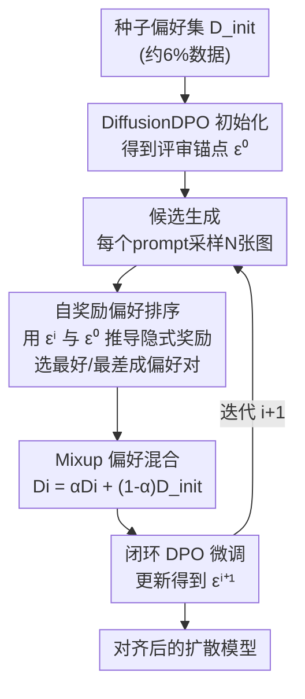

# SAIL: Self-Amplified Iterative Learning for Diffusion Model Alignment with Minimal Human Feedback

**会议**: ICLR 2026  
**OpenReview**: [https://openreview.net/forum?id=wKdg1DDOrW](https://openreview.net/forum?id=wKdg1DDOrW)  
**代码**: 无  
**领域**: 扩散模型 / 对齐RLHF  
**关键词**: 扩散模型对齐, 自奖励, 迭代自举, DPO, 偏好混合

## 一句话总结
SAIL 让扩散模型充当自己的"老师"：从极少量人工标注的偏好种子出发，模型自己生成样本、用从扩散损失推导出的隐式奖励给样本排序、再用这些自标注数据闭环微调自己，仅用约 6% 的偏好数据就在 HPSv2、Pick-a-Pic、PartiPrompts 上超过 DiffusionDPO。

## 研究背景与动机

**领域现状**：把文本到图像扩散模型对齐到人类偏好，主流走两条路。一条是 DiffusionDPO 这类离线 DPO，直接在大规模人工标注的偏好对（往往上百万对）上优化；另一条是用外部奖励模型（美学打分器、CLIP 相似度等）做在线优化（DDPO、ReFL）。

**现有痛点**：离线 DPO 需要海量人工标注，昂贵且难以随偏好演化而更新；外部奖励模型则会引入二次偏置、容易被 reward hacking，且在分布外样本上泛化差。DDPO 甚至要同时训练四个奖励模型（美学/可压缩性/不可压缩性/图文对齐）才能较全面地刻画偏好，而单一奖励模型往往只优化某一维度（如美学过拟合导致颜色过饱和）。

**核心矛盾**：两条路都创造了对"外部供给"的硬依赖——要么依赖穷尽式人工标注，要么依赖未必泛化的辅助模型。问题的根本在于：大家默认扩散模型是被动学习者，必须靠外部监督才能进步。

**本文目标**：能不能只用极少量人工反馈、不借助任何外部奖励模型，把对齐能力从扩散模型自身"解锁"出来？

**切入角度**：作者观察到，扩散模型一旦见过哪怕很小一批人类偏好，就同时具备生成能力与判别能力——它可以既当生成器又当评审。关键是要把"相对奖励"从扩散模型自身的去噪损失里数学化地推导出来。

**核心 idea**：构建一个隐式自奖励的闭环 DPO 框架——模型生成候选、用自身推导的奖励排序成偏好对、再用混入人类种子的数据迭代微调自己，让人类先验在自举中被不断放大。

## 方法详解

### 整体框架

SAIL 从一个种子偏好集 $D_{init}=\{(x_w,x_l,y)_n\}_{n=1}^N$ 和一个预训练扩散模型（SD1.5 或 SDXL）出发。第 0 步先用 DiffusionDPO 在种子集上微调，得到具备初步人类偏好的"评审锚点" $\epsilon^0_\theta$。之后进入闭环：每一轮 $i$ 用上一轮模型对一批新 prompt 采样若干候选图，用从扩散损失推导出的隐式奖励给候选排序、挑出最好/最差构成偏好对，把这些自生成数据与人类种子按比例混合，再做一轮 DPO 微调得到 $\epsilon^{i+1}_\theta$。整个过程不需要任何外部奖励模型，只靠最初那点人类种子做"指南针"。

### 关键设计

**1. 自奖励偏好排序：让扩散模型从自身去噪损失里读出"相对奖励"**

外部奖励模型贵且不泛化，作者要让模型自己评分。出发点是 DPO 把奖励重参数化为策略与参考策略的对数比：$r(y,x)=\beta\log\frac{p_\theta(x_0|y,t,q_t(x_0))}{p_{ref}(x_0|y,t,q_t(x_0))}+\beta\log Z(y,t,q_t(x_0))$。其中 $q_t(x_0)=\sqrt{\alpha_t}x_0+\sqrt{1-\alpha_t}\epsilon$ 是加噪后的样本。利用扩散模型 $p_\theta(x_0|\cdot)\approx \exp(-\frac{\delta^2_t+1}{2\delta^2_t}\|\epsilon-\epsilon_\theta\|^2)$ 这一近似，归一化项 $Z$ 对固定 prompt 相同可消掉，于是单图奖励可写成噪声预测残差之差：

$$r(y,x_A)\approx-\frac{\beta}{2}\big(\|\epsilon_A-\epsilon_\theta(x^A_t,y,t)\|^2_2-\|\epsilon_A-\epsilon_{ref}(x^A_t,y,t)\|^2_2\big)$$

直观说就是：当前模型 $\epsilon_\theta$ 比参考模型 $\epsilon_{ref}$ 在这张图上去噪误差更小，说明它更"偏好"这张图，奖励更高。把两张候选图代入 sigmoid 即得相对偏好概率 $p_\theta(x_A>x_B|y)$（Eq. 9），再据 $p>0.5$ 给出 $(x_w,x_l)$ 标签。为降低噪声，作者对 $(t,q_t(x_0))$ 随机采样 10 次取平均。这套推导让扩散模型在固定参考参数下同时扮演生成器和评审器，彻底省掉外部奖励网络。

**2. 闭环自举迭代：把人类先验在"生成—自标注—再训练"循环里放大**

有了自奖励，模型就能脱离静态数据集自我进步。每轮对新 prompt 集 $Y_i$（各轮 prompt 互不相交）采样 $N=8$ 张候选，用上一轮模型 $\epsilon^i_\theta$ 配合初始锚点 $\epsilon^0_\theta$ 计算相对奖励，**用 best-worst 选择**挑出最好和最差两张构成一对偏好数据 $D_i$。然后以 $\epsilon^i_\theta$ 同时作为初始策略和参考策略做 DPO 训练，得到 $\epsilon^{i+1}_\theta$。这种闭环把 $D_{init}$ 里蕴含的人类偏好先验，借助模型自身的生成与判别能力一轮轮传播、放大——本质是一种自举：种子越小，但循环让有效监督量不断增长。消融显示 best-worst 选对比随机选对更有效（ImageReward 0.1137 vs 0.1055），因为极端对的偏好信号更清晰。

**3. Mixup 排序偏好混合：用经验回放对抗分布坍缩与灾难性遗忘**

纯自训练有致命风险：模型会过拟合到自己生成的高置信样本，导致分布坍缩。作者借鉴强化学习里的经验回放，在每轮把自生成数据和人类种子按比例混合：$D_i=\alpha D_i+(1-\alpha)D_{init}$，实验取 $\alpha=0.25$（即 25% 自生成 + 75% 人类种子）。这样既允许模型探索偏好空间里更细微的模式，又始终被人类先验锚住。消融揭示了不混合的两个坏处：其一，**过拟合高置信对**——不同 seed 生成的图变得雷同、奖励分数虚高（甚至超 90%），多样性崩塌；其二，**灾难性遗忘**——缺了人类数据，模型判别能力逐轮退化，奖励模型精度下降，导致后续自标注的偏好对本身就不准，形成恶性循环。混合策略正是这条闭环能稳定跑多轮的关键。

### 损失函数 / 训练策略

训练目标沿用 DiffusionDPO 的 DPO 损失 $L_{DPO}=\mathbb{E}_{(y,x_w,x_l)}[-\log p_\theta(x_w>x_l|y)]$。基座为 SD1.5 与 SDXL；SD1.5 用 AdamW、SDXL 用 Adafactor 省显存，有效 batch size 128 对，$\beta=5000$。SD1.5 跑 3 轮、SDXL 跑 2 轮，每轮 prompt 量为 10K/20K/20K，候选数 $N=8$。采样上 SD1.5 用 50 步 DDPM、SDXL 用 20 步 DDIM，推理 CFG 分别为 7.5 与 5。共用约 50K 人类偏好数据（Pick-a-Pic v2），约为 DiffusionDPO 0.8M 的 6%。

## 实验关键数据

### 主实验

在 SD1.5 与 SDXL 上对比 DiffusionDPO、DiffusionSPO、MaPO。SAIL 仅用 0.05M 偏好数据（对手用 0.8M），随迭代稳定提升并反超：

| 模型 | 方法 | 数据量 | PickScore | ImageReward | Aesthetics | HPSv2 |
|------|------|--------|-----------|-------------|------------|-------|
| SD1.5 | 基座 | - | 20.62 | -0.0130 | 5.38 | 26.21 |
| SD1.5 | DiffusionDPO | 0.8M | 21.07 | 0.2056 | 5.48 | 26.57 |
| SD1.5 | **SAIL (Iter3)** | 0.05M | 21.00 | **0.2329** | 5.49 | 26.75 |
| SDXL | 基座 | - | 22.13 | 0.6891 | 6.04 | 26.80 |
| SDXL | DiffusionDPO | 0.8M | 22.59 | 0.9336 | 6.02 | 27.27 |
| SDXL | **SAIL (Iter2)** | 0.05M | 22.51 | **0.9844** | 6.16 | 27.32 |

相对基座，SDXL 上 SAIL 取得 PickScore +0.38、ImageReward +0.2953、Aesthetics +0.12、HPSv2 +0.52 的增益；在 HPSv2 四个风格子类（动画/概念艺术/绘画/照片）上分别 +0.71/+0.63/+0.56/+0.59。PartiPrompts（SD1.5）上也一致提升：PickScore +0.24、ImageReward +0.1895、HPSv2 +0.44。

### 消融实验

| 配置 | PickScore | ImageReward | HPSv2 | 说明 |
|------|-----------|-------------|-------|------|
| SAIL (Iter1) | 20.89 | 0.1137 | 26.49 | best-worst 选对 |
| 随机选对 | 20.44* | 0.1055 | 26.40 | best-worst 换成随机，全面掉点 |
| SAIL (Iter2) | 20.95 | 0.1729 | 26.65 | 含 mixup |
| Iter2 w/o mix | 20.86 | 0.1564 | 26.55 | 去掉混合，第二轮明显下滑 |

> *随机选对一行原文只给出 ImageReward 0.1055 / Aes 5.44 / HPSv2 26.40，PickScore 未列，此处标注以原文为准。

还和 Online DPO 对比：用美学单奖励的 OnlineDPO-Aes 在美学上略高（+0.07），但 ImageReward（0.0936 vs SAIL 0.1137）和 HPSv2（26.35 vs 26.49）都不如 SAIL，且易美学过拟合（过饱和）。此外把 SAIL 接到全量 DiffusionDPO 之上（SAIL\*）还能继续涨，ImageReward 冲到 0.4303，说明该框架对强基座仍有增益。

### 关键发现
- **Mixup 是闭环能跑多轮的命门**：去掉后第二轮就掉点，根因是高置信对过拟合（多样性崩、奖励虚高破 90%）+ 灾难性遗忘（判别力退化→自标注变脏）双重恶性循环。
- **数据效率惊人**：仅 6% 偏好数据即反超全量 DiffusionDPO，验证"扩散模型自身就藏着对齐能力"这一核心假设。
- **best-worst 选对 > 随机**：用奖励极端的两张构对，偏好信号最干净，全指标优于随机选。
- **自奖励 vs 单一外部奖励**：单美学奖励只把某一维度顶上去，SAIL 的隐式自奖励在人类偏好/美学/图文对齐三方面更均衡。

## 亮点与洞察
- **把奖励"长"在扩散损失里**：最巧的一步是把 DPO 的对数比奖励化简成噪声预测残差之差（Eq. 8），让模型零额外网络就能评分，这套推导可迁移到其他需要隐式奖励的扩散对齐场景。
- **自举 + 经验回放的组合拳**：自训练最怕坍缩，作者不是靠复杂正则，而是用一个简单的 0.25 混合比把人类种子当锚，既稳又省，思路朴素但抓住了要害。
- **"小种子放大"范式**：6% 数据反超全量，提示偏好对齐的瓶颈也许不在数据量，而在如何把已有先验充分激活——这对标注预算紧张的实际部署很有吸引力。

## 局限与展望
- 自奖励的质量上限受初始种子和基座判别力约束：种子太小或太偏，自标注会系统性偏差，闭环可能放大错误（作者也承认判别力退化会污染偏好对）。
- 迭代轮数有限（SD1.5 仅 3 轮、SDXL 2 轮），SD1.5 在 Iter4 上 ImageReward 已从 0.3198 回落到 0.3072，长程稳定性与收益饱和点尚不清楚。
- 混合比 $\alpha=0.25$ 为经验值，未给出跨数据集/基座的敏感性分析；不同任务下探索-保守的最佳平衡可能不同。
- 仅验证了 SD1.5/SDXL 与美学/图文对齐类指标，对更复杂的语义对齐、安全性对齐是否同样有效未知。

## 相关工作与启发
- **vs DiffusionDPO**：DiffusionDPO 在静态大规模人类偏好上离线优化，SAIL 把它当 Iter0 初始化，再用自奖励闭环继续放大，用 6% 数据反超——核心区别是把"被动学习者"变成"自我教师"。
- **vs DDPO / OnlineDPO（外部奖励）**：它们靠外部奖励模型（DDPO 甚至要四个）做在线优化，易 reward hacking 且单维过拟合；SAIL 用从自身推导的隐式奖励，免外部模型、指标更均衡。
- **vs DiffusionSPO / MaPO**：SPO 做 step-wise 优化并训练步级奖励模型，MaPO 联合最大化偏好边际；SAIL 不引入任何额外奖励网络，靠 image-wise 自奖励 + 混合回放达到相近甚至更优效果。
- **vs LLM 自奖励（Self-Rewarding LM）**：思路同源（模型当自己的评审做迭代 DPO），但 SAIL 把它落到扩散模型，关键贡献是给出扩散场景下相对奖励的数学量化方式。

## 评分
- 新颖性: ⭐⭐⭐⭐ 首个扩散模型隐式自奖励闭环对齐框架，奖励推导干净。
- 实验充分度: ⭐⭐⭐⭐ 双基座+三 benchmark+多消融，但轮数与超参敏感性分析偏少。
- 写作质量: ⭐⭐⭐ 思路清晰，但原文公式/表格有不少笔误和不规范处。
- 价值: ⭐⭐⭐⭐ 6% 数据反超全量，对低标注预算的偏好对齐很有实用意义。

<!-- RELATED:START -->

## 相关论文

- [\[CVPR 2026\] PromptLoop: Plug-and-Play Prompt Refinement via Latent Feedback for Diffusion Model Alignment](../../CVPR2026/image_generation/promptloop_plug-and-play_prompt_refinement_via_latent_feedback_for_diffusion_mod.md)
- [\[ICLR 2026\] Improved Object-Centric Diffusion Learning with Registers and Contrastive Alignment (CODA)](improved_object-centric_diffusion_learning_with_registers_and_contrastive_alignm.md)
- [\[ICLR 2026\] Test-Time Iterative Error Correction for Efficient Diffusion Models](test-time_iterative_error_correction_for_efficient_diffusion_models.md)
- [\[ICLR 2026\] Towards Sequence Modeling Alignment Between Tokenizer and Autoregressive Model](towards_sequence_modeling_alignment_between_tokenizer_and_autoregressive_model.md)
- [\[ICLR 2026\] Diffusion & Adversarial Schrödinger Bridges via Iterative Proportional Markovian Fitting](diffusion_adversarial_schrödinger_bridges_via_iterative_proportional_markovian_f.md)

<!-- RELATED:END -->
