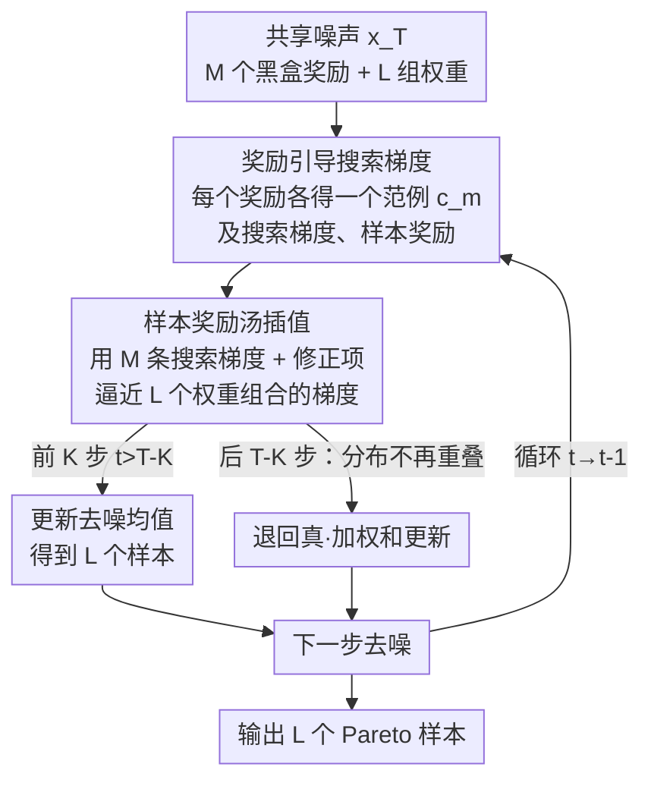

# Sample Reward Soups: Query-efficient Multi-Reward Guidance for Text-to-Image Diffusion Models

**会议**: ICLR 2026  
**OpenReview**: [https://openreview.net/forum?id=MNVxrgRcJV](https://openreview.net/forum?id=MNVxrgRcJV)  
**代码**: https://github.com/EvaFlower/Sample-Reward-Soups-ICLR26  
**领域**: 扩散模型 / 文本到图像生成 / 推理时对齐  
**关键词**: 多奖励对齐, 推理时引导, 黑盒奖励, 搜索梯度, Pareto 最优

## 一句话总结
在不训练扩散模型的前提下，本文用"插值搜索梯度"代替"逐权重组合逐个查询黑盒奖励"，让文生图模型在推理时同时对齐多个黑盒奖励，且在去噪早期大幅减少奖励查询次数（最高省 2.7×），同时避免微调方法常见的奖励过优化。

## 研究背景与动机

**领域现状**：让文生图（T2I）扩散模型对齐人类偏好（美感、压缩率、HPSv2、PickScore 等）通常有两条路：一是用 RL / 可微奖励 / DPO **微调**模型；二是在**推理时**通过引导（guidance）把奖励梯度加进去噪过程。后者近年被证明更不容易"奖励过优化"，也不需要训练。

**现有痛点**：现实里往往要同时满足**多个**黑盒奖励，而且不同用户对各奖励的偏好权重不同——要刻画整条 Pareto 前沿，就得遍历大量权重组合。无论是微调还是推理时引导，最朴素的做法是对每一组权重 $w_{1:M}$ 单独把加权奖励 $\sum_i w_i f_i$ 算一遍。推理时引导每步要采样、查奖励，权重组合数 $L$ 一多，黑盒奖励查询次数就爆炸：原文给出加权和策略每个 prompt 需要 $NTM(L-M+1)$ 次查询。当奖励本身昂贵（如调用大模型打分）时，这个开销难以承受。

**核心矛盾**：要覆盖整个偏好空间 → 需要很多权重组合；每个组合都独立查询黑盒奖励 → 查询次数随奖励数与组合数相乘式增长。微调侧的 Rewarded Soups 用"模型权重插值"把成本压到线性，但微调本身又带来过优化、对未见 prompt 泛化差的问题。推理时引导没有过优化问题，却还没有对应的"省查询"利器。

**本文目标**：在**完全不训练**扩散模型的推理时设定下，做到（1）覆盖整个偏好空间的 Pareto 最优采样；（2）把多奖励对齐的查询次数显著压下来。

**切入角度**：作者观察到一个关键现象——当从**同一个噪声点**出发、在不同奖励权重下优化去噪分布时，这些去噪分布在**去噪早期高度重叠**（图 2：初始阶段完全重叠、早期部分重叠、后期才分开）。分布重叠意味着从一个分布采的样本，对另一个分布也"统计上不可分"，于是奖励样本可以**跨权重共享**。

**核心 idea**：把微调侧 Rewarded Soups 的"插值模型权重"搬到推理时、降到**样本层级**——每步只为 $M$ 个单一奖励各算一条"搜索梯度"，再**线性插值**这些搜索梯度去逼近任意加权和对应的搜索梯度，从而省掉为 $L-M$ 个权重组合各自查询奖励的开销。

## 方法详解

### 整体框架

SRSoup 要解决的是"推理时多奖励对齐的查询效率"。整体流程：从一个共享噪声 $x_T\sim\mathcal{N}(0,I)$ 出发，在每个去噪步 $t$ 上，先为 $M$ 个奖励函数各自跑一次**奖励引导搜索梯度**（black-box，不需要奖励可微），得到 $M$ 个"范例"（exemplar）分布及其搜索梯度与样本奖励；然后对要刻画的 $L$ 个权重组合，用这 $M$ 条搜索梯度**带修正项线性插值**出每个组合的梯度，直接更新去噪均值，而**无需为这 $L-M$ 个组合再查一遍黑盒奖励**。由于分布重叠只在早期成立，方法采用**混合调度**：前 $K$ 步（$t>T-K$）用 SRSoup 插值，后面 $T-K$ 步退回真正的加权和更新。最终一次性输出 $L$ 个分别对齐不同权重的样本，逼近整条 Pareto 前沿。

### 关键设计

**1. 奖励引导搜索梯度：让黑盒奖励也能引导去噪**

要在推理时用奖励引导去噪，经典 classifier guidance 需要奖励**可微**，但压缩率这类奖励是不可微的黑盒。本文借鉴黑盒优化（NES 思路），在每一步**只优化去噪高斯分布的均值** $\mu_{t-1}$，把目标写成期望奖励 $F(\mu_{t-1})=\mathbb{E}_{\mathcal{N}(x_{t-1};\mu_{t-1},\beta_t I)}[f(x_{t-1})]$。其梯度可用高斯平滑技巧只靠采样估计（定理 1）：

$$\nabla_{\mu_{t-1}}F(\mu_{t-1})=\frac{1}{\sqrt{\beta_t}}\mathbb{E}_{\mathcal{N}(z;0,I)}\big[f(\mu_{t-1}+\sqrt{\beta_t}z)\,z\big].$$

实践上用蒙特卡洛近似：抽 $N$ 个噪声 $z_n$，构造 $x_{t-1}^n=\mu_{t-1}+\sqrt{\beta_t}z_n$，查得奖励 $f(x_{t-1}^n)$，按 $\frac{1}{\sqrt{\beta_t}N}\sum_n f(x_{t-1}^n)z_n$ 估计梯度，再做一步梯度上升 $\bar\mu_{t-1}=\mu_{t-1}+\tau_t\nabla F$，步长 $\tau_t$ 设为 $\beta_t$ 以兼容原采样调度，并用 DDIM 确定性更新（$\bar x_{t-1}=\bar\mu_{t-1}$）避免额外噪声干扰（算法 1）。这一步是后面"汤"的原子操作：每个奖励单独跑它，就得到一个只对齐该奖励的范例。

**2. 样本奖励汤：插值搜索梯度而非逐组合查询**

这是全文核心。微调侧 Rewarded Soups 插值的是**模型参数**，本文在推理时把它降到**样本/梯度层级**。定义 $M$ 个范例 $\{c^m_{t-1}\}$，每个由单一奖励（one-hot 权重 $e_m$）引导。对任意权重组合 $w_{1:M}$ 对应的真梯度 $\nabla_{\mu_{t-1}}F(\mu_{t-1},w_{1:M})$，命题 3 用泰勒展开把它写成各范例梯度的加权和加上二阶项；二阶项太贵，于是命题 4 给出一个**不需要二阶导的修正项**：当两个高斯均值距离 $\|c^m_{t-1}-\mu_{t-1}\|\le\varepsilon$ 时，$N$ 次独立采样的乘积分布之间总变差满足 $\mathrm{TV}\le \frac{N\varepsilon}{\sqrt{4\beta_t}}$，即分布足够重叠时两者样本统计上不可分。据此每个分量被近似为

$$\nabla_{\mu_{t-1}}F(\mu_{t-1},e_m)\approx\nabla_{c^m_{t-1}}F(c^m_{t-1},e_m)+\frac{1}{\sqrt{\beta_t}N}\sum_{n=1}^N f(x^{m,n}_{t-1})\,(c^m_{t-1}-\mu_{t-1}),$$

其中第二项就是修正项。于是任意权重组合的梯度 $\nabla_{\mu^l_{t-1}}F=\sum_m w^l_m[\nabla_{c^m_{t-1}}F(c^m_{t-1},e_m)+\frac{1}{\sqrt{\beta_t}N}\sum_n f_m(x^{m,n}_{t-1})(c^m_{t-1}-\mu^l_{t-1})]$，**完全复用 $M$ 个范例上算好的搜索梯度与样本奖励**，不必为这 $L-M$ 个组合再查黑盒奖励。这正是"省查询"的来源：只有 $M$ 个 one-hot 范例真正花 $N$ 次查询，其余组合靠插值白嫖。

**3. 混合调度 + 重叠强化：让"奖励共享"的前提真正成立**

样本奖励共享只在分布重叠时才有效，而 $\beta_t$ 随去噪逐渐变小，分布会越来越分开（图 2 绿色高斯已不重叠）。作者用**混合调度**应对：定义 $K$ 个 soup 步，前 $K$ 步（$t>T-K$，分布重叠）用 SRSoup 插值，后面（$t\le T-K$）退回真正的加权和更新——既吃到早期省查询的红利，又不在后期用失真的近似。为进一步保证早期重叠，再加两个**重叠强化技巧**：一是所有权重组合从**同一个噪声** $x_T$ 初始化，使 $t=T$ 时 $\mu_{T-1}=c^1_{T-1}=\dots=c^M_{T-1}$ 完全重合；二是查询 $M$ 个奖励时**复用同一组噪声** $\{z_n\}$，压低不同范例之间的发散。原文还指出去噪分布是各向同性的，重叠可逐维考量，从而绕开维度灾难，并用 Bhattacharyya 系数实测各步分布差异来佐证假设成立。

## 实验关键数据

### 主实验

骨干用 Stable Diffusion 1.5（默认 $T=50$、每奖励每步 $N=30$、soup 步 $K=20$），奖励含压缩率、LAION 美感、HPSv2、PickScore；与 DDPO(soup)、TDPO(soup)、AlignProp(soup) 三个"模型汤"微调基线比，用 Pareto 前沿与超体积（HV）衡量。

| 设定 | 对比对象 | 结论 |
|------|----------|------|
| 双目标（美感+压缩率/HPSv2/PickScore） | DDPO/TDPO/AlignProp(soup) | SRSoup 的 Pareto 前沿一致更优，且无过优化导致的多样性塌缩 |
| 三目标（美感+HPSv2+PickScore） | 同上 | 更难场景下仍领先；TDPO 优化美感时严重过优化、生成图与 prompt 不符 |
| vs 推理时加权和引导（限定查询预算） | WeightedSum | 性能相当但查询更省：前两个场景 1.8× 更省，第三个约 2.7× |
| 换骨干 SDXL | — | 更强骨干上图像质量进一步提升，验证通用性 |

### 消融实验

| 配置 | 关键现象 | 说明 |
|------|---------|------|
| 变 soup 步 $K$（$N=30$ 固定） | $K=50$（全程 SRSoup、无加权和）也能得到合理 trade-off | 早期插值梯度已足够有效 |
| $K\le 20$ | 查询最多省 ~40%，性能几乎不掉 | 早期共享省查询、后期补真奖励纠偏 |
| 变查询数 $N$（$K=30$ 固定） | $N$ 越大性能越好 | 更多采样→更准的搜索梯度 |
| 用无条件采样替换样本奖励汤 | Pareto 前沿明显变差 | 证明"汤"提供的引导是有信息量的，并非靠随机采样 |

### 关键发现
- **省查询的甜点在 $K\le20$**：早期去噪分布重叠时让奖励样本跨权重共享，最多省 40% 查询且几乎不损性能；后期退回真加权和避免近似失真——混合调度是"省查询"与"准"之间的关键开关。
- **不靠微调就避开过优化**：三个微调基线在优化美感时出现过优化（背景趋同、图文不符），而推理时引导的 SRSoup 天然没有这个问题。
- **样本奖励共享 ≠ 模型参数共享**：消融显示去掉"汤"退化为无条件采样后前沿大幅恶化，说明增益确实来自插值搜索梯度这套机制，而非单纯多采样。

## 亮点与洞察
- **把"模型汤"降维到"样本汤"**：Rewarded Soups 插值的是训练好的模型权重，本文洞察到推理时每步的"搜索梯度"同样可插值，且有 TV 距离上界为其撑腰——一个把训练侧 trick 迁移到推理侧的漂亮转译。
- **用分布重叠替代点接近**：命题 4 把"两点足够近"放宽成"两分布足够重叠"，再叠加各向同性→逐维考量绕开维度灾难，是让近似在高维扩散里站得住的关键一招，可迁移到其他需要复用黑盒查询的引导式生成。
- **修正项几乎零成本**：修正项只用到已经算过的范例样本奖励 $f_m(x^{m,n}_{t-1})$ 和均值差，不引入二阶导，是"省查询又不太掉精度"的工程支点。

## 局限与展望
- **依赖早期重叠假设**：方法的省查询收益集中在去噪早期，后期必须退回加权和；若奖励之间冲突极强、分布很快分开，可省的步数 $K$ 会变小，收益缩水。
- **黑盒查询仍随奖励数线性增长**：省掉的是 $L-M$ 个组合的查询，但 $M$ 个 one-hot 范例每步仍各需 $N$ 次查询，奖励数 $M$ 很大时基础开销依然不低。
- **只优化均值、单步梯度上升**：为省算力只更新高斯均值、做一步上升，可能在某些奖励地形下欠拟合；$K$、$N$ 需按场景调，作者也承认是需要权衡的超参。
- **评测仍以 SD1.5/SDXL + 经典奖励为主**：在更现代的 flow-based T2I（如 GRPO 路线）上的表现尚待验证。

## 相关工作与启发
- **vs Rewarded Soups（Rame et al., 2023）**：他们独立微调每个奖励的模型再插值**模型参数**；本文不训练、在推理时插值**搜索梯度**（样本层级），既省掉微调又避开过优化，是同一"汤"思想的 training-free 版本。
- **vs 推理时加权和引导（Kim et al., 2025）**：同为推理时引导，但加权和对每个权重组合都独立查黑盒奖励，查询随组合数暴涨；SRSoup 用插值复用范例查询，性能相当下省 1.8×–2.7× 查询。
- **vs 监督式多奖励微调（Lee et al., 2024；Yang et al., 2024b）**：他们靠生成图+多奖励打分构造 Pareto 集再 RL/监督微调，需要大数据且可能过优化；本文无需任何训练数据与微调。

## 评分
- 新颖性: ⭐⭐⭐⭐⭐ 首个推理时"汤"策略，把模型参数插值迁移为样本级搜索梯度插值并给出理论支撑。
- 实验充分度: ⭐⭐⭐⭐ 双/三目标、多奖励、SD1.5/SDXL、$K$/$N$/组件消融较完整，但骨干与奖励仍偏经典。
- 写作质量: ⭐⭐⭐⭐ 动机—洞察—理论—算法链条清晰，命题与算法表给得明白。
- 价值: ⭐⭐⭐⭐⭐ 多奖励对齐查询昂贵是真痛点，training-free 且显著省查询，实用且可扩展。

<!-- RELATED:START -->

## 相关论文

- [\[ICLR 2026\] GLASS Flows: Efficient Inference for Reward Alignment of Flow and Diffusion Models](glass_flows_reward_alignment_diffusion.md)
- [\[ICML 2026\] Pareto-Guided Optimal Transport for Multi-Reward Alignment](../../ICML2026/image_generation/pareto-guided_optimal_transport_for_multi-reward_alignment.md)
- [\[ICLR 2026\] Training-Free Reward-Guided Image Editing via Trajectory Optimal Control](training-free_reward-guided_image_editing_via_trajectory_optimal_control.md)
- [\[ICLR 2026\] EditReward: A Human-Aligned Reward Model for Instruction-Guided Image Editing](editreward_a_human-aligned_reward_model_for_instruction-guided_image_editing.md)
- [\[ICLR 2026\] Sample-Efficient Evidence Estimation of Score-Based Priors for Model Selection](sample-efficient_evidence_estimation_of_score_based_priors_for_model_selection.md)

<!-- RELATED:END -->
