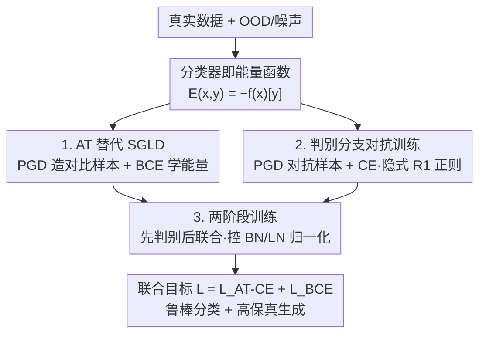

# Scalable Energy-Based Models via Adversarial Training: Unifying Discrimination and Generation

**会议**: ICLR 2026  
**OpenReview**: [https://openreview.net/forum?id=I9iai932rK](https://openreview.net/forum?id=I9iai932rK)  
**代码**: https://github.com/xuwangyin/DAT (有)  
**领域**: 扩散模型 / 能量模型 / 图像生成 / 对抗鲁棒  
**关键词**: 能量模型(EBM), 对抗训练, JEM, 判别-生成统一, 反事实解释

## 一句话总结
本文提出 Dual Adversarial Training (DAT)，用对抗训练（PGD 造对比样本 + BCE 损失）替换 JEM 中不稳定的 SGLD 采样来学习能量函数，再对判别分支也做对抗训练，配合两阶段训练策略，首次让"能量模型式判别-生成混合模型"稳定扩展到 ImageNet 256×256，同时拿到 SOTA 级鲁棒分类与生成质量（FID 3.29，比肩自回归 VAR-d16、超过 ADM-G/LDM-4-G）。

## 研究背景与动机

**领域现状**：判别模型擅长分类但不会建模数据分布，生成模型能采样却往往在下游分类上偏弱。把两者统一进一个网络的"混合建模"是个老问题，其中能量模型（EBM）因为同时连接两种范式而很有吸引力。代表作 JEM（Grathwohl et al., 2019）发现：标准分类器的 logits 本身就可以重新解释为联合分布 $p(x,y)$ 上的能量函数，于是同一个网络既能分类又能生成。

**现有痛点**：JEM 这一类方法的生成分支都依赖 MCMC 采样——具体是随机梯度朗之万动力学（SGLD）。SGLD 训练极不稳定、计算昂贵、采样质量差，导致这些混合模型始终被卡在 CIFAR（32×32）这种低分辨率规模，FID 普遍 30+，根本上不了 ImageNet。后续 JEM++、Robust-JEM、SADA-JEM 等改良虽提升了稳定性，但都没跳出 SGLD 的框子，问题没被根除。

**核心矛盾**：要同时拿到"判别鲁棒性"和"高保真生成"，本质上要稳定地优化能量函数；但 SGLD 既慢又难收敛，标准 EBM 梯度（Eq. 5）允许能量值无界增长，数值上必然爆炸。另一条线（如 AT-EBM，Yin et al., 2022）虽然用 PGD 替掉 SGLD 拿到了稳定性，但只能做无条件生成，且还要显式加 R1 梯度惩罚约束模型表达力。

**本文目标**：在 JEM 的联合架构里，既根治生成分支的训练不稳定，又让判别分支真正鲁棒，并把整套方法扩展到高分辨率、跨架构（ResNet 的 BN、ConvNeXt 的 LN）。

**切入角度**：对抗训练（AT）和能量建模之间有深刻联系——AT 隐式地把真实数据附近的能量地形"压平"，而 PGD 生成的对抗样本天然可当作能量模型的负样本。既然如此，干脆把"对抗训练"同时用在两个地方：生成分支用它学能量，判别分支用它求鲁棒。

**核心 idea**：用对抗训练的双重应用（Dual AT）替换 SGLD——生成分支用 PGD 对比样本 + BCE 损失稳定地塑造能量地形，判别分支用标准 AT 既保鲁棒又隐式提供能量训练所需的梯度正则。

## 方法详解

### 整体框架

DAT 建立在 JEM 之上：把一个产生 logits $f_\theta(x)\in\mathbb{R}^K$ 的标准分类器重新解释为联合分布上的 EBM，联合能量定义为 $E_\theta(x,y) = -f_\theta(x)[y]$，对标签 $y$ 边缘化后得到数据上的边缘能量 $E_\theta(x) = -\log\sum_y \exp(f_\theta(x)[y])$。这样一来，同一套权重既给出分类概率 $p_\theta(y|x)$，又定义了密度 $p_\theta(x)$。

DAT 的整体目标就是把联合对数似然 $\log p_\theta(x,y) = \log p_\theta(y|x) + \log p_\theta(x)$ 拆成两项分别用对抗训练去优化：判别项用鲁棒分类损失 $L_{\text{AT-CE}}$，生成项用 AT 式的 $L_{\text{BCE}}$。生成所需的"负样本"由 PGD 在能量函数上做正规化梯度下降产生——训练时把 OOD 图像（或纯噪声）逐步推向数据分布，测试时同一机制就能采样或做反事实生成。最后用两阶段训练把这一切在带归一化层的现代架构上跑稳。

### 关键设计

**1. AT 替代 SGLD：用 BCE 对比损失稳定地学能量函数**

这是全文最关键的一刀，针对的就是 SGLD 让能量训练发散、采样质量差的痛点。标准 EBM 梯度（Eq. 5）是 $\mathbb{E}_{x\sim p_{data}}[-\nabla_\theta E_\theta(x)] - \mathbb{E}_{x\sim p_\theta}[-\nabla_\theta E_\theta(x)]$，它无界、允许 $-E_\theta(x)$ 无限增长，所以数值上炸。DAT 给两项各乘一个数据相关的缩放因子，把梯度改写为

$$\mathbb{E}_{x\sim p_{data}}\big[-\alpha(x)\nabla_\theta E_\theta(x)\big] - \mathbb{E}_{x\sim p_\theta}\big[-\beta(x)\nabla_\theta E_\theta(x)\big]$$

其中 $\alpha(x) = 1-\sigma(-E_\theta(x))$、$\beta(x) = \sigma(-E_\theta(x))$，$\sigma$ 是 logistic sigmoid。当 $-E_\theta(x)$ 取极端值时 sigmoid 饱和，对应缩放因子趋于 0，自动衰减梯度贡献，从而避免上溢/下溢——这等于把梯度正则"内建"进了损失，不必再外挂惩罚项。这个梯度恰好是下面这个二元交叉熵（BCE）损失对 $\theta$ 的梯度：

$$L_{\text{BCE}}(\theta) = -\mathbb{E}_{x\sim p_{data}}\big[\log\sigma(-E_\theta(x))\big] - \mathbb{E}_{x\sim p_\theta}\big[\log(1-\sigma(-E_\theta(x)))\big]$$

直观上：把真实数据当正类、对比样本当负类，让能量函数学会"区分真实数据和 PGD 推过来的样本"。代价是这样只能建模 $p_{data}$ 的支撑集而非完整密度——作者在附录给出形式化刻画，最优解满足 $f_\theta^*(x)[y] = \log p_{data}(y|x)$、支撑集上边缘能量为常数 $E_\theta^*(x)=0$。对比样本则沿能量做 $T$ 步正规化梯度下降生成：$x_{t+1} = x_t - \eta\,\nabla_x E_\theta(x_t)/\lVert\nabla_x E_\theta(x_t)\rVert_2$，初始化自辅助 OOD 数据集（CIFAR 用 80M Tiny Images）或纯随机噪声。

**2. 判别分支对抗训练：既要鲁棒，又顺带提供隐式 R1 正则**

光改生成分支后，判别分支的对抗鲁棒性仍弱于标准 AT 分类器。于是 DAT 对判别项 $p_\theta(y|x)$ 也做对抗训练：在每个样本的 $\epsilon$-球 $B(x,\epsilon)$ 内用 PGD 找最大化分类损失的对抗样本 $x_{adv} = \arg\max_{x'\in B(x,\epsilon)} L_{\text{CE}}(\theta;x',y)$，然后最小化 $L_{\text{AT-CE}}(\theta) = \mathbb{E}_{(x,y)\sim p_{data}}[-\log p_\theta(y|x_{adv})]$。

这一步的巧妙在于"一鱼两吃"。前作 AT-EBM 必须显式加 R1 梯度惩罚才能训稳，而本文基于 Roth et al. (2020) 证明：对抗训练会隐式地把 R1 惩罚项界住。实测中（Figure 2）AT 全程把 R1 梯度维持在有界范围，而标准训练则出现梯度爆炸。于是判别分支的 AT 不仅给出鲁棒精度，还顺手免掉了显式正则，既简化流程又不约束模型表达力。两项合起来就是完整目标 $L(\theta) = L_{\text{AT-CE}}(\theta) + L_{\text{BCE}}(\theta)$，正对应 JEM 里 $\log p_\theta(x,y)=\log p_\theta(y|x)+\log p_\theta(x)$ 的分解。

它和结构相似的 RATIO 有本质区别：RATIO 的副项是攻击 OOD 样本抬高置信度再用对均匀分布的交叉熵压回去，目标是 OOD 检测；而 DAT 的 $L_{\text{BCE}}$ 是用 PGD 对比样本 + BCE 去塑造能量地形，目标是能采出高质量样本。

**3. 两阶段训练：先判别后联合，化解归一化层与能量训练的冲突**

直接联合训练会撞上归一化层的坑——尤其 batch normalization（BN）已被多篇工作指出对 EBM 训练有害，本文也观察到开 BN 会让 $L_{\text{BCE}}$ 震荡、不收敛。但归一化层对判别训练的收敛速度又很重要，不能简单删掉。DAT 的解法是两阶段：

- **Stage 1（判别训练）**：保持架构原始归一化配置，只优化鲁棒分类目标 $L_{\text{AT-CE}}$。这一步等价于标准对抗训练，能充分利用归一化层快速收敛。关键是——若已有预训练鲁棒分类器，这一步可以直接跳过，方法立刻就能套用到现成模型上（实验里 CIFAR-10、ImageNet 多个 checkpoint 都是这么复用的）。
- **Stage 2（联合训练）**：从 Stage 1 模型出发，按需修改归一化行为，再用完整目标 $L(\theta)$ 继续训。对 BN 架构（ResNet/WRN）把 BN 模块设为 eval 模式，冻结 Stage 1 统计量；对 LN 架构（ConvNeXt）则原样保留。

这套策略既绕开 BN 与 EBM 的不兼容，又能蹭预训练鲁棒分类器省算力（相对标准 AT 仅 1.05–1.56× 开销），且对 ResNet 和 ConvNeXt 都奏效，因此能推广到 ViT 这类现代可扩展架构——这正是它能爬上 ImageNet 256×256 的工程基础。

### 损失函数 / 训练策略
最终目标为 $L(\theta) = L_{\text{AT-CE}}(\theta) + L_{\text{BCE}}(\theta)$。判别项与生成项各用一套数据增强：$L_{\text{AT-CE}}$ 用强增强保鲁棒，$L_{\text{BCE}}$ 用基础变换避免破坏数据分布；论文发现自己的框架下即便对生成项也用随机裁剪+填充也不会引入黑边等伪影。PGD 迭代步数 $T$ 是关键超参，直接调控判别-生成的权衡（见消融）。

## 实验关键数据

### 主实验

CIFAR-10 上，DAT 同时把"鲁棒精度"和"生成 FID"拉到混合模型里的最优：

| 方法 | Acc%↑ | Robust Acc%↑ | IS↑ | FID↓ |
|------|-------|--------------|-----|------|
| JEM | 92.9 | 40.5 | 8.76 | 38.4 |
| SADA-JEM | 95.5 | 31.93 | 8.77 | 9.41 |
| RATIO | 92.23 | 76.25 | 9.61 | 21.96 |
| Standard AT | 92.43 | 75.73 | 9.58 | 28.41 |
| **DAT (T=40)** | 91.92 | **75.75** | 9.92 | **9.12** |
| DAT (T=50) | 90.72 | 74.65 | 9.86 | 7.57 |

DAT 的鲁棒精度 75.75% 直追标准 AT（75.73%），同时 FID 9.12 远好于 JEM(38.4)/SADA-JEM(9.41)，而 RATIO 虽鲁棒但生成差（FID 21.96）。

ImageNet 256×256 是真正的突破点——首个稳定扩展到该规模的 EBM 混合模型：

| 方法 | Acc%↑ | Robust Acc%↑ | FID↓ | IS↑ | 参数 |
|------|-------|--------------|------|-----|------|
| EGC（扩散混合） | 78.90 | 13.56 | 6.05 | 231.3 | 543M |
| Standard AT (ConvNeXt-L) | 78.25 | 33.38 | 44.46 | 27.32 | 198M |
| VAR-d16（自回归） | – | – | 3.30 | – | 310M |
| ADM-G（扩散） | – | – | 4.59 | – | 608M |
| LDM-4-G（扩散） | – | – | 3.60 | – | 400M |
| **DAT (ConvNeXt-L, T=110)** | 75.78 | **56.40** | **3.29** | 310.2 | 198M |

DAT 用更少参数（198M）拿到 FID 3.29，比肩 SOTA 自回归 VAR-d16（3.30）、超过 ADM-G/LDM-4-G，且鲁棒精度 56.40% 碾压扩散混合 EGC 的 13.56%；推理吞吐还比扩散模型快约 5–29×。

### 消融实验

| 配置 | 关键指标 | 说明 |
|------|---------|------|
| DAT T=40 (CIFAR-10) | FID 9.12 | 判别偏好 |
| DAT T=50 (CIFAR-10) | FID 7.57 | 生成更好但精度下降 |
| 噪声初始化（无 OOD） | 精度持平 | 去掉辅助数据集仍可训 |
| ResNet-50→WRN-50-4 (ImageNet) | 精度/FID 双升 | 容量越大越好 |
| WRN-50-4→ConvNeXt-L | 更优且参数更少 | 架构设计 > 单纯堆参数 |

### 关键发现
- **生成-判别存在可调权衡**：PGD 步数 $T$ 是旋钮，$T$ 从 40 调到 50 让 CIFAR-10 FID 从 9.12 降到 7.57，但牺牲干净/鲁棒精度；本质是生成目标把表示对齐到 $p_{data}$，会与鲁棒性冲突，也可通过损失加权显式调。
- **可彻底摆脱辅助数据**：PGD 从纯随机噪声初始化时，干净/鲁棒精度与 OOD 初始化持平，生成质量也合理，去掉了对 80M Tiny Images 这类外部数据的依赖。
- **架构 > 参数量**：ConvNeXt-L（198M）在精度和生成上都明显胜过参数更多的 WRN-50-4（223M），说明现代架构设计的收益大于单纯扩容。
- **稳定性强**：所有 run 零训练发散，两阶段训练相对标准 AT 仅 1.05–1.56× 开销。

## 亮点与洞察
- **把"对抗训练"当成统一胶水**：同一种 PGD 机制，对内分布样本用就是判别鲁棒，对 OOD/噪声用就是生成对比样本——一套机制服务两个目标，概念上极简洁。
- **梯度正则"内建"进损失**：用 $\alpha/\beta$ 的 sigmoid 缩放因子让标准 EBM 梯度自动有界，省掉了前作必须的显式 R1 惩罚，这是稳定性的关键来源，思路可迁移到其他易爆炸的对比式训练。
- **能量函数即决策函数 → 反事实解释天然成立**：因为分类决策和生成用的是同一个能量函数，对样本做定向 PGD 就能得到既视觉逼真又语义忠于目标类的反事实图像，比非鲁棒/纯鲁棒模型都更可信。
- **两阶段 + 复用预训练鲁棒分类器**：把"能量训练与 BN 不兼容"这个老大难拆成"先用归一化训判别、再冻结统计量做联合"，工程上既省算力又跨架构，是它能上 ImageNet 的现实抓手。

## 局限与展望
- 只建模 $p_{data}$ 的支撑集而非完整密度（最优解边缘能量为常数 $E_\theta^*(x)=0$），这是 BCE 稳定化的内在代价，理论上比真正的密度估计弱。
- 生成与判别存在结构性权衡，鱼与熊掌需通过 $T$ 或损失权重折中，难以两端同时拉满。
- ImageNet 用的 OOD 数据集是作者自建（从 Open Images 筛 35 万张），无现成标准集，复现/可比性受一定影响。
- 生成依赖 PGD 多步迭代（ImageNet 上 36 步），虽比扩散快，但仍非单步，且步数与质量耦合。

## 相关工作与启发
- **vs JEM / SADA-JEM**：同属 JEM 框架并复用"分类器即能量函数"，但 JEM 系靠 SGLD 采样、被困在 CIFAR 且生成差（FID 38）；DAT 用 AT+BCE 换掉 SGLD，既稳又能上 ImageNet。
- **vs AT-EBM (Yin et al., 2022)**：DAT 直接继承其 PGD 对比 + BCE 的能量学习，但把它接进 JEM 做**条件**生成，并用判别分支的 AT 提供**隐式 R1 正则**，省掉显式梯度惩罚，不再约束表达力。
- **vs RATIO**：目标形式相似（鲁棒分类 + 对 OOD 的对抗扰动），但 RATIO 副项是把 OOD 置信度压向均匀分布做 OOD 检测，DAT 副项是塑造能量地形做高质量生成，落点完全不同（CIFAR-10 FID 9.12 vs 21.96）。
- **vs EGC（扩散混合）**：EGC 用 Fisher 散度在扩散框架里学 score 绕开 EBM 不稳定，生成好但几乎不鲁棒（ImageNet 鲁棒精度 13.56%）；DAT 把鲁棒（56.40%）和生成（FID 3.29）同时拿下。

## 评分
- 新颖性: ⭐⭐⭐⭐ 把双重对抗训练嵌进 JEM、用 sigmoid 缩放免掉 R1 是巧思，但单点组件多源自前作的组合。
- 实验充分度: ⭐⭐⭐⭐⭐ CIFAR-10/100 + ImageNet 256，分类/生成/反事实/吞吐/消融齐全，首个上 ImageNet 的 EBM 混合。
- 写作质量: ⭐⭐⭐⭐ 动机与公式推导清晰，三大创新对应明确，部分关键证明放附录。
- 价值: ⭐⭐⭐⭐⭐ 打破 EBM 混合模型卡在 CIFAR 的天花板，鲁棒+生成+反事实一网打尽，实用价值高。

<!-- RELATED:START -->

## 相关论文

- [\[ICLR 2026\] Bridging Degradation Discrimination and Generation for Universal Image Restoration](bridging_degradation_discrimination_and_generation_for_universal_image_restorati.md)
- [\[ICLR 2026\] RNE: plug-and-play diffusion inference-time control and energy-based training](rne_plug-and-play_diffusion_inference-time_control_and_energy-based_training.md)
- [\[ICLR 2026\] Scalable Training for Vector-Quantized Networks with 100% Codebook Utilization](scalable_training_for_vector-quantized_networks_with_100_codebook_utilization.md)
- [\[ICLR 2026\] TwinFlow: Realizing One-step Generation on Large Models with Self-adversarial Flows](twinflow_realizing_one-step_generation_on_large_models_with_self-adversarial_flo.md)
- [\[ICLR 2026\] SERUM: Simple, Efficient, Robust, and Unifying Marking for Diffusion-based Image Generation](serum_simple_efficient_robust_and_unifying_marking_for_diffusion-based_image_gen.md)

<!-- RELATED:END -->
