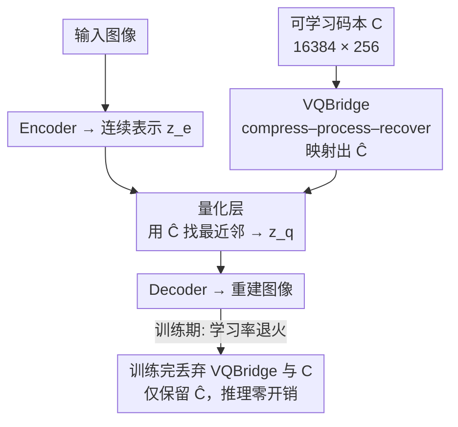

# Scalable Training for Vector-Quantized Networks with 100% Codebook Utilization

**会议**: ICLR 2026  
**OpenReview**: [https://openreview.net/forum?id=juM14y0caI](https://openreview.net/forum?id=juM14y0caI)  
**代码**: https://github.com/yfChang-cv/FVQ  
**领域**: 扩散模型 / 图像生成 / 离散图像分词器  
**关键词**: 向量量化, 码本利用率, 离散分词器, 自回归图像生成, VQBridge

## 一句话总结
这篇论文针对向量量化（VQ）分词器训练不稳定、大码本几乎用不满的老毛病，提出一个只在训练期挂载、推理时直接丢弃的投影器 VQBridge（compress–process–recover），配合学习率退火，让码本在 16k 到 262k 的各种配置下都能达到 **100% 利用率**，重建 rFID 刷到 0.88，接到 LlamaGen 上做图像生成后 FID 反超 VAR 和 DiT。

## 研究背景与动机
**领域现状**：自回归图像生成（如 LlamaGen、VAR）依赖一个离散分词器，把连续图像通过向量量化压成离散 token，再让 AR 模型像预测下一个词那样预测下一个图像 token。分词器的重建上限基本决定了生成模型的天花板，所以离散分词器的设计至关重要。直觉上，把码本（codebook）做大就能减少量化时的信息损失。

**现有痛点**：但前人反复发现，单纯增大码本规模或码向量维度往往触发**码本坍缩（codebook collapse）**——只有一小撮码向量被真正用到，利用率断崖式下跌，下游生成能力随之被拖垮。论文里的对照很触目惊心：LlamaGen 用 16,384×256 的码本时，利用率只有 0.29%、rFID 高达 9.21；即便有各种缓解手段，scaling 到 262k 码本时仍然达不到满利用率。

**核心矛盾**：根子在于 VQ 用 **直通估计器（STE）** 绕过 arg min 的不可导，这带来三个连锁问题——① **直通估计偏差**：$\delta = z_q - z_e$ 直接污染解码器、间接经 commitment loss 污染编码器；② **滞后一步更新（one-step-behind）**：commitment loss 让模型对齐的是历史表示而非当前表示，码本按 $z_q^{(t+1)} \leftarrow (1-\eta) z_q^{(t)} + \eta z_e^{(t)}$ 更新，解码器学的是旧码本输出，造成编解码器错位；③ **稀疏码本梯度**：只有被选中的码向量收到梯度，没被选中的永远不更新、形同废弃，这是坍缩的首要原因。

**本文目标**：在「学习退火 + 码本扩张」的双重压力下仍然维持高码本利用率，同时不引入任何推理开销。

**切入角度**：作者沿用「线性重参数化」思路——把码本集合 $C_z$ 经一个映射函数 $f(\cdot)$ 变成新集合 $\hat C_z = f(C_z)$ 并联合优化，训练目标转为最小化编码分布 $P_z$ 与映射码本 $\hat C_z$ 的距离 $D(P_z, \hat C_z)$。但他们做了关键观察：**线性投影器太弱**——对学习率极其敏感，退火时利用率骤降，scaling 到大码本时连 5 层 MLP 也救不回来（图 3）。

**核心 idea**：用一个**足够强、可缩放、且训练后即弃**的投影器替换线性层，让码本分布在训练早期就和编码分布快速对齐并长期保持满利用率；这个投影器就是 VQBridge。

## 方法详解

### 整体框架
FVQ（FullVQ）= 标准 VQN（Encoder + 量化层 + Decoder）+ 训练期挂载的 VQBridge + 学习率退火。输入图像经编码器得到连续表示 $z_e$；与此并行，一个可学习的原始码本 $C$（如 $16384\times256$）先送进 VQBridge，被映射成 $\hat C = f(C)$；量化层用 $\hat C$ 而非 $C$ 去给 $z_e$ 找最近邻码向量得到 $z_q$；解码器从 $z_q$ 重建图像。整个训练用学习率退火（warmup 后衰减到初始值的 1%）来压制滞后一步效应。**关键的便宜之处**：训练结束后 VQBridge 和原始码本 $C$ 都可以扔掉，只保留映射后的码本 $\hat C$——于是推理时完全退化成普通 VQN，零额外参数、零额外计算。

### 关键设计

**1. VQBridge 投影器：用 compress–process–recover 给整个码本做全局交互**

线性投影器之所以弱，是因为它对每个码向量独立做仿射变换，表达力不足、码向量之间没有信息流动，扛不住学习率退火和大码本。VQBridge 借鉴 DiT 的思路，把映射 $f(\cdot)$ 设计成「压缩—处理—还原」三段流水线，核心是让所有码向量充分**互相交互**。具体地，给定含 $K$ 个码向量的码本 $C$，先做 **1D patchify**：把码本分成 $p$ 组、每组 $K/p$ 个向量，用共享线性投影 $W_{comp}$ 把每组压成一个向量再过 LayerNorm，得到 $h_g = \mathrm{LN}(C_g W_{comp})$；接着用 $N$ 个 **ViT block** 在压缩后的序列 $H=[h_1,\dots,h_p]$ 上做全局注意力交互 $H' = \mathrm{ViT}_N(H)$，让码向量之间建立复杂关系；最后做 **1D unpatchify**：LayerNorm 后用共享投影 $W_{exp}$ 把每个向量扩回 $Kd/p$ 维，reshape 还原成 $\hat C \in \mathbb{R}^{K\times d}$。压缩这一步是 scalability 的关键——正是因为先把 $K$ 个向量压成 $p$ 个再过 ViT，才能在 262k 这种超大码本上以可控成本做全局交互。在文中的玩具实验里，标准 STE 让 $z_e$ 与 $z_q$ 走出螺旋轨迹（量化偏差 + 滞后更新的体现），而 VQBridge 让 $z_q$ 紧跟 $z_e$、轨迹变成分段线性，早期就把两个分布的距离压下去，码本利用率从 3%/53% 直接拉到 100%。

**2. 学习率退火：把"滞后一步更新"的危害摁下去**

光有强投影器还不够。作者从理论上给「滞后一步更新」的影响推了一个上界，并指出**更小的学习率能直接缩小这个滞后偏差、改善编解码器对齐**（Observation 2）。所以 FVQ 采用学习率退火：4 个 epoch 的 warmup 之后，把学习率衰减到初始值的 1%。这一步和 VQBridge 是互补而非可替换的关系——图 3 显示，线性层即便在 16k 码本上能短暂冲到 100%，**一旦叠加退火利用率就崩**；而 VQBridge 在「16k / 262k × 有无退火」的所有组合里都能快速冲到并稳住 100%。消融数据也印证退火本身对重建有实打实贡献：FVQ 去掉退火 rFID 是 2.61，加上退火直接降到 1.30。

**3. patch size 与码本规模协同缩放：让 VQBridge 真正"可 scale"**

VQBridge 要在 16k 到 262k 的跨度上都好用，关键超参不能固定。作者通过消融发现一条清晰的缩放律：**patch size $p$ 要和码本规模 $K$ 一起按 $4^n$ 的步调放大**——$K=4k$ 时最优 $p=4$，$K=16k$ 时最优 $p=16$；每次把码本放大 $4\times$，就同步把 patch size 放大 $4\times$。这本质上是在「patchify 阶段的压缩压力」和「ViT block 的计算负担」之间找平衡：码本越大，单组要压的向量越多，就需要更大的分组粒度来摊薄。配套的另外两个结论是：潜在维度 $d'$ 取得和码向量通道数相等时最好（默认 256，再大到 512 反而过参数化掉点）；ViT 深度 $N=2$ 最优（$N=1$ 欠拟合，$N=4$ 因优化变难反而退化）。正是这套协同缩放策略，让 FVQ 在「码本变大 / 通道变宽 / 训练变长」三个维度上都能稳定吃到收益而不坍缩。

### 损失函数 / 训练策略
沿用标准 VQ 目标：任务重建损失 + commitment loss $L_{cmt}(z_e, z_q) = d(z_q, \mathrm{sg}[z_e]) + \beta\, d(z_e, \mathrm{sg}[z_q])$，量化层用 STE $z_q = z_e + \mathrm{sg}[z_q - z_e]$ 让梯度绕过 arg min。区别只在于：量化用的码本是 VQBridge 映射后的 $\hat C$，且整套训练叠加学习率退火。重建实验默认 16,384×256 码本，VQBridge 配置为潜维 256、深度 2、patch size 16，训 40 epoch（base lr 1e-4，batch 128，Adam $\beta_1=0.9,\beta_2=0.95$），延长到 120 epoch 可进一步提升。

## 实验关键数据

### 主实验
ImageNet 256×256 重建（同一 Encoder/Decoder 对比，rFID 越低越好）：

| 方法 | 码本规模 | 码向量通道 | rFID↓ | 码本利用率↑ |
|------|---------|-----------|-------|------------|
| VQGAN | 16,384 | 256 | 4.98 | 5.9% |
| LlamaGen | 16,384 | 256 | 9.21 | 0.29% |
| VQGAN-LC | 100,000 | 8 | 2.62 | 99% |
| IBQ (330 ep) | 16,384 | 256 | 1.55 | 97% |
| **FVQ (40 ep)** | 16,384 | 256 | **1.30** | **100%** |
| **FVQ (120 ep)** | 16,384 | 256 | **1.17** | **100%** |

类条件图像生成（接 LlamaGen，FID 越低越好）：

| 类型 | 模型 | 参数量 | FID↓ | IS↑ |
|------|------|-------|------|-----|
| Diffusion | DiT-XL/2 | 675M | 2.27 | 278.2 |
| VAR | VAR-d20 | 600M | 2.57 | 302.6 |
| AR | LlamaGen-XL | 775M | 3.39 | 227.1 |
| AR | **FVQ-L** (LlamaGen-L) | 343M | **2.39** | 276.6 |
| AR | **FVQ-XL** (LlamaGen-XL) | 775M | **2.07** | 287.0 |

FVQ-L 仅 343M 就反超 600M 的 VAR-d20（2.39 vs 2.57），FVQ-XL 反超 DiT-XL/2（2.07 vs 2.27），说明一个朴素 AR 框架只要配上高质量分词器就能打过 VAR 和扩散模型。

### 消融与缩放实验

| 配置 | rFID(IN1k)↓ | 码本利用率 | 说明 |
|------|------------|-----------|------|
| VQGAN, 16k×256 | 9.21 | 0.29% | 大通道下严重坍缩 |
| FVQ − 退火, 16k×256 | 2.61 | 100% | 去掉学习率退火 |
| FVQ, 16k×256, 40ep | 1.30 | 100% | 默认配置 |
| FVQ, 65k×512, 120ep | 1.00 | 100% | 码本/通道/时长齐增 |
| FVQ, 262k×256, 120ep | **0.88** | 100% | 最大码本，SOTA 重建 |
| FVQ, 8× 压缩, 16k×256 | **0.39** | 100% | 低压缩比 |

泛化到多码表示（Table 4）：FVQ(RQ-VAE) 训 10 epoch 的 rFID 2.98，反超 RQ-VAE 训 50 epoch 的 3.20；FVQ(VAR) 把 rFID 从 1.00 降到 0.80。

### 关键发现
- **稀疏梯度是坍缩主因**：玩具实验 t-SNE 显示，纯 STE 只用到 3% 码本，加线性层升到 53% 但仍不够，VQBridge 的密集跨码交互才把利用率推到 100%。
- **退火与强投影器缺一不可**：线性层叠加退火会崩、5 层 MLP 在 262k 上也救不回来，唯独 VQBridge 在所有组合下稳住满利用率；退火本身让 rFID 从 2.61 降到 1.30。
- **可预测的 scaling**：码本 16k→262k（rFID 1.30→0.95）、通道 4→256、训练 40→120 epoch 三个维度都稳定吃到收益且始终 100% 利用率，这是普通 VQGAN 做不到的（大通道直接掉到 0.29%）。
- **超参敏感点**：$d'$ 等于码向量通道数最优、ViT 深度 2 最优、patch size 与码本按 $4\times$ 协同缩放最优。

## 亮点与洞察
- **"训练期脚手架、推理期清零"** 的设计极其讨巧：VQBridge 只在训练时帮码本对齐分布，训完连同原始码本一起丢，只留映射后的 $\hat C$，所以完全不动 VQN 原有的推理流程和成本——拿来即用、零迁移代价，这是它能被各种 VQ 变体直接套上的根本原因。
- **把"码本利用率"当成比估计误差更可靠的诊断信号**：作者点明小估计误差可能只是少数活跃码向量造成的假象，利用率高才真正说明更多码向量在贡献，这个判据值得迁移到任何研究量化坍缩的工作。
- **compress–process–recover 这一范式**（先压缩降算力、再全局交互、最后还原）可以迁移到任何"要对一大堆向量做全局建模但又不能爆算力"的场景，比如大规模检索码本、专家路由表的联合优化。
- **对 AR 生成的再定位**：论文用实验论证了瓶颈在分词器而非生成器本身——朴素 AR 配好分词器即可超越 VAR/DiT，这对"该往哪投资源"是有指导意义的判断。

## 局限与展望
- 实验集中在 ImageNet/COCO 的类条件生成与重建，未验证文本到图像等更复杂的条件生成场景下分词器质量的传导效果。
- VQBridge 虽然推理零开销，但训练期引入了额外的 ViT 计算与显存，超大码本（262k）下的训练成本细节论文未充分量化。
- 协同缩放律（patch size 与码本同步 $4\times$）是经验观察，理论解释停留在"压缩压力 vs ViT 负担的平衡"层面，缺乏更严格的刻画。
- 作者提到高维码向量（256）为接入语义分词器（如 CLIP 512 维）铺路，但这只是展望，尚无实际整合实验。

## 相关工作与启发
- **vs 线性重参数化 / VQGAN-LC**：两者都用映射函数 $f(\cdot)$ 联合优化码本，但前者是逐码向量独立的线性/MLP 变换，对学习率敏感、退火即崩、大码本失效；FVQ 用带全局注意力的 VQBridge 引入跨码向量交互，才在退火和大码本下稳住 100% 利用率。
- **vs IBQ / 直接增大码本的方法**：它们靠各种正则或初始化缓解坍缩，但 scaling 到 262k 仍达不到满利用率（且要训 330 epoch）；FVQ 40 epoch 就能在 262k 上 100% 利用并把 rFID 压到 0.88。
- **vs VAR / DiT（生成端）**：这些方法在生成架构上做文章，FVQ 反过来论证瓶颈在分词器——同样的朴素 LlamaGen 换上 FVQ 分词器后 FID 即反超二者，把"提升生成"的着力点从生成器拉回到 tokenizer。

## 评分
- 新颖性: ⭐⭐⭐⭐ 把投影器做成训练期可丢的 compress–process–recover ViT，既解决坍缩又零推理开销，思路干净
- 实验充分度: ⭐⭐⭐⭐⭐ 重建/生成/缩放/泛化/消融五线齐全，覆盖 16k→262k 码本与多种 VQ 变体
- 写作质量: ⭐⭐⭐⭐ 三大挑战的拆解清晰，玩具实验与 t-SNE 直观，理论上界推导放在附录
- 价值: ⭐⭐⭐⭐⭐ 100% 码本利用率 + SOTA 重建 + 即插即用，对离散分词器和 AR 生成都有直接落地价值

<!-- RELATED:START -->

## 相关论文

- [\[ICLR 2026\] Purrception: Variational Flow Matching for Vector-Quantized Image Generation](purrception_variational_flow_matching_for_vector-quantized_image_generation.md)
- [\[ICLR 2026\] Scalable Energy-Based Models via Adversarial Training: Unifying Discrimination and Generation](scalable_energy-based_models_via_adversarial_training_unifying_discrimination_an.md)
- [\[ICLR 2026\] Amortising Inference and Meta-Learning Priors in Neural Networks (BNNP)](amortising_inference_and_meta-learning_priors_in_neural_networks.md)
- [\[ICLR 2026\] QVGen: Pushing the Limit of Quantized Video Generative Models](qvgen_pushing_the_limit_of_quantized_video_generative_models.md)
- [\[ICLR 2026\] Flow Map Learning via Non-Gradient Vector Flow](flow_map_learning_via_non-gradient_vector_flow.md)

<!-- RELATED:END -->
