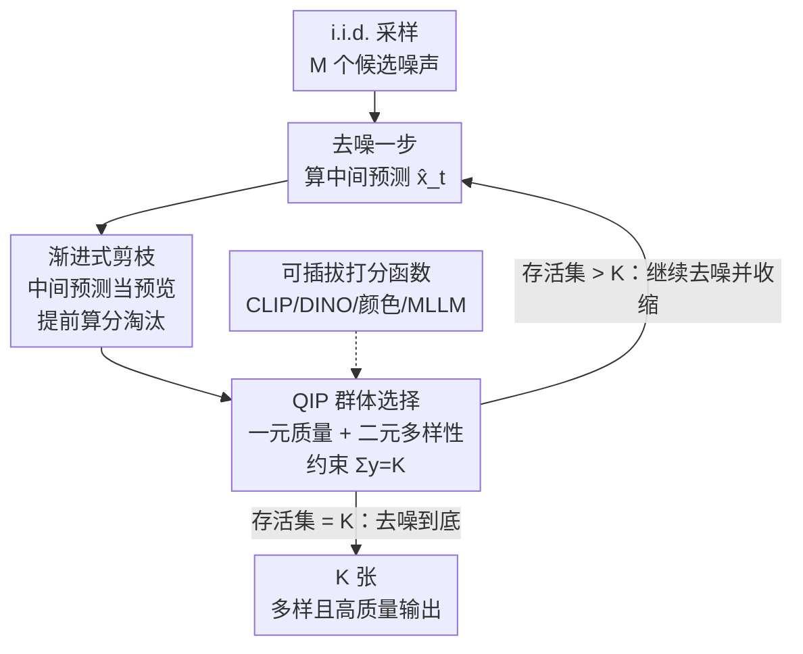

# Scaling Group Inference for Diverse and High-Quality Generation

**会议**: ICLR 2026  
**OpenReview**: [https://openreview.net/forum?id=IyTNxjTuWT](https://openreview.net/forum?id=IyTNxjTuWT)  
**代码**: 无（补充材料含匿名代码）  
**领域**: 扩散模型 / 图像生成 / 推理时缩放  
**关键词**: 群体推理, 多样性, 二次整数规划, 渐进式剪枝, 推理时缩放

## 一句话总结
针对"用户一次看到一组图（4-8 张）但 i.i.d. 采样出来的图高度雷同"这个痛点，本文把"为一个 prompt 生成一组图"重新表述成一个**二次整数规划（QIP）选择问题**——从大候选池里挑一个子集，同时最大化单图质量（一元项）和组内多样性（二元项）；再用"中间预测可作为最终图的可靠预览"这一观察做**渐进式剪枝**，把复杂度从 $O(MT)$ 降到 $O(M+KT)$，在质量-多样性 Pareto 前沿上全面压过 CFG、Interval Guidance、Particle Guidance 等基线。

## 研究背景与动机

**领域现状**：扩散模型的推理时技术（CFG、各种 guidance、近来的 inference-time scaling）几乎都在**优化单张图的质量**——文本对齐度更高、美学更好、控制更精细。

**现有痛点**：现实产品里用户看到的从来不是一张图，而是一格 4-8 张（Midjourney、Adobe Firefly 默认如此）。一组图的价值在于给用户**布局/光照/风格的多样选择**和启发后续修改。但**独立同分布（i.i.d.）采样**对同一个 prompt 往往生成一堆雷同结果（四朵玫瑰都是红色、姿态相近），白白浪费了候选名额，限制了用户的探索空间。除创作外，合成数据、设计选型等下游场景同样需要"一组既好又散"的输出。

**核心矛盾**：质量和多样性之间存在 trade-off。提质量的常规手段——强 CFG、在高质量低多样数据上微调、蒸馏加速器——**都会牺牲多样性**；而单纯调低 CFG 提多样性又会让画质和文本对齐崩掉。更根本的是，现有方法**把每张图当成孤立样本来优化**，从没把"这一组"当作一个需要联合优化的整体。

**本文目标**：在**同样的计算预算**下，联合提升一组 $K$ 张图的**单图质量**与**组内多样性**，并且要能 scale 到大候选集、支持文生图/深度图条件/图像定制等多种任务。

**切入角度**：既然要的是"一组好且散的图"，那就不该逐张优化采样轨迹（像 Particle Guidance 那样把样本推离数据流形、损害画质），而应该**先大量采样、再从中挑选**——把问题变成一个组合优化的"选子集"问题。配套的关键观察是：扩散去噪链里的**中间预测 $\hat{x}_t$ 长得已经很像最终图 $x_0$**，其质量/多样性分数与最终分数高度相关，因此可以在样本还没完全去噪前就提前排序、提前淘汰。

**核心 idea**：把"生成多张图"从**独立采样**重写为**群体推理**——用二次整数规划从 $M$ 个候选里选 $K$ 个最大化"质量+多样性"的子集，并借助中间预测做渐进式剪枝让它可扩展。

## 方法详解

### 整体框架

方法叫 **Scalable Group Inference**，本质是一个**测试时选择框架**：不改模型、不改训练，只在推理阶段从一大池候选输出里挑出一个"既高质量又多样"的子集。它要解决的是"如何把一组输出当作整体来联合优化"，整体怎么转分两层——先有一个**打分目标 + QIP 选择**（决定"挑哪些"），再套一层**渐进式剪枝**（让"挑"这件事算得起）。

具体地，给定生成模型 $G_\theta(z,c)$，先用 i.i.d. 采样得到 $M$ 个候选噪声。在去噪过程中的每一步，对当前存活的候选计算两类分数：**一元分 $u_i$**（单图质量，文生图用 CLIP 图文相似度）和**二元分 $b_{ij}$**（成对多样性，$1-\cos$ 的 DINOv2 特征相似度）；然后求解一个 QIP，挑出当前最优子集作为下一步的存活集，并对淘汰掉的候选直接停止去噪。如此层层收缩 $S_T \supset S_{T-1} \supset \cdots \supset S_0$，直到集合大小降到目标 $K$，再把这 $K$ 个样本去噪到底，得到最终输出组。

### 关键设计

**1. 群体选择的二次整数规划（QIP）：把"挑一组好且散的图"写成可解的组合优化**

针对的痛点是 i.i.d. 采样不会考虑"组内关系"。作者把每个候选当成图的节点，引入二值选择变量 $y_i\in\{0,1\}$（$y_i=1$ 表示选中），目标函数同时含一元项和二元项：

$$\max_{y\in\{0,1\}^M}\ \sum_{i\in I} u_i\, y_i \;+\; \lambda \sum_{i<j} b_{ij}\, y_i y_j \quad \text{s.t.}\ \sum_{i\in I} y_i = K.$$

其中一元分 $u_i=f_{\text{CLIP}}(x^{(i)},c)$ 衡量单图质量，二元分 $b_{ij}=1-\cos\big(f_{\text{DINO}}(x^{(i)}),f_{\text{DINO}}(x^{(j)})\big)$ 衡量两图差异度，$\lambda$ 调节质量与多样性的相对权重。第一项奖励"自身强"的样本，第二项（成对乘积 $y_iy_j$ 正是"二次"的来源）奖励"互相不同"的样本对。用现成求解器（Gurobi 的 branch-and-cut）求解即可。与逐张提质量的旧方法相比，这个表述第一次把"组多样性"显式写进优化目标，且因为只是"选择"而非"改轨迹"，被选中的图仍然停留在模型原本的数据流形上，质量不掉。

**2. 用中间预测做渐进式剪枝：让 QIP 从"跑不动"变成可扩展**

QIP 表述虽好，但朴素做法要把全部 $M$ 个候选都去噪到底再选，复杂度 $O(MT)$——$M=64$、$T=20$ 时在 H100 上要跑 3 分钟以上。本设计的关键观察（Figure 3）是：现代多步扩散/流模型里，**中间状态的预测重构 $\hat{x}_t = x_t + t\cdot\epsilon_\theta(x_t,t,c)$ 已经粗略编码了最终图的样貌**，其一元/二元分数与最终 $x_0$ 分数的 Spearman 相关性很快逼近 1（多步模型 5 步后 $r>0.7$，蒸馏模型第一步就 $r>0.95$）。既然中间预测是可靠代理，就能在样本还没去噪完时提前排序、提前淘汰。

于是维护一个逐步收缩的存活集：每步只对存活候选去噪一步、用 $\hat{x}_t$ 算分、解 QIP 选出更小的子集，被淘汰者立刻停算，直到降到 $K$ 再去噪到底。若每步按固定比例 $\rho$ 剪枝，则第 $t$ 步存活数 $|S_t|=\max(\rho^t M, K)$，总模型评估次数为 $M\cdot\frac{1-\rho^{t^*}}{1-\rho}+K\cdot(T-t^*+1)$，其中 $t^*=\lceil \log(K/M)/\log\rho\rceil$。在 $M=64,K=4,\rho=0.5,T=20$ 时约为 184 次，相比朴素的 1280 次省约 85%，整体复杂度降到 $O(M+KT)$。由于样本是串行逐个生成的，峰值显存也不增加。

**3. 可插拔的打分函数与多样性定义：同一框架适配不同任务与用户偏好**

由于 QIP 只依赖一元分和二元分这两个标量，框架对打分函数完全**模型无关、且不要求可微**——这是相对 Particle Guidance（必须对二元势函数反传梯度、因此吃显存又用不了不可微指标）的一个本质区别。一元项可换成文生图的 CLIP 图文相似度、或图像定制任务里输入主体与输出的 DINOv2 相似度；二元项更可以按需求换"多样性的定义"：把它换成基于**颜色**的差异，就能逼出红/蓝/橙/粉各色的霓虹玫瑰；换成 **DINO 语义**特征，则逼出姿态和机位都不同的结构性多样；甚至能接入多模态 LLM 给出的不可微分数。这让同一套群体推理能针对具体下游应用或终端用户偏好做定向裁剪。

### 损失函数 / 训练策略

本方法**无训练、无微调**，纯推理时算法。核心超参数是平衡一元/二元的权重 $\lambda$、初始候选数 $M$、目标组大小 $K$、每步剪枝比例 $\rho$。打分网络用现成的 CLIP（质量）与 DINOv2（多样性），QIP 由 Gurobi 求解。

## 实验关键数据

覆盖三类任务（文生图、深度图条件生成、编码器式图像定制）与五个基座模型（FLUX.1 Schnell、FLUX.1 Dev、SD3-Medium、FLUX.1 Depth、SynCD），数据集为 GenEval、COCO 2017 val、DreamBooth。

### 主实验

质量-多样性 Pareto 前沿（Figure 4）上，本文方法（Group Inference）在全部五个模型上都**支配**所有基线——给定质量下多样性更高、给定多样性下质量更高。用户偏好研究（成对二选一，下表节选 FLUX.1 Dev）进一步佐证：

| 对比（FLUX.1 Dev） | 多样性偏好（本文 vs 基线） | 质量偏好（本文 vs 基线） |
|--------|------|------|
| vs Low-CFG | 88.3% / 11.7% | 85.6% / 14.4% |
| vs Interval Guidance | 53.4% / 46.6% | 58.4% / 41.6% |
| vs Particle Guidance | 81.2% / 18.8% | 79.4% / 20.6% |

在 SD3-M 上对 Particle Guidance 的质量偏好甚至高达 85.9% / 14.1%，对 Low-CFG 的多样性偏好 76.8% / 23.2%。说明基线要么靠降 CFG 提多样性但画质崩、要么 Interval Guidance 不忠实于 prompt（漏画 bed / stop sign）、要么 Particle Guidance 把样本推离流形产生伪影。

### 消融实验

| 配置 | 关键结论 | 说明 |
|------|---------|------|
| Full（渐进剪枝） | 同等组分数下显著更快 | 完整方法 |
| w/o 渐进剪枝（全去噪后再选） | FLUX.1 Dev 慢 49%、Schnell 慢 73%、SD3-M 慢 55% | 去掉剪枝只为达到相同组分数就要多花大量运行时 |
| Inference Diffusion Scaling（Ma et al.） | 组目标几乎不涨 | 它只搜更多随机种子、不含成对项 |
| 单纯增加去噪步数 | 组分数快速饱和 | 多花算力收益递减 |

### 关键发现
- **渐进式剪枝是效率核心**：在相同组分数下省下 49%-73% 运行时，且不增加峰值显存（样本串行生成）。
- **中间预测的可靠性是前提**：多步模型 5 步后分数相关性 $r>0.7$、蒸馏模型第一步即 $r>0.95$，这才让"提前淘汰"成立；蒸馏模型几乎一步就能定排名。
- **推理时缩放方向正确**：把额外预算用于"扩大初始候选数 $M$"比"加去噪步数"或"独立多采样种子搜索"都更能提升组目标。
- **二元项可换 = 多样性可定向**：换颜色项得到配色各异、换 DINO 项得到结构/姿态各异，给了用户对"想要哪种多样"的直接控制。

## 亮点与洞察
- **把生成问题重铸成选择问题**：不去动采样轨迹（那样会损画质），而是"多采样 + 组合优化挑子集"，从根上规避了质量-多样性 trade-off——被选中的图天然在流形上。这是最让人"啊哈"的视角转换。
- **中间预测当预览**：$\hat{x}_t$ 与 $x_0$ 分数高相关这一经验事实，被直接用来把 $O(MT)$ 压成 $O(M+KT)$，是"先验证再剪枝"思路的漂亮落地，可迁移到任何"逐步精化 + 需早期排序"的生成流程。
- **打分不可微也行**：因为只解 QIP、不反传梯度，能接入 MLLM 这类不可微评分，扩展性远超 Particle Guidance。

## 局限与展望
- 作者承认方法**依赖基座模型与打分函数的质量**：若基座本身多样性枯竭，或 CLIP/DINO 打分不准，选择上限就被压死。
- 打分函数必须**计算高效**，否则每步对存活集打分会抵消剪枝省下的算力。
- 个人观察：QIP 用商业求解器 Gurobi，$M$ 极大时整数规划的可解性与授权成本可能成为部署门槛；且"多样性"被简化为成对特征距离，未必对齐人类对"有意义的多样"的感知。
- $\lambda$、$\rho$ 等超参对不同模型/任务的敏感性，正文给的是经验设置，缺少系统性自动调参方案。

## 相关工作与启发
- **vs Particle Guidance**：它在去噪步里加成对势函数鼓励多样，但（1）常损画质、（2）因要反传成对梯度而吃显存、只能处理 4 张这种小集合、（3）用不了不可微分数。本文改成事后选择 + 渐进剪枝，三点全部反超，且能 scale 到大候选集。
- **vs CFG / Interval Guidance / Low-CFG**：这些靠调引导强度换多样性，本质是牺牲质量或文本忠实度；本文不改轨迹，质量与对齐都保住。且 CFG 类方法对蒸馏模型（无 guidance 机制）不适用，本文则通用。
- **vs Inference Diffusion Scaling（Ma et al.）**：它把算力用于独立搜更多种子、只看单图分数，对"组目标"无效；本文把算力投在扩大候选并联合优化组，方向更对。
- **vs CADS / DiverseFlow / Shielded Diffusion / NegToMe**：它们都通过修改采样轨迹（加噪 schedule、DPP、组排斥、负引导）提多样，代价是画质下降；本文走"选择不改轨迹"的另一条路。

## 评分
- 新颖性: ⭐⭐⭐⭐⭐ 首次把多图生成表述为联合质量+多样性的 QIP，并用中间预测剪枝使之可扩展，视角新颖。
- 实验充分度: ⭐⭐⭐⭐⭐ 三任务五模型 + Pareto 前沿 + 用户研究 + 运行时与剪枝消融，覆盖全面。
- 写作质量: ⭐⭐⭐⭐⭐ 动机清晰，复杂度分析与中间预测相关性证据扎实。
- 价值: ⭐⭐⭐⭐⭐ 直击产品里"一格多图却雷同"的真实痛点，免训练即插即用，落地性强。

<!-- RELATED:START -->

## 相关论文

- [\[ICLR 2026\] PosterCraft: Rethinking High-Quality Aesthetic Poster Generation in a Unified Framework](postercraft_rethinking_high-quality_aesthetic_poster_generation_in_a_unified_fra.md)
- [\[ICLR 2026\] Inference-Time Scaling of Diffusion Models Through Classical Search](inference-time_scaling_of_diffusion_models_through_classical_search.md)
- [\[ICLR 2026\] Diverse Text-to-Image Generation via Contrastive Noise Optimization](diverse_text-to-image_generation_via_contrastive_noise_optimization.md)
- [\[ICLR 2026\] Compositional Visual Planning via Inference-Time Diffusion Scaling](compositional_visual_planning_via_inference-time_diffusion_scaling.md)
- [\[ICLR 2026\] PQGAN: Product-Quantised Image Representation for High-Quality Image Synthesis](pqgan_product-quantised_image_representation_for_high-quality_image_synthesis.md)

<!-- RELATED:END -->
