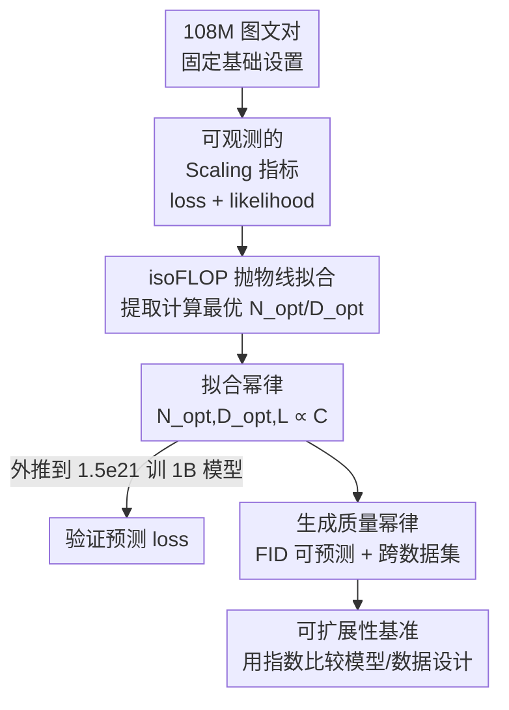

# Scaling Laws for Diffusion Transformers

**会议**: ICLR 2026  
**OpenReview**: [https://openreview.net/forum?id=T985gm4sDA](https://openreview.net/forum?id=T985gm4sDA)  
**代码**: 无  
**领域**: 扩散模型 / 文本到图像生成 / Scaling Law  
**关键词**: 扩散 Transformer, 缩放定律, 计算最优, isoFLOP, FID 预测

## 一句话总结
本文在 1e17 到 6e18 FLOPs 的计算预算范围内系统训练扩散 Transformer（DiT），首次拟合出 DiT 的显式缩放定律——预训练 loss 与计算量呈幂律关系，从而能在给定算力下精确预测最优模型规模、数据量乃至最终生成质量（FID），并验证这套幂律可外推到 1.5e21 FLOPs、可跨数据集迁移。

## 研究背景与动机
**领域现状**：在大语言模型里，缩放定律（Kaplan、Hoffmann/Chinchilla 等）早已被反复验证——预训练性能随计算量 $C$ 呈幂律下降，且 $C \approx 6ND$（$N$ 为参数量，$D$ 为数据量）。有了这条定律，就能在固定算力预算下算出"该把钱花在更大的模型还是更多的数据上"，做出最优资源分配。

**现有痛点**：扩散模型、尤其是扩散 Transformer（DiT）的可扩展性虽被反复观察到（Mei、Li 等人都发现"模型越大、视觉质量和图文对齐越好"），但这种 scaling 只是被"清楚地观察到"，却没被"精确地预测"。换句话说，大家知道堆算力有用，却写不出一条公式告诉你：给定预算应该用多大模型、喂多少数据、最终 loss 会落在哪。

**核心矛盾**：缺少显式的缩放定律，导致从计算预算到模型规模/数据量/loss 之间的映射关系是"黑箱"的。实践中只能靠启发式地反复搜索模型与数据配置，既昂贵又难以保证拿到那个最优平衡点。

**本文目标**：把 LLM 里成熟的缩放定律框架真正落到 DiT 的文本到图像预训练上，具体拆成三件事——（1）确认 DiT 训练中存在 loss-计算量幂律；（2）把预训练 loss 和生成质量指标（FID 等）挂钩；（3）证明这套定律能当成低成本的"可扩展性基准"来评估模型与数据设计。

**切入角度**：作者借鉴 LLM 的做法，但要先解决一个 DiT 特有的问题——扩散模型并不直接优化 likelihood，那"用什么指标来观察 scaling"？作者的观察是：rectified-flow 下的训练 loss（速度场匹配误差）以及多种 likelihood 代理指标，其实都随算力呈一致的幂律下降，因此训练 loss 就足以充当可观测的 scaling 指标。

**核心 idea**：用 isoFLOP（等算力）实验在大量小预算点上拟合"计算最优"配置，再把这些最优点拟合成幂律公式，从而把"算力 → 最优模型/数据 → loss → 生成质量"这条链条全部变成可预测的闭式关系。

## 方法详解

### 整体框架
本文不是提出一个新模型，而是一套**实证测量 + 幂律拟合**的研究流程，目标是把 DiT 的 scaling 行为变成可预测的公式。整体管线是：固定一套基础训练设置（Rectified Flow + v-prediction + 普通 in-context Transformer），在一组离散的计算预算 $[1e17, 3e17, 6e17, 1e18, 3e18, 6e18]$ 上、每个预算训练多个不同规模（1M~1B 参数）的模型；对每个预算下"模型规模 vs loss"的曲线拟合一条抛物线（isoFLOP），抛物线最低点就是该算力下的计算最优配置 $(N_{opt}, D_{opt})$；收集所有预算的最优点，在 log–log 坐标上拟合幂律，得到 $N_{opt}$、$D_{opt}$、$L$ 关于 $C$ 的闭式表达；最后把预算外推到 1.5e21 FLOPs 训一个约 1B 的模型来验证预测，并进一步证明生成质量（FID）和跨数据集（COCO）也服从同样的幂律。

### 关键设计

**1. 选取可观测的 scaling 指标：用速度场匹配 loss 替代 likelihood**

LLM 直接优化 next-token likelihood，所以 loss 天然是观察 scaling 的指标；但扩散模型不直接优化 likelihood，而是去匹配一个时间条件下的速度场，这就带来"该看什么指标"的问题。本文采用 Rectified Flow 公式，速度定义为 $v(x_t, t) = \alpha'_t x_0 + \beta'_t \epsilon$，在 RF 下 $\alpha_t = 1-t,\ \beta_t = t$，于是简化为 $v(x_t, t) = -x_0 + \epsilon$，训练目标是

$$L(\theta) = \mathbb{E}_{x_0, t, \epsilon}\big[\lVert v_\theta(x_t, t) + x_0 - \epsilon \rVert^2\big].$$

由于该 loss 用 Monte Carlo（采样时间步和噪声）估计、方差大，作者用 1024 的大 batch、并对 loss 值做 EMA 平滑（$\alpha_{\text{EMA}}=0.9$）来稳定曲线。除训练 loss 外，作者还测了验证 loss、用 VLB 近似的 likelihood、以及用 Neural ODE 经反向采样得到的精确 likelihood（$\log p_\theta(x) = \log p_\theta(x_T) - \int_0^T \nabla\cdot f_\theta(x_t,t)\,dt$）。关键观察是：这四个指标随算力的趋势和形状高度一致、都服从幂律，所以完全可以只用"训练时直接可读、无需额外评测步骤"的训练 loss 当主指标，大幅简化实验流程。

**2. isoFLOP 抛物线拟合：从等算力曲线提取计算最优配置并拟合幂律**

要写出缩放定律，核心是找到每个算力预算下的"计算最优"分配点。作者沿用 Chinchilla（Hoffmann et al.）的 Approach 2：固定计算预算 $C$，训练一系列不同层数（2~15 层 in-context Transformer）即不同参数量的模型，画出"模型规模 vs loss"曲线，拟合一条抛物线，抛物线最低点（紫色点）就是该预算下的最优 $(N_{opt}, D_{opt})$。把不同预算的这些最优点画到 log–log 坐标上，$\log N_{opt}$ 与 $\log D_{opt}$ 都近似随 $\log C$ 线性变化，说明背后是幂律 $N_{opt}\propto C^a$、$D_{opt}\propto C^b$。拟合结果为

$$N_{opt} = 0.0009 \cdot C^{0.5681}, \qquad D_{opt} = 186.8535 \cdot C^{0.4319}.$$

两个指数之和约为 1（与 $C=6ND$ 自洽），且模型指数（0.5681）略大于数据指数（0.4319），意味着算力增加时模型和数据要同步放大、但模型该长得稍快一点。loss 本身也拟合成 $L = 2.3943 \cdot C^{-0.0273}$。这一套之所以可信，是因为除最小的 1e17 预算外，抛物线拟合都和实测点贴合得很好。

**3. 把生成质量纳入幂律：让 FID 也随算力可预测**

scaling 定律只有连到"图好不好看"才真正有用。作者发现生成质量指标同样随算力呈幂律，FID 与训练预算的关系拟合为

$$\text{FID} = 2.2566 \times 10^6 \cdot C^{-0.234}.$$

（FID 用 CLIP ViT-L/14 特征而非传统 Inception 特征计算；此外还在附录给出 GenEval、HPSv2.1、ImageReward 等人类偏好指标的同类幂律。）有了这条曲线，就能从算力直接预测生成质量。更重要的是这种可预测性能跨数据集迁移：在 OOD 的 COCO 2014 验证集上，validation loss、VLB、精确 likelihood、FID 都随预算单调下降、形状一致，只是整体有一个垂直 offset（COCO 上绝对值更差，因为模型是在 Laion 子集上训练的）；即便 FID 的 gap 随预算扩大，COCO 上的 FID-预算关系仍是幂律，依旧可预测。

**4. 缩放定律作为可预测的"可扩展性基准"：用指数比较设计优劣**

作者把缩放定律本身当成一个低成本的评测工具：只要在一批较小的算力预算上跑 isoFLOP、拟合出指数，就能判断某个模型架构或数据管线"是否更可扩展"，而不必真的烧到大规模。判据是：固定数据时，更高效的模型应有**更小的模型指数 + 更大的数据指数**（说明它能更充分利用数据，算力该多投在数据上）；固定模型时，更优质的数据应有**更小的数据指数 + 更大的模型指数**；无论改模型还是改数据，更好的训练管线都对应**更小的 loss/FID 指数**（同样算力拿到更好性能）。作为示例，作者用这套基准对比了 Vanilla In-Context Transformer 与 Cross-Attention Transformer，发现后者 loss 下降更陡（loss 指数从 $-0.0273$ 变为 $-0.0385$）、模型指数更小，说明在给定架构内它更能从算力中受益——但作者明确强调这只是评估"某架构内的可扩展性"，并非断言 Cross-Attention 普遍优于 In-Context（Flux、SD3 的 MMDiT 等 In-Context 方案反而更强）。

## 实验关键数据

### 主实验
所有实验跑在从 Laion-Aesthetic 随机采样、并用 LLaVA-1.5 重新打标的 108M 图文对上（另从中抽 1M 作验证集），多数实验每个样本只见一次（data-infinite 设定）。核心结论是拟合出的幂律：

| 关系 | 拟合公式 | 含义 |
|------|----------|------|
| 最优模型规模 | $N_{opt}=0.0009\cdot C^{0.5681}$ | 算力越多，最优参数量幂律增长 |
| 最优数据量 | $D_{opt}=186.8535\cdot C^{0.4319}$ | 数据需与模型同步放大，但稍慢 |
| 训练 loss | $L=2.3943\cdot C^{-0.0273}$ | loss 随算力幂律下降 |
| 生成 FID | $\text{FID}=2.2566\times10^6\cdot C^{-0.234}$ | 生成质量随算力可预测提升 |

**外推验证**：按上述公式，1.5e21 FLOPs 对应的计算最优模型约 958.3M 参数。作者据此真训了一个约 1B 的模型，其实测训练 loss 与公式预测值高度吻合（FID 的预测点也几乎落在拟合曲线上），证明缩放定律可以可靠外推到比拟合区间大三个数量级以上的算力。

### 消融 / 分析实验
用"缩放指数对比"作为可扩展性基准，比较两种条件注入架构：

| 模型 | 模型指数 | 数据指数 | loss 指数 |
|------|---------|---------|-----------|
| Vanilla In-Context | 0.56 | 0.43 | −0.0273 |
| Cross-Attention | 0.54 | 0.46 | −0.0385 |

Cross-Attention 的 loss 指数绝对值更大（下降更快）、模型指数更小，按基准判据属于"在该架构内更可扩展"。此外作者还在附录消融了 Logit-Normal 时间步采样、loss 的 EMA 系数、EMA 模型、data-constrained（ImageNet）设定等，均不改变 scaling 趋势、只影响系数。

### 关键发现
- **趋势 vs 系数解耦**：训练技巧、架构细节、是否数据受限等只影响缩放定律的系数，不改变"幂律"这一趋势本身——这让结论具有相当强的普适性。
- **多指标一致**：训练 loss、验证 loss、VLB、精确 likelihood、FID 在 scaling 下趋势/形状一致，因此可用最廉价、可在线读取的训练 loss 当主指标。
- **跨域可迁移**：在 OOD 的 COCO 上各指标仍服从幂律，只是有恒定（loss/VLB/likelihood）或随预算扩大（FID）的垂直 offset，说明绝对值受数据分布影响、但可预测性不变。
- **模型略快于数据**：模型指数（~0.57）> 数据指数（~0.43），提示在该设定下扩模型比扩数据稍微更划算。

## 亮点与洞察
- **把"扩散没有 likelihood"这道坎绕过去了**：直接验证 RF 训练 loss 与多种 likelihood 代理指标 scaling 趋势一致，于是只用训练 loss 就能观察 scaling，省掉昂贵的 likelihood 评测——这是把 LLM scaling 范式搬到扩散模型最关键的一步。
- **缩放定律当"廉价显微镜"**：用小预算 isoFLOP 拟合出的指数去判断架构/数据设计是否可扩展，避免每个设计都烧到大规模才能下结论，这个"可预测基准"的用法比单纯拟合一条曲线更有工程价值。
- **生成质量也可预测**：把 FID/GenEval/人类偏好都纳入幂律，等于给"算力 → 出图质量"建立了闭式映射，能在花钱前估算回报。
- **可迁移 trick**：isoFLOP + 抛物线取最优点 + log-log 幂律拟合这套流程，可直接迁移到视频扩散、3D 生成等其他 DiT 任务上评估其可扩展性。

## 局限与展望
- **算力区间偏小**：拟合主要在 1e17~6e18 FLOPs，虽外推到 1.5e21 得到验证，但相比工业级模型仍偏小，系数能否在更大规模继续稳定有待观察。
- **系数依赖具体设置**：作者自己承认训练技巧/架构会改变系数，公式里的具体数字（如 0.5681、−0.234）是"在本文设定下"的，迁移到别的分辨率、VAE、数据管线时需重新拟合。
- **FID 的 OOD gap 会扩大**：跨数据集时 FID 的垂直 offset 随预算变大，意味着用单一域拟合的 FID 公式去预测另一域的绝对值需谨慎，只有趋势可靠。
- **架构对比不充分**：In-Context vs Cross-Attention 的结论被作者明确限定为"架构内可扩展性"，并非普适优劣，读者不应据此选型。
- **未覆盖采样/蒸馏阶段**：全篇聚焦预训练 loss 与质量，对推理期加速、蒸馏后模型的 scaling 行为未涉及。

## 相关工作与启发
- **vs Kaplan / Hoffmann（LLM 缩放定律）**: 他们在自回归 LLM 上建立 $C=6ND$ 与幂律，本文把同一套 isoFLOP（Approach 2）方法论搬到扩散 Transformer，区别在于必须先解决"扩散无直接 likelihood、该用什么指标"的问题，并把 loss 进一步连到生成质量 FID。
- **vs Mei et al. / Li et al.（扩散可扩展性实证）**: 他们观察到"模型越大越好"但未给出显式公式，本文首次写出 DiT 的闭式幂律，从"观察到 scaling"推进到"精确预测 scaling"。
- **vs Esser et al.（SD3 / MMDiT）**: SD3 报告过 DiT loss 是模型质量的强预测器、并比较了 In-Context 与 Cross-Attention，本文进一步把这种比较形式化为"用缩放指数评估可扩展性"的基准，并提醒不要把架构对比误读为普适优劣。

## 评分
- 新颖性: ⭐⭐⭐⭐ 首次给出 DiT 的显式缩放定律并连到生成质量，方法论虽借自 LLM 但落地扩散非平凡
- 实验充分度: ⭐⭐⭐⭐ 横跨多个数量级算力、多指标/多数据集验证 + 大预算外推实证，附录消融丰富
- 写作质量: ⭐⭐⭐⭐ 逻辑清晰、公式与结论对应明确，对结论适用边界有诚实的限定
- 价值: ⭐⭐⭐⭐⭐ 为文本到图像 DiT 的算力/数据预算决策提供可预测的工程依据，实用性强

<!-- RELATED:START -->

## 相关论文

- [\[ICLR 2026\] Routing Matters in MoE: Scaling Diffusion Transformers with Explicit Routing Guidance](routing_matters_in_moe_scaling_diffusion_transformers_with_explicit_routing_guid.md)
- [\[NeurIPS 2025\] Scaling Diffusion Transformers Efficiently via μP](../../NeurIPS2025/image_generation/scaling_diffusion_transformers_efficiently_via_μp.md)
- [\[ICLR 2026\] Rethinking Global Text Conditioning in Diffusion Transformers](rethinking_global_text_conditioning_in_diffusion_transformers.md)
- [\[ICLR 2026\] A Hidden Semantic Bottleneck in Conditional Embeddings of Diffusion Transformers](a_hidden_semantic_bottleneck_in_conditional_embeddings_of_diffusion_transformers.md)
- [\[ICLR 2026\] MADFormer: Mixed Autoregressive and Diffusion Transformers for Continuous Image Generation](textitmadformer_mixed_autoregressive_and_diffusion_transformers_for_continuous_i.md)

<!-- RELATED:END -->
